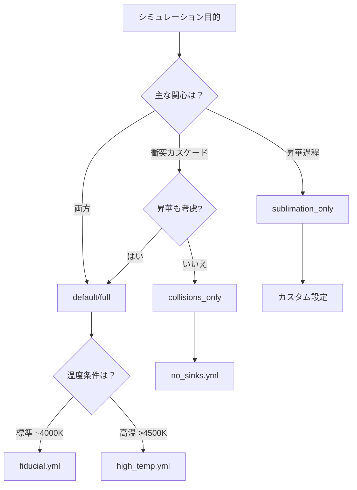

# 設定ファイルガイド

> **目的**: シミュレーション設定の構造・物理的意味・整合性ルールを体系的に解説する

---

## 🚀 クイックスタート：5分で動かす

### Step 1: シナリオをコピー

```bash
cp configs/scenarios/fiducial.yml configs/my_run.yml
```

### Step 2: 温度を変更（オプション）

```yaml
# configs/my_run.yml の radiation セクション
radiation:
  TM_K: 4500  # 火星赤外温度を 4000K → 4500K に変更
```

### Step 3: 実行

```bash
python -m marsdisk.run --config configs/my_run.yml
```

### Step 4: 結果確認

```bash
ls out/my_run/
# series/*.parquet  - 時系列データ
# summary.json      - 集計結果
# checks/           - 検証ログ
```

> 💡 **ヒント**: `configs/scenarios/` には目的別のテンプレートがあります。
> 自分の研究目的に近いシナリオから始めるのが最も効率的です。

---

## 📋 目次

1. [概要：設定構造の全体像](#1-概要設定構造の全体像)
2. [廃止予定・非推奨フィールド](#2-廃止予定非推奨フィールドの一覧)
3. [設定グループ別解説](#3-設定グループ別解説)
4. [最小構成の例](#4-最小構成の例)
5. [移行ガイド](#5-移行ガイド)
6. [シナリオ選択ガイド](#6-シナリオ選択ガイド)
7. [トラブルシューティング](#7-トラブルシューティング)
8. [検証ツール](#8-検証ツール)
9. [参考資料](#9-参考資料)

---

## 1. 概要：設定構造の全体像

### 1.1 設定の階層と責務

```text
configs/<scenario>.yml
├── geometry          # 空間次元（0D/1D）。軌道半径は disk.geometry 側で指定
├── scope             # 解析窓の長さ（years）
├── physics_mode      # 物理モード（統一された指定方法）
├── chi_blow          # ブローアウト時間スケール倍率
├── material          # 物質パラメータ
├── sizes             # サイズビン定義
├── initial           # 初期条件
├── dynamics          # 速度分散モデル
├── psd               # 粒径分布パラメータ
├── qstar             # 破砕強度モデル
├── disk              # 円盤幾何（0D では必須）
├── inner_disk_mass   # 質量正規化
├── surface           # 表層モデル
├── supply            # 外部供給（modeごとに分岐）
├── sinks             # 消失過程（昇華・ガス抗力）
├── radiation         # 放射圧（温度パラメータの統一先）
├── shielding         # 自遮蔽
├── phase             # 相状態判定（entrypoint 統一済み）
├── blowout           # 表層ブローアウトの挙動
├── phase5/process    # 追加診断・比較ラン用のトグル
├── numerics          # 数値パラメータ
├── diagnostics       # 追加ダイアグノスティクス
└── io                # 入出力設定
```

### 1.2 シナリオベースの設定管理

`configs/scenarios/` ディレクトリに、物理的前提ごとのシナリオファイルを配置：

| シナリオ | 説明 | 主な用途 |
|---------|------|---------|
| `fiducial.yml` | Gas-poor, 衝突支配（標準） | ベースライン、パラメータスタディ |
| `high_temp.yml` | 高温円盤、昇華強化 | 初期高温環境の進化 |
| `gas_rich.yml` | TL2003 有効（非標準） | 感度試験のみ |
| `no_sinks.yml` | シンク無効、純粋衝突 | コード検証 |

---

## 2. 廃止予定・非推奨フィールドの一覧

以下のフィールドは**スキーマで即時エラーとなるため使用不可**です（後方互換の警告レベルではありません）。

| 使用不可フィールド | 推奨される代替 | 理由 |
|-------------------|---------------|------|
| `temps.T_M` | `radiation.TM_K` または `radiation.mars_temperature_driver.constant.value_K` | 温度パラメータを radiation へ統合 |
| `single_process_mode` | `physics_mode` | 物理モード指定の統合 |
| `modes.single_process` | `physics_mode` | 物理モード指定の統合 |
| `process.primary` | `physics_mode` | 物理モード指定の統合 |
| `geometry.r` | `disk.geometry.r_in_RM / r_out_RM` | 軌道半径指定の統合 |
| `geometry.runtime_orbital_radius_rm` | `disk.geometry.r_in_RM / r_out_RM` | 軌道半径指定の統合 |
| `phase.map.entrypoint` / `phase.map` | `phase.entrypoint` | 二重構造の解消 |
| `radiation.qpr_table` | `radiation.qpr_table_path` | フィールド名を正規化 |
| `shielding.phi_table` | `shielding.table_path` | フィールド名を正規化 |

---

## 3. 設定グループ別解説

### 3.0 物理パラメータ完全一覧

以下は**現行スキーマ**で有効な全パラメータの体系的一覧です。フィールド名は `marsdisk/schema.py` の定義に揃えています。

### 3.1 パラメータ→参考文献クロスリスト

`analysis/references.registry.json` に登録済みの文献キーと、主要パラメータの対応を以下にまとめました。物理値の根拠を確認する際は、この表を起点に該当セクションへ飛んでください。

| パラメータ群 (代表フィールド) | 根拠/典型値 | 参考文献 (registry key) |
| --- | --- | --- |
| `radiation.TM_K`, `mars_temperature_driver.*` | 衝突直後に 4000 K 近傍から放射冷却する火星スラブ解を採用 | [@Hyodo2017a_ApJ845_125; @Hyodo2018_ApJ860_150] |
| `radiation.qpr_table_path`, `Q_pr`, `freeze_kappa` | Mie 理論で波長積分した ⟨Q_pr⟩ テーブルを既定とし、灰色体近似は Burns 型 β 式の検証用 | [@BohrenHuffman1983_Wiley; @Blanco1976_ApSS41_447; @Draine2003_SaasFee32; @Hocuk2017_AA604_A58; @Burns1979_Icarus40_1] |
| `chi_blow`, `blowout.*`, `sizes.s_min` | β≥0.5 を閾値とする blow-out と滞在時間 $t_{\rm blow}=1/\Omega$ を採用 | [@Burns1979_Icarus40_1; @StrubbeChiang2006_ApJ648_652] |
| `blowout.gate_mode`, `blowout.layer`, `blowout.target_phase` | 衝突支配ディスクで表層（τ≲1）の小粒子を優先的に吹き飛ばす設定を基準とし、昇華・衝突で既に損失している場合にゲートで抑制 | [@StrubbeChiang2006_ApJ648_652; @WyattClarkeBooth2011_CeMDA111_1; @KrijtKama2014_AA566_L2] |
| `sizes.n_bins`, `psd.alpha`, `psd.wavy_strength`, `psd.floor.*` | Dohnanyi 型カスケードの平衡傾き $q\simeq3.5$（α≈1.83）を基準に、blow-out 起源の “wavy” を感度パラメータ化しつつ、粒径比 $(a_{i+1}/a_i)\lesssim1.1$–1.3 を維持するビン分解能を採用 | [@Dohnanyi1969_JGR74_2531; @Birnstiel2011_AA525_A11; @Krivov2006_AA455_509; @ThebaultAugereau2007_AA472_169] |
| `dynamics.f_wake`, `e0/i0`, `t_damp_orbits`, `kernel_ei_mode` | Ohtsuki 型の速度分散平衡 $c_{\rm eq}$ と高さスケール $H\simeq ia$ をベースに wake 係数で調整 | [@Ohtsuki2002_Icarus155_436] |
| `qstar.*` (`Qs`, `a_s`, `B`, `b_g`, `v_ref_kms`) | バザルト衝突の $Q_D^*$ を Benz & Asphaug (1999) から採用し、速度依存は Stewart&Leinhardt (2009) と LS12 の補間 | [@BenzAsphaug1999_Icarus142_5; @StewartLeinhardt2009_ApJ691_L133; @LeinhardtStewart2012_ApJ745_79] |
| `supply.*`, `mixing.epsilon_mix` | 外部供給をサイズ別源項 S(a,r,t) として与え、バリスティック混合効率を ε_mix でパラメータ化 | [@WyattClarkeBooth2011_CeMDA111_1; @Wyatt2008; @EstradaDurisen2015_Icarus252_415; @CuzziEstrada1998_Icarus132_1] |
| `shielding.mode`, `shielding.table_path`, `shielding.fixed_tau1_*` | Φ(τ,ω₀,g) テーブルを δ–Eddington/HG 近似から取得し、τ≳1 では Σ_{τ=1} でクリップ | [@Joseph1976_JAS33_2452; @HansenTravis1974_SSR16_527; @CogleyBergstrom1979_JQSRT22_267; @Chandrasekhar1960_RadiativeTransfer] |
| `sinks.sub_params.*`, `sinks.T_sub`, `sinks.mu`, `sinks.alpha_evap` | SiO/SiO₂ の HKL 昇華係数と閾値を Hyodo18 の温度域・Pignatale18 の組成・Melosh/Bruning/Ojovan の相変化データに合わせる | [@Hyodo2018_ApJ860_150; @Pignatale2018_ApJ853_118; @Melosh2007_MPS42_2079; @Bruning2003_JNCS330_13; @Ojovan2021_Materials14_5235] |
| `phase.thresholds.*`, `phase.entrypoint` | ガラス転移と液相線 1475/1986 K を閾値にした SiO₂ 状態判定 | [@Bruning2003_JNCS330_13; @Ojovan2021_Materials14_5235] |
| `disk.geometry.r_in_RM`, `r_out_RM` | ロッシュ限界内の低質量リングを前提に 2.2–2.7 R_Mars を基準設定 | [@CridaCharnoz2012_Science338_1196; @CanupSalmon2018_SciAdv4_eaar6887] |
| `inner_disk_mass.use_Mmars_ratio`, `inner_disk_mass.map_to_sigma` | ロッシュ内リングの質量を M_disk/M_Mars から Σ(r) へ写像する簡略モデル | [@CridaCharnoz2012_Science338_1196; @SalmonCanup2010_Icarus208_33; @SalmonCanup2012_ApJ760_83; @Kuramoto2024] |
| `sinks.enable_gas_drag`, `ALLOW_TL2003` | gas-poor を既定とし、gas-rich 感度試験時のみ TL2003 表層流出や drag を検討 | [@Hyodo2018_ApJ860_150; @CanupSalmon2018_SciAdv4_eaar6887; @TakeuchiLin2003_ApJ593_524; @PollackBurnsTauber1979_Icarus37_587; @Hunten1979_Icarus37_113; @Olofsson2022_MNRAS513_713] |

#### 🌡️ 放射・温度関連 (`radiation`)

火星からの赤外放射が粒子に与える放射圧と、それに伴う blow-out（小粒子の吹き飛ばし）を制御します。

| パラメータ | 型 | 物理的意味 | 典型値 |
|-----------|-----|-----------|--------|
| `radiation.source` | `"mars"` / `"off"` | 放射源の選択。`"mars"` は火星表面からの赤外放射を考慮し、`"off"` は放射圧を無効化 | `"mars"` |
| `radiation.TM_K` | float | 火星表面の有効温度 [K]。Stefan-Boltzmann則で放射フラックスを決定（driver を使わない場合は必須） | 4000 |
| `radiation.use_mars_rp` | bool | 火星放射圧の有効化フラグ。`false` にすると放射圧による加速を無視 | `true` |
| `radiation.freeze_kappa` | bool | ⟨Q_pr⟩ を固定するかどうか | `false` |
| `radiation.qpr_table_path` | Path | Planck平均した放射圧効率 ⟨Q_pr⟩(s,T) のルックアップテーブル。Mie理論に基づく波長積分済みの値。フィールド名は `qpr_table_path`（`qpr_table` は使用不可） | `null` (必要に応じ指定) |
| `radiation.Q_pr` | float | 灰色体近似での放射圧効率（テーブル不使用時）。通常は波長依存性があるためテーブル推奨 | - |

補足: ⟨Q_pr⟩ テーブルの近似と SiO₂ への妥当性
- 同梱の `data/qpr_table.csv` は材料固有の屈折率を使わず、サイズパラメータ $x=2\pi s/\lambda$ に対する Rayleigh–幾何ブリッジ $Q_{\rm pr}=x^4/(1+x^4)$ を 0.5–30 µm で黒体加重積分した汎用近似。Q_abs ではなく放射圧効率そのものを近似している。
- μm 級以上のシリケイト（SiO₂ を含む）では Mie 計算・実験の典型値が $Q_{\rm pr}\sim1$ で飽和するため、現行テーブルでもオーダー感は整合的。一方で 0.1 µm 前後の最小粒では Mie 計算よりやや小さめを返す可能性がある。
- SiO₂ 固有の挙動を重視する場合は、複素屈折率から作成した Mie ベースの ⟨Q_pr⟩ テーブルを別途生成し、`radiation.qpr_table_path` で差し替える。

##### 時変温度ドライバ (`radiation.mars_temperature_driver`)

火星表面温度の時間発展を扱います。衝突直後の高温状態から放射冷却で温度が下がる過程をモデル化。

| パラメータ | 型 | 物理的意味 | 典型値 |
|-----------|-----|-----------|--------|
| `.enabled` | bool | 時変温度モデルの有効化。`false` なら `TM_K` を定数として使用 | `false` |
| `.mode` | `"constant"` / `"table"` | `"constant"` は固定温度、`"table"` は時系列テーブルから補間 | `"constant"` |
| `.table.path` | Path | 温度時系列CSVのパス。SiO₂冷却モデルなどから生成 | `"data/mars_temperature_T4000p0K.csv"` |
| `.table.time_unit` | str | テーブルの時間単位。`"orbit"` は軌道周期でスケール | `"s"` |
| `.table.column_time` | str | 時間列の列名 | `"time"` |
| `.table.column_temperature` | str | 温度列の列名 | `"T_M"` |
| `.autogenerate.enabled` | bool | テーブルが存在しない場合に自動生成するか | `false` |
| `.autogenerate.output_dir` | Path | 自動生成テーブルの出力先 | `"data"` |
| `.autogenerate.dt_hours` | float | 自動生成時の時間解像度 [hours] | 1.0 |
| `.autogenerate.min_years` | float | 自動生成テーブルの最小期間 [years] | 2.0 |
| `.autogenerate.time_margin_years` | float | シミュレーション終了後のマージン [years] | 0.2 |

#### 💨 昇華・シンク関連 (`sinks`)

粒子の消失メカニズム（昇華・ガスドラッグなど）を制御します。高温環境での SiO₂ 昇華が主要なシンク。

| パラメータ | 型 | 物理的意味 | 典型値 |
|-----------|-----|-----------|--------|
| `sinks.mode` | `"none"` / `"sublimation"` | シンク機構全体の有効化。`"none"` は全シンク無効（純粋衝突のみ） | `"sublimation"` |
| `sinks.enable_sublimation` | bool | 昇華過程の個別スイッチ | `true` |
| `sinks.sublimation_location` | str | 昇華が作用する場所。`"surface"` は表層ODE、`"smol"` はSmoluchowski積分器内、`"both"` は併用 | `"surface"` |
| `sinks.T_sub` | float | 昇華が顕著になる閾値温度 [K]。これ以上で急速な質量損失が始まる | 1300 |
| `sinks.enable_gas_drag` | bool | ガスドラッグの有効化。gas-poor 条件では通常 `false` | `false` |

gas-poor を前提とする基準設定では、ガス密度 ρ_g が衝突寿命より十分低く、Olofsson et al. (2022) が示すように drag 時間が衝突時間を超える場合は `enable_gas_drag=false` とする [@Olofsson2022_MNRAS513_713; @Kuramoto2024]。一方、Pollack, Burns & Tauber (1979) や Hunten (1979) が扱う原始ガス包絡・厚い大気のように drag 捕獲が起こる密度域では、別途 ρ_g を指定した感度試験で有効化する [@PollackBurnsTauber1979_Icarus37_587; @Hunten1979_Icarus37_113]。

##### 昇華パラメータ (`sinks.sub_params`)

Hertz-Knudsen-Langmuir (HKL) 理論に基づく昇華速度の詳細パラメータ。

| パラメータ | 型 | 物理的意味 | 典型値 |
|-----------|-----|-----------|--------|
| `.mode` | str | 昇華モデル。`"hkl"` は HKL 理論、`"logistic"` は簡易シグモイド関数 | `"hkl"` |
| `.alpha_evap` | float | 蒸発係数（0–1）。表面から実際に蒸発する分子の割合。SiO₂ では ~0.007 と低い | 0.007 |
| `.mu` | float | 蒸発種の分子量 [kg/mol]。SiO₂ なら 0.060 kg/mol、SiO なら 0.044 kg/mol | 0.0440849 |
| `.A` | float | Clausius-Clapeyron 式の係数 A（$\log_{10} P_{\rm sat} = A - B/T$）。飽和蒸気圧の温度依存性を決定 | 13.613 |
| `.B` | float | Clausius-Clapeyron 式の係数 B [K]。蒸発潜熱に比例する値 | 17850 |
| `.enable_liquid_branch` | bool | psat を液相係数へ切替（スイッチ温度以上で有効） | `true` |
| `.psat_liquid_switch_K` | float? | 液相係数への切替温度 [K]。`null` なら固体のみ | 1900 |
| `.A_liq` | float | 液相用 Clausius A（融液 SiO₂ 蒸気圧フィット） | 13.203 |
| `.B_liq` | float | 液相用 Clausius B [K]（Fegley & Schaefer / Visscher & Fegley） | 25898.9 |
| `.valid_liquid_K` | tuple? | 液相フィットの有効温度域 [K] | `(1900, 3500)` |
| `.dT` | float | ロジスティックモードでの遷移幅 [K]。T_sub 周辺での昇華率の立ち上がり幅 | 50.0 |
| `.eta_instant` | float | ロジスティックモードでの瞬時損失分率（0–1） | 0.1 |
| `.P_gas` | float | 周囲ガス圧 [Pa]。昇華を抑制する背圧。真空では 0 | 0.0 |

#### 🌬️ 表層ブローアウト (`blowout`)

| パラメータ | 型 | 物理的意味 | 典型値 |
|-----------|-----|-----------|--------|
| `enabled` | bool | 表層ブローアウトの有効/無効 | `true` |
| `target_phase` | `"solid_only"` / `"any"` | ブローアウト対象の相 | `"solid_only"` |
| `layer` | `"surface_tau_le_1"` / `"full_surface"` | どの表層リザーバーを削減するか | `"surface_tau_le_1"` |
| `gate_mode` | `"none"` / `"sublimation_competition"` / `"collision_competition"` | 他シンクとの競合による抑制 | `"none"` |

衝突支配の gas-poor 円盤では、Strubbe & Chiang (2006) が示す type B（衝突支配）像にならい、ブローアウトは表層の τ≲1 スキンで最も強く効くため `layer="surface_tau_le_1"` を基準とし、固相の微粒子だけを対象にする [@StrubbeChiang2006_ApJ648_652]。`gate_mode` は Wyatt, Clarke & Booth (2011) の源・損失バランスを踏まえ、昇華や衝突で既に削られている場合は表層吹き飛びを抑えるための競合ゲートであり、最小粒径がブローアウトで決まる条件を Krijt & Kama (2014) に合わせて切り替える [@WyattClarkeBooth2011_CeMDA111_1; @KrijtKama2014_AA566_L2]。

#### 🔵 円盤ジオメトリ (`disk.geometry`)

ダスト円盤の空間的範囲を火星半径単位で指定。ロッシュ限界（~2.4 R_Mars）付近が対象。0D 実行では `disk.geometry` の指定が必須。

| パラメータ | 型 | 物理的意味 | 典型値 |
|-----------|-----|-----------|--------|
| `r_in_RM` | float | 円盤内縁の軌道半径 [Mars半径]。火星表面に近いほど高温・短周期 | 2.2 |
| `r_out_RM` | float | 円盤外縁の軌道半径 [Mars半径]。ロッシュ限界を超えると衛星形成領域 | 2.7 |
| `r_profile` | str | 表面密度の半径依存性。`"uniform"` は一様、`"powerlaw"` は Σ ∝ r^(-p) | `"uniform"` |
| `p_index` | float | べき乗則の指数 p。p=0 で一様、p>0 で内側が高密度 | 0.0 |

#### 📏 解析窓 (`scope`)

| パラメータ | 型 | 物理的意味 | 典型値 |
|-----------|-----|-----------|--------|
| `region` | `"inner"` | 対象領域のラベル（Phase 0 では固定） | `"inner"` |
| `analysis_years` | float | 集計対象とする期間 [years] | 2.0 |

#### 💨 ブローアウト時定数スケール (`chi_blow`)

| パラメータ | 型 | 物理的意味 | 典型値 |
|-----------|-----|-----------|--------|
| `chi_blow` | float / `"auto"` | ブローアウト時間 $t_{\rm blow}$ の倍率。`"auto"` で β と ⟨Q_pr⟩ に基づき推定 | 1.0 |

#### 🪨 物質特性 (`material`)

粒子の物質パラメータ。SiO₂ ガラスを標準物質と想定。

| パラメータ | 型 | 物理的意味 | 典型値 |
|-----------|-----|-----------|--------|
| `rho` | float | 粒子のバルク密度 [kg/m³]。質量-サイズ変換、重力パラメータ、光学的厚さ計算に使用。SiO₂ ガラスで ~2200、玄武岩で ~3000 | 3000 |

#### 📊 サイズ分布 (`sizes`, `psd`)

粒径分布（PSD: Particle Size Distribution）の離散化とべき乗則パラメータ。

| パラメータ | 型 | 物理的意味 | 典型値 |
|-----------|-----|-----------|--------|
| `s_min` | float | 追跡する最小粒径 [m]。blow-out サイズ $a_{\rm blow}$ 以下の粒子は即座に系外へ | 1.0e-6 |
| `s_max` | float | 追跡する最大粒径 [m]。衝突カスケードの上限。大きいほど計算コスト増 | 3.0 |
| `n_bins` | int | 対数空間でのサイズビン数。解像度と計算コストのトレードオフ。30–60 が推奨 | 40 |
| `alpha` | float | 定常 PSD のべき指数。Dohnanyi (1969) の衝突平衡では α≈1.83（n(s)∝s^(-2-3α)） | 1.83 |
| `wavy_strength` | float | "wavy" PSD 補正の強度。blow-out 境界付近での波状構造（Campo Bagatin 1994）を再現 | 0.0（基準） / 0.2（感度） |

`s_min=1.0e-6` m, `s_max=3` m, `n_bins=40` では隣接粒径比 $(a_{i+1}/a_i)\approx1.26$ となり、Birnstiel et al. が推奨する $(a_{i+1}/a_i\lesssim1.1$–1.2) や Krivov et al. が用いた ≈1.3 の格子幅の範囲に収まるため、wavy を明示的に解像しない設定でも衝突カスケードの滑らかな斜面を確保できる [@Birnstiel2011_AA525_A11; @Krivov2006_AA455_509]。wavy_strength=0.0 を基準とし、wavy を再現する感度試験では Thébault & Augereau (2007) が示す blow-out 付近の波状構造を意識してビン数を増減させる。基準の傾き α は Dohnanyi (1969) の自己相似カスケードに合わせている [@ThebaultAugereau2007_AA472_169; @Dohnanyi1969_JGR74_2531]。

#### 🚀 初期条件 (`initial`, `inner_disk_mass`)

シミュレーション開始時の質量分布を設定。

| パラメータ | 型 | 物理的意味 | 典型値 |
|-----------|-----|-----------|--------|
| `mass_total` | float | 初期総質量（火星質量比）。巨大衝突後の円盤質量の推定値に基づく | 1.0e-5 |
| `s0_mode` | str | 初期 PSD の形状。`"upper"` は大粒子に集中、`"mono"` は単一サイズ | `"upper"` |
| `M_in_ratio` | float | 内部円盤質量と火星質量の比。Σ の正規化に使用 | 3.0e-5 |

`map_to_sigma="analytic"` は、Crida & Charnoz (2012) のロッシュ内リング拡散モデルや Salmon & Canup (2010, 2012) の流体ディスク近似を簡略化し、M_in_ratio で与えた総質量を一様または冪分布の Σ(r) に割り付ける [@CridaCharnoz2012_Science338_1196; @SalmonCanup2010_Icarus208_33; @SalmonCanup2012_ApJ760_83]。Kuramoto (2024) が整理した gas-poor リサイクルシナリオ（M_disk/M_Mars ≲ 10⁻⁴）に合うよう、基準値を 10⁻⁵–10⁻⁴ の範囲で設定する [@Kuramoto2024]。

#### ⚡ 力学 (`dynamics`)

粒子の軌道力学パラメータ。衝突速度と衝突頻度を決定。

| パラメータ | 型 | 物理的意味 | 典型値 |
|-----------|-----|-----------|--------|
| `e0` | float | 初期軌道離心率。衝突速度 $v_{\rm rel} \sim e \cdot v_K$ を決定。高いほど破壊的衝突が増加 | 0.5 |
| `i0` | float | 初期軌道傾斜角 [rad]。円盤の幾何学的厚さ H ∼ i·r を決定 | 0.05 |
| `t_damp_orbits` | float | 速度分散のダンピング時間スケール [軌道周期]。衝突による運動量交換で e,i が減衰 | 20 |
| `f_wake` | float | 自己重力ウェイク増幅係数。光学的に厚い円盤で速度分散が増幅される効果（Ohtsuki型） | 2.0 |
| `kernel_ei_mode` | str | 衝突カーネルの e,i 決定法。`"config"` は設定値使用、`"wyatt_eq"` は平衡解を計算 | `"config"` |

#### 💥 破壊強度 (`qstar`)

衝突破壊の閾値を決める強度法則。Leinhardt & Stewart (2012) に基づく。

| パラメータ | 型 | 物理的意味 | 典型値 |
|-----------|-----|-----------|--------|
| `Qs` | float | 強度レジームの基準強度 [J/kg]。小粒子の分子間結合で決まる | 3.5e7 |
| `a_s` | float | 強度レジームのサイズべき指数。Q*_D ∝ s^(-a_s) で小粒子ほど強い | 0.38 |
| `B` | float | 重力レジームの係数 [J/kg]。大粒子では自己重力が支配的 | 0.3 |
| `b_g` | float | 重力レジームのサイズべき指数。Q*_D ∝ s^(b_g) で大粒子ほど強い | 1.36 |
| `v_ref_kms` | list | 参照衝突速度 [km/s]。Q*_D の速度依存性補正に使用 | [1.0, 5.0] |

#### 🧊 相状態 (`phase`)

固相・気相の判定と相転移の閾値。SiO₂ の凝縮・蒸発を制御。

| パラメータ | 型 | 物理的意味 | 典型値 |
|-----------|-----|-----------|--------|
| `enabled` | bool | 相状態分岐の有効化。`false` なら常に固相として扱う | `true` |
| `source` | str | 相判定の方法。`"threshold"` は温度閾値、`"map"` は外部ルックアップ | `"threshold"` |
| `T_condense_K` | float | 凝縮温度 [K]。これ以下で蒸気→固体への相転移が起こる | 1700 |
| `T_vaporize_K` | float | 蒸発温度 [K]。これ以上で固体→蒸気への相転移が支配的 | 2000 |

#### ⏱️ 数値積分 (`numerics`)

時間積分の制御パラメータ。IMEX-BDF スキームの設定。

| パラメータ | 型 | 物理的意味 | 典型値 |
|-----------|-----|-----------|--------|
| `t_end_years` | float | シミュレーション総時間 [years]。`t_end_orbits` と排他 | 2.0 |
| `t_end_orbits` | float | シミュレーション総時間 [orb]。`t_end_years` と排他 | - |
| `dt_init` | float/str | 初期時間ステップ [s]。`"auto"` で衝突時間スケールから自動設定 | 60000.0 |
| `safety` | float | 適応時間ステップの安全係数。dt ≤ safety × min(t_coll) を維持 | 0.1 |
| `atol` | float | 絶対許容誤差。質量保存の精度に影響 | 1e-10 |
| `rtol` | float | 相対許容誤差。PSD 形状の精度に影響 | 1e-6 |
| `eval_per_step` | bool | 毎ステップ ⟨Q_pr⟩ や ds/dt を再計算するか | `true` |
| `dt_over_t_blow_max` | float | dt/t_blow の警告閾値（null で無効） | `null` |

#### 📁 出力制御 (`io`)

シミュレーション結果の出力設定。

| パラメータ | 型 | 物理的意味 | 典型値 |
|-----------|-----|-----------|--------|
| `outdir` | Path | 出力ディレクトリ。series/, checks/, summary.json などが格納される | `"out"` |
| `quiet` | bool | INFO ログの抑制。バッチ実行時に便利 | `false` |
| `progress.enable` | bool | CLI プログレスバーの表示 | `false` |
| `debug_sinks` | bool | シンク詳細ログの出力。デバッグ用 | `false` |

---

### 3.1 `physics_mode` — 物理モード（推奨）

| 値 | 説明 | 有効な物理過程 |
|----|------|---------------|
| `"default"` | 複合モード（標準） | 衝突 + 昇華 + blow-out |
| `"sublimation_only"` | 昇華のみ | 昇華シンクのみ（衝突・blow-out無効） |
| `"collisions_only"` | 衝突のみ | 衝突 + blow-out（昇華シンク無効） |

**例（推奨形式）:**

```yaml
physics_mode: "default"  # または "sublimation_only" / "collisions_only"
```

### 3.2 `geometry` — 空間モード

| キー | 型 | 説明 | 推奨 |
|------|-----|------|------|
| `mode` | `"0D"` / `"1D"` | 空間次元 | ✓ |
| `r` | float | 軌道半径 [m]（使用不可） | ✗ |
| `runtime_orbital_radius_rm` | float | 軌道半径 [R_Mars]（使用不可） | ✗ |

**推奨**: 軌道半径は `disk.geometry` で指定（0D では必須）。`geometry.r_in/r_out` は 1D グリッド用にのみ使用。

### 3.3 `disk.geometry` — 円盤幾何（推奨）

| キー | 型 | 単位 | 説明 |
|------|-----|------|------|
| `r_in_RM` | float | R_Mars | 内縁半径 |
| `r_out_RM` | float | R_Mars | 外縁半径 |
| `r_profile` | str | - | `"uniform"` / `"powerlaw"` |
| `p_index` | float | - | べき指数（Σ ∝ r^-p） |

**例:**

```yaml
disk:
  geometry:
    r_in_RM: 2.2
    r_out_RM: 2.7
```

### 3.4 `supply` — 外部供給（簡略化済み）

選択したモードのパラメータのみ記述すれば OK。他はデフォルト値が使用されます。`mode` は `"const"` / `"table"` / `"powerlaw"` / `"piecewise"` から選択でき、全モードに共通で `mixing.epsilon_mix` を指定可能です。

**μ から供給率を決める補助CLI（オプション）**

- 内部ディスク→表層の定常供給を無次元 μ で指定したい場合は、`tools/derive_supply_rate.py` を使って定数供給率 `supply.const.prod_area_rate_kg_m2_s` を生成できる。
- 基本形:  
  `python -m tools.derive_supply_rate --mu 0.3 --sigma-tau1 1.0 --t-blow 1000 --epsilon-mix 1.0`
- YAML 生成: `--format yaml` を付けると `supply: { mode: "const", const: { prod_area_rate_kg_m2_s: ... } }` を出力。
- デフォルト源: `--config <yaml>` で設定ファイルから `supply.mixing.epsilon_mix` と `shielding.fixed_tau1_sigma` を読み込み、環境変数 `MARS_DISK_SIGMA_TAU1` / `MARS_DISK_EPSILON_MIX` もフォールバックとして利用する。通常は `--mu` と `--r`（または `--t-blow`）だけで済む運用を想定。Σ_{τ=1} は火星視線方向の τ_los で評価した Σ_tau1_los を指し、衝突・質量輸送で用いる鉛直 τ_vert とは役割を分ける。
- デフォルト値: `epsilon_mix` の標準値は 0.05（表層スキン分率のオーダー）に下げており、明示指定がない場合はこの値が掛かる点に注意。

**例（const モード - 最小構成）:**

```yaml
supply:
  mode: "const"
  const:
    prod_area_rate_kg_m2_s: 1.0e-10
```

**例（table モード - 最小構成）:**

```yaml
supply:
  mode: "table"
  table:
    path: "data/my_supply.csv"
```

**例（powerlaw モード - 最小構成）:**

```yaml
supply:
  mode: "powerlaw"
  powerlaw:
    A_kg_m2_s: 1.0e-9
    t0_s: 0.0
    index: -1.0
```

**例（piecewise モード - 抜粋）:**

```yaml
supply:
  mode: "piecewise"
  piecewise:
    - t_start_s: 0.0
      t_end_s: 1.0e6
      mode: "const"
      const:
        prod_area_rate_kg_m2_s: 1.0e-10
    - t_start_s: 1.0e6
      t_end_s: 2.0e6
      mode: "powerlaw"
      powerlaw:
        A_kg_m2_s: 1.0e-9
        t0_s: 1.0e6
        index: -0.5
```

Wyatt, Clarke & Booth (2011) が提示するサイズ別源・損失の解析式を一般化した形で、`mode` によって外部供給 $S(a,r,t)$ を任意の関数として与えられるようにしている [@WyattClarkeBooth2011_CeMDA111_1; @Wyatt2008]。`mixing.epsilon_mix` は、微小隕石供給をバリスティック輸送で拡げるリングモデル（Estrada & Durisen 2015）や Cuzzi & Estrada (1998) の混合係数の扱いに倣い、外部由来の粒子がどの程度空間的・サイズ的に均質化するかをパラメータ化する [@EstradaDurisen2015_Icarus252_415; @CuzziEstrada1998_Icarus132_1]。

### 3.5 `sinks.sub_params` — 昇華パラメータ（簡略化済み）

モードに関連するパラメータのみ記述すれば OK。

**モード別の主要パラメータ:**

| モード | 主要パラメータ |
|--------|---------------|
| `logistic` | `dT`, `eta_instant` |
| `hkl` | `alpha_evap`, `mu`, `A`, `B` （任意で `A_liq`, `B_liq`, `psat_liquid_switch_K`） |
| `hkl_timescale` | `alpha_evap`, `mu`, `A`, `B` |

**例（logistic モード - 最小構成）:**

```yaml
sinks:
  sub_params:
    mode: "logistic"
    dT: 50.0
```

**例（hkl モード - 最小構成）:**

```yaml
sinks:
  sub_params:
    mode: "hkl"
    alpha_evap: 0.007
    mu: 0.044
```

### 3.6 `phase` — 相状態判定（entrypoint 統一済み）

`phase.map.entrypoint` は非推奨。`phase.entrypoint` を直接使用してください。

**例（threshold モード - 推奨）:**

```yaml
phase:
  enabled: true
  source: "threshold"
  thresholds:
    T_condense_K: 1700.0
    T_vaporize_K: 2000.0
```

**例（map モード - 推奨）:**

```yaml
phase:
  enabled: true
  source: "map"
  entrypoint: "mymodule:my_phase_lookup"  # 直接指定
```

`phase.source="map"` の場合、`PhaseEvaluator` は起動時に `phase.entrypoint` を必須でインポートし、見つからない/読み込みに失敗すると `RuntimeError` で即停止する（フォールバックなし）。閾値モードを使わない限り、エントリポイントのパスと依存を事前に整えておくこと。
- `allow_liquid_hkl`: bulk が液相優勢でも HKL 昇華を許可するフラグ（既定 `false`）。高温の融液ディスクで蒸発フラックスを追う場合にのみ有効化する。

### 3.7 `radiation` — 放射圧（温度統一先）

| キー | 型 | 単位 | 説明 |
|------|-----|------|------|
| `TM_K` | float | K | 火星赤外温度（**統一先**） |
| `source` | str | - | 放射源: `"mars"` / `"off"` |
| `use_mars_rp` | bool | - | 火星放射圧の有効化 |
| `qpr_table_path` | str | - | ⟨Q_pr⟩テーブルパス |
| `Q_pr` | float | - | 灰色体放射圧効率（手動指定時） |

**例:**

```yaml
radiation:
  TM_K: 4000
  source: "mars"
  qpr_table_path: "data/qpr_table.csv"
```

### 3.8 `radiation.mars_temperature_driver` — 時変温度ドライバ

火星表面温度の時間発展を指定するための設定です（放射冷却テーブル対応）。

| キー | 型 | 単位 | 説明 |
|------|-----|------|------|
| `enabled` | bool | - | 時変温度ドライバの有効化 |
| `mode` | str | - | `"constant"` / `"table"` |
| `table.path` | Path | - | 温度テーブルCSVのパス |
| `table.time_unit` | str | - | 時間列の単位: `"s"` / `"day"` / `"yr"` / `"orbit"` |
| `table.column_time` | str | - | 時間列名 |
| `table.column_temperature` | str | - | 温度列名 |
| `autogenerate.enabled` | bool | - | テーブル自動生成の有効化 |
| `autogenerate.output_dir` | Path | - | 生成先ディレクトリ |
| `autogenerate.dt_hours` | float | hours | 時間ステップ |
| `autogenerate.min_years` | float | yr | 最小カバー期間 |
| `autogenerate.time_margin_years` | float | yr | マージン |

**例（テーブルモード）:**

```yaml
radiation:
  TM_K: 4000
  mars_temperature_driver:
    enabled: true
    mode: "table"
    table:
      path: "data/mars_temperature_T4000p0K.csv"
      time_unit: "day"
      column_time: "time_day"
      column_temperature: "T_K"
    autogenerate:
      enabled: true
      output_dir: "data"
      dt_hours: 1.0
      min_years: 2.0
      time_margin_years: 0.5
```

### 3.9 `shielding` — 自遮蔽

| キー | 型 | 説明 | 推奨 |
|------|-----|------|------|
| `mode` | `"psitau"` / `"off"` / `"fixed_tau1"` | Φ(τ,ω₀,g) テーブル適用か無効化かを選ぶ | `"psitau"` |
| `table_path` | Path | Φ(τ,ω₀,g) テーブルのパス。`mode="psitau"` で使用 | `null`（必要に応じ指定） |
| `fixed_tau1_tau` | float | `mode="fixed_tau1"` のときに使う光学的厚さ τ | `null` |
| `fixed_tau1_sigma` | float | `mode="fixed_tau1"` で Σ_{τ=1} を直接与える場合 | `null` |

Φ(τ,ω₀,g) の反射・透過は、δ–Eddington 近似や Henyey–Greenstein 位相関数に基づく平板多重散乱計算を Joseph et al. (1976), Hansen & Travis (1974) などの方法で事前計算したテーブルを読み込む形を基本とする [@Joseph1976_JAS33_2452; @HansenTravis1974_SSR16_527; @CogleyBergstrom1979_JQSRT22_267]。τ≳1 では一次光がほぼ減衰するため、実装上は τ を 1 でクリップし、Chandrasekhar (1960) の有効面(τ≈1)扱いに倣って Σ_{τ=1} を上限とする [@Chandrasekhar1960_RadiativeTransfer]。

---

## 4. 最小構成の例

以下は動作する最小限の設定例です：

```yaml
# 最小構成例
geometry:
  mode: "0D"

physics_mode: "default"

material:
  rho: 3000.0

radiation:
  TM_K: 4000
  qpr_table_path: "data/qpr_table.csv"

sizes:
  s_min: 1.0e-6
  s_max: 3.0
  n_bins: 40

initial:
  mass_total: 1.0e-5
  s0_mode: "upper"

dynamics:
  e0: 0.5
  i0: 0.05
  t_damp_orbits: 20
  f_wake: 2.0

psd:
  alpha: 1.83

qstar:
  Qs: 3.5e7
  a_s: 0.38
  B: 0.3
  b_g: 1.36
  v_ref_kms: [1.0, 5.0]

disk:
  geometry:
    r_in_RM: 2.2
    r_out_RM: 2.7

inner_disk_mass:
  use_Mmars_ratio: true
  M_in_ratio: 3.0e-5
  map_to_sigma: "analytic"

sinks:
  mode: "sublimation"

numerics:
  t_end_years: 2.0
  dt_init: 60000.0
  safety: 0.1

io:
  outdir: "out"
```

---

## 5. 移行ガイド

### 5.1 物理モードの移行

**Before（4通りの指定方法が混在）:**

```yaml
# 方法1
physics_mode: "sublimation_only"

# 方法2
modes:
  physics_mode: "sublimation_only"

# 方法3
process:
  primary: "sublimation_only"

# 方法4
physics_mode: "sublimation_only"
```

**After（統一）:**

```yaml
physics_mode: "sublimation_only"
```

### 5.2 温度パラメータの移行

**Before:**

```yaml
temps:
  T_M: 4000.0
```

**After:**

```yaml
radiation:
  TM_K: 4000.0
```

### 5.3 軌道半径の移行

**Before:**

```yaml
geometry:
  r: 7.5e6  # [m]
  # または
  runtime_orbital_radius_rm: 2.2
```

**After:**

```yaml
disk:
  geometry:
    r_in_RM: 2.2
    r_out_RM: 2.7
```

### 5.4 phase.map.entrypoint の移行

**Before:**

```yaml
phase:
  source: "map"
  map:
    entrypoint: "mymodule:my_func"
```

**After:**

```yaml
phase:
  source: "map"
  entrypoint: "mymodule:my_func"
```

### 5.5 自遮蔽テーブルの移行

**Before（使用不可）:**

```yaml
shielding:
  phi_table: "data/phi.csv"
```

**After:**

```yaml
shielding:
  table_path: "data/phi.csv"
```

### 5.6 Q_pr テーブルの移行

**Before（使用不可）:**

```yaml
radiation:
  qpr_table: "data/qpr.csv"
```

**After:**

```yaml
radiation:
  qpr_table_path: "data/qpr.csv"
```

---

## 6. シナリオ選択ガイド

### 6.1 「何をシミュレーションしたいか」から選ぶ



### 6.2 シナリオ早見表

| やりたいこと | 推奨シナリオ | `physics_mode` | 補足 |
|-------------|-------------|----------------|------|
| 基本的な円盤進化 | `fiducial.yml` | `"default"` | 標準的なパラメータ |
| 衝突カスケードのみ検証 | `no_sinks.yml` | `"collisions_only"` | 昇華無効 |
| 高温初期条件 | `high_temp.yml` | `"default"` | TM_K=5000K |
| 昇華過程の単独解析 | カスタム | `"sublimation_only"` | 衝突無効 |
| ガス円盤効果（非標準） | `gas_rich.yml` | `"default"` | ⚠️ 感度試験のみ |

### 6.3 パラメータ調整の指針

#### 温度 (`radiation.TM_K`)

| 値の範囲 | 物理的状況 | 期待される挙動 |
|---------|-----------|---------------|
| 2000–3000 K | 低温円盤 | 昇華弱、衝突支配 |
| 3500–4500 K | 標準 | バランス |
| 4500–6000 K | 高温円盤 | 昇華強化、急速な質量損失 |

#### 昇華温度 (`sinks.T_sub`)

| 値の範囲 | 意味 | 注意点 |
|---------|------|--------|
| 1000–1200 K | 早期昇華 | 広い領域で昇華発生 |
| 1200–1400 K | 標準 | SiO₂の典型値 |
| 1400–1600 K | 遅延昇華 | 高温でのみ昇華 |

#### 速度分散増幅 (`dynamics.f_wake`)

| 値 | 意味 | 適用条件 |
|----|------|---------|
| 1.0 | 増幅なし | 薄い円盤（τ < 1） |
| 1.5–2.0 | 自己重力ウェイク | 光学的厚さ τ > 1 |
| > 2.5 | 強い乱流 | 特殊条件のみ |

---

## 7. トラブルシューティング

### 7.1 検証エラーへの対処

#### TEMP001: 昇華温度が凝縮温度を超えている

```text
[WARNING] TEMP001: 昇華温度 (1500 K) > 凝縮温度 (1400 K)
```

**原因**: `sinks.T_sub > phase.thresholds.T_condense_K`

**対処**:

```yaml
# 修正前
sinks:
  T_sub: 1500.0
phase:
  thresholds:
    T_condense_K: 1400.0

# 修正後（T_sub ≤ T_condense に）
sinks:
  T_sub: 1300.0
phase:
  thresholds:
    T_condense_K: 1700.0
```

#### TEMP004: 火星温度が蒸発温度を超えている

```text
[WARNING] TEMP004: 火星温度 (4000.0 K) > 蒸発温度 (2000.0 K)
```

**意味**: 円盤全体が蒸気相支配になる可能性

**対処**: 意図的な高温シナリオなら無視可。通常は：

```yaml
radiation:
  TM_K: 1800.0  # 蒸発温度以下に
# または
phase:
  thresholds:
    T_vaporize_K: 4500.0  # 蒸発温度を上げる
```

#### MIGRATE001–006: 非推奨フィールドの警告

```text
[WARNING] MIGRATE001: temps.T_M (4000 K) は廃止予定です
```

**対処**: [移行ガイド](#5-移行ガイド) を参照

### 7.2 よくある設定ミス

| 症状 | 原因 | 解決策 |
|------|------|--------|
| シミュレーションが即座に終了 | `t_end_years` が小さすぎる | 最低 0.1 年以上に |
| 質量が急速に消失 | `TM_K` が高すぎる | 温度を下げる or 昇華を無効化 |
| blow-out が発生しない | `radiation.source: "off"` | `"mars"` に変更 |
| 検証で ERROR | 温度階層の逆転 | T_condense < T_vaporize を確認 |

### 7.3 デバッグ手順

```bash
# 1. 設定ファイルの検証
python -m marsdisk.config_validator configs/my_run.yml

# 2. 詳細ログを有効化
# io セクションに追加:
io:
  debug_sinks: true
  quiet: false

# 3. 短時間テスト実行
# numerics セクションで:
numerics:
  t_end_years: 0.01  # 短縮して動作確認
```

---

## 8. 検証ツール

```bash
# 設定ファイルの整合性検証
python -m marsdisk.config_validator configs/scenarios/fiducial.yml

# 厳格モード（警告もエラーとして扱う）
python -m marsdisk.config_validator --strict configs/scenarios/fiducial.yml

# INFO メッセージを抑制
python -m marsdisk.config_validator --quiet configs/scenarios/fiducial.yml
```

### 8.1 検証コード一覧

| コード | 重要度 | 内容 | 対処 |
|--------|--------|------|------|
| TEMP001 | WARNING | T_sub > T_condense | 昇華温度を下げる |
| TEMP002 | ERROR | T_condense ≥ T_vaporize | 温度階層を修正 |
| TEMP004 | WARNING | TM_K > T_vaporize | 意図的なら無視可 |
| SIZE001 | WARNING | ビン解像度不足 | n_bins を増やす |
| GAS001 | WARNING | gas_drag と rho_g の不整合 | 両方を一致させる |
| DISK001 | WARNING | 内縁がロッシュ限界外 | r_in_RM を調整 |
| MIGRATE001–006 | WARNING | 非推奨フィールド使用 | 新フィールドへ移行 |

---

## 9. 参考資料

### 9.1 文献

- **Hyodo et al. (2017, 2018)**: gas-poor 仮定の根拠
- **Leinhardt & Stewart (2012)**: 破砕強度モデル Q*D
- **Campo Bagatin et al. (1994)**: wavy PSD 構造
- **Strubbe & Chiang (2006)**: 放射圧支配の描像
- **Canup & Salmon (2018)**: 衛星形成シナリオ

### 9.2 関連ドキュメント

| ドキュメント | 内容 |
|-------------|------|
| `analysis/equations.md` | 物理式の一本化 |
| `analysis/overview.md` | アーキテクチャ・データフロー |
| `analysis/run-recipes.md` | 実行手順・感度掃引 |
| `AGENTS.md` | プロジェクト仕様・CI 基準 |
