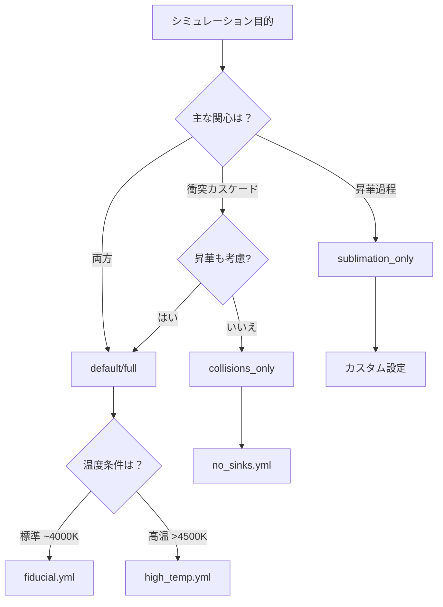

# 設定ファイルガイド

> **目的**: シミュレーション設定の構造・物理的意味・整合性ルールを体系的に解説する

---

## 🚀 クイックスタート：5分で動かす

### Step 1: シナリオをコピー

```bash
cp configs/scenarios/fiducial.yml configs/my_run.yml
```

### Step 2: 温度を変更（オプション）

```yaml
# configs/my_run.yml の radiation セクション
radiation:
  TM_K: 4500  # 火星赤外温度を 4000K → 4500K に変更
```

### Step 3: 実行

```bash
python -m marsdisk.run --config configs/my_run.yml
```

### Step 4: 結果確認

```bash
ls out/my_run/
# series/*.parquet  - 時系列データ
# summary.json      - 集計結果
# checks/           - 検証ログ
```

> 💡 **ヒント**: `configs/scenarios/` には目的別のテンプレートがあります。
> 自分の研究目的に近いシナリオから始めるのが最も効率的です。

---

## 📋 目次

1. [概要：設定構造の全体像](#1-概要設定構造の全体像)
2. [廃止予定・非推奨フィールド](#2-廃止予定非推奨フィールドの一覧)
3. [設定グループ別解説](#3-設定グループ別解説)
4. [最小構成の例](#4-最小構成の例)
5. [移行ガイド](#5-移行ガイド旧形式から新形式へ)
6. [シナリオ選択ガイド](#6-シナリオ選択ガイド)
7. [トラブルシューティング](#7-トラブルシューティング)
8. [検証ツール](#8-検証ツール)
9. [参考資料](#9-参考資料)

---

## 1. 概要：設定構造の全体像

### 1.1 設定の階層と責務

```text
configs/<scenario>.yml
├── geometry          # 空間次元（0D/1D）⚠️ 軌道半径は disk.geometry を使用
├── physics_mode      # 物理モード（推奨：統一された指定方法）
├── material          # 物質パラメータ
├── temps             # ⚠️ 廃止予定 → radiation.TM_K へ統合
├── sizes             # サイズビン定義
├── initial           # 初期条件
├── dynamics          # 速度分散モデル
├── psd               # 粒径分布パラメータ
├── qstar             # 破砕強度モデル
├── disk              # 円盤幾何（推奨：軌道半径の指定先）
├── inner_disk_mass   # 質量正規化
├── surface           # 表層モデル
├── supply            # 外部供給（簡略化済み）
├── sinks             # 消失過程（昇華パラメータ簡略化済み）
├── radiation         # 放射圧（温度パラメータの統一先）
├── shielding         # 自遮蔽
├── phase             # 相状態判定（entrypoint 統一済み）
├── numerics          # 数値パラメータ
└── io                # 入出力設定
```

### 1.2 シナリオベースの設定管理

`configs/scenarios/` ディレクトリに、物理的前提ごとのシナリオファイルを配置：

| シナリオ | 説明 | 主な用途 |
|---------|------|---------|
| `fiducial.yml` | Gas-poor, 衝突支配（標準） | ベースライン、パラメータスタディ |
| `high_temp.yml` | 高温円盤、昇華強化 | 初期高温環境の進化 |
| `gas_rich.yml` | TL2003 有効（非標準） | 感度試験のみ |
| `no_sinks.yml` | シンク無効、純粋衝突 | コード検証 |

---

## 2. 廃止予定・非推奨フィールドの一覧

以下のフィールドは非推奨となり、将来削除されます。新規設定では使用しないでください。

| 非推奨フィールド | 推奨される代替 | 理由 |
|-----------------|---------------|------|
| `temps.T_M` | `radiation.TM_K` | 温度パラメータの統合 |
| `single_process_mode` | `physics_mode` | 物理モード指定の統合 |
| `modes.single_process` | `physics_mode` | 物理モード指定の統合 |
| `process.primary` | `physics_mode` | 物理モード指定の統合 |
| `geometry.r` | `disk.geometry.r_in_RM` | 軌道半径指定の統合 |
| `geometry.runtime_orbital_radius_rm` | `disk.geometry.r_in_RM` | 軌道半径指定の統合 |
| `phase.map.entrypoint` | `phase.entrypoint` | 二重構造の解消 |

---

## 3. 設定グループ別解説

### 3.1 `physics_mode` — 物理モード（推奨）

| 値 | 説明 | 有効な物理過程 |
|----|------|---------------|
| `"default"` | 複合モード（標準） | 衝突 + 昇華 + blow-out |
| `"sublimation_only"` | 昇華のみ | 昇華シンクのみ（衝突・blow-out無効） |
| `"collisions_only"` | 衝突のみ | 衝突 + blow-out（昇華シンク無効） |

**例（推奨形式）:**

```yaml
physics_mode: "default"  # または "sublimation_only" / "collisions_only"
```

### 3.2 `geometry` — 空間モード

| キー | 型 | 説明 | 推奨 |
|------|-----|------|------|
| `mode` | `"0D"` / `"1D"` | 空間次元 | ✓ |
| `r` | float | 軌道半径 [m] | ⚠️ 非推奨 |
| `runtime_orbital_radius_rm` | float | 軌道半径 [R_Mars] | ⚠️ 非推奨 |

**推奨**: 軌道半径は `disk.geometry` で指定

### 3.3 `disk.geometry` — 円盤幾何（推奨）

| キー | 型 | 単位 | 説明 |
|------|-----|------|------|
| `r_in_RM` | float | R_Mars | 内縁半径 |
| `r_out_RM` | float | R_Mars | 外縁半径 |
| `r_profile` | str | - | `"uniform"` / `"powerlaw"` |
| `p_index` | float | - | べき指数（Σ ∝ r^-p） |

**例:**

```yaml
disk:
  geometry:
    r_in_RM: 2.2
    r_out_RM: 2.7
```

### 3.4 `supply` — 外部供給（簡略化済み）

選択したモードのパラメータのみ記述すれば OK。他はデフォルト値が使用されます。

**例（const モード - 最小構成）:**

```yaml
supply:
  mode: "const"
  const:
    prod_area_rate_kg_m2_s: 1.0e-10
```

**例（table モード - 最小構成）:**

```yaml
supply:
  mode: "table"
  table:
    path: "data/my_supply.csv"
```

### 3.5 `sinks.sub_params` — 昇華パラメータ（簡略化済み）

モードに関連するパラメータのみ記述すれば OK。

**モード別の主要パラメータ:**

| モード | 主要パラメータ |
|--------|---------------|
| `logistic` | `dT`, `eta_instant` |
| `hkl` | `alpha_evap`, `mu`, `A`, `B` |
| `hkl_timescale` | `alpha_evap`, `mu`, `A`, `B` |

**例（logistic モード - 最小構成）:**

```yaml
sinks:
  sub_params:
    mode: "logistic"
    dT: 50.0
```

**例（hkl モード - 最小構成）:**

```yaml
sinks:
  sub_params:
    mode: "hkl"
    alpha_evap: 0.007
    mu: 0.044
```

### 3.6 `phase` — 相状態判定（entrypoint 統一済み）

`phase.map.entrypoint` は非推奨。`phase.entrypoint` を直接使用してください。

**例（threshold モード - 推奨）:**

```yaml
phase:
  enabled: true
  source: "threshold"
  thresholds:
    T_condense_K: 1700.0
    T_vaporize_K: 2000.0
```

**例（map モード - 推奨）:**

```yaml
phase:
  enabled: true
  source: "map"
  entrypoint: "mymodule:my_phase_lookup"  # 直接指定
```

### 3.7 `radiation` — 放射圧（温度統一先）

| キー | 型 | 単位 | 説明 |
|------|-----|------|------|
| `TM_K` | float | K | 火星赤外温度（**統一先**） |
| `qpr_table_path` | str | - | Qpr テーブルパス |

**例:**

```yaml
radiation:
  TM_K: 4000
  qpr_table_path: "data/qpr_table.csv"
```

---

## 4. 最小構成の例

以下は動作する最小限の設定例です：

```yaml
# 最小構成例
geometry:
  mode: "0D"

physics_mode: "default"

material:
  rho: 3000.0

radiation:
  TM_K: 4000
  qpr_table_path: "data/qpr_table.csv"

sizes:
  s_min: 1.0e-6
  s_max: 3.0
  n_bins: 40

initial:
  mass_total: 1.0e-5
  s0_mode: "upper"

dynamics:
  e0: 0.5
  i0: 0.05
  t_damp_orbits: 20
  f_wake: 2.0

psd:
  alpha: 1.83

qstar:
  Qs: 3.5e7
  a_s: 0.38
  B: 0.3
  b_g: 1.36
  v_ref_kms: [1.0, 5.0]

disk:
  geometry:
    r_in_RM: 2.2
    r_out_RM: 2.7

inner_disk_mass:
  use_Mmars_ratio: true
  M_in_ratio: 3.0e-5
  map_to_sigma: "analytic"

sinks:
  mode: "sublimation"

numerics:
  t_end_years: 2.0
  dt_init: 2.0
  safety: 0.08

io:
  outdir: "out"
```

---

## 5. 移行ガイド

### 5.1 物理モードの移行

**Before（4通りの指定方法が混在）:**

```yaml
# 方法1
single_process_mode: "sublimation_only"

# 方法2
modes:
  single_process: "sublimation_only"

# 方法3
process:
  primary: "sublimation_only"

# 方法4
physics_mode: "sublimation_only"
```

**After（統一）:**

```yaml
physics_mode: "sublimation_only"
```

### 5.2 温度パラメータの移行

**Before:**

```yaml
temps:
  T_M: 4000.0
```

**After:**

```yaml
radiation:
  TM_K: 4000.0
```

### 5.3 軌道半径の移行

**Before:**

```yaml
geometry:
  r: 7.5e6  # [m]
  # または
  runtime_orbital_radius_rm: 2.2
```

**After:**

```yaml
disk:
  geometry:
    r_in_RM: 2.2
    r_out_RM: 2.7
```

### 5.4 phase.map.entrypoint の移行

**Before:**

```yaml
phase:
  source: "map"
  map:
    entrypoint: "mymodule:my_func"
```

**After:**

```yaml
phase:
  source: "map"
  entrypoint: "mymodule:my_func"
```

---

## 6. シナリオ選択ガイド

### 6.1 「何をシミュレーションしたいか」から選ぶ



### 6.2 シナリオ早見表

| やりたいこと | 推奨シナリオ | `physics_mode` | 補足 |
|-------------|-------------|----------------|------|
| 基本的な円盤進化 | `fiducial.yml` | `"default"` | 標準的なパラメータ |
| 衝突カスケードのみ検証 | `no_sinks.yml` | `"collisions_only"` | 昇華無効 |
| 高温初期条件 | `high_temp.yml` | `"default"` | TM_K=5000K |
| 昇華過程の単独解析 | カスタム | `"sublimation_only"` | 衝突無効 |
| ガス円盤効果（非標準） | `gas_rich.yml` | `"default"` | ⚠️ 感度試験のみ |

### 6.3 パラメータ調整の指針

#### 温度 (`radiation.TM_K`)

| 値の範囲 | 物理的状況 | 期待される挙動 |
|---------|-----------|---------------|
| 2000–3000 K | 低温円盤 | 昇華弱、衝突支配 |
| 3500–4500 K | 標準 | バランス |
| 4500–6000 K | 高温円盤 | 昇華強化、急速な質量損失 |

#### 昇華温度 (`sinks.T_sub`)

| 値の範囲 | 意味 | 注意点 |
|---------|------|--------|
| 1000–1200 K | 早期昇華 | 広い領域で昇華発生 |
| 1200–1400 K | 標準 | SiO₂の典型値 |
| 1400–1600 K | 遅延昇華 | 高温でのみ昇華 |

#### 速度分散増幅 (`dynamics.f_wake`)

| 値 | 意味 | 適用条件 |
|----|------|---------|
| 1.0 | 増幅なし | 薄い円盤（τ < 1） |
| 1.5–2.0 | 自己重力ウェイク | 光学的厚さ τ > 1 |
| > 2.5 | 強い乱流 | 特殊条件のみ |

---

## 7. トラブルシューティング

### 7.1 検証エラーへの対処

#### TEMP001: 昇華温度が凝縮温度を超えている

```
[WARNING] TEMP001: 昇華温度 (1500 K) > 凝縮温度 (1400 K)
```

**原因**: `sinks.T_sub > phase.thresholds.T_condense_K`

**対処**:

```yaml
# 修正前
sinks:
  T_sub: 1500.0
phase:
  thresholds:
    T_condense_K: 1400.0

# 修正後（T_sub ≤ T_condense に）
sinks:
  T_sub: 1300.0
phase:
  thresholds:
    T_condense_K: 1700.0
```

#### TEMP004: 火星温度が蒸発温度を超えている

```
[WARNING] TEMP004: 火星温度 (4000.0 K) > 蒸発温度 (2000.0 K)
```

**意味**: 円盤全体が蒸気相支配になる可能性

**対処**: 意図的な高温シナリオなら無視可。通常は：

```yaml
radiation:
  TM_K: 1800.0  # 蒸発温度以下に
# または
phase:
  thresholds:
    T_vaporize_K: 4500.0  # 蒸発温度を上げる
```

#### MIGRATE001–006: 非推奨フィールドの警告

```
[WARNING] MIGRATE001: temps.T_M (4000 K) は廃止予定です
```

**対処**: [移行ガイド](#5-移行ガイド旧形式から新形式へ) を参照

### 7.2 よくある設定ミス

| 症状 | 原因 | 解決策 |
|------|------|--------|
| シミュレーションが即座に終了 | `t_end_years` が小さすぎる | 最低 0.1 年以上に |
| 質量が急速に消失 | `TM_K` が高すぎる | 温度を下げる or 昇華を無効化 |
| blow-out が発生しない | `radiation.source: "off"` | `"mars"` に変更 |
| 検証で ERROR | 温度階層の逆転 | T_condense < T_vaporize を確認 |

### 7.3 デバッグ手順

```bash
# 1. 設定ファイルの検証
python -m marsdisk.config_validator configs/my_run.yml

# 2. 詳細ログを有効化
# io セクションに追加:
io:
  debug_sinks: true
  quiet: false

# 3. 短時間テスト実行
# numerics セクションで:
numerics:
  t_end_years: 0.01  # 短縮して動作確認
```

---

## 8. 検証ツール

```bash
# 設定ファイルの整合性検証
python -m marsdisk.config_validator configs/scenarios/fiducial.yml

# 厳格モード（警告もエラーとして扱う）
python -m marsdisk.config_validator --strict configs/scenarios/fiducial.yml

# INFO メッセージを抑制
python -m marsdisk.config_validator --quiet configs/scenarios/fiducial.yml
```

### 8.1 検証コード一覧

| コード | 重要度 | 内容 | 対処 |
|--------|--------|------|------|
| TEMP001 | WARNING | T_sub > T_condense | 昇華温度を下げる |
| TEMP002 | ERROR | T_condense ≥ T_vaporize | 温度階層を修正 |
| TEMP004 | WARNING | TM_K > T_vaporize | 意図的なら無視可 |
| SIZE001 | WARNING | ビン解像度不足 | n_bins を増やす |
| GAS001 | WARNING | gas_drag と rho_g の不整合 | 両方を一致させる |
| DISK001 | WARNING | 内縁がロッシュ限界外 | r_in_RM を調整 |
| MIGRATE001–006 | WARNING | 非推奨フィールド使用 | 新フィールドへ移行 |

---

## 9. 参考資料

### 9.1 文献

- **Hyodo et al. (2017, 2018)**: gas-poor 仮定の根拠
- **Leinhardt & Stewart (2012)**: 破砕強度モデル Q*D
- **Campo Bagatin et al. (1994)**: wavy PSD 構造
- **Strubbe & Chiang (2006)**: 放射圧支配の描像
- **Canup & Salmon (2018)**: 衛星形成シナリオ

### 9.2 関連ドキュメント

| ドキュメント | 内容 |
|-------------|------|
| `analysis/equations.md` | 物理式の一本化 |
| `analysis/overview.md` | アーキテクチャ・データフロー |
| `analysis/run-recipes.md` | 実行手順・感度掃引 |
| `AGENTS.md` | プロジェクト仕様・CI 基準 |
