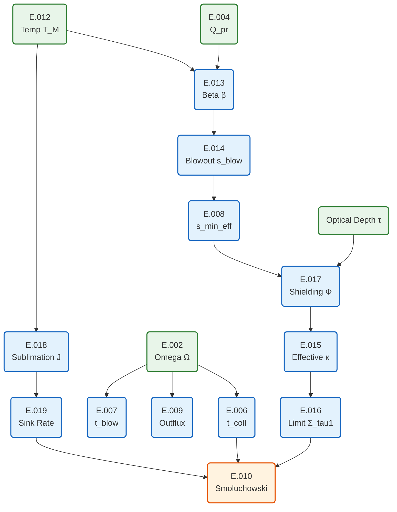

> **文書種別**: リファレンス（Diátaxis: Reference）

> **注記（gas‑poor）**: 本解析は **ガスに乏しい衝突起源デブリ円盤**を前提とします。従って、**光学的に厚いガス円盤**を仮定する Takeuchi & Lin (2003) の表層塵アウトフロー式は**適用外**とし、既定では評価から外しています（必要時のみ明示的に有効化）。この判断は、衝突直後の円盤が溶融主体かつ蒸気≲数%で、初期周回で揮発が散逸しやすいこと、および小衛星を残すには低質量・低ガスの円盤条件が要ることに基づきます。参考: [@Hyodo2017a_ApJ845_125; @Hyodo2017b_ApJ851_122; @Hyodo2018_ApJ860_150; @CanupSalmon2018_SciAdv4_eaar6887]。

## Equation Dependency Graph

主要な数式・物理量の依存関係フロー図：




### (E.001) v_kepler — ケプラー速度 v_K(r)
ケプラー運動の基本式に従い、教科書的な円軌道速度を評価する [@MurrayDermott1999_SSD]。

円盤半径に応じた公転速度を、火星重力パラメータから即時に算出する関数です。
- 用語：ケプラー速度（Keplerian orbital speed）
- 前提：火星標準重力定数 `G` と質量 `M_MARS` を一定とみなし、入力半径 `r>0` を採用する。
- 式と参照：$v_K(r)=\sqrt{G M_{\mathrm{MARS}}/r}$（[marsdisk/grid.py#v_kepler [L34–L48]]）
- 入出力と単位：`r` [m] → `v_K` [m s$^{-1}$]
- 数値処理：NumPy の平方根を評価し `float` に変換するのみで、負値入力は未定義として利用者側で防ぐ。

### (E.002) omega — ケプラー角速度 Ω(r)
ケプラー角速度の標準式をそのまま返すラッパーで、出典は円運動の基本解 [@MurrayDermott1999_SSD]。

0D 半径の局所角速度を、ケプラー解をそのまま返すラッパーです。
- 用語：ケプラー角速度（Keplerian angular frequency）
- 前提：`omega_kepler` の結果をそのまま参照し、火星重力を一定とみなす。
- 式と参照：$\Omega(r)=\sqrt{G M_{\mathrm{MARS}}/r^{3}}$ を別名で返す（[marsdisk/grid.py#omega [L90–L91]]）
- 入出力と単位：`r` [m] → `Ω` [rad s$^{-1}$]
- 数値処理：別名関数として委譲するだけで追加の丸めや検証は行わない。

**Symbols**

|Symbol|Meaning|Units|Defaults/Notes|
|---|---|---|---|
|$r$|Orbital radius|m|Input; must be positive|
|$\Omega$|Keplerian angular frequency|rad s$^{-1}$|Return value|
|$G$|Gravitational constant|m$^3$ kg$^{-1}$ s$^{-2}$|`6.67430\times10^{-11}`|
|$M_{\mathrm{MARS}}$|Mars mass|kg|`6.4171\times10^{23}`|


### (E.003) v_keplerian — ケプラー速度（同義関数）
円軌道速度の別名を公開し API の揺れに備えるもので、式自体は (E.001) と同じ [@MurrayDermott1999_SSD]。

`v_kepler` と同一計算を別名で公開し、外部 API の記述ゆれに備えます。
- 用語：ケプラー速度別名（Keplerian speed alias）
- 前提：`v_kepler` の実装が正しいと仮定し、その結果を直接返却する。
- 式と参照：$v_K(r)=\sqrt{G M_{\mathrm{MARS}}/r}$ を `v_kepler` に委譲（[marsdisk/grid.py#v_keplerian [L93–L94]]）
- 入出力と単位：`r` [m] → `v_K` [m s$^{-1}$]
- 数値処理：追加計算は無く、浮動小数変換も呼び先に任せる。

**Symbols**

|Symbol|Meaning|Units|Defaults/Notes|
|---|---|---|---|
|$r$|Orbital radius|m|Input|
|$v_K$|Keplerian orbital speed|m s$^{-1}$|Return value|


### (E.004) interp_qpr — Planck平均 ⟨Q_pr⟩ の補間
放射圧効率のスペクトル平均を表テーブルから補間し、未ロード時は近似へフォールバックする実装。Q_pr と β の定義は古典的な放射圧整理 [@Burns1979_Icarus40_1] に従う。

放射圧効率のテーブルからサイズと温度で二次元補間を行い、欠損時は解析近似へフォールバックします。
- 用語：放射圧効率平均（Planck-averaged radiation pressure efficiency）
- 前提：起動時に読み込んだ `_QPR_TABLE` を保持し、未ロード時のみ `_approx_qpr` に切り替える。
- 式と参照：$⟨Q_{\mathrm{pr}}(s,T_\mathrm{M})⟩ = \mathrm{table.interp}(s,T_\mathrm{M})$（[marsdisk/io/tables.py#interp_qpr [L259–L270]]）
- 入出力と単位：`s` [m], `T_M` [K] → `⟨Q_pr⟩` [dimensionless]
- 数値処理：NumPy 補間値を `float` 化し、テーブルが無い場合は解析近似へフォールバックする分岐のみ。

**Symbols**

|Symbol|Meaning|Units|Defaults/Notes|
|---|---|---|---|
|$s$|Grain size|m|Input|
|$T_M$|Mars surface temperature|K|Input|
|$\langle Q_{\mathrm{pr}}\rangle$|Planck-mean radiation pressure efficiency|dimensionless|Return value|


### (E.005) load_qpr_table — ⟨Q_pr⟩表のローダ
放射圧効率テーブルをロードして Planck 平均の補間器を更新する。Q_pr と β の関係付けは [@Burns1979_Icarus40_1] の定義に準拠し、ここではそのデータ供給を担う。
実装上のローダであり、同一仕様の式や関数名を持つ文献は存在しない（実装固有の離散化）。

外部 CSV/HDF テーブルを読み込み、全体の Planck 平均補間器を更新して戻り値として供給します。
- 用語：放射圧効率テーブルローダ（Planck-mean Q_pr table loader）
- 前提：指定パスの存在を検査し、`QPrTable.from_frame` で正規化されたフレームを生成する。
- 式と参照：$⟨Q_{\mathrm{pr}}⟩_{\mathrm{interp}} = \text{QPrTable.from\_frame}(\text{read}(path))$（[marsdisk/io/tables.py#load_qpr_table [L283–L295]]）
- 入出力と単位：`path` [str or Path] → `callable(s,T_M)` [dimensionless]
- 数値処理：読み込み後にグローバル `_QPR_TABLE` を更新して補間関数を返し、失敗時は例外で通知する。

**Symbols**

|Symbol|Meaning|Units|Defaults/Notes|
|---|---|---|---|
|path|Path to Q_pr table file|str or Path|Input|
|$\langle Q_{\mathrm{pr}}\rangle_{\mathrm{interp}}$|Interpolated Q_pr function|callable|Return value|


### (E.006) marsdisk/physics/surface.py: surface_collisional_time (lines 62-73)
[@StrubbeChiang2006_ApJ648_652; Eq.(1)]
```latex
\begin{equation}
 t_{\mathrm{coll}} = \frac{1}{\Omega\,\tau_{\perp}}
\end{equation}
```
**Symbols**

|Symbol|Meaning|Units|Defaults/Notes|
|---|---|---|---|
|$t_{\mathrm{coll}}$|Surface-layer collision time|s|Returned value|
|$\Omega$|Keplerian angular frequency|s$^{-1}$|Input, must be positive|
|$\tau_{\perp}$|Vertical optical depth (type-A/B regimes)|dimensionless|Input, must be positive|

**Numerics**
- Pure algebraic evaluation with argument validation; raises `MarsDiskError` when $\tau_{\perp}\le0$ or $\Omega\le0$. [marsdisk/physics/surface.py#wyatt_tcoll_S1 [L65–L76]]

Type-A disks (collision dominated) inherit $\tau(r) \propto r^{-5/2}$, whereas type-B disks (CPR drag dominated) follow $\tau(r) \propto r^{-3/2}$, both derived from the same scaling. [@StrubbeChiang2006_ApJ648_652]

### (E.007) marsdisk/physics/surface.py: step_surface_density_S1 (lines 96-163)
Wyatt 型の $t_{\mathrm{coll}} = 1/(\Omega\tau_{\perp})$ 減衰を用いて表層面密度を直接更新する ODE[@Wyatt2008; @StrubbeChiang2006_ApJ648_652]。Smol のフル Smoluchowski 解法（C3/C4）に対する光学的に薄いレガシー簡略版で、Wyatt スケールとの整合確認や対照実験用に保持している。

> [!IMPORTANT]
> **適用範囲の注意（既定は Smol）**  
> この ODE は `surface.collision_solver="surface_ode"` を明示した場合のみ使う。  
> Takeuchi & Lin (2003) のガスリッチ表層アウトフロー式[@TakeuchiLin2003_ApJ593_524]を下敷きにしているため、gas‑poor を標準とする本プロジェクトでは `ALLOW_TL2003=false` を維持し、対照的な gas-rich 仮定を試すときだけ有効化する。
```latex
\begin{aligned}
 t_{\mathrm{blow}} &= \frac{1}{\Omega},\\
 \lambda &= \frac{1}{t_{\mathrm{blow}}} + I_{\mathrm{coll}}\frac{1}{t_{\mathrm{coll}}} + I_{\mathrm{sink}}\frac{1}{t_{\mathrm{sink}}},\\
 \Sigma^{n+1} &= \min\!\left(\frac{\Sigma^{n} + \Delta t\,\dot{\Sigma}_{\mathrm{prod}}}{1 + \Delta t\,\lambda},\,\Sigma_{\tau=1}\right),\\
 \dot{M}_{\mathrm{out}} &= I_{\mathrm{blow}}\,\Sigma^{n+1}\,\Omega,\\
\Phi_{\mathrm{sink}} &=
\begin{cases}
\dfrac{\Sigma^{n+1}}{t_{\mathrm{sink}}}, & t_{\mathrm{sink}} > 0,\\[6pt]
0, & \text{otherwise.}
\end{cases}
\end{aligned}
```
**Symbols**

|Symbol|Meaning|Units|Defaults/Notes|
|---|---|---|---|
|$\Sigma^{n}$|Surface density at start of step|kg m$^{-2}$|Input `sigma_surf`|
|$\Sigma^{n+1}$|Surface density after update|kg m$^{-2}$|Clipped to $\Sigma_{\tau=1}$ when provided|
|$\Delta t$|Time step|s|Input `dt`|
|$\dot{\Sigma}_{\mathrm{prod}}$|Sub-blow-out production rate|kg m$^{-2}$ s$^{-1}$|Input `prod_subblow_area_rate`|
|$t_{\mathrm{blow}}$|Blow-out residence time|s|Equal to $1/\Omega$|
|$t_{\mathrm{coll}}$|Optional collisional loss time|s|Ignored when `None` or non-positive|
|$t_{\mathrm{sink}}$|Optional extra sink time|s|Ignored when `None` or non-positive|
|$I_{\mathrm{coll}}$|Indicator for active collision sink|dimensionless|1 if $t_{\mathrm{coll}}$ supplied and positive, else 0|
|$I_{\mathrm{sink}}$|Indicator for active additional sink|dimensionless|1 if $t_{\mathrm{sink}}$ supplied and positive, else 0|
|$\Sigma_{\tau=1}$|Optical-depth clipping lid|kg m$^{-2}$|Input `sigma_tau1`; if absent no clipping|
|$\dot{M}_{\mathrm{out}}$|Surface outflux|kg m$^{-2}$ s$^{-1}$|Returned as `outflux`|
|$\Phi_{\mathrm{sink}}$|Additional sink flux|kg m$^{-2}$ s$^{-1}$|Returned as `sink_flux`|
|$\tau_{\perp}$ / $\tau_{\mathrm{los}}$|Vertical vs Mars line-of-sight optical depth|dimensionless|`tau_vertical` for collisions/transport, `tau_los_mars` for shielding and $\Sigma_{\tau=1}$|

**Numerics**
- Implicit Euler for loss terms (IMEX-BDF1 style); production handled explicitly.
- Applies optional optical-depth cap via `min` before flux evaluation.
- Returns outflux and sink flux after clipping; logs step parameters.
- Indicator $I_{\mathrm{blow}}$ is 1 only when the runtime flag `enable_blowout` is true, ensuring both the $1/t_{\mathrm{blow}}$ termと外向流束が無効化される。[marsdisk/physics/surface.py#step_surface_density_S1 [L99–L174]]

`surface.collision_solver="surface_ode"` を選んだ場合にのみ呼び出され、`t_{\mathrm{sink}}` が `None` または非正（`sinks.mode="none"` のときなど）ならシンク指標を落として吹き飛びと Wyatt/Strubbe–Chiang 型衝突寿命のみを損失項に残す。[marsdisk/run.py#run_zero_d [L1136–L5003]][marsdisk/physics/sinks.py#total_sink_timescale [L83–L160]][marsdisk/physics/surface.py#step_surface_density_S1 [L99–L174]] その構成では `sink_flux` は常に0となる。

**参考**: [無効: gas‑poor 既定] Takeuchi & Lin (2003); Hyodo et al. (2017); Hyodo et al. (2018); Canup & Salmon (2018); Strubbe & Chiang (2006); Kuramoto (2024); Wyatt (2008)

### (E.008) marsdisk/run.py: effective minimum grain size and beta diagnostics (lines 229-488)
ブローアウト境界と設定下限の最大を取り、β 診断を併記する手順。ブローアウトの閾値 β=0.5 とその定義は [@Burns1979_Icarus40_1; @StrubbeChiang2006_ApJ648_652] に従う。
最小径の取り方と出力項目は実装上の組み合わせであり、同一形を掲げる文献はない（実装固有）。

```latex
\begin{equation}
 s_{\min,\mathrm{eff}} = \max\!\left(s_{\min,\mathrm{cfg}},\, s_{\mathrm{blow}}\right)
\end{equation}
```
with the component sizes assembled as `s_min_components = {"config": s_{\min,\mathrm{cfg}}, "blowout": s_{\mathrm{blow}}, "effective": s_{\min,\mathrm{eff}}}` (`[marsdisk/run.py#run_zero_d [L1136–L5003]]`). The sublimation helper `fragments.s_sub_boundary` (`[marsdisk/physics/fragments.py#s_sub_boundary [L147–L210]]`) is now used exclusively for the grain-size evolution hook (``ds/dt``) and no longer raises the PSD floor.

The reported beta diagnostics are computed in two places:
```latex
\beta_{\mathrm{cfg}} = \beta\!\left(s_{\min,\mathrm{cfg}}\right),\qquad
\beta_{\mathrm{eff}} = \beta\!\left(s_{\min,\mathrm{eff}}\right),
```
where `radiation.beta` implements the Stefan–Boltzmann expression and takes the Planck mean `⟨Q_{\mathrm{pr}}⟩` from the current run (`[marsdisk/physics/radiation.py#beta [L250–L271]]`).
Both fields are written to the time series と `summary.json` に `beta_at_smin_config` / `beta_at_smin_effective` として保存される（`[marsdisk/run.py#run_zero_d [L1136–L5003]]`, `[marsdisk/run.py#run_zero_d [L1136–L5003]]`）。
The blow-out threshold originates from the module constant `BLOWOUT_BETA_THRESHOLD` (`[marsdisk/physics/radiation.py#BLOWOUT_BETA_THRESHOLD [L33]]`), and the recorded key is `beta_threshold` (`[marsdisk/run.py#run_zero_d [L1136–L5003]]`, `[marsdisk/run.py#run_zero_d [L1136–L5003]]`).
The closed-form expression for β is persisted verbatim in `run_config.json["beta_formula"]` as part of the provenance record (`[marsdisk/run.py#run_zero_d [L1136–L5003]]`).

Case classification follows the configuration beta: `case_status = "blowout"` when `beta_at_smin_config >= beta_threshold`, otherwise `"ok"`; exceptional mass-budget failures are escalated separately (`[marsdisk/run.py#run_zero_d [L1136–L5003]]`). This logic matches the recorded summaries used by downstream validation.

**Recorded quantities**

| Quantity (units) | Summary key(s) | Provenance | Notes |
| --- | --- | --- | --- |
| Effective minimum grain size (m) | `s_min_effective`, `s_min_components["effective"]` | `[marsdisk/run.py#run_zero_d [L1136–L5003]]`, `[marsdisk/run.py#run_zero_d [L1136–L5003]]` | `\max(s_{\min,\mathrm{cfg}}, s_{\mathrm{blow}})` |
| Configured minimum grain size (m) | `s_min_config`, `s_min_components["config"]` | `[marsdisk/run.py#run_zero_d [L1136–L5003]]`, `[marsdisk/run.py#run_zero_d [L1136–L5003]]` | YAML `sizes.s_min` from `schema.Sizes` |
| Blow-out limit (m) | `s_blow_m`, `s_min_components["blowout"]` | `[marsdisk/run.py#run_zero_d [L1136–L5003]]`, `[marsdisk/run.py#run_zero_d [L1136–L5003]]` | Uses `radiation.blowout_radius` |
| Beta at config size (dimensionless) | `beta_at_smin_config` | `[marsdisk/run.py#run_zero_d [L1136–L5003]]`, `[marsdisk/run.py#run_zero_d [L1136–L5003]]` | Evaluated with `radiation.beta` |
| Beta at effective size (dimensionless) | `beta_at_smin_effective` | `[marsdisk/run.py#run_zero_d [L1136–L5003]]`, `[marsdisk/run.py#run_zero_d [L1136–L5003]]` | Uses same β function at `s_min_effective` |
| Beta threshold (dimensionless) | `beta_threshold` | `[marsdisk/physics/radiation.py#BLOWOUT_BETA_THRESHOLD [L33]]`, `[marsdisk/run.py#run_zero_d [L1136–L5003]]` | Constant 0.5 defined in radiation module |
| Blow-out loss cumulative (M_Mars) | `M_out_cum` | `[marsdisk/run.py#run_zero_d [L1136–L5003]]` | Equal to `mass_lost_by_blowout` final value |
| Sink loss cumulative (M_Mars) | `M_sink_cum` | `[marsdisk/run.py#run_zero_d [L1136–L5003]]` | Includes HKL erosion and IMEX sink flux |
| Mean blow-out per orbit (M_Mars) | `M_out_mean_per_orbit` | `[marsdisk/run.py#run_zero_d [L1136–L5003]]` | Reported when at least one orbit completes |
| Mean sink per orbit (M_Mars) | `M_sink_mean_per_orbit` | `[marsdisk/run.py#run_zero_d [L1136–L5003]]` | Reported when at least one orbit completes |
| Orbit counter (dimensionless) | `orbits_completed` | `[marsdisk/run.py#run_zero_d [L1136–L5003]]` | Number of completed orbital rollups |
| Mars-facing temperature (K) | `T_M_used`, `T_M_source` | `[marsdisk/run.py#load_config [L966–L988]]`, `[marsdisk/run.py#run_zero_d [L1136–L5003]]` | `radiation.TM_K` または温度ドライバから決定（legacy `temps.T_M` は廃止） |
| Radiation efficiency (dimensionless) | `Q_pr_used` | `[marsdisk/run.py#run_zero_d [L1136–L5003]]`, `[marsdisk/run.py#run_zero_d [L1136–L5003]]` | Planck mean stored for reference |
| Shielding Φ table path | `phi_table_path` | `[marsdisk/run.py#run_zero_d [L1136–L5003]]` | Summary retains the resolved τ-table for provenance |
| PSD bin index (dimensionless) | `bin_index` | `[marsdisk/run.py#run_zero_d [L1136–L5003]][marsdisk/io/writer.py#write_parquet [L24–L309]]` | Time×bin identifier stored in `psd_hist.parquet` |
| PSD bin centre (m) | `s_bin_center` | `[marsdisk/run.py#run_zero_d [L1136–L5003]][marsdisk/io/writer.py#write_parquet [L24–L309]]` | Logarithmic midpoint used for PSD plots |
| PSD bin number density | `N_bin` | `[marsdisk/run.py#run_zero_d [L1136–L5003]][marsdisk/io/writer.py#write_parquet [L24–L309]]` | Relative number surface density per bin |


### (E.009) marsdisk/physics/surface.py: compute_surface_outflux (lines 178–188)
表層質量と公転角速度から外向きフラックスを評価する単純な式で、光学的に薄い吹き飛び流の近似 [@StrubbeChiang2006_ApJ648_652] を踏襲する。
スケール評価をコード化したもので、同一形の式を明示した文献はない（実装固有）。

```latex
\begin{equation}
 \dot{M}_{\mathrm{out}} = \Sigma_{\mathrm{surf}}\,\Omega
\end{equation}
```
**Symbols**

|Symbol|Meaning|Units|Defaults/Notes|
|---|---|---|---|
|$\dot{M}_{\mathrm{out}}$|Instantaneous surface outflux|kg m$^{-2}$ s$^{-1}$|Return value|
|$\Sigma_{\mathrm{surf}}$|Current surface density|kg m$^{-2}$|Input `sigma_surf`|
|$\Omega$|Keplerian angular frequency|s$^{-1}$|Input; must be positive|

**Numerics**
- Direct multiplication with argument validation; raises `MarsDiskError` when $\Omega\le0$. [marsdisk/physics/surface.py#compute_surface_outflux [L177–L186]]

### (E.010) marsdisk/physics/smol.py: step_imex_bdf1_C3 (lines 18-101)
粒径 PSD に対する Smoluchowski 方程式を IMEX-BDF1 で解く標準の衝突解法（C3/C4）。供給・昇華・追加シンク（ガス抗力など）をまとめたソースベクトル $f_k$ を明示的項として扱い、
```latex
\dot{N}_k = \tfrac{1}{2}\sum_{i,j} K_{ij}\,N_i N_j\,Y_{kij} - N_k\sum_j K_{kj}N_j + f_k,
```
と定義する。`collisions_smol` が `prod_subblow_mass_rate`（ソース）と昇華/外部シンク（負の項）を束ねて $f_k$ を組み立て、Wyatt 型 $t_{\rm coll}\approx T_{\rm orb}/(4\pi\tau)$ スケール [@Wyatt2008] と Strubbe & Chiang (2006) の PR drag/衝突寿命整合を踏まえた $e,i,H$ を `compute_kernel_e_i_H` で評価したカーネル $K_{ij}(e,v_{\mathrm{rel}},H)$ を与える。[marsdisk/physics/collisions_smol.py:L1–L220][marsdisk/physics/collisions_smol.py#compute_kernel_e_i_H [L429–L447]]

補足（ビン分解能）: coagulation/fragmentation 平衡の解析解に基づき、Birnstiel et al. (2011) は隣接粒径比 $a_{i+1}/a_i \lesssim 1.1$–1.2 を推奨しており、基準格子 $s_{\min}=1.0\times10^{-6}$ m, $s_{\max}=3$ m, $n_{\mathrm{bins}}=40$ では $(a_{i+1}/a_i)\approx1.26$ となるため、wavy 再現時はビン数を増やす感度試験を併用する [@Birnstiel2011_AA525_A11]。

```latex
\begin{aligned}
 \Lambda_i &= \sum_j C_{ij}, & t_{\mathrm{coll},i} &= \frac{1}{\max(\Lambda_i, 10^{-30})},\\
 \Delta t_{\max} &= \mathrm{safety}\times\min_i t_{\mathrm{coll},i}, & \Delta t_{\mathrm{eff}} &= \min(\Delta t, \Delta t_{\max}),\\
 G_k &= \tfrac{1}{2}\sum_{i,j} C_{ij}\,Y_{kij},\\
 N_i^{n+1} &= \frac{N_i^{n} + \Delta t_{\mathrm{eff}}\left(G_i - S_i\right)}{1 + \Delta t_{\mathrm{eff}}\,\Lambda_i}.
\end{aligned}
```
**Symbols**

|Symbol|Meaning|Units|Defaults/Notes|
|---|---|---|---|
|$N_i^{n}$|Number surface density in bin $i$ at step start|m$^{-2}$|Input array `N`|
|$N_i^{n+1}$|Updated number surface density|m$^{-2}$|Returned array|
|$C_{ij}$|Collision kernel between bins $i$ and $j$|s$^{-1}$|Input matrix `C`|
|$Y_{kij}$|Fragment mass fraction to bin $k$ from $(i,j)$ collision|dimensionless|Input tensor `Y`|
|$S_i$|Explicit source/sink term for bin $i$|m$^{-2}$ s$^{-1}$|Input array `S` assembled from $f_k$（供給は正、昇華や追加シンクは負の項）|
|$G_i$|Gain term from fragment production|m$^{-2}$ s$^{-1}$|Computed internally|
|$\Lambda_i$|Total loss rate for bin $i$|s$^{-1}$|Row sum of `C`|
|$t_{\mathrm{coll},i}$|Collision time per bin|s|Lower bounded via $10^{-30}$ in denominator|
|$\Delta t$|Requested step size|s|Input `dt`|
|$\Delta t_{\max}$|Safety-limited step size|s|`safety` parameter defaults to $0.1$|
|$\Delta t_{\mathrm{eff}}$|Actual step after adaptivity|s|Halved iteratively when constraints violated|
|$\mathrm{safety}$|Fraction of minimum collision time|dimensionless|Default $0.1$|
|$\mathrm{mass\_tol}$|Allowed relative mass error|dimensionless|Default $5\times10^{-3}$|
|$\dot{m}_{<a_{\mathrm{blow}}}$|Sub-blow-out mass production rate|kg m$^{-2}$ s$^{-1}$|Input `prod_subblow_mass_rate` used in mass check|

**Numerics**
- IMEX-BDF1 update: implicit handling of loss via denominator, explicit gain and source/sink vector $S$.
- Enforces positivity: halves $\Delta t_{\mathrm{eff}}$ until all $N_i^{n+1}\ge0$.
- Evaluates mass budget error (function C4); adaptively halves $\Delta t_{\mathrm{eff}}$ until error $\le$ `mass_tol`.
- Caps step size relative to minimum collision time using `safety` multiplier.
- Smol が既定の衝突経路（`surface.collision_solver="smol"`）。表層 ODE (S1) を試す場合のみ `surface_ode` へ切り替える。[marsdisk/run.py#_write_zero_d_history [L1033–L1133]]

### (E.011) marsdisk/physics/smol.py: compute_mass_budget_error_C4 (lines 104-131)
IMEX 更新後の質量差分を測るための診断式。衝突カスケードでの質量収支検査を行う実装 [@Krivov2006_AA455_509] に基づく。
誤差指標の形は実装上の定義であり、同一式を与える文献はない。

```latex
\begin{aligned}
 M^{n} &= \sum_k m_k N_k^{n}, & M^{n+1} &= \sum_k m_k N_k^{n+1},\\
 \Delta M &= M^{n+1} + \Delta t\,\dot{m}_{<a_{\mathrm{blow}}} - M^{n},\\
 \epsilon_{\mathrm{mass}} &= \frac{|\Delta M|}{M^{n}}.
\end{aligned}
```
**Symbols**

|Symbol|Meaning|Units|Defaults/Notes|
|---|---|---|---|
|$m_k$|Particle mass for bin $k$|kg|Input array `m`|
|$N_k^{n}$|Pre-step number surface density|m$^{-2}$|Input `N_old`|
|$N_k^{n+1}$|Post-step number surface density|m$^{-2}$|Input `N_new`|
|$\dot{m}_{<a_{\mathrm{blow}}}$|Mass production below blow-out|kg m$^{-2}$ s$^{-1}$|Input `prod_subblow_mass_rate`|
|$\Delta t$|Time interval|s|Input `dt`|
|$M^{n}, M^{n+1}$|Surface mass before/after step|kg m$^{-2}$|Computed internally|
|$\epsilon_{\mathrm{mass}}$|Relative mass budget error|dimensionless|Return value|

**Numerics**
- Validates matching shapes and positivity of $M^{n}$.
- Absolute error used to avoid cancellation sign issues; logs diagnostic values.

### (E.012) marsdisk/physics/radiation.py: planck_mean_qpr (lines 207-218)
放射圧効率の Planck 平均を表参照またはフォールバックで決める。β とブローアウトの定義は [@Burns1979_Icarus40_1] に従い、その入力として Q_pr を扱う。

```latex
\langle Q_{\mathrm{pr}}\rangle =
\begin{cases}
 Q_{\mathrm{pr}}, & \text{if an explicit override is supplied},\\
 \mathcal{I}(s, T_{\mathrm{M}}), & \text{if a lookup table or interpolator is available},\\
 1, & \text{otherwise (grey-body default)}.
\end{cases}
```
**Symbols**

|Symbol|Meaning|Units|Defaults/Notes|
|---|---|---|---|
|$\langle Q_{\mathrm{pr}}\rangle$|Planck-mean radiation-pressure efficiency|dimensionless|Return value|
|$Q_{\mathrm{pr}}$|User-supplied efficiency override|dimensionless|Optional input|
|$\mathcal{I}(s, T_{\mathrm{M}})$|Table interpolation at $(s,T_{\mathrm{M}})$|dimensionless|Uses provided `table` or `interp`, otherwise module cache|
|$s$|Grain size|m|Validated to be positive and finite|
|$T_{\mathrm{M}}$|Mars-facing grain temperature|K|Validated within $[1000, 6000]$; defaults to $2000$ K if `None`|

**Numerics**
- Checks size and temperature bounds; logs when defaults used.
- Lookup arguments clamped to tabulated ranges within `qpr_lookup`; fallback to unity when no table available.

### (E.013) marsdisk/physics/radiation.py: beta (lines 221-242)
[@StrubbeChiang2006_ApJ648_652]
```latex
\begin{equation}
 \beta = \frac{3\,\sigma_{\mathrm{SB}}\,T_{\mathrm{M}}^{4}\,R_{\mathrm{M}}^{2}\,\langle Q_{\mathrm{pr}}\rangle}{4\,G\,M_{\mathrm{M}}\,c\,\rho\,s}
\end{equation}
```
**Symbols**

|Symbol|Meaning|Units|Defaults/Notes|
|---|---|---|---|
|$\beta$|Radiation-pressure to gravity ratio|dimensionless|Return value|
|$\sigma_{\mathrm{SB}}$|Stefan–Boltzmann constant|W m$^{-2}$ K$^{-4}$|`constants.SIGMA_SB`|
|$T_{\mathrm{M}}$|Mars surface temperature|K|Default $2000$ K when `None`|
|$R_{\mathrm{M}}$|Mars radius|m|`constants.R_MARS`|
|$G$|Gravitational constant|m$^{3}$ kg$^{-1}$ s$^{-2}$|`constants.G`|
|$M_{\mathrm{M}}$|Mars mass|kg|`constants.M_MARS`|
|$c$|Speed of light|m s$^{-1}$|`constants.C`|
|$\rho$|Grain material density|kg m$^{-3}$|Defaults to $3000$ when `None`|
|$s$|Grain size|m|Validated positive|
|$\langle Q_{\mathrm{pr}}\rangle$|Planck-mean efficiency|dimensionless|Resolved via `planck_mean_qpr` logic|

**Numerics**
- Relies on validation helpers; reuses planck-mean lookup with optional overrides.
- No additional clamps beyond those in the helper routines.

### (E.014) marsdisk/physics/radiation.py: blowout_radius (lines 245-259)
[@StrubbeChiang2006_ApJ648_652]
```latex
\begin{equation}
 s_{\mathrm{blow}} = \frac{3\,\sigma_{\mathrm{SB}}\,T_{\mathrm{M}}^{4}\,R_{\mathrm{M}}^{2}\,\langle Q_{\mathrm{pr}}\rangle}{2\,G\,M_{\mathrm{M}}\,c\,\rho}
\end{equation}
```
**Symbols**

|Symbol|Meaning|Units|Defaults/Notes|
|---|---|---|---|
|$s_{\mathrm{blow}}$|Blow-out grain radius|m|Return value|
|$\sigma_{\mathrm{SB}}$|Stefan–Boltzmann constant|W m$^{-2}$ K$^{-4}$|`constants.SIGMA_SB`|
|$T_{\mathrm{M}}$|Mars surface temperature|K|Defaults to $2000$ K when `None`|
|$R_{\mathrm{M}}$|Mars radius|m|`constants.R_MARS`|
|$G$|Gravitational constant|m$^{3}$ kg$^{-1}$ s$^{-2}$|`constants.G`|
|$M_{\mathrm{M}}$|Mars mass|kg|`constants.M_MARS`|
|$c$|Speed of light|m s$^{-1}$|`constants.C`|
|$\rho$|Grain density|kg m$^{-3}$|Defaults to $3000$ when `None`|
|$\langle Q_{\mathrm{pr}}\rangle$|Planck-mean efficiency|dimensionless|Resolved via `_resolve_qpr` at $s=1\,$m if not provided|

**Numerics**
- Uses same validation and lookup as `beta`; clamps from table may apply through shared helper.
- No iteration; direct algebraic evaluation for $\beta=0.5$ threshold.

### (E.015) marsdisk/physics/shielding.py: effective_kappa (lines 81-120)
光学的厚さに応じた自遮蔽係数 $\Phi$ を掛けて有効不透明度を下げる処理で、薄い塵層の吸収低減を近似する [@StrubbeChiang2006_ApJ648_652]。

```latex
\begin{equation}
 \kappa_{\mathrm{eff}} = \Phi(\tau)\,\kappa_{\mathrm{surf}}
\end{equation}
```
**Symbols**

|Symbol|Meaning|Units|Defaults/Notes|
|---|---|---|---|
|$\kappa_{\mathrm{eff}}$|Effective surface opacity|m$^{2}$ kg$^{-1}$|Return value|
|$\kappa_{\mathrm{surf}}$|Unshielded surface opacity|m$^{2}$ kg$^{-1}$|Input `kappa`|
|$\Phi(\tau)$|Self-shielding factor|dimensionless|Evaluated via `phi_fn`; defaults to 1 when `phi_fn` is `None`|
|$\tau$|Optical depth used for lookup|dimensionless|Input `tau`|

**Numerics**
- Validates inputs; requires finite values.
- Clamps $\Phi$ to $[0,1]$ after lookup and logs when clipping occurs.

### (E.016) marsdisk/physics/shielding.py: sigma_tau1 (lines 123-130)
有効不透明度から $\tau=1$ となる表層質量を算出するクリップ条件。放射遮蔽のしきい値を簡略化したもの [@StrubbeChiang2006_ApJ648_652]。

```latex
\Sigma_{\tau=1} =
\begin{cases}
 \kappa_{\mathrm{eff}}^{-1}, & \kappa_{\mathrm{eff}} > 0,\\
 \infty, & \kappa_{\mathrm{eff}} \le 0.
\end{cases}
```
**Symbols**

|Symbol|Meaning|Units|Defaults/Notes|
|---|---|---|---|
|$\Sigma_{\tau=1}$|Surface density yielding optical depth unity|kg m$^{-2}$|Return value|
|$\kappa_{\mathrm{eff}}$|Effective opacity|m$^{2}$ kg$^{-1}$|Input|

**Numerics**
- Returns infinity when the opacity is non-positive to signal no optical-depth limit; type validation ensures real input.

### (E.017) marsdisk/physics/shielding.py: apply_shielding (lines 133-216)
表層の光学的厚さに応じて $\Phi(\tau,w_0,g)$ を適用し、$\kappa_{\mathrm{eff}}$ と $\Sigma_{\tau=1}$ を計算する。光学的厚さ制御の枠組みは [@StrubbeChiang2006_ApJ648_652] を踏まえた実装。

```latex
\begin{aligned}
 \Phi &= \Phi(\tau, w_0, g),\\
 \kappa_{\mathrm{eff}} &= \Phi\,\kappa_{\mathrm{surf}},\\
 \Sigma_{\tau=1} &=
 \begin{cases}
 \kappa_{\mathrm{eff}}^{-1}, & \kappa_{\mathrm{eff}} > 0,\\
 \infty, & \kappa_{\mathrm{eff}} \le 0.
 \end{cases}
\end{aligned}
```
**Symbols**

|Symbol|Meaning|Units|Defaults/Notes|
|---|---|---|---|
|$\kappa_{\mathrm{surf}}$|Unshielded surface opacity|m$^{2}$ kg$^{-1}$|Input|
|$\tau$|Optical depth for the skin|dimensionless|Input|
|$w_0$|Single-scattering albedo|dimensionless|Input|
|$g$|Asymmetry parameter|dimensionless|Input|
|$\Phi(\tau,w_0,g)$|Self-shielding factor|dimensionless|Evaluated via supplied or cached interpolator|
|$\kappa_{\mathrm{eff}}$|Effective opacity|m$^{2}$ kg$^{-1}$|Return value|
|$\Sigma_{\tau=1}$|Optical-depth unity surface density|kg m$^{-2}$|Return value|

**Numerics**
- Validates and, when table metadata available, clamps $\tau$, $w_0$, and $g$ to tabulated ranges before evaluation, logging any adjustments.
- Wraps the interpolator to reuse `effective_kappa` clamping of $\Phi$ to $[0,1]$.

### (E.018) marsdisk/physics/sublimation.py: mass_flux (implemented by mass_flux_hkl, lines 85-113)
[@Pignatale2018_ApJ853_118]
```latex
J(T) =
\begin{cases}
 \alpha_{\mathrm{evap}}\bigl(P_{\mathrm{sat}}(T) - P_{\mathrm{gas}}\bigr)
 \sqrt{\dfrac{\mu}{2\pi R T}}, &
 \text{if mode}\in\{\text{``hkl'', ``hkl\_timescale''}\} \text{ and HKL activated},\\[10pt]
 \exp\!\left(\dfrac{T - T_{\mathrm{sub}}}{\max(dT, 1)}\right), & \text{otherwise.}
\end{cases}
```
where the saturation vapour pressure is supplied via
```latex
P_{\mathrm{sat}}(T) =
\begin{cases}
 10^{A - B/T}, & \text{if }\texttt{psat\_model} = \text{``clausius''},\\[6pt]
 10^{\mathrm{PCHIP}_{\log_{10}P}(T)}, & \text{if }\texttt{psat\_model} = \text{``tabulated''}.
\end{cases}
```
**Symbols**

|Symbol|Meaning|Units|Defaults/Notes|
|---|---|---|---|
|$J(T)$|Sublimation mass flux|kg m$^{-2}$ s$^{-1}$|Return value|
|$\alpha_{\mathrm{evap}}$|Evaporation coefficient|dimensionless|`params.alpha_evap`; default 0.007 (Ferguson & Nuth 2012)|
|$P_{\mathrm{sat}}$|Saturation vapour pressure|Pa|Clausius (Kubaschewski 1974) or tabulated (Visscher & Fegley 2013)|
|$P_{\mathrm{gas}}$|Ambient vapour pressure|Pa|`params.P_gas`; default 0 (gas-poor disk; Hyodo et al. 2017, Canup & Salmon 2018)|
|$\mu$|Molar mass|kg mol$^{-1}$|`params.mu`; default 0.0440849 (NIST WebBook, SiO)|
|$R$|Universal gas constant|J mol$^{-1}$ K$^{-1}$|Fixed $8.314462618$|
|$T$|Grain temperature|K|Function argument|
|$T_{\mathrm{sub}}$|Logistic midpoint temperature|K|`params.T_sub`; default 1300|
|$dT$|Logistic width parameter|K|`params.dT`; floored at 1 K|
|$A,B$|Clausius–Clapeyron coefficients|dimensionless / K|Defaults $(13.613, 17850)$ valid for $1270$–$1600$ K (Kubaschewski 1974)|
|$[T_{\min},T_{\max}]$|HKL validity window|K|`params.valid_K`; warning if $T$ outside|
|table|Tabulated $\log_{10}P$ source|—|CSV/JSON with columns `T[K]`, `log10P[Pa]`; monotone PCHIP interpolation|

**Numerics**
- HKL 式は表面からの分子出入フラックスを気体運動論で与える普遍形で、固体でも液体でも同じ $J=\alpha_{\mathrm{evap}}\bigl(P_{\mathrm{sat}}(T)-P_{\mathrm{gas}}\bigr)\sqrt{\mu/(2\pi R T)}$ を用い、相依存性は飽和蒸気圧 $P_{\mathrm{sat}}^{(\mathrm{solid}/\mathrm{liquid})}$ と表面状態に依存する $\alpha_{\mathrm{evap}}$ に吸収される。水氷の昇華や金属融液の蒸発もこの形の HKL 式で扱うのが標準であり、本実装も同じ立て付けを取る。
- Defaults to a silicon-monoxide HKL branch (SiO dominates the vapour over silicate melts; Melosh 2007) with Clausius coefficients $A=13.613$, $B=17850$ and validity $1270$–$1600$ K; values outside that interval trigger a warning but proceed.
- Liquid branch (default-on): Fegley & Schaefer (2012) / Visscher & Fegley (2013) [@FegleySchaefer2012_arXiv; @VisscherFegley2013_ApJL767_L12] give for molten SiO$_2$ a vapour-pressure fit $\log_{10} P_{\mathrm{vap}}[\mathrm{Pa}] = 13.203 - 25898.9/T$ ($\sim$2000–3000 K). `sinks.sub_params.enable_liquid_branch=true`（既定）と `psat_liquid_switch_K`（既定 1900 K）で $(A_{\rm liq},B_{\rm liq})$ に切り替え、$\alpha_{\mathrm{evap}}=0.007$ は固液共通とする。[marsdisk/physics/sublimation.py#mass_flux_hkl [L594–L650]]
- Enables alternative `psat_model="tabulated"` sourced from CSV/JSON; the loader expects monotonically increasing temperatures and uses a shape-preserving cubic (`scipy.interpolate.PchipInterpolator`) to ensure a smooth, non-oscillatory $\log_{10}P$.
- Chooses HKL branch when the selected `psat_model` is available; otherwise falls back to the logistic placeholder.
- In HKL branch, negative $(P_{\mathrm{sat}}-P_{\mathrm{gas}})$ is clamped to zero before evaluation.
- Logistic branch guards against $dT\to0$ via `max(dT, 1.0)`.
- Stores provenance in `run_config.json` under `sublimation_provenance`, capturing {`sublimation_formula`, `psat_model`, `A`, `B`, `mu`, `alpha_evap`, `P_gas`, `valid_K`, optional `psat_table_path`} for reproducibility.
- Ambient vapour pressure $P_{\mathrm{gas}}$ (特に Si を含む蒸気分圧) は Ronnet et al. (2016) 同様に自由パラメータとして扱い、化学平衡は計算しない。既定は gas‑poor 前提で $P_{\mathrm{gas}}=0$ とし、感度試験では YAML `sinks.sub_params.P_gas` を明示調整すること（HKL フラックスの最大不確定要素）。[marsdisk/physics/sublimation.py#p_sat [L585–L591]], [marsdisk/schema.py#Supply [L418–L513]]
- `sub_params.mass_conserving=true` の場合、昇華由来の ds/dt は粒径のみを縮小し、1 ステップ内に $s<a_{\rm blow}$ を跨いだ分だけをブローアウト損失として処理する（質量シンクには入れない）。false で従来どおり昇華シンクとして質量減算。[marsdisk/physics/collisions_smol.py#step_collisions_smol_0d [L450–L744]][marsdisk/run.py#run_zero_d [L1136–L5003]]

### (E.019) marsdisk/physics/sublimation.py: sink_timescale (implemented by s_sink_from_timescale, lines 116-129)
[@Ronnet2016_ApJ828_109]
```latex
\begin{aligned}
 J(T) &= \text{mass flux from }\texttt{mass\_flux\_hkl}(T, \text{params}),\\
 s_{\mathrm{sink}} &= \frac{\eta_{\mathrm{instant}}\,t_{\mathrm{ref}}\,J(T)}{\rho}.
\end{aligned}
```
**Symbols**

|Symbol|Meaning|Units|Defaults/Notes|
|---|---|---|---|
|$s_{\mathrm{sink}}$|Instantaneous sink size threshold|m|Return value|
|$\eta_{\mathrm{instant}}$|Fraction defining instant criterion|dimensionless|`params.eta_instant`; default 0.1|
|$t_{\mathrm{ref}}$|Reference timescale|s|Input `t_ref`; typically $1/\Omega$|
|$J(T)$|Sublimation mass flux|kg m$^{-2}$ s$^{-1}$|Computed via `mass_flux_hkl` with same parameters|
|$\rho$|Particle material density|kg m$^{-3}$|Input `rho`; must be positive|
|$T$|Grain temperature|K|Function argument|

**Numerics**
- Validates positivity of $\rho$ and $t_{\mathrm{ref}}$.
- Delegates to `mass_flux_hkl`; inherits its branch selection (HKL versus logistic).
- No additional clamping beyond inherited flux behaviour; linear scaling in $t_{\mathrm{ref}}$.
- See also [marsdisk/physics/sublimation.py#sublimation_sink_from_dsdt [L672–L708]] for per-bin sink conversion.

### (E.020) marsdisk/physics/dynamics.py: v_ij (lines 18–45)
低離心率・低傾斜のレイリー分布を仮定した平均相対速度近似で、惑星形成論レビュー [@LissauerStewart1993_PP3; @WetherillStewart1993_Icarus106_190] や Ohtsuki らの解析解 [@Ohtsuki2002_Icarus155_436] に基づく。
係数 1.25 の置き方は実装上の選択で、同一形を明示した文献は確認できていない。

```latex
v_{ij} = v_{K}\,\sqrt{1.25\,e^{2} + i^{2}}
```
**Symbols**

|Symbol|Meaning|Units|Defaults/Notes|
|---|---|---|---|
|$v_{ij}$|Mutual relative speed between two solids|m s$^{-1}$|Return value|
|$v_{K}$|Local Keplerian speed|m s$^{-1}$|Input `v_k`; defaults to 1 for non-dimensional use|
|$e$|Relative eccentricity|dimensionless|Input `e`|
|$i$|Relative inclination|dimensionless|Input `i`|

**Numerics**
- Validates that the supplied Keplerian speed is non-negative and raises `MarsDiskError` otherwise.
- Uses NumPy for the square-root evaluation and logs the evaluated speed for diagnostics.
- Exported via `__all__` for optional numba JIT acceleration. [marsdisk/physics/dynamics.py#v_ij [L18–L45]]

### (E.020b) marsdisk/physics/dynamics.py: v_rel_pericenter (lines 48–59)
近点通過時の相対速度を計算する。離心軌道粒子が近点を通る際のケプラー速度の増大を評価する。

```latex
v_{\mathrm{peri}} = \frac{v_{K}}{\sqrt{1-e}}
```

**Symbols**

|Symbol|Meaning|Units|Defaults/Notes|
|---|---|---|---|
|$v_{\mathrm{peri}}$|Periapsis relative speed|m s$^{-1}$|Return value|
|$v_{K}$|Local Keplerian speed|m s$^{-1}$|Input `v_k`|
|$e$|Orbital eccentricity|dimensionless|Input `e`; must be $<1$|

**Numerics**
- Validates that eccentricity is less than 1 to ensure physical validity.
- Clamps the denominator to avoid division by zero for $e \to 1$. [marsdisk/physics/dynamics.py#v_rel_pericenter [L48–L57]]

### (E.021) marsdisk/physics/dynamics.py: solve_c_eq (lines 60–118)
剪断加熱と非弾性冷却の釣り合いから速度分散を固定点反復で求める。低離心率リングの力学平衡を扱った解析 [@Ohtsuki2002_Icarus155_436] のスケーリングを踏まえた形。
収束判定やクリップの置き方は実装固有であり、同一式を与える文献はない。

```latex
\begin{aligned}
\varepsilon_n &= \mathrm{clip}\!\left(\varepsilon(c_n),\,0,\,1-10^{-6}\right),\\
c_{n+1} &= \sqrt{\frac{f_{\mathrm{wake}}\,\tau}{\max(1-\varepsilon_n^{2},\,10^{-12})}},\\
c_{n+1} &\leftarrow \tfrac12\left(c_{n+1} + c_n\right)
\end{aligned}
```
where the iteration is started with $c_0=\max(e,10^{-6})$ and stops once $|c_{n+1}-c_n|\le \texttt{tol}\,\max(c_{n+1},1)$.

**Symbols**

|Symbol|Meaning|Units|Defaults/Notes|
|---|---|---|---|
|$c$|Velocity dispersion|m s$^{-1}$|Return value|
|$\tau$|Normal optical depth|dimensionless|Input `tau`, must be $\ge0$|
|$\varepsilon$|Restitution coefficient|dimensionless|Provided by callable `eps_model(c)`|
|$f_{\mathrm{wake}}$|Wake enhancement factor|dimensionless|Input `f_wake`, must be $\ge1$|
|$e$|Initial eccentricity-based guess|dimensionless|Input `e`|

**Numerics**
- Iterates up to `max_iter` (default 100) and raises `MarsDiskError` on non-convergence.
- Clamps the restitution coefficient to avoid division by zero and enforces positivity of the optical depth and wake factor.
- Logs iteration progress for traceability. [marsdisk/physics/dynamics.py#solve_c_eq [L60–L118]]

### (E.022) marsdisk/physics/dynamics.py: update_e (lines 121–152)
離心率を指数緩和でダンピングする簡易スキーム。低離心率ディスクの減衰モデル [@Ohtsuki2002_Icarus155_436] を単一ステップの指数解として実装する。
一次緩和の離散化は教科書的で、同一記法を提示する特定文献はない（実装固有）。

```latex
e_{n+1} = e_{\mathrm{eq}} + \left(e_n - e_{\mathrm{eq}}\right)\exp\!\left(-\frac{\Delta t}{t_{\mathrm{damp}}}\right)
```
**Symbols**

|Symbol|Meaning|Units|Defaults/Notes|
|---|---|---|---|
|$e_n$|Eccentricity at step start|dimensionless|Input `e`|
|$e_{\mathrm{eq}}$|Target equilibrium eccentricity|dimensionless|Input `e_eq`|
|$t_{\mathrm{damp}}$|Damping time scale|s|Input `t_damp`, must be $>0$|
|$\Delta t$|Integration time step|s|Input `dt`|

**Numerics**
- Raises `MarsDiskError` when `t_damp<=0`.
- Uses NumPy’s exponential; result is returned as Python `float`.
- Logs the before/after eccentricities for debugging. [marsdisk/physics/dynamics.py#update_e [L121–L152]]

### (E.023) marsdisk/physics/initfields.py: sigma_from_Minner (lines 17–44)
総質量と半径範囲から $\Sigma \propto r^{-p}$ を正規化する幾何学積分で、デブリ円盤レビュー [@Wyatt2008] にも同様の形が整理されている。
規格化の閉形式は自明な積分結果で、同一形の式を特定文献に求めることはしていない（実装固有の整理）。

```latex
\Sigma(r) =
\begin{cases}
\displaystyle \frac{M_{\mathrm{in}}}{\pi\left(r_{\mathrm{out}}^{2}-r_{\mathrm{in}}^{2}\right)}, & |p|\le 10^{-12},\\[8pt]
\displaystyle \frac{M_{\mathrm{in}}}{2\pi\ln(r_{\mathrm{out}}/r_{\mathrm{in}})}\,r^{-2}, & |p-2|\le 10^{-12},\\[10pt]
\displaystyle \frac{M_{\mathrm{in}}\,(2-p)}{2\pi\left(r_{\mathrm{out}}^{2-p}-r_{\mathrm{in}}^{2-p}\right)}\,r^{-p}, & \text{otherwise.}
\end{cases}
```
**Symbols**

|Symbol|Meaning|Units|Defaults/Notes|
|---|---|---|---|
|$\Sigma(r)$|Surface density profile|kg m$^{-2}$|Return value (callable)|
|$M_{\mathrm{in}}$|Total inner-disk mass|kg|Input `M_in`|
|$r_{\mathrm{in}}, r_{\mathrm{out}}$|Inner/outer disk radii|m|Inputs `r_in`, `r_out`|
|$p$|Power-law index|dimensionless|Input `p_index`|

**Numerics**
- Checks $r_{\mathrm{out}}>r_{\mathrm{in}}$.
- Uses analytic normalisation for the uniform and $p=2$ limits to avoid loss of precision.
- Returns a Python closure that evaluates $\Sigma(r)$ for downstream use. [marsdisk/physics/initfields.py#sigma_from_Minner [L17–L44]]

### (E.024) marsdisk/physics/collide.py: compute_collision_kernel_C1 (lines 18–77)
nσv 形式の衝突カーネルを離散サイズビンに適用したもので、ガウス厚さによる $1/\sqrt{2\pi}H$ の補正を含む [@Krivov2006_AA455_509]。
係数配置や離散ビン化は実装上の選択であり、同一形の式を示す文献はない。

```latex
C_{ij} = \frac{N_i N_j}{1+\delta_{ij}}\,
\frac{\pi\,(s_i+s_j)^{2}\,v_{ij}}{\sqrt{2\pi}\,H_{ij}},
\qquad H_{ij} = \sqrt{H_i^{2}+H_j^{2}}
```
**Symbols**

|Symbol|Meaning|Units|Defaults/Notes|
|---|---|---|---|
|$C_{ij}$|Collision kernel element|m$^{2}$ s$^{-1}$|Return matrix|
|$N_i$|Number surface density of bin $i$|m$^{-2}$|Input array `N`|
|$s_i$|Characteristic size|m|Input array `s`|
|$H_i$|Vertical scale height|m|Input array `H`|
|$v_{ij}$|Relative velocity|m s$^{-1}$|Scalar or matrix `v_rel`|
|$\delta_{ij}$|Kronecker delta|dimensionless|Avoids double counting identical bins|

**Numerics**
- Verifies one-dimensional inputs of equal length and positive values.
- Supports either a scalar relative speed or an explicit matrix; raises `MarsDiskError` on shape mismatches.
- Emits diagnostic logs with the number of size bins. [marsdisk/physics/collide.py#compute_collision_kernel_C1 [L18–L78]]

### (E.025) marsdisk/physics/initfields.py: surf_sigma_init (lines 47–79)
表層の初期値をミッドプレーンの $\Sigma$ からスケーリングし、$\tau=1$ クリップを施す。光学的厚さを上限とする初期化は [@StrubbeChiang2006_ApJ648_652] と同じ考え方。
初期化の分岐とクリップは実装固有の規約で、同一形を提示する文献はない。

```latex
\Sigma_{\mathrm{surf}} =
\begin{cases}
\Sigma_{\mathrm{override}}, & \text{if supplied},\\[4pt]
\min\!\left(f_{\mathrm{surf}}\Sigma,\,\Sigma_{\tau=1}\right), & \text{if policy} = \text{``clip\_by\_tau1''},\\[4pt]
f_{\mathrm{surf}}\Sigma, & \text{otherwise.}
\end{cases}
```
with $\Sigma_{\tau=1}=1/\kappa_{\mathrm{eff}}$ when $\kappa_{\mathrm{eff}}>0$.

**Symbols**

|Symbol|Meaning|Units|Defaults/Notes|
|---|---|---|---|
|$\Sigma$|Mid-plane surface density|kg m$^{-2}$|Input `sigma`|
|$\Sigma_{\mathrm{surf}}$|Initial surface-layer density|kg m$^{-2}$|Return value|
|$f_{\mathrm{surf}}$|Optional scaling factor|dimensionless|Input `f_surf`; defaults to 1|
|$\kappa_{\mathrm{eff}}$|Effective opacity|m$^{2}$ kg$^{-1}$|Input; optional|
|$\Sigma_{\mathrm{override}}$|User supplied value|kg m$^{-2}$|Input `sigma_override`|

**Numerics**
- Immediately returns the override when provided.
- Clips negative opacities/scale factors via explicit checks before use.
- When clipping is active, enforces non-negative densities. [marsdisk/physics/initfields.py#surf_sigma_init [L47–L79]]

### (E.026) marsdisk/physics/qstar.py: compute_q_d_star_F1 (lines 31–73)
バザルトの破壊閾値 $Q_D^*$ を 3 km/s と 5 km/s の基準式から線形補間し、基準範囲外では重力側の項だけを LS09 の $v^{-3\mu+2}$（既定 $\mu=0.45$）で外挿する。強度項は端点値のまま据え置き、重力項だけを速度依存で拡張することで、小粒子（強度支配）を過剰にスケールさせない。基準式は [@BenzAsphaug1999_Icarus142_5]、補間は [@LeinhardtStewart2012_ApJ745_79]、重力側外挿の根拠は [@StewartLeinhardt2009_ApJ691_L133] と Jutzi 2010（7–10 km/s 適用）に従う。

既定の `coeff_units="ba99_cgs"` は Benz & Asphaug (1999) の cgs 前提を保持し、$s_{\rm cm}=100\,s$ [cm] と $\rho_{\rm g/cm^3}=\rho/1000$ を使って erg g$^{-1}$ で評価し、$1\times10^{-4}$ を掛けて J kg$^{-1}$ に戻す。`coeff_units="si"` を選ぶとメートル・kg・J 入力をそのまま用いるレガシー挙動になる。
※ この式の係数は BA99 の cgs 単位（cm, g/cm$^3$, erg/g）として解釈し、内部で J/kg に正規化している。設定 `coeff_units` を変えない限り常にこの解釈が適用される。

```latex
Q_{D}^{*}(s,\rho,v) = Q_{\mathrm{str}}(v) + Q_{\mathrm{grav}}(v)\,S(v),
\qquad
Q_{\mathrm{str}}(v) = (1-w)Q^{\mathrm{str}}_{3} + w Q^{\mathrm{str}}_{5},
\qquad
Q_{\mathrm{grav}}(v) = (1-w)Q^{\mathrm{grav}}_{3} + w Q^{\mathrm{grav}}_{5},
```
with $w(v) = \max\!\bigl(0,\min\bigl(1,\frac{v-3}{5-3}\bigr)\bigr)$ and
```latex
Q^{\mathrm{str}}_{v} = Q_{s}\,s^{-a_{s}},\qquad
Q^{\mathrm{grav}}_{v} = B\,\rho\,s^{b_{g}},\qquad
S(v) =
\begin{cases}
(v/3)^{-3\mu+2}, & v<3\ \mathrm{km/s},\\
1, & 3\le v \le 5\ \mathrm{km/s},\\
(v/5)^{-3\mu+2}, & v>5\ \mathrm{km/s},
\end{cases}
```
where $\mu$ follows LS09 (既定 0.45) and $Q_{s},a_s,B,b_g$ use the BA99 basalt coefficients tabulated at 3, 5 km/s.

**Symbols**

|Symbol|Meaning|Units|Defaults/Notes|
|---|---|---|---|
|$Q_{D}^{*}$|Catastrophic disruption threshold|J kg$^{-1}$|Return value|
|$s$|Target size|m|Input `s`, must be $>0$|
|$\rho$|Bulk density|kg m$^{-3}$|Input `rho`, must be $>0$|
|$v$|Impact velocity|km s$^{-1}$|Input `v_kms`;係数は[3,5] km/s を用い、重力項だけ $v^{-3\mu+2}$ で外挿|
|$\mu$|Gravity-regime velocity exponent|—|`qstar.mu_grav`（既定 0.45, LS09/Jutzi に基づく）|
|$Q_{s}, a_s, B, b_g$|Material coefficients|—|Taken from Leinhardt & Stewart (2012) for basalt|
|`coeff_units`|Coefficient unit system|—|`\"ba99_cgs\"` (cm, g/cm$^3$, erg/g $\to$ J/kg; default) or `\"si\"`|

**Numerics**
- Rejects non-positive arguments via `MarsDiskError`.
- Performs linear interpolation between the two reference velocities for both terms; outside the range the coefficient lookup is clamped but only the gravity term is scaled by $v^{-3\mu+2}$. Clamp counts are stored for provenance (`run_config.qstar.velocity_clamp_counts`) and the first occurrence is logged.
- Helper `_q_d_star` carries out the power-law evaluation with the active `coeff_units` applied; gravity scaling uses `_gravity_velocity_scale` with the configured `mu_grav`. [marsdisk/physics/qstar.py#compute_q_d_star_F1 [L197–L249]]

### (E.027) marsdisk/physics/supply.py: get_prod_area_rate (lines 93–98)
供給モードごとの基礎率に混合効率 $\epsilon_{\mathrm{mix}}$ を掛け、負値をクリップするシンプルな注入モデル [@Wyatt2008]。
クリップやモード分岐の形は実装固有で、同一式を示す文献は存在しない。

```latex
\dot{\Sigma}_{\mathrm{prod}}(t,r) = \max\!\left(\epsilon_{\mathrm{mix}}\;R_{\mathrm{base}}(t,r),\,0\right)
```
where $R_{\mathrm{base}}$ selects one of the constant, power-law, tabulated, or piecewise prescriptions described by the configuration.

**Symbols**

|Symbol|Meaning|Units|Defaults/Notes|
|---|---|---|---|
|$\dot{\Sigma}_{\mathrm{prod}}$|Surface production rate|kg m$^{-2}$ s$^{-1}$|Return value|
|$\epsilon_{\mathrm{mix}}$|Mixing efficiency|dimensionless|`spec.mixing.epsilon_mix`|
|$R_{\mathrm{base}}$|Raw production rate|kg m$^{-2}$ s$^{-1}$|Computed via `_rate_basic`|
|$t$|Time|s|Input `t`|
|$r$|Orbital radius|m|Input `r`|

**Numerics**
- Caches table data to avoid repeated disk I/O.
- Ensures non-negative output by clipping with `max`. [marsdisk/physics/supply.py#get_prod_area_rate [L496–L500]]
- Delegates mode-specific logic to `_rate_basic`. [marsdisk/physics/supply.py#_rate_basic [L176–L197]]

### (E.027a) tools/derive_supply_rate.py: compute_r_base (lines 75–118)
無次元の外部供給パラメータ $\mu$ から、定数モードの基礎供給率 $R_{\mathrm{base}}$ を復元する補助式。$\mu$ は $\dot{\Sigma}_{\mathrm{prod}} t_{\mathrm{blow}} / \Sigma_{\tau=1}$ として定義され、`tools/derive_supply_rate.py` が YAML に焼き付ける際の入力となる。

```latex
R_{\mathrm{base}} = \frac{\mu\,\Sigma_{\tau=1}}{\epsilon_{\mathrm{mix}}\,t_{\mathrm{blow}}}
```

**Symbols**

|Symbol|Meaning|Units|Defaults/Notes|
|---|---|---|---|
|$R_{\mathrm{base}}$|Raw production rate before mixing|kg m$^{-2}$ s$^{-1}$|Returned by `compute_r_base`|
|$\mu$|Dimensionless supply parameter|dimensionless|Input `mu`; $\mu>0$|
|$\Sigma_{\tau=1}$|Surface density at $\tau_{\mathrm{los}}\simeq1$|kg m$^{-2}$|Input `sigma_tau1`; $\Sigma_{\tau=1}>0$|
|$\epsilon_{\mathrm{mix}}$|Mixing efficiency|dimensionless|Input `epsilon_mix`; $\epsilon_{\mathrm{mix}}>0$|
|$t_{\mathrm{blow}}$|Blow-out residence time|s|Either input `t_blow` or $1/\Omega(r)$ when radius is provided|

**Numerics**
- Validates positivity/有限性の引数のみを受け付ける。 [tools/derive_supply_rate.py:75–118]
- 半径が与えられた場合は $\Omega(r)$ から $t_{\mathrm{blow}}=1/\Omega$ を算出し、`supply.const.prod_area_rate_kg_m2_s` に直書きするための値を返す。

### (E.028) marsdisk/physics/shielding.py: load_phi_table (lines 52–67)
放射輸送テーブルに由来する自遮蔽係数 $\Phi(\tau)$ を読み込み、適用範囲を記録する補助関数。ガスリッチ条件での表層遮蔽を扱う TL2003 系の流儀 [@TakeuchiLin2003_ApJ593_524] を想定した拡張ポイントでもある。
ロード手順とインターフェースは実装上の都合によるもので、同一仕様の式や関数を示す文献はない。


Loads a single-parameter self-shielding table $\Phi(\tau)$ from disk and logs the coverage range. The interpolator returned by `marsdisk.io.tables.load_phi_table` is passed through unchanged.

**Key behaviours**
- Accepts strings or `Path` objects; resolves them before loading.
- Queries the helper `_read_tau_range` to record the tabulated optical-depth interval.
- Leaves the global shielding state untouched—callers retain the returned callable. [marsdisk/physics/shielding.py#load_phi_table [L52–L67]]


### (E.031) marsdisk/physics/shielding.py: clip_to_tau1 (lines 219–261)
有効不透明度から $\Sigma_{\tau=1}$ を算出し、表層密度を上限クリップする処理。光学的厚さ制御の近似として [@StrubbeChiang2006_ApJ648_652] を踏襲。
クリップの分岐や許容値の設定は実装固有で、同一形を掲げる文献はない。


Ensures that the surface layer does not exceed the $\tau=1$ limit:
- Negative opacities or densities trigger informative logging and clamp to zero.
- For $\kappa_{\mathrm{eff}}>0$, applies `min(Σ_surf, Σ_{τ=1})` with $Σ_{τ=1}=1/\kappa_{\mathrm{eff}}$.
- Operates on scalars and returns a float suitable for downstream arrays. [marsdisk/physics/shielding.py#clip_to_tau1 [L219–L261]]

**Symbols**

|Symbol|Meaning|Units|Defaults/Notes|
|---|---|---|---|
|$\Sigma_{\mathrm{surf}}$|Surface density|kg m$^{-2}$|Input|
|$\kappa_{\mathrm{eff}}$|Effective opacity|m$^2$ kg$^{-1}$|Input|
|$\Sigma_{\tau=1}$|Optical depth unity density|kg m$^{-2}$|$1/\kappa_{\mathrm{eff}}$|


### (E.032) marsdisk/physics/fragments.py: compute_q_r_F2 (lines 30–61)
重心系の比衝突エネルギー $Q_R$ を評価する定義で、普遍的な破壊スケーリング [@StewartLeinhardt2009_ApJ691_L133] に従う。

```latex
\begin{aligned}
M_{\mathrm{tot}} &= m_1 + m_2, &
\mu &= \frac{m_1 m_2}{M_{\mathrm{tot}}},\\
Q_R &= \frac{1}{2}\frac{\mu v^{2}}{M_{\mathrm{tot}}}.
\end{aligned}
```
**Symbols**

|Symbol|Meaning|Units|Defaults/Notes|
|---|---|---|---|
|$m_1$|Projectile mass|kg|Input `m1`; must be $>0$|
|$m_2$|Target mass|kg|Input `m2`; must be $>0$|
|$M_{\mathrm{tot}}$|Total colliding mass|kg|Computed sum; used for logging and scaling|
|$\mu$|Reduced mass|kg|Product ratio $m_1 m_2 / M_{\mathrm{tot}}$|
|$v$|Impact velocity|m s$^{-1}$|Input `v`; non-negative|
|$Q_R$|Specific impact energy|J kg$^{-1}$|Returned scalar, reused by downstream F2 logic|

**Numerics**
- Validates positive masses and non-negative velocity, raising `MarsDiskError` otherwise.
- Performs a single floating-point evaluation of $Q_R$ and logs the arguments for diagnostics.
- Output is explicitly coerced to `float` for consistency with NumPy inputs. [marsdisk/physics/fragments.py#compute_q_r_F2 [L78–L107]]

### (E.033) marsdisk/physics/fragments.py: compute_largest_remnant_mass_fraction_F2 (lines 64–98)
最大残留分率 $f_{\mathrm{LR}}$ の分岐式は、破壊境界を $\phi=Q/Q_{RD}^*$ で分類する経験則 [@StewartLeinhardt2009_ApJ691_L133] を実装している。


Returns the fractional mass of the largest remnant after a collision. The function implements:
```latex
f_{\mathrm{LR}} = 
\begin{cases}
1 - 0.5\,\phi, & \phi < 1,\\
0.5\,\phi^{-1.5}, & \phi \ge 1,
\end{cases}
\qquad \phi = \frac{Q}{Q_{\mathrm{RD}}^{*}}
```
where $Q$ is the specific impact energy and $Q_{\mathrm{RD}}^{*}$ the catastrophic disruption threshold from (E.032).

**Symbols**

|Symbol|Meaning|Units|Defaults/Notes|
|---|---|---|---|
|$Q$|Specific impact energy|J kg$^{-1}$|Computed via `compute_q_r_F2`|
|$Q_{\mathrm{RD}}^{*}$|Catastrophic disruption threshold|J kg$^{-1}$|Input `q_rd_star`; must be $>0$|
|$\phi$|Energy ratio $Q/Q_{\mathrm{RD}}^{*}$|dimensionless|Controls branch selection|
|$f_{\mathrm{LR}}$|Largest-remnant mass fraction|dimensionless|Returned after $[0,1]$ clipping|
|$m_1,m_2,v$|Collision inputs reused from $Q$|kg, kg, m s$^{-1}$|Validated inside `compute_q_r_F2`|

**Numerics**
- Delegates $Q$ evaluation to (E.032) to ensure consistent validation.
- Applies the LS12 piecewise form and clamps to the physical limits before returning.
- Raises `MarsDiskError` for non-positive `q_rd_star` to avoid division-by-zero. [marsdisk/physics/fragments.py#compute_largest_remnant_mass_fraction_F2 [L110–L144]]


### (E.035) marsdisk/physics/collide.py: compute_prod_subblow_area_rate_C2 (lines 80–108)
対称半行列の和でサブブローアウト生成率を積算するカーネル計算で、nσv 型衝突率の実装 [@Krivov2006_AA455_509] を離散ビンに適用したもの。
和の取り方や閾値の扱いは実装固有で、同一形の式を示す文献は確認されていない。


Accumulates the production rate of sub-blowout material via the symmetric half-matrix sum
```latex
\dot{m}_{<a_{\mathrm{blow}}} = \sum_{i\le j} C_{ij}\,m^{(<a_{\mathrm{blow}})}_{ij}.
```
The helper expects square matrices and warns via `MarsDiskError` on shape mismatches. [marsdisk/physics/collide.py#compute_prod_subblow_area_rate_C2 [L81–L110]]

### (E.036) marsdisk/physics/sublimation.py: p_sat_clausius (lines 154–164)
HKL で用いるクラペイロン型の飽和蒸気圧近似で、シリケイト蒸気のパラメータは [@Pignatale2018_ApJ853_118] の設定に合わせる。

```latex
P_{\mathrm{sat}}(T) = 10^{A - B/T}
```
**Symbols**

|Symbol|Meaning|Units|Defaults/Notes|
|---|---|---|---|
|$P_{\mathrm{sat}}$|Saturation vapour pressure|Pa|Return value|
|$A,B$|Clausius coefficients|dimensionless / K|`params.A`, `params.B`; defaults $(13.613, 17850)$|
|$T$|Grain temperature|K|Argument; must lie within validity window|

**Numerics**
- Reads coefficients from the active `SublimationParams`.
- Raises `ValueError` if $T \le 0$.
- Serves as the baseline branch for HKL mass-flux calculations. [marsdisk/physics/sublimation.py#p_sat_clausius [L183–L201]]

### (E.037) marsdisk/physics/sublimation.py: p_sat_tabulated (lines 369–383)
タブレットされた $\log_{10}P_{\mathrm{sat}}(T)$ を形状保存補間で評価する枝。Ronnet らの気化解析 [@Ronnet2016_ApJ828_109] で採用された温度依存を外部表で差し替える用途を想定する。
補間手法とインターフェースは実装固有で、同一形を示す文献はない。

Interpolates $\log_{10}P_{\mathrm{sat}}(T)$ using a shape-preserving cubic (PCHIP) constructed from the loaded table. Temperatures outside the tabulated span are clipped with a logged warning; the interpolant guarantees monotonic pressure. [marsdisk/physics/sublimation.py#p_sat_tabulated [L412–L426]]

**Symbols**

|Symbol|Meaning|Units|Defaults/Notes|
|---|---|---|---|
|$P_{\mathrm{sat}}$|Saturation vapour pressure|Pa|Interpolated return value|
|$T$|Grain temperature|K|Argument|


### (E.037b) marsdisk/physics/sublimation.py: p_sat (lines 584–591)
温度とパラメータに応じて Clausius / tabulated / local-fit のいずれかを選択し、飽和蒸気圧 $P_{\mathrm{sat}}$ を返す統合関数。
`choose_psat_backend` がモデル選択を行い、結果は `_store_psat_selection` で記録される。

```latex
P_{\mathrm{sat}}(T) = \texttt{choose\_psat\_backend}(T, \mathtt{params}).\texttt{evaluator}(T)
```

**Key behaviours**
- `psat_model="auto"` の場合は tabulated → local-fit → baseline Clausius の順でフォールバック。
- 選択結果を `params._psat_last_selection` に保存し、診断出力で活用可能。
- ログに選択ブランチを記録。 [marsdisk/physics/sublimation.py#p_sat [L585–L591]]

**Symbols**

|Symbol|Meaning|Units|Defaults/Notes|
|---|---|---|---|
|$P_{\mathrm{sat}}$|Saturation vapour pressure|Pa|Return value from selected backend|
|$T$|Grain temperature|K|Argument|
|params|Sublimation configuration|`SublimationParams`|Determines backend selection|


### (E.038) marsdisk/physics/sublimation.py: s_sink_from_timescale (lines 587–603)
HKL フラックスと参照時間から即時蒸発する粒径を返す換算式で、揮発損失の寿命基準 [@Ronnet2016_ApJ828_109] を踏襲する。


Combines the instantaneous mass flux with the reference orbital time to find the grain size that would fully sublimate within $t_{\mathrm{ref}}$:
```latex
s_{\mathrm{sink}} = \frac{\eta_{\mathrm{instant}}\,t_{\mathrm{ref}}\,J(T)}{\rho}.
```
See (E.019) for symbol definitions; this helper mainly performs validation and delegates flux evaluation. [marsdisk/physics/sublimation.py#s_sink_from_timescale [L653–L669]]

**Symbols**

|Symbol|Meaning|Units|Defaults/Notes|
|---|---|---|---|
|$s_{\mathrm{sink}}$|Sink-limited grain size|m|Return value|
|$\eta_{\mathrm{instant}}$|Instantaneous sublimation efficiency|dimensionless|~ 1 typical|
|$t_{\mathrm{ref}}$|Reference timescale|s|Orbital period or similar|
|$J(T)$|Mass flux|kg m$^{-2}$ s$^{-1}$|From HKL model|
|$\rho$|Grain density|kg m$^{-3}$|`rho_used`|


### (E.039) marsdisk/physics/radiation.py: load_qpr_table (lines 119–146)
Planck 平均 $\langle Q_{\mathrm{pr}}\rangle$ の表をキャッシュに読み込むヘルパー。β とブローアウトの基礎付けは [@Burns1979_Icarus40_1] を採用し、ここではその入力データを切り替える。
ロードとキャッシュ方法は実装固有であり、同一仕様を提示する文献は存在しない。


Loads a Planck-mean $⟨Q_{\mathrm{pr}}⟩$ table into the radiation module cache, logging the covered size and temperature ranges when available. The returned callable defaults subsequent lookups via `qpr_lookup`. [marsdisk/physics/radiation.py#load_qpr_table [L149–L176]]

**Symbols**

|Symbol|Meaning|Units|Defaults/Notes|
|---|---|---|---|
|$\langle Q_{\mathrm{pr}}\rangle$|Planck-mean radiation pressure efficiency|dimensionless|Loaded from table|
|$s$|Grain size|m|Table axis|
|$T$|Temperature|K|Table axis|


### (E.042) siO2_disk_cooling.py: tmars 放射冷却解析解
[@Hyodo2018_ApJ860_150; 式(2)–(4)]
火星表面の温度を放射冷却のみ（定数 $D,\rho,c_p$ の等温スラブ）で進化させる解析解は
```latex
T_{\mathrm{Mars}}(t) = \left(T_0^{-3} + \frac{3 \sigma t}{D \rho c_p}\right)^{-1/3}
```
で与えられる（`siO2_disk_cooling/siO2_cooling_map.py#tmars [L117–L139]`）。等温層厚さ $D$、密度 $\rho$、比熱 $c_p$ を一定とし、黒体放射（$\sigma$）のみを考慮する。

**Symbols**

|Symbol|Meaning|Units|Defaults/Notes|
|---|---|---|---|
|$\sigma$|Stefan–Boltzmann constant|W m$^{-2}$ K$^{-4}$|`5.670374419\times10^{-8}`|
|$D$|Cooling layer depth|m|`1.0\times10^5`|
|$\rho$|Bulk density|kg m$^{-3}$|`3000`|
|$c_p$|Specific heat|J kg$^{-1}$ K$^{-1}$|`1000`|
|$t$|Elapsed time|s|0–2 年レンジで評価|
|$T_0$|Initial temperature|K|`{6000, 4000, 2000}`|

補足: Bruning (2003) の DTA ではガラス転移開始 1247 K、超冷却液への移行 1475 K、比熱段差 $\Delta C_p \approx 3$ J mol$^{-1}$ K$^{-1}$ が報告されており、SiO$_2$ 相判定の閾値（`phase.thresholds.*`）設定の根拠として用いる [@Bruning2003_JNCS330_13]。

### (E.043) siO2_disk_cooling.py: tp_of_rt 粒子放射平衡
[@Hyodo2018_ApJ860_150; 式(5)–(6)]
粒子温度は火星からの赤外放射のみを受けるとして、Lambertian 幾何の希薄視界により
```latex
T_p(r,t) = T_{\mathrm{Mars}}(t)\,\bar{Q}_{\mathrm{abs}}^{1/4} \sqrt{\frac{R_{\mathrm{Mars}}}{2 r}}
```
と評価する（`siO2_disk_cooling/siO2_cooling_map.py#tp_of_rt [L141–L154]`）。相互放射と太陽入射は無視し、既定では $\bar{Q}_{\mathrm{abs}}=1$ を採用する。

**Symbols**

|Symbol|Meaning|Units|Defaults/Notes|
|---|---|---|---|
|$T_{\mathrm{Mars}}$|Planet surface temperature|K|(E.042) の結果|
|$R_{\mathrm{Mars}}$|Planet radius|m|`3.3895\times10^6`|
|$r$|Grain orbital radius|m|`1.0–2.4 R_{\mathrm{Mars}}`|
|$\bar{Q}_{\mathrm{abs}}$|Planck平均吸収効率|dimensionless|既定は 1|
|$T_p$|Grain equilibrium temperature|K|Glass/liquidus 到達判定に使用|

---

### (E.044) marsdisk/physics/collisions_smol.py: kernel_minimum_tcoll (lines 241–250)
[@Wyatt2008]

衝突カーネル $C_{ij}$ の各行合計から最大衝突レートを求め、その逆数を「最小衝突時間スケール」$t_{\rm coll,min}$ として返す。
```latex
t_{\mathrm{coll,min}} = \frac{1}{\max_i \sum_j C_{ij}}
```
$C_{ij}$ が全てゼロまたは空の場合は $\infty$ を返す。`step_collisions_smol_0d` 内で IMEX ステップ幅の上限推定に利用される。

**Symbols**

|Symbol|Meaning|Units|Defaults/Notes|
|---|---|---|---|
|$C_{ij}$|Collision kernel|s$^{-1}$|`compute_collision_kernel_C1` から与える|
|$t_{\mathrm{coll,min}}$|Minimum collision timescale|s|$\infty$ if no collisions|

---

### (E.045) marsdisk/physics/collisions_smol.py: supply_mass_rate_to_number_source (lines 67–95)
[@Birnstiel2011_AA525_A11; @Krivov2006_AA455_509]

質量フラックス $\dot{M}_{\rm supply}$ (kg s$^{-1}$) をビン別個数ソース $F_k$ (s$^{-1}$) に変換する。供給質量は $s \ge s_{\rm min,eff}$ を満たす最小ビンに集中注入され、質量保存条件
```latex
\sum_{k} m_k F_k = \dot{M}_{\mathrm{supply}}
```
が成り立つよう $F_{k_{\rm inj}} = \dot{M}_{\rm supply} / m_{k_{\rm inj}}$ とする。負のフラックスはゼロとして扱う。

> **注記**: この最小ビン集中注入は Smoluchowski 方程式のセクショナル手法（size binning）で広く採用される質量保存条件であり、Birnstiel et al. (2011) のビン分割基準や Krivov et al. (2006) の nσv 衝突カスケードと整合する。

**Symbols**

|Symbol|Meaning|Units|Defaults/Notes|
|---|---|---|---|
|$\dot{M}_{\mathrm{supply}}$|Mass supply rate|kg s$^{-1}$|`prod_subblow_mass_rate`|
|$s_{\rm min,eff}$|Effective minimum size|m|Blow-out or config floor|
|$m_k$|Particle mass in bin $k$|kg|PSD state から取得|
|$F_k$|Number source rate in bin $k$|s$^{-1}$|Smol ODE のソース項|

---

### (E.046) marsdisk/physics/collisions_smol.py: step_collisions_smol_0d (lines 305–491)
[@Wyatt2008]

0D Smoluchowski ソルバーの 1 ステップを実行し、衝突+破砕+ブローアウト+昇華+外部シンクを統合した PSD 更新を行う。`step_imex_bdf1_C3` を呼び出し、IMEX-BDF1 スキームで
```latex
\frac{dN_k}{dt} = F_k + \sum_{i,j} Y_{kij} K_{ij} N_i N_j / 2 - N_k \sum_j K_{kj} N_j - S_k N_k
```
を時間積分する（$Y_{kij}$: 破片分配テンソル, $S_k$: ブローアウト+昇華シンク）。

**Symbols**

|Symbol|Meaning|Units|Defaults/Notes|
|---|---|---|---|
|$N_k$|Number density in bin $k$|m$^{-3}$|PSD state|
|$K_{ij}$|Collision kernel|m$^3$ s$^{-1}$|`compute_collision_kernel_C1`|
|$Y_{kij}$|Fragment tensor|dimensionless|`_fragment_tensor`|
|$S_k$|Sink rate (blow-out + sublimation)|s$^{-1}$|`_blowout_sink_vector` + `sublimation_sink_from_dsdt`|
|$F_k$|Source rate|s$^{-1}$|`supply_mass_rate_to_number_source`|
|$dt$|Time step|s|Caller determines|
