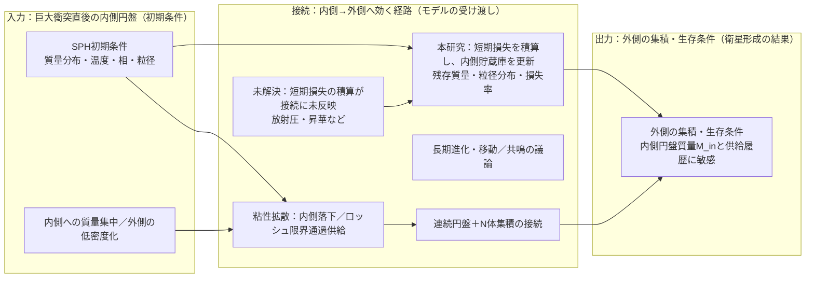

> **文書種別**: 解説（Diátaxis: Explanation）

# シミュレーション研究の背景と導入

本資料は、火星ロッシュ限界内ダスト円盤シミュレーション研究の科学的背景・目的・主要物理過程を整理したものです。ロッシュ限界内の質量収支が衛星形成条件へどう接続するか、そしてそれを定量化するためにどの過程を結合するかを、背景→問い→モデルの順で説明します。

本研究は、巨大衝突後に火星近傍へ形成される高温デブリ円盤のうち、**潮汐力のために集積が進みにくい境界の内側**であるロッシュ限界内に着目し、年スケールで起きうる固体質量の損失量を定量化することを目的とする。ロッシュ限界外では衝突による成長で衛星形成へつながり得る一方、ロッシュ限界内では物質が分散しやすく、質量は「外側へ供給される」か「失われる」ことでしか衛星形成へ寄与できない。

この問題設定の出発点は、衛星形成モデルがロッシュ限界内の円盤質量を主要な変数として扱うことにある。たとえば [@CanupSalmon2018_SciAdv4_eaar6887] は、ロッシュ限界内の物質を連続円盤として扱い、その質量 $M_{\rm in}$ と外縁 $r_{\rm d}$ が、外側で成長する衛星との重力相互作用と、衝突に由来する粘性で時間発展するとモデル化した。さらに、円盤が内側へ広がれば惑星へ落下し、外側へ広がってロッシュ限界を越えれば「新しい微小天体」として外側の集積計算へ供給される、と記述している。したがって、ロッシュ限界内の質量がどれだけ残るかは、外側の衛星形成へ影響し得る。

一方で、巨大衝突直後の火星は強い放射源になり得ること、そして火星放射の放射圧で凝縮粒子が除去され得ることも議論されている（[@Hyodo2018_ApJ860_150]）。さらに、巨大衝突直後の円盤の初期状態は、破片を多数の粒として扱い、流体のように運動を追う数値計算で推定されてきた。滑らかな粒子流体力学（Smoothed Particle Hydrodynamics）計算は、円盤物質が主として溶融物で蒸気は少量（$<5\%$）であること、衝突でメートル級の破片が $\sim100\,\mu$m まで砕かれ得ること、さらに蒸気の一部が $\sim0.1\,\mu$m 程度の微粒子として凝縮し得ることを示している（[@Hyodo2017a_ApJ845_125]）。放射圧と重力の比 $\beta$ は粒径や材質に依存し、サブミクロン粒子では放射圧の寄与が大きくなり得る（[@KimuraOkamotoMukai2002_Icarus157_349]）。このため、ロッシュ限界内の質量収支を評価する際には、放射による吹き飛びだけでなく、微粒子の供給源となる衝突による破砕と、高温での昇華による粒径変化を同じ枠組みで扱う必要がある。

## 0. 本資料の位置づけと参照先

- 本書は研究背景・先行研究・問い・採用する物理過程の意味づけをまとめた解説であり、数式の正規形と記号定義は `analysis/equations.md`、実装スコープ（1次元が基本、0次元はテスト用補助）と計算フローは `analysis/overview.md` を参照する。
- 実行レシピと運用手順は `analysis/run-recipes.md` と `analysis/AI_USAGE.md` を参照し、本書では前提と文脈の整理に留める。
- 制約と今後の展開は `analysis/discussion.md` にまとめ、本書は背景とモデルの位置づけに集中する。
- 標準の1D実行レシピは `analysis/run-recipes.md` を参照し、0Dベースラインはテスト用補助として `python -m marsdisk.run --config configs/base.yml` を使う。0D でも `out/series/run.parquet`、`out/summary.json`、`out/checks/mass_budget.csv` が生成される。運用のスイープでは温度到達を停止条件として使うため、`COOL_TO_K=1000` が既定になっている（`numerics.t_end_until_temperature_K` に反映）。この 1000 K は高温期の損失過程を区切るための運用上の閾値であり、物理的な臨界温度を意味しない。[scripts/runsets/windows/run_sweep.cmd:778–786][scripts/runsets/common/run_one.py:245–272]
- gas-poor を既定とし、光学的に厚いガス円盤を仮定する TL2003 の表層流出は `ALLOW_TL2003=false` のまま無効とする。gas-rich 感度試験でのみ明示的に有効化する。
- 本書で参照する主要式は、放射圧比 β (E.013)、ブローアウト境界 a_blow (E.014)、表層流出 Ṁ_out (E.009)、Smoluchowski 方程式 (E.010)、自遮蔽 κ_eff/Σ_τ=1/Φ (E.015–E.017)、昇華 HKL フラックス (E.018) に対応する（診断量との対応は「5.1」参照）。

---

## 1. 科学的背景

### 1.1 Phobos・Deimos の起源問題

火星には 2 つの小衛星 Phobos（フォボス）と Deimos（ダイモス）が存在する。起源については、主に次の二つが議論されてきた。

| 仮説 | 概要 |
|---|---|
| 捕獲起源 | 小天体が火星に捕獲されたとする。 |
| 巨大衝突起源 | 火星への巨大衝突で生じた円盤から集積したとする。 |

捕獲起源は、スペクトルが小天体に似る点と整合し得る一方、ほぼ円軌道で赤道面に近い軌道をどのように作るかが論点になる。巨大衝突起源は、赤道面に近い円盤からの集積で軌道の特徴を説明しやすい（[@CanupSalmon2018_SciAdv4_eaar6887]; [@Hyodo2018_ApJ860_150]）。一方で、起源自体は未確定であり、in situ 形成と捕獲の双方が残ることが整理されている（[@Kuramoto2024]）。同レビューは、捕獲起源と巨大衝突起源の観測要件を整理し、gas-poor / gas-rich の円盤条件の位置付けを明確化している（[@Kuramoto2024]）。同レビューは、in situ の中では巨大衝突が最も成功しているシナリオであるとも述べている。したがって本研究は、巨大衝突起源を仮定した場合の円盤散逸に焦点を当てる。起源論の整理としては、[@Rosenblatt2019_arXiv] も参照できる。

[@Kuramoto2024] に基づくと、物性値の整合は次のように整理できる。

| 観測される物性値 | 巨大衝突起源と整合しやすい読み | 捕獲起源と整合しやすい読み |
| --- | --- | --- |
| 低密度（C型小惑星に近い密度帯、岩石平均 ~3 g/cm^3 より低い） | 高い空隙率＝ラブルパイル的な再集積は、衝突デブリの集積と相性がよい | 内部氷が寄与する場合は低温域起源を示唆し、捕獲説と整合 |
| 低アルベド (~0.02) とC/D/T型に近い反射スペクトル | 衝突で蒸発・凝縮した微細粒が低アルベド・弱吸収を与え得る | 炭素質小惑星に似た反射特性は捕獲説の主要根拠 |
| 低熱慣性（20-85 J m^-2 K^-1 s^-1/2）と細粒レゴリス | 衝突園芸で細粒が蓄積する描像と整合 | 表層進化で説明可能で、単独では判別力が弱い |

### 1.2 巨大衝突円盤と本研究が扱う範囲

本節では、ロッシュ限界内外の先行研究を「入力（初期条件）」「接続（内側→外側の受け渡し）」「出力（外側の形成・生存条件）」の観点で整理し、未解決点は接続の欠損として位置づける。

**内側（ロッシュ限界内, 入力）**: 衝突直後（〜数十時間）の SPH 計算は、半径方向の質量分布・温度・相・粒径帯を出力し、内側円盤の初期条件を与える（[@Citron2015_Icarus252_334]; [@Hyodo2017a_ApJ845_125]; [@Hyodo2018_ApJ860_150]）。[@Citron2015_Icarus252_334] は Borealis 級衝突（$E\sim3\times10^{29}$ J, $M_{\rm imp}\sim0.026\,M_{\rm Mars}$）で、$t\approx30$ h 時点の円盤質量が $\sim5\times10^{20}$ kg となり、インパクター質量の 1–4% に相当することを示した。粒子数を $3\times10^{5}$〜$10^{6}$ に変えても 40 h 以降の円盤質量はほぼ一致し、$L_d<1$ のケースが大勢であるため、質量の大半がロッシュ限界内に集中していることが分かる。さらに彼らは、SPH の人工拡散により「数十時間以降の円盤質量推定は有効性が落ちる」点を明記し、初期条件を長期進化モデルへ渡す必要性を述べている。[@Rosenblatt2016_NatGeo9_8] も [@Citron2015_Icarus252_334] の SPH を再現し、円盤質量のほとんどがロッシュ限界内で、外側は総量の最大 1% 程度（SPH 粒子が数個）に留まることを示した。つまり、**内側は高密度で初期条件が比較的確定している一方、外側の質量分布は SPH では解像できず再構成が必要**である。

**外側（ロッシュ限界外, 出力）**: 粘性拡散と集積を結合する研究は、外側の集積・生存条件を「出力」として与える。[@SalmonCharnozBrahic2010_Icarus209_771] は、粘性拡散が円盤の質量と角運動量を再配分し、惑星への落下やロッシュ限界通過によって質量が失われ得ることを示し、結果が粘性モデルに敏感であることを強調した。[@CridaCharnoz2012_Science338_1196] は、円盤寿命 $t_{\rm disk}=M_{\rm disk}/(F T_R)$ を導入し、拡散が遅いと多数の衛星列が、速いと単一の大型衛星が形成されるというレジームを整理している。[@Rosenblatt2012_Icarus221_806] は火星系へ適用し、強い潮汐レジームで過去の衛星総量（$8.3\times10^{17}$–$1.5\times10^{19}$ kg）を説明するには、円盤質量が $8.3\times10^{19}$–$1.5\times10^{21}$ kg 程度必要になると示した。[@CanupSalmon2018_SciAdv4_eaar6887] は内側円盤質量 $M_{\rm in}$ と外縁 $r_{\rm d}$ の進化を外側集積に結びつけ、外側の生存条件が内側円盤の質量と供給履歴に敏感であることを明示している。

**内側→外側の結び目**: 内側連続円盤と外側 N 体を接続する枠組みは、内側の供給履歴が外側形成に直接入ることを明示する（[@CanupSalmon2018_SciAdv4_eaar6887]）。[@Rosenblatt2016_NatGeo9_8] は、内側円盤の粘性拡散で形成される $10^{19}$ kg 級の内側衛星が、約 3400 年で $4.4\,R_{\rm Mars}$ 付近まで移動し、2:1・3:2 共鳴が外側の衛星胚（4.2–7 $R_{\rm Mars}$）を励起して 2 つの小衛星形成を促すこと、内側衛星は約 5 Myr で火星へ落下することを示した。これは、**内側円盤の質量と供給履歴が外側形成の必須入力**であることを具体的に示す。

**未解決点と本研究の範囲**: 巨大衝突直後の高温環境では、蒸気の流体脱出や放射圧で凝縮粒子が最初の 1 周回で除去され得ることが示されている（[@Hyodo2018_ApJ860_150]）。また、衝突直後の円盤は傾いた高離心のデブリとして生成され、$J_2$ による歳差と非弾性衝突で傾斜・離心率が減衰して赤道面へ落ち着く一方、衝突破砕を含めた詳細進化は未解決で直接計算が必要とされる（[@Hyodo2017b_ApJ851_122]）。これら短期損失の積算は、拡散・集積モデルの主計算には取り込まれていない。したがって本研究は、**ロッシュ限界内で失われる成分**を、微粒子の生成と除去を結合したモデルで評価し、内側貯蔵庫の入力を更新することに焦点を置く。ここで「損失」は、放射圧除去や昇華によりロッシュ限界内の固体質量が短時間で内側領域から除かれることとして扱い、必ずしも火星重力圏の外まで出ることを意味しない。

以下の図は、先行研究を入力・接続・出力の役割に分け、接続の欠損（未解決点）と本研究の位置を示したものである。図中は機能名を短く示し、代表文献は図の下に整理する。

**図中の代表文献**

- IN1: [@Citron2015_Icarus252_334; @Hyodo2017a_ApJ845_125; @Hyodo2018_ApJ860_150]
- IN2: [@Citron2015_Icarus252_334; @Rosenblatt2016_NatGeo9_8]
- MID1: [@SalmonCharnozBrahic2010_Icarus209_771; @CridaCharnoz2012_Science338_1196]
- MID2: [@CanupSalmon2018_SciAdv4_eaar6887]
- MID3: [@Rosenblatt2012_Icarus221_806; @Rosenblatt2016_NatGeo9_8]
- GAP: [@Hyodo2018_ApJ860_150]
- OUT1: [@CanupSalmon2018_SciAdv4_eaar6887]

### 1.3 ガスが少ない円盤という前提と意味

本研究は、ガスが少ない衝突起源円盤を標準前提とする。本資料では、このような条件を「ガスが少ない条件」と書く。

[@Hyodo2017a_ApJ845_125] は、衝突直後の円盤物質が主として溶融物で蒸気は少量であることを示しており、この点は「ガスが少ない条件」の根拠になる。また [@Hyodo2018_ApJ860_150] は、巨大衝突直後の火星表面が高温になり得ること、放射圧で凝縮粒子が除去され得ることを議論している。ガスが少ない場合、微粒子はガスに保持されにくくなり、放射による吹き飛びや高温昇華が、短い時間で表層の質量を変えやすい。

一方で、光学的に厚いガス円盤を仮定した表層流出モデルは、ガスとダストの相互作用を通じて表層ダストが外向きに運ばれることを扱う（[@TakeuchiLin2003_ApJ593_524]）。本研究はガスが少ない条件を主線に置くため、これらの式を標準モデルとしては用いない。ただし、「放射が届くのは表層に限られる」という構造そのものは、遮蔽の取り扱いを考える上で参照になる。

---

## 2. 先行研究と未解決点

### 2.1 初期条件を与える研究

巨大衝突直後の円盤の質量・温度・蒸気分率などは、粒子法計算により与えられてきた。[@Hyodo2017a_ApJ845_125] は、円盤物質が約 2000 K に加熱され、主として溶融物である一方、蒸気は $<5\%$ 程度にとどまることを報告している。また、メートル級の破片が衝突で $\sim100\,\mu$m まで砕かれ得ることや、蒸気の一部が $\sim0.1\,\mu$m の微粒子として凝縮し得ることも示している。これらは、ロッシュ限界内においても放射圧に敏感な粒径帯が存在し得ることを意味する。

また、衝突条件による円盤質量や角運動量のばらつきは [@Citron2015_Icarus252_334] に整理されており、SPH 計算だけでは長期進化を追えないため、円盤進化モデルの入力として要約する必要があると述べられている。[@Rosenblatt2016_NatGeo9_8] も外側円盤は低密度で分解能が限られるため、外側の初期条件を再構成して与える必要があると指摘している。

[@Hyodo2017b_ApJ851_122] は、粒子間の非弾性衝突で離心率・傾斜角が短時間で減衰し、薄い円盤へ移ることを示唆している一方、詳細な衝突進化の時間スケールは未解決であり、破砕を含めた直接 N 体計算が必要だと述べている。

ただし、初期条件が与えられても、ロッシュ限界内で **その後すぐに** 起きる微粒子の生成と除去が積算されていなければ、外側へ供給され得る質量がどれだけ残るかは決まらない。ここが、本研究が埋めたい空白である。

### 2.2 形成と生存条件を与える研究

円盤の拡散と衛星形成を結びつける研究では、Phobos・Deimos のような小衛星を残すために必要な条件が議論されている。[@CanupSalmon2018_SciAdv4_eaar6887] は、ロッシュ限界内を連続円盤として扱い、ロッシュ限界外では多数の天体の重力運動を直接追う計算を結合したモデルを用い、ここで多数の天体を同時に追う計算を N体（N-body）計算と呼ぶ。円盤質量や潮汐パラメータに応じて最終的に残る衛星の性質が変わることを示した。たとえば、同期軌道付近に小衛星が残るためには、初期円盤質量が $M_{\rm disk} \le 3 \times 10^{-5} M_{\rm M}$ であることが必要だ、という形で制約を与えている。

[@Rosenblatt2012_Icarus221_806] も、粘性拡散で内外へ広がる円盤と外側での微小天体形成をモデル化したが、簡略化のため粘性加熱や放射冷却を含む熱進化は取り込んでいない。したがって、熱と粒径に結びつく短期損失は別途評価する余地が残る。

潮汐ディスクから衛星が形成される一般論として、[@CridaCharnoz2012_Science338_1196] は、ロッシュ限界内の高密度リングが拡散して外側で衛星が成長する枠組みを示し、衛星の成長段階がディスク寿命に強く依存することを定式化した。またリングの消散機構は未解決で、粘性拡散だけではリングが消えにくいとも述べている。リング進化の実例として、[@SalmonCharnozBrahic2010_Icarus209_771] は粘性拡散が質量・角運動量を再配分し、惑星への落下やロッシュ限界通過で質量が失われ得ることを整理している。これらは氷質リング・長時間スケールの議論だが、損失項が総質量を動かし得るという構造は本研究の問題意識と共通する。

ここで重要なのは、同モデルにおいてロッシュ限界内の円盤質量 $M_{\rm in}$ が、外側へ供給される「新しい微小天体」の総量と、外側衛星へのトルクの双方に関わる点である。言い換えると、ロッシュ限界内の質量がどの程度の速度で減るかは、外側での集積史へ影響し得る。

しかし [@CanupSalmon2018_SciAdv4_eaar6887] が定義するロッシュ限界内の円盤の質量除去は、主として「内側へ広がって惑星へ落下する」過程と「外側へ広がってロッシュ限界を越え、外側モデルへ加わる」過程である。巨大衝突直後の火星放射による放射圧や、高温での昇華が、ロッシュ限界内の質量収支にどの程度の追加シンクとして働くかは、同モデルの主計算からは直接は読み取れない。したがって、形成モデルが与える生存条件を、粒子法計算が与える初期条件へ接続するためには、ロッシュ限界内での短期損失を独立に見積もる必要がある。

### 2.3 砕ける 吹き飛ぶ 蒸発するを同時に扱う理由

ガスが少ないデブリ円盤では、衝突カスケードで生じた最小破片が放射圧で吹き飛び、ブローアウトが主要な質量損失経路になり得るという一般的な整理がある（[@Krivov2010_arXiv]）。ただし火星周回円盤は放射源や時間スケールが異なるため、同じ因果の型がどの程度成り立つかは本研究で定量的に評価する。

ここで本研究が問題として扱うのは、放射による吹き飛ばしの効率が、放射の強さだけで一意には決まらないという点である。

放射圧と重力の比 $\beta$ は粒子の大きさや材質に依存し、吹き飛びやすい粒径帯を与える指標になる（[@KimuraOkamotoMukai2002_Icarus157_349]）。しかし「どれだけの質量が失われるか」は、吹き飛びの閾値に加えて、吹き飛びやすい粒子がどれだけ表層に存在するかで変わる。表層の微粒子は、次の三つの過程の競合で決まる。

- **供給**: 大きな粒が衝突で砕けて小粒子を作り続ける。これを衝突カスケードと呼ぶ。衝突カスケードは、質量をより小さな粒径へ流す（[@Wyatt2008]; (E.010)）。
- **除去**: 小粒子は放射圧で力学的時間スケールで除去され得る。衝突カスケードの最小粒子側に急な切断が生じる、という整理もある（[@Wyatt2008]; (E.013), (E.014), (E.009)）。
- **表層の制限**: 円盤が光学的に厚い場合、放射を直接受けるのは表層に限られる。表層での外向き流出を扱った [@TakeuchiLin2003_ApJ593_524] も、流出が「光が当たる薄い表層」で起きることを強調している（(E.015)–(E.017)）。

さらに、衝突が支配的かどうかで、微粒子が内側領域に残るかどうかが変わることも示されている（[@StrubbeChiang2006_ApJ648_652]）。また、巨大衝突直後の高温環境では昇華が粒径を連続的に変え、吹き飛びやすい粒径帯へ粒子を押し込んだり、吹き飛ぶ前に消したりし得る（[@Hyodo2018_ApJ860_150]）。このため本研究では、吹き飛びだけを独立に見積もるのではなく、衝突による粒径分布の時間発展と昇華を同じ時間積分の中で扱い、表層質量から外向き流束を積分して累積損失を見積もる。

---

## 3. 研究目的と問い

本研究の目的は、火星ロッシュ限界内の高温ダスト円盤について、短時間（標準は火星表面温度が 1000 K 以下になるまで、固定地平を使う場合は 2 年）にわたる質量損失と粒径分布の時間発展を定量化し、形成モデルへ渡せる形の入力を作ることである。1000 K は高温期の損失過程を区切る運用上の閾値として用いる。火星表面温度が低下すると放射フラックスと昇華速度が弱まり、短期損失の主要部分が高温期に集中すると考えられるため、ここでは 1000 K を区切りとして用いる。特に、[@CanupSalmon2018_SciAdv4_eaar6887] のようにロッシュ限界内の円盤質量を明示的に扱う枠組みに対して、短期損失が $M_{\rm in}$ の初期値や時間変化にどの程度影響し得るかを評価する。[scripts/runsets/windows/run_sweep.cmd:778–786][scripts/runsets/common/run_one.py:245–272]

本研究が答えたい問いは、次の 3 点に整理できる。

1. ガスが少ない条件で、放射による吹き飛びと高温昇華によって、ロッシュ限界内の固体質量は火星表面温度が 1000 K 以下になるまでにどれだけ失われるか（固定地平では 2 年、1000 K は運用上の区切り）。
2. 粒径分布は時間とともにどのように変化し、吹き飛びやすい粒径帯にどれだけ質量が集まるか。
3. 初期条件（巨大衝突直後の円盤）から出発したとき、短期損失を考慮した残存質量は、形成モデルが要求する円盤質量レンジと整合するか。

---

## 4. モデルの概要

### 4.1 スコープ

本研究の計算は、ロッシュ限界内の半径方向を分割した 1 次元モデルを基本とし、粒径分布と表層質量の時間発展を追う。0 次元は代表半径の局所モデルとして、テストや感度検証の補助に用いる。

ガスが少ない条件を既定とするため、光学的に厚いガス円盤を前提にした表層流出モデルは標準では用いない。必要であれば、ガスが多い仮定の感度試験として切り替える。

### 4.2 放射による吹き飛びの条件と損失量

放射によって微粒子が重力から逃げる効果を扱う。これを放射圧ブローアウトと呼ぶ。吹き飛びの起きやすさは、放射圧と重力の比である $\beta$ で表し（(E.013)）、$\beta$ が閾値を超えると粒子は脱出しやすくなる（$\beta$ の意味づけは [@KimuraOkamotoMukai2002_Icarus157_349]を参照）。閾値粒径のブローアウト境界 $a_{\rm blow}$ は (E.014) に対応する。

本研究では、損失量を「閾値粒径」だけで決めない。ブローアウトの滞在時間は $t_{\rm blow}=1/\Omega$ を基本とし（(E.007)）、損失量は表層に存在する質量と軌道の時間スケールに依存するため、表層の外向き流束を
\[
\dot{M}_{\rm out} = \Sigma_{\rm surf}\,\Omega
\]
の形で評価する（(E.009)）。したがって、どの時刻にどれだけの表層質量が存在するかが、累積損失を左右する。

### 4.3 衝突による粒径分布の時間発展

衝突による粒径分布の進化を扱う。粒径ごとの個数が衝突で増えたり減ったりする過程を表す式として、衝突による粒径分布の式である Smoluchowski 方程式を用いる（(E.010)）。この式により、大粒子から小粒子が供給される一方で、衝突そのものによる消滅も同時に評価できる。表層衝突寿命のスケールは $t_{\rm coll}=1/(\Omega\tau_{\perp})$ を参照する（(E.006)）。破壊閾値 $Q_D^*$ は材料や衝突速度に依存するため、本文では代表条件を参照し、感度は補助図で押さえる。

本研究の動機に照らすと、この部分は「吹き飛びやすい微粒子が、どれだけ速く作られるか」を与える。吹き飛びが強くても供給が弱ければ表層は枯れるし、供給が強ければ表層に微粒子が溜まり損失が増える。したがって、砕け続けの時間発展を入れることは、損失量の見積もりに直結する。

### 4.4 高温昇華による粒径変化

高温で固体が表面から蒸発し、粒子が小さくなる過程を扱う。これを昇華と呼ぶ。表面からどれだけ蒸発するかは、気体分子の熱運動にもとづく式で見積もる。本研究では Hertz–Knudsen–Langmuir 式を用いる（(E.018)）。

ここで昇華は、独立した損失項であるだけでなく、粒径を縮めて吹き飛びの対象へ入れたり、逆に吹き飛ぶ前に消したりする。つまり昇華は、吹き飛びの前提となる粒径分布を時間とともに変える。このため、昇華を含めた粒径の時間発展を同じ時間積分の中で扱う。

### 4.5 遮蔽と表層再供給

円盤が光学的に厚い場合、放射を実際に受けるのは表層に限られる。そこで自遮蔽により「放射が届く表層の厚み」を決める係数 $\Phi$ を用い、表層がどれだけの質量を持ちうるかを診断する（(E.015)–(E.017)）。

巨大衝突の条件によっては、円盤が火星赤道面に対して傾いた状態で生成され得る。また火星の $J_2$ による歳差運動と非弾性衝突によって傾斜や離心率が減衰し、薄い赤道面円盤へ向かう過程が整理されている（[@Hyodo2017b_ApJ851_122]）。この遷移過程では円盤の鉛直厚みや配向が時間変化し得るため、表層が固定されない可能性がある。

そこで本モデルは、表層再供給（深部↔表層の入れ替わりを粗く表したもの）を任意に与えられる。ここでの表層再供給は、外側からの流入を精密に表すものではなく、傾斜や衝突減衰に伴う入れ替わりを直接定量化できないための感度試験のノブとして位置づける。したがって、基本ケースでは供給なし（または最小限）で損失の下限を見積もり、供給を入れたケースでは損失の上限を評価する、という使い方が自然である。

---

## 5. 主要出力と先行研究への接続

本研究が直接提供するのは、ロッシュ限界内での短期の質量収支である。具体的な出力は、次の三つに集約できる。

- 時間依存の損失率と累積損失
- 粒径分布の時間発展
- 吹き飛び境界や遮蔽指標など、損失を左右する診断量

### 5.1 数式と診断量の対応（代表例）

- 放射圧比 $\beta$ とブローアウト境界 $a_{\rm blow}$ は (E.013), (E.014) に対応し、吹き飛び判定と粒径下限の診断に用いる。
- 表層流出率 $\dot{M}_{\rm out}$ は (E.009) に対応し、時間依存の損失率と累積損失 $M_{\rm loss}$ の積分に使う。
- 破砕供給は Smoluchowski 方程式 (E.010) に対応し、微粒子供給率と粒径分布の時間変化を与える。
- 自遮蔽は κ_eff/Σ_τ=1/Φ の式 (E.015)–(E.017) に対応し、放射が届く表層の上限を規定する。
- 昇華による質量フラックスは HKL 式 (E.018) に対応し、シンク項と粒径縮小の寄与を与える。
- 質量収支の整合性は (E.011) の誤差評価に対応し、`checks/mass_budget.csv` で記録する。

この出力を先行研究へ接続する基本手順は次の通りである。粒子法計算が与える初期円盤質量から出発し、本研究が求めた累積損失を差し引いて短期損失を織り込んだ残存質量を得る。その残存質量を、[@CanupSalmon2018_SciAdv4_eaar6887] のような形成モデルの初期条件または $M_{\rm in}$ の追加シンクとして与え、Phobos・Deimos を残せる条件がどの程度変わるかを評価する。つまり本研究は、初期条件と生存条件の間にある質量収支のギャップを埋める役割を持つ。

---

## 6. 先行研究図の差し込み案（章0–5対応）

以下は、本書の章立て（0→5）に沿って、主張の補強を目的に「どの図をどこへ入れると流れが壊れにくいか」を整理した配置案である。図番号は原典で最終確認することを前提とする。`source_link_or_hint` が `paper/pdf_extractor/outputs/.../images` を指す場合は、同ディレクトリの `result.md` を参照して図番号と画像ファイル（`p*_img*`）の対応を確認する。

### 0. シミュレーション研究の背景と導入

| section | figure                      | status    | insert_position | insert_text                                                                                                                          | caption                                                               | source_link_or_hint                                 | notes                                                                                                  |
| ------- | --------------------------- | --------- | --------------- | ------------------------------------------------------------------------------------------------------------------------------------ | --------------------------------------------------------------------- | --------------------------------------------------- | ------------------------------------------------------------------------------------------------------ |
| 0       | [@Kuramoto2024] Fig.2 | confirmed | 0章直後（1.1の前）     | 火星と衛星系の力学構造（ロッシュ限界や衛星軌道）を最初に視覚化すると、以降の「内側円盤に着目する理由」が入れやすくなる。 | 火星周回系の力学構造と衛星軌道の概観を示す。ロッシュ限界内外の位置づけを導入段階で共有できる。 | `paper/pdf_extractor/outputs/Kuramoto2024/images` | **利用**：CC BY 4.0。図中に第三者著作が含まれる場合はクレジット表記を確認する。 |
| 0       | [@CanupSalmon2018_SciAdv4_eaar6887] Fig.1 | confirmed | 0章直後（1.1の前）     | 先行研究では、衝突で生じた円盤を「ロッシュ限界内の連続円盤」と「外側の集積領域」に分けて扱い、内側円盤の状態が外側の衛星系に波及しうる枠組みが示されている。 本研究はこの枠組みのうち、内側円盤の総質量が短時間でどれだけ減りうるかを、損失過程に焦点を当てて評価する。 | ロッシュ限界内の連続円盤と外側の集積を同時に扱うモデル例。内側円盤の時間発展が外側で残る小衛星の条件に影響しうることを、全体像として示す。 | `paper/pdf_extractor/outputs/CanupSalmon2018_SciAdv4_eaar6887/images` | **利用**：本論文は CC BY‑NC 4.0（商用不可）で再利用条件が明確。 **解像度**：PMC の “Open in a new tab” から画像抽出→PNG化（300–600 dpi推奨）。 |

---

### 1.1 研究対象：火星衛星 Phobos・Deimos の起源

| section | figure                      | status    | insert_position                  | insert_text                                                                                                    | caption                                                                     | source_link_or_hint                                 | notes                                                                 |
| ------- | --------------------------- | --------- | -------------------------------- | -------------------------------------------------------------------------------------------------------------- | --------------------------------------------------------------------------- | --------------------------------------------------- | --------------------------------------------------------------------- |
| 1.1     | [@CanupSalmon2018_SciAdv4_eaar6887] Fig.2 | confirmed | 捕獲説 vs 巨大衝突説の表の直後／「巨大衝突説が有力」の段落末 | 巨大衝突起源を前提にすると、初期円盤の質量がわずかに変わるだけで、同期軌道外に残る衛星の「残りやすさ」と「残る総質量」が大きく変わる。 したがって、円盤質量を動かしうる損失項があるなら、それは衛星形成の帰結を左右しうる。 | 初期円盤質量と潮汐条件に対して、同期軌道外に残る衛星の総質量と生存確率がどう変わるかを示す。小衛星を残すには円盤質量に上限があることが視覚的に分かる。 | `paper/pdf_extractor/outputs/CanupSalmon2018_SciAdv4_eaar6887/images` | **利用**：CC BY‑NC 4.0。 **使い方**：スライドでは “質量上限がある” という一点に注釈矢印を置くと導入が崩れにくい。 |

---

### 1.2 巨大衝突シナリオの概要

| section | figure                                | status    | insert_position               | insert_text                                                                                 | caption                                                         | source_link_or_hint                                 | notes                                                    |
| ------- | ------------------------------------- | --------- | ----------------------------- | ------------------------------------------------------------------------------------------- | --------------------------------------------------------------- | --------------------------------------------------- | -------------------------------------------------------- |
| 1.2     | [@CanupSalmon2018_SciAdv4_eaar6887] Fig.3           | confirmed | フローチャート直後（「巨大衝突→円盤形成」を言い切った後） | 巨大衝突が作る円盤は、同じ“衝突起源”でも質量や温度、蒸気割合が一様ではない。 後段で損失を議論するために、まず「初期に何がどこへ分布していたか」を、先行研究の具体例で固定しておく。 | Vesta級衝突のSPH計算例。円盤質量や温度レンジ、蒸気割合などの初期条件が、衝突条件によって具体的に与えられることを示す。 | `paper/pdf_extractor/outputs/CanupSalmon2018_SciAdv4_eaar6887/images` | **利用**：CC BY‑NC 4.0。 **解像度**：図中の温度カラーバーが読めるよう、拡大トリミング推奨。 |
| 1.2     | [@CanupSalmon2018_SciAdv4_eaar6887] Fig.4D（panel D） | confirmed | 同上（Fig.3の直後に続けて）              | さらに重要なのは、円盤の総質量だけでなく「半径方向にどこまで質量が届いているか」である。 本研究が扱う短期損失は、この初期の質量分布を削り、後続の輸送・集積に効きうる。        | 低質量円盤の累積質量分布（パネルD）。外側（衛星形成に関与する領域）にどれだけ質量があるかが、後続の形成可能性を制約する。   | `paper/pdf_extractor/outputs/CanupSalmon2018_SciAdv4_eaar6887/images` | **使い方**：パネルDだけを切り出し、他パネルは本文で“別の整理軸”として触れると混線しにくい。        |
| 1.2     | [@Citron2015_Icarus252_334] Fig.1           | confirmed | 1.2の末尾（初期円盤の質量スケールを固定する段落） | Borealis 級衝突の SPH 計算では、円盤質量が $\sim5\\times10^{20}$ kg 規模で時間的に安定し、粒子数の違いによる差が小さいことが示されている。内側円盤の質量スケールを具体的に固定できるため、本研究が扱う損失量の比較軸になる。 | SPH 計算における円盤質量の時間変化（粒子数を変えた比較）。円盤質量が $\\sim5\\times10^{20}$ kg 規模で落ち着くことを示す。 | `https://arxiv.org/pdf/1503.05623.pdf` | **注意**：$L_d^*<1$ によるロッシュ内集中は本文記述で補う。図は質量スケールの裏付けに使う。 |
| 1.2     | [@Rosenblatt2016_NatGeo9_8] Fig.1       | confirmed | 同上（ロッシュ内集中の根拠を示す段落） | 円盤質量の空間分布を見ると、ロッシュ限界内に大半が集中し、外側は低密度の外延部に留まる。したがって内側質量の短期損失は初期条件を直接動かし得る。 | 巨大衝突後の円盤質量分布。ロッシュ限界内に質量が集中し、外側は低密度であることを示す。 | `https://www.nature.com/articles/ngeo2742` | **補足**：Nature Geoscience の本文 PDF は購読条件があるため、図の取得経路は別途確認する。 |

---

### 1.3 Gas-poor（ガス希薄）円盤の前提

| section | figure                    | status    | insert_position   | insert_text                                                                                          | caption                                                                        | source_link_or_hint                | notes                                                               |
| ------- | ------------------------- | --------- | ----------------- | ---------------------------------------------------------------------------------------------------- | ------------------------------------------------------------------------------ | ---------------------------------- | ------------------------------------------------------------------- |
| 1.3     | [@Hyodo2017a_ApJ845_125] Fig.5 | confirmed | 「melt が大部分」の主張の直後 | 衝突直後の円盤が高温でも、円盤物質の大半が溶融で、蒸気は少量にとどまり得る。 したがって本研究の「ガスが少ない条件」は現実の断定ではなく、微粒子の損失過程を切り出して効きを測るための前提として置ける。 | 衝突直後の円盤の温度と比エントロピーの半径依存。温度が概ね2000 K程度で、比エントロピーから蒸気割合が小さいこと（本文中でレバー則により評価）を支える。 | `paper/pdf_extractor/outputs/Hyodo2017a_ApJ845_125/images` | **注意**：Fig.5自体は温度・エントロピー図で、蒸気割合は本文の計算で導かれている点をキャプションで明示すると誤読を避けられる。 |

---

### 2.1 シミュレーションの目標

| section | figure                               | status    | insert_position   | insert_text                                                                                                     | caption                                                             | source_link_or_hint                                 | notes                                                                        |
| ------- | ------------------------------------ | --------- | ----------------- | --------------------------------------------------------------------------------------------------------------- | ------------------------------------------------------------------- | --------------------------------------------------- | ---------------------------------------------------------------------------- |
| 2.1     | [@CanupSalmon2018_SciAdv4_eaar6887] Fig.1（→Fig.2へ） | confirmed | 2.1冒頭（枠組み提示→感度提示） | 先行研究が用いた枠組み（内側円盤＋外側集積）を一度図で共有し、そのうえで「どの軸に結果が敏感か」を図で確認する。 本研究の目標は、その敏感軸（円盤質量）を動かしうる短期損失の大きさを、物理過程を分解して見積もることにある。 | Fig.1は枠組み、Fig.2は感度を示す。両者を連続して提示することで、「どこに未評価の損失項を足すのか」が導入段階で視覚化できる。 | `paper/pdf_extractor/outputs/CanupSalmon2018_SciAdv4_eaar6887/images` | **利用**：CC BY‑NC 4.0。 **差し替え**：Fig.1の上に“新しい損失矢印”を重ねる場合は、元図と別レイヤで作る（後の差し替えが楽）。 |

---

### 2.2 主要出力

| section | figure                          | status    | insert_position | insert_text                                                                                            | caption                                                                            | source_link_or_hint                                 | notes                                           |
| ------- | ------------------------------- | --------- | --------------- | ------------------------------------------------------------------------------------------------------ | ---------------------------------------------------------------------------------- | --------------------------------------------------- | ----------------------------------------------- |
| 2.2     | [@CanupSalmon2018_SciAdv4_eaar6887] Fig.2（再掲） | confirmed | 2.2冒頭           | 本研究の主要出力（短期の損失率・累積損失・粒径分布の時間発展）は、先行研究が“結果に効く”と示した軸（円盤質量）へ直接つながる。 したがって出力は、形成モデル全体に対する感度評価として読む位置づけになる。 | 初期円盤質量が変わると、最終的に残る衛星質量が大きく変わることを示す。ここに短期損失を重ねることで、「質量がどれだけ減ると結果が変わり得るか」を見積もる導線になる。 | `paper/pdf_extractor/outputs/CanupSalmon2018_SciAdv4_eaar6887/images` | **注意**：この再掲は“導入の釘”なので、本文側の説明は短く、次章で損失過程へ進むのが安全。 |
| 2.2     | [@CridaCharnoz2012_Science338_1196] Fig.2 | confirmed | 2.2冒頭（一般枠組みの補足）           | ロッシュ限界内のリングが拡散して外側で衛星が形成される枠組みを示す図を挿むことで、「円盤寿命が衛星形成に効く」という一般論を支える。 | リングの拡散と衛星成長の三つのレジームを示す模式図。円盤寿命が衛星形成の段階を支配することを視覚化できる。 | `paper/references/CridaCharnoz2012_Science338_1196.pdf` | **注意**：Science の図は転載条件の確認が必要。必要なら自作模式図に置換する。 |

---

### 3.1 放射圧ブローアウト

| section | figure                           | status    | insert_position                                      | insert_text                                                                                                 | caption                                                              | source_link_or_hint                                                                 | notes                                                                                            |
| ------- | -------------------------------- | --------- | ---------------------------------------------------- | ----------------------------------------------------------------------------------------------------------- | -------------------------------------------------------------------- | ----------------------------------------------------------------------------------- | ------------------------------------------------------------------------------------------------ |
| 3.1     | [@Hyodo2018_ApJ860_150] Fig.6        | confirmed | β（光の押す力と重力の比）を定義し、blowout条件を述べた直後（(E.013),(E.014)直後） | 粒が飛ぶかどうかは、光の押す力と重力の比（β）だけでなく、粒がいつ・どこで凝縮したか（凝縮温度）と軌道要素にも依存する。 この依存性がある以上、「放射が強い」だけでは損失量が一意に決まらない、という問題設定が立つ。 | βと凝縮温度の組で、放射圧で除去される領域（黄色）が決まることを示す。除去は“放射の強さ”だけでなく、凝縮条件と軌道の幾何に制約される。 | `paper/pdf_extractor/outputs/Hyodo2018_ApJ860_150/images`                          | **解像度**：PDFはベクタに近いので、スライドではSVG/PDF貼りが最も鮮明。                                                       |
| 3.1     | 自作：放射圧模式図（β） | confirmed | βの直感説明（数式の直後）                                        | βを式で定義した直後に、力の向きと状況を図で示すと、以後の議論が“条件の列挙”に見えにくくなる。 本研究では、この基本配置の上で「どの粒が外へ出ていくか」を扱う。                           | 放射圧と重力のベクトル関係を模式的に示す。βの意味（光が押す力と重力の比）が、力の向きとして理解できる。               | （自作） | **出典**：概念は [@Burns1979_Icarus40_1] に基づくが、図は転載せず自作する。 |

---

### 3.2 衝突カスケード

| section | figure                      | status    | insert_position              | insert_text                                                                                             | caption                                                                                                 | source_link_or_hint                                                     | notes                                                                    |
| ------- | --------------------------- | --------- | ---------------------------- | ------------------------------------------------------------------------------------------------------- | ------------------------------------------------------------------------------------------------------- | ----------------------------------------------------------------------- | ------------------------------------------------------------------------ |
| 3.2     | [@Hyodo2017a_ApJ845_125] Fig.6   | confirmed | 3.2冒頭（破壊的衝突が起き得る根拠）          | 衝突直後のデブリは高い離心率を持ち、周回の途中で相対速度が上がるため、破壊的衝突が起きうる。 したがって「細粒が供給されるか」は仮定ではなく、初期軌道の結果として検討対象になる。               | 衝突直後の粒子の離心率分布と、そこから見積もられる衝突速度・比衝突エネルギー。破砕が起きうる速度域が、初期条件として与えられていることを示す。                                 | `paper/pdf_extractor/outputs/Hyodo2017a_ApJ845_125/images`                                      | **使い方**：右パネル（速度・比エネルギー）だけを強調すると、“なぜ砕けると言えるか”が一枚で通る。                      |
| 3.2     | [@BenzAsphaug1999_Icarus142_5] Fig.2 | confirmed | Hyodo Fig.6 の直後（“閾値と比較する”段落） | 破砕が起きうるかは、衝突エネルギーを「壊すのに必要な閾値」と比較して判断できる。 本研究では、Hyodo が与える比エネルギーが、この種の閾値を上回りうる条件にあるかを参照して、細粒供給の現実性を押さえる。 | 玄武岩（basalt）ターゲットに対する破壊閾値（catastrophic disruption threshold）のサイズ依存（衝突速度3 km/s）。比衝突エネルギーを閾値と並べて議論する根拠になる。 | `paper/pdf_extractor/outputs/BenzAsphaug1999_Icarus142_5/images` | **採用はFig.2のみ**。速度・材料依存は本文1文で補足し、図は増やさない。 |

---

### 3.2（補強）砕ける→飛ぶの連結を示す外部事例

| section | figure                           | status    | insert_position           | insert_text                                                                                                        | caption                                                                     | source_link_or_hint                                                    | notes                                                     |
| ------- | -------------------------------- | --------- | ------------------------- | ------------------------------------------------------------------------------------------------------------------ | --------------------------------------------------------------------------- | ---------------------------------------------------------------------- | --------------------------------------------------------- |
| 3.2（補強） | [@Krivov2010_arXiv] Fig.2 | confirmed | 3.2後半（“供給と除去の結合”へ話をつなぐ直前） | デブリ円盤の一般論として、衝突カスケードで作られる粒径分布にブローアウト由来の切れ目が生じることが示されている。火星円盤では数値は異なるが、因果の型を示す参考図として使える。 | 衝突カスケードで形成される粒径分布と、ブローアウトサイズ付近の“ノッチ”を示すモデル結果。除去条件が分布形状を変えることの一般例。 | `https://arxiv.org/pdf/1003.5229.pdf` | **注意**：中心星周りデブリ円盤の一般論。数値は火星円盤へ直接適用しない。 |
| 3.2（補強） | [@ThebaultAugereau2007_AA472_169] Fig.7 | confirmed | 4章冒頭へ回しても可（相互作用総括の直前）     | 放射圧の“カットオフサイズ”が変わるだけで、系全体の粒径分布の形が系統的に変わる。 したがって、吹き飛び条件は“粒が飛ぶ/飛ばない”だけでなく、供給された質量がどこで止まるかを通じて質量流束を変えうる。              | 放射圧カットオフサイズの違いが、粒径分布（とくに小粒側）をどの程度変えるかを示す。除去の閾値が分布形状を決める例。                   | `paper/pdf_extractor/outputs/ThebaultAugereau2007_AA472_169/images` | **注意**：中心星デブリ円盤で時間スケールが長い。因果の形の参照に限定する旨をキャプションで明記する。 |

---

### 3.3 昇華（Sublimation）

| section | figure                        | status    | insert_position                 | insert_text                                                                                    | caption                                                                 | source_link_or_hint                                        | notes                                                                                                                                                                             |
| ------- | ----------------------------- | --------- | ------------------------------- | ---------------------------------------------------------------------------------------------- | ----------------------------------------------------------------------- | ---------------------------------------------------------- | --------------------------------------------------------------------------------------------------------------------------------------------------------------------------------- |
| 3.3     | [@Hyodo2018_ApJ860_150] Fig.3     | confirmed | HKL式の導入前（“温度が支配変数”を言い切った直後でも可）  | 昇華は温度で強く変わるため、まず「どの距離でどの温度になるか」を図で固定してから、昇華フラックスの式へ進む。 これにより、以降の議論が“式の説明”ではなく“温度条件の議論”になる。     | 火星からの距離に対する粒子温度（火星温度・吸収係数の違いを含む）。昇華を議論する前提として、温度場が距離でどう変わるかを示す。         | `paper/pdf_extractor/outputs/Hyodo2018_ApJ860_150/images` | 図中のパネル（Q̄abs別）をどこまで出すかは、導入の丁寧さとスライド枚数のトレード。                                                                                                                                       |
| 3.3     | 自作：飽和蒸気圧–温度曲線 | confirmed | HKL式の直後（蒸気圧–温度の依存を示す） | HKL式で使う飽和蒸気圧が温度で急激に変わることを示すため、蒸気圧–温度曲線を自作で示す。温度依存の強さを視覚化することで、昇華の効き方が温度で大きく変わることを直感的に伝える。 | 飽和蒸気圧の温度依存を示す自作曲線。HKL式の感度が温度で急変することを視覚的に示す。 | （自作） | **データ**：JANAF 等の公開データを使用し、温度範囲は Hyodo Fig.3 の軸に合わせて設定する。 |
| 3.3     | [@Pignatale2018_ApJ853_118] Fig.2 | confirmed | HKL式の直後（“どの種がどの温度で出る/残るか”の説明）   | HKL式で必要なのは「温度が変わると、どの成分がどの順に固相へ移るか／揮発しやすいか」という目安である。 先行研究の凝縮系列を併置し、あなたのモデルで置く凝縮温度の意味を外部参照で支える。 | 衝突後のガスが冷えるとき、主要なダスト種が温度に応じてどう凝縮するか（凝縮系列）を示す。凝縮温度をパラメータに置く妥当性を補強する。      | `paper/pdf_extractor/outputs/Pignatale2018_ApJ853_118/images`                         | **補足**：arXiv 版の Fig.2 を確認済み。誌面版へ差し替える場合のみ図番号の再確認が必要。 |
| 3.3     | [@Pignatale2018_ApJ853_118] Fig.3 | confirmed | Fig.2の直後（“中程度揮発性”を論じる段落）        | 放射圧除去や昇華が効くのは、元素の揮発性（どの温度で固相へ移るか）とも結びつく。 そこで Na・K・Zn などの凝縮温度帯を、先行研究図で一度見せておく。                  | Na・K・Zn 化合物の凝縮系列。中程度揮発性成分がどの温度帯でダストとして現れうるかを示し、損失議論の温度レンジを支える。          | `paper/pdf_extractor/outputs/Pignatale2018_ApJ853_118/images`                         | **補足**：arXiv 版の Fig.3 を確認済み。誌面版へ差し替える場合のみ図番号の再確認が必要。 |

---

### 3.4 自遮蔽効果（Self-Shielding）

| section | figure                              | status    | insert_position | insert_text                                                             | caption                                                           | source_link_or_hint | notes                                       |
| ------- | ----------------------------------- | --------- | --------------- | ----------------------------------------------------------------------- | ----------------------------------------------------------------- | ------------------- | ------------------------------------------- |
| 3.4     | 自作：円盤断面模式図（optically thick vs thin） | confirmed | 3.4導入段落の直後      | 放射による損失が効くのは、円盤全体ではなく表層に限られる。そこで、光が届く厚みが“損失できる質量の上限”を決める、という点を模式図で先に示す。 | 光学的に厚い場合は表層のみが加熱・除去され、薄い場合はより深部まで影響が及ぶ。損失項の効きが、幾何と光学厚で制限されることを示す。 | （自作）                | **推奨**：ここは転載図より、自作が強い。後段の式（Φなど）の意味が、図一枚で通る。 |

---

### 4. 物理過程の相互作用

| section | figure                           | status    | insert_position             | insert_text                                                                                | caption                                                        | source_link_or_hint                                                    | notes                                                       |
| ------- | -------------------------------- | --------- | --------------------------- | ------------------------------------------------------------------------------------------ | -------------------------------------------------------------- | ---------------------------------------------------------------------- | ----------------------------------------------------------- |
| 4       | [@Hyodo2017a_ApJ845_125] Fig.6        | confirmed | 4章冒頭（相互作用フロー直後）             | 相互作用の出発点は「細粒が供給されるか」であり、これは衝突直後の軌道・速度分布から必然的に決まる。 まず供給側の根拠を図で固定してから、除去側へ進む。                | 高離心→高相対速度→高比エネルギーという流れを、初期条件として示す。衝突カスケードが成立しうる根拠を与える。         | `paper/pdf_extractor/outputs/Hyodo2017a_ApJ845_125/images`                                     | 4章では“供給→除去→総質量”を一本の因果として見せたいので、Fig.6は右パネル中心が良い。             |
| 4       | [@Hyodo2018_ApJ860_150] Fig.6        | confirmed | 同上（[@Hyodo2017a_ApJ845_125] Fig.6の右隣など、並置） | 供給された細粒が外へ出るかは、β（光の押す力と重力の比）と凝縮条件で決まる。 したがって「砕ける→飛ぶ」を同じ時間発展でつなぐ必要がある。                      | βと凝縮温度で、除去される領域が決まることを示す。供給された細粒が“いつでも飛ぶ”わけではないことが分かる。         | `paper/pdf_extractor/outputs/Hyodo2018_ApJ860_150/images`             | ここは “条件の地図”なので、次に“量”へ進む導線（下の補助図提案）を置くと筋が強くなる。               |
| 4       | [@ThebaultAugereau2007_AA472_169] Fig.7 | confirmed | 同上（右端に並置）                   | 除去の閾値（ブローアウトサイズ）が変わると、粒径分布が系統的に変わり、供給・除去のバランス点も変わる。 したがって損失項は、粒が飛ぶかどうかだけでなく、総質量の時間発展を変えうる。 | 放射圧カットオフサイズの違いが、粒径分布の形をどう変えるかを示す。除去の設定が分布（ひいては質量流束）を変え得る根拠になる。 | `paper/pdf_extractor/outputs/ThebaultAugereau2007_AA472_169/images` | **注意**：ここも“因果の形”の参照に留める（数値適用しない）。その注意書きをキャプション末尾へ1文で入れると安全。 |

---

### 5. 今後の方針：シミュレーション設計

| section | figure                          | status    | insert_position | insert_text                                                                                             | caption                                                     | source_link_or_hint                                 | notes                                      |
| ------- | ------------------------------- | --------- | --------------- | ------------------------------------------------------------------------------------------------------- | ----------------------------------------------------------- | --------------------------------------------------- | ------------------------------------------ |
| 5       | [@CanupSalmon2018_SciAdv4_eaar6887] Fig.2（再掲） | confirmed | 5章の最初           | 先行研究が示した感度軸（初期円盤質量）に対して、本研究は「その質量を動かしうる短期損失」を計算で与える。 したがって、あなたがスイープするパラメータは“先行研究の感度軸を再現するため”である、と言い切れる。 | 初期円盤質量が結果に効くことを再提示し、以降のパラメータ設計（どこを動かすか）が先行研究の文脈に沿っていることを示す。 | `paper/pdf_extractor/outputs/CanupSalmon2018_SciAdv4_eaar6887/images` | “手法”の章に入る前の“問いの回収”として使うと、設計の説明が自己目的に見えにくい。 |

---

### 6.1 最小セット（背骨3枚）の完成度チェック＋補助図1枚提案

あなたが挙げた背骨3枚（[@CanupSalmon2018_SciAdv4_eaar6887] Fig.2 → [@Hyodo2017a_ApJ845_125] Fig.6 → [@Hyodo2018_ApJ860_150] Fig.6 + [@ThebaultAugereau2007_AA472_169] Fig.7）は、
「円盤質量が効く」→「砕けて細粒が供給される」→「飛ぶ条件があり、分布も変わる」までを繋げられています。

ただしご指摘どおり、“総質量が動く”を一段強くするには、**除去条件（Fig.6）が“量としてどれくらい除去するか”へ接続**されている方が客観性が上がります。そこで補助図は1枚だけ、次を推します。

- **補助図（追加提案）**: [@Hyodo2018_ApJ860_150] **Fig.8**（第一周回で除去される凝縮物の“割合”を、βと凝縮温度で示す）
  - **差し込み先**: 3.1末尾（Fig.6の直後）または 4章冒頭の並置セットの下段
  - **狙い**: 「条件」→「総量（fraction）」への橋渡しを、火星近傍円盤の文脈のまま行える

---

### 6.2 未確定の図番号一覧（＝現状の *introduction.md* 記述のままでは確定できないもの）

- **[@Rosenblatt2012_Icarus221_806] の図番号（Icarus 論文）**
  - ScienceDirect 経由の PDF 取得が必要で、図番号の確認は要作業。
- **[@CharnozCridaCastilloRogez2011_Icarus216_535]**
  - `paper/` 配下に PDF が見当たらず、図番号を確認できていない。必要なら配置パスの指定が必要。
- **P–T 相境界図の出典**
  - [@Ronnet2016_ApJ828_109] Fig.2 は円盤構造の模式図であり、P–T 相境界ではないことを確認済み。P–T 図を使う場合は別ソースを探すか自作に切り替える。
- **自作：蒸気圧–温度図**
  - 温度範囲と成分選定は未確定（[@Hyodo2018_ApJ860_150]Fig.3 の温度軸レンジを参照して合わせる）。
  - HKL式の感度説明に使うため、飽和蒸気圧の対数軸を推奨。

---

## 参考文献

[@BenzAsphaug1999_Icarus142_5] Benz, W., & Asphaug, E. (1999). *Icarus*, 142, 5–20. doi:10.1006/icar.1999.6204  
[@Burns1979_Icarus40_1] Burns, J. A., Lamy, P. L., & Soter, S. (1979). *Icarus*, 40, 1–48. doi:10.1016/0019-1035(79)90050-2  
[@CanupSalmon2018_SciAdv4_eaar6887] Canup, R. M., & Salmon, J. (2018). *Science Advances*, 4(4), eaar6887. doi:10.1126/sciadv.aar6887  
[@Citron2015_Icarus252_334] Citron, R., Genda, H., & Ida, S. (2015). *Icarus*, 252, 334–338. doi:10.1016/j.icarus.2015.02.011  
[@CridaCharnoz2012_Science338_1196] Crida, A., & Charnoz, S. (2012). *Science*, 338, 1196–1199. doi:10.1126/science.1228006  
[@Hyodo2017a_ApJ845_125] Hyodo, R., Genda, H., Charnoz, S., & Rosenblatt, P. (2017). *The Astrophysical Journal*, 845, 125. doi:10.3847/1538-4357/aa81c4  
[@Hyodo2017b_ApJ851_122] Hyodo, R., Genda, H., Rosenblatt, P., & Charnoz, S. (2017). *The Astrophysical Journal*, 851, 122. doi:10.3847/1538-4357/aa9984  
[@Hyodo2018_ApJ860_150] Hyodo, R., Genda, H., Charnoz, S., Pignatale, F. C. F., & Rosenblatt, P. (2018). *The Astrophysical Journal*, 860, 150. doi:10.3847/1538-4357/aac024  
[@KimuraOkamotoMukai2002_Icarus157_349] Kimura, H., Okamoto, H., & Mukai, T. (2002). *Icarus*, 157, 349–361. doi:10.1006/icar.2002.6849  
[@Krivov2010_arXiv] Krivov, A. (2010). *Research in Astronomy and Astrophysics*, 10(5), 383–414. doi:10.1088/1674-4527/10/5/001  
[@Kuramoto2024] Kuramoto, K. (2024). *Annual Review of Earth and Planetary Sciences*, 52, 495–519. doi:10.1146/annurev-earth-040522-110615  
[@Pignatale2018_ApJ853_118] Pignatale, F. C. F., Charnoz, S., Chaussidon, M., & Tosi, N. (2018). arXiv:1712.05154.  
[@Rosenblatt2012_Icarus221_806] Rosenblatt, P., & Charnoz, S. (2012). *Icarus*, 221(2), 806–815. doi:10.1016/j.icarus.2012.09.009  
[@Rosenblatt2016_NatGeo9_8] Rosenblatt, P., Charnoz, S., Dunseath, K., Terao-Dunseath, M., Trinh, A., Hyodo, R., Genda, H., & Toupin, S. (2016). *Nature Geoscience*, 9(8), 581–583. doi:10.1038/ngeo2742  
[@Rosenblatt2019_arXiv] Rosenblatt, P., Hyodo, R., Pignatale, F. C. F., Trinh, A., Charnoz, S., Dunseath, K. M., Terao-Dunseath, M., & Genda, H. (2019). *The formation of the Martian moons*. arXiv:1909.03996.  
[@Ronnet2016_ApJ828_109] Ronnet, T., Bourrier, V., Leinhardt, Z. M., & Charnoz, S. (2016). *The Astrophysical Journal*, 828, 109. doi:10.3847/0004-637X/828/2/109  
[@SalmonCharnozBrahic2010_Icarus209_771] Salmon, J., Charnoz, S., Crida, A., & Brahic, A. (2010). *Icarus*, 209(2), 771–785. doi:10.1016/j.icarus.2010.05.030  
[@StrubbeChiang2006_ApJ648_652] Strubbe, L. E., & Chiang, E. I. (2006). *The Astrophysical Journal*, 648, 652–665. doi:10.1086/505736  
[@TakeuchiLin2003_ApJ593_524] Takeuchi, T., & Lin, D. N. C. (2003). *The Astrophysical Journal*, 593, 524. doi:10.1086/376496  
[@ThebaultAugereau2007_AA472_169] Thebault, P., & Augereau, J.-C. (2007). *A&A*, 472, 169–185. doi:10.1051/0004-6361:20077789  
[@Wyatt2008] Wyatt, M. C. (2008). *Annual Review of Astronomy and Astrophysics*, 46, 339–383. doi:10.1146/annurev.astro.45.051806.110525  

> **数式定義**: `analysis/equations.md`  
> **実装スコープと計算フロー**: `analysis/overview.md`  
