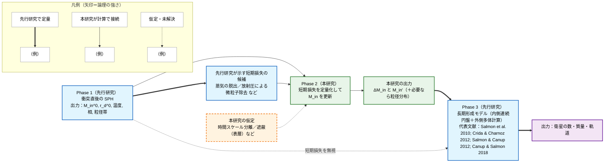
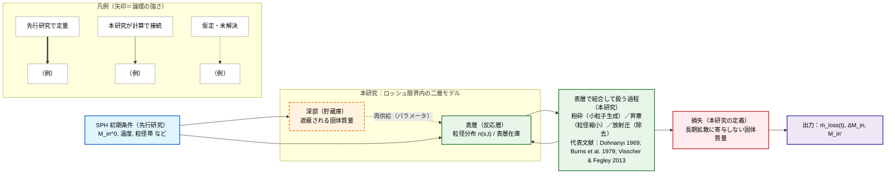
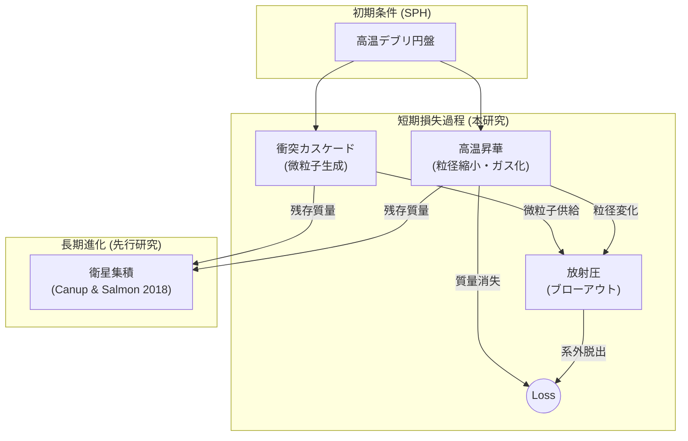

> **文書種別**: 解説（Diátaxis: Explanation）

# シミュレーション研究の背景と導入

本資料は、火星ロッシュ限界内ダスト円盤シミュレーション研究の科学的背景・目的・主要物理過程を整理したものです。ロッシュ限界内の質量収支が衛星形成条件へどう接続するか、そしてそれを定量化するためにどの過程を結合するかを、背景→問い→モデルの順で説明します。

本研究は、巨大衝突後に火星近傍へ形成される高温デブリ円盤のうち、**潮汐力のために集積が進みにくい境界の内側**であるロッシュ限界内に着目し、年スケールで起きうる固体質量の損失量を定量化することを目的とする。ロッシュ限界外では衝突による成長で衛星形成へつながり得る一方、ロッシュ限界内では物質が分散しやすく、質量は「外側へ供給される」か「失われる」ことでしか衛星形成へ寄与できない。

この問題設定の出発点は、衛星形成モデルがロッシュ限界内の円盤質量を主要な変数として扱うことにある。たとえば Canup & Salmon (2018) は、ロッシュ限界内の物質を連続円盤として扱い、その質量 $M_{\rm in}$ と外縁 $r_{\rm d}$ が、外側で成長する衛星との重力相互作用と、衝突に由来する粘性で時間発展するとモデル化した。さらに、円盤が内側へ広がれば惑星へ落下し、外側へ広がってロッシュ限界を越えれば「新しい微小天体」として外側の集積計算へ供給される、と記述している。したがって、ロッシュ限界内の質量がどれだけ残るかは、外側の衛星形成へ影響し得る。

一方で、巨大衝突直後の火星は強い放射源になり得ること、そして火星放射の放射圧で凝縮粒子が除去され得ることも議論されている（Hyodo et al. 2018）。さらに、巨大衝突直後の円盤の初期状態は、破片を多数の粒として扱い、流体のように運動を追う数値計算で推定されてきた。滑らかな粒子流体力学（Smoothed Particle Hydrodynamics）計算は、円盤物質が主として溶融物で蒸気は少量（$<5\%$）であること、衝突でメートル級の破片が $\sim100\,\mu$m まで砕かれ得ること、さらに蒸気の一部が $\sim0.1\,\mu$m 程度の微粒子として凝縮し得ることを示している（Hyodo et al. 2017a）。放射圧と重力の比 $\beta$ は粒径や材質に依存し、サブミクロン粒子では放射圧の寄与が大きくなり得る（Kimura et al. 2002）。このため、ロッシュ限界内の質量収支を評価する際には、放射による吹き飛びだけでなく、微粒子の供給源となる衝突による破砕と、高温での昇華による粒径変化を同じ枠組みで扱う必要がある。

## 0. 本資料の位置づけと参照先

- 本書は研究背景・先行研究・問い・採用する物理過程の意味づけをまとめた解説であり、数式の正規形と記号定義は `analysis/equations.md`、実装スコープ（1次元が基本、0次元はテスト用補助）と計算フローは `analysis/overview.md` を参照する。
- 実行レシピと運用手順は `analysis/run-recipes.md` と `analysis/AI_USAGE.md` を参照し、本書では前提と文脈の整理に留める。
- 制約と今後の展開は `analysis/discussion.md` にまとめ、本書は背景とモデルの位置づけに集中する。
- 標準の1D実行レシピは `analysis/run-recipes.md` を参照し、0Dベースラインはテスト用補助として `python -m marsdisk.run --config configs/base.yml` を使う。0D でも `out/series/run.parquet`、`out/summary.json`、`out/checks/mass_budget.csv` が生成される。運用のスイープでは温度到達を停止条件として使うため、`COOL_TO_K=1000` が既定になっている（`numerics.t_end_until_temperature_K` に反映）。この 1000 K は高温期の損失過程を区切るための運用上の閾値であり、物理的な臨界温度を意味しない。[scripts/runsets/windows/run_sweep.cmd:778–786][scripts/runsets/common/run_one.py:245–272]
- gas-poor を既定とし、光学的に厚いガス円盤を仮定する TL2003 の表層流出は `ALLOW_TL2003=false` のまま無効とする。gas-rich 感度試験でのみ明示的に有効化する。
- 本書で参照する主要式は、放射圧比 β (E.013)、ブローアウト境界 a_blow (E.014)、表層流出 Ṁ_out (E.009)、Smoluchowski 方程式 (E.010)、自遮蔽 κ_eff/Σ_τ=1/Φ (E.015–E.017)、昇華 HKL フラックス (E.018) に対応する（診断量との対応は「5.1」参照）。

---

## 1. 科学的背景

### 1.1 Phobos・Deimos の起源問題

火星には 2 つの小衛星 Phobos（フォボス）と Deimos（ダイモス）が存在する。起源については、主に次の二つが議論されてきた。

| 仮説 | 概要 |
|---|---|
| 捕獲起源 | 小天体が火星に捕獲されたとする。 |
| 巨大衝突起源 | 火星への巨大衝突で生じた円盤から集積したとする。 |

捕獲起源は、スペクトルが小天体に似る点と整合し得る一方、ほぼ円軌道で赤道面に近い軌道をどのように作るかが論点になる。巨大衝突起源は、赤道面に近い円盤からの集積で軌道の特徴を説明しやすい（Canup & Salmon 2018; Hyodo et al. 2018）。一方で、起源自体は未確定であり、in situ 形成と捕獲の双方が残ることが整理されている（Kuramoto 2024）。同レビューは、捕獲起源と巨大衝突起源の観測要件を整理し、gas-poor / gas-rich の円盤条件の位置付けを明確化している（Kuramoto 2024）。同レビューは、in situ の中では巨大衝突が最も成功しているシナリオであるとも述べている。したがって本研究は、巨大衝突起源を仮定した場合の円盤散逸に焦点を当てる。起源論の整理としては、Rosenblatt et al. (2019) も参照できる。

Kuramoto (2024) の整理に沿って、物性・組成と力学特性を分けて記す（物性単独では決定打にならない点に留意する）。

#### 物性・組成の整理

| 観測される物性値（代表値） | 捕獲起源と整合しやすい読み | 巨大衝突起源と整合しやすい読み |
| --- | --- | --- |
| VIS-NIR 反射スペクトルが D/T 型小惑星に近く、2.8 um 帯に弱い吸収が見られる（Fraeman et al. 2012; Fraeman et al. 2014） | 炭素質小惑星由来の表層・含水鉱物の可能性（Fraeman et al. 2012; Fraeman et al. 2014; Pajola et al. 2013） | 衝突蒸気の凝縮微粒子（~0.1 um）が D 型様の赤いスペクトルを再現し得る（Ronnet et al. 2016; Hyodo et al. 2017a） |
| 低アルベド（ボンド ~0.02、幾何 ~0.07; Kuramoto 2024） | 暗い D 型小惑星と整合（Pajola et al. 2013） | 衝突蒸気由来の暗色凝縮物や宇宙風化による暗化でも説明可能（Pignatale et al. 2018; Pieters et al. 2014） |
| 低バルク密度（Phobos ~1.86、Deimos ~1.51 g/cm^3; Kuramoto 2024） | 多孔質・氷含有体の捕獲を示唆（Kuramoto 2024） | 衝突デブリの再集積によるラブルパイル構造と整合（Andert et al. 2010; Rosenblatt et al. 2016） |
| MID-IR 放射率が炭素質隕石と一致しない（Giuranna et al. 2011; Glotch et al. 2018） | 捕獲説単独では説明が難しい観測（Kuramoto 2024） | フィロケイ酸塩・玄武岩など火星由来材料の可能性（Giuranna et al. 2011; Glotch et al. 2018） |
| 低熱慣性（20-85 J m^-2 K^-1 s^-1/2 と細粒レゴリス; Kuzmin & Zabalueva 2003; Wada et al. 2018; Kuramoto 2024） | 表層進化（インパクト・ガーデニング/放射圧選別）で説明可能で判別力が弱い（Kuramoto 2024） | 衝突破砕による細粒供給でも整合するが決定的ではない（Kuramoto 2024） |
| 形状（不規則形状; Thomas 1989）/内部構造（高空隙; Andert et al. 2010） | 捕獲前の形状保持と整合（Thomas 1989） | ロシュ限界近傍での集積・潮汐整形と両立（Hu et al. 2020; Rosenblatt & Charnoz 2012） |

以上より、VIS-NIR とアルベドは捕獲説に整合しやすい一方で、MID-IR 放射率や密度・形状は衝突起源の再集積とも整合し、観測のみでは決着しにくい。MMX のサンプルリターンが決定的な検証になると期待されている（Kuramoto 2024）。

#### 力学・軌道特性（物性ではないが起源判断に強く関与）

- 低離心率・低軌道傾斜、赤道面に近い円軌道は in situ 形成（巨大衝突後のデブリ円盤）と整合しやすく、捕獲説では追加の散逸過程が必要になる（Kuramoto 2024）。

### 1.2 巨大衝突円盤と本研究が扱う範囲

本節では、ロッシュ限界内外の先行研究を「入力（初期条件）」「接続（内側→外側の受け渡し）」「出力（外側の形成・生存条件）」の観点で整理し、未解決点は接続の欠損として位置づける。

この整理は、次の三層で理解できる。第一に、内側円盤質量 $M_{\rm in}$ と外縁 $r_{\rm d}$ が外側形成の帰結を左右するという**標準モデル（マクロ）**であり、$M_{\rm in}$ が決まれば衛星形成の運命がほぼ定まるという枠組みが示されている（Canup & Salmon 2018）。第二に、衝突直後の円盤は高温で、微粒子の生成・昇華・放射圧による損失が同時に進むという**熱的現実（ミクロ）**がある（Hyodo et al. 2017a; Hyodo et al. 2018）。第三に、この短期損失が標準モデルの初期条件に反映されていないことが**欠けたリンク**であり、本研究はその損失を定量化して $M_{\rm in}$ を更新することを目的とする。

**内側（ロッシュ限界内, 入力）**: 衝突直後（〜数十時間）の SPH 計算は、半径方向の質量分布・温度・相・粒径帯を出力し、内側円盤の初期条件を与える（Citron et al. 2015; Hyodo et al. 2017a; Hyodo et al. 2018）。Citron et al. (2015) は Borealis 級衝突（$E\sim3\times10^{29}$ J, $M_{\rm imp}\sim0.026\,M_{\rm Mars}$）で、$t\approx30$ h 時点の円盤質量が $\sim5\times10^{20}$ kg となり、インパクター質量の 1–4% に相当することを示した。粒子数を $3\times10^{5}$〜$10^{6}$ に変えても 40 h 以降の円盤質量はほぼ一致し、$L_d<1$ のケースが大勢であるため、質量の大半がロッシュ限界内に集中していることが分かる。さらに彼らは、SPH の人工拡散により「数十時間以降の円盤質量推定は有効性が落ちる」点を明記し、初期条件を長期進化モデルへ渡す必要性を述べている。Rosenblatt et al. (2016) も Citron et al. (2015) の SPH を再現し、円盤質量のほとんどがロッシュ限界内で、外側は総量の最大 1% 程度（SPH 粒子が数個）に留まることを示した。つまり、**内側は高密度で初期条件が比較的確定している一方、外側の質量分布は SPH では解像できず再構成が必要**である。

**外側（ロッシュ限界外, 出力）**: 粘性拡散と集積を結合する研究は、外側の集積・生存条件を「出力」として与える。Salmon et al. (2010) は、粘性拡散が円盤の質量と角運動量を再配分し、惑星への落下やロッシュ限界通過によって質量が失われ得ることを示し、結果が粘性モデルに敏感であることを強調した。Crida & Charnoz (2012) は、円盤寿命 $t_{\rm disk}=M_{\rm disk}/(F T_R)$ を導入し、拡散が遅いと多数の衛星列が、速いと単一の大型衛星が形成されるというレジームを整理している。Rosenblatt & Charnoz (2012) は火星系へ適用し、強い潮汐レジームで過去の衛星総量（$8.3\times10^{17}$–$1.5\times10^{19}$ kg）を説明するには、円盤質量が $8.3\times10^{19}$–$1.5\times10^{21}$ kg 程度必要になると示した。Canup & Salmon (2018) は内側円盤質量 $M_{\rm in}$ と外縁 $r_{\rm d}$ の進化を外側集積に結びつけ、外側の生存条件が内側円盤の質量と供給履歴に敏感であることを明示している。

**内側→外側の結び目**: 内側連続円盤と外側 N 体を接続する枠組みは、内側の供給履歴が外側形成に直接入ることを明示する（Canup & Salmon 2018）。Rosenblatt et al. (2016) は、内側円盤の粘性拡散で形成される $10^{19}$ kg 級の内側衛星が、約 3400 年で $4.4\,R_{\rm Mars}$ 付近まで移動し、2:1・3:2 共鳴が外側の衛星胚（4.2–7 $R_{\rm Mars}$）を励起して 2 つの小衛星形成を促すこと、内側衛星は約 5 Myr で火星へ落下することを示した。これは、**内側円盤の質量と供給履歴が外側形成の必須入力**であることを具体的に示す。

**未解決点と本研究の範囲**: 巨大衝突直後の高温環境では、蒸気の流体脱出や放射圧で凝縮粒子が最初の 1 周回で除去され得ることが示されている（Hyodo et al. 2018）。また、衝突直後の円盤は傾いた高離心のデブリとして生成され、$J_2$ による歳差と非弾性衝突で傾斜・離心率が減衰して赤道面へ落ち着く一方、衝突破砕を含めた詳細進化は未解決で直接計算が必要とされる（Hyodo et al. 2017b）。これら短期損失の積算は、拡散・集積モデルの主計算には取り込まれていない。したがって本研究は、**ロッシュ限界内で失われる成分**を、微粒子の生成と除去を結合したモデルで評価し、内側貯蔵庫の入力を更新することに焦点を置く。ここで「損失」は、放射圧除去や昇華によりロッシュ限界内の固体質量が短時間で内側領域から除かれることとして扱い、必ずしも火星重力圏の外まで出ることを意味しない。

本研究が更新するのは、粘性進化が始まる前の内側貯蔵庫 $M_{\rm in}$ である。この更新は、遮蔽された表層での供給（衝突カスケード）と変質（昇華）と除去（放射圧）の競合、および表層再供給の速さで決まる。

以下の図は、先行研究を入力・接続・出力の役割に分け、接続の欠損（未解決点）と本研究の位置を示したものである。まず全体像を図 1.2a に示し、欠けたリンクの中身は図 1.2b で拡大する。図 1.2a は時間発展（左→右）と受け渡しの役割を一本化し、代表文献は図中に併記する。図の箱では数値を最小限にし、代表値（2000 K、蒸気 <5%、~1.5 m、~100 μm、~0.1 μm など）と解像度（SPH の粒子数など）は、図外補足として後述する。代表値の根拠は Hyodo et al. (2017a, 2018) に置く。

**図 1.2a（全体像）**  
- 矢印の凡例：`==>`（太実線）＝先行研究で定量的に示された関係、`-->`（実線）＝本研究が計算でつなぐ関係、`-.->`（点線）＝仮定・未解決の接続（本研究では直接は証明しない）

### 1.2.2 本研究が仮定すること

本研究は、上の「未整備」部分だけを狙って埋める。そのために、次を本研究の仮定（＝本研究の外側にある不確実性を押し込める場所）として宣言する。

- **時間スケール分離**：SPH が扱う数十時間と、長期形成モデルが扱う ≳10^3 年の間にある「短期損失」を独立に評価し、長期モデル開始時の $M_{\rm in}$ を $M_{\rm in}'$ に更新する。短期損失の評価区間は、高温期（運用上は火星表面温度が 1000 K を下回るまで）を基準に置く。
- **損失の定義**：ここでいう「損失」は、放射圧除去や昇華などにより、ロッシュ限界内の固体質量が「のちの粘性拡散・ロッシュ限界通過の供給」に寄与しなくなることを指す。必ずしも火星重力圏の外へ出ること（系外への脱出）と同義ではない。
- **遮蔽と二層化**：円盤が光学的に厚いことを踏まえ、放射が届くのは表層に限られるとみなし、深部（貯蔵庫）と表層（反応層）の 2 層で表す。表層への再供給（深部→表層の交換）は、直接計算せずパラメータとして与える。
- **小粒子供給の不確実性をパラメータ化する**：放射圧が効く粒径帯は小さいため、表層でどれだけ小粒子が作られるか（粉砕・再溶融・凝縮など）は結果を左右する。本研究では、この供給速度と昇華の競合を同じ時間積分の中で扱い、感度を評価する。

なお、放射圧の強さは「放射圧と重力の比」で表すのが標準であり（Burns et al. 1979）、本研究でもこの定義に従う。また、微粒子供給を記述する際は、衝突カスケードの定常解が典型的なべき則分布を与えることが古典的に示されている（Dohnanyi 1969）。さらに昇華では、温度から平衡蒸気圧を与える必要があり、溶融ケイ酸塩と平衡にある蒸気の圧力計算がその根拠になる（Visscher & Fegley 2013）。ただし巨大衝突直後の円盤が衝突カスケードの定常状態に達しているとは限らないため、本研究では供給率をパラメータとして探索する。

**図 1.2b（Phase 2 の内部構造）**  
- 矢印の凡例は図 1.2a と同じ。

### 1.2.3 本研究が出す量

本研究が直接に出す量は、長期形成モデルが入力として要求する「内側貯蔵庫の有効な初期値」に限る。具体的には、短期過程の時間積分から

- 損失率 $\dot M_{\rm loss}(t)$ とその積算 $\Delta M_{\rm in}$  
- 長期形成モデル開始時点の更新後質量 $M_{\rm in}' = M_{\rm in}^0 - \Delta M_{\rm in}$（必要なら、代表的な粒径分布や表層在庫）

を与える。衛星の最終的な数や軌道は、ここで更新した $M_{\rm in}'$ を既存の長期形成モデルへ渡した先で決まる量であり、本研究はその入力を「何を根拠に、どこまで更新したか」が追跡できる形に整えることを目的とする。

---
## 1.3 ガスが少ない円盤という前提と意味

本研究は、ガスが少ない衝突起源円盤を標準前提とする。本資料では、このような条件を「ガスが少ない条件」と書く。

Hyodo et al. (2017a) は、衝突直後の円盤物質が主として溶融物で蒸気は少量であることを示しており、この点は「ガスが少ない条件」の根拠になる。また Hyodo et al. (2018) は、巨大衝突直後の火星表面が高温になり得ること、放射圧で凝縮粒子が除去され得ることを議論している。ガスが少ない場合、微粒子はガスに保持されにくくなり、放射による吹き飛びや高温昇華が、短い時間で表層の質量を変えやすい。

ここで gas-poor を採用するのは消極的な仮定ではなく、**表層で進む損失過程を独立に評価するための積極的な選択**である。たとえガスが存在しても、放射が届く表層では放射圧・昇華が先に質量を動かし得るため、この寄与を切り出して定量化する意義がある（Hyodo et al. 2018）。光学的に厚いガス円盤を前提に表層流出を議論した Takeuchi & Lin (2003) の枠組みは、表層が支配的であることを示す点で参考になるが、本研究は gas-poor を既定として表層損失を主眼に置く。

一方で、光学的に厚いガス円盤を仮定した表層流出モデルは、ガスとダストの相互作用を通じて表層ダストが外向きに運ばれることを扱う（Takeuchi & Lin 2003）。本研究はガスが少ない条件を主線に置くため、これらの式を標準モデルとしては用いない。ただし、「放射が届くのは表層に限られる」という構造そのものは、遮蔽の取り扱いを考える上で参照になる。

---

## 2. 先行研究と未解決点

### 2.1 初期条件を与える研究

巨大衝突説では、衝突直後のデブリ円盤の物理状態を把握することが、その後の衛星形成を理解するための鍵になる。とくに、熱状態と粒径生成が短期の質量損失に直結するため、初期条件が「固定値」ではなく時間的に削られる点を押さえる必要がある（Hyodo et al. 2017a; Hyodo et al. 2018）。

巨大衝突直後の円盤の質量・温度・蒸気分率などは、粒子法計算により与えられてきた。Hyodo et al. (2017a) は、円盤物質が約 2000 K に加熱され、エントロピーが ~1500 J K^-1 kg^-1 増加し、溶融が主体（蒸気分率 <5%）であることを示している。冷却・固化の過程で多様な粒径の微粒子が生成される点が重要であり、代表的な生成経路は次のとおりである（Hyodo et al. 2017a）。

- **破砕による生成**: メートル級の溶融滴は、その後の高速度衝突（~1-5 km s^-1）で ~100 μm 程度まで粉砕され得る。
- **凝縮による生成**: わずかな蒸気成分は冷却に伴って ~0.1 μm の微細粒として凝縮する。

これらの粒径帯は、ロッシュ限界内であっても放射圧に敏感であり、円盤の質量分布に影響を与え得る。

また、衝突条件による円盤質量や角運動量のばらつきは Citron et al. (2015) に整理されており、SPH 計算は衝突直後の数時間〜数十時間の挙動には適しているものの、衛星形成へ至る長期進化を直接追うには限界がある。そのため、SPH の結果を円盤進化モデルの入力として要約して渡す必要があると述べられている。Rosenblatt et al. (2016) も外側円盤は低密度で分解能が限られるため、外側の初期条件を再構成して与える必要があると指摘している。

衝突直後のデブリは高い離心率（e ~ 0.6-0.9）を持ち、粒子間の非弾性衝突で離心率・傾斜角が短時間で減衰して薄い円盤へ移ることが示唆されている（Hyodo et al. 2017a; Hyodo et al. 2017b）。一方で、破砕を伴う衝突進化の詳細な時間スケールは未解決であり、直接 N 体計算が必要だと述べられている（Hyodo et al. 2017b）。

ただし、初期条件が与えられても、ロッシュ限界内で **その後すぐに** 起きる微粒子の生成と除去が積算されていなければ、外側へ供給され得る質量がどれだけ残るかは決まらない。ここが、本研究が埋めたい空白である。

### 2.2 形成と生存条件を与える研究

Phobos・Deimos の形成モデルで最大の課題は、現在の小さい質量と軌道配置を同時に説明することである。そのため、円盤の拡散速度、衛星への質量供給、形成後の生存条件がどのように結びつくかが体系的に整理されてきた。

#### ハイブリッド・モデルによる質量制約
Canup & Salmon (2018) は、ロッシュ限界内側を連続円盤（流体）として、外側を多数の天体の重力相互作用を追う N体（N-body）計算として扱うハイブリッド・モデルを提示した。この枠組みでは、初期円盤質量や潮汐パラメータの違いが、最終的に残る衛星の構成を大きく左右する。

- **質量予算の制約**: 初期円盤質量が $M_{\rm disk} \le 3 \times 10^{-5} M_{\rm M}$ の範囲に収まると同期軌道付近に小衛星が残り得る一方で、質量が大きすぎるとロッシュ限界近傍で形成された内側の大きな衛星が外側へ移動しやすい。
- **一掃（Sweep-up）効果**: 内側の大きな衛星が外側の微小天体や材料を取り込みやすくなり、結果としてフォボス・ダイモスのようなペアが残りにくい。

#### 粘性拡散と熱進化の欠落
Rosenblatt & Charnoz (2012) は、粘性拡散に伴う内外への質量移動と衛星形成をモデル化したが、簡略化のため粘性加熱や放射冷却といった熱進化は含めていない。巨大衝突直後の高温期には蒸発・凝縮や放射圧が短時間で質量を動かし得るため（Hyodo et al. 2017a; Hyodo et al. 2018）、熱進化を省いたモデルだけでは短期損失の評価が欠ける。

#### 潮汐ディスク進化の一般論と消散機構
潮汐ディスクから衛星が形成される一般論として、Crida & Charnoz (2012) はロッシュ限界内の高密度リングが拡散して外側で衛星が成長する枠組みを示し、成長段階がディスク寿命に強く依存することを定式化した。またリングの消散機構は未解決で、粘性拡散だけではリングが消えにくいとも述べている。リング進化の実例として、Salmon et al. (2010) は粘性拡散が質量・角運動量を再配分し、惑星への落下やロッシュ限界通過で質量が失われ得ることを整理している。これらは氷質リング・長時間スケールの議論だが、損失項が総質量を動かし得るという構造は本研究の問題意識と共通する。

#### ロッシュ限界内における質量収支の空白
ここで重要なのは、ロッシュ限界内の円盤質量 $M_{\rm in}$ が、外側へ供給される「新しい微小天体」の総量と、外側衛星へのトルクの双方に関わる点である。言い換えると、ロッシュ限界内の質量がどの程度の速度で減るかは、外側での集積史へ直接影響し得る。

しかし Canup & Salmon (2018) が定義するロッシュ限界内の円盤の質量除去は、主として「内側へ広がって惑星へ落下する」過程と「外側へ広がってロッシュ限界を越え、外側モデルへ加わる」過程である。巨大衝突直後の放射圧や高温昇華が、ロッシュ限界内の質量収支にどの程度の追加シンクとして働くかは、同モデルの主計算からは直接は読み取れない（Hyodo et al. 2017a; Hyodo et al. 2018）。したがって、形成モデルが与える生存条件を粒子法計算が与える初期条件へ接続するためには、ロッシュ限界内での短期損失を独立に見積もる必要がある。

### 2.3 砕ける・吹き飛ぶ・蒸発するを同時に扱う理由

ガスが少ないデブリ円盤では、衝突カスケードで生じた最小破片が放射圧で吹き飛び、ブローアウトが主要な質量損失経路になり得るという一般論がある（Krivov 2010）。ただし火星周回円盤は放射源や時間スケールが異なるため、この因果の型がどの程度成り立つかを定量的に評価する必要がある。

本研究が強調したいのは、放射による損失効率が「放射の強さ」だけで決まるのではなく、次の三つの過程が**同時に競合**した結果として決まるという点である。

- **供給（衝突カスケード）**: 大きな粒が衝突で砕けて小粒子を作り続ける。衝突カスケードは、質量をより小さな粒径へ流す（Wyatt 2008; (E.010)）。この供給速度が、表層に存在する「吹き飛びやすい在庫」を決める。
- **除去（放射圧ブローアウト）**: 放射圧と重力の比 $\beta$ が閾値を超える粒子は力学的時間スケールで除去され得る（Kimura et al. 2002; (E.013), (E.014)）。最小粒子側に急な切断が生じるという整理もあり、粒径・材質に応じて選択的に除去される（Wyatt 2008; (E.009)）。
- **表層の制限（遮蔽）**: 円盤が光学的に厚い場合、放射を直接受けるのは表層に限られる。表層での外向き流出を扱った Takeuchi & Lin (2003) も、流出が「光が当たる薄い表層」で起きることを強調している（(E.015)–(E.017)）。表層の在庫と補給速度が損失のボトルネックになる。

これらの過程を質量フローとして整理すると、次のように表現できる。

さらに、衝突が支配的かどうかで、微粒子が内側領域に残るかどうかが変わることも示されている（Strubbe & Chiang 2006）。また、巨大衝突直後の高温環境では昇華が粒径を連続的に変え、吹き飛びやすい粒径帯へ粒子を押し込んだり、吹き飛ぶ前に消したりし得る（Hyodo et al. 2018）。したがって、供給・除去・遮蔽・昇華を独立に扱うと、表層の在庫と損失が過大・過小に評価される恐れがある。そこで本研究では、粒径分布の時間発展、表層遮蔽、昇華による粒径縮小を同一の時間積分の中で扱い、表層からの質量流束を累積して損失量を見積もる。

---

## 3. 研究目的と問い

本研究の目的は、火星ロッシュ限界内の高温ダスト円盤について、短時間（標準は火星表面温度が 1000 K 以下になるまで、固定地平を使う場合は 2 年）にわたる質量損失と粒径分布の時間発展を定量化し、形成モデルへ渡せる形の入力を作ることである。1000 K は高温期の損失過程を区切る運用上の閾値として用いる。火星表面温度が低下すると放射フラックスと昇華速度が弱まり、短期損失の主要部分が高温期に集中すると考えられるため、ここでは 1000 K を区切りとして用いる。特に、Canup & Salmon (2018) のようにロッシュ限界内の円盤質量を明示的に扱う枠組みに対して、衝突直後の短期損失が $M_{\rm in}$ の初期値や時間変化をどの程度動かし得るかを評価する。[scripts/runsets/windows/run_sweep.cmd:778–786][scripts/runsets/common/run_one.py:245–272]

この目的は言い換えると、**短期損失を織り込んだときに、形成モデルが必要とする $M_{\rm in}$ を高温期の終わりまで保ち得る初期円盤条件の範囲（残存条件）**を明らかにすることでもある。ここでいう残存条件は、円盤全体の寿命ではなく、高温期（$T_M \ge 1000$ K）終了時点で残る固体質量の範囲を指す。

この上位の問いを解くため、本研究が答えたい下位の問いは次の 3 点に整理できる。

1. **Loss（累積損失）**: ガスが少ない条件で、放射による吹き飛びと高温昇華によって、ロッシュ限界内の固体質量は高温期の終わり（火星表面温度が 1000 K を下回るまで、または 2 年固定）にどれだけ失われるか。
2. **PSD/Surface（粒径分布・表層在庫）**: 粒径分布と表層在庫は時間とともにどう変化し、吹き飛びやすい粒径帯にどれだけ質量が集まるか。あわせて、円盤の傾斜減衰に伴う表層の入れ替わりが起こり得ることを踏まえ（Hyodo et al. 2017b）、遮蔽と表層再供給（感度ノブ）の不確かさが損失量の見積もり幅にどの程度影響するか。
3. **Connection（形成モデルとの整合）**: 初期条件（巨大衝突直後の円盤）から出発したとき、短期損失を考慮した残存質量は形成モデルが要求する円盤質量レンジと整合するか。整合しない場合、初期の温度履歴や円盤条件にどの程度の上限（または下限）が示唆されるか（Canup & Salmon 2018）。

---

## 4. モデルの概要

### 4.1 スコープ

本研究の計算は、ロッシュ限界内の半径方向を分割した 1 次元モデルを基本とし、粒径分布と表層質量の時間発展を追う。0 次元は代表半径の局所モデルとして、テストや感度検証の補助に用いる。

ガスが少ない条件を既定とするため、光学的に厚いガス円盤を前提にした表層流出モデルは標準では用いない。必要であれば、ガスが多い仮定の感度試験として切り替える。

### 4.2 放射による吹き飛びの条件と損失量

放射によって微粒子が重力から逃げる効果を扱う。これを放射圧ブローアウトと呼ぶ。吹き飛びの起きやすさは、放射圧と重力の比である $\beta$ で表し（(E.013)）、$\beta$ が閾値を超えると粒子は脱出しやすくなる（$\beta$ の意味づけは Kimura et al. 2002を参照）。閾値粒径のブローアウト境界 $a_{\rm blow}$ は (E.014) に対応する。

本研究では、損失量を「閾値粒径」だけで決めない。ブローアウトの滞在時間は $t_{\rm blow}=1/\Omega$ を基本とし（(E.007)）、損失量は表層に存在する質量と軌道の時間スケールに依存するため、表層の外向き流束を
\[
\dot{M}_{\rm out} = \Sigma_{\rm surf}\,\Omega
\]
の形で評価する（(E.009)）。したがって、どの時刻にどれだけの表層質量が存在するかが、累積損失を左右する。

### 4.3 衝突による粒径分布の時間発展

衝突による粒径分布の進化を扱う。粒径ごとの個数が衝突で増えたり減ったりする過程を表す式として、衝突による粒径分布の式である Smoluchowski 方程式を用いる（(E.010)）。この式により、大粒子から小粒子が供給される一方で、衝突そのものによる消滅も同時に評価できる。表層衝突寿命のスケールは $t_{\rm coll}=1/(\Omega\tau_{\perp})$ を参照する（(E.006)）。破壊閾値 $Q_D^*$ は材料や衝突速度に依存するため、本文では代表条件を参照し、感度は補助図で押さえる。

本研究の動機に照らすと、この部分は「吹き飛びやすい微粒子が、どれだけ速く作られるか」を与える。吹き飛びが強くても供給が弱ければ表層は枯れるし、供給が強ければ表層に微粒子が溜まり損失が増える。したがって、砕け続けの時間発展を入れることは、損失量の見積もりに直結する。

### 4.4 高温昇華による粒径変化

高温で固体が表面から蒸発し、粒子が小さくなる過程を扱う。これを昇華と呼ぶ。表面からどれだけ蒸発するかは、気体分子の熱運動にもとづく式で見積もる。本研究では Hertz–Knudsen–Langmuir 式を用いる（(E.018)）。

ここで昇華は、独立した損失項であるだけでなく、粒径を縮めて吹き飛びの対象へ入れたり、逆に吹き飛ぶ前に消したりする。つまり昇華は、吹き飛びの前提となる粒径分布を時間とともに変える。このため、昇華を含めた粒径の時間発展を同じ時間積分の中で扱う。

### 4.5 遮蔽と表層再供給

円盤が光学的に厚い場合、放射を実際に受けるのは表層に限られる。そこで自遮蔽により「放射が届く表層の厚み」を決める係数 $\Phi$ を用い、表層がどれだけの質量を持ちうるかを診断する（(E.015)–(E.017)）。

巨大衝突の条件によっては、円盤が火星赤道面に対して傾いた状態で生成され得る。また火星の $J_2$ による歳差運動と非弾性衝突によって傾斜や離心率が減衰し、薄い赤道面円盤へ向かう過程が整理されている（Hyodo et al. 2017b）。この遷移過程では円盤の鉛直厚みや配向が時間変化し得るため、表層が固定されない可能性がある。

そこで本モデルは、表層再供給（深部↔表層の入れ替わりを粗く表したもの）を任意に与えられる。ここでの表層再供給は、外側からの流入を精密に表すものではなく、傾斜や衝突減衰に伴う入れ替わりを直接定量化できないための感度試験のノブとして位置づける。したがって、基本ケースでは供給なし（または最小限）で損失の下限を見積もり、供給を入れたケースでは損失の上限を評価する、という使い方が自然である。

---

## 5. 主要出力と先行研究への接続

本研究が直接提供するのは、ロッシュ限界内での短期の質量収支である。具体的な出力は、次の三つに集約できる。

- 時間依存の損失率と累積損失
- 粒径分布の時間発展
- 吹き飛び境界や遮蔽指標など、損失を左右する診断量

### 5.1 数式と診断量の対応（代表例）

- 放射圧比 $\beta$ とブローアウト境界 $a_{\rm blow}$ は (E.013), (E.014) に対応し、吹き飛び判定と粒径下限の診断に用いる。
- 表層流出率 $\dot{M}_{\rm out}$ は (E.009) に対応し、時間依存の損失率と累積損失 $M_{\rm loss}$ の積分に使う。
- 破砕供給は Smoluchowski 方程式 (E.010) に対応し、微粒子供給率と粒径分布の時間変化を与える。
- 自遮蔽は κ_eff/Σ_τ=1/Φ の式 (E.015)–(E.017) に対応し、放射が届く表層の上限を規定する。
- 昇華による質量フラックスは HKL 式 (E.018) に対応し、シンク項と粒径縮小の寄与を与える。
- 質量収支の整合性は (E.011) の誤差評価に対応し、`checks/mass_budget.csv` で記録する。

この出力を先行研究へ接続する基本手順は次の通りである。粒子法計算が与える初期円盤質量から出発し、本研究が求めた累積損失を差し引いて短期損失を織り込んだ残存質量を得る。その残存質量を、Canup & Salmon (2018) のような形成モデルの初期条件または $M_{\rm in}$ の追加シンクとして与え、Phobos・Deimos を残し得る条件がどの程度変わるかを評価する。つまり本研究は、初期条件と高温期後の残存条件の間にある質量収支のギャップを埋める役割を持つ。

---

## 6. 図表管理（別ファイル）

図表の差し込み案とメタデータ管理は `analysis/figures_insertion_notes.md` に移管した。本書は論証の流れを優先し、図表管理は別途参照する。
## 参考文献

Andert et al. (2010). *Geophysical Research Letters*, 37(9). doi:10.1029/2009GL041829  
Benz, W., & Asphaug, E. (1999). *Icarus*, 142, 5–20. doi:10.1006/icar.1999.6204  
Burns, J. A., Lamy, P. L., & Soter, S. (1979). *Icarus*, 40, 1–48. doi:10.1016/0019-1035(79)90050-2  
Canup, R. M., & Salmon, J. (2018). *Science Advances*, 4(4), eaar6887. doi:10.1126/sciadv.aar6887  
Citron, R., Genda, H., & Ida, S. (2015). *Icarus*, 252, 334–338. doi:10.1016/j.icarus.2015.02.011  
Crida, A., & Charnoz, S. (2012). *Science*, 338, 1196–1199. doi:10.1126/science.1228006  
Dohnanyi, J. S. (1969). *J. Geophys. Res.*, 74, 2531–2554. doi:10.1029/JB074i010p02531  
Fraeman et al. (2012). *J. Geophys. Res. Planets*, 117, E00J15. doi:10.1029/2012JE004137  
Fraeman et al. (2014). *Icarus*, 229, 196–205. doi:10.1016/j.icarus.2013.11.021  
Giuranna et al. (2011). *Planetary and Space Science*, 59, 1308–1325. doi:10.1016/j.pss.2011.01.019  
Glotch et al. (2018). *J. Geophys. Res. Planets*, 123, 2467–2484. doi:10.1029/2018JE005647  
Hu et al. (2020). *Geophysical Research Letters*, 47, e2019GL085958. doi:10.1029/2019GL085958  
Hyodo, R., Genda, H., Charnoz, S., & Rosenblatt, P. (2017a). *The Astrophysical Journal*, 845, 125. doi:10.3847/1538-4357/aa81c4  
Hyodo, R., Genda, H., Rosenblatt, P., & Charnoz, S. (2017b). *The Astrophysical Journal*, 851, 122. doi:10.3847/1538-4357/aa9984  
Hyodo, R., Genda, H., Charnoz, S., Pignatale, F. C. F., & Rosenblatt, P. (2018). *The Astrophysical Journal*, 860, 150. doi:10.3847/1538-4357/aac024  
Kimura, H., Okamoto, H., & Mukai, T. (2002). *Icarus*, 157, 349–361. doi:10.1006/icar.2002.6849  
Krivov, A. (2010). *Research in Astronomy and Astrophysics*, 10(5), 383–414. doi:10.1088/1674-4527/10/5/001  
Kuramoto, K. (2024). *Annual Review of Earth and Planetary Sciences*, 52, 495–519. doi:10.1146/annurev-earth-031621-064742  
Kuzmin, R. O., & Zabalueva, E. V. (2003). *Solar System Research*, 37, 480–488. doi:10.1023/B:SOLS.0000007946.02888.BD  
Markkanen, J., & Agarwal, J. (2020). *A&A*, 643, A16. doi:10.1051/0004-6361/202039092  
Pajola et al. (2013). *The Astrophysical Journal*, 777, 127. doi:10.1088/0004-637X/777/2/127  
Pieters et al. (2014). *Planetary and Space Science*, 102, 144–151. doi:10.1016/j.pss.2014.02.008  
Pignatale, F. C. F., Charnoz, S., Chaussidon, M., & Tosi, N. (2018). *The Astrophysical Journal*, 853, 118. doi:10.3847/1538-4357/aaa23e  
Rosenblatt, P. (2011). *Astronomy and Astrophysics Review*, 19, 44. doi:10.1007/s00159-011-0044-6  
Rosenblatt, P., & Charnoz, S. (2012). *Icarus*, 221(2), 806–815. doi:10.1016/j.icarus.2012.09.009  
Rosenblatt, P., Charnoz, S., Dunseath, K., Terao-Dunseath, M., Trinh, A., Hyodo, R., Genda, H., & Toupin, S. (2016). *Nature Geoscience*, 9(8), 581–583. doi:10.1038/ngeo2742  
Rosenblatt, P., Hyodo, R., Pignatale, F. C. F., Trinh, A., Charnoz, S., Dunseath, K. M., Terao-Dunseath, M., & Genda, H. (2019). *The formation of the Martian moons*. arXiv:1909.03996.  
Ronnet, T., Bourrier, V., Leinhardt, Z. M., & Charnoz, S. (2016). *The Astrophysical Journal*, 828, 109. doi:10.3847/0004-637X/828/2/109  
Salmon, J., Charnoz, S., Crida, A., & Brahic, A. (2010). *Icarus*, 209(2), 771–785. doi:10.1016/j.icarus.2010.05.030  
Salmon, J., & Canup, R. M. (2012). *The Astrophysical Journal*, 760, 83. doi:10.1088/0004-637X/760/1/83  
Strubbe, L. E., & Chiang, E. I. (2006). *The Astrophysical Journal*, 648, 652–665. doi:10.1086/505736  
Takeuchi, T., & Lin, D. N. C. (2003). *The Astrophysical Journal*, 593, 524. doi:10.1086/376496  
Thebault, P., & Augereau, J.-C. (2007). *A&A*, 472, 169–185. doi:10.1051/0004-6361:20077789  
Thomas, P. (1989). *Icarus*, 77, 248–274. doi:10.1016/0019-1035(89)90089-4  
Visscher, C., & Fegley, B. Jr. (2013). *The Astrophysical Journal Letters*, 767, L12. doi:10.1088/2041-8205/767/1/L12  
Wada et al. (2018). *Progress in Earth and Planetary Science*, 5, 82. doi:10.1186/s40645-018-0237-y  
Wyatt, M. C. (2008). *Annual Review of Astronomy and Astrophysics*, 46, 339–383. doi:10.1146/annurev.astro.45.051806.110525  

> **数式定義**: `analysis/equations.md`  
> **実装スコープと計算フロー**: `analysis/overview.md`  
