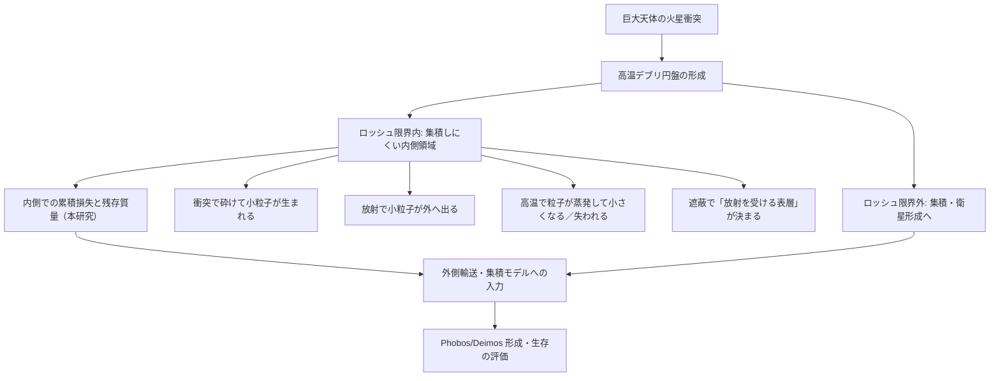

> **文書種別**: 解説（Diátaxis: Explanation）

# シミュレーション研究の背景と導入

本資料は、火星ロッシュ限界内ダスト円盤シミュレーション研究の科学的背景・目的・主要物理過程を整理したものです。ロッシュ限界内の質量収支が衛星形成条件へどう接続するか、そしてそれを定量化するためにどの過程を結合するかを、背景→問い→モデルの順で説明します。

本研究は、巨大衝突後に火星近傍へ形成される高温デブリ円盤のうち、**潮汐力のために集積が進みにくい境界の内側**であるロッシュ限界内に着目し、年スケールで起きうる固体質量の損失量を定量化することを目的とする。ロッシュ限界外では衝突による成長で衛星形成へつながり得る一方、ロッシュ限界内では物質が分散しやすく、質量は「外側へ供給される」か「失われる」ことでしか衛星形成へ寄与できない。

この問題設定の出発点は、衛星形成モデルがロッシュ限界内の円盤質量を主要な変数として扱うことにある。たとえば Canup & Salmon (2018) は、ロッシュ限界内の物質を連続円盤として扱い、その質量 $M_{\rm in}$ と外縁 $r_{\rm d}$ が、外側で成長する衛星との重力相互作用と、衝突に由来する粘性で時間発展するとモデル化した。さらに、円盤が内側へ広がれば惑星へ落下し、外側へ広がってロッシュ限界を越えれば「新しい微小天体」として外側の集積計算へ供給される、と記述している。したがって、ロッシュ限界内の質量がどれだけ残るかは、外側の衛星形成へ影響し得る。

一方で、巨大衝突直後の火星は強い放射源になり得ること、そして火星放射の放射圧で凝縮粒子が除去され得ることも議論されている（Hyodo et al., 2018）。さらに、巨大衝突直後の円盤の初期状態は、破片を多数の粒として扱い、流体のように運動を追う数値計算で推定されてきた。滑らかな粒子流体力学（Smoothed Particle Hydrodynamics）計算は、円盤物質が主として溶融物で蒸気は少量（$<5\%$）であること、衝突でメートル級の破片が $\sim100\,\mu$m まで砕かれ得ること、さらに蒸気の一部が $\sim0.1\,\mu$m 程度の微粒子として凝縮し得ることを示している（Hyodo et al., 2017）。放射圧と重力の比 $\beta$ は粒径や材質に依存し、サブミクロン粒子では放射圧の寄与が大きくなり得る（Kimura et al., 2002）。このため、ロッシュ限界内の質量収支を評価する際には、放射による吹き飛びだけでなく、微粒子の供給源となる衝突による破砕と、高温での昇華による粒径変化を同じ枠組みで扱う必要がある。

## 0. 本資料の位置づけと参照先

- 本書は研究背景・先行研究・問い・採用する物理過程の意味づけをまとめた解説であり、数式の正規形と記号定義は `analysis/equations.md`、実装スコープ（0次元・ガスが少ない条件が既定）と計算フローは `analysis/overview.md` を参照する。
- 実行レシピと運用手順は `analysis/run-recipes.md` と `analysis/AI_USAGE.md` を参照し、本書では前提と文脈の整理に留める。
- 標準の0Dベースラインは `python -m marsdisk.run --config configs/base.yml` で起動し、`out/series/run.parquet`、`out/summary.json`、`out/checks/mass_budget.csv` を生成する。運用のスイープでは温度到達を停止条件として使うため、`COOL_TO_K=1000` が既定になっている（`numerics.t_end_until_temperature_K` に反映）。[scripts/runsets/windows/run_sweep.cmd:778–786][scripts/runsets/common/run_one.py:245–272]
- gas-poor を既定とし、光学的に厚いガス円盤を仮定する TL2003 の表層流出は `ALLOW_TL2003=false` のまま無効とする。gas-rich 感度試験でのみ明示的に有効化する。
- 本書で参照する主要式は、放射圧比 β (E.013)、ブローアウト境界 a_blow (E.014)、表層流出 Ṁ_out (E.009)、Smoluchowski 方程式 (E.010)、自遮蔽 κ_eff/Σ_τ=1/Φ (E.015–E.017)、昇華 HKL フラックス (E.018) に対応する（診断量との対応は「5.1」参照）。

---

## 1. 科学的背景

### 1.1 Phobos・Deimos の起源問題

火星には 2 つの小衛星 Phobos（フォボス）と Deimos（ダイモス）が存在する。起源については、主に次の二つが議論されてきた。

| 仮説 | 概要 |
|---|---|
| 捕獲起源 | 小天体が火星に捕獲されたとする。 |
| 巨大衝突起源 | 火星への巨大衝突で生じた円盤から集積したとする。 |

捕獲起源は、スペクトルが小天体に似る点と整合し得る一方、ほぼ円軌道で赤道面に近い軌道をどのように作るかが論点になる。巨大衝突起源は、赤道面に近い円盤からの集積で軌道の特徴を説明しやすい（Canup & Salmon, 2018; Hyodo et al., 2018）。本研究は巨大衝突起源の枠組みに立つ。

### 1.2 巨大衝突円盤と本研究が扱う範囲

巨大衝突後には、火星近傍に高温のデブリ円盤が形成される。Canup & Salmon (2018) は、ロッシュ限界外では衝突で衛星が成長し、ロッシュ限界内では惑星の差動重力のために物質が分散しやすい、と整理している。したがって、ロッシュ限界内の物質が衛星形成へ寄与するためには、ロッシュ限界外へ供給される過程、または系外へ失われる過程を通る必要がある。

本研究はこのうち、**ロッシュ限界内で失われる成分**を、微粒子の生成と除去を結合したモデルで評価する。ロッシュ限界外での集積や軌道進化は本研究では直接計算せず、本研究の出力（残存質量、粒径分布、損失率）を入力として別途評価する立ち位置を取る。

### 1.3 ガスが少ない円盤という前提と意味

本研究は、ガスが少ない衝突起源円盤を標準前提とする。本資料では、このような条件を「ガスが少ない条件」と書く。

Hyodo et al. (2017) は、衝突直後の円盤物質が主として溶融物で蒸気は少量であることを示しており、この点は「ガスが少ない条件」の根拠になる。また Hyodo et al. (2018) は、巨大衝突直後の火星表面が高温になり得ること、放射圧で凝縮粒子が除去され得ることを議論している。ガスが少ない場合、微粒子はガスに保持されにくくなり、放射による吹き飛びや高温昇華が、短い時間で表層の質量を変えやすい。

一方で、光学的に厚いガス円盤を仮定した表層流出モデルは、ガスとダストの相互作用を通じて表層ダストが外向きに運ばれることを扱う（Takeuchi & Lin, 2003）。本研究はガスが少ない条件を主線に置くため、これらの式を標準モデルとしては用いない。ただし、「放射が届くのは表層に限られる」という構造そのものは、遮蔽の取り扱いを考える上で参照になる。

---

## 2. 先行研究と未解決点

### 2.1 初期条件を与える研究

巨大衝突直後の円盤の質量・温度・蒸気分率などは、粒子法計算により与えられてきた。Hyodo et al. (2017) は、円盤物質が約 2000 K に加熱され、主として溶融物である一方、蒸気は $<5\%$ 程度にとどまることを報告している。また、メートル級の破片が衝突で $\sim100\,\mu$m まで砕かれ得ることや、蒸気の一部が $\sim0.1\,\mu$m の微粒子として凝縮し得ることも示している。これらは、ロッシュ限界内においても放射圧に敏感な粒径帯が存在し得ることを意味する。

ただし、初期条件が与えられても、ロッシュ限界内で **その後すぐに** 起きる微粒子の生成と除去が積算されていなければ、外側へ供給され得る質量がどれだけ残るかは決まらない。ここが、本研究が埋めたい空白である。

### 2.2 形成と生存条件を与える研究

円盤の拡散と衛星形成を結びつける研究では、Phobos・Deimos のような小衛星を残すために必要な条件が議論されている。Canup & Salmon (2018) は、ロッシュ限界内を連続円盤として扱い、ロッシュ限界外では多数の天体の重力運動を直接追う計算を結合したモデルを用い、ここで多数の天体を同時に追う計算を N体（N-body）計算と呼ぶ。円盤質量や潮汐パラメータに応じて最終的に残る衛星の性質が変わることを示した。たとえば、同期軌道付近に小衛星が残るためには、初期円盤質量が $M_{\rm disk} \le 3 \times 10^{-5} M_{\rm M}$ であることが必要だ、という形で制約を与えている。

ここで重要なのは、同モデルにおいてロッシュ限界内の円盤質量 $M_{\rm in}$ が、外側へ供給される「新しい微小天体」の総量と、外側衛星へのトルクの双方に関わる点である。言い換えると、ロッシュ限界内の質量がどの程度の速度で減るかは、外側での集積史へ影響し得る。

しかし Canup & Salmon (2018) が定義するロッシュ限界内の円盤の質量除去は、主として「内側へ広がって惑星へ落下する」過程と「外側へ広がってロッシュ限界を越え、外側モデルへ加わる」過程である。巨大衝突直後の火星放射による放射圧や、高温での昇華が、ロッシュ限界内の質量収支にどの程度の追加シンクとして働くかは、同モデルの主計算からは直接は読み取れない。したがって、形成モデルが与える生存条件を、粒子法計算が与える初期条件へ接続するためには、ロッシュ限界内での短期損失を独立に見積もる必要がある。

### 2.3 砕ける 吹き飛ぶ 蒸発するを同時に扱う理由

ここで本研究が問題として扱うのは、放射による吹き飛ばしの効率が、放射の強さだけで一意には決まらないという点である。

放射圧と重力の比 $\beta$ は粒子の大きさや材質に依存し、吹き飛びやすい粒径帯を与える指標になる（Kimura et al., 2002）。しかし「どれだけの質量が失われるか」は、吹き飛びの閾値に加えて、吹き飛びやすい粒子がどれだけ表層に存在するかで変わる。表層の微粒子は、次の三つの過程の競合で決まる。

- **供給**: 大きな粒が衝突で砕けて小粒子を作り続ける。これを衝突カスケードと呼ぶ。衝突カスケードは、質量をより小さな粒径へ流す（Wyatt, 2008; (E.010)）。
- **除去**: 小粒子は放射圧で力学的時間スケールで除去され得る。衝突カスケードの最小粒子側に急な切断が生じる、という整理もある（Wyatt, 2008; (E.013), (E.014), (E.009)）。
- **表層の制限**: 円盤が光学的に厚い場合、放射を直接受けるのは表層に限られる。表層での外向き流出を扱った Takeuchi & Lin (2003) も、流出が「光が当たる薄い表層」で起きることを強調している（(E.015)–(E.017)）。

さらに、衝突が支配的かどうかで、微粒子が内側領域に残るかどうかが変わることも示されている（Strubbe & Chiang, 2006）。また、巨大衝突直後の高温環境では昇華が粒径を連続的に変え、吹き飛びやすい粒径帯へ粒子を押し込んだり、吹き飛ぶ前に消したりし得る（Hyodo et al., 2018）。このため本研究では、吹き飛びだけを独立に見積もるのではなく、衝突による粒径分布の時間発展と昇華を同じ時間積分の中で扱い、表層質量から外向き流束を積分して累積損失を見積もる。

---

## 3. 研究目的と問い

本研究の目的は、火星ロッシュ限界内の高温ダスト円盤について、短時間（標準は火星表面温度が 1000 K 以下になるまで、固定地平を使う場合は 2 年）にわたる質量損失と粒径分布の時間発展を定量化し、形成モデルへ渡せる形の入力を作ることである。特に、Canup & Salmon (2018) のようにロッシュ限界内の円盤質量を明示的に扱う枠組みに対して、短期損失が $M_{\rm in}$ の初期値や時間変化にどの程度影響し得るかを評価する。[scripts/runsets/windows/run_sweep.cmd:778–786][scripts/runsets/common/run_one.py:245–272]

本研究が答えたい問いは、次の 3 点に整理できる。

1. ガスが少ない条件で、放射による吹き飛びと高温昇華によって、ロッシュ限界内の固体質量は火星表面温度が 1000 K 以下になるまでにどれだけ失われるか（固定地平では 2 年）。
2. 粒径分布は時間とともにどのように変化し、吹き飛びやすい粒径帯にどれだけ質量が集まるか。
3. 初期条件（巨大衝突直後の円盤）から出発したとき、短期損失を考慮した残存質量は、形成モデルが要求する円盤質量レンジと整合するか。

---

## 4. モデルの概要

### 4.1 スコープ

本研究の計算は、ロッシュ限界内の代表半径における局所的な円盤を 0 次元として扱い、粒径分布と表層質量の時間発展を追う。0 次元とする理由は、ロッシュ限界内で支配的になり得る微粒子の生成・除去を、結合した形で評価することにある。半径方向輸送の詳細は、将来の拡張または別モデルに委ねる。

ガスが少ない条件を既定とするため、光学的に厚いガス円盤を前提にした表層流出モデルは標準では用いない。必要であれば、ガスが多い仮定の感度試験として切り替える。

### 4.2 放射による吹き飛びの条件と損失量

放射によって微粒子が重力から逃げる効果を扱う。これを放射圧ブローアウトと呼ぶ。吹き飛びの起きやすさは、放射圧と重力の比である $\beta$ で表し（(E.013)）、$\beta$ が閾値を超えると粒子は脱出しやすくなる（$\beta$ の意味づけは Kimura et al., 2002 を参照）。閾値粒径のブローアウト境界 $a_{\rm blow}$ は (E.014) に対応する。

本研究では、損失量を「閾値粒径」だけで決めない。ブローアウトの滞在時間は $t_{\rm blow}=1/\Omega$ を基本とし（(E.007)）、損失量は表層に存在する質量と軌道の時間スケールに依存するため、表層の外向き流束を
\[
\dot{M}_{\rm out} = \Sigma_{\rm surf}\,\Omega
\]
の形で評価する（(E.009)）。したがって、どの時刻にどれだけの表層質量が存在するかが、累積損失を左右する。

### 4.3 衝突による粒径分布の時間発展

衝突による粒径分布の進化を扱う。粒径ごとの個数が衝突で増えたり減ったりする過程を表す式として、衝突による粒径分布の式である Smoluchowski 方程式を用いる（(E.010)）。この式により、大粒子から小粒子が供給される一方で、衝突そのものによる消滅も同時に評価できる。表層衝突寿命のスケールは $t_{\rm coll}=1/(\Omega\tau_{\perp})$ を参照する（(E.006)）。

本研究の動機に照らすと、この部分は「吹き飛びやすい微粒子が、どれだけ速く作られるか」を与える。吹き飛びが強くても供給が弱ければ表層は枯れるし、供給が強ければ表層に微粒子が溜まり損失が増える。したがって、砕け続けの時間発展を入れることは、損失量の見積もりに直結する。

### 4.4 高温昇華による粒径変化

高温で固体が表面から蒸発し、粒子が小さくなる過程を扱う。これを昇華と呼ぶ。表面からどれだけ蒸発するかは、気体分子の熱運動にもとづく式で見積もる。本研究では Hertz–Knudsen–Langmuir 式を用いる（(E.018)）。

ここで昇華は、独立した損失項であるだけでなく、粒径を縮めて吹き飛びの対象へ入れたり、逆に吹き飛ぶ前に消したりする。つまり昇華は、吹き飛びの前提となる粒径分布を時間とともに変える。このため、昇華を含めた粒径の時間発展を同じ時間積分の中で扱う。

### 4.5 遮蔽と外部供給

円盤が光学的に厚い場合、放射を実際に受けるのは表層に限られる。そこで自遮蔽により「放射が届く表層の厚み」を決める係数 $\Phi$ を用い、表層がどれだけの質量を持ちうるかを診断する（(E.015)–(E.017)）。

さらに本モデルは、表層への連続的な物質供給を任意に与えられる。ここでの外部供給は、外側からの流入を精密に表すものではなく、深部から表層へ戻る混合や、表層が短時間で補給される可能性を粗く表現するための感度試験のノブとして位置づける。したがって、基本ケースでは供給なし（または最小限）で損失の下限を見積もり、供給を入れたケースでは損失の上限を評価する、という使い方が自然である。

---

## 5. 主要出力と先行研究への接続

本研究が直接提供するのは、ロッシュ限界内での短期の質量収支である。具体的な出力は、次の三つに集約できる。

- 時間依存の損失率と累積損失
- 粒径分布の時間発展
- 吹き飛び境界や遮蔽指標など、損失を左右する診断量

### 5.1 数式と診断量の対応（代表例）

- 放射圧比 $\beta$ とブローアウト境界 $a_{\rm blow}$ は (E.013), (E.014) に対応し、吹き飛び判定と粒径下限の診断に用いる。
- 表層流出率 $\dot{M}_{\rm out}$ は (E.009) に対応し、時間依存の損失率と累積損失 $M_{\rm loss}$ の積分に使う。
- 破砕供給は Smoluchowski 方程式 (E.010) に対応し、微粒子供給率と粒径分布の時間変化を与える。
- 自遮蔽は κ_eff/Σ_τ=1/Φ の式 (E.015)–(E.017) に対応し、放射が届く表層の上限を規定する。
- 昇華による質量フラックスは HKL 式 (E.018) に対応し、シンク項と粒径縮小の寄与を与える。
- 質量収支の整合性は (E.011) の誤差評価に対応し、`checks/mass_budget.csv` で記録する。

この出力を先行研究へ接続する基本手順は次の通りである。粒子法計算が与える初期円盤質量から出発し、本研究が求めた累積損失を差し引いて短期損失を織り込んだ残存質量を得る。その残存質量を、Canup & Salmon (2018) のような形成モデルの初期条件または $M_{\rm in}$ の追加シンクとして与え、Phobos・Deimos を残せる条件がどの程度変わるかを評価する。つまり本研究は、初期条件と生存条件の間にある質量収支のギャップを埋める役割を持つ。

---

## 6. 制約と今後の展開

本研究は、ロッシュ限界内の微粒子物理を結合して短期損失を評価することに焦点を絞っている。その代償として、半径方向輸送や集積は直接計算しない。また、物性値については、密度と、蒸気圧や放射効率で参照する物質が一致しない近似を含むため、結果は感度評価として読む必要がある。

それでも、短期損失の積算が「初期条件 → 生存条件」の接続で律速になり得る以上、この部分を単独に定量化する意義は大きい。得られた損失率や残存質量は、将来の 1D 拡張や、外側輸送・集積モデルとの結合により、衛星形成シナリオ全体の整合性検証へ組み込める。また、巨大衝突直後の火星放射で凝縮粒子が除去され得るという議論とも整合的に、円盤がどの程度「選別」され得るかを定量化する基礎情報になる（Hyodo et al., 2018）。

---

## 参考文献

Canup, R. M., & Salmon, J. (2018). *Science Advances*, 4(4), eaar6887. doi:10.1126/sciadv.aar6887  
Hyodo, R., Genda, H., Charnoz, S., & Rosenblatt, P. (2017). *The Astrophysical Journal*, 845, 125. doi:10.3847/1538-4357/aa81c4  
Hyodo, R., Genda, H., Charnoz, S., Pignatale, F. C. F., & Rosenblatt, P. (2018). *The Astrophysical Journal*, 860, 150. doi:10.3847/1538-4357/aac024  
Kimura, H., Okamoto, H., & Mukai, T. (2002). *Icarus*, 157, 349–361. doi:10.1006/icar.2002.6849  
Strubbe, L. E., & Chiang, E. I. (2006). *The Astrophysical Journal*, 648, 652–665. doi:10.1086/505736  
Takeuchi, T., & Lin, D. N. C. (2003). *The Astrophysical Journal*, 593, 524. doi:10.1086/376496  
Wyatt, M. C. (2008). *Annual Review of Astronomy and Astrophysics*, 46, 339–383. doi:10.1146/annurev.astro.45.051806.110525  

> **数式定義**: `analysis/equations.md`  
> **実装スコープと計算フロー**: `analysis/overview.md`  
