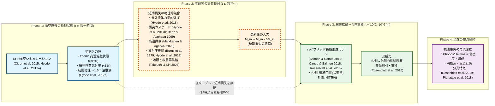
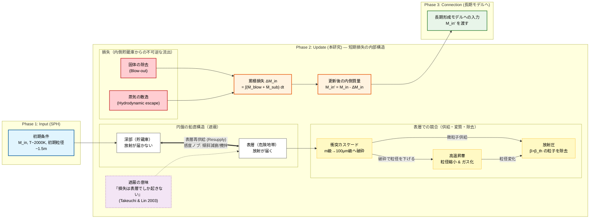

> **文書種別**: 解説（Diátaxis: Explanation）

# シミュレーション研究の背景と導入

本資料は、火星ロッシュ限界内ダスト円盤シミュレーション研究の科学的背景・目的・主要物理過程を整理したものです。ロッシュ限界内の質量収支が衛星形成条件へどう接続するか、そしてそれを定量化するためにどの過程を結合するかを、背景→問い→モデルの順で説明します。

本研究は、巨大衝突後に火星近傍へ形成される高温デブリ円盤のうち、**潮汐力のために集積が進みにくい境界の内側**であるロッシュ限界内に着目し、年スケールで起きうる固体質量の損失量を定量化することを目的とする。ロッシュ限界外では衝突による成長で衛星形成へつながり得る一方、ロッシュ限界内では物質が分散しやすく、質量は「外側へ供給される」か「失われる」ことでしか衛星形成へ寄与できない。

この問題設定の出発点は、衛星形成モデルがロッシュ限界内の円盤質量を主要な変数として扱うことにある。たとえば Canup & Salmon (2018) は、ロッシュ限界内の物質を連続円盤として扱い、その質量 \(M_{\rm in}\) と外縁 \(r_{\rm d}\) が、外側で成長する衛星との重力相互作用と、衝突に由来する粘性で時間発展するとモデル化した。さらに、円盤が内側へ広がれば惑星へ落下し、外側へ広がってロッシュ限界を越えれば「新しい微小天体」として外側の集積計算へ供給される、と記述している。したがって、ロッシュ限界内の質量がどれだけ残るかは、外側の衛星形成へ影響し得る。

一方で、巨大衝突直後の火星は強い放射源になり得ること、そして火星放射の放射圧で凝縮粒子が除去され得ることも議論されている（Hyodo et al. 2018）。さらに、巨大衝突直後の円盤の初期状態は、破片を多数の粒として扱い、流体のように運動を追う数値計算で推定されてきた。滑らかな粒子流体力学（Smoothed Particle Hydrodynamics）計算は、円盤物質が主として溶融物で蒸気は少量（\(<5\%\)）であること、衝突でメートル級の破片が \(\sim100\,\mu\mathrm{m}\) まで砕かれ得ること、さらに蒸気の一部が \(\sim0.1\,\mu\mathrm{m}\) 程度の微粒子として凝縮し得ることを示している（Hyodo et al. 2017a）。放射圧と重力の比 \(\beta\) は粒径や材質に依存し、サブミクロン粒子では放射圧の寄与が大きくなり得る（Kimura et al. 2002）。このため、ロッシュ限界内の質量収支を評価する際には、放射による吹き飛びだけでなく、微粒子の供給源となる衝突による破砕と、高温での昇華による粒径変化を同じ枠組みで扱う必要がある。

## 0. 本資料の位置づけと参照先

本資料は、**火星巨大衝突起源のデブリ円盤**について、本研究が「どの時間帯の、どの物理過程」を扱い、既存モデルのどこに新しい計算を挟むのかを整理するための導入メモである。数式の定義と実装の詳細は本文に書き切れないため、参照先を先に固定しておく。

- **数式（記号定義・正規形）**は `analysis/equations.md` を参照する。  
- **実装スコープ（1次元が基本、0次元はテスト用補助）と計算フロー**は `analysis/overview.md` を参照する。  
- **実行レシピと運用手順**は `analysis/run-recipes.md` と `analysis/AI_USAGE.md` を参照する。  
- 本資料は、背景・先行研究・問い・採用する物理過程の意味づけに集中し、制約と今後の展開は `analysis/discussion.md` に分ける。

なお本研究は、**ガスが少ない条件（gas-poor）を既定**として、光学的に厚いガス円盤を前提にした Takeuchi & Lin (2003) の表層流出は標準では用いない（`ALLOW_TL2003=false`）。ただし「放射が届くのは表層に限られる」という構造は、遮蔽の扱いを考える上で参照する。

---
## 1. 科学的背景

### 1.1 Phobos・Deimos の起源問題

火星の 2 つの小衛星 Phobos（フォボス）と Deimos（ダイモス）の起源は、主に **(i) 小天体の捕獲** と **(ii) 火星近傍での形成（in situ）** の二系統で議論されてきた。近年のレビューでは、前者は「表層反射スペクトルが炭素質小惑星に似る」こと、後者は「軌道がほぼ円で赤道面に近い」という**力学的規則性**を強い根拠として位置づける整理が一般的である（Rosenblatt 2011; Kuramoto 2024）。

以下では、まず二仮説が **どの観測を根拠にし、どの物理過程を追加で必要とするのか**を、代表的文献の主張と限界をセットで整理する。その後、観測量そのもの（物性・組成、力学・軌道）を表でまとめる。

| 仮説 | 主な支持理由（観測） | 主要な課題（必要になる追加過程） | 代表文献（例） |
|---|---|---|---|
| 捕獲起源（intact capture を含む） | 表層の反射スペクトルが炭素質小惑星に似る | 現在の **低離心率・低傾斜のほぼ円軌道**を得るには、捕獲直後の軌道エネルギーを大きく減らす機構が要る（潮汐散逸・ガス抵抗など） | Burns 1978; Rosenblatt 2011; Kuramoto 2024 |
| in situ（巨大衝突起源が主要候補） | ほぼ円で赤道面に近い軌道は **円盤からの集積**と整合しやすい | 「現在の小さな質量」や「表層スペクトル」を同時に満たすには、円盤の質量予算・材料混合・表層形成過程を詰める必要がある | Rosenblatt 2011; Canup & Salmon 2018; Kuramoto 2024 |

#### 捕獲起源：必要な散逸と、その不確かさ

捕獲起源の最大の論点は、**捕獲された天体の軌道を、現在観測される“ほぼ円で赤道面に近い”軌道へどう変えるか**である。捕獲で得られる軌道は一般に離心率・傾斜が大きくなりやすく、そのままでは現在の軌道形状と合いにくい。したがって、軌道の運動エネルギーを熱などに変えて減らす仕組みが不可欠になる。潮汐散逸（tidal dissipation）である。Rosenblatt (2011) は、捕獲説が主に表層リモートセンシングに依拠する一方で、現在の軌道を説明するには衛星内部で非常に大きな潮汐散逸が必要になる、と明確に述べている。さらに、空隙率が高い内部構造は潮汐散逸を増やし得るが、それでも要求量に届きにくい可能性が指摘され、氷の関与などが仮説として残る段階である（Rosenblatt 2011）。

この「軌道を丸くする散逸」を、ガスを介して実現する案もある。Kuramoto (2024) は、火星が原始太陽系円盤のガスを重力的に引き付けて形成したガス包絡（gas envelope）を想定し、ガス抵抗（gas drag）によって一時的に捕獲された小天体が完全捕獲へ移り、赤道面に近い軌道へ進化し得る、という系統の研究を整理している（Kuramoto 2024）。ただしこの案は、捕獲が起こる時期に「十分濃いガス」が火星周りに存在したことが前提になる。

古典的には、衛星が原始的な周火星ガス／微粒子環境と衝突・相互作用して軌道を正則化する枠組みも提案されてきた。Burns (1978) は、衛星が比較的円に近く傾斜の小さい軌道にある点を出発点に、（潮汐による軌道変化の解釈を前提として）過去の軌道が同期軌道付近で低傾斜だった可能性を述べ、捕獲後に原始的な周火星環境との衝突や相互作用で軌道が整うシナリオを議論している（Burns 1978）。しかし、この系列のモデルも、当時の周火星環境（ガス量・寿命）を別途仮定しなければならない。

以上をまとめると、捕獲起源は「表層スペクトル」とは整合し得る一方、**現在の軌道を再現するための散逸過程がモデルの中核になり、しかもその散逸の大きさが独立に拘束されにくい**という弱点を持つ（Rosenblatt 2011; Kuramoto 2024）。

#### in situ（巨大衝突）起源：優勢と見なされる理由と、残る論点

in situ 形成のうち、近年もっとも具体的に検討されてきたのが巨大衝突起源である（Kuramoto 2024）。この系統の強みは単純で、**赤道面に近い円盤から衛星が集積すれば、低離心率・低傾斜の“規則軌道”が自然に出る**点にある。Canup & Salmon (2018) も、表層スペクトルが捕獲を想起させる一方で、「ほぼ円で共面に近い」軌道は intact capture と両立しにくく、むしろ赤道面の円盤からの集積を示唆する、と明記している（Canup & Salmon 2018）。

さらに Canup & Salmon (2018) は、潮汐進化を踏まえると両衛星は同期軌道（火星中心から約 6 火星半径）近傍の **約 5–7 火星半径**に起源を持つ可能性が高いことを示し、巨大衝突で作られた円盤の外縁近傍からの集積という絵と整合する（Canup & Salmon 2018）。この意味で、力学的制約だけを見ると in situ 側（特に巨大衝突）は“追加の散逸過程を呼ばずに”説明できる範囲が広い。

一方で、巨大衝突起源にも未解決点は残る。Canup & Salmon (2018) 自身が述べるように、巨大衝突が円盤を作り得るとしても、**なぜ非常に小さな Phobos・Deimos が残るのか**（円盤が過剰に重くなりやすい問題）や、表層スペクトル・熱赤外の解釈をどこまで一貫して説明できるかは、単一の要因では決まりにくい（Canup & Salmon 2018; Kuramoto 2024）。したがって現時点で結論は確定していないが、レビューでは「規則軌道」を自然に説明できる点で巨大衝突起源が主要候補として扱われることが多い（Rosenblatt 2011; Kuramoto 2024）。

本研究は、この in situ（巨大衝突）枠組みを採用した上で、**衝突直後〜長期粘性進化の前段階に起こり得る質量損失が、長期モデルの入力（内側貯蔵庫 \(M_{\rm in}\)）にどう反映されるべきか**という未整備点に焦点を当てる（この位置づけは 1.2 節で詳述する）。

#### 物性・組成の整理

Kuramoto (2024) の整理に沿って、物性・組成と力学特性を分けて記す（物性単独では決定打にならない点に留意する）。

| 観測される物性値（代表値） | 捕獲起源と整合しやすい読み | 巨大衝突起源と整合しやすい読み |
| --- | --- | --- |
| VIS-NIR 反射スペクトルが D/T 型小惑星に近く、2.8 um 帯に弱い吸収が見られる（Fraeman et al. 2012; Fraeman et al. 2014） | 炭素質小惑星由来の表層・含水鉱物の可能性（Fraeman et al. 2012; Fraeman et al. 2014; Pajola et al. 2013） | 衝突蒸気の凝縮微粒子（~0.1 um）が D 型様の赤いスペクトルを再現し得る（Ronnet et al. 2016; Hyodo et al. 2017a） |
| 低アルベド（ボンド ~0.02、幾何 ~0.07; Kuramoto 2024） | 暗い D 型小惑星と整合（Pajola et al. 2013） | 衝突蒸気由来の暗色凝縮物や宇宙風化による暗化でも説明可能（Pignatale et al. 2018; Pieters et al. 2014） |
| 低バルク密度（Phobos ~1.86、Deimos ~1.51 g/cm^3; Kuramoto 2024） | 多孔質・氷含有体の捕獲を示唆（Kuramoto 2024） | 衝突デブリの再集積によるラブルパイル構造と整合（Andert et al. 2010; Rosenblatt et al. 2016） |
| MID-IR 放射率が炭素質隕石と一致しない（Giuranna et al. 2011; Glotch et al. 2018） | 捕獲説単独では説明が難しい観測（Kuramoto 2024） | フィロケイ酸塩・玄武岩など火星由来材料の可能性（Giuranna et al. 2011; Glotch et al. 2018） |
| 低熱慣性（20-85 J m^-2 K^-1 s^-1/2 と細粒レゴリス; Kuzmin & Zabalueva 2003; Wada et al. 2018; Kuramoto 2024） | 表層進化（インパクト・ガーデニング/放射圧選別）で説明可能で判別力が弱い（Kuramoto 2024） | 衝突破砕による細粒供給でも整合するが決定的ではない（Kuramoto 2024） |
| 形状（不規則形状; Thomas 1989）/内部構造（高空隙; Andert et al. 2010） | 捕獲前の形状保持と整合（Thomas 1989） | ロッシュ限界近傍での集積・潮汐整形と両立（Hu et al. 2020; Rosenblatt & Charnoz 2012） |

以上より、VIS-NIR とアルベドは捕獲説に整合しやすい一方で、MID-IR 放射率や密度・形状は衝突起源の再集積とも整合し、観測のみでは決着しにくい。MMX のサンプルリターンが決定的な検証になると期待されている（Kuramoto 2024）。

#### 力学・軌道特性（起源判断に強く関与）

力学的には「現在の軌道がどれだけ規則的か」と「潮汐進化をさかのぼったとき、どこに起源を置けるか」が制約になる。代表的な整理は次のとおりである（Burns 1978; Canup & Salmon 2018）。

- **ほぼ円で赤道面に近い軌道**は、円盤からの集積（in situ）と整合しやすい。捕獲起源では、この形へ落ち着く散逸過程を別途要請する（Rosenblatt 2011; Canup & Salmon 2018）。
- **同期軌道の内外で潮汐進化の向きが反転する**ため、Phobos は内側にある限り内向き、Deimos は外側にある限り外向きに動く。Canup & Salmon (2018) はこの事実から、両衛星が同じ領域（約 5–7 火星半径）に起源を持つ可能性を示している（Canup & Salmon 2018）。
- Burns (1978) も、潮汐による軌道変化の解釈を前提に、過去の軌道が同期軌道付近で低傾斜だった可能性を述べており、形成場所として「同期近傍」を強く示唆する。

以上の点は、「捕獲か in situ か」を一意に決めるものではないが、**捕獲側は散逸の仮定が支配的になりやすい**一方で、**in situ（巨大衝突）側は規則軌道を出発点として次段（円盤進化・質量予算）へ議論を進めやすい**。本研究が巨大衝突起源を仮定し、内側円盤の短期損失に焦点を当てる理由はここにある。

### 1.2 巨大衝突円盤と本研究が扱う範囲

火星衛星の巨大衝突起源説は、単一の計算で完結しない。衝突直後（数十時間）の円盤形成、高温期の短期損失（年スケール）、粘性拡散と外側での集積（10^2–10^3 年）、そして観測制約との照合（Myr–現在）が、**異なる時間スケール**と**異なる数値手法**で分担されている。本研究がやりたいのは、この分担の間に残っている「手続きの空白」を、先行研究と矛盾しない形で埋めることである。

ここでは、円盤進化を「時間の流れ」と「モデル上の役割（Input/Update/Connection/Output）」を同じ軸に重ねて整理する（図 1.2a）。左から右へ時間が進むにつれて、(i) SPH が与える初期状態（Input）が決まり、(ii) 高温期の短期損失で内側貯蔵庫が更新され（Update）、(iii) 更新後の内側円盤を状態量として長期進化モデルに渡し（Connection）、(iv) 最終的な衛星の生存・組成が観測と比較される（Output）という流れになる。

この整理で重要なのは、既存研究が **Phase 1（Input）** と **Phase 3–4（Connection/Output）** を厚く扱ってきた一方、**Phase 2（Update）をどう定義し、どの変数を更新して渡すか**については、文献間で一本の手続きになっていない点である。Hyodo et al. (2018) は「衝突直後の短時間でも蒸気の逃げや放射圧除去が起こり得る」ことを示したが、その効果を長期モデルの入力（とくに \(M_{\rm in}\)）へどう反映するかは未整備である。本研究は、この「欠けたリンク」を **\(M_{\rm in}\) の更新（\(M_{\rm in}\to M_{\rm in}'\)）**として定式化し、短期損失を積算して渡すことに焦点を置く。

また本研究が **ロッシュ限界内（内側円盤）**を主対象にする理由は、単に扱いやすいからではない。第一に、長期モデルでは内側円盤が状態量（連続体）として表現され、外側への供給履歴をほぼ \(M_{\rm in}\) で代表させている（例：Canup & Salmon 2018）。第二に、SPH 計算は円盤質量の大半がロッシュ限界内に集中する傾向を示しており、内側での小さな損失でも長期の供給量に効き得る（Citron et al. 2015; Rosenblatt et al. 2016）。第三に、衝突後のデブリは高離心・高傾斜で、衝突頻度や相対速度が場所により大きく異なり、内側で衝突進化が速い可能性が示唆されている（Hyodo et al. 2017b）。第四に、火星からの放射を受ける熱環境は距離に依存し、内側ほど昇華・凝縮・放射圧の影響が強くなり得る（Hyodo et al. 2018）。したがって、**内側での短期損失を見積もらずに長期形成へ接続すると、入力の系統誤差が残る**。

（図 1.2a）

図 1.2a の Phase 2（Update）は、図で見ると「1つの箱」だが、内部では複数の過程が競合し、しかも遮蔽により「表層だけが放射を受ける」という幾何学的制約を受ける。このため Phase 2 は、単に「放射が強いから飛ぶ」といった単一要因では記述できず、どの粒径帯がどれだけ表層に供給されるか（供給）と、吹き飛び・蒸発がどれだけ速いか（除去・変質）の相対で決まる。本研究はこの内部を、深部（貯蔵庫）と表層（放射が届く領域）に分けた上で、質量フローとして追跡する（図 1.2b）。

（図 1.2b）

### 1.3 ガスが少ない円盤という前提と意味

本研究は「ガスが少ない条件（gas-poor）」を標準前提に置く。ただしここで重要なのは、**「蒸気がゼロ」という意味ではない**という点である。衝突直後の円盤は高温で、蒸気分率が数パーセントでも局所的には蒸気が発生し得る（Hyodo et al. 2017a）。その上で本研究が gas-poor を採用するのは、次の二つを分けて議論するためである。

#### 1.3.1 gas-poor を「ダストの保持が弱い状態」として定義する

本資料でいう gas-poor は、まず平易に言うと「**微粒子がガスに強く引きずられない**」という仮定である。用語としては、ダストとガスの結合（dust–gas coupling）を弱い側に置く、という意味になる。

Hyodo et al. (2018) は、衝突直後に蒸気が流体力学的に散逸し得ることを議論している。この描像に従うと、蒸気が生じても長時間その場に滞留して「濃い雰囲気」を維持するとは限らない。本研究では、**蒸気は速やかに散逸して背景ガス密度が下がる**とみなし、放射圧による弾道的な除去を評価しやすい極限（ガス抵抗を無視した上限評価）を標準に置く。

この仮定は、現実を単純化するだけでなく、次の意味を持つ。もし実際にガス抵抗が強く働くなら、微粒子はより保持されやすくなり、放射圧による損失は本研究の見積もりより小さくなる可能性がある。したがって本研究の標準計算は、**短期損失の「最大側」**を与えることになる。

#### 1.3.2 「損失（Loss）」を、外側への供給と区別して定義する

長期形成モデル（例：Canup & Salmon 2018）は、ロッシュ限界内から外側へあふれ出る質量（ロッシュ限界越え）を、衛星材料として扱う。一方で本研究が扱う「損失」は、それとは別に、**内側貯蔵庫 \(M_{\rm in}\) から不可逆に抜ける項**である。具体的には、(i) 蒸気の散逸（流体力学的逃げ）、(ii) 放射圧による固体の除去（ブローアウト）、(iii) 昇華を介した固体→気体変換とその散逸、を主に指す。

この定義により、本研究の \(\Delta M_{\rm in}\) は「外側へ供給される材料を増やす項」ではなく、**衛星形成の資源そのものを減らし得る項**として長期モデルへ渡される。

#### 1.3.3 Phase 2 と Phase 3 を分けて扱う近似

図 1.2a の Phase 2（高温期の損失）と Phase 3（粘性拡散・集積）は、物理的には完全に直列ではない。粘性拡散は衝突直後から働き得る。しかし本研究では、**高温期（年スケール）に起こる損失の積算**が、**粘性拡散・内側衛星の移動（\(10^3\) 年以上のスケール）**に比べて十分に短い、という時間スケールの差を利用し、まず \(M_{\rm in}\) の更新に集中する（Rosenblatt et al. 2016; Canup & Salmon 2018）。

この「時間スケール分離」が弱い領域（高温期が長い場合など）は、本研究で感度として扱うべき重要点であり、モデルの限界として明示しておく。

---
## 2. 先行研究と未解決点

本章では、図 1.2a の Phase 1〜4 に沿って、先行研究が「何を入力として与え」「何を出力として示し」「どこが接続されていないのか」を、できるだけ機械的に整理する。結論を先に言うと、巨大衝突起源説の研究は **Input（Phase 1）** と **Connection/Output（Phase 3–4）** に厚みがある一方、**Update（Phase 2）を入力更新として定式化する部分が薄い**。本研究は、この Phase 2 の手続きを埋めることを目標にする。

### 2.1 Phase 1：初期条件を与える研究（Input）

巨大衝突直後（\(t\lesssim\) 数十時間）の円盤は、SPH（平滑粒子流体力学）法を中心とした衝突計算で評価されてきた。ここでの「出力」は、長期形成モデルに渡すべき初期状態であり、少なくとも (i) 円盤質量と角運動量、(ii) 半径方向の質量分布、(iii) 温度と相（溶融／蒸気）、(iv) 初期粒径帯、(v) 軌道要素（離心率・傾斜角）を含む。

Citron et al. (2015) は Borealis 級の衝突計算を系統的に行い、\(t\approx30\) 時間時点で円盤質量が \(\sim5\times10^{20}\) kg、インパクタ質量の 1–4% が円盤に入ることを示した。また正規化角運動量 \(L_d^*<1\) の場合に、円盤質量の大半がロッシュ限界内にあることを示している。重要なのは、SPH では人工粘性により数十時間以降の質量推定が不確かになり得るため、**長期進化に渡す初期条件は「衝突直後のスナップショット」として扱う**べきだという点である（Citron et al. 2015）。

Hyodo et al. (2017a) は、火星周回の衝突起源円盤が高温（\(\sim2000\,\rm K\)）で、物質の大半が溶融（>95%）である一方、蒸気は少量（<5%）であることを示した。また溶融物は放出直後にメートル級の溶融滴へ断片化し得ることを議論し、粒径帯を初期条件として与えている。これらは Phase 2 で「どの粒径帯が表層で供給され得るか」を議論する出発点になる。

さらに Hyodo et al. (2017a) は、溶融滴が放射冷却で短時間に冷えることを示しており、例えば 2000 K から 1500 K への冷却は分〜十数分程度で起こり得る。衝突直後の段階で固体粒子が形成され得るため、以後の衝突・破砕へ移る物理的素地が整う。

一方で、衝突直後のデブリは高離心・高傾斜で生成されるため、**円盤が「薄い円盤」に落ち着くまでの衝突減衰**が重要になる。Hyodo et al. (2017b) は、\(J_2\) による歳差と非弾性衝突により離心率・傾斜角が減衰すること、また内側円盤では粒子数密度と相対速度が大きく衝突時間が短いことを述べ、衝突破砕を含む詳細な時間発展が未解決である点を指摘している。Canup & Salmon (2018) は、衝突後 10 h 時点でもロッシュ限界外側の縁が少数の SPH 粒子で表現されることを明記しており、外側円盤の詳細分布が不確かである点を補強する。Rosenblatt et al. (2016) も、外側円盤は低密度で SPH の分解能が限られるため、外側の初期条件は「再構成」が必要であると整理している。

ここまでをまとめると、Phase 1 研究は **内側貯蔵庫 \(M_{\rm in}\) の初期値**をかなり具体的に与える一方で、(i) 衝突後の衝突破砕・微粒子生成、(ii) 高温期の損失の積算、(iii) それを反映した \(M_{\rm in}\) の更新、までは閉じていない。

### 2.2 Phase 2：短期損失と入力更新を扱う研究（Update）

Phase 2 は、衝突直後の高温・非平衡な状態から、粘性拡散でゆっくり広がる「準定常な円盤」へ移るまでの期間に相当する。本研究が扱う中心問題は、この期間に **内側貯蔵庫 \(M_{\rm in}\) がどれだけ削られるか**である。

Hyodo et al. (2018) は、巨大衝突後の火星表面が高温になり得ることを示し、その放射により (i) 蒸気が流体力学的に散逸し得ること、(ii) 蒸気から凝縮したサブミクロン粒子が放射圧で除去され得ることを議論した。とくに「最初の 1 周回」という力学的に短い時間でも損失が起こり得る点は、長期モデルに対して独立な損失項を導入する動機になる。

同研究では、蒸気成分の 10–40% が最初の 1 周回の間に逃げ得ること、またサブミクロン（~0.1 μm）級の凝縮粒子が同じ時間スケールで除去され得ることが示されている。さらに、メートル級 droplet を仮定した光学的厚み評価により、火星に近い高密度アームでは \(\tau>1\) となって遮蔽される一方、アームの上下や外側（例：\(15\,R_{\rm Mars}\) 以遠）では \(\tau<1\) となり得ることが示される。したがって短期損失は、遮蔽されない成分（表層・疎領域）に集中し、表層供給との競合で決まる。

ただし Hyodo et al. (2018) の議論だけでは、次の点が残る。第一に、放射圧で除去されるのは「すでに微粒子が存在する」部分であり、その微粒子が **どの速度で供給され続けるか**（衝突破砕・衝突カスケード）が別途必要になる。第二に、昇華は微粒子の質量を直接減らすだけでなく、粒径を連続的に変えて「吹き飛びやすい粒径帯」へ供給するため、放射圧除去と結びつく。第三に、円盤が光学的に厚い場合、放射が届くのは表層に限られるため、損失は表層の在庫と補給速度で律速され得る。

加えて、gas-poor 環境では「衝突で砕ける → 小粒子が放射圧で飛ぶ」という連鎖が、総質量を動かし得る損失項として働くことが、デブリ円盤研究で一般論として整理されている（例：Thebault & Augereau 2007; Wyatt 2008; Strubbe & Chiang 2006）。もちろん火星周回円盤は放射源（火星）や時間スケールが大きく異なるため、知見をそのまま当てはめるのではなく、どの程度この連鎖が成立するかを本研究で検証する必要がある。

この「表層で起きる損失」という幾何学的制約を明示した代表例が Takeuchi & Lin (2003) の表層流出であり、本研究は gas-poor を既定とするため式そのものは使わないが、**遮蔽が損失を表層へ局在化させる**という構造を、Phase 2 の骨格として取り込む。

以上より Phase 2 は、少なくとも
(1) 衝突カスケードによる微粒子供給、(2) 昇華による粒径変化と質量消失、(3) 放射圧による除去、(4) 遮蔽と表層再供給、
を同じ枠で結合しないと、\(\Delta M_{\rm in}\) を一意に定められない。本研究はここを主計算対象にする。

### 2.3 Phase 3：粘性拡散と外側への受け渡し（Connection）

Phase 3 は、ロッシュ限界内の内側円盤（連続体）が、粘性拡散で角運動量を再配分し、ロッシュ限界外へ材料を供給して外側の集積を駆動する段階である。ここは「ハイブリッド・モデル」（内側：流体、外側：N 体）として体系化されてきた。

Salmon & Canup (2012) は潮汐円盤の進化において、蒸気円盤の放射冷却が粘性を制御する「熱調節された粘性」を議論している。火星系に直接適用する際にはパラメータが異なるが、**粘性拡散が熱状態に制約される**という構造は、内側円盤を状態量として扱う上で重要である。

Canup & Salmon (2018) は火星系へ適用したハイブリッド・モデルを提示し、内側円盤質量 \(M_{\rm in}\) と外縁 \(r_{\rm d}\) の進化が外側集積の帰結を強く左右することを示した。とくに、現在のような小衛星が生き残るためには初期円盤が過大であってはならず、円盤質量に上限があることを明確にしている。この種の結果は、「短期損失が \(M_{\rm in}\) を動かし得るなら、形成可能な衝突条件の範囲が変わる」ことを意味する。

Rosenblatt & Charnoz (2012) も火星系への適用を行い、粘性拡散・集積・潮汐進化を通じて過去の衛星総量を説明し得る円盤質量域を示した。ただし簡略化のため、衝突直後の高温期の損失や詳細な熱進化は取り込まれていない。Crida & Charnoz (2012) はリング—衛星系の一般論として円盤寿命と形成レジームを整理しており、系が違っても「損失項が総質量を動かし得る」こと自体は共通の論点になる。

さらに Rosenblatt et al. (2016) は、内側円盤の拡散で形成された \(10^{19}\) kg 級の内側衛星が外側へ移動し、2:1・3:2 共鳴を通じて外側の衛星胚を励起して 2 つの小衛星形成を促すこと、内側衛星は数 Myr で火星へ落下することを示した。これは、**内側円盤の供給履歴が外側形成に実質的に入る**ことを、具体的な力学過程として示している。

### 2.4 Phase 4：観測制約と「出力」の評価（Output）

Phase 4 は、形成シナリオの最終結果を観測事実と突き合わせる段階である。力学的には、衛星の質量・軌道（赤道近傍、ほぼ円軌道）と、長期の潮汐進化を同時に満たす必要がある（Rosenblatt 2011; Rosenblatt et al. 2019）。物性としては低密度・ラブルパイル構造、組成としては火星由来物質と衝突体物質の混合、さらに分光的には「赤いが特徴の弱い」スペクトルをどう説明するかが制約になる。

Pignatale et al. (2018) は、衝突後の気相から凝縮した微細粒子が表面を覆うことでスペクトルを説明し得る可能性を議論しており、粒径分布を伴う物質循環は観測との接続点にもなる。したがって本研究の Phase 2 出力（残存質量だけでなく粒径分布）には、長期形成（Phase 3）だけでなく観測比較（Phase 4）へ橋を架ける余地がある。

---

以上を踏まえると、未解決点は「Phase 1 の初期条件を、Phase 3 の入力へ渡す直前に、Phase 2 の短期損失で更新する」という操作が定式化されていないことに集約できる。本研究はこの更新操作を具体化し、既存の長期形成モデルが要求する \(M_{\rm in}\) の議論を、短期損失を含む形へ拡張する。
## 3. 研究目的と問い

本研究で最終的に明らかにしたいのは、端的に言えば **「結局どんな円盤ができたのか」**である。ただしここでいう「円盤」は、衝突直後の SPH が出力する円盤（Phase 1）そのものではなく、**短期損失を経た後に長期形成モデルへ渡される実効的な円盤**（更新後の内側貯蔵庫 \(M_{\rm in}'\) と、その粒径分布）を指す。

長期の形成モデル（Canup & Salmon 2018; Rosenblatt et al. 2016 など）は、内側円盤を状態量で表し、粘性拡散でロッシュ限界を越えた材料が外側で集積していく過程を計算する。一方で、衝突直後〜円盤が整う前の段階に、放射圧・凝縮・（蒸気の）逃げが起き得ることは Hyodo et al. (2018) が示している。しかしこの「早い段階の除去」を、長期モデルの入力（とくに \(M_{\rm in}\)）へどう反映させるかは、文献間でまだ一本の手続きになっていない。本研究は、この接続の欠損を、Phase 2 の **\(\Delta M_{\rm in}\) を計算して \(M_{\rm in}\) を更新する**問題として定式化する。

### 3.1 研究目的：衛星形成が可能な「衝突シナリオ」の許容範囲を絞る

本研究の目的は、火星ロッシュ限界内の高温デブリ円盤において、短期損失プロセス（放射圧除去・昇華・衝突カスケード・遮蔽）を結合したモデルにより \(\Delta M_{\rm in}\) を評価し、**長期形成モデルへ渡す実効質量 \(M_{\rm in}'\) がどの範囲に落ち着くのか**を明らかにすることである。

なお、Phase 2 の長さ（高温期が何年続くか）は、短期損失の積算を直接左右する。Hyodo et al. (2018) では、火星表層が冷えるまでに「年」オーダーを要し得ることを、簡約化した放射冷却の見積もりで示している。一方で冷却時間は、加熱された深さ・有効放射率・熱輸送の扱いに依存するため、本研究では冷却履歴を入力パラメータとして扱い、より長い高温期も含めて感度を評価する。（この点は、内側円盤における昇華・放射圧の重要性を検討する動機にもなる。）

この目的を「生存条件の探査」として言い換えると、次になる。すなわち、巨大衝突の幾何（円盤の傾斜角分布に反映され得る）や熱状態（火星表面温度の履歴に反映され得る）が異なると、表層再供給の速さや昇華・除去の効率が変わり、結果として **円盤が衛星形成に十分な質量を保てるかどうか**が変わる。本研究は、この依存性を通じて「衛星形成に寄与し得る衝突条件の許容範囲」を狭めることを狙う。

### 3.2 リサーチ・クエスチョン（RQ）

本研究が答えたい問いは、上位から順に次の 2 点に整理できる。

**RQ1（Sensitivity）: 短期損失で更新された内側貯蔵庫 \(M_{\rm in}'\) は、初期条件にどれだけ敏感か？**  
衝突が残す初期状態（\(M_{\rm in}\)、初期粒径帯、円盤の傾斜角分布）と、火星表面温度の履歴が与えられたとき、遮蔽された表層での供給（衝突カスケード）・変質（昇華）・除去（放射圧）の競合は、\(\Delta M_{\rm in}\) をどれだけ変えるか。とくに「表層再供給」を表す感度ノブが、見積もり幅をどの程度支配するかを定量化する。

**RQ2（Constraint）: “大きすぎる衝突”は、短期損失を通じて否定され得るか？**  
長期形成モデルが示す小衛星の生存条件（例：Canup & Salmon 2018 の円盤質量上限）を踏まえたとき、短期損失を組み込むと「衝突で大量に円盤を作るほど衛星形成に有利」という単純な見方は維持できるか。逆に、過大な衝突ほど高温・高衝突率となり \(M_{\rm in}\) が効率よく削られ、結果として衛星形成につながらない、という選別則が示唆されるかを調べる。

本研究の直接の出力は、(i) 時間積分した \(\Delta M_{\rm in}\) と更新後の \(M_{\rm in}'\)、(ii) 粒径分布と表層在庫の時間発展、(iii) 損失内訳（ブローアウト／昇華／蒸気散逸）である。これらを、Phase 3 の長期形成モデルへ渡す「更新済み入力」として整備することが、本研究の位置づけになる。

---
## 4. モデルの概要

### 4.1 スコープ

本研究の計算は、ロッシュ限界内の半径方向を分割した 1 次元モデルを基本とし、粒径分布と表層質量の時間発展を追う。0 次元は代表半径の局所モデルとして、テストや感度検証の補助に用いる。

ガスが少ない条件を既定とするため、光学的に厚いガス円盤を前提にした表層流出モデルは標準では用いない。必要であれば、ガスが多い仮定の感度試験として切り替える。

### 4.2 放射による吹き飛びの条件と損失量

放射によって微粒子が重力から逃げる効果を扱う。これを放射圧ブローアウトと呼ぶ。吹き飛びの起きやすさは、放射圧と重力の比である \(\beta\) で表し（(E.013)）、\(\beta\) が閾値を超えると粒子は脱出しやすくなる（\(\beta\) の意味づけは Kimura et al. 2002を参照）。閾値粒径のブローアウト境界 \(a_{\rm blow}\) は (E.014) に対応する。

本研究では、損失量を「閾値粒径」だけで決めない。ブローアウトの滞在時間は \(t_{\rm blow}=1/\Omega\) を基本とし（(E.007)）、損失量は表層に存在する質量と軌道の時間スケールに依存するため、表層の外向き流束を
\[
\dot{M}_{\rm out} = \Sigma_{\rm surf}\,\Omega
\]
の形で評価する（(E.009)）。したがって、どの時刻にどれだけの表層質量が存在するかが、累積損失を左右する。

### 4.3 衝突による粒径分布の時間発展

衝突による粒径分布の進化を扱う。粒径ごとの個数が衝突で増えたり減ったりする過程を表す式として、衝突による粒径分布の式である Smoluchowski 方程式を用いる（(E.010)）。この式により、大粒子から小粒子が供給される一方で、衝突そのものによる消滅も同時に評価できる。表層衝突寿命のスケールは \(t_{\rm coll}=1/(\Omega\tau_{\perp})\) を参照する（(E.006)）。破壊閾値 \(Q_D^*\) は材料や衝突速度に依存するため、本文では代表条件を参照し、感度は補助図で押さえる。

本研究の動機に照らすと、この部分は「吹き飛びやすい微粒子が、どれだけ速く作られるか」を与える。吹き飛びが強くても供給が弱ければ表層は枯れるし、供給が強ければ表層に微粒子が溜まり損失が増える。したがって、砕け続けの時間発展を入れることは、損失量の見積もりに直結する。

### 4.4 高温昇華による粒径変化

高温で固体が表面から蒸発し、粒子が小さくなる過程を扱う。これを昇華と呼ぶ。表面からどれだけ蒸発するかは、気体分子の熱運動にもとづく式で見積もる。本研究では Hertz–Knudsen–Langmuir 式を用いる（(E.018)）。

ここで昇華は、独立した損失項であるだけでなく、粒径を縮めて吹き飛びの対象へ入れたり、逆に吹き飛ぶ前に消したりする。つまり昇華は、吹き飛びの前提となる粒径分布を時間とともに変える。このため、昇華を含めた粒径の時間発展を同じ時間積分の中で扱う。

### 4.5 遮蔽と表層再供給

円盤が光学的に厚い場合、放射を実際に受けるのは表層に限られる。そこで自遮蔽により「放射が届く表層の厚み」を決める係数 \(\Phi\) を用い、表層がどれだけの質量を持ちうるかを診断する（(E.015)–(E.017)）。

巨大衝突の条件によっては、円盤が火星赤道面に対して傾いた状態で生成され得る。また火星の \(J_2\) による歳差運動と非弾性衝突によって傾斜や離心率が減衰し、薄い赤道面円盤へ向かう過程が整理されている（Hyodo et al. 2017b）。この遷移過程では円盤の鉛直厚みや配向が時間変化し得るため、表層が固定されない可能性がある。

そこで本モデルは、表層再供給（深部↔表層の入れ替わりを粗く表したもの）を任意に与えられる。ここでの表層再供給は、外側からの流入を精密に表すものではなく、傾斜や衝突減衰に伴う入れ替わりを直接定量化できないための感度試験のノブとして位置づける。したがって、基本ケースでは供給なし（または最小限）で損失の下限を見積もり、供給を入れたケースでは損失の上限を評価する、という使い方が自然である。

---

## 5. 主要出力と先行研究への接続

本研究が直接提供するのは、ロッシュ限界内での短期の質量収支である。具体的な出力は、次の三つに集約できる。

- 時間依存の損失率と累積損失
- 粒径分布の時間発展
- 吹き飛び境界や遮蔽指標など、損失を左右する診断量

### 5.1 数式と診断量の対応（代表例）

- 放射圧比 \(\beta\) とブローアウト境界 \(a_{\rm blow}\) は (E.013), (E.014) に対応し、吹き飛び判定と粒径下限の診断に用いる。
- 表層流出率 \(\dot{M}_{\rm out}\) は (E.009) に対応し、時間依存の損失率と累積損失 \(M_{\rm loss}\) の積分に使う。
- 破砕供給は Smoluchowski 方程式 (E.010) に対応し、微粒子供給率と粒径分布の時間変化を与える。
- 自遮蔽は κ_eff/Σ_τ=1/Φ の式 (E.015)–(E.017) に対応し、放射が届く表層の上限を規定する。
- 昇華による質量フラックスは HKL 式 (E.018) に対応し、シンク項と粒径縮小の寄与を与える。
- 質量収支の整合性は (E.011) の誤差評価に対応し、`checks/mass_budget.csv` で記録する。

この出力を先行研究へ接続する基本手順は次の通りである。粒子法計算が与える初期円盤質量から出発し、本研究が求めた累積損失を差し引いて短期損失を織り込んだ残存質量を得る。その残存質量を、Canup & Salmon (2018) のような形成モデルの初期条件または \(M_{\rm in}\) の追加シンクとして与え、Phobos・Deimos を残し得る条件がどの程度変わるかを評価する。つまり本研究は、初期条件と高温期後の残存条件の間にある質量収支のギャップを埋める役割を持つ。

---

## 6. 図表管理（別ファイル）

図表の差し込み案とメタデータ管理は `analysis/figures_insertion_notes.md` に移管した。本書は論証の流れを優先し、図表管理は別途参照する。
## 参考文献

Andert et al. (2010). *Geophysical Research Letters*, 37(9). doi:10.1029/2009GL041829  
Benz, W., & Asphaug, E. (1999). *Icarus*, 142, 5–20. doi:10.1006/icar.1999.6204  
Burns, J. A., Lamy, P. L., & Soter, S. (1979). *Icarus*, 40, 1–48. doi:10.1016/0019-1035(79)90050-2  
Canup, R. M., & Salmon, J. (2018). *Science Advances*, 4(4), eaar6887. doi:10.1126/sciadv.aar6887  
Citron, R., Genda, H., & Ida, S. (2015). *Icarus*, 252, 334–338. doi:10.1016/j.icarus.2015.02.011  
Crida, A., & Charnoz, S. (2012). *Science*, 338, 1196–1199. doi:10.1126/science.1228006  
Dohnanyi, J. S. (1969). *J. Geophys. Res.*, 74, 2531–2554. doi:10.1029/JB074i010p02531  
Fraeman et al. (2012). *J. Geophys. Res. Planets*, 117, E00J15. doi:10.1029/2012JE004137  
Fraeman et al. (2014). *Icarus*, 229, 196–205. doi:10.1016/j.icarus.2013.11.021  
Giuranna et al. (2011). *Planetary and Space Science*, 59, 1308–1325. doi:10.1016/j.pss.2011.01.019  
Glotch et al. (2018). *J. Geophys. Res. Planets*, 123, 2467–2484. doi:10.1029/2018JE005647  
Hu et al. (2020). *Geophysical Research Letters*, 47, e2019GL085958. doi:10.1029/2019GL085958  
Hyodo, R., Genda, H., Charnoz, S., & Rosenblatt, P. (2017a). *The Astrophysical Journal*, 845, 125. doi:10.3847/1538-4357/aa81c4  
Hyodo, R., Genda, H., Rosenblatt, P., & Charnoz, S. (2017b). *The Astrophysical Journal*, 851, 122. doi:10.3847/1538-4357/aa9984  
Hyodo, R., Genda, H., Charnoz, S., Pignatale, F. C. F., & Rosenblatt, P. (2018). *The Astrophysical Journal*, 860, 150. doi:10.3847/1538-4357/aac024  
Kimura, H., Okamoto, H., & Mukai, T. (2002). *Icarus*, 157, 349–361. doi:10.1006/icar.2002.6849  
Krivov, A. (2010). *Research in Astronomy and Astrophysics*, 10(5), 383–414. doi:10.1088/1674-4527/10/5/001  
Kuramoto, K. (2024). *Annual Review of Earth and Planetary Sciences*, 52, 495–519. doi:10.1146/annurev-earth-031621-064742  
Kuzmin, R. O., & Zabalueva, E. V. (2003). *Solar System Research*, 37, 480–488. doi:10.1023/B:SOLS.0000007946.02888.BD  
Markkanen, J., & Agarwal, J. (2020). *A&A*, 643, A16. doi:10.1051/0004-6361/202039092  
Pajola et al. (2013). *The Astrophysical Journal*, 777, 127. doi:10.1088/0004-637X/777/2/127  
Pieters et al. (2014). *Planetary and Space Science*, 102, 144–151. doi:10.1016/j.pss.2014.02.008  
Pignatale, F. C. F., Charnoz, S., Chaussidon, M., & Tosi, N. (2018). *The Astrophysical Journal*, 853, 118. doi:10.3847/1538-4357/aaa23e  
Rosenblatt, P. (2011). *Astronomy and Astrophysics Review*, 19, 44. doi:10.1007/s00159-011-0044-6  
Rosenblatt, P., & Charnoz, S. (2012). *Icarus*, 221(2), 806–815. doi:10.1016/j.icarus.2012.09.009  
Rosenblatt, P., Charnoz, S., Dunseath, K., Terao-Dunseath, M., Trinh, A., Hyodo, R., Genda, H., & Toupin, S. (2016). *Nature Geoscience*, 9(8), 581–583. doi:10.1038/ngeo2742  
Rosenblatt, P., Hyodo, R., Pignatale, F. C. F., Trinh, A., Charnoz, S., Dunseath, K. M., Terao-Dunseath, M., & Genda, H. (2019). *The formation of the Martian moons*. arXiv:1909.03996.  
Ronnet, T., Bourrier, V., Leinhardt, Z. M., & Charnoz, S. (2016). *The Astrophysical Journal*, 828, 109. doi:10.3847/0004-637X/828/2/109  
Salmon, J., Charnoz, S., Crida, A., & Brahic, A. (2010). *Icarus*, 209(2), 771–785. doi:10.1016/j.icarus.2010.05.030  
Salmon, J., & Canup, R. M. (2012). *The Astrophysical Journal*, 760, 83. doi:10.1088/0004-637X/760/1/83  
Strubbe, L. E., & Chiang, E. I. (2006). *The Astrophysical Journal*, 648, 652–665. doi:10.1086/505736  
Takeuchi, T., & Lin, D. N. C. (2003). *The Astrophysical Journal*, 593, 524. doi:10.1086/376496  
Thebault, P., & Augereau, J.-C. (2007). *A&A*, 472, 169–185. doi:10.1051/0004-6361:20077789  
Thomas, P. (1989). *Icarus*, 77, 248–274. doi:10.1016/0019-1035(89)90089-4  
Wada et al. (2018). *Progress in Earth and Planetary Science*, 5, 82. doi:10.1186/s40645-018-0237-y  
Wyatt, M. C. (2008). *Annual Review of Astronomy and Astrophysics*, 46, 339–383. doi:10.1146/annurev.astro.45.051806.110525  

> **数式定義**: `analysis/equations.md`  
> **実装スコープと計算フロー**: `analysis/overview.md`  
