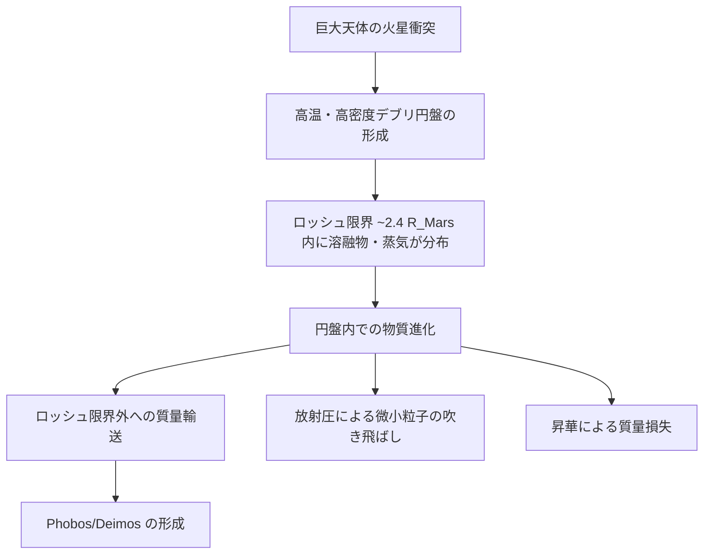

> **文書種別**: 解説（Diátaxis: Explanation）

# シミュレーション研究の背景と導入

本資料は、火星ロッシュ限界内ダスト円盤シミュレーション研究の科学的背景・目的・主要物理過程を整理したものです。

---

## 0. 本資料の位置づけと参照先

- 本書は背景・意図をまとめた「解説」レイヤーであり、数式やモジュール責務の正規形は `analysis/equations.md` と `analysis/overview.md` を唯一の仕様源とする。実行レシピは `analysis/run-recipes.md` と `analysis/AI_USAGE.md` を参照し、ここでは前提と文脈だけを示す。
- 標準の0Dベースラインは `python -m marsdisk.run --config configs/base.yml` で起動し、`out/series/run.parquet`・`out/summary.json` と質量収支ログ `out/checks/mass_budget.csv` を生成する。質量誤差は (E.011) の許容 |error| ≤ 0.5% を `compute_mass_budget_error_C4` が検査し、`writer.write_*` が成果物にシリアライズする。[marsdisk/run.py:8–8][marsdisk/io/writer.py:24–305]
- スコープは gas-poor を既定とするロッシュ内0D円盤で、TL2003 型表層 ODE は `ALLOW_TL2003=false` のまま無効。gas-rich 感度を試す場合のみ環境変数を `true` にし、`surface.collision_solver=surface_ode` を使うレシピへ切り替える（詳細は `analysis/run-recipes.md`）。
- 数値仕様の目安は対数サイズビン30–60（既定40, $s\in[10^{-6},3]$ m）、IMEX-BDF(1) で $\Delta t \le 0.1 \min t_{\rm coll}$ を保ったまま2年間を積分し、$t_{\rm blow}=1/\Omega$ を解像する（(E.006),(E.010)）。既定パラメータとスイッチは `configs/base.yml:1–172` に集約している。

---

## 1. 科学的背景

### 1.1 研究対象：火星衛星 Phobos・Deimos の起源

火星には2つの小さな衛星 **Phobos**（フォボス）と **Deimos**（ダイモス）が存在します。これらの起源は長年議論されており、主に2つの仮説が提唱されています：

| 仮説 | 概要 | 根拠 |
|------|------|------|
| **捕獲起源** | 小惑星帯から移動してきた天体を火星が捕獲 | スペクトル的類似性 |
| **巨大衝突起源** | 火星への巨大衝突で形成された円盤から集積 | 軌道特性（ほぼ円軌道、赤道面）|

近年の研究では、**巨大衝突起源仮説**がより有力視されています（Rosenblatt 2011, Canup & Salmon 2018）。本シミュレーションはこの仮説に基づいています。

### 1.2 巨大衝突シナリオの概要



**主要先行研究**:
- **Hyodo et al. (2017, 2018)**: SPH計算による初期条件設定、gas-poor円盤の根拠
- **Canup & Salmon (2018)**: 衛星生存条件（$M_{\rm disk} \le 3 \times 10^{-5} M_{\rm Mars}$）
- **Kuramoto (2024)**: 火星衛星起源シナリオの総説

### 1.3 Gas-poor（ガス希薄）円盤の前提

本シミュレーションでは**gas-poor円盤**を標準前提としています：

> 衝突直後の円盤は >95 wt% が溶融物、<5 wt% が蒸気（~2000 K）であり、初期公転で揮発成分が散逸しやすい条件にあります。

この根拠は以下の研究に基づきます：
- **Hyodo et al. (2017)**: 蒸気分率 ≲ 数%
- **Canup & Salmon (2018)**: 小衛星を残すには低質量・低ガスの円盤条件が必要

> [!IMPORTANT]
> **光学的に厚いガス円盤**を仮定する Takeuchi & Lin (2003) の表層塵アウトフロー式は、gas-poor前提では**適用外**（`ALLOW_TL2003=false`）としています。

---

## 2. 研究目的

### 2.1 シミュレーションの目標

火星ロッシュ限界内（~2.4 火星半径）の高温・高密度ダスト円盤を対象に、以下の物理過程を統合モデリングし、**2年間の質量損失履歴**を定量化します：

1. **内部破砕（Smoluchowski衝突カスケード）** による小粒子供給
2. **放射圧ブローアウト** による表層剥離・流出
3. **昇華** による高温環境での質量損失
4. **外部質量供給** による表層への連続的物質供給

### 2.2 主要出力

| 出力 | 記号 | 説明 |
|------|------|------|
| 瞬時質量損失率 | $\dot{M}_{\rm out}(t)$ | 時間依存の表層流出率 |
| 累積質量損失 | $M_{\rm loss}$ | 2年間の総損失量 |
| 粒径分布(PSD) | $N(s, t)$ | 時間発展するサイズ分布 |
| ブローアウト境界 | $a_{\rm blow}$ | 放射圧で吹き飛ばされる粒径閾値 |

---

## 3. 主要物理過程

### 3.1 放射圧ブローアウト（Radiation Pressure Blow-out）

巨大衝突直後の火星表面は数千Kまで加熱され、ロッシュ限界付近の粒子は強い赤外放射を受けます。

**軽さ指標 β**（放射圧と重力の比）(E.013):

$$
\beta = \frac{3\,\sigma_{\rm SB}\,T_{\rm M}^{4}\,R_{\rm M}^{2}\,\langle Q_{\rm pr}\rangle}{4\,G\,M_{\rm M}\,c\,\rho\,s}
$$

- **β > 0.5** → 粒子は軌道から脱出（ブローアウト）
- **ブローアウト境界サイズ** $a_{\rm blow}$ (E.014): β = 0.5 となる粒径

**主要パラメータ**:
- $T_{\rm M}$: 火星表面温度（2000–6000 K）
- $\langle Q_{\rm pr}\rangle$: Planck平均放射圧効率
- $\rho$: 粒子密度（~3000 kg/m³）

**参考文献**: Burns et al. (1979), Strubbe & Chiang (2006)

---

### 3.2 衝突カスケード（Collision Cascade）

粒子同士の高速衝突（1–5 km/s）により破砕が進み、大粒子から小粒子が生成されます。

**Smoluchowski方程式**（粒径分布の時間発展）(E.010):

$$
\dot{N}_k = \frac{1}{2}\sum_{i,j} K_{ij}\,N_i N_j\,Y_{kij} - N_k\sum_j K_{kj}N_j + f_k
$$

- $K_{ij}$: 衝突カーネル（幾何断面積 × 相対速度）
- $Y_{kij}$: 破片分配係数
- $f_k$: ソース/シンク項

**衝突寿命（Wyattスケーリング）**(E.006):

$$
t_{\rm coll} = \frac{1}{\Omega\,\tau_{\perp}}
$$

**参考文献**: Krivov et al. (2006), Wyatt (2008)

---

### 3.3 昇華（Sublimation）

高温環境では粒子表面からの蒸発が質量損失の原因となります。

**HKL質量フラックス**（Hertz–Knudsen–Langmuir式）(E.018):

$$
J(T) = \alpha_{\rm evap}\left(P_{\rm sat}(T) - P_{\rm gas}\right)\sqrt{\frac{\mu}{2\pi R T}}
$$

- $\alpha_{\rm evap}$: 蒸発係数（SiO: 0.007）
- $P_{\rm sat}(T)$: 飽和蒸気圧（Clausius-Clapeyron型）(E.036)
- $P_{\rm gas}$: 周囲蒸気圧（gas-poor条件では ≈ 0）

**参考文献**: Pignatale et al. (2018), Ronnet et al. (2016)

---

### 3.4 自遮蔽効果（Self-Shielding）

光学的に厚い円盤では、表層のみが放射を受けます (E.015–E.017):

$$
\Sigma_{\rm surf,clip} = \min(\Sigma_{\rm surf}, \Sigma_{\tau=1})
$$

- $\Sigma_{\tau=1} = \kappa_{\rm eff}^{-1}$: τ=1 表層質量
- $\Phi(\tau)$: 自遮蔽係数（テーブル補間）

---

## 4. 物理過程の相互作用

```
     ┌──────────────────────────────────────────────────────────┐
     │                    衝突カスケード                         │
     │   大粒子 → 破砕 → 小粒子生成（prod_subblow_area_rate）     │
     └────────────────────────┬─────────────────────────────────┘
                              │
                              ▼
     ┌──────────────────────────────────────────────────────────┐
     │              表層への小粒子供給                            │
     │        s < a_blow の粒子が表層に蓄積                       │
     │        + 外部供給（supply モジュール）                      │
     └──────┬─────────────────────────────┬─────────────────────┘
            │                             │
            ▼                             ▼
┌───────────────────────────────┐   ┌─────────────────────────────┐
│       相状態判定 (phase)       │   │       温度ドライバ           │
│   SiO₂マップ → solid/vapor    │   │   T_M(t) → β, a_blow, J(T)  │
└───────────────────────────────┘   └─────────────────────────────┘
            │                             │
            ▼                             ▼
┌───────────────────────────────────────────────────────────────┐
│                      シンク選択                                │
│   solid → rp_blowout: Ṁ_out = Σ_surf × Ω                      │
│   昇華シンク: Φ_sink = Σ_surf / t_sink                         │
└───────────────────────────────────────────────────────────────┘
            │
            ▼
┌───────────────────────────────────────────────────────────────┐
│                      質量収支・出力                            │
│   M_loss_cum, mass_lost_by_blowout, mass_lost_by_sinks        │
└───────────────────────────────────────────────────────────────┘
```

---

## 5. 主要参考文献（優先度A）

| 文献 | 使用箇所 | 主な内容 |
|------|----------|----------|
| Hyodo et al. (2017, 2018) | 初期条件、gas-poor前提 | SPH計算による円盤初期状態 |
| Canup & Salmon (2018) | 衛星生存条件 | 低質量・低ガス円盤の必要性 |
| Strubbe & Chiang (2006) | β定義、衝突時間 | デブリディスクの標準モデル |
| Pignatale et al. (2018) | 昇華パラメータ | 蒸気凝縮物の組成モデル |
| Leinhardt & Stewart (2012) | 破砕強度 | Q*_D スケーリング則 |

詳細な文献情報は [bibliography.md](file:///Users/daichi/marsshearingsheet/analysis/bibliography.md) を参照してください。

---

## 6. 本シミュレーションの位置づけ

本研究は、火星衛星形成過程における**ロッシュ限界内円盤の質量進化**を定量的に評価することで、以下の問いに答えることを目指しています：

1. 巨大衝突後の円盤から、どれだけの質量がブローアウト・昇華で失われるか？
2. 衛星形成に利用可能な質量（ロッシュ限界外への輸送量）はどの程度か？
3. gas-poor条件下での放射圧支配の時間スケールはどの程度か？

これらの知見は、MMX（Martian Moons eXploration）ミッションによる将来のサンプルリターンデータとの比較・検証に活用されることが期待されます。

---

> **詳細な数式定義**: [equations.md](file:///Users/daichi/marsshearingsheet/analysis/equations.md)  
> **計算フロー図**: [physics_flow.md](file:///Users/daichi/marsshearingsheet/analysis/physics_flow.md)  
> **文献索引**: [literature_map.md](file:///Users/daichi/marsshearingsheet/analysis/literature_map.md)  
> **アーキテクチャ概要**: [overview.md](file:///Users/daichi/marsshearingsheet/analysis/overview.md)
