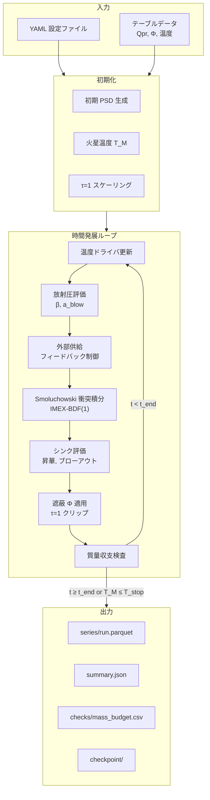
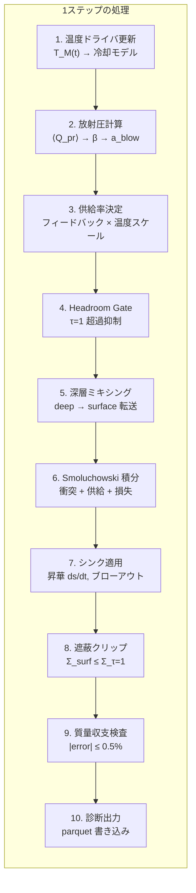
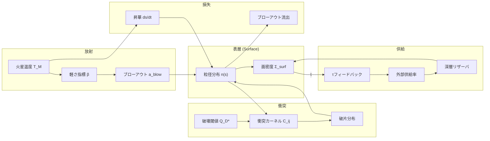

> **文書種別**: リファレンス（Diátaxis: Reference）

# シミュレーション手法

本資料は火星ロッシュ限界内ダスト円盤シミュレーションの数値手法を**概観**するドキュメントです。各手法の詳細は専門ドキュメントに委譲し、ここでは手法の選択理由と参照先を整理します。

---

## シミュレーション全体像

以下の図は、シミュレーションの主要コンポーネントと物理過程の関係を示します。



---

## メインループ詳細フロー

各タイムステップで実行される処理の詳細フローです。



---

## 物理過程の相互作用



---

## 関連ドキュメント

| ドキュメント | 役割 | 参照時のユースケース |
|-------------|------|---------------------|
| analysis/equations.md | 物理式の定義（E.xxx） | 式の導出・記号・単位の確認 |
| analysis/physics_flow.md | 計算フロー Mermaid 図 | モジュール間依存と実行順序の把握 |
| analysis/config_guide.md | 設定キー詳細 | YAML パラメータの意味と許容範囲 |
| analysis/glossary.md | 用語・略語・単位規約 | 変数命名と単位接尾辞の確認 |
| analysis/overview.md | アーキテクチャ・データフロー | モジュール責務と3層分離の理解 |
| analysis/run-recipes.md | 実行レシピ・感度掃引 | シナリオ別の実行手順と検証方法 |

---

## 0. スコープと標準経路

- 標準は gas-poor 前提の0D Smoluchowski 経路（C3/C4）で、計算順序は ⟨Q_pr⟩→β→$a_{\rm blow}$→遮蔽Φ→Smol IMEX→外向流束。半径1D拡張（C5）はオプションとして `viscosity` で演算子分割できる。  
  > **参照**: analysis/overview.md §1, analysis/physics_flow.md 図「0D main loop」
- Takeuchi & Lin (2003) に基づく gas-rich 表層 ODE (E.006)–(E.007) は `ALLOW_TL2003=false` が既定で無効。gas-rich 感度試験では環境変数を `true` にして `surface.collision_solver=surface_ode`（例: `configs/scenarios/gas_rich.yml`）を選ぶ。  
  > **参照**: analysis/equations.md (E.006)–(E.007), analysis/overview.md §1「gas-poor 既定」

---

## 1. 数値積分：IMEX-BDF(1)

**概要**: Smoluchowski 衝突カスケードを解く標準スキーム。

- **剛性項（損失）**: 陰的処理
- **非剛性項（生成・供給）**: 陽的処理
- **時間刻み**: `numerics.dt_init` で固定、衝突時間 $t_{\rm coll}$ の 0.1 倍以下を目安
- **質量検査**: (E.011) を毎ステップ評価し、|error|≤0.5% を `out/checks/mass_budget.csv` に記録。`safety` に応じて Δt は $0.1\min t_{\rm coll}$ に自動クリップされる。

> **詳細**: analysis/equations.md (E.010)–(E.011)  
> **フロー図**: analysis/physics_flow.md §7 "Smoluchowski 衝突積分"

---

## 2. 粒径分布 (PSD) グリッド

対数等間隔グリッドを採用し、隣接比 $s_{i+1}/s_i \lesssim 1.2$ を推奨。

| 設定キー | 既定値 | glossary 参照 |
|----------|--------|---------------|
| `sizes.s_min` | 1e-6 m | G.A05 (blow-out size) |
| `sizes.s_max` | 3.0 m | — |
| `sizes.n_bins` | 40 | — |

- `psd.floor.mode` は (E.008) の $s_{\min,\mathrm{eff}}$ を固定/動的に切り替え、`sizes.evolve_min_size` を使うと昇華由来の床上げを追跡する。
- `wavy_strength>0` で blow-out 近傍の“wavy”構造を付加し、`tests/integration/test_surface_outflux_wavy.py::test_blowout_driven_wavy_pattern_emerges` で定性的再現を確認する。

> **詳細**: analysis/config_guide.md §3.3 "Sizes"  
> **用語**: analysis/glossary.md "s", "PSD"

---

## 3. 衝突カーネル

nσv 型カーネル (E.024) を用い、相対速度は Rayleigh 分布 (E.020) から導出。

- 破壊閾値 $Q_D^*$: Leinhardt & Stewart (2012) 補間 (E.026)
- 速度外挿: 重力項のみ LS09 型 $v^{-3\mu+2}$ で拡張

> **詳細**: analysis/equations.md (E.024), (E.026)  
> **設定**: analysis/config_guide.md §3.5 "QStar"

### 3.1 衝突レジーム分類

衝突は **最大残存率 $F_{LF}$** に基づいて2つのレジームに分類されます：

| レジーム | 条件 | 処理 |
|----------|------|------|
| **侵食（Cratering）** | $F_{LF} > 0.5$ | ターゲット残存、クレーター破片生成 |
| **壊滅的破砕（Fragmentation）** | $F_{LF} \le 0.5$ | 完全破壊、破片分布 $g(m) \propto m^{-\eta}$ |

- Thébault et al. (2003) に基づく侵食モデル
- Krivov et al. (2006) に基づく壊滅的破砕モデル

### 3.2 エネルギー簿記

`diagnostics.energy_bookkeeping.enabled=true` で簿記モードを有効化し、`diagnostics.energy_bookkeeping.stream` が true かつ `FORCE_STREAMING_OFF` が未設定なら `series/energy.parquet`・`checks/energy_budget.csv` をストリーミングで書き出す（オフ時は最後にまとめて保存）。サマリには `energy_bookkeeping.{E_rel_total,E_dissipated_total,E_retained_total,f_ke_mean_last,f_ke_energy_last,frac_*_last}` が追加され、`run_card.md` にも同じ統計が残る。[marsdisk/run_zero_d.py:3996–4058]

| 出力カラム | 意味 | 単位 |
|-----------|------|------|
| `E_rel_step` | 衝突の総相対運動エネルギー | J |
| `E_dissipated_step` | 散逸エネルギー（熱化） | J |
| `E_retained_step` | 残留運動エネルギー | J |
| `n_cratering` | 侵食衝突の頻度 | — |
| `n_fragmentation` | 破砕衝突の頻度 | — |
| `frac_cratering` | 侵食衝突の割合 | — |
| `frac_fragmentation` | 破砕衝突の割合 | — |

**エネルギー散逸率**:

$$ 
E_{diss} = (1 - f_{ke})\,E_{rel}
$$

| 設定キー | 意味 | 既定値 |
|----------|------|--------|
| `dynamics.eps_restitution` | 反発係数（$f_{ke,\mathrm{frag}}$ のデフォルトに使用） | 0.5 |
| `dynamics.f_ke_cratering` | 侵食時の非散逸率 | 0.1 |
| `dynamics.f_ke_fragmentation` | 破砕時の非散逸率 | None（$\varepsilon^2$ 使用） |
| `diagnostics.energy_bookkeeping.stream` | energy 系列/簿記をストリーム出力 | true（`FORCE_STREAMING_OFF` で無効化） |

> **詳細**: docs/plan/collision_energy_conservation_requirements.md

## 4. 放射圧・ブローアウト

軽さ指標 β (E.013) とブローアウト径 $a_{\rm blow}$ (E.014) を ⟨Q_pr⟩ テーブルから評価。

- 外向流束は $t_{\rm blow}=1/\Omega$（E.006）を用い、`chi_blow` と `fast_blowout_factor` の補正状況を `dt_over_t_blow`・`fast_blowout_flag_gt3/gt10` とともに診断列へ出力する。

> **詳細**: analysis/equations.md (E.012)–(E.014)  
> **用語**: analysis/glossary.md G.A04 (β), G.A05 (s_blow)  
> **設定**: analysis/config_guide.md §3.2 "Radiation"

---

## 5. 遮蔽 (Shielding)

$\Phi(\tau)$ テーブル補間で有効不透明度を評価し、$\Sigma_{\rm surf} \le \Sigma_{\tau=1}$ でクリップ。

> **詳細**: analysis/equations.md (E.015)–(E.017)  
> **設定**: analysis/config_guide.md §3.4 "Shielding"

---

## 6. 昇華 (Sublimation)

HKL フラックス (E.018) と飽和蒸気圧 (E.036) で質量損失を評価。SiO 既定パラメータ。

- `sub_params.mass_conserving=true` の場合は ds/dt だけを適用し、$s<a_{\rm blow}$ を跨いだ分をブローアウト損失へ振り替えてシンク質量を維持する。

> **詳細**: analysis/equations.md (E.018)–(E.019), (E.036)–(E.038)  
> **設定**: analysis/config_guide.md §3.6 "Sinks"

---

## 7. 温度ドライバ

火星表面温度の時間変化を `constant` / `table` / `autogen` で選択。

> **詳細**: analysis/equations.md (E.042)–(E.043)  
> **フロー図**: analysis/physics_flow.md §3 "温度ドライバ解決フロー"  
> **設定**: analysis/config_guide.md §3.2 "mars_temperature_driver"

---

## 8. 相判定 (Phase)

SiO₂ 冷却マップまたは閾値から `solid`/`vapor` を判定し、シンク経路を自動選択。

> **フロー図**: analysis/physics_flow.md §4 "相判定フロー"  
> **設定**: analysis/config_guide.md §3.8 "Phase"

---

## 9. 外部供給 (Supply)

`const` / `powerlaw` / `table` / `piecewise` モードで表層への供給率を指定。無次元パラメータ μ から rate を導出可能 (E.027a)。

- `transport` に `direct` / `deep_mixing` を選べ、後者では headroom ゲートとミキシング時間で供給を制限する。診断列 `supply_visibility_factor` などは run.parquet/diagnostics.parquet を参照。

> **詳細**: analysis/equations.md (E.027), (E.027a)  
> **用語**: analysis/glossary.md G.A11 (epsilon_mix)  
> **設定**: analysis/config_guide.md §3.7 "Supply"

### 9.1 フィードバック制御 (Supply Feedback)

`supply.feedback.enabled=true` で τ 目標に追従する比例制御を有効化。

| 設定キー | 意味 | 既定値 |
|----------|------|--------|
| `supply.feedback.target_tau` | 目標光学的厚さ | 0.9 |
| `supply.feedback.gain` | 比例ゲイン | 1.2 |
| `supply.feedback.response_time_years` | 応答時定数 [yr] | 0.4 |
| `supply.feedback.tau_field` | τ 評価フィールド (`tau_vertical` / `tau_los`) | `tau_los` |
| `supply.feedback.min_scale` / `max_scale` | スケール係数の上下限 | 1e-6 / 10.0 |

- `supply_feedback_scale` 列にステップごとのスケール係数を出力。
- フィードバックは Headroom Gate の**上流**で適用されるため、`headroom_policy=clip` と組み合わせると τ~1 維持が堅牢になる。

### 9.2 温度カップリング (Supply Temperature)

`supply.temperature.enabled=true` で火星温度に連動した供給スケーリングを有効化。

- `mode=scale`: べき乗スケーリング $(T/T_{\rm ref})^{\alpha}$
- `mode=table`: 外部 CSV テーブルから補間

| 設定キー | 意味 |
|----------|------|
| `supply.temperature.reference_K` | 基準温度 [K] |
| `supply.temperature.exponent` | べき指数 α |
| `supply.temperature.floor` / `cap` | スケール係数の下限・上限 |

### 9.3 リザーバ (Supply Reservoir)

`supply.reservoir.enabled=true` で有限質量リザーバを追跡。

- `depletion_mode=hard_stop`: リザーバ枯渇で供給ゼロ
- `depletion_mode=taper`: 残量に応じて漸減（`taper_fraction` で制御）

### 9.4 深層リザーバ + ミキシング (Deep Mixing)

`supply.transport.mode=deep_mixing` を選択すると、供給が一旦深層リザーバに蓄積され、ミキシング時間 `t_mix_orbits` 公転で表層へ放出される。Headroom Gate (`hard` / `soft`) を通過して τ=1 超過を抑制。

- `supply_rate_nominal` → `supply_rate_scaled` → `supply_rate_applied` の経路を診断列で確認可能。
- `prod_rate_diverted_to_deep` / `deep_to_surf_flux` 列で深層ルーティングを可視化。

### 9.5 注入パラメータ

| 設定キー | 意味 | 既定値 |
|----------|------|--------|
| `supply.injection.mode` | `min_bin` / `powerlaw_bins` | `powerlaw_bins` |
| `supply.injection.q` | べき指数（衝突カスケード断片） | 3.5 |
| `supply.injection.s_inj_min` / `s_inj_max` | 注入サイズ範囲 [m] | 自動 |
| `supply.injection.velocity.mode` | `inherit` / `fixed_ei` / `factor` | `inherit` |

---

## 10. 動的終了条件と冷却ドライバ

### 10.1 温度停止 (Temperature Stop)

`numerics.t_end_until_temperature_K` を設定すると、火星表面温度が指定値以下になった時点でシミュレーションを終了する。

```yaml
numerics:
  t_end_years: null
  t_end_until_temperature_K: 2000
  t_end_temperature_margin_years: 0
  t_end_temperature_search_years: 10  # optional search cap
```

- `t_end_years` と排他。両方 `null` の場合はデフォルト 2 年。
- `margin_years` で冷却達成後のマージン時間を追加可能。

### 10.2 冷却ドライバモード

| モード | 内容 | 設定参照 |
|--------|------|----------|
| `table` | 外部 CSV テーブル補間 | `radiation.mars_temperature_driver.table.*` |
| `slab` | 解析的 T^{-3} 冷却 (Stefan–Boltzmann) | 内蔵式 |
| `hyodo` | 線形熱流束に基づく冷却 | `radiation.mars_temperature_driver.hyodo.*` |

> **詳細**: analysis/equations.md (E.042)–(E.043), analysis/physics_flow.md §3  
> **設定**: analysis/config_guide.md §3.2 "mars_temperature_driver"

---

## 11. 初期τ=1スケーリング

`init_tau1.enabled=true` で、初期 PSD を τ=1 になるようスケーリングする。

| 設定キー | 意味 | 既定値 |
|----------|------|--------|
| `init_tau1.scale_to_tau1` | 有効化フラグ | `true` |
| `init_tau1.tau_field` | `vertical` / `los` | `los` |
| `init_tau1.target_tau` | 目標光学的厚さ | 1.0 |

- `scale_to_tau1=false` の場合、`initial.mass_total` がそのまま適用されるが、供給が τ=1 キャップで即座にクリップされる可能性がある。

---

## 12. チェックポイント (Segmented Run)

長時間実行をセグメント化し、中間状態を保存して再開可能にする。

```yaml
numerics:
  checkpoint:
    enabled: true
    interval_years: 0.083   # ~30 days
    keep_last_n: 3
    format: pickle          # pickle | hdf5
```

- クラッシュ時に最新チェックポイントから `--resume` で再開。
- `keep_last_n` でディスク使用量を制限。

---

## 13. 相判定 (Phase)

SiO₂ 冷却マップまたは閾値から `solid`/`vapor` を判定し、シンク経路を自動選択。

| 設定キー | 意味 | 既定値 |
|----------|------|--------|
| `phase.enabled` | 有効化フラグ | `true` |
| `phase.temperature_input` | `mars_surface` / `particle` | `particle` |
| `phase.q_abs_mean` | 平均吸収効率 | 0.4 |
| `phase.tau_field` | τ 評価フィールド | `los` |

- `particle` モードでは、火星放射と光学的厚さを用いて粒子平衡温度を推定。

> **フロー図**: analysis/physics_flow.md §4 "相判定フロー"  
> **設定**: analysis/config_guide.md §3.8 "Phase"

---

## 14. 検証手順

### ユニットテスト

```bash
pytest tests/ -q
```

主要テストは analysis/run-recipes.md §検証チェックリスト を参照。特に以下でスケールと安定性を確認する。

- Wyatt/Strubbe–Chiang 衝突寿命スケール: `pytest tests/integration/test_scalings.py::test_strubbe_chiang_collisional_timescale_matches_orbit_scaling`
- Blow-out 起因 “wavy” PSD の再現: `pytest tests/integration/test_surface_outflux_wavy.py::test_blowout_driven_wavy_pattern_emerges`
- IMEX-BDF(1) の Δt 制限と質量保存: `pytest tests/integration/test_mass_conservation.py::test_imex_bdf1_limits_timestep_and_preserves_mass`
- 質量収支ログ: `out/checks/mass_budget.csv` で |error|≤0.5% を確認（C4）

### ドキュメント整合性

```bash
make analysis-sync      # DocSync
make analysis-doc-tests # アンカー健全性・参照率検査
python -m tools.evaluation_system --outdir <run_dir>  # Doc 更新後に直近の out/* を指定
```

> **詳細**: analysis/overview.md §16 "DocSync/検証フローの固定"

---

## 15. 実行例

代表的な実行コマンドとシナリオは analysis/run-recipes.md に集約。

```bash
# 標準シナリオ
python -m marsdisk.run --config configs/scenarios/fiducial.yml

# 温度×供給率×遮蔽スイープ（推奨）
#   T_M = {3000, 4000, 5000} K
#   epsilon_mix = {0.1, 0.5, 1.0}
#   Φ = {0.20, 0.37, 0.60}
scripts/research/run_temp_supply_sweep.sh

# heatmapスイープ（旧形式）
python scripts/sweep_heatmaps.py --map 1 --outdir sweeps/demo --jobs 4
```

### run_temp_supply_sweep.sh の主要環境変数

| 変数 | 意味 | 既定値 |
|------|------|--------|
| `COOL_TO_K` | 温度停止閾値 [K] | 2000 |
| `COOL_MODE` | 冷却ドライバ (`slab` / `hyodo`) | `slab` |
| `SUPPLY_FEEDBACK_ENABLED` | τフィードバック (0/1) | 1 |
| `SUPPLY_TRANSPORT_MODE` | 供給トランスポート (`direct` / `deep_mixing`) | `deep_mixing` |
| `SUBSTEP_FAST_BLOWOUT` | サブステップ分割 (0/1) | 0 |
| `CHECKPOINT_ENABLE` | チェックポイント (0/1) | 1 |
| `EVAL` | 評価スクリプト実行 (0/1) | 1 |

> **スクリプト**: [run_temp_supply_sweep.sh](file:///Users/daichi/marsshearingsheet/scripts/research/run_temp_supply_sweep.sh)  
> **レシピ詳細**: analysis/run-recipes.md §代表レシピ

---

## 16. 設定→物理対応クイックリファレンス

| 設定キー | 物理 | 詳細参照 |
|----------|------|----------|
| `radiation.TM_K` | 火星温度 | config_guide §3.2 |
| `radiation.mars_temperature_driver.*` | 冷却ドライバ | config_guide §3.2 |
| `shielding.mode` | 遮蔽 Φ | config_guide §3.4 |
| `sinks.mode` | 昇華/ガス抗力 | config_guide §3.6 |
| `blowout.enabled` | ブローアウト損失 | config_guide §3.9 |
| `supply.mode` | 外部供給 | config_guide §3.7 |
| `supply.feedback.*` | τフィードバック制御 | config_guide §3.7 |
| `supply.temperature.*` | 温度カップリング | config_guide §3.7 |
| `supply.reservoir.*` | 有限質量リザーバ | config_guide §3.7 |
| `supply.transport.*` | 深層ミキシング | config_guide §3.7 |
| `init_tau1.*` | 初期τ=1スケーリング | config_guide §3.3 |
| `phase.*` | 相判定 | config_guide §3.8 |
| `numerics.checkpoint.*` | チェックポイント | config_guide §3.1 |
| `numerics.t_end_until_temperature_K` | 温度停止条件 | config_guide §3.1 |
| `ALLOW_TL2003` | gas-rich 表層 ODE トグル | config_guide §3.6, §3.9 |
| `psd.wavy_strength` | "wavy"強度（0で無効） | config_guide §3.3 |

完全な設定キー一覧は analysis/config_guide.md を参照。
