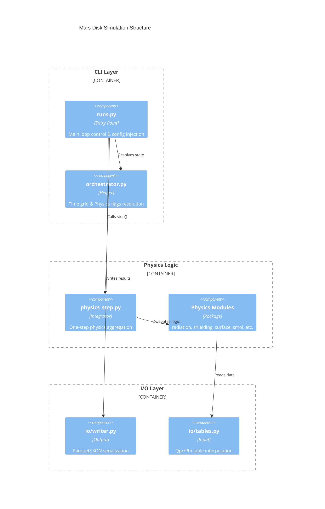

> **文書種別**: 解説（Diátaxis: Explanation）

## 0. ドキュメント指針
- `analysis/overview.md`（本書）はアーキテクチャや仕様の「解説」に位置付け、同系列で `analysis/run-recipes.md` を「手順」、`analysis/equations.md` を「リファレンス」とする Diátaxis 分類を明示した。各ファイル先頭に文書種別メタデータを挿入し、読者が用途別に資料を切り替えられるようにした。
- **物理計算フローの視覚化**は `analysis/physics_flow.md` に Mermaid 形式のシーケンス図・フローチャートを集約し、モジュール間依存と計算順序を一目で把握できるようにした。
- **変数命名ガイドライン**は `analysis/glossary.md` を拡充し、略語一覧・単位規約・接頭辞/接尾辞の意味を体系化した。
- 重要な設計判断は `analysis/adr/` 以下の Architecture Decision Record (ADR) シリーズで管理する。第1号として `analysis/adr/0001-choose-solver.md` に IMEX-BDF(1) 採用理由と影響範囲を記録し、将来の solver/physics 切り替え議論のたたき台にする。
- 要求→設計→式→テスト→成果物を一表で紐づける要求トレーサビリティマトリクス (RTM) を `analysis/traceability/rtm.csv` に追加し、CI やレビュー時に仕様充足状況を即座に確認できるようにした。
- ドキュメントとコードの整合性は `marsdisk/ops/doc_sync_agent.py` によって維持され、`ensure_equation_ids` が式番号を管理する。[marsdisk/ops/doc_sync_agent.py#main [L2282–L2287]][marsdisk/ops/doc_sync_agent.py#ensure_equation_ids [L1342–L1400]]
- リリースノートと変更履歴は `analysis/CHANGELOG.md` に集約し、DocSyncAgent の対象に含めて参照切れやパス揺れを防ぐ。
- 仮定→式のひも付けはフェーズ1のスケルトン `analysis/assumption_trace.md` にまとめ、未確定の式は `TODO(REF:slug)` と `analysis/UNKNOWN_REF_REQUESTS.jsonl` で管理する。

## 1. 目的と範囲
> **注記（gas‑poor）**: 本解析は **ガスに乏しい衝突起源デブリ円盤**を前提とします。従って、**光学的に厚いガス円盤**を仮定する Takeuchi & Lin (2003) の表層塵アウトフロー式は**適用外**とし、既定では評価から外しています（必要時のみ明示的に有効化）。この判断は、衝突直後の円盤が溶融主体かつ蒸気≲数%で、初期周回で揮発が散逸しやすいこと、および小衛星を残すには低質量・低ガスの円盤条件が要ることに基づきます。参考: Hyodo et al. 2017; 2018／Canup & Salmon 2018。
- 0D円盤で破砕生成による`prod_subblow_area_rate`と表層剥離による`M_out_dot`を時間発展させ、累積損失を summary の`M_loss`と時系列の`mass_lost_by_*`で記録する。[marsdisk/schema.py#Geometry [L24–L44]][marsdisk/run_zero_d.py#run_zero_d [L316–L5180]]
- 形成・生存制約はリング拡散の遅速により衛星列の質量シーケンスが変わること（遅:多数・外側ほど重い、速:単一巨大衛星）と、Phobos/Deimos を残すには **$M_{\rm disk}\le3\times10^{-5}M_{\rm Mars}$ 且つ $(Q/k_2)<80$** が必要という条件を踏まえて初期質量と tidal パラメータを設定する。[\@CridaCharnoz2012_Science338_1196; @CanupSalmon2018_SciAdv4_eaar6887]
- CLI経由で呼ばれる`run_zero_d`がYAMLを読み、放射・遮蔽テーブルやPSDを初期化したうえで表層面密度を積分し、出力に書き出す。[marsdisk/run_zero_d.py#run_zero_d [L316–L5180]]
- 将来の半径1D拡張に備えてケプラー格子と粘性拡散の骨組みを保持するが、現行は0D主導である。[marsdisk/grid.py#omega_kepler [L17–L33]][marsdisk/physics/viscosity.py#step_viscous_diffusion_C5 [L58–L141]]

## 1.1 モジュール構成の3層分離
`marsdisk/run.py` は以下の3層に論理分割されている（詳細は `analysis/physics_flow.md` 参照）：




| 層 | モジュール | 責務 |
|----|-----------|------|
| **オーケストレータ** | `orchestrator.py` | 設定解決・時間グリッド・ループ制御・進捗報告 |
| **物理ステップ** | `physics_step.py` | 1ステップの放射→遮蔽→昇華→表層計算 |
| **I/O** | `io/writer.py`, `io/tables.py` | Parquet/JSON/CSV 出力、テーブル読込 |

計算フローの結合順序は AGENTS.md で規定：
```text
⟨Q_pr⟩ → β → a_blow → sublimation ds/dt → τ & Φ → surface sink fluxes
```


## 2. 全体アーキテクチャ
- CLI層は`argparse`で`--config`を受け取ると同時に、オプションの`--override path=value`を複数解釈してYAML辞書にマージしたうえで`load_config`を通じて設定を生成する。[marsdisk/run_zero_d.py#load_config [L258–L280]][marsdisk/run_zero_d.py#main [L5183–L5299]]
- 設定層はPydanticモデルで幾何、物性、数値制御を検証しつつ`Config`にまとめる。[marsdisk/schema.py#Shielding [L1491–L1549]][marsdisk/schema.py#IO [L1908–L1946]]
- 物理層は`marsdisk.physics`サブパッケージの各モジュールを再公開し、放射、遮蔽、Smoluchowski、表層モデルを提供する。[marsdisk/physics/__init__.py#__module__ [L1–L38]]
- 火星放射源は `mars_temperature_driver` を経由して時刻依存の T_M を供給し、`radiation`/`sinks`/`sizes` が参照する。ドライバは `marsdisk/physics/tempdriver.py` の `resolve_temperature_driver` で実体化され、`run_zero_d` のサイクルごとに評価される。[marsdisk/physics/tempdriver.py#_write_temperature_table [L212–L241]][marsdisk/runtime/legacy_steps.py#RunState [L39–L45]]
- 放射圧のスイッチは `radiation.source∈{"mars","off","none"}` に制限され、Pydantic と `run_zero_d` の双方でバリデーションすることで太陽放射経路や未定義ソースを受け付けない。`source="none"` は内部で `"off"` に正規化され、Mars-only 探査の要件を守ったまま放射圧を無効化できる。[marsdisk/schema.py#Supply [L450–L556]][marsdisk/run_zero_d.py#run_zero_d [L316–L5180]]
- 物理スイッチは段階実装・代替物理のテスト・不確実パラメータのスタディに限定して許容し、それ以外のトグルは火星環境の本線モデルには不要として将来的な削除対象に位置づける。
- Φテーブルは `shielding.table_path` を優先的に解決し、旧 `phi_table` や `mode=table` 指定は `mode_resolved` で `psitau` に正規化してからロードする。[marsdisk/schema.py#Sizes [L601–L634]][marsdisk/physics/shielding.py#load_phi_table [L53–L68]]
- 相判定は `marsdisk/physics/phase.py` の `PhaseEvaluator` が温度・圧力・遮蔽後のτを受け、マップ（`siO2_cooling_map.lookup_phase_state`）か閾値フォールバックで `phase_state∈{solid,vapor}` と蒸気分率 `f_vap` を返す。判定は各タイムステップで一度だけ実行され、その結果で `sink_selected∈{rp_blowout,hydro_escape,none}` と `t_sink` が固定されるため、同一ステップ内でブローアウトと流体力学的散逸が重複することはない。[marsdisk/physics/phase.py#PhaseEvaluator [L82–L591]][marsdisk/run_zero_d.py#run_zero_d [L316–L5180]]

## 3. データフロー（設定 → 実行 → 物理モジュール → 出力）
- 設定読み込み後に半径`r`と角速度を確定し、放射圧テーブル読み込みやブローアウトサイズ`a_blow`と`s_min`の初期化を行う。[marsdisk/run_zero_d.py#run_zero_d [L316–L5180]]
- `dynamics.e_profile` を評価して `e0` を上書き（0D）し、1D ではセルごとの `e_value` として使う。`run_config.json` の `init_ei` に `e_profile_*` と `e0_applied` を残す。[marsdisk/physics/eccentricity.py:29–98][marsdisk/run_zero_d.py:4600–4670][marsdisk/run_one_d.py:207–260]
- 既定の軌道量は `omega` と `v_kepler` が返し、角速度と周速度を `runtime_orbital_radius_m` から導出する。[marsdisk/grid.py#omega [L94–L95]][marsdisk/grid.py#v_kepler [L36–L52]]
- 各ステップで `mars_temperature_driver` が時刻`t`の火星温度を返し、Planck平均⟨Q_pr⟩・β・`a_blow`・`grain_temperature_graybody` へ伝播する。温度時系列は `run.parquet` の `T_M_used`/`rad_flux_Mars`/`Q_pr_at_smin`/`beta_at_smin_config`/`beta_at_smin_effective`/`a_blow_at_smin` に記録される。[marsdisk/run_zero_d.py#run_zero_d [L316–L5180]][marsdisk/physics/sinks.py#total_sink_timescale [L83–L160]][marsdisk/physics/radiation.py#grain_temperature_graybody [L219–L245]]
- `summary.json` では `T_M_min`/`T_M_median`/`T_M_max` と `beta_at_smin_config`,`beta_at_smin_min`,`beta_at_smin_median`,`beta_at_smin_max` を統計として保持する。[marsdisk/run_zero_d.py#run_zero_d [L316–L5180]]
- 相分岐は遮蔽計算で得た `tau_mars_line_of_sight` を `PhaseEvaluator` に渡して `phase_state` を決定し、`solid` のときはブローアウト（`sink_selected="rp_blowout"`）、`vapor` のときは水素流体逃亡のスケーリング `hydro_escape_timescale` を `surface.step_surface` のシンクとして適用する。評価結果は `run.parquet`/`diagnostics.parquet` の `phase_state`/`phase_f_vap`/`sink_selected`/`tau_gate_blocked`/`tau_los_mars` に保存し、`summary.json` では `phase_branching` と `radiation_tau_gate` の両ブロックで集計する。[marsdisk/physics/phase.py#hydro_escape_timescale [L594–L623]][marsdisk/run_zero_d.py#run_zero_d [L316–L5180]][marsdisk/run_zero_d.py#run_zero_d [L316–L5180]]
- `s_min_components` には `config`,`blowout`(raw),`blowout_raw`,`blowout_effective`,`effective`,`floor_dynamic` を保持し、`s_blow_m` は raw、旧来の床クリップ値は `s_blow_m_effective` に分離する。`radiation.freeze_kappa` がPlanck平均κを初期値で固定、`surface.freeze_sigma` が表層密度を初期値で保つ。`blowout.enabled=false` では `Σ_surf Ω` を抑制し、`shielding.mode∈{"psitau","fixed_tau1","off"}` がΦテーブル適用／一定τ／遮蔽無効を切り替える。昇華侵食量は `mass_lost_sublimation_step` と `dSigma_dt_sublimation` で診断し、任意の `sizes.evolve_min_size=true` は床を変更せず `s_min_evolved` を追跡する。[marsdisk/run_zero_d.py#run_zero_d [L316–L5180]][marsdisk/run_zero_d.py#run_zero_d [L316–L5180]][marsdisk/physics/psd.py#apply_uniform_size_drift [L385–L523]][marsdisk/physics/surface.py#step_surface_density_S1 [L110–L192]]
- `sinks.mode` が `"sublimation"` の場合は昇華・ガス抗力を考慮した `t_sink` を `sinks.total_sink_timescale` で計算し、`"none"` の場合は `t_sink=None` を渡して IMEX の追加損失項を無効化する。`sub_params.mass_conserving=true` を併用すると昇華 ds/dt は粒径のみを縮小し、blowout サイズを跨いだ分だけをブローアウト損失へ振り替える（`M_sink_dot` は 0 を維持）。[marsdisk/schema.py#Surface [L964–L979]][marsdisk/run_zero_d.py#run_zero_d [L316–L5180]][marsdisk/physics/collisions_smol.py#step_collisions_smol_0d [L812–L1258]][marsdisk/physics/surface.py#step_surface_density_S1 [L110–L192]]
- コールグラフ（`run_zero_d → step_surface → total_sink_timescale → mass_flux_hkl → s_sink_from_timescale`）と gas-poor 既定でのフラグ伝播は `analysis/sinks_callgraph.md` に mermaid 図付きで整理し、`ALLOW_TL2003=false` のまま感度試験時に参照する。
- `siO2_disk_cooling/siO2_cooling_map.py` の熱史マップは (E.042)/(E.043) の解析解で火星表面温度と粒子温度を評価し、Hyodo et al. (2018) の放射冷却スケーリング（式2–6）を直接適用して β 閾値と IR 加熱の境界を可視化する。`python -m siO2_disk_cooling.siO2_cooling_map --plot-mode phase` で固体分率マップ（青=固体、赤=蒸気）を描画でき、`--cell-width-Rmars` 未指定なら隣接の `configs/base.yml` などから `disk.geometry.r_in_RM`/`r_out_RM`/`n_cells` を読んでセル幅を自動推定する。[\@Hyodo2018_ApJ860_150]
- 化学シンクは気相凝縮と溶融固化物の化学差（Pignatale et al. 2018）と外縁ガス包絡での凝縮スペクトル（Ronnet et al. 2016）を根拠に、HKL 昇華フラックスと `s_sink_from_timescale` の係数を設定する。[\@Pignatale2018_ApJ853_118; @Ronnet2016_ApJ828_109]
- 昇華シンク時間は `s_sink_from_timescale` が返す「1公転で消える粒径」`s_{\rm sink}` から `t_{\rm sink}=t_{\rm orb}(s_{\rm ref}/s_{\rm sink})` を再構成し、`Φ \le 0` ではシンクを無効化する。[marsdisk/physics/sinks.py#total_sink_timescale [L83–L160]][marsdisk/physics/radiation.py#grain_temperature_graybody [L219–L245]]
- 得られたフラックスと質量収支を逐次蓄積し、Parquet/JSON/CSVに書き出す際に `F_abs`,`sigma_surf`,`kappa_Planck`,`tau_eff`,`psi_shield`,`s_peak`,`M_out_cum` などの診断列を追加し、`dt_over_t_blow` や `fast_blowout_factor = 1 - \exp(-Δt/t_{\rm blow})`、昇華侵食項 `dSigma_dt_sublimation`／`mass_lost_sinks_step` を併記する。Summary には `mass_budget_max_error_percent` と `dt_over_t_blow_median` が追記され、`orbit_rollup.csv` は `mass_loss_frac_per_orbit` や累積損失も含めて更新される (`numerics.orbit_rollup=false` で抑制可)。`chi_blow` が `"auto"` の場合は β と ⟨Q_pr⟩ に基づく 0.5–2.0 の推定値 `chi_blow_eff` が出力され、`t_{\rm blow} = chi_blow_eff/Ω` として用いられる。[marsdisk/run_zero_d.py#run_zero_d [L316–L5180]][marsdisk/run_zero_d.py#run_zero_d [L316–L5180]][marsdisk/run_zero_d.py#run_zero_d [L316–L5180]][marsdisk/io/writer.py#write_parquet [L24–L395]]

## 4. 主要モジュール別の責務と依存
- `marsdisk/run.py`はPSD、放射、破片、供給、遮蔽、シンク各モジュールをインポートし、`run_zero_d`内で順に呼び出して時間積分とファイル出力を実行する。主要関数として `load_config` が YAML を解析し、`main` が CLI エントリポイント、`step` が1ステップ処理、`run_n_steps` がループ制御を担う。`compute_phase_tau_fields` は相判定用のτフィールドを担当する。[marsdisk/run_zero_d.py#run_zero_d [L316–L5180]][marsdisk/run_zero_d.py#load_config [L258–L280]][marsdisk/run_zero_d.py#main [L5183–L5299]][marsdisk/runtime/legacy_steps.py#step [L48–L90]][marsdisk/runtime/legacy_steps.py#run_n_steps [L93–L111]][marsdisk/runtime/helpers.py#compute_phase_tau_fields [L8–L19]]
- `marsdisk/grid.py`は `omega_kepler` と `v_kepler` を公開し、指定半径からケプラー角速度と周速度を取得する共通ユーティリティとなる。[marsdisk/grid.py#omega_kepler [L17–L33]][marsdisk/grid.py#v_kepler [L36–L52]]
- `marsdisk/config_utils.py` は設定解決のヘルパーを提供し、`ensure_disk_geometry` がジオメトリ検証、`resolve_reference_radius` が代表半径、`resolve_temperature_field` が温度フィールド解決を担う。[marsdisk/config_utils.py#ensure_disk_geometry [L44–L55]][marsdisk/config_utils.py#resolve_reference_radius [L18–L41]][marsdisk/config_utils.py#resolve_temperature_field [L58–L67]]
- `marsdisk/runtime/helpers.py` はオーケストレータ層から利用する共通ユーティリティをまとめ、κを有限・非負にクリップする `ensure_finite_kappa`、Parquet出力向けの `safe_float` と `float_or_nan`、ログ短縮化の `format_exception_short`、フェーズ診断マーカー `log_stage`、Φゲート係数の `compute_gate_factor`、τフィードバックの正規化 `resolve_feedback_tau_field` を提供する。[marsdisk/runtime/helpers.py#ensure_finite_kappa [L57–L67]][marsdisk/runtime/helpers.py#safe_float [L70–L79]][marsdisk/runtime/helpers.py#float_or_nan [L82–L89]][marsdisk/runtime/helpers.py#format_exception_short [L92–L96]][marsdisk/runtime/helpers.py#log_stage [L99–L107]][marsdisk/runtime/helpers.py#compute_gate_factor [L35–L54]][marsdisk/runtime/helpers.py#resolve_feedback_tau_field [L22–L32]]
- `marsdisk/config_validator.py` は設定の検証を担当し、`validate_config` がスキーマ検証、`load_and_validate` がロード＋検証の一括処理を提供する。[marsdisk/config_validator.py#validate_config [L71–L96]][marsdisk/config_validator.py#load_and_validate [L429–L450]][marsdisk/config_validator.py#main [L456–L507]]
- `marsdisk/orchestrator.py` はオーケストレーション層のヘルパーを提供し、`resolve_time_grid` が時間グリッド、`resolve_orbital_radius` が軌道半径、`resolve_physics_flags` が物理スイッチを解決する。[marsdisk/orchestrator.py#resolve_time_grid [L210–L306]][marsdisk/orchestrator.py#resolve_orbital_radius [L313–L317]][marsdisk/orchestrator.py#resolve_physics_flags [L320–L405]]
- `marsdisk/physics_step.py` は1ステップの物理計算を統合し、`compute_radiation_parameters` が放射パラメータ、`compute_shielding` が遮蔽、`compute_sublimation` が昇華、`step_surface_layer` が表層更新、`fast_blowout_correction_factor` が高速ブローアウト補正、`compute_gate_factor` がゲート係数を計算する。[marsdisk/physics_step.py#compute_radiation_parameters [L157–L212]][marsdisk/physics_step.py#compute_shielding [L219–L315]][marsdisk/physics_step.py#compute_sublimation [L322–L376]][marsdisk/physics_step.py#step_surface_layer [L383–L459]][marsdisk/physics_step.py#fast_blowout_correction_factor [L466–L487]][marsdisk/physics_step.py#compute_gate_factor [L490–L526]]
- `marsdisk/physics/psd.py`は三勾配と"wavy"補正でPSD状態を構築し、不透明度`kappa`を計算して`run_zero_d`に供給する。`sanitize_and_normalize_number` が数密度正規化、`mass_weights_lognormal_mixture` と `mass_weights_truncated_powerlaw` が質量重み、`apply_mass_weights` が重み適用、`apply_uniform_size_drift` がサイズドリフト、`evolve_min_size` が最小サイズ進化を担う。[marsdisk/physics/psd.py#compute_kappa [L202–L235]][marsdisk/physics/psd.py#sanitize_and_normalize_number [L156–L199]][marsdisk/physics/psd.py#mass_weights_lognormal_mixture [L238–L278]][marsdisk/physics/psd.py#mass_weights_truncated_powerlaw [L281–L312]][marsdisk/physics/psd.py#apply_mass_weights [L315–L357]][marsdisk/physics/psd.py#apply_uniform_size_drift [L385–L523]][marsdisk/physics/psd.py#evolve_min_size [L526–L618]]
- `marsdisk/physics/radiation.py`は平均`Q_pr`や放射圧比`beta`、ブローアウト半径を算出し、テーブル読み込みを`io.tables`に委ねる。`load_qpr_table` が⟨Q_pr⟩テーブル読込を担い、`configure_qpr_cache` が⟨Q_pr⟩メモ化の有効/容量/丸め許容を切り替える。[marsdisk/physics/radiation.py#blowout_radius [L482–L526]][marsdisk/physics/radiation.py#beta [L458–L479]][marsdisk/physics/radiation.py#load_qpr_table [L248–L277]][marsdisk/physics/radiation.py#configure_qpr_cache [L184–L192]]
- `marsdisk/physics/qstar.py` は破壊閾値 $Q_D^*$ の計算を提供し、`compute_q_d_star_F1` が単一値、`compute_q_d_star_array` が配列入力版、`get/set/reset_velocity_clamp_stats` が速度クランプ統計、`get/set_gravity_velocity_mu` が重力項μを管理し、`get/set_coeff_unit_system` が係数単位系（ba99_cgs/si）、`get_coefficient_table` が係数テーブル取得を担う。[marsdisk/physics/qstar.py#compute_q_d_star_F1 [L387–L461]][marsdisk/physics/qstar.py#compute_q_d_star_array [L287–L384]][marsdisk/physics/qstar.py#get_velocity_clamp_stats [L174–L178]][marsdisk/physics/qstar.py#set_gravity_velocity_mu [L181–L190]][marsdisk/physics/qstar.py#reset_velocity_clamp_stats [L165–L171]][marsdisk/physics/qstar.py#get_gravity_velocity_mu [L193–L196]][marsdisk/physics/qstar.py#get_coeff_unit_system [L102–L105]][marsdisk/physics/qstar.py#set_coeff_unit_system [L90–L99]][marsdisk/physics/qstar.py#get_coefficient_table [L108–L111]]
- `marsdisk/physics/fragments.py` は衝突破片を計算し、`compute_largest_remnant_mass_fraction_F2` が最大残存率、`compute_s_min_F2` が最小径、`s_sub_boundary` が昇華境界を担う。[marsdisk/physics/fragments.py#compute_largest_remnant_mass_fraction_F2 [L118–L157]][marsdisk/physics/fragments.py#compute_s_min_F2 [L229–L260]][marsdisk/physics/fragments.py#s_sub_boundary [L160–L226]]
- `marsdisk/physics/collisions_smol.py` は Smoluchowski 衝突積分を提供し、`step_collisions_smol_0d` がメイン積分、`supply_mass_rate_to_number_source` が供給→数密度変換、`kernel_minimum_tcoll` が最短衝突時間、`compute_kernel_ei_state` がカーネル状態、`compute_kernel_e_i_H` がe,i,Hパラメータを計算する。`CollisionStepContext` を受け取って Smol ステップに値を流し込む薄いラッパとして `step_collisions` を置き、physics_step からの呼び出しを整理した。エネルギー簿記モードでは `collide.compute_collision_kernel_bookkeeping` が NumPy/Numba を切り替えつつ衝突カーネルとエネルギー統計を返す。[marsdisk/physics/collisions_smol.py#step_collisions_smol_0d [L812–L1258]][marsdisk/physics/collisions_smol.py#supply_mass_rate_to_number_source [L186–L303]][marsdisk/physics/collisions_smol.py#kernel_minimum_tcoll [L503–L534]][marsdisk/physics/collisions_smol.py#compute_kernel_ei_state [L587–L635]][marsdisk/physics/collisions_smol.py#compute_kernel_e_i_H [L691–L768]][marsdisk/physics/collisions_smol.py#step_collisions [L771–L809]][marsdisk/physics/collide.py#compute_collision_kernel_bookkeeping [L212–L357]]
- `marsdisk/physics/smol.py` は Smoluchowski IMEX-BDF(1) を実装し、`step_imex_bdf1_C3` が時刻更新、`compute_mass_budget_error_C4` が質量誤差評価を担う。[marsdisk/physics/smol.py#step_imex_bdf1_C3 [L261–L437]][marsdisk/physics/smol.py#compute_mass_budget_error_C4 [L440–L504]]
- `marsdisk/physics/sublimation.py` は昇華計算を提供し、`p_sat` が飽和蒸気圧、`p_sat_clausius` が Clausius–Clapeyron、`p_sat_tabulated` がテーブル補間、`choose_psat_backend` がバックエンド選択、`s_sink_from_timescale` がシンクサイズ、`sublimation_sink_from_dsdt` が ds/dt からのシンク変換を担う。[marsdisk/physics/sublimation.py#p_sat [L590–L605]][marsdisk/physics/sublimation.py#p_sat_clausius [L186–L206]][marsdisk/physics/sublimation.py#p_sat_tabulated [L417–L431]][marsdisk/physics/sublimation.py#choose_psat_backend [L434–L557]][marsdisk/physics/sublimation.py#s_sink_from_timescale [L669–L684]][marsdisk/physics/sublimation.py#sublimation_sink_from_dsdt [L687–L735]]
- `marsdisk/physics/supply.py` は外部供給を管理し、`init_runtime_state` がランタイム状態初期化、`evaluate_supply` が供給率評価、`split_supply_with_deep_buffer` が深層バッファ分割、`get_prod_area_rate` が面積率取得を担う。[marsdisk/physics/supply.py#init_runtime_state [L219–L274]][marsdisk/physics/supply.py#evaluate_supply [L310–L403]][marsdisk/physics/supply.py#split_supply_with_deep_buffer [L406–L517]][marsdisk/physics/supply.py#get_prod_area_rate [L520–L524]]
- `marsdisk/physics/surface.py` は表層モデルを提供し、`wyatt_tcoll_S1` が Wyatt 衝突時間、`step_surface_density_S1` が表層密度更新、`compute_surface_outflux` が外向流束、`step_surface` が統合ステップを担う。[marsdisk/physics/surface.py#wyatt_tcoll_S1 [L76–L87]][marsdisk/physics/surface.py#step_surface_density_S1 [L110–L192]][marsdisk/physics/surface.py#compute_surface_outflux [L217–L226]][marsdisk/physics/surface.py#step_surface [L229–L263]]
- `marsdisk/physics/sinks.py` はシンク計算を提供し、`gas_drag_timescale` がガス抗力時間、`total_sink_timescale` が合成シンク時間を担う。[marsdisk/physics/sinks.py#gas_drag_timescale [L70–L80]][marsdisk/physics/sinks.py#total_sink_timescale [L83–L160]]
- `marsdisk/physics/shielding.py`はΦテーブルを解釈し有効不透明度と`Sigma_tau1`を返す。`apply_shielding` が遮蔽適用を担う。[marsdisk/physics/shielding.py#apply_shielding [L134–L217]]
- `marsdisk/physics/sizes.py` は粒径計算のユーティリティを提供し、`eval_ds_dt_sublimation` が昇華による ds/dt を評価する。[marsdisk/physics/sizes.py#eval_ds_dt_sublimation [L11–L29]]
- `marsdisk/physics/viscosity.py` は粘性拡散を提供し、`step_viscous_diffusion_C5` が C5 演算子分割ステップを担う。[marsdisk/physics/viscosity.py#step_viscous_diffusion_C5 [L58–L141]]
- `marsdisk/physics/phase.py` は相判定を提供し、`particle_temperature_equilibrium` が粒子平衡温度、`hydro_escape_timescale` が水素流体逃亡時間を計算する。[marsdisk/physics/phase.py#particle_temperature_equilibrium [L54–L79]][marsdisk/physics/phase.py#hydro_escape_timescale [L594–L623]]
- `marsdisk/physics/tempdriver.py` は温度ドライバを提供し、`resolve_temperature_driver` がドライバ解決、`ensure_temperature_table` がテーブル確保、`cooling_time_seconds` が冷却時間、`estimate_time_to_temperature` が温度到達時間推定、`autogenerate_temperature_table_if_needed` が自動生成、`estimate_autogen_horizon_years` が自動生成ホライズンを担う。[marsdisk/physics/tempdriver.py#resolve_temperature_driver [L383–L480]][marsdisk/physics/tempdriver.py#ensure_temperature_table [L244–L294]][marsdisk/physics/tempdriver.py#cooling_time_seconds [L155–L171]][marsdisk/physics/tempdriver.py#estimate_time_to_temperature [L315–L380]][marsdisk/physics/tempdriver.py#autogenerate_temperature_table_if_needed [L483–L562]][marsdisk/physics/tempdriver.py#estimate_autogen_horizon_years [L565–L606]]
- `marsdisk/io/tables.py`はPlanck平均⟨Q_pr⟩を `interp_qpr` で補間し、感度試験では `load_qpr_table` が外部テーブルを読み込んで補間器を更新する。また、`interp_phi` は自遮蔽係数テーブルの補間、`get_qpr_table_path` がテーブルパス取得を提供する。[marsdisk/io/tables.py#interp_qpr [L366–L377]][marsdisk/io/tables.py#load_qpr_table [L390–L402]][marsdisk/io/tables.py#interp_phi [L380–L387]][marsdisk/io/tables.py#get_qpr_table_path [L484–L487]]
- `marsdisk/io/checkpoint.py`は長時間シミュレーションの途中再開を可能にするチェックポイント機構を提供する。`save_checkpoint` がチェックポイント保存、`find_latest_checkpoint` が最新チェックポイント探索、`load_checkpoint` が読み込み、`prune_checkpoints` が古いチェックポイント削除を担う。[marsdisk/io/checkpoint.py#save_checkpoint [L65–L86]][marsdisk/io/checkpoint.py#find_latest_checkpoint [L119–L127]][marsdisk/io/checkpoint.py#load_checkpoint [L89–L116]][marsdisk/io/checkpoint.py#prune_checkpoints [L130–L144]]
- `marsdisk/io/writer.py` は出力を担当し、`write_summary` が集計JSON、`write_run_config` が設定JSON、`write_mass_budget` が質量収支CSV、`append_csv` が追記、`write_orbit_rollup` が公転要約、`write_step_diagnostics` と `append_step_diagnostics` がステップ診断を担う。補助として `io/diagnostics.py` が `write_zero_d_history` と `safe_float` を提供する。[marsdisk/io/writer.py#write_summary [L398–L406]][marsdisk/io/writer.py#write_run_config [L409–L414]][marsdisk/io/writer.py#write_mass_budget [L417–L421]][marsdisk/io/writer.py#append_csv [L424–L440]][marsdisk/io/writer.py#write_orbit_rollup [L443–L451]][marsdisk/io/writer.py#write_step_diagnostics [L454–L474]][marsdisk/io/writer.py#append_step_diagnostics [L477–L502]][marsdisk/io/diagnostics.py#write_zero_d_history [L28–L128]][marsdisk/io/diagnostics.py#safe_float [L16–L25]]
- `io.streaming` は既定で ON（`enable=true`, `memory_limit_gb=10`, `step_flush_interval=10000`, `merge_at_end=true`, `cleanup_chunks=true`）。`cleanup_chunks=false` でチャンクを残す。`FORCE_STREAMING_OFF=1` か `IO_STREAMING=off` を環境に与えると config より優先して無効化し、ストリーミング経路でも最終 flush/merge 後に `checks/mass_budget.csv` を残す。`summary["streaming"]` には env トグルや merge 状態を記録する。[marsdisk/schema.py#Streaming [L1767–L1811]][marsdisk/run.py:8–8][marsdisk/run.py:8–8][marsdisk/run.py:8–8]
- `marsdisk/ops/doc_sync_agent.py` はドキュメント同期を提供し、`ensure_equation_ids` が式番号管理、`main` が CLI エントリポイントを担う。[marsdisk/ops/doc_sync_agent.py#ensure_equation_ids [L1342–L1400]][marsdisk/ops/doc_sync_agent.py#main [L2282–L2287]]
- `marsdisk/ops/make_qpr_table.py` は ⟨Q_pr⟩ テーブル生成を提供し、`compute_planck_mean_qpr` が計算、`main` が CLI を担う。また、SiO₂ キャリブレーション版は `marsdisk/ops/make_qpr_table_sio2_abbas_calibrated_lowT_csv.py` と `marsdisk/ops/make_qpr_table_sio2_csv.py` に格納される。[marsdisk/ops/make_qpr_table.py#compute_planck_mean_qpr [L40–L78]][marsdisk/ops/make_qpr_table.py#main [L120–L141]][marsdisk/ops/make_qpr_table_sio2_abbas_calibrated_lowT_csv.py#compute_planck_mean_qpr [L102–L123]][marsdisk/ops/make_qpr_table_sio2_abbas_calibrated_lowT_csv.py#main [L135–L178]][marsdisk/ops/make_qpr_table_sio2_csv.py#compute_planck_mean_qpr [L84–L109]][marsdisk/ops/make_qpr_table_sio2_csv.py#main [L112–L135]]
- `marsdisk/ops/physcheck.py` は物理チェックを提供し、`run_checks` が検証実行、`main` が CLI を担う。[marsdisk/ops/physcheck.py#run_checks [L181–L189]][marsdisk/ops/physcheck.py#main [L206–L218]]
- `marsdisk/ops/assumption_trace.py` は仮定トレースを提供し、`load_equation_index` が式インデックス読込、`parse_equations_md` がパース、`build_assumption_trace` がトレース構築、`write_jsonl` と `write_markdown` が出力、`main` が CLI を担う。[marsdisk/ops/assumption_trace.py#load_equation_index [L38–L53]][marsdisk/ops/assumption_trace.py#parse_equations_md [L222–L229]][marsdisk/ops/assumption_trace.py#build_assumption_trace [L232–L261]][marsdisk/ops/assumption_trace.py#write_jsonl [L264–L270]][marsdisk/ops/assumption_trace.py#write_markdown [L273–L294]][marsdisk/ops/assumption_trace.py#main [L323–L328]]
- `marsdisk/analysis/beta_sampler.py` は β マップ生成を提供し、`sample_beta_over_orbit` が r×T グリッドを並列掃引する。[marsdisk/analysis/beta_sampler.py#sample_beta_over_orbit [L234–L348]]
- `marsdisk/analysis/massloss_sampler.py` は質量損失サンプリングを提供し、`sample_mass_loss_one_orbit` が単一点の 0D 実行を包む。[marsdisk/analysis/massloss_sampler.py#sample_mass_loss_one_orbit [L110–L259]]
- `marsdisk/analysis/inner_disk_runner.py` は内側ロッシュ円盤実行を提供し、`run_inner_disk_case` が単一ケース、`run_inner_disk_sweep` がスイープ、`save_massloss_table` がテーブル保存、`main` が CLI を担う。[marsdisk/analysis/inner_disk_runner.py#run_inner_disk_case [L244–L288]][marsdisk/analysis/inner_disk_runner.py#run_inner_disk_sweep [L291–L315]][marsdisk/analysis/inner_disk_runner.py#save_massloss_table [L318–L321]][marsdisk/analysis/inner_disk_runner.py#main [L368–L384]]

## 5. 設定スキーマ（主要キー）
| キー | 型 | 既定値 | 許容範囲 or 選択肢 | 出典 |
| --- | --- | --- | --- | --- |
| config | Config | 必須 | トップレベルで全セクションを保持 | [marsdisk/schema.py#IO [L1908–L1946]] |
| geometry | Geometry | mode="0D" | mode∈{"0D","1D"}; 半径は任意入力 | [marsdisk/schema.py#Geometry [L24–L44]] |
| material | Material | rho=3000.0 | rho∈[1000,5000]kg/m³ | [marsdisk/schema.py#Material [L559–L571]] |
| temps (removed) | – | – | 旧 `temps.T_M` は無効化。`radiation.TM_K` または温度ドライバで必須入力を与える。 | [marsdisk/config_utils.py#ensure_disk_geometry [L44–L55]][marsdisk/schema.py#SupplyReservoir [L188–L230]] |
| sizes | Sizes | n_bins=40 | s_min,s_max必須; n_bins≥1 | [marsdisk/schema.py#Sizes [L601–L634]] |
| initial | Initial | s0_mode="upper" | mass_total必須; s0_mode∈{"mono","upper"} | [marsdisk/schema.py#Initial [L637–L709]] |
| dynamics | Dynamics | f_wake=1.0, e_profile.mode="mars_pericenter" | e0,i0,t_damp_orbits必須 | [marsdisk/schema.py:749–876] |
> **e_profile（既定）**: `dynamics.e_profile.mode="mars_pericenter"` は `e = 1 - R_MARS / r` を評価し、0Dでは `e0` を上書き、1Dではセルごとの `e_value` として保持する。`r <= R_MARS` は警告のうえ `e=0` にクランプされ、`clip_min`/`clip_max` が最後に適用される。[marsdisk/physics/eccentricity.py:29–98][marsdisk/run_zero_d.py:470–520][marsdisk/run_one_d.py:207–260]
> **互換モード**: `dynamics.e_profile.mode="off"` にすると `e0` をそのまま使い、`e_mode="mars_clearance"` を有効にできる（併用不可）。`mode="off"`/`"table"` は警告ログが出るレガシー経路。[marsdisk/schema.py:749–876][marsdisk/physics/eccentricity.py:29–90]
> **テーブル入力**: `mode="table"` は `r_RM` または `r_m` 列と `e` 列を持つ CSV を `table_path` で読み、`r_kind` で参照軸を選ぶ。[marsdisk/io/tables.py:252–280]
> **サンプリング（legacy）**: `dynamics.e_mode` と `dynamics.i_mode` に `mars_clearance` / `obs_tilt_spread` を指定すると、Δr・a・R_MARS をメートルで評価した `e = 1 - (R_MARS + Δr)/a` と、観測者傾斜 `obs_tilt_deg`（度）を中心にラジアン内部値 `i0` をサンプリングする。最小例:
> ```yaml
> dynamics:
>   e0: 0.1
>   i0: 0.05
>   t_damp_orbits: 1000.0
>   e_mode: mars_clearance
>   dr_min_m: 1.0
>   dr_max_m: 10.0
>   dr_dist: uniform
>   i_mode: obs_tilt_spread
>   obs_tilt_deg: 30.0
>   i_spread_deg: 5.0
>   rng_seed: 42
> ```
> **衝突カーネル用トグル**: `kernel_ei_mode` でカーネルに渡す e,i を (`config`: e0/i0 をそのまま, `wyatt_eq`: `solve_c_eq` から導出) 切替え、`kernel_H_mode` + `H_factor` で H≃i a スケールを調整する。[marsdisk/physics/collisions_smol.py:691–748]
| psd | PSD | wavy_strength=0.0 | alpha必須 | [marsdisk/schema.py#PSD [L934–L942]] |
| qstar | QStar | なし | Qs,a_s,B,b_g,v_ref_kms,coeff_units(ba99_cgs/si) | [marsdisk/schema.py#QStar [L883–L931]] |
| disk | Disk | なし | geometryにr_in_RM,r_out_RM必須 | [marsdisk/schema.py#Disk [L77–L83]] |
| inner_disk_mass | InnerDiskMass | use_Mmars_ratio=True | map_to_sigma="analytic"固定 | [marsdisk/schema.py#InnerDiskMass [L100–L119]] |
| surface | Surface | init_policy="clip_by_tau1" | use_tcoll∈{True,False} | [marsdisk/schema.py#Surface [L964–L979]] |
| supply | Supply | mode="const" | const/powerlaw/table/piecewise切替 | [marsdisk/schema.py#Supply [L450–L556]] |
| sinks | Sinks | enable_sublimation=True | sublimation/gas dragのON/OFFとρ_g | [marsdisk/schema.py#Sinks [L1148–L1169]] |
| radiation | Radiation | TM_K=None | Q_pr∈(0,∞)かつ0.5≤Q_pr≤1.5 | [marsdisk/schema.py#Radiation [L1424–L1488]] |
| shielding | Shielding | table_path=None | Φテーブル/legacy `phi_table` を `mode_resolved` で正規化 | [marsdisk/schema.py#Sizes [L601–L634]] |
| numerics | Numerics | safety=0.1; atol=1e-10; rtol=1e-6 | t_end_years,dt_init必須 | [marsdisk/schema.py#Numerics [L1610–L1732]] |
| io | IO | outdir="out", substep_fast_blowout=false | 出力先・高速ブローアウト補正 (`correct_fast_blowout`) に加えて、`substep_fast_blowout` と `substep_max_ratio` でステップ分割を制御 | [marsdisk/schema.py#Numerics [L1610–L1732]] |

主要パラメータの文献出典と標準値は `analysis/config_guide.md` の 3.1「パラメータ→参考文献クロスリスト」に集約しているので、根拠確認時はそちらを参照する。

**補足: 外部供給パラメータ μ の扱い**
- 無次元パラメータ $\mu$ は $\mu=\dot{\Sigma}_{\mathrm{prod}} t_{\mathrm{blow}} / \Sigma_{\tau=1}$ と定義し、(E.027a) で $R_{\mathrm{base}}$ に変換してから `supply.const.prod_area_rate_kg_m2_s` に焼き付ける。[analysis/equations.md#(E.027a)]  
- CLI `python -m tools.derive_supply_rate --mu <μ> --sigma-tau1 <Σ> --t-blow <t_blow>` で生成した YAML 断片を供給設定へ貼り付ける運用を既定とする。[tools/derive_supply_rate.py:75–215]
- 外部供給は `SupplyRuntimeState` がリザーバ残量・τフィードバック倍率・温度スケールを保持し、`evaluate_supply` が raw×`epsilon_mix` に温度・フィードバック・リザーバの各倍率を掛けて rate を返す。`run_zero_d` はこの結果を `prod_subblow_area_rate` へ流し込み、時系列に `supply_feedback_scale`/`supply_temperature_scale`/`supply_reservoir_remaining_Mmars` を出力、summary と run_config に統計・設定を記録する。有限リザーバーが有効な場合は `reservoir_mass_total_Mmars` と `supply_reservoir_depletion_time_s`/`reservoir_mass_used_Mmars` を保持し、枯渇時刻を追跡する。[marsdisk/physics/supply.py#init_runtime_state [L219–L274]][marsdisk/physics/supply.py#evaluate_supply [L310–L403]][marsdisk/run_zero_d.py#run_zero_d [L316–L5180]]
- `supply.transport` が `direct`/`deep_mixing` を切り替える。`deep_mixing` モードでは raw 供給を深部に一旦貯めて `t_mix_orbits` で表層へ戻し、`prod_rate_into_deep`・`deep_to_surf_flux_attempt`・`deep_to_surf_flux_applied` を run.parquet/diagnostics に記録する。`supply_visibility_factor = prod_rate_applied_to_surf/max(prod_rate_raw, eps)` と `supply_blocked_by_headroom`/`supply_mixing_limited` で「観測上の供給スイッチ」を可視化する。`deep_mixing` 有効時のみ run_config/summary に `supply_transport_mode`・`t_mix_orbits` と headroom gate が出力される（`direct` モードではこれらのフィールドは省略）。[marsdisk/schema.py#SupplyTransport [L323–L350]][marsdisk/physics/supply.py#split_supply_with_deep_buffer [L406–L517]][marsdisk/run_zero_d.py#run_zero_d [L316–L5180]]
- 供給専用の速度は `supply.injection.velocity` で inherit/fixed_ei/factor を選び、`blend_mode`（RMS/linear）と `weight_mode`（ΔΣ/(Σ+ΔΣ) か ΔΣ/Σ）で kernel 側 e/i と合成する。Smol カーネルは `e_kernel_base`/`e_kernel_supply`/`e_kernel_effective` とブレンド重み `supply_velocity_weight_w` を run.parquet/diagnostics に出力し、採用されたモード・パラメータは run_config の `supply.injection_velocity` に保存される。[marsdisk/schema.py#SupplyInjectionVelocity [L353–L393]][marsdisk/physics/collisions_smol.py#_supply_velocity_weight [L537–L545]][marsdisk/physics/collisions_smol.py#step_collisions_smol_0d [L812–L1258]][marsdisk/run_zero_d.py#run_zero_d [L316–L5180]]

## 6. 物理モデルの計算ステップの要約
- ⟨Q_pr⟩ は `planck_mean_qpr` がテーブル／指定値から取得し、外れ値は `qpr_lookup` 側でテーブル範囲へクランプしたうえで β・ブローアウト境界に渡す（R1–R3）。[marsdisk/physics/radiation.py#planck_mean_qpr [L444–L455]][marsdisk/physics/radiation.py#qpr_lookup [L280–L342]][marsdisk/physics/radiation.py#blowout_radius [L482–L526]]
- 粒径分布を `update_psd_state` で三勾配＋任意の“wavy”補正付きに構築し、その状態から不透明度 `\kappa` を計算する（PSD）。[marsdisk/physics/psd.py#update_psd_state [L62–L153]][marsdisk/physics/psd.py#compute_kappa [L202–L235]]
- 光学深度からΦテーブルを引いて有効不透明度とΣτ=1の上限を求める（Phi）。Φの 0–1 クランプと κ_eff の計算は `effective_kappa` が担い、`apply_shielding` が Στ=1 を返す。[marsdisk/physics/shielding.py#effective_kappa [L82–L121]][marsdisk/physics/shielding.py#apply_shielding [L134–L217]]
- τ=1 の表層面密度を近似して返す（光学的深さの定義に基づく）。[marsdisk/physics/shielding.py#sigma_tau1 [L124–L131]]
- 衝突破片（F2）は衝突エネルギー `q_r_array` から最大残存率 `largest_remnant_fraction_array` を評価し、legacy の `compute_s_min_F2` はブローアウト最小径の互換ヘルパーとして残している（現行は `max(s_min_cfg, a_blow)` で決定）。破壊閾値 $Q_D^*$ は `compute_q_d_star_F1` と配列入力版 `compute_q_d_star_array` を用いて **1–7 km/s の固定係数テーブル**で速度依存補間を行い、`coeff_units` で BA99 cgs（cm, g/cm^3, erg/g→J/kg; 既定）と SI の切替ができる。v<1 または v>7 km/s では係数 lookup を端点へクランプしつつ、重力項だけを LS09 型 $v^{-3\mu+2}$（`qstar.mu_grav`, 既定0.45）で外挿する。外挿発生回数は `run_config.qstar.velocity_clamp_counts` に記録する。相分岐は従来通り固体枝のみで衝突を走らせる。[marsdisk/physics/fragments.py#q_r_array [L44–L62]][marsdisk/physics/fragments.py#largest_remnant_fraction_array [L65–L83]][marsdisk/physics/fragments.py#compute_s_min_F2 [L229–L260]][marsdisk/physics/qstar.py#compute_q_d_star_array [L287–L384]]
- Strubbe–Chiang衝突寿命やシンク時間を組み込んだ表層ODEを暗示的に進めて外向流束とシンクを出力する（S1）。`surface.collision_solver="surface_ode"` を指定したときのみ用い、標準の Smol 経路とは診断精度が異なる点に留意する。[marsdisk/physics/surface.py#step_surface_density_S1 [L110–L192]][marsdisk/run_zero_d.py#run_zero_d [L316–L5180]]
- 飽和蒸気圧モデルのバックエンドを選ぶ（Clausius–Clapeyron／表引き）。[marsdisk/physics/sublimation.py#choose_psat_backend [L434–L557]]
- Smoluchowski IMEX-BDF(1)で内部PSDを更新し質量保存誤差を評価する（C3）。`collisions_smol` がソースベクトルやカーネルを構築して標準経路として呼び出す。[marsdisk/physics/collisions_smol.py:L1–L220][marsdisk/physics/smol.py#compute_mass_budget_error_C4 [L440–L504]] 供給フラックスは `s_min` 以上の最小ビンへ集約して数密度ソース `F_k` に変換し、質量一致を保証する。[marsdisk/physics/collisions_smol.py#supply_mass_rate_to_number_source [L186–L303]] カーネルから Wyatt 型の最短衝突時間を抽出するのは `kernel_minimum_tcoll` が担い、`surface.use_tcoll` 有効時のステップ制御に使う。[marsdisk/physics/collisions_smol.py#kernel_minimum_tcoll [L503–L534]] メインの Smol ステップは `step_collisions_smol_0d` が遮蔽クリップ後の Σ・供給・シンク・昇華項をまとめ、IMEX-BDF(1) に渡して更新後の PSD と質量誤差を返す。[marsdisk/physics/collisions_smol.py#step_collisions_smol_0d [L812–L1258]]
- Smol 方程式の時刻更新（剛性=陰／非剛性=陽の IMEX＋一次BDF）。[marsdisk/physics/smol.py#step_imex_bdf1_C3 [L261–L437]]
- 出力判定では `beta_at_smin_config` と `beta_threshold` を比較し、`case_status="blowout"`（閾値以上）、`"ok"`（閾値未満）、質量収支違反など例外時のみ `"failed"` として記録する。[marsdisk/physics/radiation.py#BLOWOUT_BETA_THRESHOLD [L58]][marsdisk/run_zero_d.py#run_zero_d [L316–L5180]]

### Smol (C3/C4) と表層ODE (S1) の扱い
- 標準経路は Smoluchowski IMEX-BDF(1)（C3/C4）。`collisions_smol` が PSD→数密度変換・遮蔽後 τ=1 クリップ・供給フラックスからのソースベクトル化・カーネル/破片分布生成・昇華/外部シンク合流を行い、`smol.step_imex_bdf1_C3` へ渡す。結果の `N_k` から `sigma_surf` を再構成し、ブローアウトゲート/fast blowout を適用して `outflux_surface`・`M_out_dot`・`mass_lost_by_*` を評価する。[marsdisk/physics/collisions_smol.py:L1–L220][marsdisk/physics/smol.py#step_imex_bdf1_C3 [L261–L437]]
- 旧来の表層ODE（S1）は Wyatt の 1/t_coll 近似による簡易モデルで、`surface.collision_solver="surface_ode"` を明示したときのみ使うレガシー経路。光学的に薄い近似で `step_surface_density_S1` が Σ を直接更新するため、標準モードとは診断精度が異なる点に留意する。[marsdisk/physics/surface.py:L120–L196]

## 7. 温度・放射の上書きと出力フィールド
- `T_M_used` は放射計算に採用された火星面温度で、`T_M_source` が `radiation.TM_K` / `mars_temperature_driver.constant` / `mars_temperature_driver.table` を区別する（`temps.T_M` は廃止）。[marsdisk/config_utils.py#ensure_disk_geometry [L44–L55]][marsdisk/physics/tempdriver.py#resolve_temperature_driver [L383–L480]][marsdisk/run_zero_d.py#run_zero_d [L316–L5180]]
- `mass_lost_by_blowout` は放射圧剥離による累積損失、`mass_lost_by_sinks` は昇華・ガス抗力による累積損失を示す。`sinks.mode="none"` では後者が全ステップで0になり、Smol 経路でも `checks/mass_budget.csv` の誤差0.5%以下が維持される。[marsdisk/run_zero_d.py#run_zero_d [L316–L5180]][marsdisk/run_zero_d.py#run_zero_d [L316–L5180]][marsdisk/io/writer.py#write_parquet [L24–L395]](tests/integration/test_sinks_none.py)

## 8. I/O 仕様（出力ファイル種別、カラム/フィールドの最低限）
- 時系列は積分結果をDataFrameにし`out/series/run.parquet`として`tau`, `a_blow`, `prod_subblow_area_rate`などを保持する。[marsdisk/run_zero_d.py#run_zero_d [L316–L5180]]
- 0D/1D 共通で `run_config.json` の `init_ei` に `e_profile_mode`/`e_profile_r_kind`/`e_profile_table_path`/`e_profile_formula`/`e_profile_applied` が記録され、1D では `series/run.parquet` に `e_value` が追加される。[marsdisk/run_zero_d.py:4600–4670][marsdisk/run_one_d.py:1750–1830]
- 供給トラッキングでは `prod_rate_into_deep`,`deep_to_surf_flux_attempt`/`deep_to_surf_flux_applied`,`supply_visibility_factor`,`supply_blocked_by_headroom`,`supply_mixing_limited`,`supply_transport_mode` に加え、カーネル速度の `e_kernel_base`/`e_kernel_supply`/`e_kernel_effective` とブレンド重み `supply_velocity_weight_w` を run.parquet/diagnostics.parquet に並行出力する。[marsdisk/run_zero_d.py#run_zero_d [L316–L5180]]
- 高速ブローアウト診断として `dt_over_t_blow`,`fast_blowout_factor`,`fast_blowout_factor_avg`,`fast_blowout_flag_gt3/gt10`,`n_substeps` が出力され、`chi_blow_eff` が自動推定に使われた係数を示す。ステップ平均の質量流束は `M_out_dot_avg`,`M_sink_dot_avg`,`dM_dt_surface_total_avg` を参照する。[marsdisk/run_zero_d.py#run_zero_d [L316–L5180]][marsdisk/io/writer.py#write_parquet [L24–L395]]
- 粒径分布の時間変化は `out/series/psd_hist.parquet` に `time`×`bin_index` の縦持ちテーブルとして出力され、`s_bin_center`,`N_bin`,`Sigma_surf` を含む。[marsdisk/run_zero_d.py#run_zero_d [L316–L5180]][marsdisk/io/writer.py#write_parquet [L24–L395]]
- 最小粒径進化フックは `sizes.evolve_min_size` と `sizes.dsdt_model` / `sizes.dsdt_params` / `sizes.apply_evolved_min_size` で制御され、`s_min_evolved` カラムに逐次記録される。[marsdisk/physics/psd.py#apply_uniform_size_drift [L385–L523]][marsdisk/physics/sizes.py#eval_ds_dt_sublimation [L11–L29]]
- 集計は`summary.json`に累積損失や閾値ステータスを書き、ライターが縮進整形する。[marsdisk/run_zero_d.py#run_zero_d [L316–L5180]][marsdisk/io/writer.py#write_parquet [L24–L395]]
- 検証ログは質量予算CSVと`run_config.json`に式・定数・Git情報を残して後追い解析を支える。[marsdisk/run_zero_d.py#run_zero_d [L316–L5180]][marsdisk/run_zero_d.py#run_zero_d [L316–L5180]][marsdisk/io/writer.py#write_parquet [L24–L395]]
- `diagnostics.extended_diagnostics.enable=true` のときだけ拡張診断列を追加する。`run.parquet` では `mloss_blowout_rate`/`mloss_sink_rate`/`mloss_total_rate` と `cum_mloss_*`、競合時間 `t_coll` と `ts_ratio=t_blow/t_coll`、遮蔽後の `kappa_eff`/`tau_eff`、ゲート係数 `blowout_gate_factor` をエクスポートし、summary に `median_gate_factor` と τゲート遮断割合 `tau_gate_blocked_time_fraction`、`extended_diagnostics_version` を出力する（フラグOFF時は既存列のみ）。[marsdisk/run_zero_d.py#run_zero_d][docs/devnotes/phase7_gate_spec.md]

### 固定ステップの時間管理
- `time`カラムは各ステップ終了時の通算秒数で、固定刻み`Δt = numerics.dt_init` [s] を用いる。
- 反復は`numerics.t_end_years`で指定した積分時間か`MAX_STEPS`到達のいずれかまで継続する。
- タイムステップは (E.006) の Wyatt/Strubbe–Chiang 型 $t_{\mathrm{coll}}=1/(\Omega\tau_{\perp})$ を解像するように設定する。τ_total≃15 のロッシュ内火星円盤を一様密度とみなすと、表層 τ≃1 の厚みは 2H/τ_total≃7–30 km（Hyodo+2018 の H≃50–200 km を採用）で、v≃1–5 km/s なら表層 $t_{\mathrm{coll}}\sim L_{\mathrm{surf}}/v ≃1$–30 s。重力ステップ幅との小さい方を取りつつ、安定化のため Δt≲0.1 t_coll（目安 2–3 s）を上限とする。[marsdisk/physics/surface.py#wyatt_tcoll_S1 [L76–L87]] [@StrubbeChiang2006_ApJ648_652; @Wyatt2008; @Hyodo2018_ApJ860_150]


### write_parquet — 時系列データの Parquet 出力
時間積分の結果を Apache Parquet 形式でシリアライズし、`series/run.parquet` に保存する。
- 入力: `records` (list[dict]) — 各ステップの診断値リスト
- 出力: `out/series/run.parquet` — 時系列 DataFrame
- 主要カラム: `time`, `dt`, `tau_eff`, `sigma_surf`, `M_out_dot`, `mass_lost_by_blowout`, `mass_lost_by_sinks`, `phase_state`, `sink_selected`
- 参照: [marsdisk/io/writer.py#write_parquet [L24–L395]]

### write_summary — 集計結果の JSON 出力
シミュレーション全体の集計を JSON に書き出す。累積損失・β 診断・質量保存誤差を含む。
- 入力: `summary_dict` (dict) — `M_loss`, `case_status`, `beta_at_smin_config`, `beta_at_smin_effective`, `beta_at_smin_min`, `beta_at_smin_median`, `beta_at_smin_max`, `Q_pr_used` など
- 出力: `out/summary.json` — 集計 JSON
- 主要キー: `M_out_cum`, `M_sink_cum`, `beta_at_smin_config`, `beta_at_smin_effective`, `beta_at_smin_min`, `beta_at_smin_median`, `beta_at_smin_max`, `Q_pr_used`, `mass_budget_max_error_percent`, `T_M_used`
- 参照: [marsdisk/io/writer.py#write_summary [L398–L406]]

### write_run_config — 実行設定とプロベナンスの記録
使用した設定値・式・Git 情報・物理トグルを `run_config.json` に保存し、再現性を確保する。
- 入力: `cfg` (Config), `provenance` (dict) — 実行時パラメータ
- 出力: `out/run_config.json` — 設定の完全記録
- 主要キー: `physics_controls`, `sublimation_provenance`, `beta_formula`, `git_info`
- 参照: [marsdisk/io/writer.py#write_run_config [L409–L414]]

### write_mass_budget — 質量保存検査 CSV 出力
各タイムステップの質量収支を CSV にログし、収束診断に用いる。
- 入力: `budget_rows` (list[dict]) — ステップごとの誤差記録
- 出力: `out/checks/mass_budget.csv` — 質量収支ログ
- 主要カラム: `time`, `mass_initial`, `mass_remaining`, `error_percent`, `tolerance_percent`
- 検査基準: `error_percent ≤ 0.5%` (E.011)
- 参照: [marsdisk/io/writer.py#write_mass_budget [L417–L421]]

### load_phi_table — Φ 遮蔽テーブルのローダ
自遮蔽係数 $\Phi(\tau, \omega_0, g)$ の補間テーブルを読み込み、光学深度に応じた遮蔽計算に供給する。
- 入力: `path` (str | Path) — CSV/HDF テーブルのパス
- 出力: `callable(tau, w0, g)` — 補間関数
- 前提: テーブルは $\tau \in [0, \tau_{\max}]$ の単調増加グリッドを想定
- 参照: [marsdisk/io/tables.py#load_phi_table [L405–L481]]
## 9. 再現性と追跡性（乱数・バージョン・プロヴェナンス）
- 乱数初期化は`random`と`numpy`のシードを固定して試行を再現可能にする。[marsdisk/runtime/legacy_steps.py#run_n_steps [L93–L111]]
- 各ステップの質量初期値・損失・誤差百分率を記録し、閾値超過時に例外フラグを設定できる。[marsdisk/run_zero_d.py#run_zero_d [L316–L5180]]
- 実行設定の式・使用値・Git状態を`run_config.json`に書き出し外部ツールから追跡できる。[marsdisk/run_zero_d.py#run_zero_d [L316–L5180]]

## 10. 既知の制約・未実装・注意点
- Q_prやΦテーブルが存在しない場合は解析近似へフォールバックし警告を出すため、精密光学定数は外部入力が必要である。[marsdisk/io/tables.py#interp_qpr [L366–L377]]
- サブリメーション境界は時間尺度が不足すると固定値1e-3 mと警告で代替され、現状は暫定実装である。[marsdisk/physics/fragments.py#s_sub_boundary [L160–L226]]
- 追加シンクは代表サイズによる簡易推算で、モードに応じて時間尺度を最小選択するのみである。[marsdisk/physics/sinks.py#total_sink_timescale [L83–L160]]
- 長期シミュレーションは`MAX_STEPS`で上限制限されStrubbe–Chiangカップリングも光学深度閾値に依存するため、高τ領域の精度は未確認である。[marsdisk/run_zero_d.py#run_zero_d [L316–L5180]]

## 11. 最小実行例（1つだけ、実行コマンドと最小設定）
以下のコマンドと設定を用いるとベースケースの0Dシミュレーションが完走する。[marsdisk/run_zero_d.py#run_zero_d [L316–L5180]](configs/base.yml)

```bash
python -m marsdisk.run --config configs/base.yml
```

```yaml
geometry:
  mode: "0D"
disk:
  geometry:
    r_in_RM: 1.0
    r_out_RM: 2.5
    r_profile: "uniform"
    p_index: 0.0
material:
  rho: 3000.0
radiation:
  TM_K: 4000.0
  qpr_table_path: "data/qpr_table.csv"
sizes:
  s_min: 1.0e-6
  s_max: 3.0
  n_bins: 40
initial:
  mass_total: 1.0e-5
  s0_mode: "upper"
numerics:
  t_end_years: 2.0
  dt_init: 10.0
io:
  outdir: "out"
```

## 12. Step18 — 供給 vs ブローアウト dM/dt ベンチマーク
- `diagnostics/minimal/run_minimal_matrix.py` が 5 半径 × 3 温度 × 3 ブローアウト制御（補正OFF/ON、サブステップON）の45ケースを2年間積分し、供給 `prod_subblow_area_rate` と表層損失 `dSigma_dt_blowout`／`M_out_dot` を同一テーブルに集約する。(diagnostics/minimal/run_minimal_matrix.py)
- 実行コマンドは `python diagnostics/minimal/run_minimal_matrix.py`。完了すると `diagnostics/minimal/results/supply_vs_blowout.csv` に各ケースの最終 `Omega_s`,`t_blow_s`,`dt_over_t_blow`,`blowout_to_supply_ratio` が書き出され、`diagnostics/minimal/results/supply_vs_blowout_reference_check.json` で `analysis/radius_sweep/radius_sweep_metrics.csv` と (T=2500 K, baseline モード) の数値整合が <1e-2 の相対誤差で検証される。
- 供給に対する表層流出の瘦せやすさはヒートマップ `diagnostics/minimal/plots/supply_vs_blowout.png` と `figures/supply_vs_blowout.png` に保存され、`blowout_to_supply_ratio ≳ 1` がブローアウト優勢領域として即座に読み取れる。
- 各ケースの Parquet/summary は `diagnostics/minimal/runs/<series>/<case_id>/` に展開され、`series/run.parquet` 末尾の `dSigma_dt_*` 列が旧 `outflux_surface`/`sink_flux_surface` を補完する。ベースライン系列は `analysis/radius_sweep/radius_sweep_metrics.csv` の該当行と比較し、`dSigma_dt_blowout` を含めた主要指標が一致することを reference_check で保証している。

## 13. 最新検証ログ（SiO psat auto-selector + HKLフラックス）
- `analysis/checks_psat_auto_01/` 以下に **psat_model="auto"** の挙動検証を格納し、タブレット→局所Clausius→既定Clausiusの切り替えを run_config.json の `sublimation_provenance` で追跡できる。[analysis/checks_psat_auto_01/runs/case_A_tabulated/run_config.json][analysis/checks_psat_auto_01/runs/case_B_localfit/run_config.json][analysis/checks_psat_auto_01/runs/case_C_clausius/run_config.json]
- HKLフラックスの温度掃引は `analysis/checks_psat_auto_01/scan_hkl.py` で実施し、`scans/hkl_scan_case_*.csv` と `scans/hkl_assertions.json` に単調性・非負性チェック結果を記録している。SiOのα=7×10⁻³、μ=4.40849×10⁻² kg mol⁻¹、P_gas=0 を明示してHN式 `J=α(P_sat-P_gas)\sqrt{\mu/(2\pi RT)}` を評価する。[analysis/checks_psat_auto_01/scans/hkl_assertions.json][marsdisk/physics/sublimation.py#mass_flux_hkl [L608–L666]]
- 各ケースは `analysis/checks_psat_auto_01/logs/run.log` に CLI 実行ログを、`logs/pytest_sio.log` に昇華ユニットテスト結果を保存し、`scans/psat_provenance.json` にresolvedモデル・A/B係数・valid_Kをサマリして再分析に備える。[analysis/checks_psat_auto_01/scans/psat_provenance.json][analysis/checks_psat_auto_01/logs/pytest_sio.log]

## 14. 内側ロッシュ円盤 Φ×温度スイート
- `scripts/runs/run_inner_disk_suite.py` は Φ(1)={0.20,0.37,0.60} と T_M=1000–6000 K（50 K 刻み）を組み合わせ、代表半径 2.5 R_Mars で `disk.geometry.r_in_RM/r_out_RM` と `numerics.dt_init` を公転周期に合わせた `--override` へ展開する。[scripts/runs/run_inner_disk_suite.py#compute_orbit [L73–L79]][scripts/runs/run_inner_disk_suite.py#main [L319–L383]]
- 各ケース実行後に `series/psd_hist.parquet` を読み込んで PSD の時間変化を描画し、`figs/frame_*.png` と `animations/psd_evolution.gif` を生成して凡例に「惑星放射起因のブローアウト」を記載する。[scripts/runs/run_inner_disk_suite.py#export_orbit_summary [L185–L211]][scripts/runs/run_inner_disk_suite.py#main [L319–L383]]
- `orbit_rollup.csv` を `orbit_rollup_summary.csv` に整形し、Φ=0.37 かつ T_M=2000/4000/6000 K の GIF を `runs/inner_disk_suite/animations/Phi0p37_TMXXXX.gif` として複写する。定数Φテーブルは `tables/phi_const_0p20.csv` などに配置する。[scripts/runs/run_inner_disk_suite.py#build_cases [L228–L261]][scripts/runs/run_inner_disk_suite.py#main [L319–L383]]

## 15. 解析ユーティリティ（β・質量損失サンプラー）
- βマップ生成は `BetaSamplingConfig` の `base_config`（YAML から `Config` へ load 済み）を `sample_beta_over_orbit` が複写し、`_prepare_case_config` がケースごとに 0D 半径・温度・⟨Q_pr⟩テーブルを上書きしたうえで gas drag を強制的に無効化し、`geometry.s_min` は YAML 値のまま固定して `max(s_{min,\mathrm{config}},a_{\mathrm{blow}})` のクランプを `run_zero_d` に委譲する。[marsdisk/analysis/beta_sampler.py#_prepare_case_config [L113–L150]][marsdisk/runtime/history.py#ZeroDHistory [L10–L32]] これにより r/T だけを掃引しつつ gas-poor 条件と 1 公転 IMEX 制御（`t_end_orbits=1`,`dt_init="auto"`,`dt_over_t_blow_max`）を全ケースへ適用できる。[marsdisk/analysis/beta_sampler.py#_prepare_case_config [L113–L150]]
- `sample_beta_over_orbit` は r×T グリッドをキュー化し、`jobs>1` なら `ProcessPoolExecutor` で並列化、1 の場合は逐次実行する。[marsdisk/analysis/beta_sampler.py#sample_beta_over_orbit [L234–L348]] 各 `_run_single_case` は `min_steps` 未満の時系列や `dt/t_{\rm blow}` キャップ違反を即例外化し、`dt_over_t_blow` を中央値/P90/最大にまとめて `diagnostics` へ保存する。[marsdisk/analysis/beta_sampler.py#sample_beta_over_orbit [L234–L348]]  全ケース完了後は `time_grid_fraction`,`time_steps_per_orbit`,`t_orb_range_s`,`dt_over_t_blow_{median,p90,max_observed}` に加え、必要なら `example_run_config` を `diagnostics` に残しつつ `beta_cube` を返す。[marsdisk/analysis/beta_sampler.py#sample_beta_over_orbit [L234–L348]]
- `sample_mass_loss_one_orbit` は単一点 (r/T) の 0D 実行を包み、`summary.json` と `series/run.parquet` から `M_out_cum`,`M_sink_cum`,`mass_loss_frac_per_orbit`,`beta_at_smin_config`,`beta_at_smin_effective`,`dt_over_t_blow_{median,p90}`, `mass_budget_max_error_percent` を再構成した辞書を返す。同一 API で `sinks.mode="none"` などの比較ケースも取得でき、`scripts/sweeps/sweep_mass_loss_map.py` のような格子ドライバが直接呼び出せる。[marsdisk/analysis/massloss_sampler.py#sample_mass_loss_one_orbit [L110–L259]][scripts/sweeps/sweep_mass_loss_map.py#_write_spec [L197–L239]]
- どちらのユーティリティも `marsdisk.io.tables.get_qpr_table_path()` を参照して実行時の ⟨Q_pr⟩ テーブルを `run_zero_d` と共有し、`run_config.json` や例外ログにパスを残す。Planck平均テーブルが遅延ロードされると `get_qpr_table_path` が解決済みパスを返し、`radiation.qpr_lookup` はこのパスを用いた β/ブローアウト評価を継続する。[marsdisk/io/tables.py#get_qpr_table_path [L484–L487]][marsdisk/run_zero_d.py#run_zero_d [L316–L5180]][marsdisk/physics/radiation.py#_resolve_qpr [L122–L146]]

## 16. 将来実装プラン（0D完成→1D拡張）
- **0Dカップリングの仕上げ**: `run_zero_d` の IMEX 主ループで `prod_subblow_area_rate`,`M_out_dot`,`M_out_cum` を常時計算し、`write_parquet`/`write_summary`/`write_mass_budget_log` を経由して `series`・`summary`・`checks` へ `M_out_cum`,`M_sink_cum`,`M_loss` を揃えて記録する。衝突は既定の `surface.collision_solver="smol"` で Smoluchowski (C3/C4) を用い、Wyatt 近似の表層 ODE を試す場合のみ `surface.collision_solver="surface_ode"` を明示する。どちらでも遮蔽・ゲート・fast_blowout 補正の順序は維持し、`mass_lost_by_blowout`・`mass_lost_by_sinks` と C4 差分を突き合わせる。[marsdisk/io/diagnostics.py#write_zero_d_history [L28–L128]][marsdisk/io/writer.py#write_parquet [L24–L395]][marsdisk/physics/surface.py#step_surface_density_S1 [L110–L192]][marsdisk/physics/sinks.py#total_sink_timescale [L83–L160]][marsdisk/physics/smol.py#number_density_to_psd_state [L149–L201]]
- **物理スイッチの YAML 外出し**: 昇華・ガス抗力・自遮蔽倍率・wake 係数などのトグルを `Config` モデルに追加して `configs/base.yml` から切り替え可能にし、`ALLOW_TL2003=false` を標準値として schema 検証に組み込む。`shielding` や `radiation` が legacy alias を吸収している流儀を再利用し、依存項目の整合性チェックを Pydantic validator で実装する。[marsdisk/schema.py#Dynamics [L749–L880]][configs/base.yml#__module__ [L1–L172]]
- **テーブル／テスト整備**: Q_pr と Φ のロード／補間を `marsdisk/io/tables.py` に統一関数としてまとめ、テーブルの存在確認とメタデータ保存を一本化する。同時に pytest で Wyatt スケール、Blow-out 起因の wavy PSD、IMEX 収束制限を検証する 3 本のテスト（`tests/integration/test_scalings.py`,`tests/integration/test_mass_conservation.py`,`tests/integration/test_surface_outflux_wavy.py`）を拡張し、CI が数値退行を先に検出できるようにする。[marsdisk/io/tables.py#PACKAGE_DATA_DIR [L34]][tests/integration/test_scalings.py#test_strubbe_chiang_collisional_timescale_matches_orbit_scaling [L16–L23]][tests/integration/test_mass_conservation.py#test_imex_bdf1_limits_timestep_and_preserves_mass [L10–L42]][tests/integration/test_surface_outflux_wavy.py#test_blowout_driven_wavy_pattern_emerges [L10–L37]]
- **1D拡張の受け皿**: `RadialGrid.from_edges` と `step_viscous_diffusion_C5` を `numerics.enable_viscosity` で有効化できるフックとして維持し、0D 実行でも格子初期化と粘性係数の placeholder を通す。将来 1D へ拡張するときはこのフックに演算子分割（C5）を組み込むだけで済む構成へ整える。[marsdisk/grid.py#v_keplerian [L97–L98]][marsdisk/physics/viscosity.py#step_viscous_diffusion_C5 [L58–L141]]
- **DocSync/検証フローの固定**: 変更を入れたら `python -m tools.doc_sync_agent --all --write` → `make analysis-doc-tests` → `python -m tools.evaluation_system --outdir <run_dir>` の順に実行し、run_card（`out/<timestamp>_<title>__<shortsha>__seed<n>/run_card.md`）へコマンド・乱数種・主要ハッシュ・analysis レシピ確認結果を集約する。`analysis/run-recipes.md` には当該 run の操作手順を追加し、analysis を唯一の仕様源に保つ。

@-- BEGIN:SIO2_DISK_COOLING_ANALYSIS --
## SiO₂ 凝固優勢（距離×時間マップ）サマリ（2025-11-12 15:52 UTC）
- T0=6000K: r範囲=1.955–2.400 R_Mars (glass), 代表到達=1.657 年; 液相到達範囲=1.080–2.400 R_Mars, 代表到達=0.841 年
- T0=4000K: r範囲=1.665–2.400 R_Mars (glass), 代表到達=1.252 年; 液相到達範囲=1.000–2.400 R_Mars, 代表到達=0.265 年
- T0=2000K: r範囲=1.000–2.400 R_Mars (glass), 代表到達=0.000 年; 液相到達範囲=1.000–2.400 R_Mars, 代表到達=0.000 年
出力: siO2_disk_cooling/outputs/ 以下を参照
@-- END:SIO2_DISK_COOLING_ANALYSIS --

@-- BEGIN:PROVENANCE_OVERVIEW --
## 出典と根拠（Provenance）
- 既知キーは `analysis/references.registry.json` で正規化し、doi／bibtex／適用範囲／主張サマリを一元管理する。
- `analysis/source_map.json` はコード行→参照キーの多対多マッピングを保持し、未解決項目には `todos` 配列で slug を残す。
- `analysis/equations.md` は既知のみ `[@Key]` を付与し、未知は `TODO(REF:<slug>)` として `analysis/UNKNOWN_REF_REQUESTS.*` に連動。
@-- END:PROVENANCE_OVERVIEW --

@-- BEGIN:UNKNOWN_SOURCES_OVERVIEW --
## 未解決出典（自動）
- `analysis/UNKNOWN_REF_REQUESTS.jsonl` を GPT-5 Pro が直接読み取り、式・定数・仮定の slug ごとに探索する。
- 人が読む要約は `analysis/UNKNOWN_REF_REQUESTS.md` に出力し、優先度やコード位置を一覧化する。
- 現在の登録: なし（TL2002/2003 の gas-rich 限定性、Hyodo 由来の冷却式、q_abs_mean、SiO₂ 閾値は文献で解決済み）。
@-- END:UNKNOWN_SOURCES_OVERVIEW --

@-- BEGIN:PHYSCHECK_OVERVIEW --
## 物理チェック（自動）
- `python -m marsdisk.ops.physcheck --config configs/base.yml` が質量保存・次元解析・極限テストを一括実行し、`run_checks` で検証結果を束ねる。[marsdisk/ops/physcheck.py#run_checks [L181–L189]]
- レポートは `reports/physcheck/` に JSON/Markdown で保存し、WARN/FAIL の根拠を列挙。
- DocSync 後は `make analysis-doc-tests` を実行し、`tests/integration/test_ref_coverage.py` まで含めた検査結果を記録する。
@-- END:PHYSCHECK_OVERVIEW --
