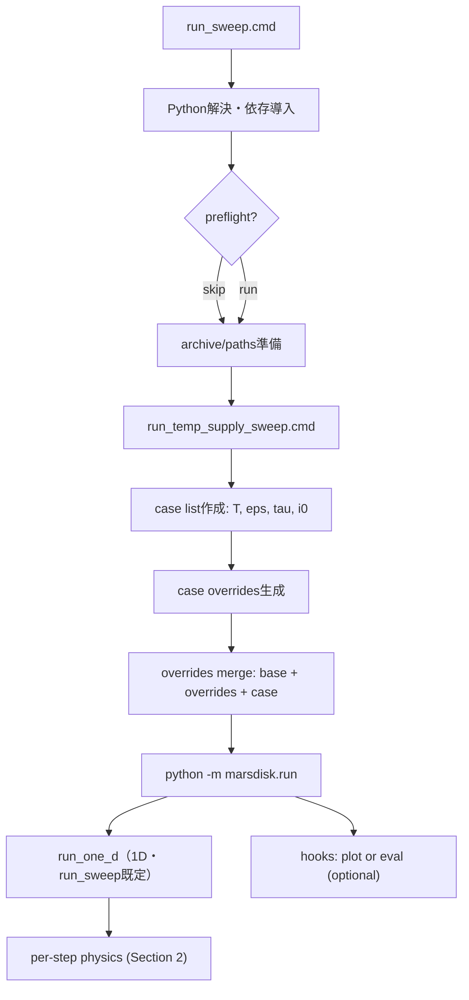
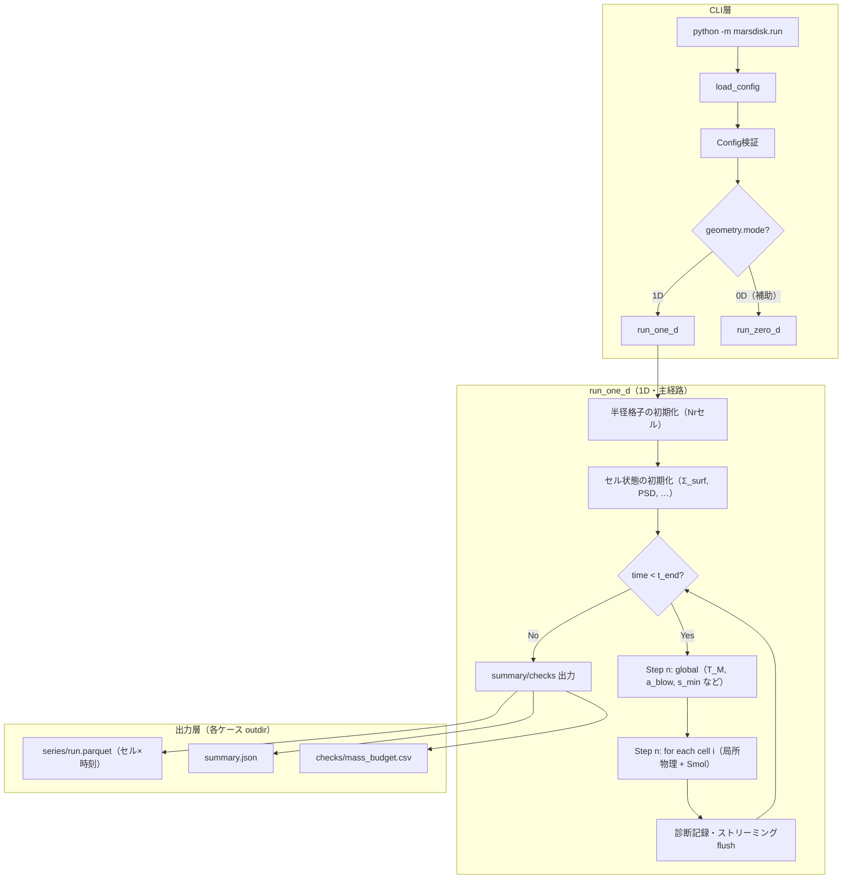
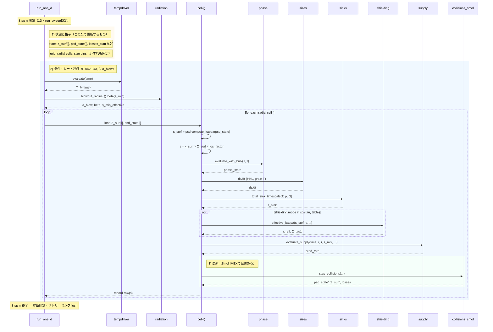
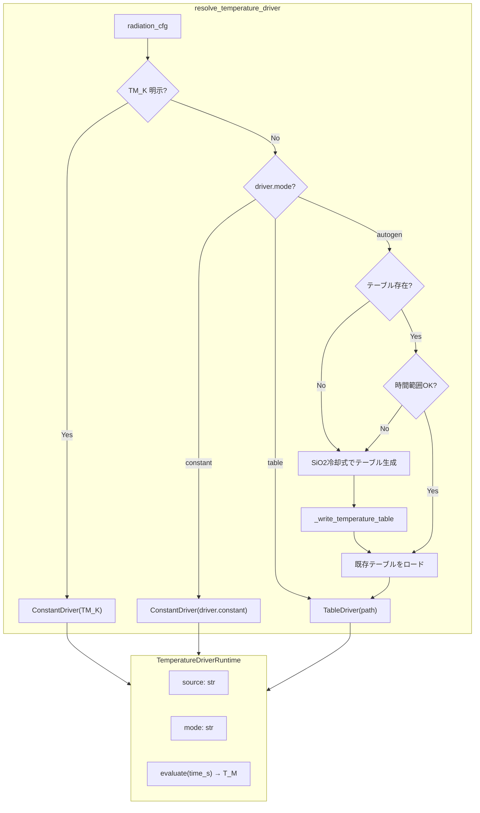
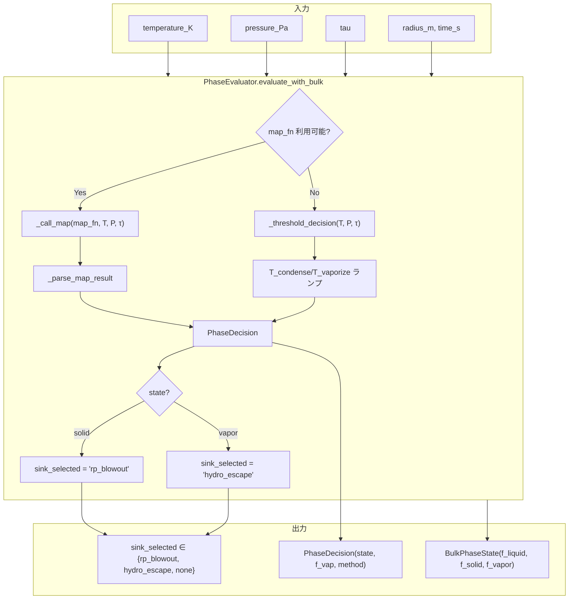
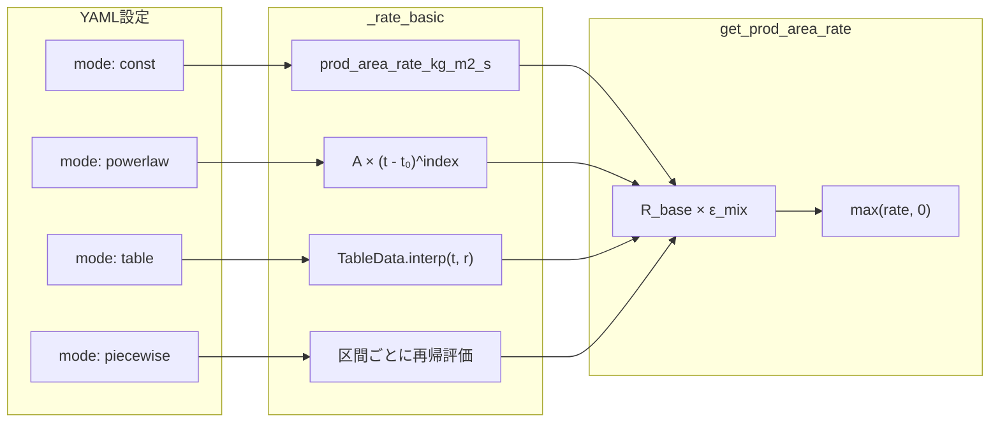
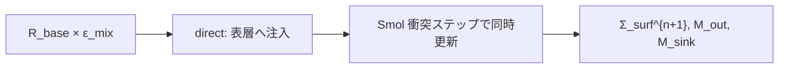
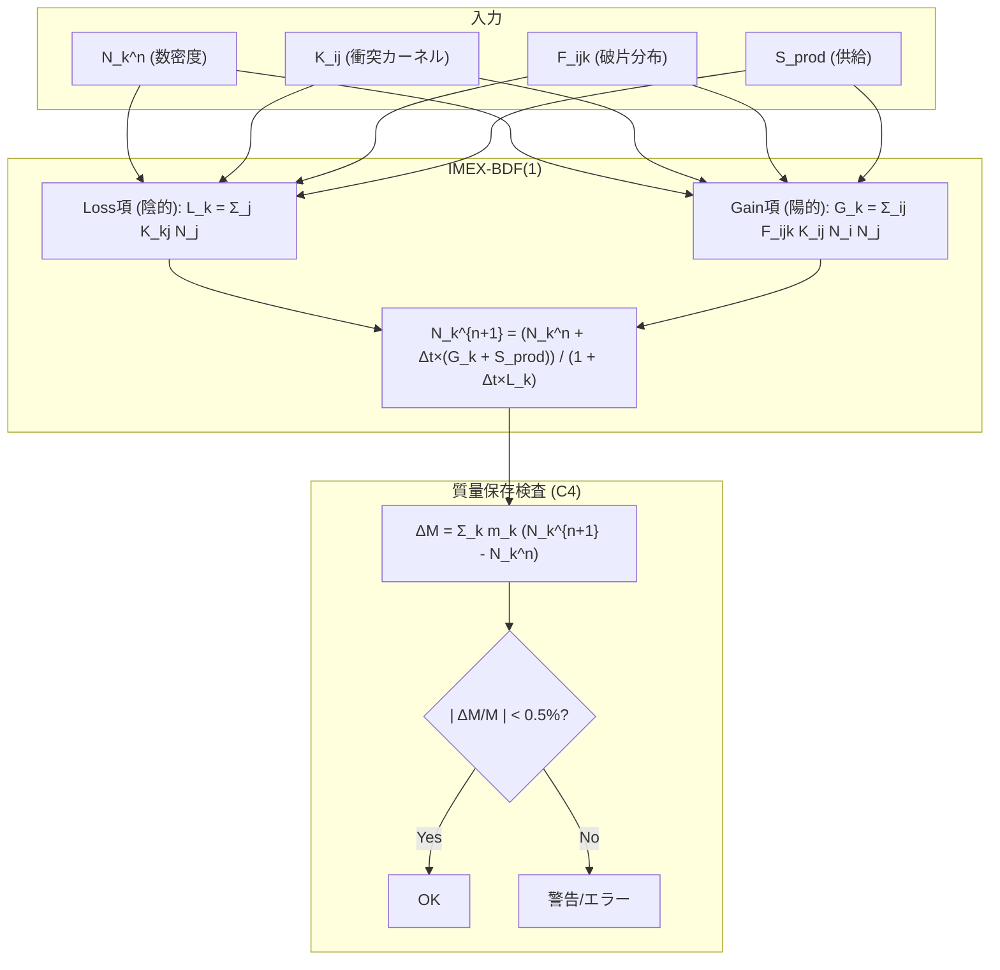
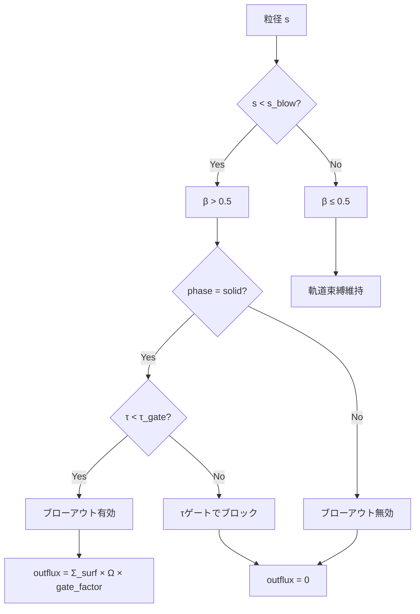

# 物理計算フローのシーケンス図

> **文書種別**: リファレンス（Diátaxis: Reference）
> **自動生成**: このドキュメントは `tools/make_physics_flow.py` により自動生成されます。
> 手動編集しないでください。
> **情報源**:
> - run.py セクション表: `analysis/run_py_sections.md`
> - schema 参照: `marsdisk/schema.py`
> - dataflow 参照: `analysis/overview.md`

本ドキュメントは火星ダスト円盤シミュレーションの物理計算フローを Mermaid 図で可視化し、
モジュール間の依存関係と計算順序を明確化します。

> **読み方（重要）**: 本書は運用で基準とする `scripts/runsets/windows/run_sweep.cmd` の既定フロー（**1D + Smol**）を主経路として示します。  
> 0D（`run_zero_d`）は **デバッグ／スモークテスト用の補助経路**として位置付け、詳細は最小限に留めます。

---

## 0. run_sweep.cmd 実行時の物理フロー（Windows・簡略版）

`scripts/runsets/windows/run_sweep.cmd` は **スイープの実行ラッパー**であり、
物理計算そのものは `python -m marsdisk.run` に委譲されます。
各ケースは「base config + overrides + case overrides」をマージしてから実行され、
タイムステップ内の物理計算は **本書の 2章と同じ**です。

**ケースごとに変わる主な入力（run_sweep 既定）**
- `radiation.TM_K`, `mars_temperature_driver.table.path`（温度）
- `supply.mixing.epsilon_mix`（供給効率）
- `optical_depth.tau0_target`（光学深度）
- `dynamics.i0`, `dynamics.rng_seed`
- `io.outdir`（出力先）

---

## 1. 全体アーキテクチャ概観

---

## 2. 各タイムステップの物理計算順序

`run_sweep.cmd` 既定（**1D + smol**）の 1 ステップ（Δt）を、理解のために 3 つに分けて示します。

> 1) 何を時間発展させるか（状態と格子）  
> 2) その時刻の条件を決める（環境・レート評価）  
> 3) 時間を 1 ステップ進める（更新式・ソルバ）

> 1) 状態と格子: rセル（1D）と size bins（固定）と、各セルの状態 `Σ_surf[i]`, `psd_state[i]`, 損失累積など  
> 2) 条件・レート評価: 温度 → 放射圧（β, a_blow, s_min）→（各セルで）κ/τ/相/昇華 ds/dt/シンク時間/供給レート  
> 3) 更新: `collisions_smol`（IMEX-BDF1）で PSD と `Σ_surf` を Δt 更新し、損失（blowout/sinks）を積算

読み方の注記:
- 縦方向が時間の進行で、横方向は登場モジュール（参加者）の並び（物理空間の軸ではない）。
- 矢印は「計算の依頼」と「結果の返却」で、上から下へ順に追います（左から右へ流れる図ではない）。
- `rect` は概念上の区分で、実装では同一タイムステップ内で連続して実行されます。
- `loop` は「半径セルごとの反復」を表し、実装上はセル並列化される場合があります。

---

## 3. 温度ドライバ解決フロー

`tempdriver.py` による火星温度の動的解決:

---

## 4. 相判定フロー (PhaseEvaluator)

`phase.py` による固体/蒸気相の判定とシンク選択:

---

## 5. 外部供給モード (Supply)

`supply.py` による生成率の評価:

### 5.1 供給輸送モード (Transport)

`run_sweep.cmd` の既定は `supply.transport.mode="direct"`（深部リザーバ経路は無効）。

補足: `deep_mixing` は非既定であり、運用の `run_sweep.cmd` では使用しない（スキーマ上も非推奨候補）。

---

## 6. 表層進化ステップ (S1) の詳細

`surface.collision_solver="surface_ode"` を選んだ場合のみ使われる **非既定**の更新式です。  
`run_sweep.cmd` の既定（`collision_solver=smol`）ではこの節の ODE は使われません（Smol は §7）。

- 目的: 0D/簡易検証で「供給・ブローアウト・シンク」を解析的に追う補助経路。
- 衝突寿命 `t_coll` は Wyatt 型のスケーリング（概算）を用いる（詳細は論文側・`analysis/equations.md` を参照）。

---

## 7. Smoluchowski 衝突積分 (C3) の詳細

IMEX-BDF(1) による粒径分布の時間発展:

---

## 8. 放射圧ブローアウト判定フロー

---

## 参考文献

- [@StrubbeChiang2006_ApJ648_652]: ApJ 648, 652 — 衝突時間スケール t_coll
- [@Wyatt2008]: ARA&A 46, 339 — デブリ円盤の衝突カスケード
- [@Burns1979_Icarus40_1]: Icarus 40, 1 — 放射圧効率 Q_pr と β の定義
- [@Hyodo2017a_ApJ845_125], 2018): ApJ — 火星月形成円盤の放射冷却
- [@Pignatale2018_ApJ853_118]: ApJ 853, 118 — HKL昇華フラックス
- [@Ronnet2016_ApJ828_109]: ApJ 828, 109 — 外縁ガス包絡での凝縮
