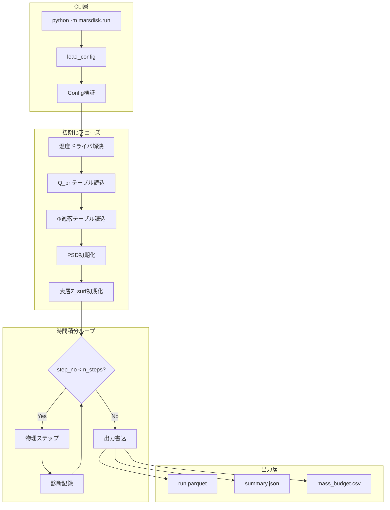
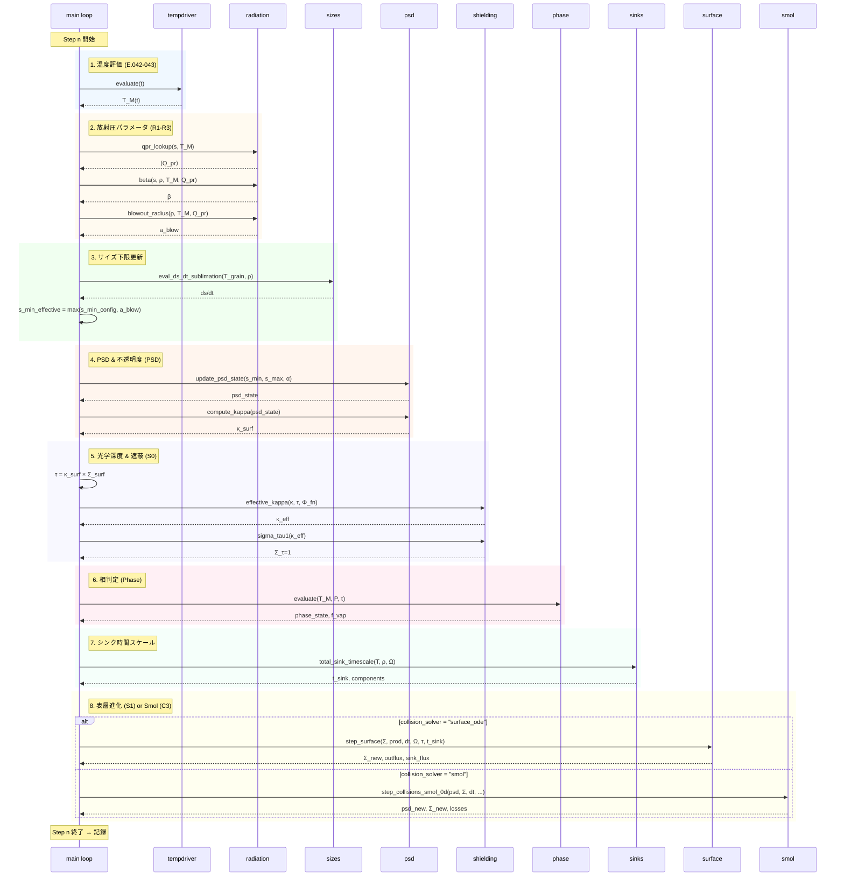
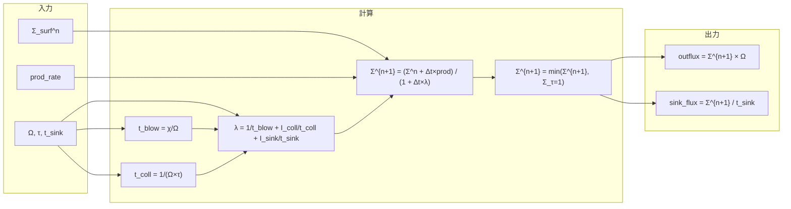
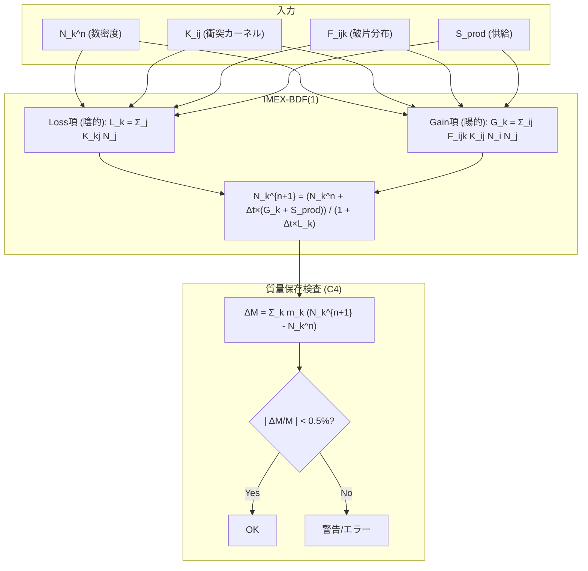
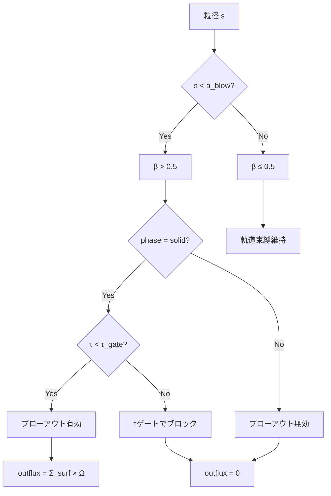
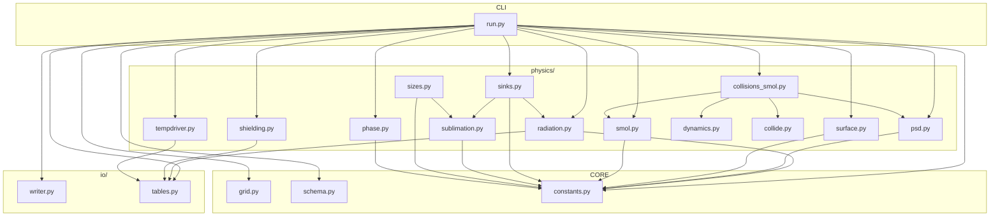
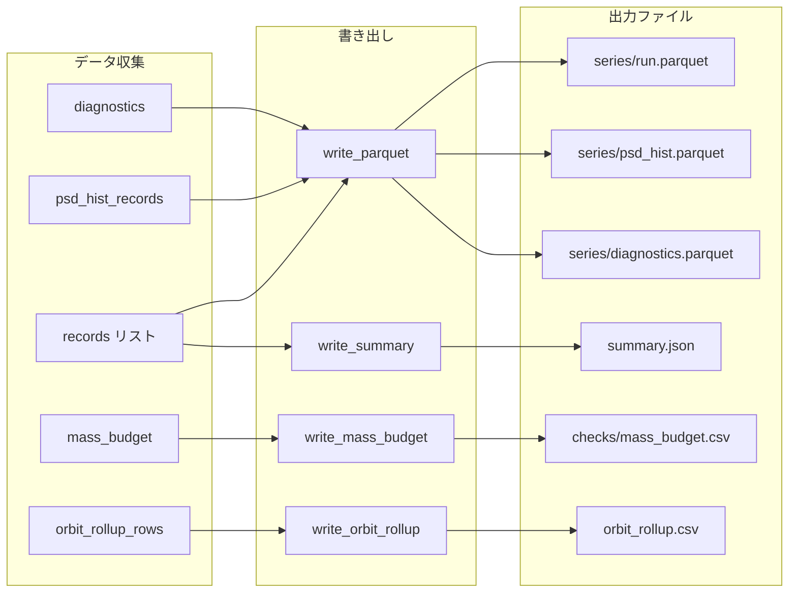

# 物理計算フローのシーケンス図

> **文書種別**: リファレンス（Diátaxis: Reference）

本ドキュメントは火星ダスト円盤シミュレーションの物理計算フローを Mermaid 図で可視化し、
モジュール間の依存関係と計算順序を明確化します。

---

## 1. 全体アーキテクチャ概観



---

## 2. 各タイムステップの物理計算順序

AGENTS.md で規定された結合順序:

> ⟨Q_pr⟩ → β → a_blow → sublimation ds/dt → τ & Φ → surface sink fluxes



---

## 3. 表層進化ステップ (S1) の詳細

Strubbe & Chiang (2006) / Wyatt (2008) に基づく表層 ODE:



---

## 4. Smoluchowski 衝突積分 (C3) の詳細

IMEX-BDF(1) による粒径分布の時間発展:



---

## 5. 放射圧ブローアウト判定フロー



---

## 6. モジュール依存関係



---

## 7. 出力データフロー



---

## 8. 式番号とモジュールの対応表

| 式番号 | 式名 | モジュール | 関数/行番号 |
|--------|------|-----------|-------------|
| (E.001) | v_kepler | grid.py | `v_kepler` L34 |
| (E.002) | omega | grid.py | `omega` L90 |
| (E.004) | interp_qpr | io/tables.py | `interp_qpr` L259-270 |
| (E.006) | t_coll | surface.py | `wyatt_tcoll_S1` L62-73 |
| (E.007) | step_surface_density_S1 | surface.py | `step_surface_density_S1` L96-163 |
| (E.013) | β | radiation.py | `beta` |
| (E.014) | a_blow | radiation.py | `blowout_radius` L274-288 |
| (C3) | IMEX-BDF(1) | smol.py | `step_imex_bdf1_C3` L18-101 |
| (C4) | mass_budget_error | smol.py | `compute_mass_budget_error_C4` L104-131 |
| (S0) | effective_kappa | shielding.py | `effective_kappa` L90-120 |
| (S1) | step_surface | surface.py | `step_surface` L185-208 |

---

## 9. 設定キー → 物理モジュールのマッピング

```mermaid
flowchart LR
    subgraph CONFIG["YAML設定"]
        C1[radiation.TM_K]
        C2[radiation.qpr_table_path]
        C3[shielding.mode]
        C4[sinks.enable_sublimation]
        C5[surface.collision_solver]
        C6[blowout.enabled]
        C7[numerics.dt_init]
    end
    
    subgraph MODULE["物理モジュール"]
        M1[tempdriver]
        M2[radiation / tables]
        M3[shielding]
        M4[sinks / sublimation]
        M5[surface / collisions_smol]
        M6[surface (outflux)]
        M7[time loop dt]
    end
    
    C1 --> M1
    C2 --> M2
    C3 --> M3
    C4 --> M4
    C5 --> M5
    C6 --> M6
    C7 --> M7
```

---

## 参考文献

- Strubbe & Chiang (2006): ApJ 648, 652 — 衝突時間スケール t_coll
- Wyatt (2008): ARA&A 46, 339 — デブリ円盤の衝突カスケード
- Burns et al. (1979): Icarus 40, 1 — 放射圧効率 Q_pr と β の定義
- Hyodo et al. (2017, 2018): ApJ — 火星月形成円盤の放射冷却
