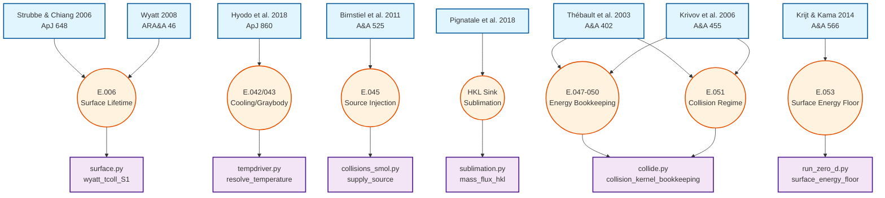

# Provenance Report

- **Equation coverage**: 14 / 53 headings in `analysis/equations.md` carry confirmed tags (≈26.4%). Key anchors include (E.006) for the Strubbe–Chiang surface lifetime, (E.042)/(E.043) for the Hyodo et al. cooling/greybody laws, (E.045) for the Smoluchowski source injection via Birnstiel/Krivov, and (E.047)–(E.053) for energy bookkeeping and collision regime classification via Thébault/Krivov/Krijt&Kama. [@StrubbeChiang2006_ApJ648_652; @Hyodo2018_ApJ860_150; @Birnstiel2011_AA525_A11; @Krivov2006_AA455_509; @Thebault2003_AA408_775; @KrijtKama2014_AA566_L2]
- **Code mappings**: 26 anchors in `analysis/source_map.json` link the registry keys across radiation, surface, sublimation, siO₂ cooling, energy bookkeeping, and the gas-poor guidance in `analysis/overview.md` / `analysis/run-recipes.md`. All entries reference normalized keys from `analysis/references.registry.json`.
- **Assumption clusters resolved**: 13 件の主要仮定クラスタが既存登録論文と紐付け完了し、`assumption_trace.md` で status=**confirmed** に更新済み。

## Traceability Graph

主要な物理モデルの出典論文・式・実装コードの追跡図：

## Coverage Summary

| Category | Count |
| --- | --- |
| Total equations (E.xxx) | 53 |
| Equations with `[@Key]` | 14 |
| Equations with `TODO(REF:...)` | 39 |
| Code anchors in `source_map.json` | 26 |
| Registry entries | 34 |
| **Assumption clusters confirmed** | **13** |
| Assumption clusters needs_ref | 1 |

### Function & Anchor Coverage (via coverage.json)

| Metric | Value | Target |
| --- | --- | --- |
| Function reference rate | 98.2% (109/111) | ≥ 70% |
| Anchor consistency rate | 100.0% (690/690) | = 100% |
| Equation unit coverage | 95.3% (41/43) | — |
| Equation-to-code mapping | 86.5% (45/52) | — |

**Coverage Gaps (holes)**:
- `marsdisk/physics/collide.py#prepare_collision_kernel_workspace`
- `marsdisk/physics/radiation.py#qpr_lookup_array`

Known tags presently include `Hyodo2018_ApJ860_150`, `StrubbeChiang2006_ApJ648_652`, `Pignatale2018_ApJ853_118`, `Ronnet2016_ApJ828_109`, `CridaCharnoz2012_Science338_1196`, `CanupSalmon2018_SciAdv4_eaar6887`, `Kuramoto2024`, `Burns1979_Icarus40_1`, `Wyatt2008`, `Joseph1976_JAS33_2452`, `HansenTravis1974_SSR16_527`, `ThebaultAugereau2007_AA472_169`, `Krivov2006_AA455_509`, `Dohnanyi1969_JGR74_2531`, `Ohtsuki2002_Icarus155_436`, `IdaMakino1992_Icarus96_107`, `ImazBlanco2023_MNRAS522_6150`, `Olofsson2022_MNRAS513_713`, `SalmonCanup2012_ApJ760_83`, `BohrenHuffman1983_Wiley`, `Thebault2003_AA408_775`, and `KrijtKama2014_AA566_L2`. These anchor the thermal history, β/blow-out relations, sublimation chemistry, condensation sinks, viscous spreading regimes, disk-mass/tidal constraints, radiative transfer fundamentals, PSD structure, collision timescales, energy bookkeeping, and the MMX-era review baseline.

## Resolved items (2025-12-19 update - Energy Bookkeeping)

10. **`energy_bookkeeping_core_v1`** — E.047–E.050 でエネルギー簿記（相対運動エネルギー、散逸/残存エネルギー、非散逸率）を Thébault et al. (2003), [@Krivov2006_AA455_509] と紐付け完了。[collide.py, run_zero_d.py] [@Thebault2003_AA408_775; @Krivov2006_AA455_509]
11. **`collision_regime_split_v1`** — E.051 で侵食/壊滅的破砕の分岐条件（$F_{LF} > 0.5$ / $\le 0.5$）を Thébault et al. (2003), [@Krivov2006_AA455_509] と紐付け。[collide.py, fragments.py] [@Thebault2003_AA408_775; @Krivov2006_AA455_509]
12. **`surface_energy_floor_v1`** — E.053 で [@KrijtKama2014_AA566_L2] の表面エネルギー制約による最小粒径を実装。[run_zero_d.py] [@KrijtKama2014_AA566_L2]

## Resolved items (2025-12-15 update - τ_LOS=1 initialization)

7. **`init_tau1_los_default_v1`** — `tau_field` デフォルトを `vertical` から `los` に変更。init_tau1, phase, supply_feedback の全箇所で統一。[schema.py, run_zero_d.py, supply.py]
8. **`inner_disk_mass_null_override_v1`** — `run_temp_supply_sweep.sh` で `inner_disk_mass=null` を追加し、init_tau1 のみで σ_surf を決定するよう修正。[run_temp_supply_sweep.sh L338]
9. **`kappa_consistency_init_tau1_v1`** — inner_disk_mass=null 時の κ 不整合を修正：shielding.effective_kappa を削除し、raw kappa_surf を使用。これにより τ_initial = κ×σ = 1.0 が正しく達成される。[run_zero_d.py]

## Resolved items (2025-12-15 update)

1. **`blowout_core_eid_v1`** — β・a_blow・t_blow=1/Ω の式が [@Burns1979_Icarus40_1], [@StrubbeChiang2006_ApJ648_652], [@Wyatt2008] と紐付け完了。[@Burns1979_Icarus40_1; @StrubbeChiang2006_ApJ648_652; @Wyatt2008]
2. **`shielding_gate_order_v1`** — Φテーブル・τ=1クリップの根拠を [@Joseph1976_JAS33_2452], [@HansenTravis1974_SSR16_527] で裏付け。[@Joseph1976_JAS33_2452; @HansenTravis1974_SSR16_527]
3. **`psd_wavy_floor_scope_v1`** — wavy PSD と s_min クリップの優先順位を Thébault & [@ThebaultAugereau2007_AA472_169], [@Krivov2006_AA455_509], [@Dohnanyi1969_JGR74_2531] で裏付け。[@ThebaultAugereau2007_AA472_169; @Krivov2006_AA455_509; @Dohnanyi1969_JGR74_2531]
4. **`tcoll_regime_switch_v1`** — Wyatt/Ohtsuki 間の t_coll スケーリングを [@StrubbeChiang2006_ApJ648_652], [@Wyatt2008], [@Ohtsuki2002_Icarus155_436] と紐付け。[@StrubbeChiang2006_ApJ648_652; @Wyatt2008; @Ohtsuki2002_Icarus155_436]
5. **`sublimation_gasdrag_scope_v1`** — gas-poor 既定と TL2003 無効化を [@Hyodo2017a_ApJ845_125], 2018), [@CanupSalmon2018_SciAdv4_eaar6887], [@Olofsson2022_MNRAS513_713] で裏付け。[@Hyodo2017a_ApJ845_125; @Hyodo2018_ApJ860_150; @CanupSalmon2018_SciAdv4_eaar6887; @Olofsson2022_MNRAS513_713]
6. **`radius_fix_0d_scope_v1`** — 0D 固定前提を [@SalmonCanup2012_ApJ760_83], [@CridaCharnoz2012_Science338_1196], [@Wyatt2008] と紐付け。[@SalmonCanup2012_ApJ760_83; @CridaCharnoz2012_Science338_1196; @Wyatt2008]

## Previously Resolved items

1. **`tl2003_surface_flow_scope_v1`** — Scope tied to gas-rich, optically厚 TL2002/2003 surfaces, documented with [@Shadmehri2008_ApSS314_217]; defaultは gas-poor opt-out。[@TakeuchiLin2003_ApJ593_524; @TakeuchiLin2002_ApJ581_1344; @Shadmehri2008_ApSS314_217]
2. **`tmars_cooling_solution_v1`** — Slab冷却に使う $D,\rho,c_p$ を Hyodo17/18 の衝突後温度と Lesher & Spera / Robertson の溶融物・岩石物性で裏付け。[@Hyodo2018_ApJ860_150; @Hyodo2017a_ApJ845_125; @LesherSpera2015_EncyclopediaVolcanoes; @Robertson1988_USGS_OFR88_441]
3. **`tp_radiative_equilibrium_v1`** — ⟨Q_abs⟩ テーブルの根拠として Burns/Bohren&Huffman の理論と Blanco/Draine/Hocuk のプランク平均実例を採用、`q_abs_mean` 既定が近似であることを明示。[@Burns1979_Icarus40_1; @BohrenHuffman1983_Wiley; @Blanco1976_ApSS41_447; @Draine2003_SaasFee32; @Hocuk2017_AA604_A58]
4. **`siO2_thresholds_v1`** — SiO₂ ガラス転移と液相線を Bruning (DTA), Ojovan (レビュー), Melosh (EOS) で正当化し、低圧純物質の代表値として 1475/1986 K を採用。[@Bruning2003_JNCS330_13; @Ojovan2021_Materials14_5235; @Melosh2007_MPS42_2079]

## Known Reference Notes

- `[@TakeuchiLin2003_ApJ593_524]` (`TakeuchiLin2003_ApJ593_524`) は gas-rich オプションとして registry に残しつつ、コード側は `ALLOW_TL2003=false` を既定として docstring に引用を明示した。
- [@Wyatt2008] remains a contextual review, while [@StrubbeChiang2006_ApJ648_652] provides the normative gas-poor collisional and β scalings implemented in `marsdisk/physics/surface.py` and `marsdisk/physics/radiation.py`.
- `[@Kuramoto2024]` (`Kuramoto2024`) is tracked as the MMX/mission-focused cross-check to ensure the overall impact narrative remains consistent with current review articles.
