# 物理計算フローのシーケンス図

> **文書種別**: リファレンス（Diátaxis: Reference）
> **自動生成**: このドキュメントは `{{TOOL_PATH}}` により自動生成されます。
> 手動編集しないでください。
> **情報源**:
> - run.py セクション表: `{{RUN_SECTIONS_PATH}}`
> - schema 参照: `{{SCHEMA_PATH}}`
> - dataflow 参照: `{{DATAFLOW_PATH}}`

本ドキュメントは火星ダスト円盤シミュレーションの物理計算フローを Mermaid 図で可視化し、
モジュール間の依存関係と計算順序を明確化します。

---

## 0. run_sweep.cmd 実行時の物理フロー（Windows・簡略版）

`scripts/runsets/windows/run_sweep.cmd` は **スイープの実行ラッパー**であり、
物理計算そのものは `python -m marsdisk.run` に委譲されます。
各ケースは「base config + overrides + case overrides」をマージしてから実行され、
タイムステップ内の物理計算は **本書の 2章と同じ**です。

```mermaid
flowchart TB
    A["run_sweep.cmd"] --> B[Python解決・依存導入]
    B --> C{preflight?}
    C -->|skip| D[archive/paths準備]
    C -->|run| D
    D --> E["run_temp_supply_sweep.cmd"]
    E --> F[case list作成: T, eps, tau, i0]
    F --> G[case overrides生成]
    G --> H["overrides merge: base + overrides + case"]
    H --> I["python -m marsdisk.run"]
    I --> J["run_zero_d / run_one_d"]
    J --> K["per-step physics (Section 2)"]
    I --> L[hooks: plot/eval (optional)]
```

**ケースごとに変わる主な入力（run_sweep 既定）**
- `radiation.TM_K`, `mars_temperature_driver.table.path`（温度）
- `supply.mixing.epsilon_mix`（供給効率）
- `optical_depth.tau0_target`（光学深度）
- `dynamics.i0`, `dynamics.rng_seed`
- `io.outdir`（出力先）

---

## 1. 全体アーキテクチャ概観

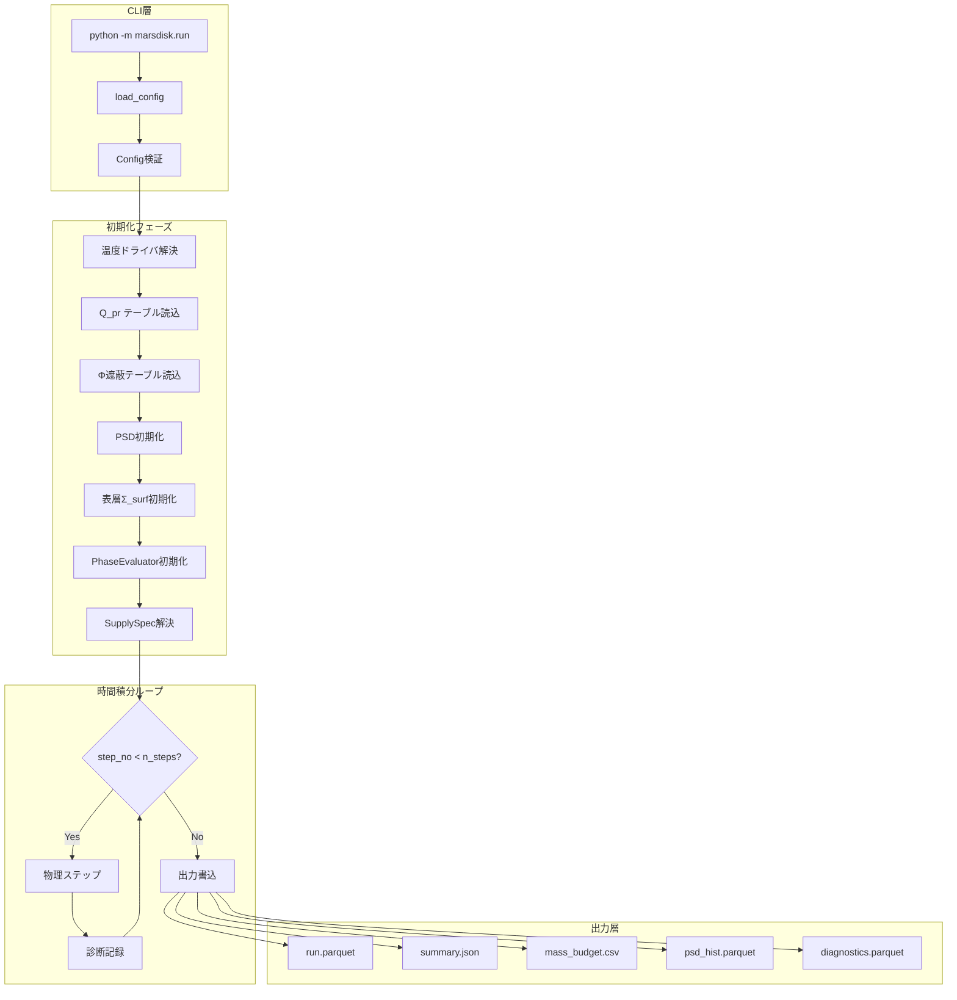

---

## 2. 各タイムステップの物理計算順序

AGENTS.md で規定された結合順序:

> ⟨Q_pr⟩ → β → s_blow → sublimation ds/dt → τ & Φ → phase → supply → surface sink fluxes

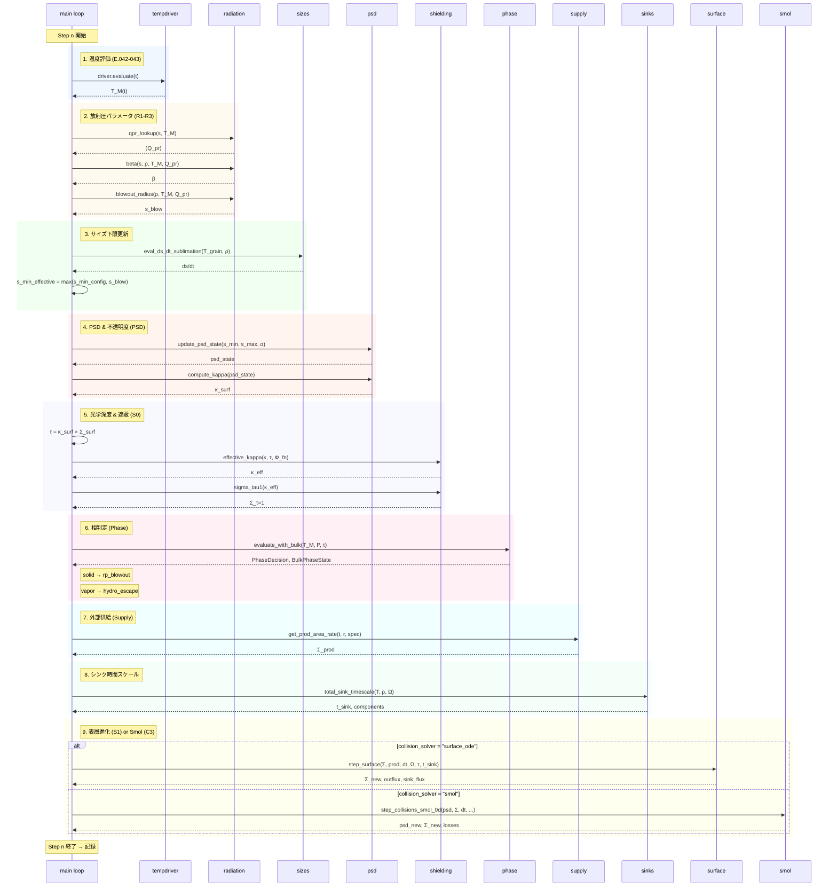

---

## 3. 温度ドライバ解決フロー

`tempdriver.py` による火星温度の動的解決:

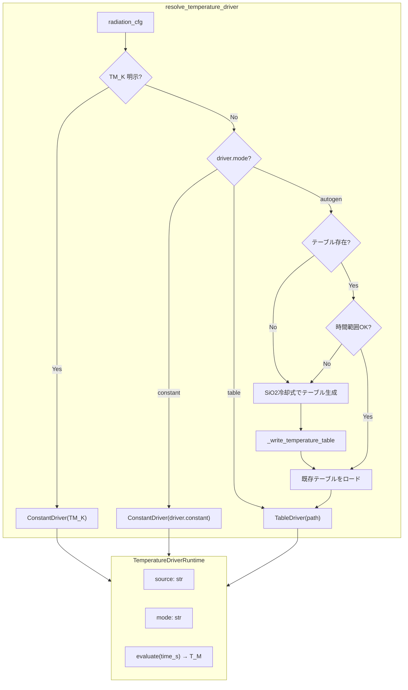

---

## 4. 相判定フロー (PhaseEvaluator)

`phase.py` による固体/蒸気相の判定とシンク選択:

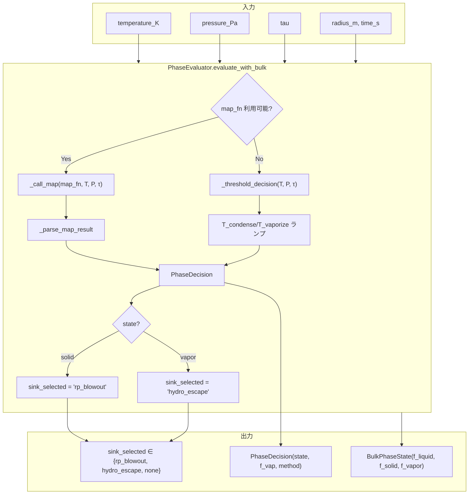

---

## 5. 外部供給モード (Supply)

`supply.py` による生成率の評価:

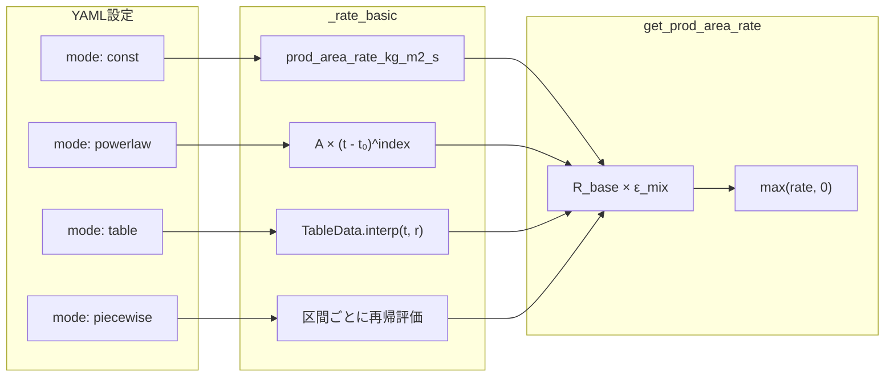

### 5.1 供給輸送モード (Transport)

`supply.transport.mode` による表層／深部経路の分岐:

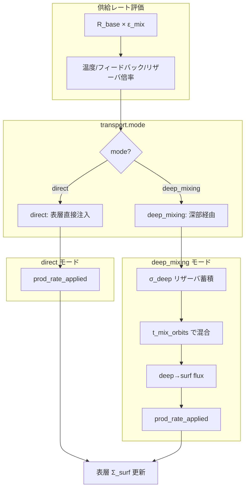

---

## 6. 表層進化ステップ (S1) の詳細

[@StrubbeChiang2006_ApJ648_652] / [@Wyatt2008] に基づく表層 ODE:

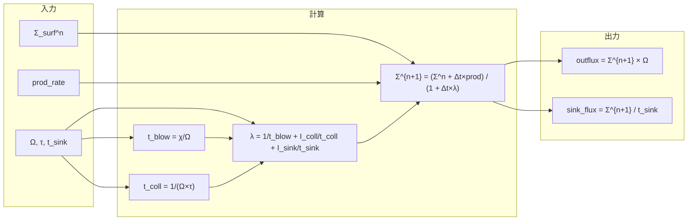

補足: `Σ_{τ=1}` は診断用に保持し、表層 ODE の更新式で `Σ_surf` を直接クリップしない。

---

## 7. Smoluchowski 衝突積分 (C3) の詳細

IMEX-BDF(1) による粒径分布の時間発展:

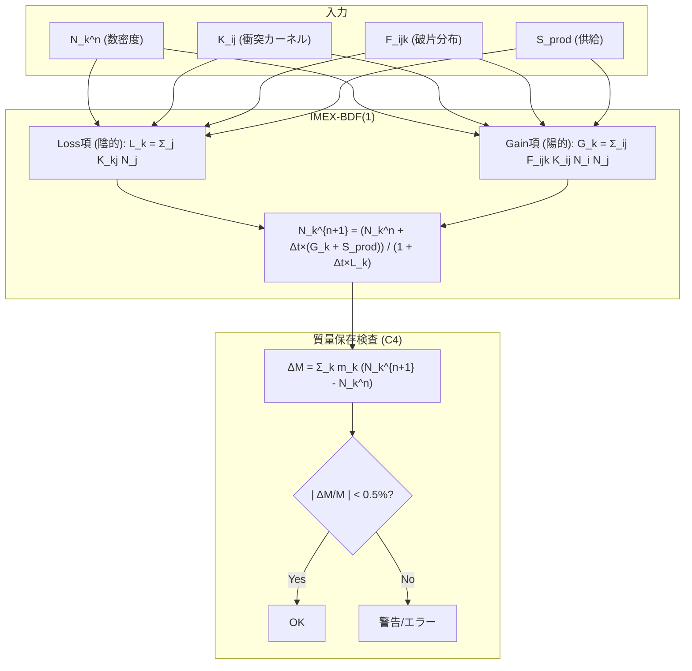

---

## 8. 放射圧ブローアウト判定フロー

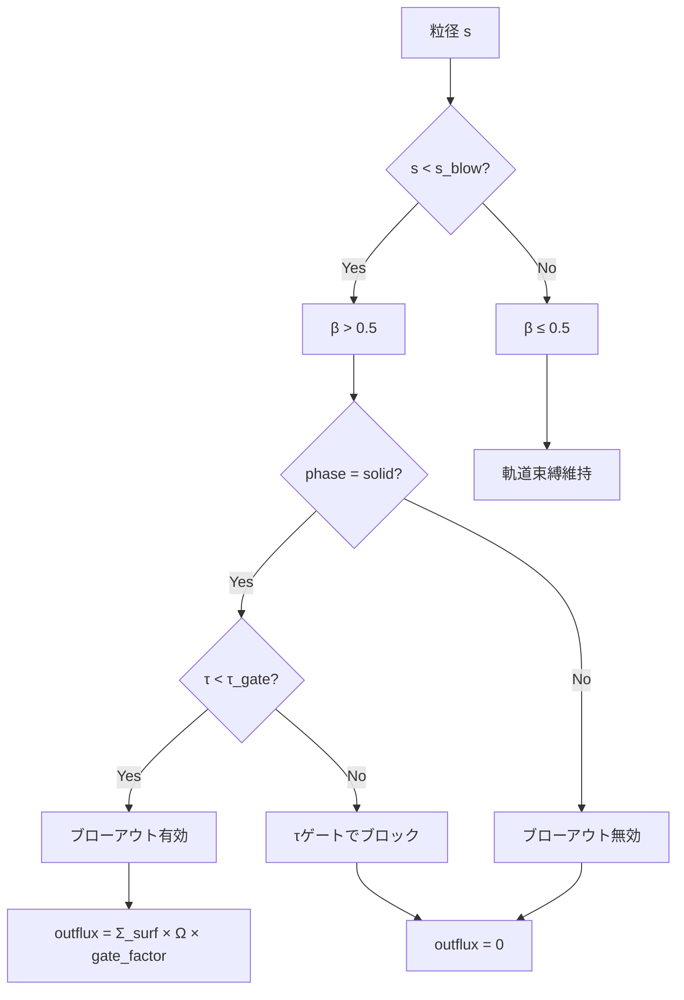

---

## 9. モジュール依存関係

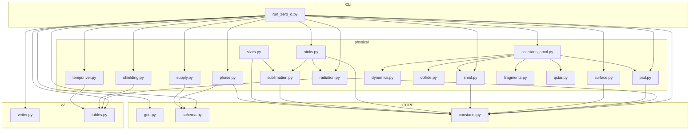

---

## 10. 出力データフロー

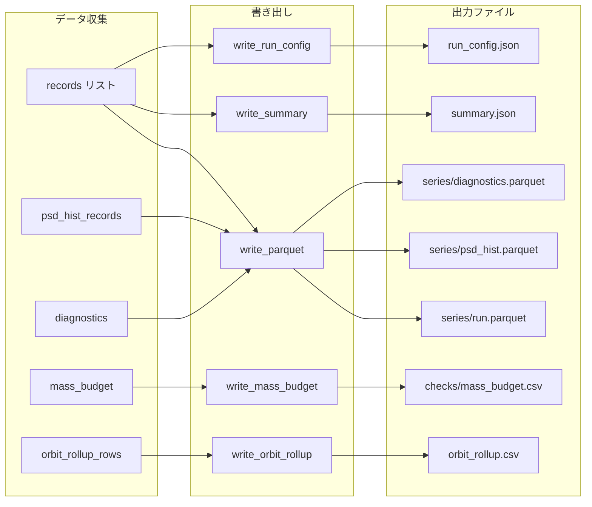

---

## 11. 式番号とモジュールの対応表

| 式番号 | 式名 | モジュール | 関数/行番号 |
|--------|------|-----------|-------------|
| (E.001) | v_kepler | grid.py | `v_kepler` L34 |
| (E.002) | omega | grid.py | `omega` L90 |
| (E.004) | interp_qpr | io/tables.py | `interp_qpr` L259-270 |
| (E.006) | t_coll | surface.py | `wyatt_tcoll_S1` L62-73 |
| (E.007) | step_surface_density_S1 | surface.py | `step_surface_density_S1` L96-163 |
| (E.010) | IMEX-BDF(1) | smol.py | `step_imex_bdf1_C3` L18-101 |
| (E.011) | mass_budget_error | smol.py | `compute_mass_budget_error_C4` L104-131 |
| (E.013) | β | radiation.py | `beta` L220-241 |
| (E.014) | s_blow | radiation.py | `blowout_radius` L274-288 |
| (E.015) | effective_kappa | shielding.py | `effective_kappa` L90-120 |
| (E.016) | sigma_tau1 | shielding.py | `sigma_tau1` L123-130 |
| (E.018) | mass_flux_hkl | sublimation.py | `mass_flux_hkl` L534-584 |
| (E.027) | get_prod_area_rate | supply.py | `get_prod_area_rate` L93-98 |
| (E.042-043) | T_M(t) | tempdriver.py | `resolve_temperature_driver` L275-341 |
| — | PhaseDecision | phase.py | `PhaseEvaluator.evaluate` L120-138 |
| — | hydro_escape_timescale | phase.py | `hydro_escape_timescale` L564-593 |

---

## 12. 設定キー → 物理モジュールのマッピング

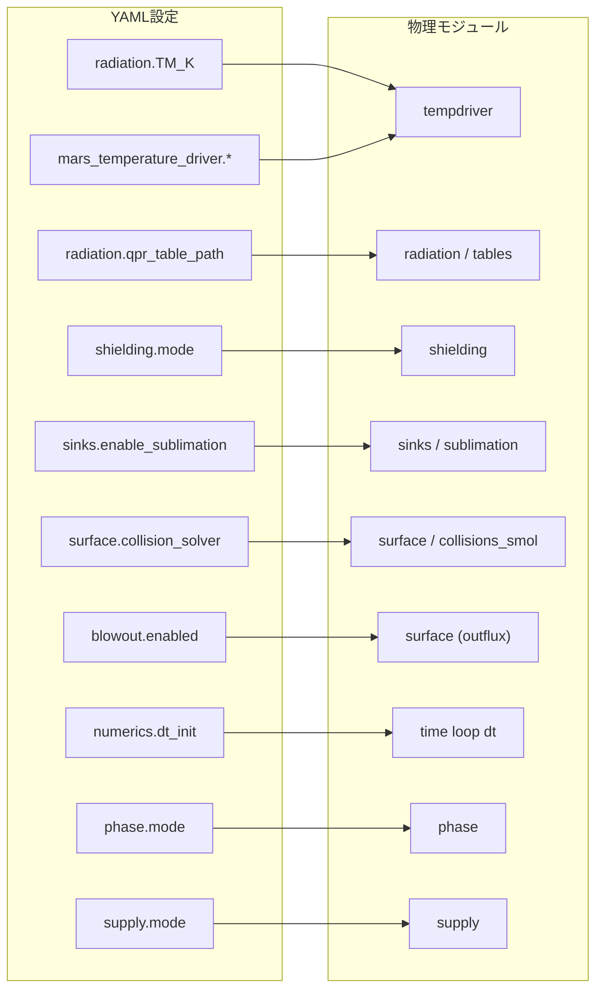

---

## 13. 流体逃亡スケーリング (hydro_escape)

相が `vapor` の場合に適用される流体力学的散逸:

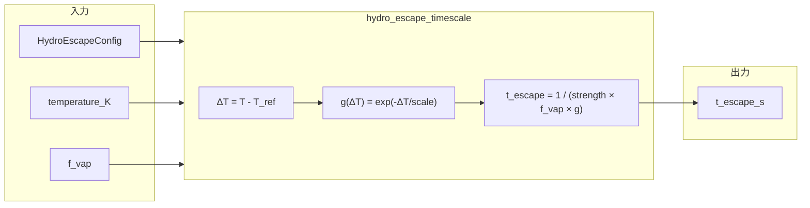

---

## 14. バルク相状態 (BulkPhaseState)

`PhaseEvaluator.evaluate_with_bulk` が返す詳細な相情報:

| フィールド | 型 | 意味 |
|-----------|----|----|
| `state` | `solid_dominated`/`liquid_dominated`/`mixed` | 支配相 |
| `f_liquid` | float | 液相分率 [0,1] |
| `f_solid` | float | 固相分率 [0,1] |
| `f_vapor` | float | 蒸気分率 [0,1] |
| `method` | str | 判定手法 (`map`/`threshold`) |
| `used_map` | bool | マップ関数使用の有無 |
| `temperature_K` | float | 評価温度 |
| `tau` | float | 光学深度 |

---

## 参考文献

- [@StrubbeChiang2006_ApJ648_652]: ApJ 648, 652 — 衝突時間スケール t_coll
- [@Wyatt2008]: ARA&A 46, 339 — デブリ円盤の衝突カスケード
- [@Burns1979_Icarus40_1]: Icarus 40, 1 — 放射圧効率 Q_pr と β の定義
- [@Hyodo2017a_ApJ845_125], 2018): ApJ — 火星月形成円盤の放射冷却
- [@Pignatale2018_ApJ853_118]: ApJ 853, 118 — HKL昇華フラックス
- [@Ronnet2016_ApJ828_109]: ApJ 828, 109 — 外縁ガス包絡での凝縮
