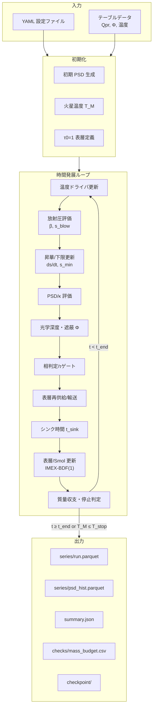
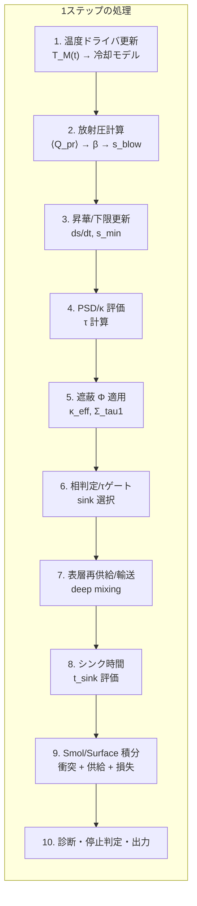
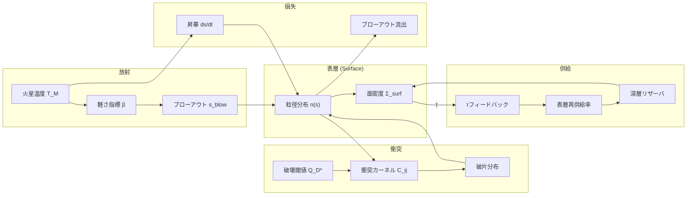
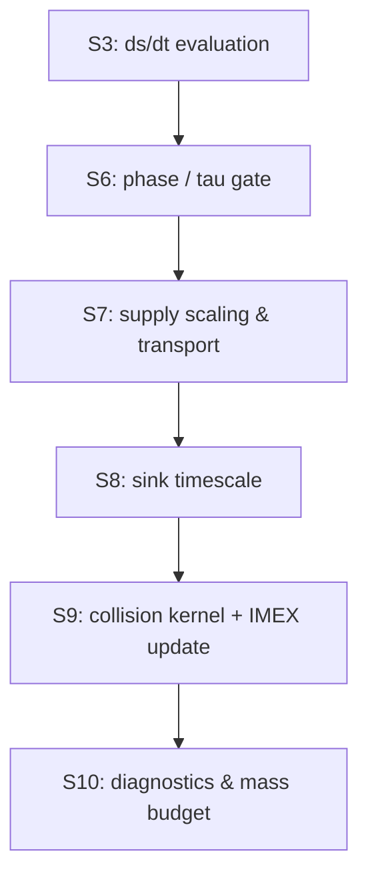
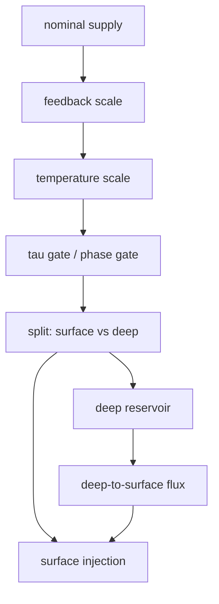
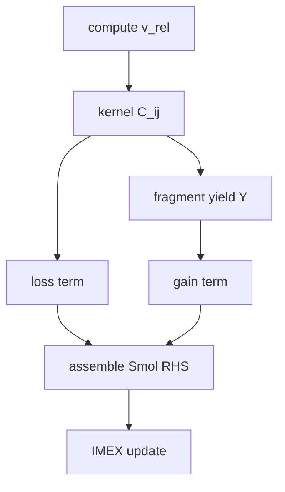
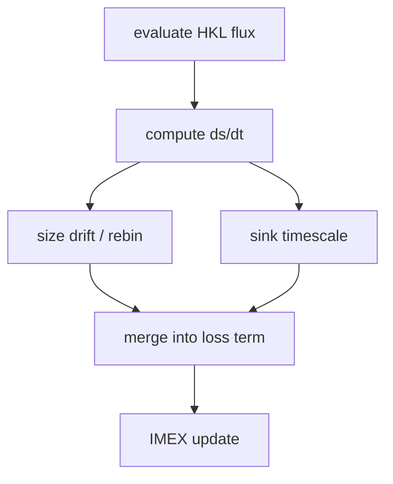

> **文書種別**: リファレンス（Diátaxis: Reference）

<!--
NOTE: このファイルは analysis/thesis_sections/02_methods/*.md の結合で生成する。
編集は分割ファイル側で行い、統合は `python -m analysis.tools.merge_methods_sections --write` を使う。
-->


# シミュレーション手法

本資料は火星ロッシュ限界内の高温ダスト円盤を対象とする数値手法を、論文の Methods 相当の水準で記述する。gas-poor 条件下での粒径分布（particle size distribution; PSD）進化と、表層（surface layer）の放射圧起因アウトフロー（outflux）を**同一タイムループで結合**し、2 年スケールの $\dot{M}_{\rm out}(t)$ と $M_{\rm loss}$ を評価する。数式の定義は analysis/equations.md の (E.###) を正とし、本書では主要式を必要最小限に再掲したうえで、離散化・数値解法・運用フロー・検証条件を整理する。

序論（analysis/thesis/introduction.md §3）で提示した 3 つの問いと、本手法が直接生成する量・出力の対応を先に示す。

| 序論の問い | 手法で直接生成する量 | 対応する出力 |
|------------|----------------------|--------------|
| 問1: 高温期（1000 K まで／固定地平 2 年）の総損失量 | 時間依存の流出率と累積損失 | `series/run.parquet` の `M_out_dot`, `mass_lost_by_blowout`, `mass_lost_by_sinks`／`summary.json` の `M_loss` |
| 問2: 粒径分布の時間変化と吹き飛びやすい粒径帯 | 粒径ビンごとの数密度履歴と下限粒径 | `series/psd_hist.parquet` の `bin_index`, `s_bin_center`, `N_bin`, `Sigma_surf`／`series/run.parquet` の `s_min` |
| 問3: 短期損失を踏まえた残存質量の評価 | 累積損失と質量収支の時系列 | `summary.json` の `M_loss`（初期条件との差分で残存量を評価）／`series/run.parquet` の `mass_lost_by_blowout`, `mass_lost_by_sinks` |

読み進め方は次の順序を推奨する。

- まず入力と出力（何を与え、何が返るか）を確認する。
- 次に 1 ステップの処理順序（図 2.1–2.2）を把握する。
- その後、放射圧・供給・衝突・昇華・遮蔽の各過程を個別に読む。
- 最後に運用（run_sweep）と再現性（出力・検証）を確認する。

本文では物理的な因果と時間発展の説明を優先し、設定キーや実装パスは付録に整理する。式は必要最小限に再掲し、詳細な定義と記号表は analysis/equations.md を正とする。

本書で用いる略語は以下に統一する。光学的厚さ（optical depth; $\tau$）、視線方向（line of sight; LOS）、常微分方程式（ordinary differential equation; ODE）、implicit-explicit（IMEX）、backward differentiation formula（BDF）、放射圧効率（radiation pressure efficiency; $Q_{\rm pr}$）、破壊閾値（critical specific energy; $Q_D^*$）、Hertz–Knudsen–Langmuir（HKL）フラックス、1D（one-dimensional）。

---
## 1. 研究対象と基本仮定

本モデルは gas-poor 条件下の**軸対称・鉛直積分**ディスクを対象とし、半径方向に分割した 1D 計算を基準とする。粒径分布 $n(s)$ をサイズビンで離散化し、Smoluchowski 衝突カスケード（collisional cascade）と表層の放射圧・昇華による流出を同一ループで結合する。

- 標準の物理経路は Smoluchowski 経路（C3/C4）を各半径セルで解く 1D 手法で、実装の計算順序は図 2.2 に従う。放射圧〜流出の依存関係のみを抜粋すると ⟨$Q_{\rm pr}$⟩→β→$s_{\rm blow}$→遮蔽Φ→Smol IMEX→外向流束となる。半径方向の粘性拡散（radial viscous diffusion; C5）は演算子分割で追加可能とする。  
  > **参照**: analysis/overview.md §1, analysis/physics_flow.md §2「各タイムステップの物理計算順序」
- 運用スイープの既定は 1D とし、C5 は必要時のみ有効化する。具体的な run_sweep 手順と環境変数は付録 A、設定→物理対応は付録 B を参照する。
- [@TakeuchiLin2003_ApJ593_524] に基づく gas-rich 表層 ODE は `ALLOW_TL2003=false` が既定で無効。gas-rich 感度試験では環境変数を `true` にして `surface.collision_solver=surface_ode`（例: `configs/scenarios/gas_rich.yml`）を選ぶ。  
  > **参照**: analysis/equations.md（冒頭注記）, analysis/overview.md §1「gas-poor 既定」

1D は $r_{\rm in}$–$r_{\rm out}$ を $N_r$ セルに分割し、各セルの代表半径 $r_i$ で局所量を評価する。角速度 $\Omega(r_i)$ とケプラー速度 $v_K(r_i)$ は (E.001)–(E.002) に従い、$t_{\rm blow}$ や $t_{\rm coll}$ の基準時間に用いる。C5 を無効化した場合はセル間結合を行わず、半径方向の流束を解かない局所進化として扱う。

### 1.1 物性モデル (Hybrid Basalt/SiO₂)

物性は **Hybrid Basalt/SiO₂** を採用する。力学パラメータ（密度・$Q_D^*$）は玄武岩、放射圧効率 $\langle Q_{\rm pr}\rangle$ は SiO₂ テーブル、昇華は SiO 蒸気圧を用いる。混合物近似であるため、$\rho$ と $\langle Q_{\rm pr}\rangle$ の感度掃引を想定し、実行時の採用値は `run_config.json` に保存する。

$\langle Q_{\rm pr}\rangle$ はテーブル入力（CSV/NPZ）を標準とし、Planck 平均の評価に用いる。遮蔽係数 $\Phi(\tau,\omega_0,g)$ もテーブル入力を基本とし、双線形補間で適用する。これらのテーブルは `run_config.json` にパスが保存され、再現実行時の参照点となる。

> **参照**: analysis/equations.md（Hybrid Basalt/SiO₂ の前提）

---
## 2. モデル構成と結合フロー

この節ではフロー図に先立ち、$\tau$ と最小粒径の定義を先に固定する（詳細は §3.1–3.2）。  

- **$\tau_{\perp}$**: 表層 ODE の $t_{\rm coll}=1/(\Omega\tau_{\perp})$ に用いる。
- **$\tau_{\rm los}$**: 遮蔽・相判定・$\tau_{\rm stop}$ 判定の入力に用いる。
- **$\tau_{\rm gate}$**: ブローアウトのみをゲートする（供給は phase により有効化され、$\tau_{\rm gate}$ は供給を止めない）。
- **$\tau_{\rm stop}$**: 停止閾値であり、$\tau=1$ と同義ではない（停止判定専用）。
- **$\Sigma_{\tau=1}$**: 診断用の面密度で、標準では $\Sigma_{\rm surf}$ を直接クリップしない。
- **$\tau_0=1$**: 初期化スケーリングの目標で、`init_tau1.scale_to_tau1=true` のときに用いる。
- **$s_{\min,\mathrm{eff}}$**: PSD グリッドの下限に反映する有効最小粒径。既定は $s_{\min,\mathrm{eff}}=\max(s_{\min,\mathrm{cfg}}, s_{\mathrm{blow,eff}})$ だが、`psd.floor.mode="none"` では $s_{\min,\mathrm{eff}}=s_{\min,\mathrm{cfg}}$ を維持する。$s_{\rm sub}$ は ds/dt としてのみ扱う（床を動かすのは `psd.floor.mode` を明示した場合のみ）。

### 2.0 支配方程式の位置づけ

本書では主要式を抜粋して再掲し、式番号・記号定義は analysis/equations.md を正とする。

- **軌道力学と時間尺度**: (E.001)–(E.002) で $\Omega$, $v_K$ を定義し、$t_{\rm blow}$ の基準は (E.007) に従う。放射圧の整理は [@Burns1979_Icarus40_1] を採用する。
- **衝突カスケード**: PSD の時間発展は Smoluchowski 方程式 (E.010) を用い、質量収支は (E.011) で検査する。枠組みは [@Krivov2006_AA455_509; @Dohnanyi1969_JGR74_2531] に基づく。
- **破砕強度と破片生成**: 破壊閾値 $Q_D^*$ の補間 (E.026) は [@BenzAsphaug1999_Icarus142_5; @LeinhardtStewart2012_ApJ745_79] を参照する。
- **放射圧ブローアウト**: β と $s_{\rm blow}$ の定義は (E.013)–(E.014)、表層流出は (E.009) に依拠する。
- **昇華と追加シンク**: HKL フラックス (E.018) と飽和蒸気圧 (E.036) に基づき、昇華モデルの位置づけは [@Markkanen2020_AA643_A16] を参照する。
- **遮蔽と表層**: 自遮蔽係数 $\Phi$ は (E.015)–(E.017) により表層に適用し、gas-rich 条件の参照枠は [@TakeuchiLin2003_ApJ593_524] で位置づける。

以下の図は、入力（YAML/テーブル）から初期化・時間発展・診断出力に至る主経路を示す。**実装順序は analysis/physics_flow.md を正**とし、ここでは概念的な依存関係の整理として示す。

### 2.1 シミュレーション全体像



### 2.2 メインループ詳細



補足: 損失項（ブローアウト・追加シンク）は S9 の IMEX 更新に含まれ、S6 は相判定とゲート選択、S8 は $t_{\rm sink}$ の評価、S10 は診断集計と出力を担当する。

各ステップでは温度ドライバの出力から $T_M$ を更新し、放射圧関連量（$\langle Q_{\rm pr}\rangle$, β, $s_{\rm blow}$）と遮蔽量（$\Phi$, $\kappa_{\rm eff}$, $\tau_{\rm los}$）を再評価する。供給はフィードバックや温度スケールを通して表層に注入され、必要に応じて深層リザーバを経由する。表層 ODE または Smoluchowski 更新の後に、ブローアウトと追加シンクによる損失を加味し、質量収支と停止条件を評価する。

図 2.2 の手順と実装の対応は次の通りである。S1 は温度ドライバの評価と $T_M$ の更新、S2 は $Q_{\rm pr}$ テーブルから β と $s_{\rm blow}$ を評価する。S3 は昇華 ds/dt と $s_{\\rm min}$ を評価し、S4 で PSD と $\\kappa$ を更新して $\\tau$ を計算する。S5 は $\\Phi$ を適用して $\\kappa_{\\rm eff}$ と $\\Sigma_{\\tau=1}$ を評価し、S6 で相判定と $\\tau$ ゲートにより有効な損失経路を選択する。S7 は供給率の名目値を計算し、フィードバック・温度スケール・深層輸送を適用する。S8 はシンク時間 $t_{\\rm sink}$ を評価し、S9 で衝突カーネルに基づく gain/loss と供給・シンクを含めた IMEX 更新を行う。S10 は $\\dot{M}_{\\rm out}$ などの診断集計、$\\tau_{\\rm stop}$ 超過の停止判定、C4 質量収支検査、および出力書き込みに対応する。

### 2.3 物理過程の相互作用



主要状態変数は PSD 形状 $n_k$（`psd_state.number`）、表層面密度 $\Sigma_{\rm surf}$、深層リザーバ面密度 $\Sigma_{\rm deep}$、累積損失量 $M_{\rm out}$/$M_{\rm sink}$ であり、時間発展ごとに同時更新される。Smol 更新では $N_k$ を一時的に構成して積分し、更新後に $n_k$ へ写像して `psd_state` に戻す。計算順序と依存関係は analysis/physics_flow.md の結合順序図に従う。

### 2.4 供給・衝突・昇華の時系列因果

供給（supply）・衝突（collision）・昇華（sublimation）は同一ステップ内で相互依存するため、因果順序を以下の通り固定する。図 2.2 の S3（昇華）、S6（相判定/ゲート）、S7（供給）、S8（シンク時間）、S9（衝突/IMEX 更新）に対応する内部順序を明示し、診断列と対応させる。



S3 では昇華 ds/dt を評価し、S6 で相判定と $\\tau$ ゲートにより有効な損失経路を選択する。S7 で名目供給 `supply_rate_nominal` にフィードバックと温度補正を適用して `supply_rate_scaled` を得た後、深層輸送を含めた表層注入量を決定する。S8 でシンク時間 $t_{\\rm sink}$ を評価し、S9 で衝突カーネルから loss/gain を構成して IMEX 更新を実施する。S10 で `smol_gain_mass_rate` / `smol_loss_mass_rate` / `ds_dt_sublimation` / `M_out_dot` を含む診断と質量収支を保存する。

#### 2.4.1 供給フロー（Supply）



- 対応する診断列は `supply_rate_nominal` → `supply_rate_scaled` → `supply_rate_applied`、深層経路は `prod_rate_diverted_to_deep` / `deep_to_surf_flux` / `prod_rate_applied_to_surf` に記録される。
- 供給の有効化は phase（solid）と液相ブロックで決まり、$\\tau_{\\rm gate}$ はブローアウトのみをゲートする。停止判定（$\\tau_{\\rm stop}$）とは区別して扱う。

#### 2.4.2 衝突フロー（Collision）



- 相対速度は $e,i$ と $c_{\\rm eq}$ から評価し、カーネル $C_{ij}$ を構成する。
- loss/gain は `smol_loss_mass_rate` / `smol_gain_mass_rate` として診断され、最小衝突時間 $t_{\\rm coll,\\,min}$ が $\\Delta t$ の上限に用いられる。
- 破片分布 $Y$ は PSD グリッド上で再配分され、質量保存は C4 により検査される。

#### 2.4.3 昇華フロー（Sublimation）



- HKL フラックスから ds/dt を評価し、必要に応じて再ビニングで PSD を更新する。
- `sub_params.mass_conserving=true` の場合は $s<s_{\\rm blow}$ を跨いだ質量をブローアウトへ振り替える。
- 昇華由来の損失は `ds_dt_sublimation` / `mass_lost_sublimation_step` として出力される。

---
## 3. 状態変数と離散化

### 3.1 粒径分布 (PSD) グリッド

PSD は衝突カスケードの統計的記述に基づき、自己相似分布の枠組み [@Dohnanyi1969_JGR74_2531] と離散化の実装例 [@Krivov2006_AA455_509] を踏まえて対数ビンで表す。ブローアウト近傍の波状構造（wavy）はビン幅に敏感であるため、格子幅の指針 [@Birnstiel2011_AA525_A11] を参照して分解能を選ぶ。
初期 PSD の既定は、衝突直後の溶融滴優勢と微粒子尾を持つ分布 [@Hyodo2017a_ApJ845_125] を反映し、溶融滴由来のべき分布は衝突起源の傾きを [@Jutzi2010_Icarus207_54] に合わせて設定する。

PSD は $n(s)$ を対数等間隔のサイズビンで離散化し、面密度・光学的厚さ・衝突率の評価を一貫したグリッド上で行う。隣接比 $s_{i+1}/s_i \lesssim 1.2$ を推奨し、供給注入と破片分布の双方がビン分解能に依存しないように設計する。

| 設定キー | 既定値 | glossary 参照 |
|----------|--------|---------------|
| `sizes.s_min` | 1e-6 m | G.A05 (blow-out size) |
| `sizes.s_max` | 3.0 m | — |
| `sizes.n_bins` | 40 | — |

- PSD は正規化分布 $n_k$ を保持し、表層面密度 $\Sigma_{\rm surf}$ を用いて実数の数密度 $N_k$（#/m$^2$）へスケールする。スケーリングは $\sum_k m_k N_k = \Sigma_{\rm surf}$ を満たすように行う。
- Smol 経路の時間積分は $N_k$ を主状態として実行し、`psd_state_to_number_density` → IMEX 更新 → `number_density_to_psd_state` の順に $n_k$ へ戻す。したがって、$n_k$ は形状情報として保持され、時間積分そのものは $N_k$ に対して行われる。
- **有効最小粒径**は (E.008) の $s_{\min,\mathrm{eff}}=\max(s_{\min,\mathrm{cfg}}, s_{\mathrm{blow,eff}})$ を標準とする。昇華境界 $s_{\rm sub}$ は ds/dt のみで扱い、PSD 床はデフォルトでは上げない（動的床を明示的に有効化した場合のみ適用）。
- `psd.floor.mode` は (E.008) の $s_{\min,\mathrm{eff}}$ を固定/動的に切り替える。`sizes.evolve_min_size` は昇華 ds/dt などに基づく **診断用** の $s_{\min}$ を追跡し、既定では PSD 床を上書きしない。
- 供給注入は PSD 下限（$s_{\min}$）より大きい最小ビンに集約し、質量保存と面積率の一貫性を保つ。
- `wavy_strength>0` で blow-out 近傍の波状（wavy）構造を付加し、`tests/integration/test_surface_outflux_wavy.py::test_blowout_driven_wavy_pattern_emerges` で定性的再現を確認する（[@ThebaultAugereau2007_AA472_169]）。
- 既定の 40 ビンでは隣接比が約 1.45 となるため、高解像（$\lesssim 1.2$）が必要な場合は `sizes.n_bins` を増やす。

PSD は形状（$n_k$）と規格化（$\Sigma_{\rm surf}$）を分離して扱うため、衝突解法と供給注入は同一のビン定義を共有しつつ、面密度の時間発展は独立に制御できる。これにより、供給・昇華・ブローアウトによる総質量変化と、衝突による分布形状の再配分を明示的に分離する。

> **詳細**: analysis/config_guide.md §3.3 "Sizes"  
> **用語**: analysis/glossary.md "s", "PSD"

### 3.2 光学的厚さ $\tau$ の定義

光学的厚さは用途ごとに以下を使い分ける。

- **垂直方向**: $\tau_{\perp}$ は表層 ODE の $t_{\rm coll}=1/(\Omega\tau_{\perp})$ に用いる。実装では $\tau_{\rm los}$ から $\tau_{\perp}=\tau_{\rm los}/\mathrm{los\_factor}$ を逆算して適用する。
- **火星視線方向**: $\tau_{\rm los}=\tau_{\perp}\times\mathrm{los\_factor}$ を遮蔽・温度停止・供給フィードバックに用いる。
- Smol 経路では $t_{\rm coll}$ をカーネル側で評価し、$\tau_{\rm los}$ は遮蔽とゲート判定の診断量として扱う。

$\tau$ に関するゲート・停止・診断量は次のように区別する。

- **$\tau_{\rm gate}$**: ブローアウト有効化のゲート。$\tau_{\rm los}\ge\tau_{\rm gate}$ の場合は放射圧アウトフローを抑制する（停止しない）。
- **$\tau_{\rm stop}$**: 計算停止の閾値。$\tau_{\rm los}>\tau_{\rm stop}$ でシミュレーションを終了する。
- **$\Sigma_{\tau=1}$**: $\kappa_{\rm eff}$ から導出する診断量。初期化や診断の参照に使うが、標準の時間発展では $\Sigma_{\rm surf}$ を直接クリップしない。
- **$\tau_0=1$**: 初期化のスケーリング目標で、`init_tau1.scale_to_tau1=true` のときに $\tau_{\rm los}$ または $\tau_{\perp}$ を指定して用いる。

$\tau_{\rm los}$ は遮蔽（$\Phi$）の入力として使われるほか、放射圧ゲート（$\tau_{\rm gate}$）や停止条件（$\tau_{\rm stop}$）の判定に用いる。$\Sigma_{\tau=1}$ は診断量として保存し、初期化や診断に参照するが、標準の時間発展では $\Sigma_{\rm surf}$ を直接クリップしない。

> **参照**: analysis/equations.md（$\tau_{\perp}$ と $\tau_{\rm los}$ の定義）, analysis/physics_flow.md §6

---
## 4. 衝突カスケードと破片生成

衝突カスケードは小粒子供給の主因であり、PSD の形状と供給率を同時に決める。統計的な衝突解法は Smoluchowski 方程式の枠組み [@Krivov2006_AA455_509] を基礎に置き、破砕強度は玄武岩モデル [@BenzAsphaug1999_Icarus142_5] と LS12 補間 [@LeinhardtStewart2012_ApJ745_79] に従って定義する。

主要な PSD の時間発展は次式で与える（再掲: E.010）。

```latex
\dot{N}_k = \sum_{i\le j} C_{ij}\,\frac{m_i+m_j}{m_k}\,Y_{kij} - \left(\sum_j C_{kj} + C_{kk}\right) + F_k - S_k N_k,
```

右辺第1項が破片生成、第2項が衝突ロス、$F_k$ が供給ソース、$S_k$ が追加シンク（昇華・ガス抗力など）を表す。

### 4.1 衝突カーネル

nσv 型カーネル (E.024) を用い、相対速度は Rayleigh 分布 (E.020) から導出する（[@LissauerStewart1993_PP3; @WetherillStewart1993_Icarus106_190; @Ohtsuki2002_Icarus155_436; @ImazBlanco2023_MNRAS522_6150; @IdaMakino1992_Icarus96_107]）。

```latex
C_{ij} = \frac{N_i N_j}{1+\delta_{ij}}\,
\frac{\pi\,(s_i+s_j)^{2}\,v_{ij}}{\sqrt{2\pi}\,H_{ij}},
\qquad H_{ij} = \sqrt{H_i^{2}+H_j^{2}}
```

- 破壊閾値 $Q_D^*$: [@LeinhardtStewart2012_ApJ745_79] 補間 (E.026)
- 速度分散: せん断加熱と減衰の釣り合いから $c_{\rm eq}$ を固定点反復で求め、相対速度に反映する (E.021; [@Ohtsuki2002_Icarus155_436])
- 速度外挿: 重力項のみ LS09 型 $v^{-3\mu+2}$ で拡張（[@StewartLeinhardt2009_ApJ691_L133; @Jutzi2010_Icarus207_54]）
- ここでの $\mu$ は衝突速度外挿（LS09）の係数であり、供給式で使う $\mu$（`mu_reference_tau` 由来）とは別物として扱う。

衝突カーネルはサイズビン対ごとに衝突率 $C_{ij}$ を評価し、衝突ロス項と破片生成項を形成する。動力学パラメータ（$e, i$）は表層状態と供給の速度条件を反映して更新され、$C_{ij}$ の評価に反映される。

S9 の衝突更新では、$C_{ij}$ から各ビンの衝突寿命 $t_{\\rm coll}$ と loss/gain を算定し、破片分布テンソル $Y$ に基づいて生成項を配分する。$t_{\\rm coll}$ の最小値は $\\Delta t$ の上限制御に用いられ、ビンごとの質量収支が C4 検査で追跡される。破片生成は PSD 下限のビン境界条件と整合させ、供給注入と同一のビン系で質量保存を保証する。

> **詳細**: analysis/equations.md (E.020)–(E.021), (E.024), (E.026)  
> **設定**: analysis/config_guide.md §3.5 "QStar"

### 4.2 衝突レジーム分類

衝突は **最大残存率 $F_{LF}$** に基づいて2つのレジームに分類する。

| レジーム | 条件 | 処理 |
|----------|------|------|
| **侵食（cratering）** | $F_{LF} > 0.5$ | ターゲット残存、クレーター破片生成 |
| **壊滅的破砕（fragmentation）** | $F_{LF} \le 0.5$ | 完全破壊、破片分布 $g(m) \propto m^{-\eta}$ |

- Thébault et al. (2003) に基づく侵食モデル（[@Thebault2003_AA408_775]）
- [@Krivov2006_AA455_509] に基づく壊滅的破砕モデル
- 破砕境界と最大残存率の分岐式は [@StewartLeinhardt2009_ApJ691_L133; @LeinhardtStewart2012_ApJ745_79] に従う
- 破片分布はビン内積分で質量保存を満たすように正規化し、供給・破砕由来の面密度が一貫するように設計する。

破砕生成物はフラグメント分布テンソル $Y$ を通じて各ビンに再配分され、Smoluchowski 解法の gain 項として更新される。侵食レジームでは質量が大粒径側に残存し、小粒径への供給は限定的となる。

### 4.3 エネルギー簿記

`diagnostics.energy_bookkeeping.enabled=true` で簿記モードを有効化し、`diagnostics.energy_bookkeeping.stream` が true かつ `FORCE_STREAMING_OFF` が未設定なら `series/energy.parquet`・`checks/energy_budget.csv` をストリーミングで書き出す（オフ時は最後にまとめて保存）。サマリには `energy_bookkeeping.{E_rel_total,E_dissipated_total,E_retained_total,f_ke_mean_last,f_ke_energy_last,frac_*_last}` が追加され、同じ統計を run_card に残す。

| 出力カラム | 意味 | 単位 |
|-----------|------|------|
| `E_rel_step` | 衝突の総相対運動エネルギー | J |
| `E_dissipated_step` | 散逸エネルギー（熱化） | J |
| `E_retained_step` | 残留運動エネルギー | J |
| `n_cratering` | 侵食衝突の頻度 | — |
| `n_fragmentation` | 破砕衝突の頻度 | — |
| `frac_cratering` | 侵食衝突の割合 | — |
| `frac_fragmentation` | 破砕衝突の割合 | — |

**エネルギー散逸率**:

$$ 
E_{diss} = (1 - f_{ke})\,E_{rel}
$$

| 設定キー | 意味 | 既定値 |
|----------|------|--------|
| `dynamics.eps_restitution` | 反発係数（$f_{ke,\mathrm{frag}}$ のデフォルトに使用） | 0.5 |
| `dynamics.f_ke_cratering` | 侵食時の非散逸率 | 0.1 |
| `dynamics.f_ke_fragmentation` | 破砕時の非散逸率 | None（$\varepsilon^2$ 使用） |
| `diagnostics.energy_bookkeeping.stream` | energy 系列/簿記をストリーム出力 | true（`FORCE_STREAMING_OFF` で無効化） |

エネルギー簿記は数値安定性と物理整合性の診断を目的とし、時間発展のフィードバックには用いない。記録された散逸・残存エネルギーは衝突速度場の妥当性評価に用いる。

> **詳細**: analysis/equations.md (E.045a), (E.051), (E.052)

---
## 5. 熱・放射・表層損失

放射圧と昇華は粒子の軽さ指標 β と表層質量の時間変化を通じて短期損失を支配する。放射圧の整理は古典的な定式化 [@Burns1979_Icarus40_1] に基づき、光学特性は Mie 理論の整理 [@BohrenHuffman1983_Wiley] を踏まえて $\langle Q_{\rm pr}\rangle$ テーブルを用いる。遮蔽の参照枠は gas-rich 表層流出の議論 [@TakeuchiLin2003_ApJ593_524] に置きつつ、gas-poor 条件を既定とする。

### 5.1 温度ドライバ

火星表面温度の時間変化を `constant` / `table` / `autogen` で選択する。

- `autogen` は解析的冷却（slab）や Hyodo 型などの内蔵ドライバを選択し、温度停止条件と連動する（[@Hyodo2018_ApJ860_150]）。

| モード | 内容 | 設定参照 |
|--------|------|----------|
| `table` | 外部 CSV テーブル補間 | `radiation.mars_temperature_driver.table.*` |
| `slab` | 解析的 $T^{-3}$ 冷却 (Stefan–Boltzmann) | 内蔵式 |
| `hyodo` | 線形熱流束に基づく冷却 | `radiation.mars_temperature_driver.hyodo.*` |

温度は放射圧効率 $\langle Q_{\rm pr}\rangle$、昇華フラックス、相判定に同時に入力され、`T_M_used` と `T_M_source` が診断に記録される。遮蔽係数 $\Phi$ は温度ドライバにはフィードバックせず、放射圧評価・相判定（粒子平衡温度の推定）でのみ用いる。

> **詳細**: analysis/equations.md (E.042)–(E.043)  
> **フロー図**: analysis/physics_flow.md §3 "温度ドライバ解決フロー"  
> **設定**: analysis/config_guide.md §3.2 "mars_temperature_driver"

### 5.2 放射圧・ブローアウト

軽さ指標 β (E.013) とブローアウト粒径 $s_{\rm blow}$ (E.014) を $\langle Q_{\rm pr}\rangle$ テーブルから評価する。本書では粒径を $s_{\rm blow}$ と表記し、コードや出力列では `a_blow` が同義の名称として残る。

- $\langle Q_{\rm pr}\rangle$ はテーブル入力（CSV/NPZ）を既定とし、Planck 平均から β と $s_{\rm blow}$ を導出する。
- ブローアウト（blow-out）損失は **phase=solid かつ $\tau$ ゲートが開放**（$\tau_{\rm los}<\tau_{\rm gate}$）のときのみ有効化し、それ以外は outflux=0 とする。
- 外向流束は $t_{\rm blow}=1/\Omega$（E.007）を基準とし、実装では `chi_blow_eff` を掛けた $t_{\rm blow}=\chi_{\rm blow}/\Omega$ を用いる。補正状況は `dt_over_t_blow`・`fast_blowout_flag_gt3/gt10` とともに診断列へ出力する。
- β の閾値判定により `case_status` を分類し、ブローアウト境界と PSD 床の関係を `s_min_components` に記録する。
- 表層流出率 $\dot{M}_{\rm out}$ の定義は (E.009) を参照し、表層 ODE を使う場合は $t_{\rm blow}$ を (E.007) の形で評価する。

放射圧の軽さ指標とブローアウト粒径は次式で定義する（再掲: E.013, E.014）。

```latex
\begin{equation}
 \beta = \frac{3\,\sigma_{\mathrm{SB}}\,T_{\mathrm{M}}^{4}\,R_{\mathrm{M}}^{2}\,\langle Q_{\mathrm{pr}}\rangle}{4\,G\,M_{\mathrm{M}}\,c\,\rho\,s}
\end{equation}
```

```latex
\begin{equation}
 s_{\mathrm{blow}} = \frac{3\,\sigma_{\mathrm{SB}}\,T_{\mathrm{M}}^{4}\,R_{\mathrm{M}}^{2}\,\langle Q_{\mathrm{pr}}\rangle}{2\,G\,M_{\mathrm{M}}\,c\,\rho}
\end{equation}
```

表層の外向流束は次式で評価する（再掲: E.009）。

```latex
\begin{equation}
 \dot{M}_{\mathrm{out}} = \Sigma_{\mathrm{surf}}\,\Omega
\end{equation}
```

ブローアウト境界は β=0.5 を閾値とする非束縛条件に対応し、$s_{\rm blow}$ と $s_{\min,\mathrm{eff}}$ の関係が PSD 形状と流出率を支配する。ゲート有効時は $\tau$ によって outflux が抑制される。

> **詳細**: analysis/equations.md (E.009), (E.012)–(E.014), (E.039)  
> **用語**: analysis/glossary.md G.A04 (β), G.A05 (s_blow)  
> **設定**: analysis/config_guide.md §3.2 "Radiation"

### 5.3 遮蔽 (Shielding)

$\Phi(\tau,\omega_0,g)$ テーブル補間で有効不透明度を評価し、$\Sigma_{\tau=1}=1/\kappa_{\rm eff}$ を診断として記録する。表層が光学的に厚くなり $\tau_{\rm los}>\tau_{\rm stop}$ となった場合は停止し、クリップは行わない。Φ テーブルの基礎近似は二流・δ-Eddington 系の解析解に基づく（[@Joseph1976_JAS33_2452; @HansenTravis1974_SSR16_527; @CogleyBergstrom1979_JQSRT21_265]）。

遮蔽による有効不透明度と光学的厚さ 1 の表層面密度は次式で与える（再掲: E.015, E.016）。

```latex
\begin{equation}
 \kappa_{\mathrm{eff}} = \Phi(\tau)\,\kappa_{\mathrm{surf}}
\end{equation}
```

```latex
\Sigma_{\tau=1} =
\begin{cases}
 \kappa_{\mathrm{eff}}^{-1}, & \kappa_{\mathrm{eff}} > 0,\\
 \infty, & \kappa_{\mathrm{eff}} \le 0.
\end{cases}
```

- Φテーブルは既定で外部入力とし、双線形補間で $\Phi$ を評価する。
- `shielding.mode` により `psitau` / `fixed_tau1` / `off` を切り替える。
- **停止条件**: $\tau_{\rm los}>\tau_{\rm stop}$ でシミュレーションを終了する（停止とクリップは別物として扱う）。
- **$\Sigma_{\tau=1}$ の扱い**: $\Sigma_{\tau=1}$ は診断量であり、初期化ポリシーに用いるが、標準の時間発展では $\Sigma_{\rm surf}$ を直接クリップしない。

遮蔽係数は放射圧評価と供給フィードバックに入るため、$\tau_{\rm los}$ の定義とゲート順序は実装上の重要な仕様となる。$\tau_{\rm stop}$ は停止判定のみを担い、供給抑制や状態量クリップとは区別する。

> **詳細**: analysis/equations.md (E.015)–(E.017)  
> **設定**: analysis/config_guide.md §3.4 "Shielding"

### 5.4 相判定 (Phase)

SiO₂ 冷却マップまたは閾値から相（phase）を `solid`/`vapor` に分類し、シンク経路を自動選択する。

- 判定には火星温度と遮蔽後の光学的厚さを用い、`phase_state` と `sink_selected` を診断に記録する。

固体相では放射圧ブローアウトが主要な損失経路となり、蒸気相では水素流体逃亡（hydrodynamic escape）スケーリングを用いた損失に切り替わる。蒸気相では `hydro_escape_timescale` から $t_{\rm sink}$ を評価し、`sink_selected="hydro_escape"` として記録する。相判定は表層 ODE とシンク選択のゲートとして機能し、同一ステップ内でブローアウトと流体力学的損失が併用されることはない。

> **フロー図**: analysis/physics_flow.md §4 "相判定フロー"  
> **設定**: analysis/config_guide.md §3.8 "Phase"

### 5.5 昇華 (Sublimation) と追加シンク

HKL（Hertz–Knudsen–Langmuir）フラックス (E.018) と飽和蒸気圧 (E.036) で質量損失を評価する（[@Markkanen2020_AA643_A16]）。Clausius 係数は [@Kubaschewski1974_Book] を基準とし、液相枝は [@FegleySchaefer2012_arXiv; @VisscherFegley2013_ApJL767_L12] を採用する。SiO 既定パラメータと支配的蒸気種の整理は [@Melosh2007_MPS42_2079] を参照し、$P_{\mathrm{gas}}$ の扱いは [@Ronnet2016_ApJ828_109] と同様に自由パラメータとして扱う。昇華フラックスの適用範囲は [@Pignatale2018_ApJ853_118] を参照する。

HKL フラックスは次式で与える（再掲: E.018）。

```latex
J(T) =
\begin{cases}
 \alpha_{\mathrm{evap}}\max\!\bigl(P_{\mathrm{sat}}(T) - P_{\mathrm{gas}},\,0\bigr)
 \sqrt{\dfrac{\mu}{2\pi R T}}, &
 \text{if mode}\in\{\text{``hkl'', ``hkl\_timescale''}\} \text{ and HKL activated},\\[10pt]
 \exp\!\left(\dfrac{T - T_{\mathrm{sub}}}{\max(dT, 1)}\right), & \text{otherwise.}
\end{cases}
```

```latex
P_{\mathrm{sat}}(T) =
\begin{cases}
 10^{A - B/T}, & \text{if }\texttt{psat\_model} = \text{``clausius''},\\[6pt]
 10^{\mathrm{PCHIP}_{\log_{10}P}(T)}, & \text{if }\texttt{psat\_model} = \text{``tabulated''}.
\end{cases}
```

- `sub_params.mass_conserving=true` の場合は ds/dt だけを適用し、$s<s_{\rm blow}$ を跨いだ分をブローアウト損失へ振り替えてシンク質量を維持する。
- `sinks.mode` を `none` にすると追加シンクを無効化し、表層 ODE/Smol へのロス項を停止する。
- ガス抗力は `sinks.mode` のオプションとして扱い、gas-poor 既定では無効。
- 昇華境界 $s_{\rm sub}$ は PSD 床を直接変更せず、粒径収縮（ds/dt）と診断量として扱う。

昇華は PSD をサイズ方向にドリフトさせる過程として実装し、必要に応じて再ビニング（rebinning）を行う。損失項は IMEX の陰的ロスに含め、衝突ロスと同様に時間積分の安定性を確保する。

> **詳細**: analysis/equations.md (E.018)–(E.019), (E.036)–(E.038)  
> **設定**: analysis/config_guide.md §3.6 "Sinks"

---
## 6. 表層再供給と輸送

表層再供給（supply）は表層への面密度生成率として与え、サイズ分布と深層輸送を通じて PSD に注入する。ここでの表層再供給は外側からの流入を精密に表すものではなく、深部↔表層の入れ替わりを粗く表現するためのパラメータ化である。定常値・べき乗・テーブル・区分定義の各モードを用意し、温度・$\tau$ フィードバック・有限リザーバを組み合わせて非定常性を表現する。

供給の基礎率は次式で定義する（再掲: E.027）。

```latex
\dot{\Sigma}_{\mathrm{prod}}(t,r) = \max\!\left(\epsilon_{\mathrm{mix}}\;R_{\mathrm{base}}(t,r),\,0\right)
```

`const` / `powerlaw` / `table` / `piecewise` モードで表層への供給率を指定する。`const` は `mu_orbit10pct` を基準に、参照光学的厚さ (`mu_reference_tau`) に対応する表層密度の `orbit_fraction_at_mu1` を 1 公転で供給する定義に統一する。旧 μ (E.027a) は診断・ツール用の導出値としてのみ扱う。ここでの μ（供給式の指標）は衝突速度外挿の μ と別であり、混同しないよう区別して扱う。

供給は「名目供給→フィードバック補正→温度スケール→ゲート判定→深層/表層への配分」の順に評価される。供給が深層へ迂回した場合でも、表層面密度と PSD の更新は同一タイムステップ内で整合的に行われる。

S7 に対応する供給処理では、`supply_rate_nominal` を基準に `supply_rate_scaled`（フィードバック・温度補正後）を評価し、ゲート判定後の `supply_rate_applied` を表層へ注入する。deep mixing が有効な場合は `prod_rate_diverted_to_deep` と `deep_to_surf_flux` により深層からの再注入を記録し、表層面密度への寄与は `prod_rate_applied_to_surf` として診断される。これらの列は supply の順序が図 2.2 と一致していることの検算に用いる。

> **詳細**: analysis/equations.md (E.027), (E.027a)  
> **用語**: analysis/glossary.md G.A11 (epsilon_mix)  
> **設定**: analysis/config_guide.md §3.7 "Supply"

### 6.1 フィードバック制御 (Supply Feedback)

`supply.feedback.enabled=true` で $\tau$ 目標に追従する比例制御を有効化する。

| 設定キー | 意味 | 既定値 |
|----------|------|--------|
| `supply.feedback.target_tau` | 目標光学的厚さ | 0.9 |
| `supply.feedback.gain` | 比例ゲイン | 1.2 |
| `supply.feedback.response_time_years` | 応答時定数 [yr] | 0.4 |
| `supply.feedback.tau_field` | $\tau$ 評価フィールド (`tau_los`) | `tau_los` |
| `supply.feedback.min_scale` / `max_scale` | スケール係数の上下限 | 1e-6 / 10.0 |

- `supply_feedback_scale` 列にステップごとのスケール係数を出力する。
- フィードバックは供給ゲートの**上流**で適用され、$\tau_{\rm stop}$ 超過時は停止判定が優先される。

### 6.2 温度カップリング (Supply Temperature)

`supply.temperature.enabled=true` で火星温度に連動した供給スケーリングを有効化する。

- `mode=scale`: べき乗スケーリング $(T/T_{\rm ref})^{\alpha}$
- `mode=table`: 外部 CSV テーブルから補間

| 設定キー | 意味 |
|----------|------|
| `supply.temperature.reference_K` | 基準温度 [K] |
| `supply.temperature.exponent` | べき指数 $\alpha$ |
| `supply.temperature.floor` / `cap` | スケール係数の下限・上限 |

### 6.3 リザーバと深層ミキシング

`supply.reservoir.enabled=true` で有限質量リザーバを追跡し、`supply.transport.mode=deep_mixing` を選択すると、供給は深層リザーバに蓄積された後、ミキシング時間 `t_mix_orbits` 公転で表層へ放出される。$\tau=1$ 超過は停止判定で扱う。

- `depletion_mode=hard_stop`: リザーバ枯渇で供給ゼロ
- `depletion_mode=taper`: 残量に応じて漸減（`taper_fraction` で制御）

### 6.4 注入パラメータ

| 設定キー | 意味 | 既定値 |
|----------|------|--------|
| `supply.injection.mode` | `min_bin` / `powerlaw_bins` | `powerlaw_bins` |
| `supply.injection.q` | べき指数（衝突カスケード断片） | 3.5 |
| `supply.injection.s_inj_min` / `s_inj_max` | 注入サイズ範囲 [m] | 自動 |
| `supply.injection.velocity.mode` | `inherit` / `fixed_ei` / `factor` | `inherit` |

注入モードは PSD 形状の境界条件として働くため、供給率とビン解像度の整合が重要である。感度試験では注入指数 $q$ と最小注入サイズを変化させ、ブローアウト近傍の wavy 構造や質量収支への影響を評価する。

---
## 7. 数値時間積分と半径方向結合

### 7.1 IMEX-BDF(1)

Smoluchowski 衝突カスケードの時間積分には IMEX（implicit-explicit）と BDF(1)（backward differentiation formula）の一次組合せを採用する。状態ベクトルはサイズビン $k$ ごとの数密度（または面密度）で表現し、衝突ゲイン・ロスと表層再供給・シンクを同時に組み込む。剛性の強いロス項を陰的に扱うことで安定性を確保し、生成・供給・表層流出は陽的に更新する。

- **剛性項（損失）**: 陰的処理
- **非剛性項（生成・供給）**: 陽的処理
- **ロス項の構成**: 衝突ロスに加え、ブローアウト（$s \le s_{\rm blow}$）と追加シンク（$t_{\rm sink}$）を損失項として組み込む。表層 ODE では $t_{\rm coll}$ と $t_{\rm sink}$ を同一の陰的更新式にまとめる。
- **時間刻み（外側）**: `numerics.dt_init` が外側の結合ステップ $dt$ を与え、温度・遮蔽・供給・相判定・出力などの更新はこの $dt$ で進む。1D では `numerics.dt_min_tcoll_ratio` により $dt \ge \mathrm{ratio}\cdot\min t_{\rm coll}$ の下限を課し、0D ではこの制約を使わない。
- **内部ステップ（Smol）**: IMEX ソルバ内部では $dt_{\rm eff}=\min(dt,\,\mathrm{safety}\cdot\min t_{\rm coll})$ を初期値とし、$N_k<0$ となる場合や質量誤差が許容値を超える場合は $dt_{\rm eff}$ を 1/2 に縮めて再評価する。`smol_dt_eff` として記録され、外側の時間は $dt$ だけ進む。非有限の質量誤差が出た場合は例外として扱う。
- **参考値**: `out/temp_supply_sweep_1d/20260105-180522__2499a82da__seed111066691/T3000_eps0p5_tau0p5`（$\tau\approx0.5$）では `numerics.dt_init=20 s` に対し、初期ステップの $t_{\rm coll,\,min}\approx7.37\times10^{-7}\,\mathrm{s}$、`smol_dt_eff\approx7.37\times10^{-8}\,\mathrm{s}`、`dt_over_t_blow_median\approx7.75\times10^{-3}` を記録した。
- **$t_{\rm coll}$ の扱い**: Smol 経路ではカーネル由来の最短衝突時間（$t_{\rm coll,\,min}$）を $\Delta t$ 制御に用い、表層 ODE 経路では $\tau_{\perp}$ から $t_{\rm coll}$ を評価する。
- **質量検査**: (E.011) を毎ステップ評価し、|error| ≤ 0.5% を `out/checks/mass_budget.csv` に記録する。`safety` に応じて $\Delta t$ は $0.1\min t_{\rm coll}$ に自動クリップされる。
- **高速ブローアウト**: $\Delta t/t_{\rm blow}$ が 3 を超えると `fast_blowout_flag_gt3`、10 を超えると `fast_blowout_flag_gt10` を立てる。`io.correct_fast_blowout=true` の場合は `fast_blowout_factor` を outflux に乗じ、`io.substep_fast_blowout=true` かつ $\Delta t/t_{\rm blow}>\mathrm{substep\_max\_ratio}$（既定 1.0）の場合は $n_{\rm substeps}=\lceil \Delta t/(\mathrm{substep\_max\_ratio}\,t_{\rm blow})\rceil$ に分割して IMEX 更新を行う。診断列は `dt_over_t_blow`/`fast_blowout_factor`/`fast_blowout_corrected`/`n_substeps` を参照する。
- **精度と安定性**: 一次精度（IMEX Euler）で剛性ロス項の安定性を優先し、$\Delta t$ 制御で収束性を担保する。

IMEX-BDF(1) は剛性ロス項で負の数密度が生じるのを防ぐため、ロス項を陰的に扱う設計とする。$N_k<0$ が検出された場合は $dt_{\rm eff}$ を半減して再評価し、許容誤差内の質量検査（C4）を満たした $dt_{\rm eff}$ が採用される。陽的に扱う生成項は衝突の破片生成と供給注入に限定し、質量保存は C4 の検査で逐次確認する。

S9 の数値更新では、衝突ロス・ブローアウト・追加シンクを陰的側に集約し、衝突生成・供給注入を陽的に与える。$\Delta t$ は $t_{\rm coll}$ と $t_{\rm blow}$ の双方を解像するよう制約され、`dt_over_t_blow` と `smol_dt_eff` が診断列として保存される。$dt_{\rm eff}$ が $dt$ より小さい場合でも外側の時間は $dt$ だけ進むため、質量検査は `smol_dt_eff` を使って評価する。

> **詳細**: analysis/equations.md (E.010)–(E.011)  
> **フロー図**: analysis/physics_flow.md §7 "Smoluchowski 衝突積分"

### 7.2 1D（C5）挿入位置・境界条件・$\Delta t$ 制約

run_sweep 既定では `geometry.mode=1D`（`Nr=32`）で半径方向セルを持つが、`numerics.enable_viscosity` は未指定のため C5 は無効で、セル間の結合は行わない。C5 を有効化する場合は、各ステップの局所更新後に半径方向の粘性拡散 `step_viscous_diffusion_C5` を**演算子分割で挿入**する設計とする。

- **境界条件**: 内外端ともにゼロフラックス（Neumann）境界を採用する。
- **$\Delta t$ 制約**: 粘性拡散は $\theta$ 法（既定 $\theta=0.5$ の Crank–Nicolson）で半陰的に解くため、追加の安定制約は課さず、各セルの $t_{\rm coll}$ および `dt_over_t_blow` 制御に従う（run_sweep 既定と同じ）。
- **適用スイッチ**: `numerics.enable_viscosity=true` で C5 を有効化し、未設定時は無効。

C5 は半径方向の面密度拡散を解くため、1D 実行のセル間結合を担当する。数値的には三重対角系の解として実装され、境界条件により質量フラックスの流出入を抑制する。

---
## 8. 初期化・終了条件・チェックポイント

### 8.1 初期 $\tau=1$ スケーリング

`init_tau1.scale_to_tau1=true` で、初期 PSD を $\tau=1$ になるようスケーリングする。

| 設定キー | 意味 | 既定値 |
|----------|------|--------|
| `init_tau1.scale_to_tau1` | 有効化フラグ | `false` |
| `init_tau1.tau_field` | `vertical` / `los` | `los` |
| `init_tau1.target_tau` | 目標光学的厚さ | 1.0 |

- `optical_depth` が有効な場合は `tau0_target` から `Sigma_surf0` を定義し、`init_tau1.scale_to_tau1` とは併用できない（旧方式を使う場合は `optical_depth: null` を明示）。
- `scale_to_tau1=false` の場合は `initial.mass_total` がそのまま適用される。$\tau_{\rm stop}$ 超過で停止判定する。

初期 PSD は `initial.*` の設定と PSD グリッド定義に従って生成される。初期状態は `run_config.json` に記録され、再現実行時の参照点となる。

### 8.2 温度停止 (Temperature Stop)

`numerics.t_end_until_temperature_K` を設定すると、火星表面温度が指定値以下になった時点でシミュレーションを終了する（温度ドライバが解決できる場合のみ有効）。

```yaml
numerics:
  t_end_years: null
  t_end_until_temperature_K: 2000
  t_end_temperature_margin_years: 0
  t_end_temperature_search_years: 10  # optional search cap
```

- **優先順位**: `t_end_until_temperature_K` → `t_end_orbits` → `t_end_years`。未指定の場合は `scope.analysis_years`（既定 2 年）にフォールバックする。
- `t_end_temperature_margin_years` で冷却達成後のマージン時間を追加可能。
- 運用スイープ（run_sweep.cmd）では `COOL_TO_K=1000` が既定のため、温度停止が実質デフォルトとなる点に注意する。

### 8.3 チェックポイント (Segmented Run)

長時間実行をセグメント化し、中間状態を保存して再開可能にする。

```yaml
numerics:
  checkpoint:
    enabled: true
    interval_years: 0.083   # ~30 days
    keep_last_n: 3
    format: pickle          # pickle | hdf5
```

- クラッシュ時に最新チェックポイントから `--resume` で再開。
- `keep_last_n` でディスク使用量を制限。

---
## 9. 出力・I/O・再現性

時間発展の各ステップは Parquet/JSON/CSV へ記録し、後段の解析・可視化で再構成可能な形で保存する。必須の出力は `series/run.parquet`、`series/psd_hist.parquet`、`summary.json`、`checks/mass_budget.csv` で、追加診断は設定に応じて `diagnostics.parquet` や `energy.parquet` を生成する。

**必須出力**
- `series/run.parquet` は時系列の `time`, `dt`, `tau`, `a_blow`（コード上の名称、物理量は $s_{\rm blow}$）, `s_min`, `prod_subblow_area_rate`, `M_out_dot`, `mass_lost_by_blowout`, `mass_lost_by_sinks` などを保持する。衝突・時間刻みの診断は `smol_dt_eff`, `t_coll_kernel_min`, `dt_over_t_blow` を参照する。
- `series/psd_hist.parquet` は `time`×`bin_index` の縦持ちテーブルで、`s_bin_center`, `N_bin`, `Sigma_surf` を保持する。
- `summary.json` は $M_{\rm loss}$、case status、質量保存の最大誤差などを集約する。
- `checks/mass_budget.csv` は C4 質量検査を逐次追記し、ストリーミング有無に関わらず必ず生成する。

**追加診断（任意）**
- `series/diagnostics.parquet` は `t_sink_*`, `kappa_eff`, `tau_eff`, `phi_effective`, `ds_dt_sublimation` などの補助診断を保持する。
- `series/energy.parquet` は衝突エネルギーの内訳を記録する（energy bookkeeping を有効化した場合のみ）。

I/O は `io.streaming` を既定で ON とし（`memory_limit_gb=10`, `step_flush_interval=10000`, `merge_at_end=true`）、大規模スイープでは逐次フラッシュでメモリを抑える。CI/pytest など軽量ケースでは `FORCE_STREAMING_OFF=1` または `IO_STREAMING=off` を明示してストリーミングを無効化する。`checks/mass_budget.csv` はストリーミング設定に関わらず生成する。

- 実行結果は `out/<YYYYMMDD-HHMM>_<short-title>__<shortsha>__seed<n>/` に格納し、`run_card.md` へコマンド・環境・主要パラメータ・生成物ハッシュを記録して再現性を担保する。
- `run_config.json` には採用した $\rho$, $Q_{\rm pr}$, $s_{\rm blow}$, 物理トグル、温度ドライバの出典が保存され、再解析時の基準となる。

> **参照**: analysis/run-recipes.md §出力, analysis/AI_USAGE.md (I/O 規約)

---
## 10. 検証手順

### ユニットテスト

```bash
pytest tests/ -q
```

主要テストは analysis/run-recipes.md §検証チェックリスト を参照。特に以下でスケールと安定性を確認する。

- Wyatt/Strubbe–Chiang 衝突寿命スケール: `pytest tests/integration/test_scalings.py::test_strubbe_chiang_collisional_timescale_matches_orbit_scaling`
- Blow-out 起因 “wavy” PSD の再現: `pytest tests/integration/test_surface_outflux_wavy.py::test_blowout_driven_wavy_pattern_emerges`
- IMEX-BDF(1) の $\Delta t$ 制限と質量保存: `pytest tests/integration/test_mass_conservation.py::test_imex_bdf1_limits_timestep_and_preserves_mass`
- 1D セル並列の on/off 一致確認（Windowsのみ）: `pytest tests/integration/test_numerical_anomaly_watchlist.py::test_cell_parallel_on_off_consistency`
- 質量収支ログ: `out/checks/mass_budget.csv` で |error| ≤ 0.5% を確認（C4）

検証では、$t_{\rm coll}$ スケールが理論式のオーダーと一致すること、$\Delta t$ の制約が安定性を満たすこと、ブローアウト近傍で wavy 構造が再現されることを確認する。これらの基準は設定変更後の回帰検証にも適用する。

### 実行後の数値チェック（推奨）

- `summary.json` の `mass_budget_max_error_percent` が 0.5% 以内であること。
- `series/run.parquet` の `dt_over_t_blow` が 1 未満に収まっているかを確認し、超過時は `fast_blowout_flag_*` と併せて評価する。
- 衝突が有効なケースでは `smol_dt_eff < dt` が成立し、`t_coll_kernel_min` と一貫しているかを確認する。

### ドキュメント整合性

```bash
make analysis-sync      # DocSync
make analysis-doc-tests # アンカー健全性・参照率検査
python -m tools.evaluation_system --outdir <run_dir>  # Doc 更新後に直近の out/* を指定
```

> **詳細**: analysis/overview.md §16 "DocSync/検証フローの固定"

---
## 11. 先行研究リンク

- 温度ドライバ: [Hyodo et al. (2018)](../paper/pdf_extractor/outputs/Hyodo2018_ApJ860_150/result.md)
- 放射圧・ブローアウト: [Burns et al. (1979)](../paper/pdf_extractor/outputs/Burns1979_Icarus40_1/result.md), [Strubbe & Chiang (2006)](../paper/pdf_extractor/outputs/StrubbeChiang2006_ApJ648_652/result.md), [Wyatt (2008)](../paper/pdf_extractor/outputs/Wyatt2008/result.md), [Takeuchi & Lin (2002)](../paper/pdf_extractor/outputs/TakeuchiLin2002_ApJ581_1344/result.md), [Takeuchi & Lin (2003)](../paper/pdf_extractor/outputs/TakeuchiLin2003_ApJ593_524/result.md), [Shadmehri (2008)](../paper/pdf_extractor/outputs/Shadmehri2008_ApSS314_217/result.md)
- PSD/衝突カスケード: [Dohnanyi (1969)](../paper/pdf_extractor/outputs/Dohnanyi1969_JGR74_2531/result.md), [Krivov et al. (2006)](../paper/pdf_extractor/outputs/Krivov2006_AA455_509/result.md), [Birnstiel et al. (2011)](../paper/pdf_extractor/outputs/Birnstiel2011_AA525_A11/result.md), [Thébault & Augereau (2007)](../paper/pdf_extractor/outputs/ThebaultAugereau2007_AA472_169/result.md)
- 初期 PSD: [Hyodo et al. (2017a)](../paper/pdf_extractor/outputs/Hyodo2017a_ApJ845_125/result.md), [Jutzi et al. (2010)](../paper/pdf_extractor/outputs/Jutzi2010_Icarus207_54/result.md)
- 速度分散: [Ohtsuki et al. (2002)](../paper/pdf_extractor/outputs/Ohtsuki2002_Icarus155_436/result.md), [Lissauer & Stewart (1993)](../paper/pdf_extractor/outputs/LissauerStewart1993_PP3/result.md), [Wetherill & Stewart (1993)](../paper/pdf_extractor/outputs/WetherillStewart1993_Icarus106_190/result.md), [Ida & Makino (1992)](../paper/pdf_extractor/outputs/IdaMakino1992_Icarus96_107/result.md), [Imaz Blanco et al. (2023)](../paper/pdf_extractor/outputs/ImazBlanco2023_MNRAS522_6150/result.md)
- 破砕強度・最大残存率: [Benz & Asphaug (1999)](../paper/pdf_extractor/outputs/BenzAsphaug1999_Icarus142_5/result.md), [Leinhardt & Stewart (2012)](../paper/pdf_extractor/outputs/LeinhardtStewart2012_ApJ745_79/result.md), [Stewart & Leinhardt (2009)](../paper/pdf_extractor/outputs/StewartLeinhardt2009_ApJ691_L133/result.md)
- 遮蔽 (Φ): [Joseph et al. (1976)](../paper/pdf_extractor/outputs/Joseph1976_JAS33_2452/result.md), [Hansen & Travis (1974)](../paper/pdf_extractor/outputs/HansenTravis1974_SSR16_527/result.md), [Cogley & Bergstrom (1979)](../paper/pdf_extractor/outputs/CogleyBergstrom1979_JQSRT21_265/result.md)
- 光学特性: [Bohren & Huffman (1983)](../paper/pdf_extractor/outputs/BohrenHuffman1983_Wiley/result.md)
- 昇華: [Markkanen & Agarwal (2020)](../paper/pdf_extractor/outputs/Markkanen2020_AA643_A16/result.md), [Kubaschewski (1974)](../paper/pdf_extractor/outputs/Kubaschewski1974_Book/result.md), [Fegley & Schaefer (2012)](../paper/pdf_extractor/outputs/FegleySchaefer2012_arXiv/result.md), [Visscher & Fegley (2013)](../paper/pdf_extractor/outputs/VisscherFegley2013_ApJL767_L12/result.md), [Pignatale et al. (2018)](../paper/pdf_extractor/outputs/Pignatale2018_ApJ853_118/result.md), [Ronnet et al. (2016)](../paper/pdf_extractor/outputs/Ronnet2016_ApJ828_109/result.md), [Melosh (2007)](../paper/pdf_extractor/outputs/Melosh2007_MPS42_2079/result.md)

参照インデックス: [paper/abstracts/index.md](../paper/abstracts/index.md) / [analysis/references.registry.json](../analysis/references.registry.json)

---
## 付録 A. 運用実行（run_sweep.cmd を正とする）

代表的な実行コマンドとシナリオは analysis/run-recipes.md に集約する。運用スイープは `scripts/runsets/windows/run_sweep.cmd` を正とし、既定の `CONFIG_PATH`/`OVERRIDES_PATH` と引数の扱いは同スクリプトに従う。  
> **参照**: `scripts/runsets/windows/run_sweep.cmd` の `::REF:DEFAULT_PATHS` / `::REF:CLI_ARGS`

```cmd
rem Windows: sweep
scripts\runsets\windows\run_sweep.cmd --config scripts\runsets\common\base.yml --overrides scripts\runsets\windows\overrides.txt --out-root out
```

- `--no-preflight` は拒否される。既定では `SKIP_PREFLIGHT=1` でスキップされるため、事前チェックを走らせる場合は `SKIP_PREFLIGHT=0` を指定する。`--preflight-only` で事前チェックのみ実行。  
  > **参照**: `scripts/runsets/windows/run_sweep.cmd` の `::REF:PREFLIGHT_ARGS` / `::REF:PREFLIGHT`
- `--no-plot` / `--no-eval` は hook を抑制し、`HOOKS_ENABLE` のフィルタに反映される。  
  > **参照**: `scripts/runsets/windows/run_sweep.cmd` の `::REF:CLI_ARGS` / `::REF:HOOKS`
- 依存関係は `requirements.txt` から自動導入され、`SKIP_PIP=1` または `REQUIREMENTS_INSTALLED=1` で無効化できる。  
  > **参照**: `scripts/runsets/windows/run_sweep.cmd` の `::REF:DEPENDENCIES`
- `OUT_ROOT` は内部/外部の自動選択が働き、`io.archive.dir` が未設定/無効なら `OUT_ROOT\\archive` を付加した overrides を生成する。  
  > **参照**: `scripts/runsets/windows/run_sweep.cmd` の `::REF:OUT_ROOT` / `::REF:ARCHIVE_CHECKS`
- `io.archive.*` の要件を満たさない場合は実行中断。  
  > **参照**: `scripts/runsets/windows/run_sweep.cmd` の `::REF:ARCHIVE_CHECKS`
- 実行本体は `run_temp_supply_sweep.cmd` を子として起動する。  
  > **参照**: `scripts/runsets/windows/run_sweep.cmd` の `::REF:CHILD_RUN`
- スイープ並列は既定で有効 (`SWEEP_PARALLEL=1`) で、ネスト回避のため `MARSDISK_CELL_PARALLEL=0` によりセル並列は無効化される。サイズプローブで `PARALLEL_JOBS` が調整される場合がある。  
  > **参照**: `scripts/runsets/windows/run_sweep.cmd` の `::REF:PARALLEL`

### run_sweep.cmd の主要環境変数

既定値は `run_sweep.cmd` のデフォルト設定に従う。  
> **参照**: `scripts/runsets/windows/run_sweep.cmd` の `::REF:SWEEP_DEFAULTS`

| 変数 | 意味 | 既定値 |
|------|------|--------|
| `SWEEP_TAG` | 出力タグ | `temp_supply_sweep_1d` |
| `GEOMETRY_MODE` | 形状モード | `1D` |
| `GEOMETRY_NR` | 半径セル数 | 32 |
| `SHIELDING_MODE` | 遮蔽モード | `off` |
| `SUPPLY_MU_REFERENCE_TAU` | 供給基準τ | 1.0 |
| `SUPPLY_FEEDBACK_ENABLED` | τフィードバック | 0 |
| `SUPPLY_TRANSPORT_MODE` | 供給トランスポート | `direct` |
| `SUPPLY_TRANSPORT_TMIX_ORBITS` | ミキシング時間 [orbits] | `off` |
| `COOL_TO_K` | 温度停止閾値 [K] | 1000 |
| `PARALLEL_MODE` | 並列モード | `cell`（`SWEEP_PARALLEL=1` ではセル並列は無効化） |
| `SWEEP_PARALLEL` | スイープ並列 | 1 |
| `PARALLEL_JOBS` | sweep job 数 | 6 |

- 固定地平で動かす場合は `COOL_TO_K=none` と `T_END_YEARS` を指定する。  
  > **参照**: `scripts/runsets/windows/run_sweep.cmd` の `::REF:TEMPERATURE_STOP`

---
## 付録 B. 設定→物理対応クイックリファレンス

| 設定キー | 物理 | 詳細参照 |
|----------|------|----------|
| `radiation.TM_K` | 火星温度 | config_guide §3.2 |
| `radiation.mars_temperature_driver.*` | 冷却ドライバ | config_guide §3.2 |
| `shielding.mode` | 遮蔽 Φ | config_guide §3.4 |
| `sinks.mode` | 昇華/ガス抗力 | config_guide §3.6 |
| `blowout.enabled` | ブローアウト損失 | config_guide §3.9 |
| `supply.mode` | 表層再供給 | config_guide §3.7 |
| `supply.feedback.*` | τフィードバック制御 | config_guide §3.7 |
| `supply.temperature.*` | 温度カップリング | config_guide §3.7 |
| `supply.reservoir.*` | 有限質量リザーバ | config_guide §3.7 |
| `supply.transport.*` | 深層ミキシング | config_guide §3.7 |
| `init_tau1.*` | 初期τ=1 スケーリング | config_guide §3.3 |
| `phase.*` | 相判定 | config_guide §3.8 |
| `numerics.checkpoint.*` | チェックポイント | config_guide §3.1 |
| `numerics.t_end_until_temperature_K` | 温度停止条件 | config_guide §3.1 |
| `ALLOW_TL2003` | gas-rich 表層 ODE トグル | config_guide §3.6, §3.9 |
| `psd.wavy_strength` | "wavy" 強度（0 で無効） | config_guide §3.3 |

完全な設定キー一覧は analysis/config_guide.md を参照。

---
## 付録 C. 関連ドキュメント

| ドキュメント | 役割 | 参照時のユースケース |
|-------------|------|---------------------|
| analysis/equations.md | 物理式の定義（E.xxx） | 式の導出・記号・単位の確認 |
| analysis/physics_flow.md | 計算フロー Mermaid 図 | モジュール間依存と実行順序の把握 |
| analysis/config_guide.md | 設定キー詳細 | YAML パラメータの意味と許容範囲 |
| analysis/glossary.md | 用語・略語・単位規約 | 変数命名と単位接尾辞の確認 |
| analysis/overview.md | アーキテクチャ・データフロー | モジュール責務と 3 層分離の理解 |
| analysis/run-recipes.md | 実行レシピ・感度掃引 | シナリオ別の実行手順と検証方法 |

---
## 付録 D. 略語索引

| 略語 | 日本語 / 英語 | 備考 |
|------|---------------|------|
| PSD | 粒径分布 / particle size distribution | サイズビン分布 $n(s)$ |
| LOS | 視線方向 / line of sight | $\\tau_{\\rm los}$ に対応 |
| ODE | 常微分方程式 / ordinary differential equation | 表層 ODE |
| IMEX | implicit-explicit | IMEX-BDF(1) に使用 |
| BDF | backward differentiation formula | 一次 BDF |
| $Q_{\\rm pr}$ | 放射圧効率 / radiation pressure efficiency | テーブル入力 |
| $Q_D^*$ | 破壊閾値 / critical specific energy | 破壊強度 |
| HKL | Hertz–Knudsen–Langmuir | 昇華フラックス |
| C5 | 半径方向拡散 / radial viscous diffusion | 1D 拡張 |
| 1D | one-dimensional | 幾何モード |
