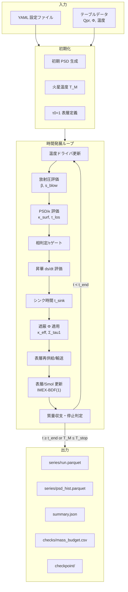
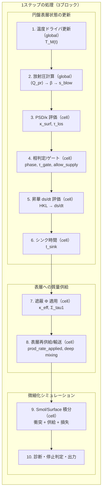
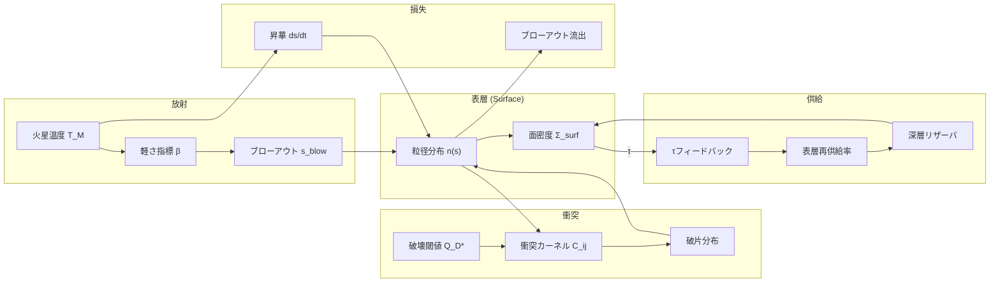
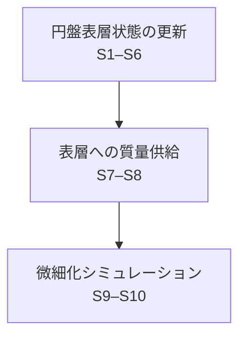
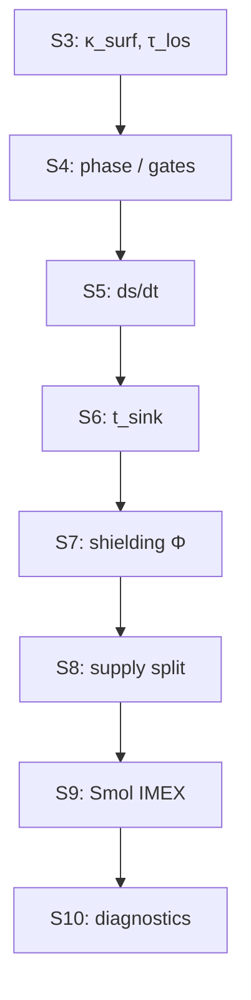
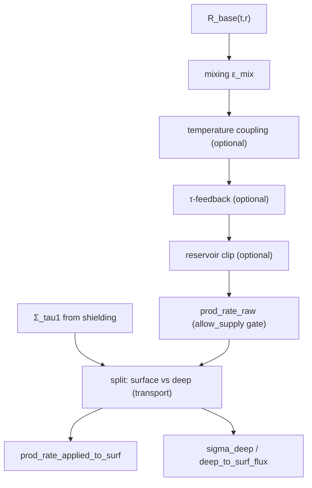
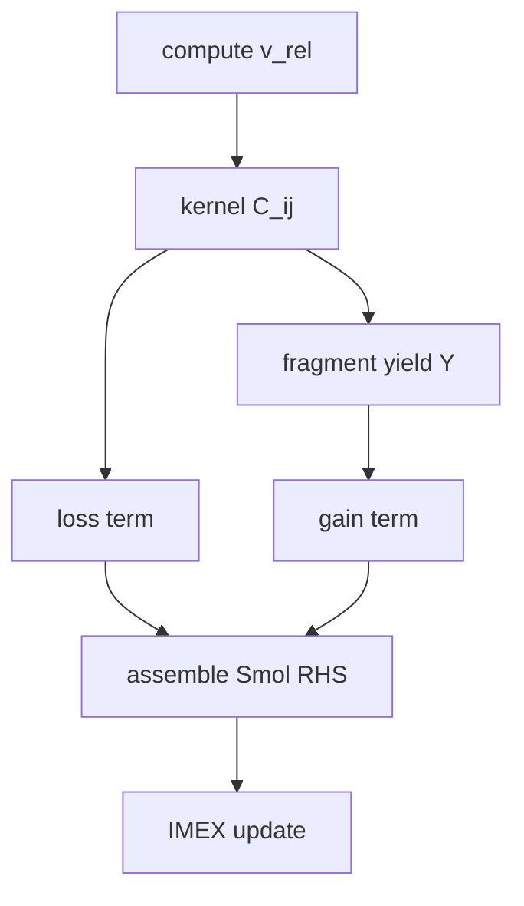
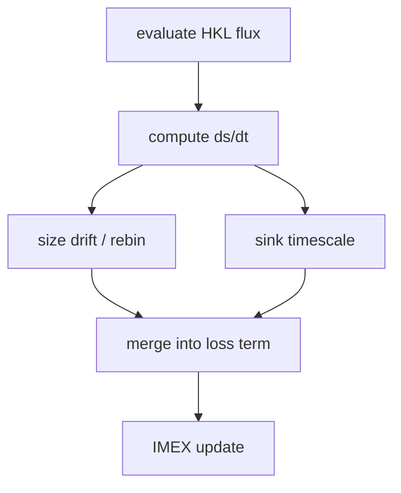

<!-- TEX_EXCLUDE_START -->
> **文書種別**: 手法（Diátaxis: Explanation）
<!-- TEX_EXCLUDE_END -->

<!--
実装(.py): marsdisk/run.py, marsdisk/run_zero_d.py, marsdisk/run_one_d.py, marsdisk/io/writer.py, marsdisk/io/streaming.py, marsdisk/io/diagnostics.py
-->

<!-- TEX_EXCLUDE_START -->
reference_links:
- @CanupSalmon2018_SciAdv4_eaar6887 -> paper/references/CanupSalmon2018_SciAdv4_eaar6887.pdf | 用途: 火星円盤の物理的前提（低質量円盤の文脈）
- @Hyodo2017a_ApJ845_125 -> paper/references/Hyodo2017a_ApJ845_125.pdf | 用途: 衝突起源円盤の前提条件と対象設定
- @Krivov2006_AA455_509 -> paper/references/Krivov2006_AA455_509.pdf | 用途: Smoluchowski衝突カスケードの枠組み
- @StrubbeChiang2006_ApJ648_652 -> paper/references/StrubbeChiang2006_ApJ648_652.pdf | 用途: 表層ブローアウトと衝突寿命の整理
<!-- TEX_EXCLUDE_END -->

# シミュレーション手法

## 1. シミュレーションの全体像

### 1.1 目的・出力・序論の目標との対応

本節では，ロッシュ限界内側に形成される高温ダスト円盤（内側円盤）を対象として，本研究で用いる数値シミュレーション手法の目的と出力を定義する．序論で整理した「遷移期に固有の追加シンク」を長期衛星形成モデルの初期条件へ受け渡すため，本手法が直接算出する物理量と出力ファイルの対応を明確にする．

本手法はガスが希薄な条件（gas-poor）を仮定し（[@Hyodo2017a_ApJ845_125; @CanupSalmon2018_SciAdv4_eaar6887]），粒径分布（particle size distribution; PSD）の時間発展と，表層に作用する放射圧による損失を同一のタイムループで結合して計算する．入力として，衝突直後計算が与える内側円盤質量 $M_{\rm in}(t_0)$（および半径方向分布）と初期粒径分布を受け取り，出力として放射圧損失率 $\dot{M}_{\rm RP}(t)$ と累積損失 $\Delta M_{\rm in}$ を返す．

ただし，長期モデルが既に含む除去過程（惑星への落下・ロッシュ限界外への供給）と二重計上しないよう，長期モデルへ渡す補正量は放射圧に起因する不可逆損失に限定する（定義は序論の式\ref{eq:delta_min_def}–\ref{eq:min_update}）．本研究では衝突直後計算の終端時刻を $t=t_0$ とし，以後の時間 $t$ は遷移期モデルの内部時刻として扱う．積分終端 $t_{\rm end}$ は照射の有効期間を表す入力パラメータであり，計算停止条件としても用いる．

遷移期モデルでは，火星の照射条件（火星温度 $T_{\rm Mars}(t)$；本章では実装上 $T_M(t)$ と略記する）から放射圧パラメータ β とブローアウト粒径 $s_{\rm blow}$ を評価し，PSD と光学的厚さ（とくに火星視線方向の $\tau_{\rm los}$）を更新する．さらに，二層近似に基づく表層の質量分率 $f_{\rm surf}$（序論で定義）と自遮蔽係数 $\Phi$ を通じて，放射圧損失率 $\dot{M}_{\rm RP}(t)$ を求める．PSD の時間発展は Smoluchowski 方程式に基づく衝突カスケードとして扱い（[@Krivov2006_AA455_509; @StrubbeChiang2006_ApJ648_652]），必要に応じて表層への再供給や昇華による粒径下限の更新を組み込む．

序論で整理した二つの目標と，本手法が直接生成する量・出力の対応を表\ref{tab:methods_questions_outputs}に示す．ここで「対応する出力」は，物理量そのものに加えて，解析で用いる時系列や終端要約を指す．保存する生成物（ファイル）との対応は付録Aにまとめる．

\begin{table}[t]
  \centering
  \caption{序論の目標と手法で直接生成する量の対応}
  \label{tab:methods_questions_outputs}
  \begin{tabular}{p{0.22\textwidth} p{0.34\textwidth} p{0.36\textwidth}}
    \hline
    序論の目標 & 手法で直接評価する量 & 対応する出力 \\
    \hline
    目標1: 表層PSDと遮蔽に基づく放射圧損失率の評価 &
    $\tau_{\rm los}(t)$，$f_{\rm surf}(t)$，$\Phi(t)$，$s_{\rm blow}(t)$，および放射圧損失率 $\dot{M}_{\rm RP}(t)$ &
    時系列（$\dot{M}_{\rm RP}(t)$，$\tau_{\rm los}(t)$，$s_{\rm blow}(t)$ など）と PSD 履歴（$N_k(t)$，$\Sigma_{\rm surf}(t)$） \\
    目標2: $\Delta M_{\rm in}$ と $M_{\rm in}'$ の更新 &
    $\Delta M_{\rm in}(t)=\int_{t_0}^{t}\dot{M}_{\rm RP}(t')dt'$ と終端値 $\Delta M_{\rm in}$，および更新後質量 $M_{\rm in}'$（序論の式\ref{eq:delta_min_def}–\ref{eq:min_update}） &
    終端要約（$\Delta M_{\rm in}$，$M_{\rm in}'$）と質量検査 $\epsilon_{\rm mass}(t)$（式\ref{eq:mass_budget_definition}） \\
    \hline
  \end{tabular}
\end{table}

本章は，初見の読者がモデルの因果と再現条件を追える順序で記述する．読み進め方は次の順序を推奨する．

- 前提と対象（1.2）
- 状態変数と定義（2.1）
- 支配式と物理過程（2.2–4.1）
- 数値解法と時間刻み制御（4.2）
- 出力・条件・検証（5.1）
- 付録（参照情報と補足資料）（付録A–E）

設定キーや運用コマンドのような実装依存の情報は付録に整理し，本文では物理モデルと時間発展の説明を優先する．略語は付録D（表\ref{tab:abbreviations}）にまとめる．

以上により，本節では序論の目標と出力の対応を定義した．次節以降では，これらの出力を規定する物理過程と数値解法を順に述べる．

---
### 1.2 研究対象と基本仮定

本モデルは gas-poor 条件下の**軸対称ディスク**を対象とし，半径方向に分割した 1D 計算を基準とする（[@Hyodo2017a_ApJ845_125; @CanupSalmon2018_SciAdv4_eaar6887; @Olofsson2022_MNRAS513_713]）．鉛直方向は面密度へ積分して扱うが，照射を受け得る表層と遮蔽された深部を区別する二層近似を採用する．光学的厚さは主に火星視線方向の $\tau_{\rm los}$ を用い，必要に応じて $\tau_{\rm los}=f_{\rm los}\tau_{\perp}$ から鉛直光学厚 $\tau_{\perp}$ を導出して補助的な時間尺度評価に用いる．粒径分布 $n(s)$ はサイズビンで離散化し，Smoluchowski 衝突カスケードと表層の放射圧損失（および補助過程としての昇華）を同一ループで結合する（[@Dohnanyi1969_JGR74_2531; @Krivov2006_AA455_509; @StrubbeChiang2006_ApJ648_652]）．

- 標準の物理経路では，Smoluchowski 方程式の時間発展を各半径セルで解き，毎ステップの質量収支検査によって数値誤差を監視する．計算順序は図\ref{fig:methods_main_loop}に従う．放射圧損失に関わる依存関係のみを抜粋すると，⟨$Q_{\rm pr}$⟩→β→$s_{\rm blow}$→遮蔽（$f_{\rm surf}$, $\Phi$）→供給→IMEX 更新→外向流束となる．
- 本研究の基準ケースはセル間結合を行わない 1D 局所進化であり，リング間の粘性拡散は長期モデル側の物理として扱う．したがって，長期モデルへ渡す $\Delta M_{\rm in}$ の評価では粘性拡散を無効化する．拡散項は感度試験としてのみ有効化し，基準結果とは分離して報告する．再現実行で保存する情報は付録A，設定→物理対応は付録Bを参照する．
- [@TakeuchiLin2003_ApJ593_524] に基づく gas-rich 表層 ODE は gas-poor 前提の標準設定では用いず，gas-rich 想定の感度試験でのみ有効化する（設定は付録Bを参照）．

1D は $r_{\rm in}$–$r_{\rm out}$ を $N_r$ セルに分割し，各セルの代表半径 $r_i$ で局所量を評価する．角速度 $\Omega(r)$ とケプラー速度 $v_K(r)$ は式\ref{eq:omega_definition}と式\ref{eq:vK_definition}で与え，ブローアウト滞在時間は式\ref{eq:t_blow_definition}の $t_{\rm blow}=1/\Omega$ を基準時間に用いる．粘性拡散を無効化した場合はセル間結合を行わず，半径方向の流束を解かない局所進化として扱う．

\begin{equation}
\label{eq:vK_definition}
v_K(r)=\sqrt{\frac{G\,M_{\mathrm{M}}}{r}}
\end{equation}

\begin{equation}
\label{eq:omega_definition}
\Omega(r)=\sqrt{\frac{G\,M_{\mathrm{M}}}{r^{3}}}
\end{equation}

\begin{equation}
\label{eq:t_blow_definition}
t_{\mathrm{blow}}=\frac{1}{\Omega}
\end{equation}

#### 1.2.1 物性モデル (フォルステライト)

物性は **フォルステライト** を基準として与える．密度・放射圧効率 $\langle Q_{\rm pr}\rangle$・昇華（HKL）の係数はフォルステライト値を採用する．一方，破壊閾値 $Q_D^*$ は BA99 の基準則を LS12 の速度補間で扱い，フォルステライト直系の $Q_D^*$ が未確定なため peridot projectile 実験の $Q^*$ を参照した係数スケーリングで proxy 化している（[@BenzAsphaug1999_Icarus142_5; @LeinhardtStewart2012_ApJ745_79; @Avdellidou2016_MNRAS464_734]）．$\rho$ と $\langle Q_{\rm pr}\rangle$ の感度掃引を想定し，実行時に採用した物性値・外部テーブル・物理トグルは付録Aの実行条件ログに記録する．

$\langle Q_{\rm pr}\rangle$ はテーブル入力（CSV/NPZ）を標準とし，Planck 平均の評価に用いる（[@BohrenHuffman1983_Wiley]）．遮蔽係数 $\Phi(\tau,\omega_0,g)$ もテーブル入力を基本とし，双線形補間で適用する（[@Joseph1976_JAS33_2452; @HansenTravis1974_SSR16_527; @CogleyBergstrom1979_JQSRT21_265]）．これらの外部入力の出典と採用値は，再現実行時に照合できるよう付録Aの保存情報に含める．

---
### 1.3 時間発展アルゴリズム

時間発展ループの全体像と処理順序を整理し，主要な依存関係を示す．

#### 1.3.0 支配方程式の位置づけ

本章では主要式を本文中に示し，式番号で参照する．記号の意味と単位は付録E（記号表）を参照する．

- **軌道力学と時間尺度**: $\Omega$, $v_K$ は式\ref{eq:omega_definition}と式\ref{eq:vK_definition}で定義し，$t_{\rm blow}$ の基準は式\ref{eq:t_blow_definition}に従う．放射圧の整理は [@Burns1979_Icarus40_1] を採用する．
- **衝突カスケード**: PSD の時間発展は Smoluchowski 方程式（式\ref{eq:smoluchowski}）で与え，質量収支は式\ref{eq:mass_budget_definition}で検査する．枠組みは [@Krivov2006_AA455_509; @Dohnanyi1969_JGR74_2531] に基づく．
- **破砕強度と破片生成**: 破壊閾値 $Q_D^*$ は LS12 補間を用い，式\ref{eq:qdstar_definition}で表す（[@BenzAsphaug1999_Icarus142_5; @LeinhardtStewart2012_ApJ745_79]）．
- **放射圧ブローアウト**: β と $s_{\rm blow}$ は式\ref{eq:beta_definition}–\ref{eq:s_blow_definition}で定義し，表層流出は式\ref{eq:surface_outflux}に依拠する．
- **昇華と追加シンク**: HKL フラックスと飽和蒸気圧は式\ref{eq:hkl_flux}と式\ref{eq:psat_definition}に基づき，昇華モデルの位置づけは [@Markkanen2020_AA643_A16] を参照する．
- **遮蔽と表層**: 自遮蔽係数 $\Phi$ の適用は式\ref{eq:kappa_eff_definition}–\ref{eq:phi_definition}で与え，gas-rich 条件の参照枠は [@TakeuchiLin2003_ApJ593_524] で位置づける．

以下の図は，入力（YAML/テーブル）から初期化・時間発展・診断出力に至る主経路を示す．ここでは概念的な依存関係の整理として示す．

#### 1.3.1 シミュレーション全体像

入力（設定ファイルとテーブル）から初期条件（PSD と $T_M$ など）を構成し，その後は「表層状態の評価→供給→IMEX 更新→診断と出力」を反復する．処理順序の要点は図\ref{fig:methods_main_loop}にまとめる．

<!-- TEX_EXCLUDE_START -->

<!-- TEX_EXCLUDE_END -->

#### 1.3.2 メインループ詳細

本研究で用いる時間発展アルゴリズムの処理順序（1ステップの3ブロック）を図\ref{fig:methods_main_loop}に示す．

\begin{figure}[t]
  \centering
  \includegraphics[width=\linewidth]{figures/thesis/methods_main_loop.pdf}
  \caption{時間発展アルゴリズムの処理順序（1ステップの3ブロック）}
  \label{fig:methods_main_loop}
\end{figure}

図\ref{fig:methods_main_loop}に対応する 1 ステップの更新順序を次に示す．

1. 温度ドライバから火星温度 $T_M(t)$ を更新する．
2. $\langle Q_{\rm pr}\rangle$ を評価し，β と $s_{\rm blow}$ を計算する（式\ref{eq:beta_definition}–\ref{eq:s_blow_definition}）．
3. PSD から $\kappa_{\rm surf}$ を評価し，$\tau_{\rm los}$ を計算する．
4. 相判定と光学的厚さに基づくゲートを評価し，供給・損失の適用可否を決める．
5. HKL に基づく昇華 ds/dt を評価し，必要なら PSD 下限 $s_{\min,\mathrm{eff}}$ を更新する．
6. 追加シンクの代表時間 $t_{\rm sink}$ を評価する．
7. 遮蔽係数 $\Phi$ を適用して $\kappa_{\rm eff}$ と $\Sigma_{\tau=1}$ を評価する（式\ref{eq:kappa_eff_definition}–\ref{eq:sigma_tau1_definition}）．
8. 表層再供給・深層輸送を適用し，表層に注入するソース項 $F_k$ を確定する．
9. 表層 ODE と Smoluchowski 方程式を IMEX-BDF(1) で時間積分し，PSD と $\Sigma_{\rm surf}$ を $\Delta t$ だけ更新する．
10. 診断量の集計，質量検査（式\ref{eq:mass_budget_definition}），停止判定を行い，出力を保存する．

<!-- TEX_EXCLUDE_START -->

<!-- TEX_EXCLUDE_END -->

補足: 損失項（ブローアウト・追加シンク）は S9 の IMEX 更新に含める．S4 では相判定と光学的厚さに基づくゲートにより有効な経路を選択し，S6 で追加シンクの代表時間 $t_{\rm sink}$ を評価する．S10 で診断量の集計，停止判定，および出力を行う．

図\ref{fig:methods_main_loop}は 1D + Smol の標準順序に合わせて記述する．まず「円盤表層状態の更新」（S1–S6）で $T_M$，β，$s_{\rm blow}$，$\kappa_{\rm surf}$，$\tau_{\rm los}$，相状態，昇華 ds/dt，$t_{\rm sink}$ を評価する．次に「表層への質量供給」（S7–S8）で遮蔽係数 $\Phi$ から $\kappa_{\rm eff}$ と $\Sigma_{\tau=1}$ を得て，供給を表層/深層へ配分し，表層への実効供給率を確定する．最後に「微細化シミュレーション」（S9–S10）で Smol/Surface の更新により PSD と $\Sigma_{\rm surf}$ を $\Delta t$ だけ進め，損失と診断を集約する．
以下，各節でこれらの更新に用いる式と仮定を順に述べる．

#### 1.3.3 物理過程の相互作用

図\ref{fig:methods_physics_interactions}に，主要な物理過程の相互作用とフィードバックの概念図を示す．

\begin{figure}[t]
  \centering
  \includegraphics[width=\linewidth]{figures/thesis/methods_physics_interactions.pdf}
  \caption{物理過程の相互作用と主要フィードバック（概念図）}
  \label{fig:methods_physics_interactions}
\end{figure}

<!-- TEX_EXCLUDE_START -->

<!-- TEX_EXCLUDE_END -->

主要状態変数は，サイズビン離散の粒径分布（形状 $n_k$ と数密度 $N_k$），表層面密度 $\Sigma_{\rm surf}$，深層リザーバ面密度 $\Sigma_{\rm deep}$，および累積損失量 $\Delta M_{\rm in}(t)$（放射圧起因；長期モデルへ渡す量）であり，時間発展ごとに同時更新される（[@Krivov2006_AA455_509]）．Smoluchowski 更新は $N_k$ を状態変数として時間積分し，更新後に $n_k$ へ写像して表層の診断量を評価する．

#### 1.3.4 供給・衝突・昇華の時系列因果

供給（supply）・衝突（collision）・昇華（sublimation）は同一ステップ内で相互依存するため，因果順序を図\ref{fig:methods_main_loop}の 3 ブロックに沿って固定する．すなわち「円盤表層状態の更新」（S1–S6）で $\tau_{\rm los}$・相状態・昇華 ds/dt・$t_{\rm sink}$ を評価し，「表層への質量供給」（S7–S8）で遮蔽 $\Phi$ と深層輸送を含む表層への実効注入量を確定し，最後に「微細化シミュレーション」（S9–S10）で IMEX 更新と診断集計を行う（[@WyattClarkeBooth2011_CeMDA111_1; @Krivov2006_AA455_509; @Markkanen2020_AA643_A16]）．

<!-- TEX_EXCLUDE_START -->


セル内の評価順序（概念）は次の通りである．



S3〜S10 の要点は次の通りである．

- S3: PSD から $\\kappa_{\\rm surf}$ を評価し，$\\tau_{\\rm los}$ を計算する．
- S4: 相判定とゲート（$\\tau_{\\rm gate}$，液相ブロック，`allow_supply`）を評価し，各経路を有効化する．
- S5: HKL に基づく昇華 ds/dt を評価する．
- S6: シンク時間 $t_{\\rm sink}$ を評価する．
- S7: 遮蔽 $\\Phi$ を適用して $\\kappa_{\\rm eff}$ と $\\Sigma_{\\tau=1}$ を評価する．
- S8: 名目供給に温度スケール・$\\tau$ フィードバック・有限リザーバ・深層輸送を適用し，表層への注入量 `prod_rate_applied` を決定する．
- S9: 衝突カーネルから loss/gain を構成し，供給と損失を含めた IMEX 更新を実施する．
- S10: 診断列は `smol_gain_mass_rate`, `smol_loss_mass_rate`, `ds_dt_sublimation`, `M_out_dot` を含む．ここで `M_out_dot` は放射圧損失率 $\dot{M}_{\rm RP}$ に対応する．質量収支を保存する．

##### 1.3.4.1 供給フロー（Supply）



- 診断列は `supply_rate_nominal` → `supply_rate_scaled` → `supply_rate_applied` に記録する（[@WyattClarkeBooth2011_CeMDA111_1]）．
- 深層経路は `prod_rate_diverted_to_deep`\newline `deep_to_surf_flux`\newline `prod_rate_applied_to_surf` に記録する．
- 供給の有効化は phase（solid）と液相ブロックで決まり，$\\tau_{\\rm gate}$ はブローアウトのみをゲートする．供給側のフィードバックは $\\tau_{\\rm los}$ を参照し，停止判定（$\\tau_{\\rm stop}$）とは区別して扱う．

##### 1.3.4.2 衝突フロー（Collision）



- 相対速度は $e,i$ と $c_{\\rm eq}$ から評価し，カーネル $C_{ij}$ を構成する（[@Ohtsuki2002_Icarus155_436; @WetherillStewart1993_Icarus106_190]）．
- loss は `smol_loss_mass_rate`，gain は `smol_gain_mass_rate` として診断される．
- 最小衝突時間 $t_{\\rm coll,\\,min}$ が $\\Delta t$ の上限に用いられる．
- 破片分布 $Y$ は PSD グリッド上で再配分され，質量保存は C4 により検査される（[@Krivov2006_AA455_509; @Thebault2003_AA408_775]）．

##### 1.3.4.3 昇華フロー（Sublimation）



- HKL フラックスから ds/dt を評価し，必要に応じて再ビニングで PSD を更新する（[@Markkanen2020_AA643_A16; @Pignatale2018_ApJ853_118]）．
- `sub_params.mass_conserving=true` の場合は $s<s_{\\rm blow}$ を跨いだ質量をブローアウトへ振り替える．
- 昇華由来の損失は `ds_dt_sublimation` と `mass_lost_sublimation_step` に出力される．
<!-- TEX_EXCLUDE_END -->

#### 1.4 小括

本節では，研究対象と基本仮定，状態変数の概略，および 1 ステップの更新順序を示した．次章では，本研究で追跡する状態量（粒径分布，表層面密度，光学的厚さなど）の定義を整理し，物理過程ごとの支配式を導入する．
<!--
実装(.py): marsdisk/run_zero_d.py, marsdisk/run_one_d.py, marsdisk/grid.py, marsdisk/io/tables.py, marsdisk/physics/psd.py, marsdisk/physics/sizes.py, marsdisk/physics/radiation.py, marsdisk/physics/shielding.py, marsdisk/physics/initfields.py
-->

<!-- TEX_EXCLUDE_START -->
reference_links:
- @Avdellidou2016_MNRAS464_734 -> paper/references/Avdellidou2016_MNRAS464_734.pdf | 用途: Q_D* スケーリングの proxy（peridot projectile）
- @BenzAsphaug1999_Icarus142_5 -> paper/references/BenzAsphaug1999_Icarus142_5.pdf | 用途: Q_D* の基準（BA99 係数）
- @Birnstiel2011_AA525_A11 -> paper/references/Birnstiel2011_AA525_A11.pdf | 用途: PSDビン分解能の指針（隣接粒径比）
- @BohrenHuffman1983_Wiley -> paper/references/BohrenHuffman1983_Wiley.pdf | 用途: Mie理論に基づくQ_pr平均の背景
- @CanupSalmon2018_SciAdv4_eaar6887 -> paper/references/CanupSalmon2018_SciAdv4_eaar6887.pdf | 用途: 火星円盤の背景条件（軸対称1Dの前提）
- @Dohnanyi1969_JGR74_2531 -> paper/references/Dohnanyi1969_JGR74_2531.pdf | 用途: 自己相似PSDの基準
- @Hyodo2017a_ApJ845_125 -> paper/references/Hyodo2017a_ApJ845_125.pdf | 用途: 初期PSDの溶融滴成分と円盤前提
- @Jutzi2010_Icarus207_54 -> paper/pdf_extractor/outputs/Jutzi2010_Icarus207_54/result.md | 用途: 初期PSDのべき指数（衝突起源）
- @Krivov2006_AA455_509 -> paper/references/Krivov2006_AA455_509.pdf | 用途: PSD離散化とSmoluchowski解法
- @LeinhardtStewart2012_ApJ745_79 -> paper/references/LeinhardtStewart2012_ApJ745_79.pdf | 用途: Q_D*補間（LS12）
- @Olofsson2022_MNRAS513_713 -> paper/references/Olofsson2022_MNRAS513_713.pdf | 用途: 高密度デブリ円盤の文脈
- @StrubbeChiang2006_ApJ648_652 -> paper/references/StrubbeChiang2006_ApJ648_652.pdf | 用途: 光学的厚さと表層t_coll定義
- @TakeuchiLin2003_ApJ593_524 -> paper/references/TakeuchiLin2003_ApJ593_524.pdf | 用途: gas-rich表層ODEの参照枠（既定無効）
- @WyattClarkeBooth2011_CeMDA111_1 -> paper/references/WyattClarkeBooth2011_CeMDA111_1.pdf | 用途: s_min床・供給注入の基準
<!-- TEX_EXCLUDE_END -->

## 2. 円盤表層状態の評価

本章では，巨大衝突後に形成される火星周回デブリ円盤のうち，放射圧および昇華に直接曝される「表層成分」を対象として，数値モデルで用いる状態変数と，表層質量損失過程の定式化を整理する．本研究では，表層の時間発展を（i）表層面密度の常微分方程式（表層 ODE）として近似する経路と，（ii）粒径分布を Smoluchowski 型方程式で追跡する経路（Smol 経路）を併用し，いずれの場合も共通の記号体系で記述する．

### 2.1 状態変数と定義

本節では，粒径分布（PSD）の離散化と，光学的厚さの定義を与える．以後，粒径は粒子半径 $s$（要確認：半径で統一）として表す．

#### 2.1.1 粒径分布 (PSD) グリッド

PSD は衝突カスケードの統計的記述に基づき，自己相似分布の枠組み [@Dohnanyi1969_JGR74_2531] と離散化の実装例 [@Krivov2006_AA455_509] を踏まえて対数ビンで表現する．隣接粒径比 $s_{k+1}/s_k \lesssim 1.1$–1.2 を目安に分解能を調整し（[@Birnstiel2011_AA525_A11]），ブローアウト近傍の波状構造（wavy）が数値的に解像できるようにする．

粒径ビン $k$ の代表半径を $s_k$，その粒子質量を $m_k$ とし，数面密度（単位面積当たり個数）を $N_k(t)$（m$^{-2}$）で表す．粒子のバルク密度を $\rho$ とすると，
\begin{equation}
\label{eq:mk_definition}
m_k=\frac{4\pi}{3}\rho s_k^3
\end{equation}
である．表層面密度 $\Sigma_{\rm surf}(t)$ は
\begin{equation}
\label{eq:sigma_surf_definition}
\Sigma_{\rm surf}(t)=\sum_k m_k N_k(t)
\end{equation}
で定義する．

PSD の「形状」と「規格化」を分離して扱うため，必要に応じて質量分率
\begin{equation}
\label{eq:nk_massfrac_definition}
n_k(t)=\frac{m_k N_k(t)}{\Sigma_{\rm surf}(t)}
\end{equation}
を導入する．このとき $\sum_k n_k=1$ が成り立ち，総質量変化（供給・昇華・ブローアウト）と，衝突による分布形状の再配分を明示的に分けて解釈できる（[@Krivov2006_AA455_509]）．

PSD 下限は有効最小粒径 $s_{\min,\mathrm{eff}}$ により与える．
\begin{equation}
\label{eq:smin_eff_definition}
s_{\min,\mathrm{eff}}=\max\!\left(s_{\min,\mathrm{cfg}},\,s_{\mathrm{blow,eff}}\right)
\end{equation}
ここで $s_{\min,\mathrm{cfg}}$ は計算設定で与える下限，$s_{\mathrm{blow,eff}}$ は放射圧により非束縛となる境界粒径である（定義は 2.2.2 節）．標準設定では，昇華境界 $s_{\rm sub}$ によって PSD 床を自動的に切り上げず，粒径収縮（$ds/dt$）として扱う（必要時のみ動的床を導入；設定は付録Bを参照）．

供給注入は PSD 下限より大きい最小ビンへ集約し，質量保存と面積率の一貫性を保つ（[@WyattClarkeBooth2011_CeMDA111_1; @Krivov2006_AA455_509]）．PSD グリッドのサイズ範囲・ビン境界・代表値定義などの既定値は付録B（表\ref{tab:psd_grid_defaults}）にまとめる．

#### 2.1.2 光学的厚さ $\tau$ の定義

光学的厚さは用途ごとに垂直方向（$\tau_\perp$）と火星視線方向（$\tau_{\rm los}$）を区別する（[@StrubbeChiang2006_ApJ648_652]）．まず，表層の質量不透明度（質量消散係数）$\kappa_{\rm surf}$ を
\begin{equation}
\label{eq:kappa_surf_definition}
\kappa_{\rm surf}
=\frac{1}{\Sigma_{\rm surf}}\sum_k \pi s_k^2 Q_{\rm ext}(s_k)\,N_k
\end{equation}
で定義する（$Q_{\rm ext}$ は消散効率；（要確認）実装で用いている効率の定義に合わせる）．このとき垂直方向の光学的厚さは
\begin{equation}
\label{eq:tau_perp_definition}
\tau_\perp=\kappa_{\rm surf}\Sigma_{\rm surf}
\end{equation}
となる．火星視線方向の光学的厚さは幾何因子 $f_{\rm los}$（= los\_factor）を用いて
\begin{equation}
\label{eq:tau_los_definition}
\tau_{\rm los}=f_{\rm los}\tau_\perp
\end{equation}
とする．$f_{\rm los}$ の定義と採用値は付録Bに示す（要確認）．

表層 ODE を用いる場合，衝突時間は $t_{\rm coll}=1/(\Omega\tau_\perp)$ とおく．ここで $\Omega$ は対象セル（半径 $r$）でのケプラー角速度である．Smol 経路では衝突カーネル側で $t_{\rm coll}$ を評価し，$\tau_{\rm los}$ は遮蔽・ゲート判定の診断量として用いる．

$\tau$ に関するゲート・停止・診断量は以下のように区別する．
- **$\tau_{\rm gate}$**：放射圧流出抑制のゲート．$\tau_{\rm los}\ge\tau_{\rm gate}$ の場合，放射圧による流出を抑制する（停止はしない）．標準設定では $\tau_{\rm gate}$ を用いず，感度試験でのみ導入する．
- **$\tau_{\rm stop}$**：計算停止の閾値．$\tau_{\rm los}>\tau_{\rm stop}$ でシミュレーションを終了する．
- **$\Sigma_{\tau=1}$**：有効不透明度から導く診断量（2.2.3 節）．初期化や診断に参照するが，標準の時間発展で $\Sigma_{\rm surf}$ を直接クリップしない．
- **$\tau_0=1$**：初期化のスケーリング目標であり，初期 PSD を $\tau=1$ に規格化して開始する場合に用いる（要確認：$\tau$ の方向を明記）．

---
### 2.2 熱・放射・表層損失

本節では，火星からの放射を駆動源とする放射圧ブローアウトと，昇華による粒径縮小・追加損失を定式化する．放射圧は古典的定式化 [@Burns1979_Icarus40_1] に基づき，光学特性は Mie 理論の整理 [@BohrenHuffman1983_Wiley] を踏まえて $\langle Q_{\rm pr}\rangle$ テーブルを用いる．遮蔽の参照枠は gas-rich 表層流出の議論 [@TakeuchiLin2003_ApJ593_524] を踏まえるが，本研究の標準設定は gas-poor 条件である．

#### 2.2.1 温度ドライバ

火星表面温度 $T_M(t)$ は，固定値・外部テーブル補間・解析的冷却モデルのいずれかで与える．分類を表\ref{tab:temp_driver_modes}に示す（[@Hyodo2018_ApJ860_150]）．

\begin{table}[t]
  \centering
  \caption{火星温度 $T_M(t)$ の与え方}
  \label{tab:temp_driver_modes}
  \begin{tabular}{p{0.22\textwidth} p{0.52\textwidth} p{0.18\textwidth}}
    \hline
    種別 & 内容 & 備考 \\
    \hline
    固定値 & 一定の $T_M$ を与える & 感度試験用 \\
    テーブル補間 & 外部テーブル $T_M(t)$ を補間する & 任意の冷却曲線 \\
    解析的冷却モデル & Stefan--Boltzmann 型（slab）または Hyodo 型の冷却を用いる & 文献ベース \\
    \hline
  \end{tabular}
\end{table}

温度は放射圧効率 $\langle Q_{\rm pr}\rangle$，昇華フラックス，相判定に入力される．採用した温度履歴と出典は再現実行ログ（付録A）に保存する．遮蔽係数 $\Phi$ は温度ドライバへはフィードバックしない（要確認：仮定の影響方向をどこかで言及）．

#### 2.2.2 放射圧・ブローアウト

粒子半径 $s$ に対する軽さ指標 $\beta(s)$ は
\begin{equation}
\label{eq:beta_definition}
\beta(s) = \frac{3\,\sigma_{\mathrm{SB}}\,T_{\mathrm{M}}^{4}\,R_{\mathrm{M}}^{2}\,\langle Q_{\mathrm{pr}}(s)\rangle}{4\,G\,M_{\mathrm{M}}\,c\,\rho\,s}
\end{equation}
で定義し，$\beta\ge 0.5$ を非束縛条件（ブローアウト）とする．$\langle Q_{\rm pr}\rangle$ は粒径と温度に依存するため，表から評価する．

ブローアウト境界粒径 $s_{\rm blow}$ は $\beta(s_{\rm blow})=0.5$ を満たす粒径として定義する（離散ビンでは，$\beta\ge 0.5$ のビンをブローアウト対象とする）．便宜上，$\langle Q_{\rm pr}\rangle$ を与えたときの形式解は
\begin{equation}
\label{eq:s_blow_definition}
s_{\mathrm{blow}} = \frac{3\,\sigma_{\mathrm{SB}}\,T_{\mathrm{M}}^{4}\,R_{\mathrm{M}}^{2}\,\langle Q_{\mathrm{pr}}\rangle}{2\,G\,M_{\mathrm{M}}\,c\,\rho}
\end{equation}
である．

ブローアウトによる流出の代表時間は
\begin{equation}
\label{eq:t_blow_definition}
t_{\rm blow}=\chi_{\rm blow}\Omega^{-1}
\end{equation}
とし，$\chi_{\rm blow}=1$ を既定とする（感度試験で調整）．

表層 ODE では，表層面密度の流出率を
\begin{equation}
\label{eq:surface_outflux}
\dot{\Sigma}_{\mathrm{out}} = \frac{\Sigma_{\mathrm{surf}}}{t_{\rm blow}}
\end{equation}
で近似する（要確認：ODE が表す $\Sigma_{\rm surf}$ の物理的意味を明記）．Smol 経路では $s \le s_{\rm blow}$ のビンに対して $S_{\rm blow}=1/t_{\rm blow}$ のシンクを適用し，
\begin{equation}
\label{eq:sigma_blow_definition}
\dot{\Sigma}_{\rm blow}=\sum_k m_k S_{{\rm blow},k} N_k
\end{equation}
を流出率として評価する．ゲート有効時は $\tau_{\rm los}$ により流出を抑制する．

#### 2.2.3 遮蔽 (Shielding)

遮蔽は，表層が光学的に厚い場合に放射場が弱められる効果を，二流・δ-Eddington 近似に基づく遮蔽係数 $\Phi$ により取り込む．$\Phi$ は
\begin{equation}
\label{eq:phi_definition}
\Phi=\Phi(\tau_{\rm los},\omega_0,g)
\end{equation}
の形で外部テーブルとして与え，双線形補間で評価する．ここで $\omega_0$ は単一散乱アルベド，$g$ は位相関数の非対称因子である（（要確認）実装では固定か可変かを明記）．

有効不透明度と，光学的厚さ1に相当する表層面密度を
\begin{equation}
\label{eq:kappa_eff_definition}
\kappa_{\mathrm{eff}} = \Phi\,\kappa_{\mathrm{surf}}
\end{equation}
\begin{equation}
\label{eq:sigma_tau1_definition}
\Sigma_{\tau=1} =
\begin{cases}
 \kappa_{\mathrm{eff}}^{-1}, & \kappa_{\mathrm{eff}} > 0,\\
 \infty, & \kappa_{\mathrm{eff}} \le 0
\end{cases}
\end{equation}
で定義し，$\Sigma_{\tau=1}$ は診断量として記録する．標準の時間発展では $\Sigma_{\rm surf}$ を直接クリップしない．

遮蔽の取り扱いは（i）テーブルから $\Phi$ を評価する方法，（ii）$\Sigma_{\tau=1}$ を固定する近似，（iii）遮蔽を無視する近似（$\Phi=1$）から選ぶ（設定は付録B）．停止条件は $\tau_{\rm los}>\tau_{\rm stop}$ とし，停止と状態量クリップは区別する．

#### 2.2.4 相判定 (Phase)

相（phase）は，表層が固体相（ダスト優勢）か蒸気相（ガス優勢）かを判定し，支配的な損失経路（放射圧ブローアウト／昇華・追加シンク）を切り替えるために導入する．判定には火星温度 $T_M$ と光学的厚さ（（要確認）$\tau_{\rm los}$ か $\tau_\perp$）を用い，フォルステライト冷却マップまたは閾値により分類する（要確認：マップ・閾値と出典を明記）．

固体相では放射圧ブローアウトが主要な損失経路となる．相判定は表層 ODE とシンク選択のゲートとして機能し，同一ステップ内でブローアウトと追加シンクは併用しない．

#### 2.2.5 昇華 (Sublimation) と追加シンク

昇華は HKL（Hertz--Knudsen--Langmuir）フラックスにより評価する（[@Markkanen2020_AA643_A16]）．飽和蒸気圧 $P_{\rm sat}(T)$ は Clausius 型の解析式またはテーブル補間で与える．（要確認：使用したパラメータと表の出典を物性表に集約）

HKL による質量フラックス $J(T)$（単位：kg m$^{-2}$ s$^{-1}$）は
\begin{equation}
\label{eq:hkl_flux}
J(T) =
 \alpha_{\mathrm{evap}}\max\!\bigl(P_{\mathrm{sat}}(T) - P_{\mathrm{gas}},\,0\bigr)
 \sqrt{\dfrac{\mu}{2\pi R T}}
\end{equation}
で与える．ここで $\alpha_{\rm evap}$ は蒸発係数，$\mu$ はモル質量，$R$ は気体定数，$P_{\rm gas}$ は周囲ガスの分圧である．本研究の基準設定では $P_{\rm gas}=0$ として扱う．

飽和蒸気圧は
\begin{equation}
\label{eq:psat_definition}
P_{\mathrm{sat}}(T) =
\begin{cases}
 10^{A - B/T}, & \text{Clausius 型},\\
 10^{\mathrm{PCHIP}_{\log_{10}P}(T)}, & \text{テーブル補間}.
\end{cases}
\end{equation}
で定義する．

粒径縮小は，球対称昇華を仮定して
\begin{equation}
\label{eq:dsdt_definition}
\frac{ds}{dt}=-\frac{J(T)}{\rho}
\end{equation}
として扱う．質量保存型の処理では $ds/dt$ を適用し，$s<s_{\rm blow}$ を跨いだ分はブローアウト損失へ振り替えて損失の二重計上を避ける．

昇華は PSD をサイズ方向にドリフトさせる過程として実装し，必要に応じて再ビニング（rebinning）を行う．損失項は IMEX 法の陰的ロスに含め，衝突ロスと同様に時間積分の安定性を確保する．（要確認：HKL 無効時の人工的な温度依存シンクは本文ではなく付録へ分離し，単位と目的を明記）

本章で定義した状態変数（PSD，$\tau$）と損失過程（ブローアウト，遮蔽，昇華）は，次章以降で述べる表層への再供給および衝突破砕（Smoluchowski 型）と結合して表層質量の時間発展を与える．
## 3. 表層への質量供給

<!--
実装(.py): marsdisk/run_zero_d.py, marsdisk/run_one_d.py, marsdisk/physics/supply.py, marsdisk/physics/phase.py, marsdisk/physics/shielding.py
-->

<!-- TEX_EXCLUDE_START -->
reference_links:
- @CanupSalmon2018_SciAdv4_eaar6887 -> paper/references/CanupSalmon2018_SciAdv4_eaar6887.pdf | 用途: 衝突条件と衝突角の範囲
- @Hyodo2017b_ApJ851_122 -> paper/references/Hyodo2017b_ApJ851_122.pdf | 用途: 非赤道円盤とJ2歳差スケール
- @WyattClarkeBooth2011_CeMDA111_1 -> paper/references/WyattClarkeBooth2011_CeMDA111_1.pdf | 用途: 供給率のパラメータ化
<!-- TEX_EXCLUDE_END -->

---
### 3.1 表層再供給と輸送

表層再供給（supply）は表層への面密度生成率として与え，サイズ分布と深層輸送を通じて PSD に注入する．ここでの表層再供給は外側からの流入を精密に表すものではなく，深部↔表層の入れ替わりを粗く表現するためのパラメータ化である．定常値・べき乗・テーブル・区分定義の各モードを用意し，温度・$\tau$ フィードバック・有限リザーバを組み合わせて非定常性を表現する（[@WyattClarkeBooth2011_CeMDA111_1]）．

先行研究は，Phobos/Deimos を形成しうる衝突条件として，Vesta-Ceres 級の衝突体による斜め衝突が必要であり，成功例が衝突角 30-60$^{\circ}$ に分布することを示している（[@CanupSalmon2018_SciAdv4_eaar6887]）．衝突前の火星が無視できない自転を持ち，その自転軸が衝突で与えられる角運動量ベクトルと一致しない場合，生成円盤の平均軌道面は火星赤道面から傾いた非赤道円盤になりうるため，粒子の軌道傾斜角（inclination, $i$）には平均値とばらつきが生じる（[@Hyodo2017b_ApJ851_122]）．さらに火星の扁平率 $J_2$ による節点歳差を考えると，$a\sim2-10\,R_{\rm Mars}$，$e\sim0.5-0.9$ の範囲では歳差の時間スケールが 1-100 年程度であり，傾斜角に依存する見積もりが与えられている（[@Hyodo2017b_ApJ851_122]）．したがって本研究が対象とする数年-10年の時間範囲では，衝突直後に生じた傾斜角のばらつきが残存し，その鉛直方向の運動が内部の物質を光が比較的通りやすい表層へ運び続ける過程が起こりうると考え，本研究ではこれを表層再供給としてパラメータ化して取り込む．具体的には，光学的厚さ $\tau\simeq1$ に対応する初期表層面密度 $\Sigma_{\tau=1,0}(r)$ を質量スケール，局所公転周期 $T_{\rm orb}(r)$（$T_{\rm orb}=2\pi/\Omega$）を時間スケールとして，1 公転あたりに $\Sigma_{\tau=1,0}$ の $f_{\rm orb}$ を補充する規格化を式\ref{eq:supply_target_orbit}で与える．

\begin{equation}
\label{eq:supply_target_orbit}
\dot{\Sigma}_{\rm target}(r)=\mu_{\rm orb} f_{\rm orb}\,\frac{\Sigma_{\tau=1,0}(r)}{T_{\rm orb}(r)}
\end{equation}

ここで $\mu_{\rm orb}$ は強度の不確かさを吸収する無次元パラメータである．以下では $\Sigma_{\tau=1,0}$ を $\Sigma_{\rm ref}$ として扱い，目標供給率 $\dot{\Sigma}_{\rm target}$ の基準面密度として用いる．

供給の基礎率は式\ref{eq:prod_rate_definition}で定義する（[@WyattClarkeBooth2011_CeMDA111_1]）．

\begin{equation}
\label{eq:prod_rate_definition}
\dot{\Sigma}_{\mathrm{prod}}(t,r) = \max\!\left(\epsilon_{\mathrm{mix}}\;R_{\mathrm{base}}(t,r),\,0\right)
\end{equation}

供給率の時間依存形は定常値・べき乗・外部テーブル・区分定義などから選び，温度依存・$\tau$ フィードバック・有限リザーバを組み合わせて非定常性を表現する（設定は付録Bを参照）．ここでの $\mu_{\rm orb}$ は供給強度の不確かさを吸収するパラメータであり，衝突速度外挿で用いる $\mu$ と混同しないよう区別する．

本研究の基準ケースでは定常供給を採り，参照光学的厚さ $\mu_{\rm ref}$（標準 $\mu_{\rm ref}=1$）に対応する基準面密度を式\ref{eq:supply_sigma_ref_mu}で定義する（$\Phi$ は遮蔽係数，遮蔽無効時は $\Phi=1$）．式\ref{eq:supply_target_orbit}の $\Sigma_{\tau=1,0}$ はこの基準面密度と同一視する．

\begin{equation}
\label{eq:supply_sigma_ref_mu}
\begin{aligned}
\Sigma_{\rm ref} &= \frac{\mu_{\rm ref}}{\kappa_{\rm eff,ref}\,\mathrm{los\_factor}},\\
\kappa_{\rm eff,ref} &= \Phi(\mu_{\rm ref})\,\kappa_{\rm surf}.
\end{aligned}
\end{equation}

混合係数 $\epsilon_{\rm mix}$ は供給の有効度を表し，感度掃引で代表値を変化させて影響を評価する（付録A）．

供給は「名目供給→混合（$\epsilon_{\mathrm{mix}}$）→温度スケール→$\tau$ フィードバック→有限リザーバ→深層/表層への配分」の順に評価される．供給が深層へ迂回した場合でも，表層面密度と PSD の更新は同一タイムステップ内で整合的に行われる．中間量の保存と再解析手順は付録Aにまとめる．

#### 3.1.1 フィードバック制御 (Supply Feedback)

$\tau$ 目標に追従する比例制御により，供給率をスケールさせることができる．フィードバックは供給ゲートの**上流**で適用し，$\tau_{\rm stop}$ 超過時は停止判定を優先する．設定項目は付録B（表\ref{tab:supply_feedback_settings}）にまとめる．

#### 3.1.2 温度カップリング (Supply Temperature)

火星温度に連動した供給スケーリングを有効化する場合は，基準温度 $T_{\rm ref}$ に対して $(T/T_{\rm ref})^{\alpha}$ のべき乗でスケールするか，外部テーブルから補間する．設定項目は付録B（表\ref{tab:supply_temperature_settings}）にまとめる．

#### 3.1.3 リザーバと深層ミキシング

有限質量リザーバを追跡し，供給を一旦深層に蓄積したうえで，ミキシング時間（公転数換算）で表層へ放出するモデルを用意する．$\tau$ が過大になった場合は停止判定で扱う．リザーバ枯渇時は供給をゼロにするか，残量に応じて漸減させるかを選ぶ．設定項目は付録Bにまとめる．

#### 3.1.4 注入パラメータ

注入パラメータは付録B（表\ref{tab:supply_injection_settings}）にまとめる．

注入モードは PSD 形状の境界条件として働くため，供給率とビン解像度の整合が重要である．感度試験では注入指数 $q$ と最小注入サイズを変化させ，ブローアウト近傍の wavy 構造や質量収支への影響を評価する．
## 4. 微細化シミュレーション

<!--
実装(.py): marsdisk/run_zero_d.py, marsdisk/run_one_d.py, marsdisk/physics/smol.py, marsdisk/physics/collisions_smol.py, marsdisk/physics/surface.py, marsdisk/physics/viscosity.py, marsdisk/io/checkpoint.py, marsdisk/io/streaming.py
-->

<!-- TEX_EXCLUDE_START -->
reference_links:
- @Hyodo2018_ApJ860_150 -> paper/references/Hyodo2018_ApJ860_150.pdf | 用途: 温度停止条件の基準
- @Krivov2006_AA455_509 -> paper/references/Krivov2006_AA455_509.pdf | 用途: IMEX-BDF1での衝突カスケード解法
- @StrubbeChiang2006_ApJ648_652 -> paper/references/StrubbeChiang2006_ApJ648_652.pdf | 用途: 初期τ=1スケーリング/表層t_coll尺度
<!-- TEX_EXCLUDE_END -->

---
### 4.1 衝突カスケードと破片生成

衝突カスケードは小粒子供給の主因であり，PSD の形状と供給率を同時に決める．統計的な衝突解法は Smoluchowski 方程式の枠組み [@Krivov2006_AA455_509] を基礎に置き，破砕強度は LS12 補間 [@LeinhardtStewart2012_ApJ745_79] を採用し，係数はフォルステライト想定で与える．

主要な PSD の時間発展は式\ref{eq:smoluchowski}で与える．

\begin{equation}
\label{eq:smoluchowski}
\dot{N}_k = \sum_{i\le j} C_{ij}\,\frac{m_i+m_j}{m_k}\,Y_{kij} - \left(\sum_j C_{kj} + C_{kk}\right) + F_k - S_k N_k
\end{equation}

右辺第1項が破片生成，第2項が衝突ロス，$F_k$ が供給ソース，$S_k$ が追加シンク（昇華・ガス抗力など）を表す．

ここで $Y_{kij}$ は，衝突 $(i,j)$ で失われた質量 $(m_i+m_j)$ がサイズビン $k$ に配分される質量分率（破片生成テンソル）であり，
\begin{equation}
\label{eq:fragment_yield_normalization}
\sum_k Y_{kij}=1
\end{equation}
を満たすように正規化する．このとき第1項は，衝突率 $C_{ij}$ に対し，ビン $k$ に入る質量 $(m_i+m_j)Y_{kij}$ を粒子数へ換算した生成項を与える．

$F_k$ は表層への質量供給（第3章）をサイズビンへ配分したソース項であり，面数密度 $N_k$ に対する注入率（$\mathrm{m^{-2}\,s^{-1}}$）として与える．
$S_k$ は昇華・ブローアウトなど追加シンクをまとめた実効ロス率（$\mathrm{s^{-1}}$）であり，$-S_k N_k$ の一次ロスとして扱う．

#### 4.1.1 衝突カーネル

nσv 型カーネルを用い，相対速度は Rayleigh 分布を仮定して導出する（[@LissauerStewart1993_PP3; @WetherillStewart1993_Icarus106_190; @Ohtsuki2002_Icarus155_436; @ImazBlanco2023_MNRAS522_6150; @IdaMakino1992_Icarus96_107]）．カーネルの定義は式\ref{eq:collision_kernel}に示す．

\begin{equation}
\label{eq:collision_kernel}
C_{ij} = \frac{N_i N_j}{1+\delta_{ij}}\,
\frac{\pi\,(s_i+s_j)^{2}\,v_{ij}}{\sqrt{2\pi}\,H_{ij}},
\qquad H_{ij} = \sqrt{H_i^{2}+H_j^{2}}
\end{equation}

相対速度 $v_{ij}$ は局所の $v_K$ と，離心率・傾斜角の分散 $(e,i)$ から式\ref{eq:vij_definition}で評価する．

\begin{equation}
\label{eq:vij_definition}
v_{ij}=v_{K}\,\sqrt{1.25\,e^{2}+i^{2}}
\end{equation}

破壊閾値 $Q_D^*$ は LS12 補間に従い，モデル内では次式の形で表す．

\begin{equation}
\label{eq:qdstar_definition}
Q_{D}^{*}(s,\rho,v) = Q_{\mathrm{str}}(v) + Q_{\mathrm{grav}}(v)\,S(v)
\end{equation}

- 破壊閾値 $Q_D^*$: [@LeinhardtStewart2012_ApJ745_79] 補間（式\ref{eq:qdstar_definition}）
- 速度分散: せん断加熱と減衰の釣り合いから $c_{\rm eq}$ を固定点反復で求め，相対速度に反映する（[@Ohtsuki2002_Icarus155_436]）
- 速度外挿: 重力項のみ LS09 型 $v^{-3\mu+2}$ で拡張（[@StewartLeinhardt2009_ApJ691_L133; @Jutzi2010_Icarus207_54]）
- ここでの $\mu$ は衝突速度外挿（LS09）の係数であり，供給式で用いる無次元係数（第3章）とは別物として扱う．

衝突カーネルはサイズビン対ごとに衝突率 $C_{ij}$ を評価し，衝突ロス項と破片生成項を形成する．動力学パラメータ（$e, i$）は表層状態と供給の速度条件を反映して更新され，$C_{ij}$ の評価に反映される．

S9 の衝突更新では，$C_{ij}$ から各ビンの衝突寿命 $t_{\rm coll}$ と loss/gain を算定し，破片分布テンソル $Y$ に基づいて生成項を配分する．$t_{\rm coll}$ の最小値は $\Delta t$ の上限制御に用いられ，ビンごとの質量収支が質量検査で追跡される．破片生成は PSD 下限のビン境界条件と整合させ，供給注入と同一のビン系で質量保存を保証する．

#### 4.1.2 衝突レジーム分類

衝突は **最大残存率 $F_{LF}$** に基づいて2つのレジームに分類する．レジームの条件と処理は次の表にまとめる．

\begin{table}[t]
  \centering
  \caption{衝突レジームの分類と処理}
  \label{tab:collision_regimes}
  \begin{tabular}{p{0.28\textwidth} p{0.2\textwidth} p{0.42\textwidth}}
    \hline
    レジーム & 条件 & 処理 \\
    \hline
    侵食（cratering） & $F_{LF} > 0.5$ & ターゲット残存，クレーター破片生成 \\
    壊滅的破砕（fragmentation） & $F_{LF} \le 0.5$ & 完全破壊，破片分布 $g(m) \propto m^{-\eta}$ \\
    \hline
  \end{tabular}
\end{table}

- Thébault et al. (2003) に基づく侵食モデル（[@Thebault2003_AA408_775]）
- [@Krivov2006_AA455_509] に基づく壊滅的破砕モデル
- 破砕境界と最大残存率の分岐式は [@StewartLeinhardt2009_ApJ691_L133; @LeinhardtStewart2012_ApJ745_79] に従う
- 破片分布はビン内積分で質量保存を満たすように正規化し，供給・破砕由来の面密度が一貫するように設計する．

破砕生成物はフラグメント分布テンソル $Y$ を通じて各ビンに再配分され，Smoluchowski 解法の gain 項として更新される．侵食レジームでは質量が大粒径側に残存し，小粒径への供給は限定的となる．

#### 4.1.3 エネルギー簿記

衝突エネルギーの診断は，デブリ円盤の衝突カスケード研究で用いられる散逸・残存の整理に倣って行う（[@Thebault2003_AA408_775]）．各ステップで相対運動エネルギー $E_{\rm rel}$ と，そのうち熱化して散逸した成分 $E_{\rm diss}$，残留した成分 $E_{\rm retained}$ を評価し，衝突速度場の妥当性と数値安定性の確認に用いる．散逸は係数 $f_{ke}$ を用いて

\[
E_{\rm diss} = (1 - f_{ke})\,E_{\rm rel}
\]

と定義する．エネルギー簿記は診断専用であり，時間発展のフィードバックには用いない．保存項目の詳細は付録A，関連パラメータは付録B（表\ref{tab:energy_settings}）にまとめる．

---
### 4.2 数値解法と停止条件

#### 4.2.1 IMEX-BDF(1)

Smoluchowski 衝突カスケードの時間積分には IMEX（implicit-explicit）と BDF(1)（backward differentiation formula）の一次組合せを採用する（[@Krivov2006_AA455_509]）．状態ベクトルはサイズビン $k$ ごとの数密度（または面密度）で表現し，衝突ゲイン・ロスと表層再供給・シンクを同時に組み込む．剛性の強いロス項を陰的に扱うことで安定性を確保し，生成・供給・表層流出は陽的に更新する．

IMEX の分割は次の通りである．

- **損失項（陰的）**: 衝突ロス，ブローアウト損失（$s \le s_{\rm blow}$），追加シンク（代表時間 $t_{\rm sink}$）．
- **生成項（陽的）**: 衝突による破片生成と表層再供給（ソース項 $F_k$）．

外側の結合ステップ幅を $\Delta t$ とし，温度・遮蔽・供給・相判定などは同じ $\Delta t$ で更新する．IMEX ソルバ内部では $dt_{\rm eff}\le\Delta t$ を用い，負の数密度や質量誤差が生じる場合には $dt_{\rm eff}$ を縮小して再評価する．時間刻みは代表衝突時間とブローアウト滞在時間を解像するよう制約し，表\ref{tab:validation_criteria}の収束・安定性確認に基づき，外側の結合ステップ幅を $\Delta t\le 0.1\min_k t_{{\rm coll},k}$ とした．質量検査は式\ref{eq:mass_budget_definition}で定義し，許容誤差は同表に従い $0.5\\%$ とした．質量検査ログと主要診断量の保存は付録Aにまとめる．

質量検査は，更新前後のビン総面密度と，供給（$\dot{\Sigma}_{\rm prod}$）および追加シンク由来の損失を比較して定義する．

\begin{equation}
\label{eq:mass_budget_definition}
\begin{aligned}
 \Sigma^{n} &= \sum_k m_k N_k^{n}, & \Sigma^{n+1} &= \sum_k m_k N_k^{n+1},\\
 \Delta\Sigma &= \Sigma^{n+1} + \Delta t\,\dot{\Sigma}_{\mathrm{extra}} - \left(\Sigma^{n} + \Delta t\,\dot{\Sigma}_{\mathrm{prod}}^{(<s_{\mathrm{blow}})}\right),\\
 \epsilon_{\mathrm{mass}} &= \frac{|\Delta\Sigma|}{\Sigma^{n}}.
\end{aligned}
\end{equation}

IMEX-BDF(1) は剛性ロス項で負の数密度が生じるのを防ぐため，ロス項を陰的に扱う設計とする．$N_k<0$ が検出された場合は $dt_{\rm eff}$ を半減して再評価し，許容誤差内の質量検査を満たした $dt_{\rm eff}$ が採用される．陽的に扱う生成項は衝突の破片生成と供給注入に限定し，質量保存は質量検査で逐次確認する．

S9 の数値更新では，衝突ロス・ブローアウト・追加シンクを陰的側に集約し，衝突生成・供給注入を陽的に与える．$\Delta t$ は $t_{\rm coll}$ と $t_{\rm blow}$ の双方を解像するよう制約し，必要に応じて内部ステップ幅 $dt_{\rm eff}$ を用いた再評価で安定性と質量保存を担保する．

#### 4.2.2 1D（半径方向拡散）挿入位置・境界条件・$\Delta t$ 制約

標準設定では半径方向を $N_r=32$ セルに分割し，各セルで局所進化を計算する．半径方向の粘性拡散は標準では無効とし，必要時のみ演算子分割で追加する．粘性拡散を有効化する場合は，各ステップの局所更新後に半径方向の拡散方程式を解く．

- **境界条件**: 内外端ともにゼロフラックス（Neumann）境界を採用する．
- **$\Delta t$ 制約**: 粘性拡散は $\theta$ 法（既定 $\theta=0.5$ の Crank–Nicolson）で半陰的に解くため，追加の安定制約は課さない．時間刻みは衝突時間とブローアウト時間に基づく制約に従う．
- **有効化条件**: 粘性拡散を含めるかどうかは感度試験として切り替え，設定は付録Bにまとめる．

粘性拡散は半径方向の面密度拡散を解くため，1D 実行のセル間結合を担当する．数値的には三重対角系の解として実装され，境界条件により質量フラックスの流出入を抑制する．

---
#### 4.2.3 初期化・終了条件・チェックポイント

##### 4.2.3.1 初期 $\tau=1$ スケーリング

初期 PSD は，指定した総質量または光学的厚さ（代表として $\tau_0=1$）になるように正規化して与える．$\tau_0=1$ スケーリングでは，$\tau_{\rm los}$ または $\tau_{\perp}$ の目標値から $\Sigma_{\rm surf,0}$ を定め，PSD を一様にスケールする（[@StrubbeChiang2006_ApJ648_652]）．初期条件と採用値は再現実行ログに保存する（付録A）．関連パラメータは付録B（表\ref{tab:init_tau1_settings}）にまとめる．

##### 4.2.3.2 温度停止 (Temperature Stop)

停止条件は (i) 温度停止（$T_M(t)\le T_{\rm stop}$ で終了），(ii) 固定の解析期間 $t_{\rm end}$，(iii) 固定公転数のいずれかで与える．併用時の優先順位は「温度停止 → 公転数 → 年数」とし，未指定の場合は解析期間 2 年を既定とする（[@Hyodo2018_ApJ860_150]）．温度停止では冷却達成後にマージン時間を追加でき，探索の上限時間も設定できる（設定は付録B）．

##### 4.2.3.3 チェックポイント (Segmented Run)

長時間実行をセグメント化し，一定間隔で中間状態（チェックポイント）を保存して再開可能にする．保存間隔は代表値として約 30 日（0.083 年）を用い，直近の複数個のみ保持してディスク使用量を制限する（設定は付録B）．

---
#### 4.3 小括

本節では，衝突カスケードの支配式（式\ref{eq:smoluchowski}）と，それを安定に時間積分する数値解法（IMEX-BDF(1)），ならびに時間刻み制御と停止条件を定義した．これらの設定により，負の数密度を回避しつつ質量保存を監視し，表\ref{tab:validation_criteria}の基準に基づいて収束性と安定性を担保する．次節では，出力定義と検証基準を整理し，本論文で提示する結果が合格基準を満たすことを述べる．
## 5. 再現性（出力・検証・運用）

<!--
実装(.py): marsdisk/run.py, marsdisk/run_zero_d.py, marsdisk/run_one_d.py, marsdisk/io/writer.py, marsdisk/io/streaming.py, marsdisk/io/diagnostics.py, marsdisk/io/checkpoint.py, marsdisk/io/archive.py, marsdisk/archive.py
-->

<!-- TEX_EXCLUDE_START -->
reference_links:
- @Krivov2006_AA455_509 -> paper/references/Krivov2006_AA455_509.pdf | 用途: 衝突カスケード検証と出力診断の基準
- @StrubbeChiang2006_ApJ648_652 -> paper/references/StrubbeChiang2006_ApJ648_652.pdf | 用途: t_collスケール検証
- @ThebaultAugereau2007_AA472_169 -> paper/references/ThebaultAugereau2007_AA472_169.pdf | 用途: wavy PSD の検証（wavy有効時）
<!-- TEX_EXCLUDE_END -->

---
### 5.1 出力と検証

#### 5.1.1 出力・I/O・再現性

時間発展の各ステップで，主要なスカラー量（$T_M$, $\tau_{\rm los}$, $s_{\rm blow}$, $s_{\min,\mathrm{eff}}$, $\Sigma_{\rm surf}$, 表層への供給率, 表層流出 $\dot{\Sigma}_{\rm out}$ と総流出率 $\dot{M}_{\rm out}$, 各損失の累積）と，PSD 履歴 $N_k(t)$ を保存し，後段の解析・可視化で再構成できるようにする（[@Krivov2006_AA455_509]）．また，毎ステップの質量検査（式\ref{eq:mass_budget_definition}）を記録し，許容誤差内で質量保存が成り立つことを確認する．出力形式・保存先・主要項目の一覧は付録Aにまとめる．

累積損失 $M_{\rm loss}$ は放射圧ブローアウトによる流出と追加シンクによる損失の和として定義し，外側の結合ステップ幅 $\Delta t$ ごとに逐次積算する．

\begin{equation}
\label{eq:mass_loss_update}
M_{\rm loss}^{n+1}=M_{\rm loss}^{n}+\Delta t\left(\dot{M}_{\rm out}^{n}+\dot{M}_{\rm sinks}^{n}\right)
\end{equation}

ここで $\dot{M}_{\rm sinks}$ は昇華など追加シンクによる質量損失率である．

大規模計算では逐次書き出しによりメモリ使用を抑えるが，保存される物理量と検証ログは I/O 方式に依存しない設計とする．実行条件（入力設定，外部テーブル，採用パラメータ，乱数シード，バージョン情報）も併せて保存し，再解析時の基準とする（付録A）．

<!-- TEX_EXCLUDE_START -->
実装では I/O ストリーミングを既定で ON とし（`memory_limit_gb=10`, `step_flush_interval=10000`, `merge_at_end=true`），大規模スイープで逐次フラッシュによりメモリを抑える．運用の既定スイープでは，各ケースを `BATCH_ROOT`（`OUT_ROOT` があればそれを使用）配下の `SWEEP_TAG/<RUN_TS>__<GIT_SHA>__seed<BATCH_SEED>/<case_title>/` に保存する．
<!-- TEX_EXCLUDE_END -->

---
#### 5.1.2 検証手順

##### 5.1.2.1 検証項目・合格基準・結果

本研究では，モデルの因果と数値解法の妥当性を表\ref{tab:validation_criteria}の基準で検証した．本論文で提示する結果は，全てこれらの基準を満たすことを確認したケースに限定する．

\begin{table}[t]
  \centering
  \caption{検証項目と合格基準（本論文で提示する結果は全て合格）}
  \label{tab:validation_criteria}
  \begin{tabular}{p{0.26\textwidth} p{0.58\textwidth} p{0.08\textwidth}}
    \hline
    検証項目 & 合格基準（許容誤差） & 判定 \\
    \hline
    質量保存 &
    相対質量誤差 $|\epsilon_{\rm mass}|$（式\ref{eq:mass_budget_definition}）の最大値が $0.5\%$ 以下 &
    合格 \\
    衝突寿命スケーリング &
    $t_{\rm coll}^{\rm est}=T_{\rm orb}/(4\pi\tau_{\perp})$ とモデル内の代表衝突時間 $t_{\rm coll}$ が同程度（比が $0.1$–$10$ の範囲；[@StrubbeChiang2006_ApJ648_652]） &
    合格 \\
    “wavy” PSD &
    ブローアウト即時除去を含めた場合に，$s_{\rm blow}$ 近傍で隣接ビンの過不足が交互に現れること（定性的；[@ThebaultAugereau2007_AA472_169]） &
    合格 \\
    IMEX の安定性と収束 &
    IMEX-BDF(1)（loss 陰・gain 陽）が負の数密度を回避し，$\Delta t\le0.1\min_k t_{\rm coll,k}$ の条件で主要診断量が収束する（[@Krivov2006_AA455_509]） &
    合格 \\
    \hline
  \end{tabular}
\end{table}

これらの基準は，設定変更後の回帰検証にも用いる．検証結果の提示形式として，代表ケースにおける質量検査 $\epsilon_{\rm mass}(t)$ の時系列を付録Aの図\ref{fig:validation_mass_budget_example}に示す．

<!-- TEX_EXCLUDE_START -->
##### 5.1.2.1a リポジトリ運用（自動テスト）

```bash
pytest tests/ -q
```
<!-- TEX_EXCLUDE_END -->

<!-- TEX_EXCLUDE_START -->
##### 5.1.2.2 実行後の数値チェック（推奨）

- `summary.json` の `mass_budget_max_error_percent` が 0.5% 以内であること．
- `series/run.parquet` の `dt_over_t_blow` が 1 未満に収まっているかを確認する．\newline 超過時は `fast_blowout_flag_*` と併せて評価する．
- 衝突が有効なケースでは `smol_dt_eff < dt` が成立し，`t_coll_kernel_min` と一貫しているかを確認する．
<!-- TEX_EXCLUDE_END -->

<!-- TEX_EXCLUDE_START -->
##### 5.1.2.3 ドキュメント整合性

```bash
make analysis-sync      # DocSync
make analysis-doc-tests # アンカー健全性・参照率検査
python -m tools.evaluation_system --outdir <run_dir>  # Doc 更新後に直近の out/* を指定
```

- **詳細**: analysis/overview.md §16 "DocSync/検証フローの固定"
<!-- TEX_EXCLUDE_END -->


---
<!-- TEX_EXCLUDE_START -->
### 5.2 先行研究リンク

- 温度ドライバ: [Hyodo et al. (2018)](../paper/pdf_extractor/outputs/Hyodo2018_ApJ860_150/result.md)
- gas-poor/衝突起源円盤の文脈:\newline
  [Hyodo et al. (2017a)](../paper/pdf_extractor/outputs/Hyodo2017a_ApJ845_125/result.md)\newline
  [Canup & Salmon (2018)](../paper/pdf_extractor/outputs/CanupSalmon2018_SciAdv4_eaar6887/result.md)\newline
  [Olofsson et al. (2022)](../paper/pdf_extractor/outputs/Olofsson2022_MNRAS513_713/result.md)
- 放射圧・ブローアウト:\newline
  [Burns et al. (1979)](../paper/pdf_extractor/outputs/Burns1979_Icarus40_1/result.md), [Strubbe & Chiang (2006)](../paper/pdf_extractor/outputs/StrubbeChiang2006_ApJ648_652/result.md)\newline
  [Takeuchi & Lin (2002)](../paper/pdf_extractor/outputs/TakeuchiLin2002_ApJ581_1344/result.md), [Takeuchi & Lin (2003)](../paper/pdf_extractor/outputs/TakeuchiLin2003_ApJ593_524/result.md)\newline
  [Shadmehri (2008)](../paper/pdf_extractor/outputs/Shadmehri2008_ApSS314_217/result.md)
- PSD/衝突カスケード:\newline
  [Dohnanyi (1969)](../paper/pdf_extractor/outputs/Dohnanyi1969_JGR74_2531/result.md)\newline
  [Krivov et al. (2006)](../paper/pdf_extractor/outputs/Krivov2006_AA455_509/result.md)\newline
  [Thébault & Augereau (2007)](../paper/pdf_extractor/outputs/ThebaultAugereau2007_AA472_169/result.md)
- 供給・ソース/損失バランス: [Wyatt, Clarke & Booth (2011)](../paper/pdf_extractor/outputs/WyattClarkeBooth2011_CeMDA111_1/result.md)
- 初期 PSD:\newline
  [Hyodo et al. (2017a)](../paper/pdf_extractor/outputs/Hyodo2017a_ApJ845_125/result.md)\newline
  [Jutzi et al. (2010)](../paper/pdf_extractor/outputs/Jutzi2010_Icarus207_54/result.md)
- 速度分散:\newline
  [Ohtsuki et al. (2002)](../paper/pdf_extractor/outputs/Ohtsuki2002_Icarus155_436/result.md)\newline
  [Lissauer & Stewart (1993)](../paper/pdf_extractor/outputs/LissauerStewart1993_PP3/result.md)\newline
  [Wetherill & Stewart (1993)](../paper/pdf_extractor/outputs/WetherillStewart1993_Icarus106_190/result.md)\newline
  [Ida & Makino (1992)](../paper/pdf_extractor/outputs/IdaMakino1992_Icarus96_107/result.md)\newline
  [Imaz Blanco et al. (2023)](../paper/pdf_extractor/outputs/ImazBlanco2023_MNRAS522_6150/result.md)
- 破砕強度・最大残存率:\newline
  [Benz & Asphaug (1999)](../paper/pdf_extractor/outputs/BenzAsphaug1999_Icarus142_5/result.md)\newline
  [Leinhardt & Stewart (2012)](../paper/pdf_extractor/outputs/LeinhardtStewart2012_ApJ745_79/result.md)\newline
  [Stewart & Leinhardt (2009)](../paper/pdf_extractor/outputs/StewartLeinhardt2009_ApJ691_L133/result.md)
- 遮蔽 (Φ):\newline
  [Joseph et al. (1976)](../paper/pdf_extractor/outputs/Joseph1976_JAS33_2452/result.md)\newline
  [Hansen & Travis (1974)](../paper/pdf_extractor/outputs/HansenTravis1974_SSR16_527/result.md)\newline
  [Cogley & Bergstrom (1979)](../paper/pdf_extractor/outputs/CogleyBergstrom1979_JQSRT21_265/result.md)
- 光学特性: [Bohren & Huffman (1983)](../paper/pdf_extractor/outputs/BohrenHuffman1983_Wiley/result.md)
- 昇華:\newline
  [Markkanen & Agarwal (2020)](../paper/pdf_extractor/outputs/Markkanen2020_AA643_A16/result.md)\newline
  [Kubaschewski (1974)](../paper/pdf_extractor/outputs/Kubaschewski1974_Book/result.md)\newline
  [Fegley & Schaefer (2012)](../paper/pdf_extractor/outputs/FegleySchaefer2012_arXiv/result.md)\newline
  [Visscher & Fegley (2013)](../paper/pdf_extractor/outputs/VisscherFegley2013_ApJL767_L12/result.md)\newline
  [Pignatale et al. (2018)](../paper/pdf_extractor/outputs/Pignatale2018_ApJ853_118/result.md)\newline
  [Ronnet et al. (2016)](../paper/pdf_extractor/outputs/Ronnet2016_ApJ828_109/result.md)\newline
  [Melosh (2007)](../paper/pdf_extractor/outputs/Melosh2007_MPS42_2079/result.md)

- 参照インデックス: [paper/abstracts/index.md](../paper/abstracts/index.md)\newline
  [analysis/references.registry.json](../analysis/references.registry.json)
<!-- TEX_EXCLUDE_END -->


---
### 付録 A. 再現実行と保存情報

<!--
実装(.py): scripts/runsets/windows/preflight_checks.py, scripts/runsets/common/read_overrides_cmd.py, scripts/runsets/common/read_study_overrides.py, scripts/runsets/common/write_base_overrides.py, scripts/runsets/common/write_sweep_list.py, scripts/runsets/common/build_overrides.py, scripts/runsets/common/next_seed.py, scripts/runsets/common/calc_parallel_jobs.py, scripts/runsets/common/calc_cell_jobs.py, scripts/runsets/common/calc_cpu_target_jobs.py, scripts/runsets/common/calc_thread_limit.py, scripts/tests/measure_case_output_size.py, scripts/runsets/common/run_one.py, scripts/runsets/common/run_sweep_worker.py, scripts/runsets/common/hooks/plot_sweep_run.py, scripts/runsets/common/hooks/evaluate_tau_supply.py, scripts/runsets/common/hooks/archive_run.py, scripts/runsets/common/hooks/preflight_streaming.py, marsdisk/run.py
-->

本研究の再現性は，(i) 入力（設定ファイルとテーブル）を固定し，(ii) 実行時に採用された値と条件を保存し，(iii) 時系列・要約・検証ログを保存することで担保する．本付録では，論文として最低限必要な「保存すべき情報」をまとめる．

#### A.1 固定する入力（再現の前提）

- **設定（YAML）**: 物理スイッチ，初期条件，時間刻み，停止条件，感度掃引の対象パラメータ．
- **テーブル（CSV/NPZ）**: $\langle Q_{\rm pr}\rangle$ や遮蔽係数 $\Phi$ などの外部テーブル．
- **乱数シード**: 乱数を用いる過程がある場合はシードを固定する．

#### A.2 保存する出力（再解析の最小セット）

本論文で示す結果は，以下の情報を保存して再解析できる形で管理した．

- **実行条件の記録**: `run_card.md`（実行コマンド，環境，主要パラメータ，生成物ハッシュ）．
- **採用値の記録**: `run_config.json`（$\rho$，$\langle Q_{\rm pr}\rangle$ テーブル，物理トグル，$s_{\rm blow}$ など，実行時に採用した値と出典）．
- **時系列**: `series/run.parquet`（主要スカラー量の時系列）．
- **PSD 履歴**: `series/psd_hist.parquet`（$N_k(t)$ と $\Sigma_{\rm surf}(t)$ の履歴）．
- **要約**: `summary.json`（2 年累積量などの集約）．
- **検証ログ**: `checks/mass_budget.csv`（式\ref{eq:mass_budget_definition} に基づく質量検査）．

\begin{table}[t]
  \centering
  \caption{主要出力量と本文の参照先}
  \label{tab:appendix_outputs_map}
  \begin{tabular}{p{0.24\textwidth} p{0.36\textwidth} p{0.30\textwidth}}
    \hline
    量 & 本文での定義 & 保存先 \\
	    \hline
	    $s_{\rm blow}$ & 式\ref{eq:s_blow_definition} & \texttt{series/run.parquet} \\
	    $s_{\min,\mathrm{eff}}$ & 式\ref{eq:smin_eff_definition} & \texttt{series/run.parquet} \\
	    $\dot{\Sigma}_{\rm out}$ & 式\ref{eq:surface_outflux} & \texttt{series/run.parquet} \\
	    $\dot{M}_{\rm out}$ & 式\ref{eq:mdot_out_definition} & \texttt{series/run.parquet} \\
	    $M_{\rm loss}$ & 式\ref{eq:mass_loss_update} & \texttt{summary.json} \\
	    $\epsilon_{\rm mass}$ & 式\ref{eq:mass_budget_definition} & \texttt{checks/mass\_budget.csv} \\
	    $N_k(t)$ & 式\ref{eq:sigma_surf_definition} & \texttt{series/psd\_hist.parquet} \\
	    \hline
  \end{tabular}
\end{table}

#### A.3 感度掃引で用いる代表パラメータ（例）

\begin{table}[t]
  \centering
  \caption{感度掃引で用いる代表パラメータ（例）}
  \label{tab:methods_sweep_defaults}
  \begin{tabular}{p{0.24\textwidth} p{0.2\textwidth} p{0.46\textwidth}}
    \hline
    変数 & 代表値 & 意味 \\
    \hline
    $T_M$ & 4000, 3000 & 火星温度 [K] \\
    $\epsilon_{\rm mix}$ & 1.0, 0.5 & 混合係数（供給の有効度） \\
    $\tau_0$ & 1.0, 0.5 & 初期光学的厚さ \\
    $i_0$ & 0.05, 0.10 & 初期傾斜角 \\
    \hline
  \end{tabular}
\end{table}

#### A.4 検証結果の提示（代表ケース）

本論文では，表\ref{tab:validation_criteria}の合格基準に基づく検証を全ケースで実施し，合格した結果のみを採用する．代表ケースにおける質量検査 $\epsilon_{\rm mass}(t)$ の時系列例を図\ref{fig:validation_mass_budget_example}に示す．

\begin{figure}[t]
  \centering
  \includegraphics[width=\linewidth]{figures/thesis/validation_mass_budget_example.pdf}
  \caption{代表ケースにおける質量検査 $\epsilon_{\rm mass}(t)$ の時系列（例）}
  \label{fig:validation_mass_budget_example}
\end{figure}

<!-- TEX_EXCLUDE_START -->
以下は運用スクリプトや OS 依存の実行方法，リポジトリ内部の詳細（環境変数・hook・ファイル一覧）であり，論文PDFでは除外する．

代表的な実行コマンドとシナリオは analysis/run-recipes.md に集約する．運用スイープは `scripts/runsets/windows/run_sweep.cmd` を正とし，既定の `CONFIG_PATH`/`OVERRIDES_PATH` と引数の扱いは同スクリプトに従う．  
- **参照**: `scripts/runsets/windows/run_sweep.cmd` の `::REF:DEFAULT_PATHS`\newline `::REF:CLI_ARGS`

```cmd
rem Windows: sweep
scripts\runsets\windows\run_sweep.cmd ^
  --config scripts\runsets\common\base.yml ^
  --overrides scripts\runsets\windows\overrides.txt ^
  --out-root out
```

- `--no-preflight` は拒否される．既定では `SKIP_PREFLIGHT=1` でスキップされるため，事前チェックを走らせる場合は `SKIP_PREFLIGHT=0` を指定する．\newline `--preflight-only` で事前チェックのみ実行．\newline **参照**: `scripts/runsets/windows/run_sweep.cmd` の `::REF:PREFLIGHT_ARGS`\newline `::REF:PREFLIGHT`
- `--no-plot` と `--no-eval` は hook を抑制し，`HOOKS_ENABLE` のフィルタに反映される．\newline **参照**: `scripts/runsets/windows/run_sweep.cmd` の `::REF:CLI_ARGS` / `::REF:HOOKS`
- 依存関係は `requirements.txt` から自動導入され，\newline `SKIP_PIP=1` または `REQUIREMENTS_INSTALLED=1` で無効化できる．\newline **参照**: `scripts/runsets/windows/run_sweep.cmd` の `::REF:DEPENDENCIES`
- `OUT_ROOT` は内部/外部の自動選択が働き，\newline `io.archive.dir` が未設定/無効なら `OUT_ROOT\\archive` を付加した overrides を生成する．\newline **参照**: `scripts/runsets/windows/run_sweep.cmd` の `::REF:OUT_ROOT`\newline `::REF:ARCHIVE_CHECKS`
- `io.archive.*` の要件を満たさない場合は実行中断．\newline **参照**: `scripts/runsets/windows/run_sweep.cmd` の `::REF:ARCHIVE_CHECKS`
- 実行本体は `run_temp_supply_sweep.cmd` を子として起動する．\newline **参照**: `scripts/runsets/windows/run_sweep.cmd` の `::REF:CHILD_RUN`
- スイープ並列は既定で有効 (`SWEEP_PARALLEL=1`) で，\newline ネスト回避のため `MARSDISK_CELL_PARALLEL=0` によりセル並列は無効化される．\newline サイズプローブで `PARALLEL_JOBS` が調整される場合がある．\newline **参照**: `scripts/runsets/windows/run_sweep.cmd` の `::REF:PARALLEL`

#### run_sweep の物性値（既定）

`run_sweep.cmd` の既定設定（`scripts/runsets/common/base.yml` と `scripts/runsets/windows/overrides.txt` のマージ）で採用する物性値を表\ref{tab:run_sweep_material_properties}にまとめる．密度・放射圧効率・昇華係数はフォルステライト値を採用し，$Q_D^*$ は peridot projectile 実験の $Q^*$ を参照して BA99 係数をスケーリングした proxy を用いる（1.1節参照）．\newline
なお，`qstar.coeff_table` が与えられている場合，実行時には `qstar.coeff_scale` を追加で乗算せず，表の値をそのまま用いる（`coeff_scale` は table 生成時に用いた倍率として保存する）．

\begin{table}[t]
  \centering
  \caption{run\_sweep 既定で用いる物性値（フォルステライト基準）}
  \label{tab:run_sweep_material_properties}
  \begin{tabular}{p{0.18\textwidth} p{0.38\textwidth} p{0.22\textwidth} p{0.16\textwidth}}
    \hline
    記号 & 意味 & 値 & 出典 \\
    \hline
    $\rho$ &
    粒子密度 [kg\,m$^{-3}$] &
    3270 &
    TODO(REF:van\_lieshout\_2014\_forsterite\_material\_params\_v1) \\
    $\langle Q_{\rm pr}\rangle$ &
    Planck平均放射圧効率（テーブル） &
    \texttt{data/qpr\_planck\_forsterite\_mie.csv} &
    \cite{BohrenHuffman1983_Wiley,Zeidler2015_ApJ798_125} \\
    $\alpha$ &
    HKL 蒸発係数 &
    0.1 &
    TODO(REF:van\_lieshout\_2014\_forsterite\_material\_params\_v1) \\
    $\mu$ &
    分子量 [kg\,mol$^{-1}$] &
    0.140694 &
    TODO(REF:van\_lieshout\_2014\_forsterite\_material\_params\_v1) \\
    $A_{\rm solid}$ &
    固相飽和蒸気圧フィット $\log_{10}P(\mathrm{Pa})=A_{\rm solid}-B_{\rm solid}/T$ &
    13.809441833 &
    TODO(REF:van\_lieshout\_2014\_forsterite\_material\_params\_v1) \\
    $B_{\rm solid}$ &
    同上（$T$ は K） &
    28362.904024 &
    TODO(REF:van\_lieshout\_2014\_forsterite\_material\_params\_v1) \\
    $T_{\rm solid}^{\rm valid}$ &
    固相フィットの適用温度範囲 [K] &
    1673--2133 &
    TODO(REF:van\_lieshout\_2014\_forsterite\_material\_params\_v1) \\
    $A_{\rm liq}$ &
    液相飽和蒸気圧フィット $\log_{10}P(\mathrm{Pa})=A_{\rm liq}-B_{\rm liq}/T$ &
    11.08 &
    \cite{FegleySchaefer2012_arXiv} \\
    $B_{\rm liq}$ &
    同上（$T$ は K） &
    22409.0 &
    \cite{FegleySchaefer2012_arXiv} \\
    $T_{\rm liq}^{\rm valid}$ &
    液相フィットの適用温度範囲 [K] &
    2163--3690 &
    \cite{FegleySchaefer2012_arXiv} \\
    $T_{\rm switch}$ &
    固相$\to$液相フィット切替温度 [K] &
    2163 &
    \cite{FegleySchaefer2012_arXiv} \\
    $T_{\rm condense}$, $T_{\rm vaporize}$ &
    相判定のヒステリシス閾値 [K]（運用値） &
    2162, 2163 &
    本研究（スキーマ要件）, 基準: \cite{FegleySchaefer2012_arXiv} \\
    $f_{Q^*}$ &
    $Q_D^*$ 係数スケール（peridot proxy） &
    5.574 &
    \cite{Avdellidou2016_MNRAS464_734,BenzAsphaug1999_Icarus142_5} \\
    \hline
  \end{tabular}
\end{table}

\begin{table}[t]
  \centering
  \caption{run\_sweep 既定の $Q_D^*$ 係数テーブル（\texttt{qstar.coeff\_table}）}
  \label{tab:run_sweep_qdstar_coeff_table}
  \begin{tabular}{p{0.14\textwidth} p{0.20\textwidth} p{0.14\textwidth} p{0.20\textwidth} p{0.14\textwidth}}
    \hline
    $v_{\rm ref}$ [km/s] & $Q_s$ & $a_s$ & $B$ & $b_g$ \\
    \hline
    1 & 1.9509e8 & 0.38 & 0.8187652527440811 & 1.36 \\
    2 & 1.9509e8 & 0.38 & 1.28478039442684 & 1.36 \\
    3 & 1.9509e8 & 0.38 & 1.6722 & 1.36 \\
    4 & 2.92635e8 & 0.38 & 2.2296 & 1.36 \\
    5 & 3.9018e8 & 0.38 & 2.787 & 1.36 \\
    6 & 3.9018e8 & 0.38 & 3.137652034251613 & 1.36 \\
    7 & 3.9018e8 & 0.38 & 3.4683282387928047 & 1.36 \\
    \hline
  \end{tabular}
\end{table}

表\ref{tab:run_sweep_qdstar_coeff_table} の係数は BA99 の基準テーブル [@BenzAsphaug1999_Icarus142_5] を基準に，$f_{Q^*}=5.574$（表\ref{tab:run_sweep_material_properties}）で $Q_s,B$ のみをスケーリングして作成している（peridot proxy: [@Avdellidou2016_MNRAS464_734]）．

#### run_sweep.cmd の主要環境変数

既定値は `run_sweep.cmd` のデフォルト設定に従う．主要環境変数は次の表に示す．  
- **参照**: `scripts/runsets/windows/run_sweep.cmd` の `::REF:SWEEP_DEFAULTS`

\begin{table}[t]
  \centering
  \caption{run\_sweep.cmd の主要環境変数}
  \label{tab:run_sweep_env}
  \begin{tabular}{p{0.28\textwidth} p{0.42\textwidth} p{0.18\textwidth}}
    \hline
    変数 & 意味 & 既定値 \\
    \hline
    \texttt{SWEEP\_TAG} & 出力タグ & \texttt{temp\_supply}\newline \texttt{\_sweep}\newline \texttt{\_1d} \\
    \texttt{GEOMETRY\_MODE} & 形状モード & \texttt{1D} \\
    \texttt{GEOMETRY\_NR} & 半径セル数 & 32 \\
    \texttt{SHIELDING\_MODE} & 遮蔽モード & \texttt{off} \\
    \texttt{SUPPLY\_MU}\newline \texttt{\_REFERENCE\_TAU} & 供給基準$\tau$ & 1.0 \\
    \texttt{SUPPLY\_FEEDBACK\_ENABLED} & $\tau$フィードバック & 0 \\
    \texttt{SUPPLY\_TRANSPORT\_MODE} & 供給トランスポート & \texttt{direct} \\
    \texttt{SUPPLY\_TRANSPORT}\newline \texttt{\_TMIX\_ORBITS} & ミキシング時間 [orbits] & \texttt{off} \\
    \texttt{COOL\_TO\_K} & 温度停止閾値 [K] & 1000 \\
    \texttt{PARALLEL\_MODE} & 並列モード\newline （\texttt{SWEEP\_PARALLEL=1} ではセル並列は無効化） & \texttt{cell} \\
    \texttt{SWEEP\_PARALLEL} & スイープ並列 & 1 \\
    \texttt{PARALLEL\_JOBS} & sweep job 数 & 6 \\
    \hline
  \end{tabular}
\end{table}

- 固定地平で動かす場合は `COOL_TO_K=none` と `T_END_YEARS` を指定する．\newline
  **参照**: `scripts/runsets/windows/run_sweep.cmd` の `::REF:TEMPERATURE_STOP`

#### run_sweep のスイープ定義（run_temp_supply_sweep.cmd 経由）

`run_sweep.cmd` は `run_temp_supply_sweep.cmd` を呼び出し，**ベース設定 + 追加 overrides + ケース overrides** の 3 層をマージして各ケースを実行する．優先順位は「base defaults < overrides file < per-case overrides」で，各ケースの設定は一時ファイルに出力して `marsdisk.run` に渡される．

- **ベース設定**: `scripts/runsets/common/base.yml` を基準とし，\newline Windows 既定の `scripts/runsets/windows/overrides.txt` を追加する．
- **ケース生成**: `T_LIST`, `EPS_LIST`, `TAU_LIST`, `I0_LIST` の直積でスイープを作る．\newline `--study` を指定した場合は，`read_study_overrides.py` でリストや環境変数を上書きできる．
- **既定のスイープ値**（run_sweep 既定値）:

  \begin{table}[t]
    \centering
    \caption{run\_sweep 既定のスイープパラメータ}
    \label{tab:run_sweep_defaults}
    \begin{tabular}{p{0.24\textwidth} p{0.2\textwidth} p{0.46\textwidth}}
      \hline
      変数 & 既定値 & 意味 \\
      \hline
      \texttt{T\_LIST} & 4000, 3000 & 火星温度 $T_M$ [K] \\
      \texttt{EPS\_LIST} & 1.0, 0.5 & 混合係数 $\epsilon_{\rm mix}$ \\
      \texttt{TAU\_LIST} & 1.0, 0.5 & 初期光学的厚さ $\tau_0$ \\
      \texttt{I0\_LIST} & 0.05, 0.10 & 初期傾斜角 $i_0$ \\
      \hline
    \end{tabular}
  \end{table}

- **ケースごとの overrides**:
  - `io.outdir`: 出力先（後述のケースディレクトリ）
  - `dynamics.rng_seed`: 乱数シード
  - `radiation.TM_K`: 火星温度（`T_LIST`）
  - `supply.mixing.epsilon_mix`: 混合係数（`EPS_LIST`）
  - `optical_depth.tau0_target`: 初期光学的厚さ（`TAU_LIST`）
  - `dynamics.i0`: 初期傾斜角（`I0_LIST`）
  - `radiation.mars_temperature_driver.table`\newline `.path`: `COOL_MODE!=hyodo` のとき `data/mars_temperature_T{T}p0K.csv` を使用
  - `numerics.t_end_*` と `scope.analysis_years`:\newline `END_MODE` に応じて温度停止または固定年数に切り替え

- **出力ディレクトリ構造**（run_sweep 既定）:\newline
  `out/<SWEEP_TAG>/<RUN_TS>__<GIT_SHA>__seed<BATCH_SEED>/<TITLE>/`\newline
  ここで `TITLE` は `T{T}_eps{EPS}_tau{TAU}_i0{I0}` の形式（小数点は `p` 置換）．


---
<!-- TEX_EXCLUDE_END -->
### 付録 B. 設定→物理対応クイックリファレンス

<!--
実装(.py): marsdisk/schema.py, marsdisk/config_utils.py, marsdisk/run_zero_d.py, marsdisk/run_one_d.py, marsdisk/physics/radiation.py, marsdisk/physics/shielding.py, marsdisk/physics/supply.py, marsdisk/physics/sinks.py, marsdisk/physics/phase.py, marsdisk/physics/psd.py, marsdisk/physics/viscosity.py
-->

設定と物理の対応を次の表にまとめる．

\begin{table}[t]
  \centering
  \caption{設定キーと物理の対応}
  \label{tab:config_physics_map}
  \begin{tabular}{p{0.38\textwidth} p{0.26\textwidth} p{0.22\textwidth}}
    \hline
    設定キー & 物理 & 本文参照 \\
    \hline
    \texttt{radiation.TM\_K} & 火星温度 & §2.2.1 \\
    \texttt{radiation.mars\_temperature}\newline \texttt{\_driver}\newline \texttt{.*} & 冷却ドライバ & §2.2.1 \\
    \texttt{shielding.mode} & 遮蔽 $\Phi$ & §2.2.3 \\
    \texttt{sinks.mode} & 昇華/ガス抗力 & §2.2.5 \\
    \texttt{blowout.enabled} & ブローアウト損失 & §2.2.2 \\
    \texttt{supply.mode} & 表層再供給 & §3.1 \\
    \texttt{supply.feedback}\newline \texttt{.*} & $\tau$フィードバック制御 & §3.1.1 \\
    \texttt{supply.temperature}\newline \texttt{.*} & 温度カップリング & §3.1.2 \\
    \texttt{supply.reservoir}\newline \texttt{.*} & 有限質量リザーバ & §3.1.3 \\
    \texttt{supply.transport}\newline \texttt{.*} & 深層ミキシング & §3.1.3 \\
    \texttt{init\_tau1.*} & 初期$\tau=1$スケーリング & §4.2.3.1 \\
    \texttt{phase.*} & 相判定 & §2.2.4 \\
    \texttt{numerics.checkpoint.*} & チェックポイント & §4.2.3.3 \\
    \texttt{numerics.t\_end\_until}\newline \texttt{\_temperature}\newline \texttt{\_K} & 温度停止条件 & §4.2.3.2 \\
    \texttt{ALLOW\_TL2003} & gas-rich 表層 ODE トグル & §2.2.3 \\
    \texttt{psd.wavy\_strength} & "wavy" 強度（0 で無効） & §2.1.1 \\
    \hline
  \end{tabular}
\end{table}

#### B.1 粒径グリッド（既定値）

\begin{table}[t]
  \centering
  \caption{PSD グリッドの既定値}
  \label{tab:psd_grid_defaults}
  \begin{tabular}{p{0.36\textwidth} p{0.2\textwidth} p{0.32\textwidth}}
    \hline
    設定キー & 既定値 & 意味 \\
    \hline
    \texttt{sizes.s\_min} & 1e-6 m & 最小粒径 $s_{\min,\mathrm{cfg}}$ \\
    \texttt{sizes.s\_max} & 3.0 m & 最大粒径 \\
    \texttt{sizes.n\_bins} & 40 & サイズビン数 \\
    \hline
  \end{tabular}
\end{table}

#### B.2 初期化（$\tau=1$ スケーリング）

\begin{table}[t]
  \centering
  \caption{初期 $\tau=1$ スケーリングの設定}
  \label{tab:init_tau1_settings}
  \begin{tabular}{p{0.42\textwidth} p{0.3\textwidth} p{0.16\textwidth}}
    \hline
    設定キー & 意味 & 既定値 \\
    \hline
    \texttt{init\_tau1.scale\_to\_tau1} & 有効化フラグ & \texttt{false} \\
    \texttt{init\_tau1.tau\_field} & \texttt{vertical} / \texttt{los} & \texttt{los} \\
    \texttt{init\_tau1.target\_tau} & 目標光学的厚さ & 1.0 \\
    \hline
  \end{tabular}
\end{table}

#### B.3 供給（フィードバック・温度カップリング・注入）

\begin{table}[t]
  \centering
  \caption{供給フィードバックの設定}
  \label{tab:supply_feedback_settings}
  \begin{tabular}{p{0.4\textwidth} p{0.36\textwidth} p{0.14\textwidth}}
    \hline
    設定キー & 意味 & 既定値 \\
    \hline
    \texttt{supply.feedback.target\_tau} & 目標光学的厚さ & 0.9 \\
    \texttt{supply.feedback.gain} & 比例ゲイン & 1.2 \\
    \texttt{supply.feedback.response}\newline \texttt{\_time\_years} & 応答時定数 [yr] & 0.4 \\
    \texttt{supply.feedback.tau\_field} & $\tau$ 評価フィールド (\texttt{tau\_los}) & \texttt{tau\_los} \\
    \texttt{supply.feedback.min\_scale}\newline \texttt{supply.feedback.max\_scale} & スケール係数の上下限 & 1e-6 / 10.0 \\
    \hline
  \end{tabular}
\end{table}

\begin{table}[t]
  \centering
  \caption{温度カップリングの設定}
  \label{tab:supply_temperature_settings}
  \begin{tabular}{p{0.46\textwidth} p{0.44\textwidth}}
    \hline
    設定キー & 意味 \\
    \hline
    \texttt{supply.temperature.reference\_K} & 基準温度 [K] \\
    \texttt{supply.temperature.exponent} & べき指数 $\alpha$ \\
    \texttt{supply.temperature.floor}\newline \texttt{supply.temperature.cap} & スケール係数の下限・上限 \\
    \hline
  \end{tabular}
\end{table}

\begin{table}[t]
  \centering
  \caption{注入パラメータの設定}
  \label{tab:supply_injection_settings}
  \begin{tabular}{p{0.40\textwidth} p{0.32\textwidth} p{0.18\textwidth}}
    \hline
    設定キー & 意味 & 既定値 \\
    \hline
    \texttt{supply.injection.mode} & \texttt{min\_bin}\newline \texttt{powerlaw\_bins} & \texttt{powerlaw\_bins} \\
    \texttt{supply.injection.q} & べき指数（衝突カスケード断片） & 3.5 \\
    \texttt{supply.injection.s\_inj}\newline \texttt{\_min}\newline \texttt{supply.injection.s\_inj}\newline \texttt{\_max} & 注入サイズ範囲 [m] & 自動 \\
    \texttt{supply.injection.velocity}\newline \texttt{.mode} & \texttt{inherit} / \texttt{fixed\_ei}\newline \texttt{/ factor} & \texttt{inherit} \\
    \hline
  \end{tabular}
\end{table}

#### B.4 診断（エネルギー簿記）

	\begin{table}[t]
	  \centering
	  \caption{エネルギー簿記に関連する設定キー}
	  \label{tab:energy_settings}
	  \begin{tabular}{p{0.36\textwidth} p{0.38\textwidth} l}
	    \hline
	    設定キー & 意味 & 既定値 \\
	    \hline
	    \texttt{dynamics.eps\_restitution} & 反発係数（$f_{ke,\mathrm{frag}}$ のデフォルトに使用） & 0.5 \\
	    \texttt{dynamics.f\_ke\_cratering} & 侵食時の非散逸率 & 0.1 \\
	    \texttt{dynamics.f\_ke\_fragmentation} & 破砕時の非散逸率 & None（$\varepsilon^2$ 使用） \\
	    \texttt{diagnostics.energy}\newline \texttt{\_bookkeeping}\newline \texttt{.stream} & energy 系列/簿記をストリーム出力 & true \\
	    \hline
	  \end{tabular}
	\end{table}


---
### 付録 C. 外部入力（テーブル）一覧

<!--
実装(.py): marsdisk/run.py, marsdisk/physics/radiation.py, marsdisk/physics/shielding.py, marsdisk/physics/collisions_smol.py, marsdisk/physics/supply.py, marsdisk/physics/sinks.py, marsdisk/physics/tempdriver.py
-->

本モデルは，物性や放射輸送に関する外部テーブルを読み込み，本文中の式で用いる物理量（$T_M$, $\langle Q_{\rm pr}\rangle$, $\Phi$ など）を与える．論文ではテーブルの数値そのものを列挙せず，役割と参照先を表\ref{tab:external_inputs}にまとめる．実行時に採用したテーブルの出典と補間範囲（有効温度域など）は実行ログに保存し，再解析時の基準とする（付録A）．

\begin{table}[t]
  \centering
  \caption{外部入力（テーブル）とモデル内での役割}
  \label{tab:external_inputs}
  \begin{tabular}{p{0.22\textwidth} p{0.46\textwidth} p{0.24\textwidth}}
    \hline
    外部入力 & 役割 & 本文参照（代表） \\
    \hline
    火星温度履歴 $T_M(t)$ &
    放射圧（β, $s_{\rm blow}$）・昇華・相判定の入力となる温度ドライバ &
    §2.2.1 \\
    Planck 平均 $\langle Q_{\rm pr}\rangle$ &
    放射圧効率として β と $s_{\rm blow}$ を決める（灰色体近似は例外） &
    §2.2.2 \\
    遮蔽係数 $\Phi(\tau,\omega_0,g)$ &
    有効不透明度 $\kappa_{\rm eff}$ を通じて遮蔽と供給フィードバックに入る &
    §2.2.3 \\
    \hline
  \end{tabular}
\end{table}


---
### 付録 D. 略語索引

<!--
実装(.py): marsdisk/physics/psd.py, marsdisk/physics/surface.py, marsdisk/physics/smol.py, marsdisk/physics/radiation.py, marsdisk/physics/qstar.py, marsdisk/physics/sublimation.py, marsdisk/physics/viscosity.py
-->

略語は次の表にまとめる．

\begin{table}[t]
  \centering
  \caption{略語索引}
  \label{tab:abbreviations}
  \begin{tabular}{p{0.18\textwidth} p{0.44\textwidth} p{0.28\textwidth}}
    \hline
    略語 & 日本語 / 英語 & 備考 \\
    \hline
    PSD & 粒径分布 / particle size distribution & サイズビン分布 $n(s)$ \\
    LOS & 視線方向 / line of sight & $\tau_{\rm los}$ に対応 \\
    ODE & 常微分方程式 / ordinary differential equation & 表層 ODE \\
    IMEX & implicit-explicit & IMEX-BDF(1) に使用 \\
    BDF & backward differentiation formula & 一次 BDF \\
    $Q_{\rm pr}$ & 放射圧効率 / radiation pressure efficiency & テーブル入力 \\
    $Q_D^*$ & 破壊閾値 / critical specific energy & 破壊強度 \\
    HKL & Hertz--Knudsen--Langmuir & 昇華フラックス \\
    C5 & 半径方向拡散 / radial viscous diffusion & 1D 拡張 \\
    1D & one-dimensional & 幾何モード \\
    \hline
  \end{tabular}
\end{table}
<!--
document_type: reference
title: 記号表（論文内参照の正）
-->

<!--
実装(.py): marsdisk/schema.py, marsdisk/physics/initfields.py, marsdisk/run_zero_d.py, marsdisk/run_one_d.py
-->

### 付録 E. 記号表

本論文で用いる記号と，その意味・単位をまとめる．本文中に示す式で用いる記号の定義も，本付録を正とする．

#### E.1 主要記号（本研究のダスト円盤モデル）

\begin{table}[t]
  \centering
  \caption{主要記号表（本研究で用いる記号と単位）}
  \label{tab:symbols_main}
  \begin{tabular}{p{0.18\linewidth}p{0.44\linewidth}p{0.12\linewidth}p{0.18\linewidth}}
	    \hline
	    記号 & 意味 & 単位 & 備考 \\
	    \hline
	    $t$ & 時刻 & $\mathrm{s}$ & 解析では年へ換算して表示する場合がある \\
	    $r$ & 半径（代表半径） & $\mathrm{m}$ & 0D では代表値のみを用いる \\
	    $r_{\rm in},r_{\rm out}$ & 計算領域の内端・外端半径 & $\mathrm{m}$ & 環状領域 $[r_{\rm in},r_{\rm out}]$ \\
	    $A$ & 環状領域の面積 & $\mathrm{m^{2}}$ & 式\ref{eq:annulus_area_definition} \\
	    $\Omega$ & ケプラー角速度 & $\mathrm{s^{-1}}$ & 式\ref{eq:omega_definition} \\
	    $v_K$ & ケプラー速度 & $\mathrm{m\,s^{-1}}$ & 式\ref{eq:vK_definition} \\
    $s$ & 粒径 & $\mathrm{m}$ & PSD の独立変数 \\
    $n(s)$ & 粒径分布（形状） & -- & 正規化された分布として扱う \\
    $N_k$ & ビン $k$ の数密度（面数密度） & $\mathrm{m^{-2}}$ & Smol 解法の主状態 \\
    $m_k$ & ビン $k$ の粒子質量 & $\mathrm{kg}$ & 粒径から球形近似で導出 \\
    $Y_{kij}$ & 衝突 $(i,j)$ による破片生成の質量分率（ビン $k$ への配分） & -- & $\sum_k Y_{kij}=1$（式\ref{eq:fragment_yield_normalization}） \\
    $F_k$ & 供給ソース項（サイズビン $k$ への注入率） & $\mathrm{m^{-2}\,s^{-1}}$ & 式\ref{eq:smoluchowski} \\
    $S_k$ & 追加シンクの実効ロス率 & $\mathrm{s^{-1}}$ & 式\ref{eq:smoluchowski} \\
    $\Sigma_{\mathrm{surf}}$ & 表層の面密度 & $\mathrm{kg\,m^{-2}}$ & 放射圧・昇華・衝突が作用する層 \\
    $\Sigma_{\mathrm{deep}}$ & 深層リザーバ面密度 & $\mathrm{kg\,m^{-2}}$ & 深層ミキシング有効時に追跡 \\
    $\kappa_{\mathrm{surf}}$ & 表層の質量不透明度 & $\mathrm{m^{2}\,kg^{-1}}$ & PSD から評価 \\
    $\Phi$ & 自遮蔽係数 & -- & 遮蔽有効時に $\kappa_{\mathrm{eff}}=\Phi\kappa_{\mathrm{surf}}$ \\
    $\kappa_{\mathrm{eff}}$ & 有効不透明度 & $\mathrm{m^{2}\,kg^{-1}}$ & 式\ref{eq:kappa_eff_definition} \\
	    $\tau_{\perp}$ & 垂直方向光学的厚さ & -- & 表層衝突寿命の評価に用いる \\
	    $\tau_{\mathrm{los}}$ & 火星視線方向光学的厚さ & -- & 遮蔽・停止判定に用いる \\
	    $f_{\rm los}$ & 視線補正係数（$\tau_{\rm los}=f_{\rm los}\tau_{\perp}$） & -- & §1.2 \\
	    $\Sigma_{\tau_{\perp}=1}$ & $\tau_{\perp}=1$ に対応する表層面密度（診断量） & $\mathrm{kg\,m^{-2}}$ & 式\ref{eq:sigma_tau1_definition} \\
	    $\Sigma_{\tau_{\mathrm{los}}=1}$ & $\tau_{\mathrm{los}}=1$ に対応する表層面密度（診断量） & $\mathrm{kg\,m^{-2}}$ & $\Sigma_{\tau_{\mathrm{los}}=1}=\Sigma_{\tau_{\perp}=1}/f_{\rm los}$ \\
	    $T_M$ & 火星表面温度 & $\mathrm{K}$ & 放射・昇華・相判定の入力 \\
    $\langle Q_{\mathrm{pr}}\rangle$ & Planck 平均放射圧効率 & -- & テーブル入力 \\
	    $\beta$ & 軽さ指標（放射圧/重力） & -- & 式\ref{eq:beta_definition}; $\beta>0.5$ で非束縛 \\
	    $s_{\mathrm{blow}}$ & ブローアウト粒径 & $\mathrm{m}$ & 式\ref{eq:s_blow_definition} \\
	    $t_{\mathrm{blow}}$ & ブローアウト滞在時間 & $\mathrm{s}$ & 式\ref{eq:t_blow_definition} \\
	    $\dot{\Sigma}_{\mathrm{out}}$ & 表層流出（面密度フラックス） & $\mathrm{kg\,m^{-2}\,s^{-1}}$ & 式\ref{eq:surface_outflux} \\
	    $\dot{M}_{\mathrm{out}}$ & 円盤全体の質量流出率 & $\mathrm{kg\,s^{-1}}$ & 式\ref{eq:mdot_out_definition} \\
	    $M_{\mathrm{loss}}$ & 累積損失 & $\mathrm{kg}$ & $\dot{M}_{\mathrm{out}}$ 等を積分 \\
	    $C_{ij}$ & 衝突カーネル（衝突率） & $\mathrm{s^{-1}}$ & 式\ref{eq:collision_kernel} \\
    $v_{ij}$ & 相対速度 & $\mathrm{m\,s^{-1}}$ & 式\ref{eq:vij_definition} \\
    $e, i$ & 離心率・傾斜角（分散） & -- & 相対速度の評価に用いる \\
    $c_{\mathrm{eq}}$ & 速度分散（平衡値） & $\mathrm{m\,s^{-1}}$ & 固定点反復で評価（本文4.1.1） \\
    $Q_D^*$ & 破壊閾値（比エネルギー） & $\mathrm{J\,kg^{-1}}$ & 式\ref{eq:qdstar_definition} \\
    \hline
  \end{tabular}
\end{table}

<!-- TEX_EXCLUDE_START -->
#### E.2 遷移期・長期モデル接続で用いる記号

本節では，遷移期・長期モデルの接続で用いる記号のうち，本論文で参照するものをまとめる．定義が先行研究の文言に依存し本文内で確定できない項目は（要出典）または（要確認）として示し，文献確認により確定する．

\begin{table}[t]
  \centering
  \caption{記号一覧（遷移期・長期モデル接続）}
  \label{tab:symbols_transition}
  \begin{tabular}{p{0.17\linewidth}p{0.40\linewidth}p{0.09\linewidth}p{0.20\linewidth}}
    \hline
    記号 & 意味 & 単位 & 注記 \\
    \hline
    $M_{\rm in}$ &
    ロッシュ限界内側に存在する内側円盤の質量（長期モデルの主要入力） &
    $\mathrm{kg}$ &
    定義は先行研究に依存（要出典） \\
    $M_{\rm in}^{\rm SPH}$ &
    SPH 終端時刻におけるロッシュ限界内側の円盤質量（接続前の推定値） &
    $\mathrm{kg}$ &
    SPH 出力から集計（集計方法は要出典） \\
    $\Delta M_{\rm in}$ &
    遷移期における内側円盤の不可逆損失（表層散逸・不可逆落下等の総和） &
    $\mathrm{kg}$ &
    本研究で評価対象．落下分の扱いは要確認 \\
    $M_{\rm in,0}$ &
    長期モデル開始時刻 $t_0$ における内側円盤の有効質量（接続後の入力） &
    $\mathrm{kg}$ &
    $M_{\rm in,0}=M_{\rm in}^{\rm SPH}-\Delta M_{\rm in}$ \\
    $t_0$ &
    長期モデルの開始時刻（遷移期が終わったと見なす時刻） &
    $\mathrm{s}$ &
    定義は先行研究に依存（要出典；単位系は要確認） \\
    $r_d$ &
    内側円盤の外縁（半径） &
    $\mathrm{m}$ &
    定義は先行研究に依存（要出典；表記単位は要確認） \\
    $a_{\rm eq,max}$ &
    円盤が赤道面へ緩和した後の「最大半長軸」等を表す候補記号 &
    -- &
    定義関係は要確認 \\
    $J_2$ &
    火星重力場の扁平項（第 2 帯状調和係数） &
    -- &
    遷移期の歳差運動・位相混合に関与 \\
    \hline
  \end{tabular}
\end{table}

#### E.3 補足：記号不整合（現状の把握）

- 「外縁」が $r_d$ と $a_{\rm eq,max}$ で混在している．現時点では，両者の定義関係が文書内で確定できないため，次の表では別項目として残している．  
- 先行研究（例: Canup \& Salmon (2018)）の該当箇所を確認し，(i) 同一概念ならどちらかに統一する，(ii) 別概念なら本文で初出定義を与える，のいずれかを行う必要がある（要確認）．

---
<!-- TEX_EXCLUDE_END -->
