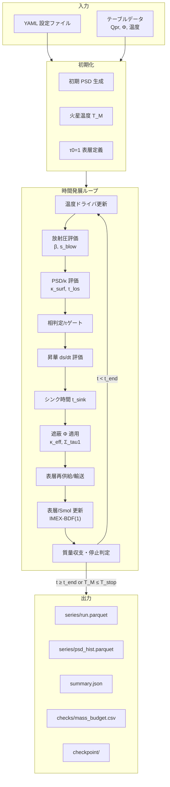
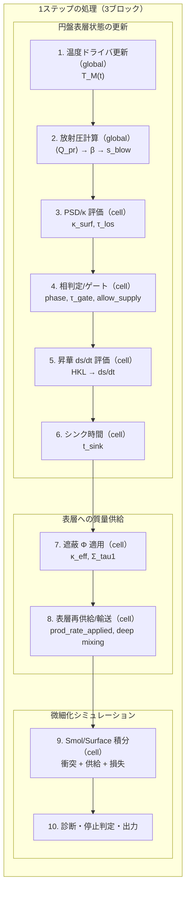
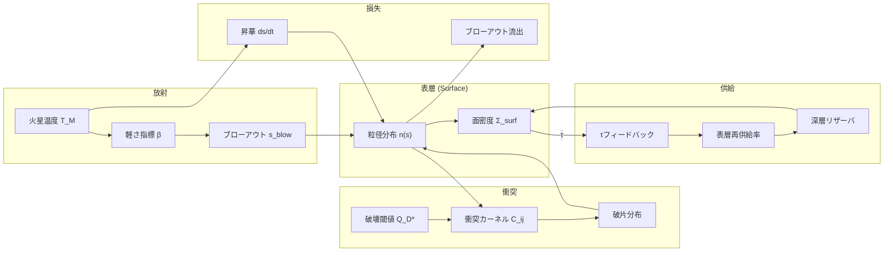
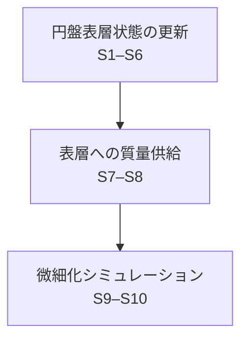
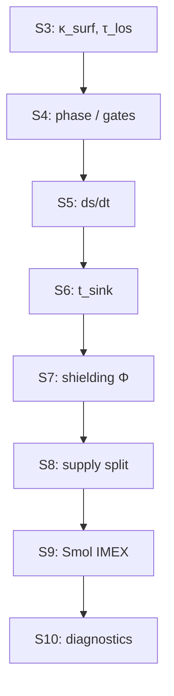
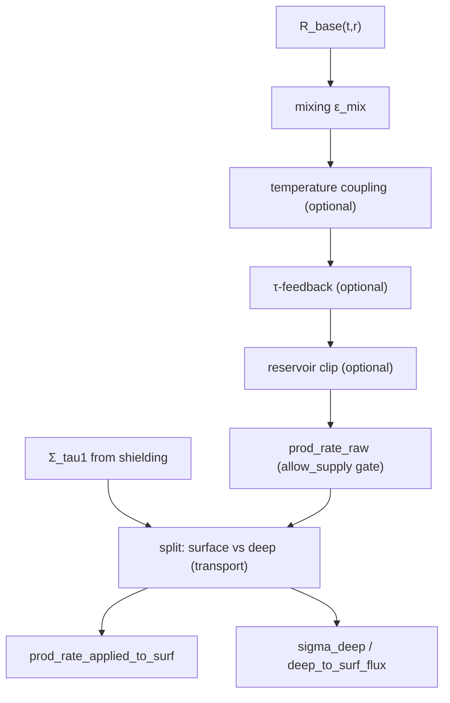
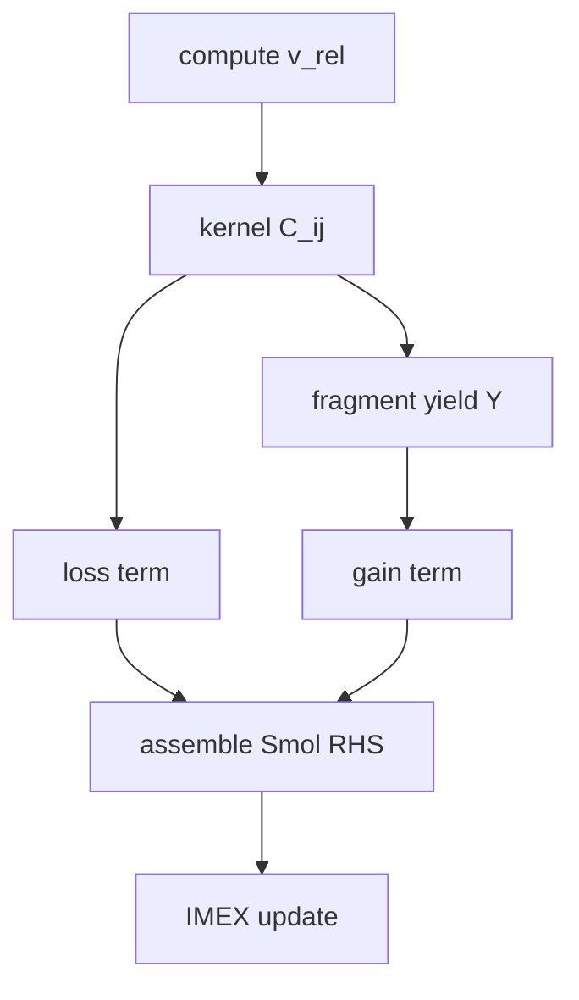
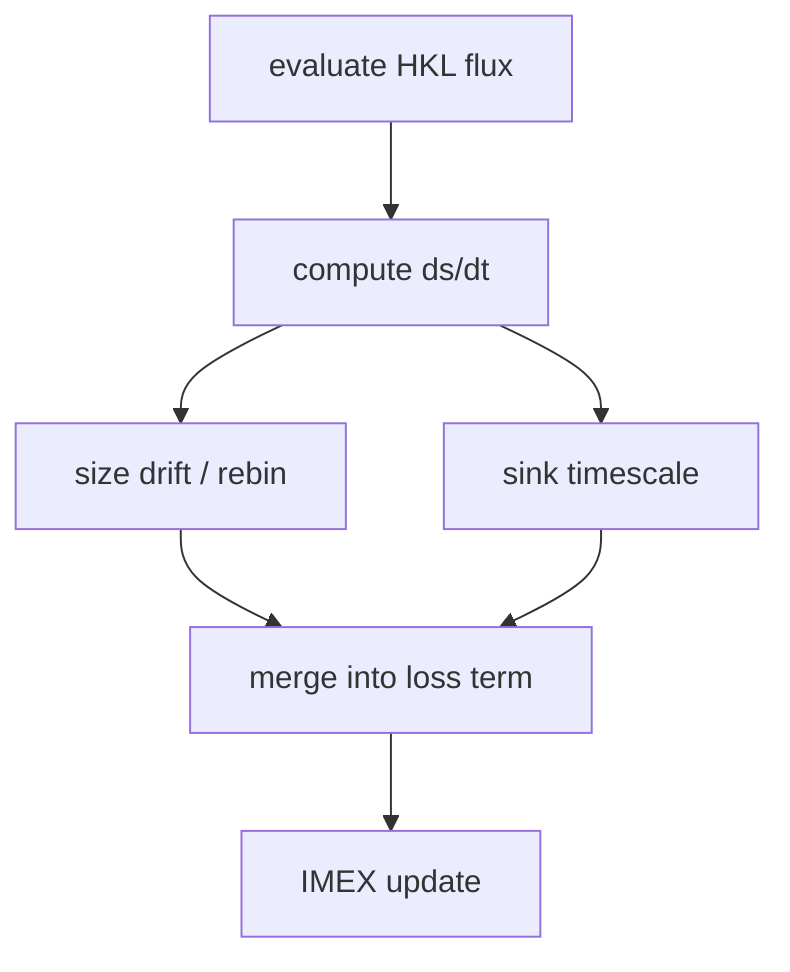

> **文書種別**: 手法（Diátaxis: Explanation）

<!--
実装(.py): marsdisk/run.py, marsdisk/run_zero_d.py, marsdisk/run_one_d.py, marsdisk/io/writer.py, marsdisk/io/streaming.py, marsdisk/io/diagnostics.py
-->

<!-- TEX_EXCLUDE_START -->
reference_links:
- @CanupSalmon2018_SciAdv4_eaar6887 -> paper/references/CanupSalmon2018_SciAdv4_eaar6887.pdf | 用途: 火星円盤の物理的前提（低質量円盤の文脈）
- @Hyodo2017a_ApJ845_125 -> paper/references/Hyodo2017a_ApJ845_125.pdf | 用途: 衝突起源円盤の前提条件と対象設定
- @Krivov2006_AA455_509 -> paper/references/Krivov2006_AA455_509.pdf | 用途: Smoluchowski衝突カスケードの枠組み
- @StrubbeChiang2006_ApJ648_652 -> paper/references/StrubbeChiang2006_ApJ648_652.pdf | 用途: 表層ブローアウトと衝突寿命の整理
<!-- TEX_EXCLUDE_END -->

# シミュレーション手法

## 1. シミュレーションの全体像

### 1.1 目的・出力・問いとの対応

本節では、火星のロッシュ限界内に形成される高温ダスト円盤を対象として、本研究で用いる数値シミュレーション手法の目的と出力を定義する。序論で掲げた研究課題に対し、本手法が直接算出する物理量と出力ファイルの対応を明確にする。

本手法はガスが希薄な条件（gas-poor）を仮定する（[@Hyodo2017a_ApJ845_125; @CanupSalmon2018_SciAdv4_eaar6887]）。粒径分布（particle size distribution; PSD）の時間発展と、表層の放射圧起因アウトフロー（outflux）を、同一のタイムループで結合して計算する。これにより、2 年スケールでの質量流出率 $\dot{M}_{\rm out}(t)$ と累積損失 $M_{\rm loss}$ を評価する。放射圧に起因する粒子運動と粒径分布進化は、既存の枠組みに従う（[@Krivov2006_AA455_509; @StrubbeChiang2006_ApJ648_652]）。

本章では、モデルの理解に必要な式を本文中に明示し、本文の式番号で参照する。記号の意味と単位は付録E（記号表）にまとめる。

序論で提示した 3 つの問いと、本手法が直接生成する量・出力の対応を次の表に示す。

\begin{table}[t]
  \centering
  \caption{序論の問いと手法で直接生成する量の対応}
  \label{tab:methods_questions_outputs}
  \begin{tabular}{p{0.20\textwidth} p{0.32\textwidth} p{0.38\textwidth}}
    \hline
    序論の問い & 手法で直接生成する量 & 対応する出力 \\
    \hline
    問1: 高温期（1000 K まで／固定地平 2 年）の総損失量 &
    時間依存の流出率と累積損失 &
    時系列（$\dot{M}_{\rm out}(t)$ と $M_{\rm loss}(t)$）\newline
    および終端要約（$M_{\rm loss}$） \\
    問2: 粒径分布の時間変化と吹き飛びやすい粒径帯 &
    粒径ビンごとの数密度履歴と下限粒径 &
    PSD 履歴（$N_k(t)$ と $\Sigma_{\rm surf}(t)$）\newline
    および $s_{\min}(t)$ の時系列 \\
    問3: 短期損失を踏まえた残存質量の評価 &
    累積損失と質量収支の時系列 &
    $M_{\rm loss}(t)$ と質量検査 $\epsilon_{\rm mass}(t)$\newline
    （式\ref{eq:mass_budget_definition}） \\
    \hline
  \end{tabular}
\end{table}
主要出力量の定義・更新と、保存する生成物（ファイル）との対応は付録Aにまとめる。

本章は、初見の読者がモデルの因果と再現条件を追える順序で記述する。読み進め方は次の順序を推奨する。

- 前提と対象（1.2）
- 状態変数と定義（2.1）
- 支配式と物理過程（2.2–4.1）
- 数値解法と時間刻み制御（4.2）
- 出力・条件・検証（5.1）
- 付録（参照情報と補足資料）（付録A–E）

設定キーや運用コマンドのような実装依存の情報は付録に整理し、本文では物理モデルと時間発展の説明を優先する。略語は付録D（表\ref{tab:abbreviations}）にまとめる。

以上により、本節では研究課題と出力の対応を定義した。次節以降では、これらの出力を規定する物理過程と数値解法を順に述べる。

---
### 1.2 研究対象と基本仮定

本モデルは gas-poor 条件下の**軸対称ディスク**を対象とし、鉛直方向は面密度へ積分して扱う。半径方向に分割した 1D 計算を基準とし（[@Hyodo2017a_ApJ845_125; @CanupSalmon2018_SciAdv4_eaar6887; @Olofsson2022_MNRAS513_713]）、光学的厚さは主に火星視線方向の $\tau_{\rm los}$ を用いる。必要に応じて $\tau_{\rm los}=\tau_{\perp}\times\mathrm{los\_factor}$ から $\tau_{\perp}$ を導出し、表層 ODE の $t_{\rm coll}$ 評価に使う。粒径分布 $n(s)$ をサイズビンで離散化し、Smoluchowski 衝突カスケード（collisional cascade）と表層の放射圧・昇華による流出を同一ループで結合する（[@Dohnanyi1969_JGR74_2531; @Krivov2006_AA455_509; @StrubbeChiang2006_ApJ648_652]）。

- 標準の物理経路は Smoluchowski 経路（C3/C4）を各半径セルで解く 1D 手法で、計算順序は図\ref{fig:methods_main_loop}に従う。放射圧〜流出の依存関係のみを抜粋すると ⟨$Q_{\rm pr}$⟩→β→$s_{\rm blow}$→遮蔽Φ→供給→Smol IMEX→外向流束となる。半径方向の粘性拡散（radial viscous diffusion; C5）は演算子分割で追加可能とする（[@Krivov2006_AA455_509]）。
- 運用スイープの既定は 1D とし、C5 は必要時のみ有効化する。再現実行で保存する情報は付録A、設定→物理対応は付録Bを参照する。
- [@TakeuchiLin2003_ApJ593_524] に基づく gas-rich 表層 ODE は gas-poor 前提の標準設定では用いず、gas-rich 想定の感度試験でのみ有効化する（設定は付録Bを参照）。

1D は $r_{\rm in}$–$r_{\rm out}$ を $N_r$ セルに分割し、各セルの代表半径 $r_i$ で局所量を評価する。角速度 $\Omega(r)$ とケプラー速度 $v_K(r)$ は式\ref{eq:omega_definition}と式\ref{eq:vK_definition}で与え、ブローアウト滞在時間は式\ref{eq:t_blow_definition}の $t_{\rm blow}=1/\Omega$ を基準時間に用いる。C5 を無効化した場合はセル間結合を行わず、半径方向の流束を解かない局所進化として扱う。

\begin{equation}
\label{eq:vK_definition}
v_K(r)=\sqrt{\frac{G\,M_{\mathrm{M}}}{r}}
\end{equation}

\begin{equation}
\label{eq:omega_definition}
\Omega(r)=\sqrt{\frac{G\,M_{\mathrm{M}}}{r^{3}}}
\end{equation}

\begin{equation}
\label{eq:t_blow_definition}
t_{\mathrm{blow}}=\frac{1}{\Omega}
\end{equation}

#### 1.2.1 物性モデル (フォルステライト)

物性は **フォルステライト** を基準として与える。密度・放射圧効率 $\langle Q_{\rm pr}\rangle$・昇華（HKL）の係数はフォルステライト値を採用する。一方、破壊閾値 $Q_D^*$ は BA99 の基準則を LS12 の速度補間で扱い、フォルステライト直系の $Q_D^*$ が未確定なため peridot projectile 実験の $Q^*$ を参照した係数スケーリングで proxy 化している（[@BenzAsphaug1999_Icarus142_5; @LeinhardtStewart2012_ApJ745_79; @Avdellidou2016_MNRAS464_734]）。$\rho$ と $\langle Q_{\rm pr}\rangle$ の感度掃引を想定し、実行時に採用した物性値・外部テーブル・物理トグルは付録Aの実行条件ログに記録する。

$\langle Q_{\rm pr}\rangle$ はテーブル入力（CSV/NPZ）を標準とし、Planck 平均の評価に用いる（[@BohrenHuffman1983_Wiley]）。遮蔽係数 $\Phi(\tau,\omega_0,g)$ もテーブル入力を基本とし、双線形補間で適用する（[@Joseph1976_JAS33_2452; @HansenTravis1974_SSR16_527; @CogleyBergstrom1979_JQSRT21_265]）。これらの外部入力の出典と採用値は、再現実行時に照合できるよう付録Aの保存情報に含める。

---
### 1.3 時間発展アルゴリズム

時間発展ループの全体像と処理順序を整理し、主要な依存関係を示す。

#### 1.3.0 支配方程式の位置づけ

本章では主要式を本文中に示し、式番号で参照する。記号の意味と単位は付録E（記号表）を参照する。

- **軌道力学と時間尺度**: $\Omega$, $v_K$ は式\ref{eq:omega_definition}と式\ref{eq:vK_definition}で定義し、$t_{\rm blow}$ の基準は式\ref{eq:t_blow_definition}に従う。放射圧の整理は [@Burns1979_Icarus40_1] を採用する。
- **衝突カスケード**: PSD の時間発展は Smoluchowski 方程式（式\ref{eq:smoluchowski}）で与え、質量収支は式\ref{eq:mass_budget_definition}で検査する。枠組みは [@Krivov2006_AA455_509; @Dohnanyi1969_JGR74_2531] に基づく。
- **破砕強度と破片生成**: 破壊閾値 $Q_D^*$ は LS12 補間を用い、式\ref{eq:qdstar_definition}で表す（[@BenzAsphaug1999_Icarus142_5; @LeinhardtStewart2012_ApJ745_79]）。
- **放射圧ブローアウト**: β と $s_{\rm blow}$ は式\ref{eq:beta_definition}–\ref{eq:s_blow_definition}で定義し、表層流出は式\ref{eq:surface_outflux}に依拠する。
- **昇華と追加シンク**: HKL フラックスと飽和蒸気圧は式\ref{eq:hkl_flux}と式\ref{eq:psat_definition}に基づき、昇華モデルの位置づけは [@Markkanen2020_AA643_A16] を参照する。
- **遮蔽と表層**: 自遮蔽係数 $\Phi$ の適用は式\ref{eq:kappa_eff_definition}–\ref{eq:phi_definition}で与え、gas-rich 条件の参照枠は [@TakeuchiLin2003_ApJ593_524] で位置づける。

以下の図は、入力（YAML/テーブル）から初期化・時間発展・診断出力に至る主経路を示す。ここでは概念的な依存関係の整理として示す。

#### 1.3.1 シミュレーション全体像

入力（設定ファイルとテーブル）から初期条件（PSD と $T_M$ など）を構成し、その後は「表層状態の評価→供給→IMEX 更新→診断と出力」を反復する。処理順序の要点は図\ref{fig:methods_main_loop}にまとめる。

<!-- TEX_EXCLUDE_START -->

<!-- TEX_EXCLUDE_END -->

#### 1.3.2 メインループ詳細

本研究で用いる時間発展アルゴリズムの処理順序（1ステップの3ブロック）を図\ref{fig:methods_main_loop}に示す（差し替え用プレースホルダ）。

\begin{figure}[t]
  \centering
  % \includegraphics[width=\linewidth]{figures/placeholder_main_loop.pdf}
  \caption{時間発展アルゴリズムの処理順序（1ステップの3ブロック）}
  \label{fig:methods_main_loop}
\end{figure}

<!-- TEX_EXCLUDE_START -->

<!-- TEX_EXCLUDE_END -->

補足: 損失項（ブローアウト・追加シンク）は S9 の IMEX 更新に含める。S4 では相判定と光学的厚さに基づくゲートにより有効な経路を選択し、S6 で追加シンクの代表時間 $t_{\rm sink}$ を評価する。S10 で診断量の集計、停止判定、および出力を行う。

図\ref{fig:methods_main_loop}は 1D + Smol の標準順序に合わせて記述する。まず「円盤表層状態の更新」（S1–S6）で $T_M$、β、$s_{\rm blow}$、$\kappa_{\rm surf}$、$\tau_{\rm los}$、相状態、昇華 ds/dt、$t_{\rm sink}$ を評価する。次に「表層への質量供給」（S7–S8）で遮蔽係数 $\Phi$ から $\kappa_{\rm eff}$ と $\Sigma_{\tau=1}$ を得て、供給を表層/深層へ配分し、表層への実効供給率を確定する。最後に「微細化シミュレーション」（S9–S10）で Smol/Surface の更新により PSD と $\Sigma_{\rm surf}$ を $\Delta t$ だけ進め、損失と診断を集約する。

図\ref{fig:methods_main_loop}の手順の対応は次の通りである。S1 は温度ドライバの評価と $T_M$ の更新、S2 は $\langle Q_{\rm pr}\rangle$ から β と $s_{\rm blow}$ を評価する。S3 は PSD から $\kappa_{\rm surf}$ と $\tau_{\rm los}$ を評価する。S4 は相判定とゲートにより有効な経路を選択する。S5 は HKL に基づく昇華 ds/dt を評価する。S6 は追加シンクの代表時間 $t_{\rm sink}$ を評価する。S7 は $\Phi$ を適用して $\kappa_{\rm eff}$ と $\Sigma_{\tau=1}$ を評価する。S8 は供給率に温度スケール・光学的厚さフィードバック・有限リザーバ・深層輸送を適用して表層への実効注入量を確定する。S9 は衝突カーネルに基づく gain/loss と供給・損失を含めた IMEX 更新を行う。S10 は $\dot{M}_{\rm out}$ などの診断集計、$\tau_{\rm stop}$ による停止判定、質量収支検査（C4）、および出力を担当する。

#### 1.3.3 物理過程の相互作用

図\ref{fig:methods_physics_interactions}に、主要な物理過程の相互作用とフィードバックの概念図を示す（差し替え用プレースホルダ）。

\begin{figure}[t]
  \centering
  % \includegraphics[width=\linewidth]{figures/placeholder_physics_interactions.pdf}
  \caption{物理過程の相互作用と主要フィードバック（概念図）}
  \label{fig:methods_physics_interactions}
\end{figure}

<!-- TEX_EXCLUDE_START -->

<!-- TEX_EXCLUDE_END -->

主要状態変数は、サイズビン離散の粒径分布（形状 $n_k$ と数密度 $N_k$）、表層面密度 $\Sigma_{\rm surf}$、深層リザーバ面密度 $\Sigma_{\rm deep}$、および累積損失量（放射圧起因・追加シンク起因）であり、時間発展ごとに同時更新される（[@Krivov2006_AA455_509]）。Smoluchowski 更新は $N_k$ を状態変数として時間積分し、更新後に $n_k$ へ写像して表層の診断量を評価する。

#### 1.3.4 供給・衝突・昇華の時系列因果

供給（supply）・衝突（collision）・昇華（sublimation）は同一ステップ内で相互依存するため、因果順序を図\ref{fig:methods_main_loop}の 3 ブロックに沿って固定する。すなわち「円盤表層状態の更新」（S1–S6）で $\tau_{\rm los}$・相状態・昇華 ds/dt・$t_{\rm sink}$ を評価し、「表層への質量供給」（S7–S8）で遮蔽 $\Phi$ と深層輸送を含む表層への実効注入量を確定し、最後に「微細化シミュレーション」（S9–S10）で IMEX 更新と診断集計を行う（[@WyattClarkeBooth2011_CeMDA111_1; @Krivov2006_AA455_509; @Markkanen2020_AA643_A16]）。

<!-- TEX_EXCLUDE_START -->

セル内の評価順序（概念）は次の通りである。

S3〜S10 の要点は次の通りである。

- S3: PSD から $\\kappa_{\\rm surf}$ を評価し、$\\tau_{\\rm los}$ を計算する。
- S4: 相判定とゲート（$\\tau_{\\rm gate}$、液相ブロック、`allow_supply`）を評価し、各経路を有効化する。
- S5: HKL に基づく昇華 ds/dt を評価する。
- S6: シンク時間 $t_{\\rm sink}$ を評価する。
- S7: 遮蔽 $\\Phi$ を適用して $\\kappa_{\\rm eff}$ と $\\Sigma_{\\tau=1}$ を評価する。
- S8: 名目供給に温度スケール・$\\tau$ フィードバック・有限リザーバ・深層輸送を適用し、表層への注入量 `prod_rate_applied` を決定する。
- S9: 衝突カーネルから loss/gain を構成し、供給と損失を含めた IMEX 更新を実施する。
- S10: 診断列は `smol_gain_mass_rate`, `smol_loss_mass_rate`, `ds_dt_sublimation`, `M_out_dot` を含む。質量収支を保存する。

##### 1.3.4.1 供給フロー（Supply）

- 診断列は `supply_rate_nominal` → `supply_rate_scaled` → `supply_rate_applied` に記録する（[@WyattClarkeBooth2011_CeMDA111_1]）。
- 深層経路は `prod_rate_diverted_to_deep`\newline `deep_to_surf_flux`\newline `prod_rate_applied_to_surf` に記録する。
- 供給の有効化は phase（solid）と液相ブロックで決まり、$\\tau_{\\rm gate}$ はブローアウトのみをゲートする。供給側のフィードバックは $\\tau_{\\rm los}$ を参照し、停止判定（$\\tau_{\\rm stop}$）とは区別して扱う。

##### 1.3.4.2 衝突フロー（Collision）

- 相対速度は $e,i$ と $c_{\\rm eq}$ から評価し、カーネル $C_{ij}$ を構成する（[@Ohtsuki2002_Icarus155_436; @WetherillStewart1993_Icarus106_190]）。
- loss は `smol_loss_mass_rate`、gain は `smol_gain_mass_rate` として診断される。
- 最小衝突時間 $t_{\\rm coll,\\,min}$ が $\\Delta t$ の上限に用いられる。
- 破片分布 $Y$ は PSD グリッド上で再配分され、質量保存は C4 により検査される（[@Krivov2006_AA455_509; @Thebault2003_AA408_775]）。

##### 1.3.4.3 昇華フロー（Sublimation）

- HKL フラックスから ds/dt を評価し、必要に応じて再ビニングで PSD を更新する（[@Markkanen2020_AA643_A16; @Pignatale2018_ApJ853_118]）。
- `sub_params.mass_conserving=true` の場合は $s<s_{\\rm blow}$ を跨いだ質量をブローアウトへ振り替える。
- 昇華由来の損失は `ds_dt_sublimation` と `mass_lost_sublimation_step` に出力される。
<!-- TEX_EXCLUDE_END -->
