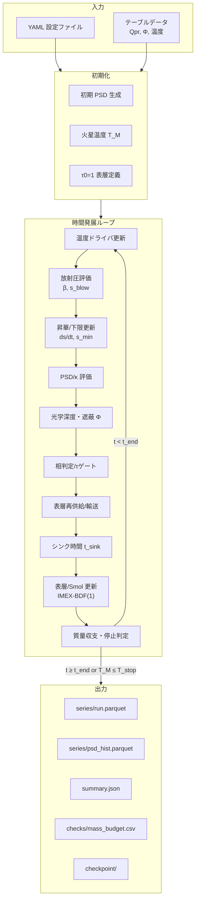
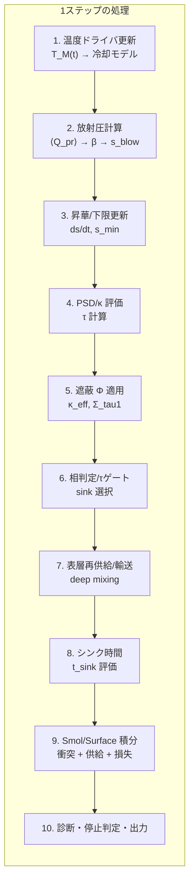
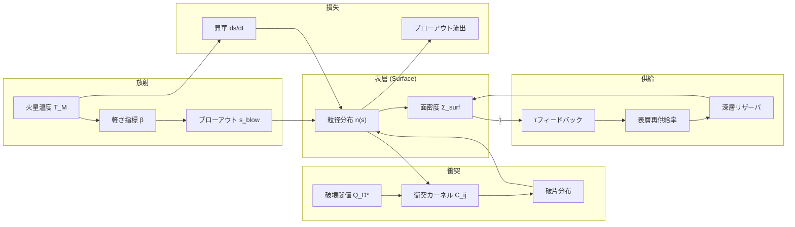
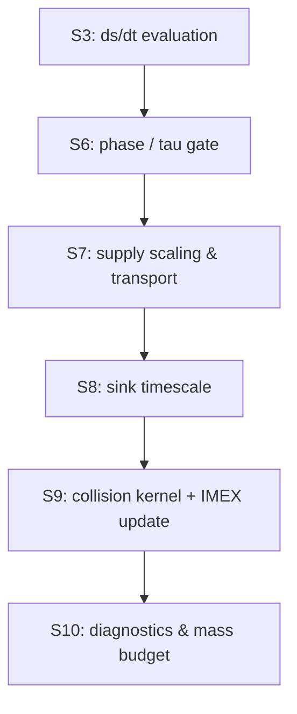
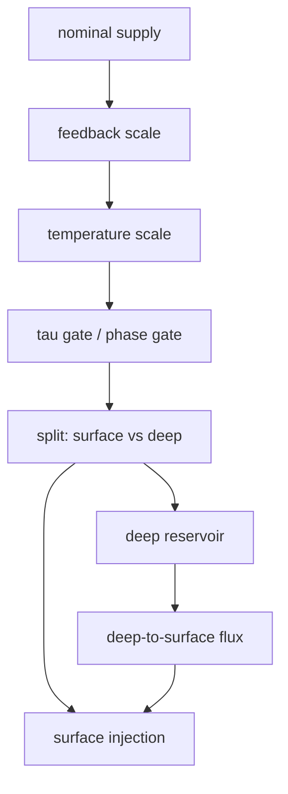
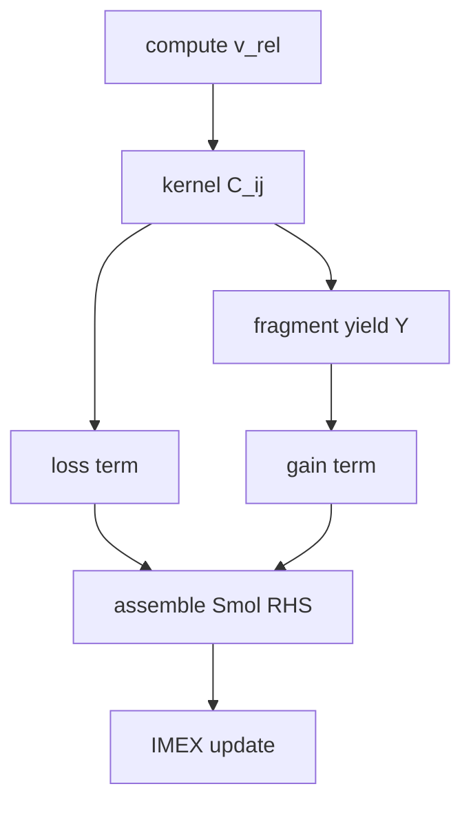
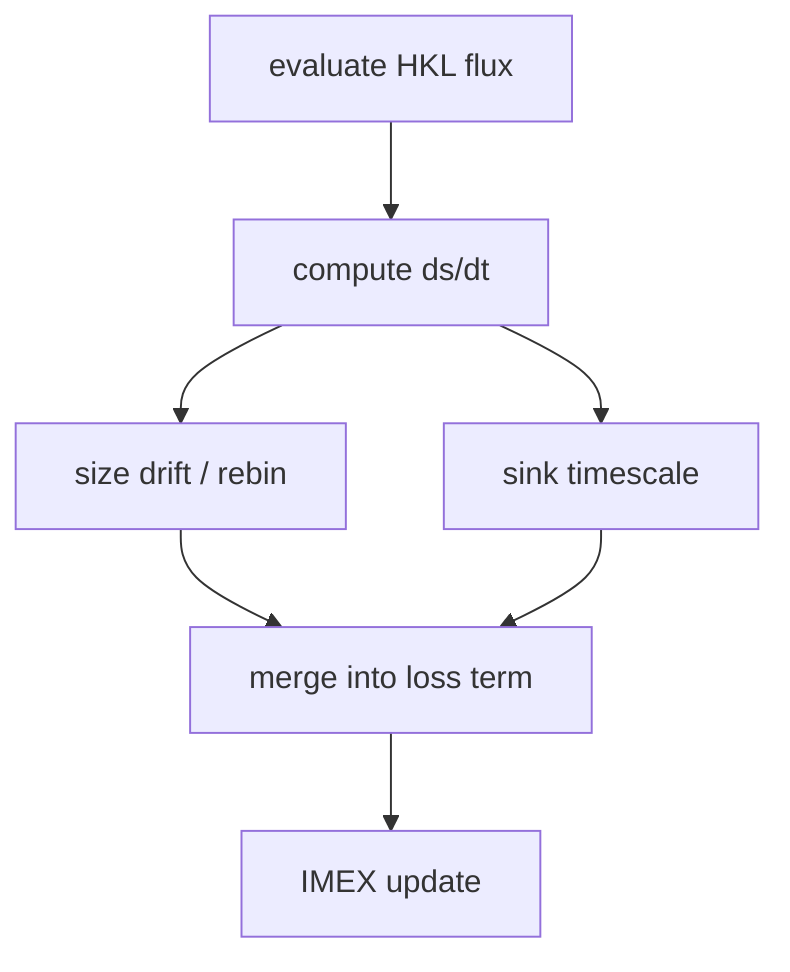

## 3. モデルのロジック（時間発展と物理過程）

---
### 3. 時間発展アルゴリズム

時間発展ループの全体像と処理順序を整理し、主要な依存関係を示す。実装順序は analysis/physics_flow.md を正とし、ここでは概念図として示す。

#### 3.0 支配方程式の位置づけ

本書では主要式を抜粋して再掲し、式番号・記号定義は analysis/equations.md を正とする。

- **軌道力学と時間尺度**: (E.001)–(E.002) で $\Omega$, $v_K$ を定義し、$t_{\rm blow}$ の基準は (E.007) に従う。放射圧の整理は [@Burns1979_Icarus40_1] を採用する。
- **衝突カスケード**: PSD の時間発展は Smoluchowski 方程式 (E.010) を用い、質量収支は (E.011) で検査する。枠組みは [@Krivov2006_AA455_509; @Dohnanyi1969_JGR74_2531] に基づく。
- **破砕強度と破片生成**: 破壊閾値 $Q_D^*$ の補間 (E.026) は [@BenzAsphaug1999_Icarus142_5; @LeinhardtStewart2012_ApJ745_79] を参照する。
- **放射圧ブローアウト**: β と $s_{\rm blow}$ の定義は (E.013)–(E.014)、表層流出は (E.009) に依拠する。
- **昇華と追加シンク**: HKL フラックス (E.018) と飽和蒸気圧 (E.036) に基づき、昇華モデルの位置づけは [@Markkanen2020_AA643_A16] を参照する。
- **遮蔽と表層**: 自遮蔽係数 $\Phi$ は (E.015)–(E.017) により表層に適用し、gas-rich 条件の参照枠は [@TakeuchiLin2003_ApJ593_524] で位置づける。

以下の図は、入力（YAML/テーブル）から初期化・時間発展・診断出力に至る主経路を示す。**実装順序は analysis/physics_flow.md を正**とし、ここでは概念的な依存関係の整理として示す。

#### 3.1 シミュレーション全体像

#### 3.2 メインループ詳細

補足: 損失項（ブローアウト・追加シンク）は S9 の IMEX 更新に含まれ、S6 は相判定とゲート選択、S8 は $t_{\rm sink}$ の評価、S10 は診断集計と出力を担当する。

各ステップでは温度ドライバの出力から $T_M$ を更新し、放射圧関連量（$\langle Q_{\rm pr}\rangle$, β, $s_{\rm blow}$）と遮蔽量（$\Phi$, $\kappa_{\rm eff}$, $\tau_{\rm los}$）を再評価する。供給はフィードバックや温度スケールを通して表層に注入され、必要に応じて深層リザーバを経由する。表層 ODE または Smoluchowski 更新の後に、ブローアウトと追加シンクによる損失を加味し、質量収支と停止条件を評価する。

図 3.2 の手順と実装の対応は次の通りである。S1 は温度ドライバの評価と $T_M$ の更新、S2 は $Q_{\rm pr}$ テーブルから β と $s_{\rm blow}$ を評価する。S3 は昇華 ds/dt と $s_{\\rm min}$ を評価し、S4 で PSD と $\\kappa$ を更新して $\\tau$ を計算する。S5 は $\\Phi$ を適用して $\\kappa_{\\rm eff}$ と $\\Sigma_{\\tau=1}$ を評価し、S6 で相判定と $\\tau$ ゲートにより有効な損失経路を選択する。S7 は供給率の名目値を計算し、フィードバック・温度スケール・深層輸送を適用する。S8 はシンク時間 $t_{\\rm sink}$ を評価し、S9 で衝突カーネルに基づく gain/loss と供給・シンクを含めた IMEX 更新を行う。S10 は $\\dot{M}_{\\rm out}$ などの診断集計、$\\tau_{\\rm stop}$ 超過の停止判定、C4 質量収支検査、および出力書き込みに対応する。

#### 3.3 物理過程の相互作用

主要状態変数は PSD 形状 $n_k$（`psd_state.number`）、表層面密度 $\Sigma_{\rm surf}$、深層リザーバ面密度 $\Sigma_{\rm deep}$、累積損失量 $M_{\rm out}$/$M_{\rm sink}$ であり、時間発展ごとに同時更新される（[@Krivov2006_AA455_509]）。Smol 更新では $N_k$ を一時的に構成して積分し、更新後に $n_k$ へ写像して `psd_state` に戻す。計算順序と依存関係は analysis/physics_flow.md の結合順序図に従う。

#### 3.4 供給・衝突・昇華の時系列因果

供給（supply）・衝突（collision）・昇華（sublimation）は同一ステップ内で相互依存するため、因果順序を以下の通り固定する。図 3.2 の S3（昇華）、S6（相判定/ゲート）、S7（供給）、S8（シンク時間）、S9（衝突/IMEX 更新）に対応する内部順序を明示し、診断列と対応させる（[@WyattClarkeBooth2011_CeMDA111_1; @Krivov2006_AA455_509; @Markkanen2020_AA643_A16]）。

S3 では昇華 ds/dt を評価し、S6 で相判定と $\\tau$ ゲートにより有効な損失経路を選択する。S7 で名目供給 `supply_rate_nominal` にフィードバックと温度補正を適用して `supply_rate_scaled` を得た後、深層輸送を含めた表層注入量を決定する。S8 でシンク時間 $t_{\\rm sink}$ を評価し、S9 で衝突カーネルから loss/gain を構成して IMEX 更新を実施する。S10 で `smol_gain_mass_rate` / `smol_loss_mass_rate` / `ds_dt_sublimation` / `M_out_dot` を含む診断と質量収支を保存する。

##### 3.4.1 供給フロー（Supply）

- 対応する診断列は `supply_rate_nominal` → `supply_rate_scaled` → `supply_rate_applied`、深層経路は `prod_rate_diverted_to_deep` / `deep_to_surf_flux` / `prod_rate_applied_to_surf` に記録される（[@WyattClarkeBooth2011_CeMDA111_1]）。
- 供給の有効化は phase（solid）と液相ブロックで決まり、$\\tau_{\\rm gate}$ はブローアウトのみをゲートする。停止判定（$\\tau_{\\rm stop}$）とは区別して扱う。

##### 3.4.2 衝突フロー（Collision）

- 相対速度は $e,i$ と $c_{\\rm eq}$ から評価し、カーネル $C_{ij}$ を構成する（[@Ohtsuki2002_Icarus155_436; @WetherillStewart1993_Icarus106_190]）。
- loss/gain は `smol_loss_mass_rate` / `smol_gain_mass_rate` として診断され、最小衝突時間 $t_{\\rm coll,\\,min}$ が $\\Delta t$ の上限に用いられる。
- 破片分布 $Y$ は PSD グリッド上で再配分され、質量保存は C4 により検査される（[@Krivov2006_AA455_509; @Thebault2003_AA408_775]）。

##### 3.4.3 昇華フロー（Sublimation）

- HKL フラックスから ds/dt を評価し、必要に応じて再ビニングで PSD を更新する（[@Markkanen2020_AA643_A16; @Pignatale2018_ApJ853_118]）。
- `sub_params.mass_conserving=true` の場合は $s<s_{\\rm blow}$ を跨いだ質量をブローアウトへ振り替える。
- 昇華由来の損失は `ds_dt_sublimation` / `mass_lost_sublimation_step` として出力される。

---
### 4. 物理過程

#### 4.1 衝突カスケードと破片生成

衝突カスケードは小粒子供給の主因であり、PSD の形状と供給率を同時に決める。統計的な衝突解法は Smoluchowski 方程式の枠組み [@Krivov2006_AA455_509] を基礎に置き、破砕強度は玄武岩モデル [@BenzAsphaug1999_Icarus142_5] と LS12 補間 [@LeinhardtStewart2012_ApJ745_79] に従って定義する。

主要な PSD の時間発展は式\ref{eq:psd_smol}で与える（再掲: E.010）。

\begin{equation}
\label{eq:psd_smol}
\dot{N}_k = \sum_{i\le j} C_{ij}\,\frac{m_i+m_j}{m_k}\,Y_{kij} - \left(\sum_j C_{kj} + C_{kk}\right) + F_k - S_k N_k
\end{equation}

右辺第1項が破片生成、第2項が衝突ロス、$F_k$ が供給ソース、$S_k$ が追加シンク（昇華・ガス抗力など）を表す。

##### 4.1.1 衝突カーネル

nσv 型カーネル (E.024) を用い、相対速度は Rayleigh 分布 (E.020) から導出する（[@LissauerStewart1993_PP3; @WetherillStewart1993_Icarus106_190; @Ohtsuki2002_Icarus155_436; @ImazBlanco2023_MNRAS522_6150; @IdaMakino1992_Icarus96_107]）。カーネルの定義は式\ref{eq:collision_kernel}に示す。

\begin{equation}
\label{eq:collision_kernel}
C_{ij} = \frac{N_i N_j}{1+\delta_{ij}}\,
\frac{\pi\,(s_i+s_j)^{2}\,v_{ij}}{\sqrt{2\pi}\,H_{ij}},
\qquad H_{ij} = \sqrt{H_i^{2}+H_j^{2}}
\end{equation}

- 破壊閾値 $Q_D^*$: [@LeinhardtStewart2012_ApJ745_79] 補間 (E.026)
- 速度分散: せん断加熱と減衰の釣り合いから $c_{\rm eq}$ を固定点反復で求め、相対速度に反映する (E.021; [@Ohtsuki2002_Icarus155_436])
- 速度外挿: 重力項のみ LS09 型 $v^{-3\mu+2}$ で拡張（[@StewartLeinhardt2009_ApJ691_L133; @Jutzi2010_Icarus207_54]）
- ここでの $\mu$ は衝突速度外挿（LS09）の係数であり、供給式で使う $\mu$（`mu_reference_tau` 由来）とは別物として扱う。

衝突カーネルはサイズビン対ごとに衝突率 $C_{ij}$ を評価し、衝突ロス項と破片生成項を形成する。動力学パラメータ（$e, i$）は表層状態と供給の速度条件を反映して更新され、$C_{ij}$ の評価に反映される。

S9 の衝突更新では、$C_{ij}$ から各ビンの衝突寿命 $t_{\rm coll}$ と loss/gain を算定し、破片分布テンソル $Y$ に基づいて生成項を配分する。$t_{\rm coll}$ の最小値は $\Delta t$ の上限制御に用いられ、ビンごとの質量収支が C4 検査で追跡される。破片生成は PSD 下限のビン境界条件と整合させ、供給注入と同一のビン系で質量保存を保証する。

> **詳細**: analysis/equations.md (E.020)–(E.021), (E.024), (E.026)  
> **設定**: analysis/config_guide.md §3.5 "QStar"

##### 4.1.2 衝突レジーム分類

衝突は **最大残存率 $F_{LF}$** に基づいて2つのレジームに分類する。レジームの条件と処理は表\ref{tab:collision_regimes}にまとめる。

\begin{table}[t]
  \centering
  \caption{衝突レジームの分類と処理}
  \label{tab:collision_regimes}
  \begin{tabular}{p{0.28\textwidth} p{0.2\textwidth} p{0.42\textwidth}}
    \hline
    レジーム & 条件 & 処理 \\
    \hline
    侵食（cratering） & $F_{LF} > 0.5$ & ターゲット残存、クレーター破片生成 \\
    壊滅的破砕（fragmentation） & $F_{LF} \le 0.5$ & 完全破壊、破片分布 $g(m) \propto m^{-\eta}$ \\
    \hline
  \end{tabular}
\end{table}

- Thébault et al. (2003) に基づく侵食モデル（[@Thebault2003_AA408_775]）
- [@Krivov2006_AA455_509] に基づく壊滅的破砕モデル
- 破砕境界と最大残存率の分岐式は [@StewartLeinhardt2009_ApJ691_L133; @LeinhardtStewart2012_ApJ745_79] に従う
- 破片分布はビン内積分で質量保存を満たすように正規化し、供給・破砕由来の面密度が一貫するように設計する。

破砕生成物はフラグメント分布テンソル $Y$ を通じて各ビンに再配分され、Smoluchowski 解法の gain 項として更新される。侵食レジームでは質量が大粒径側に残存し、小粒径への供給は限定的となる。

##### 4.1.3 エネルギー簿記

衝突エネルギーの診断は、デブリ円盤の衝突カスケード研究で用いられる散逸・残存の整理に倣う（[@Thebault2003_AA408_775; @Wyatt2008]）。

`diagnostics.energy_bookkeeping.enabled=true` で簿記モードを有効化し、`diagnostics.energy_bookkeeping.stream` が true かつ `FORCE_STREAMING_OFF` が未設定なら `series/energy.parquet`・`checks/energy_budget.csv` をストリーミングで書き出す（オフ時は最後にまとめて保存）。サマリには `energy_bookkeeping.{E_rel_total,E_dissipated_total,E_retained_total,f_ke_mean_last,f_ke_energy_last,frac_*_last}` が追加され、同じ統計を run_card に残す。出力カラムの一覧は表\ref{tab:energy_columns}に示す。

\begin{table}[t]
  \centering
  \caption{エネルギー簿記の出力カラム}
  \label{tab:energy_columns}
  \begin{tabular}{p{0.32\textwidth} p{0.42\textwidth} p{0.12\textwidth}}
    \hline
    出力カラム & 意味 & 単位 \\
    \hline
    \texttt{E\_rel\_step} & 衝突の総相対運動エネルギー & J \\
    \texttt{E\_dissipated\_step} & 散逸エネルギー（熱化） & J \\
    \texttt{E\_retained\_step} & 残留運動エネルギー & J \\
    \texttt{n\_cratering} & 侵食衝突の頻度 & — \\
    \texttt{n\_fragmentation} & 破砕衝突の頻度 & — \\
    \texttt{frac\_cratering} & 侵食衝突の割合 & — \\
    \texttt{frac\_fragmentation} & 破砕衝突の割合 & — \\
    \hline
  \end{tabular}
\end{table}

エネルギー散逸率は式\ref{eq:energy_dissipation}で定義する。

\begin{equation}
\label{eq:energy_dissipation}
E_{diss} = (1 - f_{ke})\,E_{rel}
\end{equation}

関連する設定キーは表\ref{tab:energy_settings}にまとめる。

\begin{table}[t]
  \centering
  \caption{エネルギー簿記に関連する設定キー}
  \label{tab:energy_settings}
  \begin{tabular}{p{0.38\textwidth} p{0.38\textwidth} p{0.14\textwidth}}
    \hline
    設定キー & 意味 & 既定値 \\
    \hline
    \texttt{dynamics.eps\_restitution} & 反発係数（$f_{ke,\mathrm{frag}}$ のデフォルトに使用） & 0.5 \\
    \texttt{dynamics.f\_ke\_cratering} & 侵食時の非散逸率 & 0.1 \\
    \texttt{dynamics.f\_ke\_fragmentation} & 破砕時の非散逸率 & None（$\varepsilon^2$ 使用） \\
    \texttt{diagnostics.energy\_bookkeeping.stream} & energy 系列/簿記をストリーム出力 & true（\texttt{FORCE\_STREAMING\_OFF} で無効化） \\
    \hline
  \end{tabular}
\end{table}

エネルギー簿記は数値安定性と物理整合性の診断を目的とし、時間発展のフィードバックには用いない。記録された散逸・残存エネルギーは衝突速度場の妥当性評価に用いる。

> **詳細**: analysis/equations.md (E.045a), (E.051), (E.052)

---
#### 4.2 熱・放射・表層損失

放射圧と昇華は粒子の軽さ指標 β と表層質量の時間変化を通じて短期損失を支配する。放射圧の整理は古典的な定式化 [@Burns1979_Icarus40_1] に基づき、光学特性は Mie 理論の整理 [@BohrenHuffman1983_Wiley] を踏まえて $\langle Q_{\rm pr}\rangle$ テーブルを用いる。遮蔽の参照枠は gas-rich 表層流出の議論 [@TakeuchiLin2003_ApJ593_524] に置きつつ、gas-poor 条件を既定とする。

##### 4.2.1 温度ドライバ

火星表面温度の時間変化を `constant` / `table` / `autogen` で選択する。各モードの概要は表\ref{tab:temp_driver_modes}に示す。

- `autogen` は解析的冷却（slab）や Hyodo 型などの内蔵ドライバを選択し、温度停止条件と連動する（[@Hyodo2018_ApJ860_150]）。

\begin{table}[t]
  \centering
  \caption{温度ドライバのモード}
  \label{tab:temp_driver_modes}
  \begin{tabular}{p{0.2\textwidth} p{0.4\textwidth} p{0.32\textwidth}}
    \hline
    モード & 内容 & 設定参照 \\
    \hline
    \texttt{table} & 外部 CSV テーブル補間 & \texttt{radiation.mars\_temperature\_driver.table.*} \\
    \texttt{slab} & 解析的 $T^{-3}$ 冷却 (Stefan--Boltzmann) & 内蔵式 \\
    \texttt{hyodo} & 線形熱流束に基づく冷却 & \texttt{radiation.mars\_temperature\_driver.hyodo.*} \\
    \hline
  \end{tabular}
\end{table}

温度は放射圧効率 $\langle Q_{\rm pr}\rangle$、昇華フラックス、相判定に同時に入力され、`T_M_used` と `T_M_source` が診断に記録される。遮蔽係数 $\Phi$ は温度ドライバにはフィードバックせず、放射圧評価・相判定（粒子平衡温度の推定）でのみ用いる。

> **詳細**: analysis/equations.md (E.042)–(E.043)  
> **フロー図**: analysis/physics_flow.md §3 "温度ドライバ解決フロー"  
> **設定**: analysis/config_guide.md §3.2 "mars_temperature_driver"

##### 4.2.2 放射圧・ブローアウト

軽さ指標 β (E.013) とブローアウト粒径 $s_{\rm blow}$ (E.014) を $\langle Q_{\rm pr}\rangle$ テーブルから評価する。本書では粒径を $s_{\rm blow}$ と表記し、コードや出力列では `a_blow` が同義の名称として残る。

- $\langle Q_{\rm pr}\rangle$ はテーブル入力（CSV/NPZ）を既定とし、Planck 平均から β と $s_{\rm blow}$ を導出する。
- ブローアウト（blow-out）損失は **phase=solid かつ $\tau$ ゲートが開放**（$\tau_{\rm los}<\tau_{\rm gate}$）のときのみ有効化し、それ以外は outflux=0 とする。
- 外向流束は $t_{\rm blow}=1/\Omega$（E.007）を基準とし、実装では `chi_blow_eff` を掛けた $t_{\rm blow}=\chi_{\rm blow}/\Omega$ を用いる。補正状況は `dt_over_t_blow`・`fast_blowout_flag_gt3/gt10` とともに診断列へ出力する。
- β の閾値判定により `case_status` を分類し、ブローアウト境界と PSD 床の関係を `s_min_components` に記録する。
- 表層流出率 $\dot{M}_{\rm out}$ の定義は (E.009) を参照し、表層 ODE を使う場合は $t_{\rm blow}$ を (E.007) の形で評価する。

放射圧の軽さ指標とブローアウト粒径は式\ref{eq:beta_definition}と式\ref{eq:s_blow_definition}で定義する（再掲: E.013, E.014）。

\begin{equation}
\label{eq:beta_definition}
\beta = \frac{3\,\sigma_{\mathrm{SB}}\,T_{\mathrm{M}}^{4}\,R_{\mathrm{M}}^{2}\,\langle Q_{\mathrm{pr}}\rangle}{4\,G\,M_{\mathrm{M}}\,c\,\rho\,s}
\end{equation}

\begin{equation}
\label{eq:s_blow_definition}
s_{\mathrm{blow}} = \frac{3\,\sigma_{\mathrm{SB}}\,T_{\mathrm{M}}^{4}\,R_{\mathrm{M}}^{2}\,\langle Q_{\mathrm{pr}}\rangle}{2\,G\,M_{\mathrm{M}}\,c\,\rho}
\end{equation}

表層の外向流束は式\ref{eq:surface_outflux}で評価する（再掲: E.009）。

\begin{equation}
\label{eq:surface_outflux}
\dot{M}_{\mathrm{out}} = \Sigma_{\mathrm{surf}}\,\Omega
\end{equation}

ブローアウト境界は β=0.5 を閾値とする非束縛条件に対応し、$s_{\rm blow}$ と $s_{\min,\mathrm{eff}}$ の関係が PSD 形状と流出率を支配する。ゲート有効時は $\tau$ によって outflux が抑制される。

> **詳細**: analysis/equations.md (E.009), (E.012)–(E.014), (E.039)  
> **用語**: analysis/glossary.md G.A04 (β), G.A05 (s_blow)  
> **設定**: analysis/config_guide.md §3.2 "Radiation"

##### 4.2.3 遮蔽 (Shielding)

$\Phi(\tau,\omega_0,g)$ テーブル補間で有効不透明度を評価し、$\Sigma_{\tau=1}=1/\kappa_{\rm eff}$ を診断として記録する。表層が光学的に厚くなり $\tau_{\rm los}>\tau_{\rm stop}$ となった場合は停止し、クリップは行わない。Φ テーブルの基礎近似は二流・δ-Eddington 系の解析解に基づく（[@Joseph1976_JAS33_2452; @HansenTravis1974_SSR16_527; @CogleyBergstrom1979_JQSRT21_265]）。

遮蔽による有効不透明度と光学的厚さ 1 の表層面密度は式\ref{eq:kappa_eff_definition}と式\ref{eq:sigma_tau1_definition}で与える（再掲: E.015, E.016）。

\begin{equation}
\label{eq:kappa_eff_definition}
\kappa_{\mathrm{eff}} = \Phi(\tau)\,\kappa_{\mathrm{surf}}
\end{equation}

\begin{equation}
\label{eq:sigma_tau1_definition}
\Sigma_{\tau=1} =
\begin{cases}
 \kappa_{\mathrm{eff}}^{-1}, & \kappa_{\mathrm{eff}} > 0,\\
 \infty, & \kappa_{\mathrm{eff}} \le 0.
\end{cases}
\end{equation}

- Φテーブルは既定で外部入力とし、双線形補間で $\Phi$ を評価する。
- `shielding.mode` により `psitau` / `fixed_tau1` / `off` を切り替える。
- **停止条件**: $\tau_{\rm los}>\tau_{\rm stop}$ でシミュレーションを終了する（停止とクリップは別物として扱う）。
- **$\Sigma_{\tau=1}$ の扱い**: $\Sigma_{\tau=1}$ は診断量であり、初期化ポリシーに用いるが、標準の時間発展では $\Sigma_{\rm surf}$ を直接クリップしない。

遮蔽係数は放射圧評価と供給フィードバックに入るため、$\tau_{\rm los}$ の定義とゲート順序は実装上の重要な仕様となる。$\tau_{\rm stop}$ は停止判定のみを担い、供給抑制や状態量クリップとは区別する。

> **詳細**: analysis/equations.md (E.015)–(E.017)  
> **設定**: analysis/config_guide.md §3.4 "Shielding"

##### 4.2.4 相判定 (Phase)

SiO₂ 冷却マップまたは閾値から相（phase）を `solid`/`vapor` に分類し、シンク経路を自動選択する。

- 判定には火星温度と遮蔽後の光学的厚さを用い、`phase_state` と `sink_selected` を診断に記録する。

固体相では放射圧ブローアウトが主要な損失経路となり、蒸気相では水素流体逃亡（hydrodynamic escape）スケーリングを用いた損失に切り替わる（[@Hyodo2018_ApJ860_150; @Ronnet2016_ApJ828_109]）。蒸気相では `hydro_escape_timescale` から $t_{\rm sink}$ を評価し、`sink_selected="hydro_escape"` として記録する。相判定は表層 ODE とシンク選択のゲートとして機能し、同一ステップ内でブローアウトと流体力学的損失が併用されることはない。

> **フロー図**: analysis/physics_flow.md §4 "相判定フロー"  
> **設定**: analysis/config_guide.md §3.8 "Phase"

##### 4.2.5 昇華 (Sublimation) と追加シンク

HKL（Hertz–Knudsen–Langmuir）フラックス (E.018) と飽和蒸気圧 (E.036) で質量損失を評価する（[@Markkanen2020_AA643_A16]）。Clausius 係数は [@Kubaschewski1974_Book] を基準とし、液相枝は [@FegleySchaefer2012_arXiv; @VisscherFegley2013_ApJL767_L12] を採用する。SiO 既定パラメータと支配的蒸気種の整理は [@Melosh2007_MPS42_2079] を参照し、$P_{\mathrm{gas}}$ の扱いは [@Ronnet2016_ApJ828_109] と同様に自由パラメータとして扱う。昇華フラックスの適用範囲は [@Pignatale2018_ApJ853_118] を参照する。

HKL フラックスは式\ref{eq:hkl_flux}で与える（再掲: E.018）。飽和蒸気圧は式\ref{eq:psat_definition}で定義する（再掲: E.036）。

\begin{equation}
\label{eq:hkl_flux}
J(T) =
\begin{cases}
 \alpha_{\mathrm{evap}}\max\!\bigl(P_{\mathrm{sat}}(T) - P_{\mathrm{gas}},\,0\bigr)
 \sqrt{\dfrac{\mu}{2\pi R T}}, &
 \text{if mode}\in\{\text{``hkl'', ``hkl\_timescale''}\} \text{ and HKL activated},\\[10pt]
 \exp\!\left(\dfrac{T - T_{\mathrm{sub}}}{\max(dT, 1)}\right), & \text{otherwise.}
\end{cases}
\end{equation}

\begin{equation}
\label{eq:psat_definition}
P_{\mathrm{sat}}(T) =
\begin{cases}
 10^{A - B/T}, & \text{if }\texttt{psat\_model} = \text{``clausius''},\\[6pt]
 10^{\mathrm{PCHIP}_{\log_{10}P}(T)}, & \text{if }\texttt{psat\_model} = \text{``tabulated''}.
\end{cases}
\end{equation}

- `sub_params.mass_conserving=true` の場合は ds/dt だけを適用し、$s<s_{\rm blow}$ を跨いだ分をブローアウト損失へ振り替えてシンク質量を維持する。
- `sinks.mode` を `none` にすると追加シンクを無効化し、表層 ODE/Smol へのロス項を停止する。
- ガス抗力は `sinks.mode` のオプションとして扱い、gas-poor 既定では無効。
- 昇華境界 $s_{\rm sub}$ は PSD 床を直接変更せず、粒径収縮（ds/dt）と診断量として扱う。

昇華は PSD をサイズ方向にドリフトさせる過程として実装し、必要に応じて再ビニング（rebinning）を行う。損失項は IMEX の陰的ロスに含め、衝突ロスと同様に時間積分の安定性を確保する。

> **詳細**: analysis/equations.md (E.018)–(E.019), (E.036)–(E.038)  
> **設定**: analysis/config_guide.md §3.6 "Sinks"

---
#### 4.3 表層再供給と輸送

表層再供給（supply）は表層への面密度生成率として与え、サイズ分布と深層輸送を通じて PSD に注入する。ここでの表層再供給は外側からの流入を精密に表すものではなく、深部↔表層の入れ替わりを粗く表現するためのパラメータ化である。定常値・べき乗・テーブル・区分定義の各モードを用意し、温度・$\tau$ フィードバック・有限リザーバを組み合わせて非定常性を表現する（[@WyattClarkeBooth2011_CeMDA111_1; @Wyatt2008]）。

供給の基礎率は式\ref{eq:prod_rate_definition}で定義する（再掲: E.027）（[@WyattClarkeBooth2011_CeMDA111_1]）。

\begin{equation}
\label{eq:prod_rate_definition}
\dot{\Sigma}_{\mathrm{prod}}(t,r) = \max\!\left(\epsilon_{\mathrm{mix}}\;R_{\mathrm{base}}(t,r),\,0\right)
\end{equation}

`const` / `powerlaw` / `table` / `piecewise` モードで表層への供給率を指定する。`const` は `mu_orbit10pct` を基準に、参照光学的厚さ (`mu_reference_tau`) に対応する表層密度の `orbit_fraction_at_mu1` を 1 公転で供給する定義に統一する。旧 μ (E.027a) は診断・ツール用の導出値としてのみ扱う。ここでの μ（供給式の指標）は衝突速度外挿の μ と別であり、混同しないよう区別して扱う。

供給は「名目供給→フィードバック補正→温度スケール→ゲート判定→深層/表層への配分」の順に評価される。供給が深層へ迂回した場合でも、表層面密度と PSD の更新は同一タイムステップ内で整合的に行われる。

S7 に対応する供給処理では、`supply_rate_nominal` を基準に `supply_rate_scaled`（フィードバック・温度補正後）を評価し、ゲート判定後の `supply_rate_applied` を表層へ注入する。deep mixing が有効な場合は `prod_rate_diverted_to_deep` と `deep_to_surf_flux` により深層からの再注入を記録し、表層面密度への寄与は `prod_rate_applied_to_surf` として診断される。これらの列は supply の順序が図 3.2 と一致していることの検算に用いる。

> **詳細**: analysis/equations.md (E.027), (E.027a)  
> **用語**: analysis/glossary.md G.A11 (epsilon_mix)  
> **設定**: analysis/config_guide.md §3.7 "Supply"

##### 4.3.1 フィードバック制御 (Supply Feedback)

`supply.feedback.enabled=true` で $\tau$ 目標に追従する比例制御を有効化する。設定項目は表\ref{tab:supply_feedback_settings}に示す。

\begin{table}[t]
  \centering
  \caption{供給フィードバックの設定}
  \label{tab:supply_feedback_settings}
  \begin{tabular}{p{0.4\textwidth} p{0.36\textwidth} p{0.14\textwidth}}
    \hline
    設定キー & 意味 & 既定値 \\
    \hline
    \texttt{supply.feedback.target\_tau} & 目標光学的厚さ & 0.9 \\
    \texttt{supply.feedback.gain} & 比例ゲイン & 1.2 \\
    \texttt{supply.feedback.response\_time\_years} & 応答時定数 [yr] & 0.4 \\
    \texttt{supply.feedback.tau\_field} & $\tau$ 評価フィールド (\texttt{tau\_los}) & \texttt{tau\_los} \\
    \texttt{supply.feedback.min\_scale} / \texttt{max\_scale} & スケール係数の上下限 & 1e-6 / 10.0 \\
    \hline
  \end{tabular}
\end{table}

- `supply_feedback_scale` 列にステップごとのスケール係数を出力する。
- フィードバックは供給ゲートの**上流**で適用され、$\tau_{\rm stop}$ 超過時は停止判定が優先される。

##### 4.3.2 温度カップリング (Supply Temperature)

`supply.temperature.enabled=true` で火星温度に連動した供給スケーリングを有効化する。温度カップリングの設定項目は表\ref{tab:supply_temperature_settings}にまとめる。

- `mode=scale`: べき乗スケーリング $(T/T_{\rm ref})^{\alpha}$
- `mode=table`: 外部 CSV テーブルから補間

\begin{table}[t]
  \centering
  \caption{温度カップリングの設定}
  \label{tab:supply_temperature_settings}
  \begin{tabular}{p{0.46\textwidth} p{0.44\textwidth}}
    \hline
    設定キー & 意味 \\
    \hline
    \texttt{supply.temperature.reference\_K} & 基準温度 [K] \\
    \texttt{supply.temperature.exponent} & べき指数 $\alpha$ \\
    \texttt{supply.temperature.floor} / \texttt{cap} & スケール係数の下限・上限 \\
    \hline
  \end{tabular}
\end{table}

##### 4.3.3 リザーバと深層ミキシング

`supply.reservoir.enabled=true` で有限質量リザーバを追跡し、`supply.transport.mode=deep_mixing` を選択すると、供給は深層リザーバに蓄積された後、ミキシング時間 `t_mix_orbits` 公転で表層へ放出される。$\tau=1$ 超過は停止判定で扱う。

- `depletion_mode=hard_stop`: リザーバ枯渇で供給ゼロ
- `depletion_mode=taper`: 残量に応じて漸減（`taper_fraction` で制御）

##### 4.3.4 注入パラメータ

注入パラメータは表\ref{tab:supply_injection_settings}に示す。

\begin{table}[t]
  \centering
  \caption{注入パラメータの設定}
  \label{tab:supply_injection_settings}
  \begin{tabular}{p{0.42\textwidth} p{0.34\textwidth} p{0.16\textwidth}}
    \hline
    設定キー & 意味 & 既定値 \\
    \hline
    \texttt{supply.injection.mode} & \texttt{min\_bin} / \texttt{powerlaw\_bins} & \texttt{powerlaw\_bins} \\
    \texttt{supply.injection.q} & べき指数（衝突カスケード断片） & 3.5 \\
    \texttt{supply.injection.s\_inj\_min} / \texttt{s\_inj\_max} & 注入サイズ範囲 [m] & 自動 \\
    \texttt{supply.injection.velocity.mode} & \texttt{inherit} / \texttt{fixed\_ei} / \texttt{factor} & \texttt{inherit} \\
    \hline
  \end{tabular}
\end{table}

注入モードは PSD 形状の境界条件として働くため、供給率とビン解像度の整合が重要である。感度試験では注入指数 $q$ と最小注入サイズを変化させ、ブローアウト近傍の wavy 構造や質量収支への影響を評価する。

