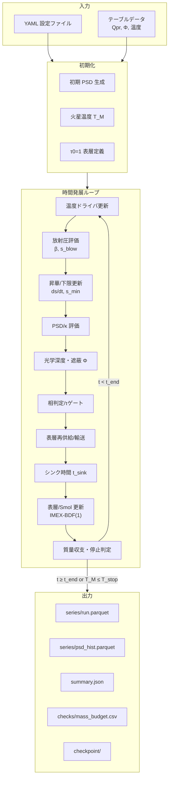
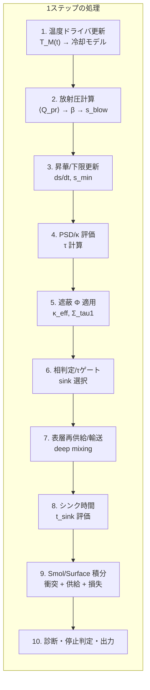
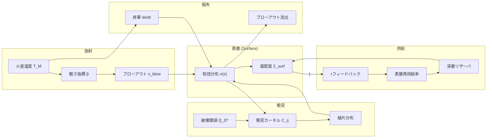
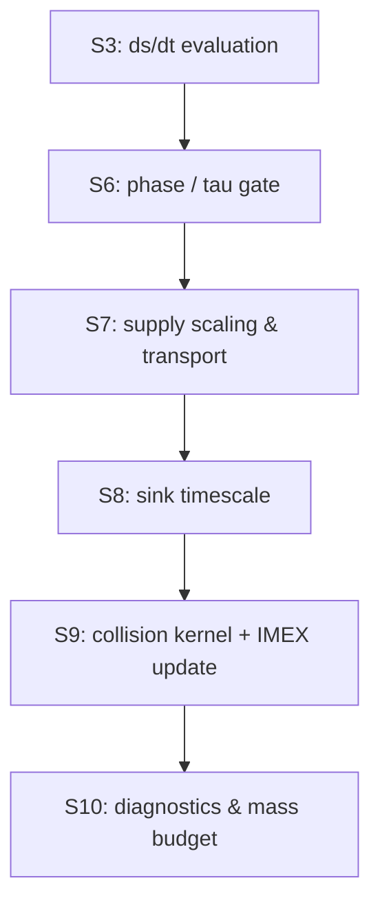
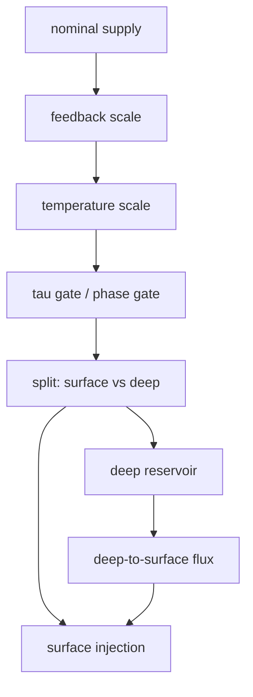
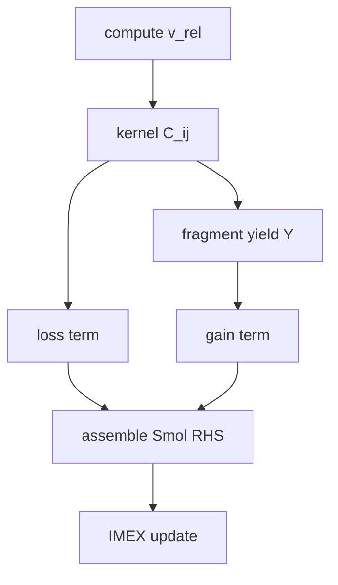
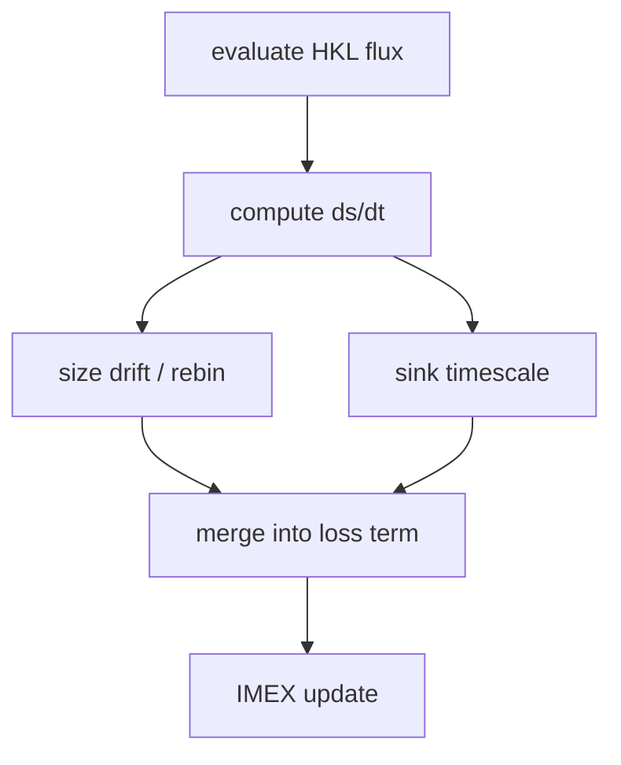

## 3. 時間発展アルゴリズム

時間発展ループの全体像と処理順序を整理し，主要な依存関係を示す．実装順序は analysis/physics_flow.md を正とし，ここでは概念図として示す．

### 3.0 支配方程式の位置づけ

本書では主要式を抜粋して再掲し，式番号・記号定義は analysis/equations.md を正とする．

- **軌道力学と時間尺度**: (E.001)–(E.002) で $\Omega$, $v_K$ を定義し，$t_{\rm blow}$ の基準は (E.007) に従う．放射圧の整理は \citep{Burns1979_Icarus40_1} を採用する．
- **衝突カスケード**: PSD の時間発展は Smoluchowski 方程式 (E.010) を用い，質量収支は (E.011) で検査する．枠組みは \citep{Krivov2006_AA455_509,Dohnanyi1969_JGR74_2531} に基づく．
- **破砕強度と破片生成**: 破壊閾値 $Q_D^*$ の補間 (E.026) は \citep{BenzAsphaug1999_Icarus142_5,LeinhardtStewart2012_ApJ745_79} を参照する．
- **放射圧ブローアウト**: β と $s_{\rm blow}$ の定義は (E.013)–(E.014)，表層流出は (E.009) に依拠する．
- **昇華と追加シンク**: HKL フラックス (E.018) と飽和蒸気圧 (E.036) に基づき，昇華モデルの位置づけは \citep{Markkanen2020_AA643_A16} を参照する．
- **遮蔽と表層**: 自遮蔽係数 $\Phi$ は (E.015)–(E.017) により表層に適用し，gas-rich 条件の参照枠は \citep{TakeuchiLin2003_ApJ593_524} で位置づける．

以下の図は，入力（YAML/テーブル）から初期化・時間発展・診断出力に至る主経路を示す．**実装順序は analysis/physics_flow.md を正**とし，ここでは概念的な依存関係の整理として示す．

### 3.1 シミュレーション全体像

### 3.2 メインループ詳細

補足: 損失項（ブローアウト・追加シンク）は S9 の IMEX 更新に含まれ，S6 は相判定とゲート選択，S8 は $t_{\rm sink}$ の評価，S10 は診断集計と出力を担当する．

各ステップでは温度ドライバの出力から $T_M$ を更新し，放射圧関連量（$\langle Q_{\rm pr}\rangle$, β, $s_{\rm blow}$）と遮蔽量（$\Phi$, $\kappa_{\rm eff}$, $\tau_{\rm los}$）を再評価する．供給はフィードバックや温度スケールを通して表層に注入され，必要に応じて深層リザーバを経由する．表層 ODE または Smoluchowski 更新の後に，ブローアウトと追加シンクによる損失を加味し，質量収支と停止条件を評価する．

図 3.2 の手順と実装の対応は次の通りである．S1 は温度ドライバの評価と $T_M$ の更新，S2 は $Q_{\rm pr}$ テーブルから β と $s_{\rm blow}$ を評価する．S3 は昇華 ds/dt と $s_{\\rm min}$ を評価し，S4 で PSD と $\\kappa$ を更新して $\\tau$ を計算する．S5 は $\\Phi$ を適用して $\\kappa_{\\rm eff}$ と $\\Sigma_{\\tau=1}$ を評価し，S6 で相判定と $\\tau$ ゲートにより有効な損失経路を選択する．S7 は供給率の名目値を計算し，フィードバック・温度スケール・深層輸送を適用する．S8 はシンク時間 $t_{\\rm sink}$ を評価し，S9 で衝突カーネルに基づく gain/loss と供給・シンクを含めた IMEX 更新を行う．S10 は $\\dot{M}_{\\rm out}$ などの診断集計，$\\tau_{\\rm stop}$ 超過の停止判定，C4 質量収支検査，および出力書き込みに対応する．

### 3.3 物理過程の相互作用

主要状態変数は PSD 形状 $n_k$（`psd_state.number`），表層面密度 $\Sigma_{\rm surf}$，深層リザーバ面密度 $\Sigma_{\rm deep}$，累積損失量 $M_{\rm out}$/$M_{\rm sink}$ であり，時間発展ごとに同時更新される\citep{Krivov2006_AA455_509}．Smol 更新では $N_k$ を一時的に構成して積分し，更新後に $n_k$ へ写像して `psd_state` に戻す．計算順序と依存関係は analysis/physics_flow.md の結合順序図に従う．

### 3.4 供給・衝突・昇華の時系列因果

供給（supply）・衝突（collision）・昇華（sublimation）は同一ステップ内で相互依存するため，因果順序を以下の通り固定する．図 3.2 の S3（昇華），S6（相判定/ゲート），S7（供給），S8（シンク時間），S9（衝突/IMEX 更新）に対応する内部順序を明示し，診断列と対応させる\citep{WyattClarkeBooth2011_CeMDA111_1,Krivov2006_AA455_509,Markkanen2020_AA643_A16}．

S3 では昇華 ds/dt を評価し，S6 で相判定と $\\tau$ ゲートにより有効な損失経路を選択する．S7 で名目供給 `supply_rate_nominal` にフィードバックと温度補正を適用して `supply_rate_scaled` を得た後，深層輸送を含めた表層注入量を決定する．S8 でシンク時間 $t_{\\rm sink}$ を評価し，S9 で衝突カーネルから loss/gain を構成して IMEX 更新を実施する．S10 で `smol_gain_mass_rate` / `smol_loss_mass_rate` / `ds_dt_sublimation` / `M_out_dot` を含む診断と質量収支を保存する．

#### 3.4.1 供給フロー（Supply）

- 対応する診断列は `supply_rate_nominal` → `supply_rate_scaled` → `supply_rate_applied`，深層経路は `prod_rate_diverted_to_deep` / `deep_to_surf_flux` / `prod_rate_applied_to_surf` に記録される\citep{WyattClarkeBooth2011_CeMDA111_1}．
- 供給の有効化は phase（solid）と液相ブロックで決まり，$\\tau_{\\rm gate}$ はブローアウトのみをゲートする．停止判定（$\\tau_{\\rm stop}$）とは区別して扱う．

#### 3.4.2 衝突フロー（Collision）

- 相対速度は $e,i$ と $c_{\\rm eq}$ から評価し，カーネル $C_{ij}$ を構成する\citep{Ohtsuki2002_Icarus155_436,WetherillStewart1993_Icarus106_190}．
- loss/gain は `smol_loss_mass_rate` / `smol_gain_mass_rate` として診断され，最小衝突時間 $t_{\\rm coll,\\,min}$ が $\\Delta t$ の上限に用いられる．
- 破片分布 $Y$ は PSD グリッド上で再配分され，質量保存は C4 により検査される\citep{Krivov2006_AA455_509,Thebault2003_AA408_775}．

#### 3.4.3 昇華フロー（Sublimation）

- HKL フラックスから ds/dt を評価し，必要に応じて再ビニングで PSD を更新する\citep{Markkanen2020_AA643_A16,Pignatale2018_ApJ853_118}．
- `sub_params.mass_conserving=true` の場合は $s<s_{\\rm blow}$ を跨いだ質量をブローアウトへ振り替える．
- 昇華由来の損失は `ds_dt_sublimation` / `mass_lost_sublimation_step` として出力される．

---
