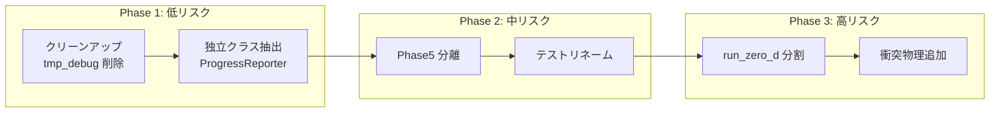

# marsdisk コード整備計画：衝突物理追加に向けた準備

> **作成日**: 2024-12-16  
> **目的**: 今後の衝突物理変更・追加を安全かつ効率的に行うために、`marsdisk/` の既存コード構成を整備しリスクを担保する計画

---

## 背景

研究スクリプト `scripts/research/run_temp_supply_sweep.sh` を中心とした研究を進める中で、衝突物理の追加・変更が必要になる見込み。しかし、過去のテスト用シミュレーションや検証コードが `marsdisk/` 内に散在しており、コードの把握・変更が困難な状態にある。

### 関連ドキュメント

- [run_py_sections.md](file:///Users/daichi/marsshearingsheet/analysis/run_py_sections.md): `run.py` 内部構造マップ
- [equations.md](file:///Users/daichi/marsshearingsheet/analysis/equations.md): 衝突関連式 (E.020–E.026)
- [AGENTS.md](file:///Users/daichi/marsshearingsheet/AGENTS.md): 完了条件と DocSyncAgent 手順

---

## 1. 現状の問題点サマリ

### 1.1 コード肥大化

| ファイル | 行数 | 問題 |
|----------|------|------|
| `run.py` | 5,455 | `run_zero_d()` 単体で 3,900 行、責務過多 |
| `collisions_smol.py` | 745 | 衝突ステップ + supply 注入 + velocity ブレンドが混在 |
| `schema.py` | ~65,000 bytes | 全設定が一枚岩、衝突関連の追加で肥大化リスク |

### 1.2 テスト・デバッグコードの散在

| 場所 | ファイル数 | 内容 | 問題 |
|------|-----------|------|------|
| `tests/` | 72 | メインテスト | Phase 番号命名の履歴的混乱 |
| `marsdisk/tests/` | 10 | パッケージ内テスト | tests/ との責務重複不明確 |
| `tmp_debug/` | 73 | 一時デバッグ | 未整理のまま残存 |
| `tmp_debug2/` | 6 | 同上 | 同上 |
| `agent_test/` | 626 | AI エージェント用 | 研究テストと混在 |

### 1.3 Phase 命名の履歴的残骸

| Phase | テスト / コード | 現在の状態 |
|-------|----------------|-----------|
| Phase3 | `test_phase3_surface_blowout.py` | 表層 + blowout の初期実装残骸 |
| Phase5 | `run_phase5_comparison()` | 2バリアント比較、約 240 行が `run.py` に残存 |
| Phase7 | `PHASE7_SCHEMA_VERSION`, 診断トラック | 現在も使用中だが命名が不明瞭 |
| Phase9 | `test_phase9_usecases.py` | ユースケーステスト |

### 1.4 衝突物理の責務散在

```
衝突関連コードの現在位置:
  physics/dynamics.py       → v_ij, solve_c_eq, update_e
  physics/collide.py        → C_ij カーネル計算
  physics/collisions_smol.py → ステップ統合 + fragment tensor + velocity blend
  physics/smol.py           → IMEX ソルバ
  physics/qstar.py          → Q_D* 破壊閾値
  physics/fragments.py      → 最大残骸比
  run.py:L3015             → step_collisions_smol_0d 呼び出し（25+ 引数）
```

---

## 2. 整備すべき点（優先度順）

### 2.1 【高優先度】`step_collisions_smol_0d` の引数整理

**現状**:
```python
smol_res = collisions_smol.step_collisions_smol_0d(
    psd_state=..., sigma_surf=..., dt=..., prod_subblow_area_rate=...,
    r=..., Omega=..., v_rel=..., dynamics_cfg=..., a_blow=...,
    enable_blowout=..., rho=..., alpha_frag=..., s_min_eff=...,
    supply_mode=..., supply_s_inj_min=..., supply_s_inj_max=...,
    supply_q=..., supply_velocity_cfg=..., headroom_policy=...,
    # ... 約 25 引数
)
```

**提案**:
```python
@dataclass
class CollisionStepContext:
    dt: float
    Omega: float
    sigma_surf: float
    dynamics_cfg: Dynamics
    supply_cfg: SupplyConfig | None
    shielding: ShieldingState
    # ... グループ化

smol_res = collisions_smol.step_collisions(ctx, psd_state)
```

**効果**: 衝突物理パラメータ追加時の変更箇所が `CollisionStepContext` のみに限定

---

### 2.2 【高優先度】`tmp_debug*/` のクリーンアップ

**現状**: 73 + 6 = 79 ファイルが未整理で残存

**提案**:
1. 内容を精査し、必要なものは `tests/archived/` へ移動
2. 不要なものは削除
3. `.gitignore` に `tmp_debug*/` を追加して再発防止

**リスク担保**:
- 削除前に `git stash` または別ブランチでバックアップ
- 研究に必要なファイルがないか確認するため、まず `ls -la` でリスト化

---

### 2.3 【中優先度】`run.py` の段階的分割

**ステップ 1（低リスク）**: 独立クラスの抽出
```
run.py → marsdisk/runtime/progress.py    (ProgressReporter)
run.py → marsdisk/io/streaming.py        (StreamingState)
run.py → marsdisk/runtime/history.py     (ZeroDHistory)
```

**ステップ 2（中リスク）**: Phase5 比較機能の分離
```
run.py → marsdisk/run_phase5.py          (run_phase5_comparison 関連)
```

**ステップ 3（高リスク・将来）**: `run_zero_d` の内部関数分離
- `_lookup_qpr`, `_resolve_blowout` → 独立ヘルパーへ
- ループ本体のセクション化

---

### 2.4 【中優先度】テストディレクトリの整理

**現状**:
```
tests/
  test_phase3_surface_blowout.py
  test_phase5.py
  test_phase7_single_process.py
  test_phase9_usecases.py
  test_collision_solver_modes.py
  ...
```

**提案**:
```
tests/
  unit/                      # 単一関数の単体テスト
    test_dynamics.py
    test_qstar.py
    test_collide_kernel.py
  integration/               # 複数モジュール統合
    test_collision_solver_modes.py
    test_streaming_merge.py
  research/                  # 研究スクリプト検証
    test_temp_supply_sweep.py
  legacy/                    # Phase 命名のレガシー（将来削除候補）
    test_phase3_surface_blowout.py
    test_phase5.py
```

---

### 2.5 【低優先度】`marsdisk/tests/` の統合判断

`marsdisk/tests/` (10 ファイル) と `tests/` (72 ファイル) の役割重複を解消：

| 選択肢 | 内容 | 推奨度 |
|--------|------|--------|
| A | `marsdisk/tests/` を `tests/unit/` へ統合 | ✓ 推奨 |
| B | 両方を維持し責務を明文化 | △ 管理コスト |
| C | `marsdisk/tests/` を pytest 除外して非公式化 | × 混乱増 |

---

## 3. リスク担保策

### 3.1 変更前の基準点確立

```bash
# 1. 全テスト通過を確認
make test  # または pytest tests/ marsdisk/tests/

# 2. カバレッジ基準を記録
python -m tools.doc_sync_agent --all --write
cat analysis/coverage.json | jq '.function_reference_rate'
# → 現在 1.0 を維持

# 3. 研究スクリプトの基準出力を保存
scripts/research/run_temp_supply_sweep.sh (短縮版)
cp out/temp_supply_sweep/latest/summary.json tests/fixtures/baseline_summary.json
```

### 3.2 段階的リファクタリング戦略



### 3.3 各変更の検証プロトコル

| 変更種別 | 検証方法 |
|----------|----------|
| ファイル移動 | `git mv` + import 更新後に `pytest --tb=short` |
| 関数抽出 | 既存テストの通過 + 呼び出し元の動作確認 |
| 引数リファクタ | 研究スクリプト実行 → summary.json 比較 |
| Phase 分離 | `test_phase*.py` の個別実行確認 |

### 3.4 ロールバック計画

```bash
# 万が一の場合のロールバック
git reflog  # 変更前コミットを特定
git reset --hard <commit-before-refactor>
```

### 3.5 CI 統合（推奨）

```yaml
# .github/workflows/refactor-guard.yml
- name: Baseline comparison
  run: |
    pytest tests/ -q
    python -m agent_test.ci_guard_analysis \
      --coverage analysis/coverage.json \
      --fail-under 0.75 \
      --require-clean-anchors
```

---

## 4. 衝突物理追加への影響マップ

リファクタ後、衝突物理を追加する際の変更箇所が限定される：

| リファクタ前 | リファクタ後 |
|-------------|-------------|
| `run.py` の 25+ 引数を編集 | `CollisionStepContext` に 1 フィールド追加 |
| `collisions_smol.py` 全体を読解 | `dynamics.py` に新関数追加のみ |
| Phase テストの名前から意図を推測 | `tests/unit/test_collision_velocity.py` で明確 |
| `tmp_debug/` のどれが最新か不明 | 削除済みでクリーン |

---

## 5. 推奨実施順序

| 順序 | タスク | 推定工数 | リスク |
|------|--------|----------|--------|
| 1 | `tmp_debug*/` クリーンアップ | 30 分 | 低 |
| 2 | `ProgressReporter` 抽出 | 1 時間 | 低 |
| 3 | `StreamingState` 抽出 | 1 時間 | 低 |
| 4 | `ZeroDHistory` 抽出 | 1 時間 | 低 |
| 5 | テストディレクトリ再構成 | 2 時間 | 中 |
| 6 | `CollisionStepContext` 導入 | 2 時間 | 中 |
| 7 | Phase5 関数分離 | 1 時間 | 中 |
| 8 | `run_zero_d` 内部整理 | 4+ 時間 | 高 |

**合計**: 約 12–15 時間（分割実施可能）

---

## 6. 今すぐ実施すべき最小限のアクション

衝突物理追加前に**必須**で実施すべきこと：

1. **`tmp_debug*/` の削除**（30 分）
   - 混乱源の除去、検索ノイズ低減

2. **`CollisionStepContext` の導入**（2 時間）
   - 衝突パラメータ追加の主経路を確立

3. **基準テスト出力の保存**（15 分）
   - リファクタ前後の比較基準を確保

---

## 7. 完了条件

- [ ] `tmp_debug*/` が削除または整理されている
- [ ] `CollisionStepContext` が導入され、`step_collisions_smol_0d` の呼び出しが簡素化
- [ ] 全テストが通過（`pytest tests/ marsdisk/tests/` 成功）
- [ ] `analysis/coverage.json` の `function_reference_rate` が 0.75 以上を維持
- [ ] 本ドキュメントの完了条件がすべてチェック済み

---

## 変更履歴

| 日付 | 変更内容 |
|------|----------|
| 2024-12-16 | 初版作成 |
