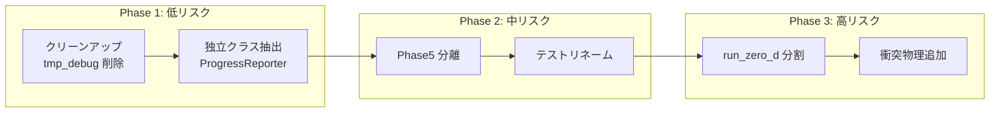
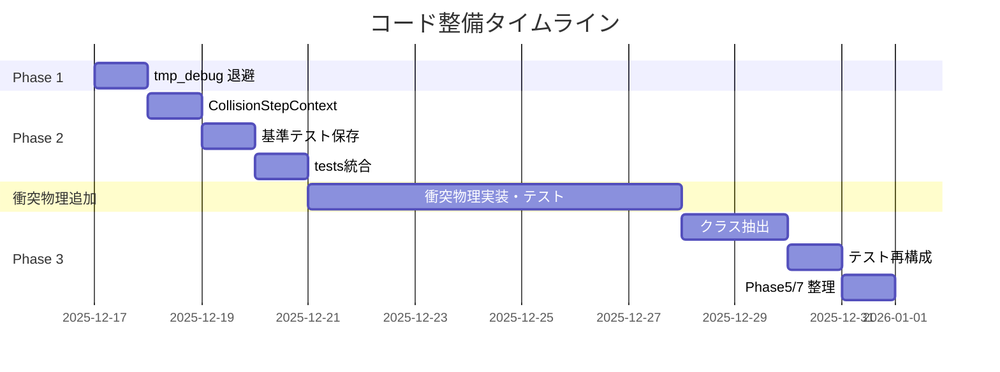

# marsdisk コード整備計画：衝突物理追加に向けた準備

> **作成日**: 2025-12-16  
> **目的**: 今後の衝突物理変更・追加を安全かつ効率的に行うために、`marsdisk/` の既存コード構成を整備しリスクを担保する計画

---

## 背景

研究スクリプト `scripts/research/run_temp_supply_sweep.sh` を中心とした研究を進める中で、衝突物理の追加・変更が必要になる見込み。しかし、過去のテスト用シミュレーションや検証コードが `marsdisk/` 内に散在しており、コードの把握・変更が困難な状態にある。

### 関連ドキュメント

- [analysis/run_py_sections.md]: `run_zero_d.py` 内部構造マップ
- [analysis/equations.md]: 衝突関連式 (E.020–E.026)
- [AGENTS.md]: 完了条件と DocSyncAgent 手順

---

## 1. 現状の問題点サマリ

### 1.1 コード肥大化

| ファイル | 行数 | 問題 |
|----------|------|------|
| `run_zero_d.py` | 5,548 | `run_zero_d()` 単体で 3,900 行、責務過多 |
| `collisions_smol.py` | 745 | 衝突ステップ + supply 注入 + velocity ブレンドが混在 |
| `schema.py` | ~65,000 bytes | 全設定が一枚岩、衝突関連の追加で肥大化リスク |

### 1.2 テスト・デバッグコードの散在

| 場所 | ファイル数 | 内容 | 問題 |
|------|-----------|------|------|
| `tests/` | 72 | メインテスト | Phase 番号命名の履歴的混乱 |
| `tests/` | 10 | パッケージ内テスト | tests/ との責務重複不明確 |
| `tmp_debug/` | 73 | 一時デバッグ | 未整理のまま残存 |
| `tmp_debug2/` | 6 | 同上 | 同上 |
| `agent_test/` | 626 | AI エージェント用 | 研究テストと混在 |

### 1.3 Phase 命名の履歴的残骸

| Phase | テスト / コード | 現在の状態 |
|-------|----------------|-----------|
| Phase3 | `tests/integration/test_phase3_surface_blowout.py` | 表層 + blowout の初期実装残骸 |
| Phase5（削除済み） | ― | 2バリアント比較ランナーは Phase3 で削除済み |
| Phase7→extended | `EXTENDED_DIAGNOSTICS_VERSION`, 診断トラック | 現在も使用中だが命名が不明瞭 |
| Phase9 | `tests/integration/test_phase9_usecases.py` | ユースケーステスト |

### 1.4 衝突物理の責務散在

```
衝突関連コードの現在位置:
  physics/dynamics.py       → v_ij, solve_c_eq, update_e
  physics/collide.py        → C_ij カーネル計算
  physics/collisions_smol.py → ステップ統合 + fragment tensor + velocity blend
  physics/smol.py           → IMEX ソルバ
  physics/qstar.py          → Q_D* 破壊閾値
  physics/fragments.py      → 最大残骸比
  run_zero_d.py:L3015        → step_collisions_smol_0d 呼び出し（25+ 引数）
```

---

## 2. 整備すべき点（優先度順）

### 2.1 【高優先度】`step_collisions_smol_0d` の引数整理

**現状**: 27 個の引数が散在

**確定設計**: 5 グループに分類

```python
from dataclasses import dataclass
from typing import TYPE_CHECKING

if TYPE_CHECKING:
    from marsdisk.schema import Dynamics, SupplyInjectionVelocity

@dataclass
class TimeOrbitParams:
    """Group A: 時間・軌道パラメータ"""
    dt: float
    Omega: float
    r: float  # 軌道半径 [m]

@dataclass
class MaterialParams:
    """Group B: 物質パラメータ"""
    rho: float              # 粒子密度 [kg/m^3]
    a_blow: float           # ブローアウト半径 [m]
    s_min_effective: float | None

@dataclass
class DynamicsParams:
    """Group C: 力学パラメータ"""
    e_value: float
    i_value: float
    dynamics_cfg: "Dynamics | None"
    tau_eff: float | None

@dataclass
class SupplyParams:
    """Group D: 供給パラメータ"""
    prod_subblow_area_rate: float
    supply_injection_mode: str
    supply_s_inj_min: float | None
    supply_s_inj_max: float | None
    supply_q: float
    supply_velocity_cfg: "SupplyInjectionVelocity | None"

@dataclass
class CollisionControlFlags:
    """Group E: 制御フラグ"""
    enable_blowout: bool
    collisions_enabled: bool
    mass_conserving_sublimation: bool
    headroom_policy: str
    sigma_tau1: float | None
    t_sink: float | None
    ds_dt_val: float | None

@dataclass
class CollisionStepContext:
    """衝突ステップの統合コンテキスト"""
    time_orbit: TimeOrbitParams
    material: MaterialParams
    dynamics: DynamicsParams
    supply: SupplyParams
    control: CollisionControlFlags
    sigma_surf: float  # 現在の表層密度
```

**新しい呼び出し形式**:
```python
smol_res = collisions_smol.step_collisions(ctx, psd_state)
```

**効果**: 衝突物理パラメータ追加時の変更箇所が `CollisionStepContext` のみに限定

---

### 2.2 【高優先度】`tmp_debug*/` の Git 外退避

**現状**: 73 + 6 = 79 ファイルが未整理で残存

**決定事項**: 全て Git 外退避とする（論文図表データは含まれていないことを確認済み）

**削除基準**（以下に該当するものは削除対象）:
- 最終更新が **1 ヶ月** 以上前
- ファイル名に日付がなく、目的が不明
- 類似内容が `tests/` または `out/<run_id>/...` に既存

**実施手順**:
```bash
# 1. 内容リスト化（記録用）
ls -laR tmp_debug/ > tmp_debug_inventory.txt
ls -laR tmp_debug2/ >> tmp_debug_inventory.txt

# 2. Git 外バックアップ（外部ストレージへ）
tar czf tmp_debug_backup_$(date +%Y%m%d).tar.gz tmp_debug/ tmp_debug2/
# → バックアップファイルを外部ストレージに移動

# 3. ディレクトリ削除
rm -rf tmp_debug/ tmp_debug2/

# 4. 再発防止
echo 'tmp_debug*/' >> .gitignore
git add .gitignore
git commit -m "chore: add tmp_debug to gitignore"
```

---

### 2.3 【中優先度】`run_zero_d.py` の段階的分割

**ステップ 1（低リスク）**: 独立クラスの抽出
```
run_zero_d.py → marsdisk/runtime/progress.py    (ProgressReporter)
run_zero_d.py → marsdisk/io/streaming.py        (StreamingState)
run_zero_d.py → marsdisk/runtime/history.py     (ZeroDHistory)
```

**ステップ 2（中リスク）**: Phase5 比較機能の分離・削除
```
run_zero_d.py → marsdisk/runtime/legacy_steps.py (run_phase5_comparison 関連)
→ 今後不必要のため削除候補としてマーク
```

**ステップ 3（中リスク）**: Phase7 のリネーム

> [!IMPORTANT]
> **Phase7 リネーム対象箇所**
>
> | ファイル | 箇所数 | 主な内容 |
> |----------|--------|----------|
> | `marsdisk/run_zero_d.py` | 30+ | `EXTENDED_DIAGNOSTICS_VERSION`, `extended_diag_enabled`, tracking変数, summary出力 |
> | `marsdisk/schema.py` | 7 | `Phase7Diagnostics` クラス定義 |
> | `marsdisk/io/writer.py` | 6 | カラム説明文 |
> | `marsdisk/orchestrator.py` | 1 | 定数定義 |
>
> **名前変更案**: `phase7` → `extended_diagnostics` または `diag_v1`

**ステップ 4（高リスク・将来）**: `run_zero_d` の内部関数分離
- `_lookup_qpr`, `_resolve_blowout` → 独立ヘルパーへ
- ループ本体のセクション化

---

### 2.4 【中優先度】テストディレクトリの整理

**現状**:
```
tests/
  integration/
    test_phase3_surface_blowout.py
    test_extended_diagnostics_single_process.py
    test_run_regressions.py
    ...
  unit/
    test_core.py
    ...
  research/
    test_phase_integration_siO2.py
    test_phase_sublimation_integration.py
    test_siO2_cooling_model.py
  legacy/
    test_phase5.py
```

**提案**:
```
tests/
  unit/                      # 単一関数の単体テスト
    test_dynamics.py
    test_qstar.py
    test_collide_kernel.py
  integration/               # 複数モジュール統合
    test_collision_solver_modes.py
    test_streaming_merge.py
  research/                  # 研究スクリプト検証
    test_temp_supply_sweep.py
  legacy/                    # Phase 命名のレガシー（将来削除候補）
    test_phase5.py
```

> [!IMPORTANT]
> **テスト名・パス変更時の必須手順**
>
> テストファイルのリネームや移動は `analysis/` 内のアンカー参照に影響する。
> 以下の手順を **必ず** 実施すること：
>
> ```bash
> # 1. 移動前にアンカー参照を確認
> grep -r "test_phase3" analysis/
>
> # 2. ファイル移動（git mv 必須）
> git mv tests/integration/test_phase3_surface_blowout.py tests/legacy/<test_phase3_surface_blowout>.py
>
> # 3. アンカー参照を更新
> # analysis/overview.md 等の [tests/integration/test_phase3_surface_blowout.py:...] を更新
>
> # 4. DocSyncAgent 実行 + テスト
> make analysis-update  # DocSync → doc-tests の順で実行
>
> # 5. カバレッジガード確認
> python -m agent_test.ci_guard_analysis \
>   --coverage analysis/coverage/coverage.json \
>   --fail-under 0.75 --require-clean-anchors
> ```

---

### 2.5 【低優先度】`tests/` の統合判断

`tests/` (10 ファイル) と `tests/` (72 ファイル) の役割重複を解消：

| 選択肢 | 内容 | 推奨度 |
|--------|------|--------|
| A | `tests/` を `tests/unit/` へ統合 | ✓ 推奨 |
| B | 両方を維持し責務を明文化 | △ 管理コスト |
| C | `tests/` を pytest 除外して非公式化 | × 混乱増 |

---

## 3. リスク担保策

### 3.1 変更前の基準点確立

```bash
# 1. 全テスト通過を確認
make test  # または pytest tests/ tests/

# 2. DocSyncAgent + ドキュメントテスト（AGENTS.md 必須手順）
make analysis-update  # DocSync → doc-tests の順で実行
# または個別実行:
python -m tools.doc_sync_agent --all --write
make analysis-doc-tests  # pytest tests/test_analysis_* を実行

# 3. カバレッジ基準を記録
cat analysis/coverage/coverage.json | jq '.function_reference_rate'
# → 現在 1.0 を維持

# 4. 研究スクリプトの基準出力を保存
T_END_SHORT_YEARS=0.001 scripts/research/run_temp_supply_sweep.sh
cp out/<run_id>/summary.json tests/fixtures/baseline_summary.json

# 5. 評価システム実行（シミュレーション後は必須）
python -m tools.evaluation_system --outdir out/<run_id>
```

> [!WARNING]
> AGENTS.md により、DocSyncAgent 実行後は **必ず** `make analysis-doc-tests` と
> `python -m tools.evaluation_system --outdir <run_dir>` を実行すること。
> これを忘れると CI で落ちる可能性がある。

### 3.2 段階的リファクタリング戦略



### 3.3 各変更の検証プロトコル

| 変更種別 | 検証方法 |
|----------|----------|
| ファイル移動 | `git mv` + import 更新後に `pytest --tb=short` |
| 関数抽出 | 既存テストの通過 + 呼び出し元の動作確認 |
| 引数リファクタ | 研究スクリプト実行 → summary.json 比較 |
| Phase 分離 | `test_phase*.py` の個別実行確認 |

### 3.4 ロールバック計画

> [!CAUTION]
> **`git reset --hard` は使用禁止**（AGENTS.md「既存変更の破壊禁止」に違反）
>
> リファクタリングに問題が発生した場合は、以下の **非破壊的手順** を使用すること。

**方法 A: git revert（推奨）**
```bash
# リファクタコミットを特定
git log --oneline -10

# 問題のコミットを revert（履歴を保持したまま取り消し）
git revert <commit-hash>
# 複数コミットの場合:
git revert --no-commit <oldest-commit>^..<newest-commit>
git commit -m "revert: rollback refactor due to <reason>"
```

**方法 B: 退避ブランチからの復元**
```bash
# リファクタ前に必ず退避ブランチを作成しておく
git checkout -b backup/before-refactor-20251216
git checkout main

# 問題発生時：退避ブランチの状態を新コミットとして適用
git checkout backup/before-refactor-20251216 -- <問題のファイル>
git commit -m "restore: revert <file> from backup branch"
```

**方法 C: cherry-pick で部分復元**
```bash
# 正常だったコミットの変更だけを取り出す
git cherry-pick <good-commit-hash>
```

### 3.5 CI 統合（推奨）

```yaml
# ..github/workflows/tests.yml
- name: Baseline comparison
  run: |
    pytest tests/ -q
    python -m agent_test.ci_guard_analysis \
      --coverage analysis/coverage/coverage.json \
      --fail-under 0.75 \
      --require-clean-anchors
```

---

## 4. 衝突物理追加への影響マップ

リファクタ後、衝突物理を追加する際の変更箇所が限定される：

| リファクタ前 | リファクタ後 |
|-------------|-------------|
| `run_zero_d.py` の 25+ 引数を編集 | `CollisionStepContext` に 1 フィールド追加 |
| `collisions_smol.py` 全体を読解 | `dynamics.py` に新関数追加のみ |
| Phase テストの名前から意図を推測 | `tests/unit/test_collisions_ei_feedback.py` で明確 |
| `tmp_debug/` のどれが最新か不明 | 削除済みでクリーン |

---

## 5. 段階的実施計画（確定）

### Phase 1: クリーンアップ（今すぐ、30分）

| タスク | 工数 | 内容 |
|--------|------|------|
| `tmp_debug*/` Git 外退避 | 30 分 | tar.gz 作成 → 外部ストレージ → 削除 → gitignore 追加 |

**完了基準**: `tmp_debug/` と `tmp_debug2/` が削除され、`.gitignore` に追加済み

---

### Phase 2: 衝突物理追加の前提条件（3時間）

| タスク | 工数 | 内容 |
|--------|------|------|
| `CollisionStepContext` 導入 | 2 時間 | 5グループに分類したdataclass実装 + 呼び出し元更新 |
| 基準テスト出力の保存 | 15 分 | baseline_summary.json 作成 |
| `tests/` 統合 | 45 分 | `tests/unit/` へ移動（選択肢 A 確定） |

**完了基準**: 
- `step_collisions_smol_0d` が `CollisionStepContext` を受け取るように変更
- `tests/fixtures/baseline_summary.json` が存在
- 全テスト通過

---

### Phase 3: 衝突物理安定後のリファクタ（5–7時間）

| タスク | 工数 | 内容 |
|--------|------|------|
| `ProgressReporter` 抽出 | 1 時間 | `marsdisk/runtime/progress.py` へ |
| `StreamingState` 抽出 | 1 時間 | `marsdisk/io/streaming.py` へ |
| `ZeroDHistory` 抽出 | 1 時間 | `marsdisk/runtime/history.py` へ |
| テストディレクトリ再構成 | 2 時間 | `unit/`, `integration/`, `research/`, `legacy/` に分類 |
| Phase5 削除 | 30 分 | `run_phase5_comparison` 関連コード削除 |
| Phase7 リネーム | 1 時間 | `phase7` → `extended_diagnostics` (44箇所) |

**完了基準**: 
- `run_zero_d.py` が 4,000 行以下
- Phase 命名が解消
- 全テスト通過 + カバレッジ維持

---

## 6. 実施タイムライン



---

## 7. 完了条件

### Phase 1 完了条件
- [x] `tmp_debug*/` が Git 外退避されている
- [x] `.gitignore` に `tmp_debug*/` が追加されている

### Phase 2 完了条件
- [x] `CollisionStepContext` が導入され、`step_collisions_smol_0d` の呼び出しが簡素化
- [x] `tests/fixtures/baseline_summary.json` が作成されている
- [x] `tests/` が `tests/unit/` に統合されている
- [x] 全テストが通過（`pytest tests/ tests/` 成功）

### Phase 3 完了条件
- [x] `ProgressReporter`, `StreamingState`, `ZeroDHistory` が抽出されている
- [x] テストディレクトリが `unit/`, `integration/`, `research/`, `legacy/` に分類されている
- [x] Phase5 関連コードが削除されている
- [x] Phase7 が `extended_diagnostics` にリネームされている
- [x] `analysis/coverage/coverage.json` の `function_reference_rate` が 0.75 以上を維持

### legacy テスト削除時期
- **削除予定**: 衝突物理追加完了後、動作が安定したら `tests/legacy/` を削除

---

## 8. 衝突エネルギー保存導入方針（追加計画）

### 8.1 前提と適用範囲
- 出典は `docs/plan/collision_energy_conservation_requirements.md`（Krivov2006 壊滅的破砕 / Thébault2003 侵食）。新規モデルは増やさず、gas-poor 既定と `ALLOW_TL2003=false` を維持する。
- 式と記号は `analysis/equations.md` に移し、E.xxx アンカーで参照する。導入方針ファイルでは数式を再掲せず、UNKNOWN_REF_REQUESTS を増やさない。

### 8.2 ドキュメント更新タスク
- `analysis/equations.md` に相対運動エネルギー \(E_{\mathrm{rel}}\)、比衝突エネルギー \(Q_R\)、侵食の \(f_{\mathrm{ke}}\)（散逸率 1-f_ke）などを追記し、既存式番号を壊さずに欠番を補完する。
- `analysis/overview.md` にエネルギー簿記のデータフロー（CollisionStepContext → smol step → writer）を追加し、出力カラムを記述する。
- 更新後は必ず `make analysis-sync` → `make analysis-doc-tests` → `python -m tools.evaluation_system --outdir <run_dir>` を実行する。
- 式番号の割り当て案（E.046 以降を使用）：(E.047) \(E_{\mathrm{rel}}\)、(E.048) \(Q_R\)、(E.049) \(f_{\mathrm{ke}}\) による散逸率、(E.050) 反発係数対応 \(f_{\mathrm{ke}}\approx\varepsilon^{2}\)、(E.051) e/i 減衰更新 \(t_{\mathrm{damp}}, e_{n+1}\)、(E.052) Krijt & Kama 表面エネルギー起源の \(s_{\min}\)。実際に追記する際は欠番がないか確認して確定する。

### 8.3 実装スコープ（0D 優先）
- `CollisionStepContext` にエネルギー簿記用フィールド（例: `E_rel`, `f_ke`, `dE_dissipated`, `dE_retained`）を追加し、smol ステップで算出・保持する。値の入力元は Krivov/Thébault の既存式に限定し、新しい係数は導入しない。
- `marsdisk/physics/collisions_smol.py` で衝突前後の運動エネルギーと散逸分を評価し、`smol_res` に格納する。
- 出力追加: `out/<run_id>/series/run.parquet` に `E_rel`, `E_dissipated`, `E_retained`, `E_error_percent`（質量誤差ログに準じた閾値 0.5%）を追加。`out/<run_id>/summary.json` に 2 年間の総散逸エネルギーと最大誤差を追加。
- 質量保存ログ `out/<run_id>/checks/mass_budget.csv` にエネルギー列を並記し、閾値超過時は同様にアラートを出す。

### 8.4 テストと検証
- pytest: (1) `f_ke` による散逸上限が守られること（侵食ケース）。(2) 壊滅的破砕で `E_dissipated` が正で、`E_rel = E_dissipated + E_retained` となること。(3) IMEX 時間積分でエネルギー誤差が Δt 縮小とともに収束すること。既存の wavy PSD テストに影響しないことも確認。
- 実行確認: `python -m marsdisk.run --config configs/base.yml` で `E_*` カラムが埋まり、`E_error_percent` が 0.5% 未満であることを目視確認。

### 8.5 移行手順（短期作業順）
1. `analysis/equations.md`/`overview.md` を更新し、DocSync + doc tests + evaluation を実行。
2. `CollisionStepContext` 拡張と smol 内簿記の実装、出力カラム追加。
3. pytest 追加（散逸率・収束・符号チェック）、CI ガードに組み込む。
4. 基準 run（base.yml）を保存し、`out/<run_id>/run_card.md` に評価結果を記録（run_id 例: `<timestamp>_energy_bookkeeping__<sha>`）。

### 8.6 追加の具体化事項
- 反発係数との整合: `f_ke_effective = min(1, max(0, eps_restitution**2))` をデフォルトの近似とし、設定で上書き可能にする。侵食では Thébault の \(f_{\mathrm{ke}}\) を優先し、壊滅的破砕では `f_ke_fragmentation`（既定 0.1 など）を導入するか、設定が無い場合は eps² でフォールバックする。
- e/i 更新: `dynamics.update_e_i` に減衰タイムスケール \(t_{\mathrm{damp}}=t_{\mathrm{coll}}/\varepsilon^{2}\) を組み込み、散逸ログと同じ eps/f_ke を共有する。`CollisionStepContext` に `eps_restitution`（または `f_ke_effective`）を渡し、速度分散更新とエネルギー簿記が一致するようにする。
- 表面エネルギー制約: [@KrijtKama2014_AA566_L2] による \(s_{\min}\) をオプションで計算し、`psd.floor` との min/ max で下限を決定するフックを追加する（デフォルト off）。採用した場合は `out/<run_id>/series/run.parquet` に `s_min_surface_energy` を出力。
- 壊滅的破砕での熱化係数: §3.2/§6 の指摘に対応し、[@Krivov2006_AA455_509] の破砕でも `f_ke_fragmentation` を明示的に適用し、`analysis/overview.md` にフローを記載する。
- checks/energy_budget.csv カラム案（固定名）:
  - `time`, `dt`
  - `E_rel_step`（衝突総相対エネルギー）
  - `E_dissipated_step`（散逸分）
  - `E_retained_step`（残留運動エネルギー）
  - `E_outflow_step`（系外搬出がある場合、なければ0）
  - `E_error_percent`, `tolerance_percent`（質量保存ログと同閾値 0.5%）
  - オプションで `f_ke_mean`, `eps_restitution`（診断用）
- pytest 具体値:
  - 侵食ケース: \(E_{\mathrm{rel}}=1\)（正規化）、`f_ke=0.1` で `E_dissipated≈0.9` を±1e-6 相対で確認。
  - 壊滅的破砕: `f_ke_fragmentation=0.2` で `E_retained≈0.2`、符号が正であること。
  - 収束テスト: `Δt` を `t_coll_min` の {0.1, 0.05, 0.025} 倍で走らせ、`E_error_percent` が一様縮小（少なくとも単調非増）することを確認。

### 8.7 現時点で対応しないこと（混乱防止のため明記）
- 新規衝突モデルの追加（[@Krivov2006_AA455_509] / Thébault 2003 以外）は行わない。TL2003 は既定で無効のまま。
- 1D 半径拡張へのエネルギー簿記適用は今回スコープ外（0D のみに限定）。
- 放射圧・PRドラッグ等による運動エネルギー搬出の詳細モデル化は行わず、必要なら後続タスクで検討する。
- 熱力学的温度計算や融解・蒸発のエネルギー連成は扱わず、運動エネルギー散逸の簿記に留める。
- PSD 勾配や破片分布パラメータ（α 等）の変更は行わない。既存設定のままエネルギー簿記を追加するのみとする。

---

## 変更履歴

| 日付 | 変更内容 |
|------|----------|
| 2025-12-16 | 初版作成 |
| 2025-12-16 | ユーザー決定反映: CollisionStepContext 詳細設計確定、tmp_debug Git外退避、段階的実施（Phase 1/2/3）、Phase7リネーム箇所追加、削除基準1ヶ月に変更 |
| 2025-12-17 | Phase2/3 完了: CollisionStepContext 導入・基準 fixture 追加・テスト統合、ProgressReporter/StreamingState/ZeroDHistory 抽出、Phase5 削除、Phase7→extended_diagnostics リネーム、coverage guard 0.99/anchors pass を確認 |


---

## 関連ドキュメント

- [ストリーミング既定 ON への移行](docs/plan/20251217_streaming_default_on_migration.md): テスト時の明示 OFF 設定を含む
