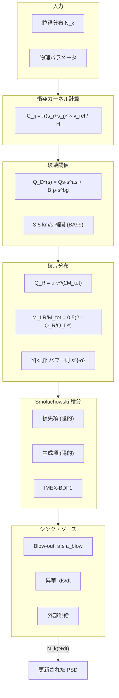

# 現行破砕モデルまとめ（Smoluchowski + LS12/BA99）

> 本メモは、現行の破砕モデル（Smoluchowski 衝突カーネル + LS12/BA99 破片スキーム）の構成要素と制約を短く整理したものです。物理式の唯一の仕様源は `analysis/equations.md` であり、本ドキュメントは参照位置と実装上のノブを示すに留めます。

---

## 📌 このドキュメントについて

**対象読者**: プロジェクト外部の研究者・開発者で、本シミュレーションの衝突破砕モデルを理解したい方

**関連ドキュメント**:
- [analysis/equations.md](analysis/equations.md) — 物理式の正式定義（式番号 E.xxx）
- [analysis/introduction.md](analysis/introduction.md) — 科学的背景と研究目的
- [analysis/glossary.md](analysis/glossary.md) — 用語集・記号規約
- [analysis/bibliography.md](analysis/bibliography.md) — 参考文献一覧

---

## 🔬 科学的背景

### プロジェクト概要

本シミュレーションは、**火星衛星（フォボス・ダイモス）の巨大衝突起源仮説**に基づき、火星ロッシュ限界内（~2.4 火星半径）に形成された高温・高密度ダスト円盤の時間進化を追跡するものです。

巨大衝突後の円盤では、以下の物理過程が質量分布を決定します：
1. **衝突カスケード（本ドキュメントの主題）** — 粒子同士の衝突による破砕・再分布
2. **放射圧ブローアウト** — 火星からの赤外放射による小粒子の系外放出
3. **昇華** — 高温環境（~1000–2000 K）での粒子蒸発

### 破砕モデルの役割

衝突カスケードは、大粒子を破砕して小粒子を供給する主要メカニズムです。特に **blow-out サイズ（β ≃ 0.5 となる粒径、典型値 ~1–10 µm）** 以下の粒子は放射圧で即座に系外へ放出されるため、破砕による小粒子供給率が円盤の質量損失率 $\dot{M}_{\rm out}$ を直接決定します。

---

## 📖 主要用語解説

| 用語 | 英語 | 説明 |
|------|------|------|
| **Smoluchowski 方程式** | Smoluchowski coagulation equation | 粒子同士の衝突による個数密度変化を記述する積分微分方程式 |
| **LS12** | [@LeinhardtStewart2012_ApJ745_79] | 衝突破壊の最大残存核質量を与えるスケーリング則 |
| **BA99** | [@BenzAsphaug1999_Icarus142_5] | 玄武岩様物質の破壊閾値エネルギー $Q_D^*$ の係数 |
| **IMEX-BDF1** | Implicit-Explicit Backward Differentiation Formula (order 1) | 硬い方程式を安定に解くための時間積分法。損失項（陰的）と生成項（陽的）を分離 |
| **blow-out** | Radiation pressure blow-out | 放射圧が重力を上回り、粒子が軌道から脱出する現象 |
| **PSD** | Particle Size Distribution | 粒径分布。通常パワー則 $n(s) \propto s^{-\alpha}$ で近似 |
| **wavy PSD** | Wavy particle size distribution | blow-out 境界付近で生じる PSD の波状構造（衝突と除去のバランスに起因） |
| **0D モデル** | Zero-dimensional model | 軌道半径方向の空間構造を無視し、局所的な時間発展のみを追う近似 |

---

## 目的
- 0D 衝突ステップで採用している破砕モデルの構成要素・ノブ・検証ポイントを一望できるようにする。
- 将来、カーネルや破片分布を差し替える際の影響範囲を把握しやすくする。

## 適用範囲と前提
- 半径無次元（0D）Smoluchowski 解法で、損失項を陰的、生成項を陽的に扱う IMEX-BDF1 を使用する。
- 幾何学カーネル（衝突断面 + 相対速度）と質量保存型の破片分布を組み合わせ、ブローアウト・昇華・追加シンクと同時に解く。
- 1D 拡散（C5）やバウンシング・クレーター生成は現状非対応。

## 実装サマリ（コード参照）

### 処理フロー概要

### 各モジュールの詳細

- 衝突頻度カーネル C_ij: 幾何学断面 π(s_i+s_j)^2 と相対速度 v_rel、スケール高さ H_k に基づく対称行列。`marsdisk/physics/collide.py:18–110`
- 相対速度とカーネル用 e/i: 設定値ベースか、Wyatt 型の自己調整 c_eq を用いる。`marsdisk/physics/collisions_smol.py:380–448`
- 破壊閾値 Q_D*: [@BenzAsphaug1999_Icarus142_5]の係数（3, 5 km/s）を LS12 に従い速度補間し、範囲外では重力項を v^{-3μ+2} でスケール（μ=0.45 デフォルト）。`marsdisk/physics/qstar.py:30–249`
- 衝突エネルギーと最大残存核: 還元比エネルギー Q_R を評価し、LS12 近似で M_LR/M_tot を算出してクリップ。`marsdisk/physics/fragments.py:39–145`
- 破片分布 Y[k,i,j]: 最大残存核をビン max(i,j) に割り当て、残余質量を k≤k_lr にパワー則 s^{-alpha_frag}（デフォルト 3.5）で正規化配分。Numba が有効なら JIT、スカラー v_rel ではキャッシュあり。`marsdisk/physics/collisions_smol.py:178–299`
- シンク/ソース結合: ブローアウトシンク（サイズ≤a_blow は Ω で除去）、任意シンク t_sink、昇華 ds/dt を同時適用。供給質量流は `supply_mass_rate_to_number_source` でビンへマッピング（`min_bin` または `powerlaw_bins`）。`marsdisk/physics/collisions_smol.py:301–744`
- 数値更新: Smol ステップは質量収支 (C4) を監視しつつ dt を半減調整。`marsdisk/physics/smol.py:25–319`

## 主要パラメータとトグル

### パラメータ一覧表

| パラメータ | デフォルト値 | 単位 | 物理的意味 | 設定方法 |
|-----------|-------------|------|-----------|----------|
| `alpha_frag` | 3.5 | — | 破片分布のパワー則指数。[@Dohnanyi1969_JGR74_2531] の衝突平衡値 ≈ 3.5 | 関数引数 |
| `μ` (gravity_velocity_mu) | 0.45 | — | 重力項の速度依存指数。LS09 の推奨値 | `set_gravity_velocity_mu()` |
| `v_rel_mode` | `pericenter` | — | 相対速度の計算方式 | YAML 設定 |
| `kernel_H_mode` | `ia` | — | スケール高さの計算方式 | YAML 設定 |
| `supply_injection_mode` | `min_bin` | — | 供給粒子の分配方式 | YAML 設定 |

### 詳細説明

- 破片スロープ `alpha_frag`（デフォルト 3.5、呼び出し引数で変更可）。
- 重力項の速度指数 μ（デフォルト 0.45、`set_gravity_velocity_mu` で変更可）。
- 相対速度モード: `v_rel_mode`=`pericenter`（既定）／`ohtsuki`。H_k 設定は `kernel_H_mode`=`ia`（i*a スケーリング）か `fixed`。
- 供給分配モード: `supply_injection_mode`=`min_bin`（既定）／`powerlaw_bins` + `s_inj_min/max`、`supply_q`。
- Numba 利用フラグ: `MARSDISK_DISABLE_NUMBA=1` で JIT を無効化。スカラー v_rel では破片テンソルをキャッシュ。

## テスト・検証ノート

### テストスイート概要

本破砕モデルは以下のテストで検証されています：

| テストファイル | 検証内容 | 合格基準 |
|---------------|----------|----------|
| `tests/integration/test_fragment_tensor_numba.py` | Numba JIT と純 Python の整合性 | 相対誤差 < 1e-10 |
| `tests/integration/test_qstar_fragments.py` | $Q_D^*$ と破片モデルの単位整合 | 期待値との一致 |
| `tests/integration/test_qstar_units.py` | CGS/SI 単位系の変換 | 相互変換の無矛盾 |
| `tests/integration/test_baseline_smol_pipeline.py` | Smol パイプライン全体 | 質量保存 |
| `tests/integration/test_smol_supply_source.py` | 供給・シンク結合 | 供給レート再現 |
| `tests/integration/test_scalings.py` | Wyatt 近似との比較 | オーダー一致 |
| `tests/integration/test_surface_outflux_wavy.py` | wavy PSD の定性的再現 | 振動パターン |
| `tests/integration/test_mass_conservation.py` | 質量収支 (C4) | 誤差 < 0.5% |
| `tests/integration/test_mass_budget_combined.py` | 複合シンクでの質量追跡 | 累積誤差 < 1% |

### 詳細

- 破片テンソルと numba/fallback の整合: `tests/integration/test_fragment_tensor_numba.py`
- Q_D* と破片モデルの単位・エネルギー整合: `tests/integration/test_qstar_fragments.py`, `tests/integration/test_qstar_units.py`
- Smol パイプラインと供給・シンクの結合: `tests/integration/test_baseline_smol_pipeline.py`, `tests/integration/test_smol_supply_source.py`
- 衝突時間スケーリングのオーダー確認（Wyatt 近似）: `tests/integration/test_scalings.py`
- ブローアウト直後の wavy PSD 再現性: `tests/integration/test_surface_outflux_wavy.py`
- 質量収支 (C4) ガード: `tests/integration/test_mass_conservation.py`, `tests/integration/test_mass_budget_combined.py`

## 既知の制約・今後検討したい点
- 幾何学断面のみで重力集光やクレーター生成を含まないため、高光学深度での過少評価リスクがある。
- 最大残存核をビン max(i,j) に丸めるため、連続サイズ遷移の精度はビン分解能に依存する。
- Q_D* は Basalt パラメータ固定で、材質・速度分布の多様性を直接扱えない（mu を調整する程度）。
- 破片スロープは全サイズ共通で、衝突速度依存のスロープ変化は未対応。

## 次の一手（任意検討）
- 衝突カーネルに重力集光係数を導入し、高 τ 状態の t_coll を再評価する。
- 材質・速度依存の Q_D* テーブル化と、供給イベントの速度分布を反映した v_rel 行列入力のインターフェースを整備する。
- 破片スロープや最小サイズの速度依存モデルを追加し、wavy PSD の位相を感度試験する。

---

## 📚 参考文献

### 主要論文

| 略称 | 完全引用 | 使用箇所 |
|------|---------|----------|
| **BA99** | Benz, W. & Asphaug, E. (1999). *Catastrophic Disruptions Revisited.* Icarus, 142, 5–20. [DOI](https://doi.org/10.1006/icar.1999.6204) | $Q_D^*$ 係数（3, 5 km/s） |
| **LS12** | Leinhardt, Z.M. & Stewart, S.T. (2012). *Collisions between Gravity-Dominated Bodies.* ApJ, 745, 79. [DOI](https://doi.org/10.1088/0004-637X/745/1/79) | 最大残存核スケーリング、速度補間 |
| **SL09** | Stewart, S.T. & Leinhardt, Z.M. (2009). *Velocity-Dependent Catastrophic Disruption Criteria.* ApJ, 691, L133. [DOI](https://doi.org/10.1088/0004-637X/691/2/L133) | 速度依存破壊閾値 |
| **Dohnanyi69** | Dohnanyi, J.S. (1969). *Collisional Model of Asteroids.* JGR, 74, 2531–2554. | 衝突平衡 PSD 勾配 α ≈ 3.5 |
| **Wyatt07** | Wyatt, M.C. (2007). *Evolution of Debris Disks.* ARA&A, 45, 351. [DOI](https://doi.org/10.1146/annurev.astro.45.051806.110525) | 衝突時間スケーリング |
| **SC06** | Strubbe, L.E. & Chiang, E.I. (2006). *Dust Dynamics in Debris Disks.* ApJ, 648, 652. [DOI](https://doi.org/10.1086/505736) | ガス希薄ディスクの放射圧描像 |

### 火星衛星形成関連

| 略称 | 完全引用 | 使用箇所 |
|------|---------|----------|
| **Hyodo+17a** | Hyodo, R. et al. (2017). *On the Impact Origin of Phobos and Deimos I.* ApJ, 845, 125. | gas-poor 前提、初期条件 |
| **Hyodo+18** | Hyodo, R. et al. (2018). *On the Impact Origin of Phobos and Deimos IV.* ApJ, 860, 150. | 放射冷却、揮発成分脱出 |
| **CS18** | Canup, R.M. & Salmon, J. (2018). *Origin of Phobos and Deimos.* Science Advances, 4. | 衛星生存条件 |

---

## 🔗 関連ドキュメント

- **物理式の正式定義**: [analysis/equations.md](analysis/equations.md)
  - 衝突カーネル: (E.006), (E.010)
  - $Q_D^*$: 式は `qstar.py` 内で BA99+LS12 に基づき実装
  - 質量収支検査: (C4) / (E.011)
- **用語集**: [analysis/glossary.md](analysis/glossary.md)
- **参考文献詳細**: [analysis/bibliography.md](analysis/bibliography.md)
- **計算フロー図**: [analysis/physics_flow.md](analysis/physics_flow.md)
- **シンク物理のコールグラフ**: [analysis/sinks_callgraph.md](analysis/sinks_callgraph.md)
