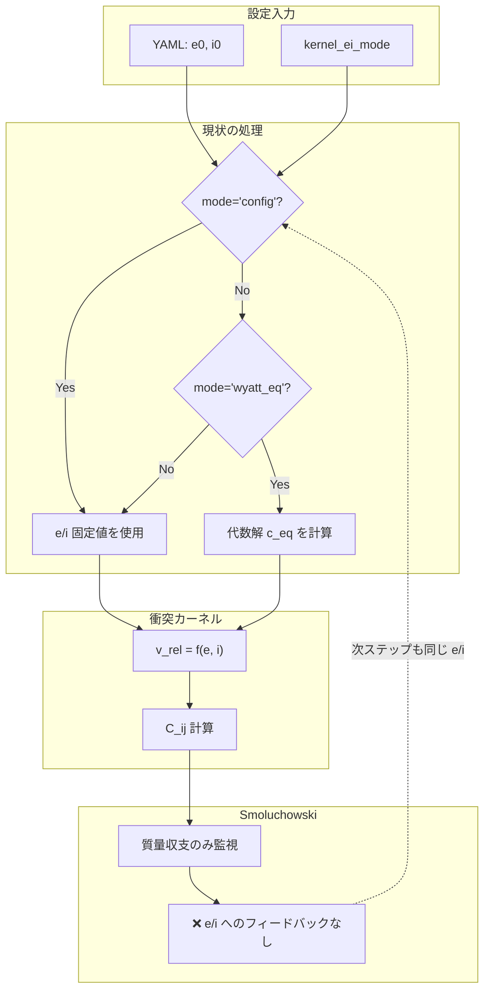
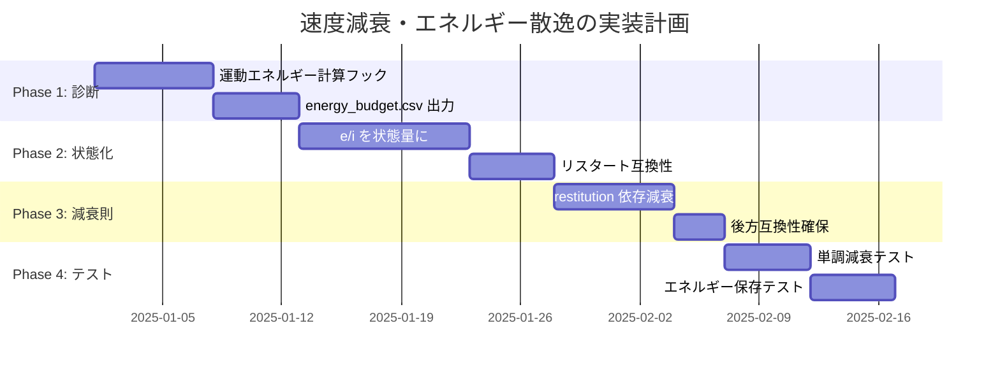

# 衝突による速度減衰・エネルギー散逸の未実装事項

> 作成日: 2025-12-24  
> 区分: 課題整理（衝突後の速度減衰・熱化を未考慮）

---

## 📌 このドキュメントについて

**対象読者**: プロジェクト外部の研究者・開発者で、本シミュレーションの速度分散・エネルギー散逸モデルを理解したい方

**関連ドキュメント**:
- [analysis/equations.md](../../analysis/equations.md) — 物理式の正式定義（式番号 E.xxx）
- [analysis/introduction.md](../../analysis/introduction.md) — 科学的背景と研究目的
- [analysis/glossary.md](../../analysis/glossary.md) — 用語集・記号規約
- [docs/plan/20251223_fragmentation_model_summary.md](20251223_fragmentation_model_summary.md) — 破砕モデルのまとめ

`docs/plan/` に衝突で失われる運動エネルギー（熱化）や速度分散の減衰がモデル化されていない現状を整理し、必要な追加実装をメモする。物理仕様の正典は `analysis/` 以下（特に `analysis/equations.md`）を参照すること。

---

## 🔬 科学的背景

### プロジェクト概要

本シミュレーションは、**火星衛星（フォボス・ダイモス）の巨大衝突起源仮説**に基づき、火星ロッシュ限界内（~2.4 火星半径）に形成された高温・高密度ダスト円盤の時間進化を追跡するものです。

### 速度分散の物理的重要性

ダスト円盤内の粒子は、ケプラー軌道からの偏差として **離心率 e** と **軌道傾斜角 i** を持ちます。これらは粒子間の **相対速度 v_rel** を決定し、衝突カスケードの効率に直接影響します：

```
v_rel ≈ v_K × √(e² + i²)
```

ここで v_K はケプラー速度です。

### 速度減衰のメカニズム

実際の衝突円盤では、以下の2つの過程が競合します：

1. **せん断加熱（Shear Heating）**
   - ケプラー差動回転による粒子間の相対運動がエネルギーを供給
   - 速度分散を増大させる効果

2. **非弾性衝突による散逸（Collisional Damping）**
   - 粒子同士の衝突で運動エネルギーが熱に変換
   - **反発係数 ε（coefficient of restitution）** で特徴づけられる
   - 速度分散を減少させる効果

平衡状態では両者がバランスし、**平衡速度分散 c_eq** が決まります。

---

## 📖 主要用語解説

| 用語 | 英語 | 説明 |
|------|------|------|
| **離心率 e** | Eccentricity | 楕円軌道の扁平度。e=0 で完全な円軌道 |
| **軌道傾斜角 i** | Inclination | 軌道面と基準面（赤道面）のなす角 |
| **速度分散** | Velocity dispersion | 粒子集団の平均速度からのばらつき。e, i に比例 |
| **相対速度 v_rel** | Relative velocity | 衝突する2粒子間の速度差 |
| **反発係数 ε** | Coefficient of restitution | 衝突前後の相対速度比。ε=1 で完全弾性、ε=0 で完全非弾性 |
| **せん断加熱** | Shear heating / Viscous stirring | ケプラー差動回転による速度分散の増加 |
| **衝突減衰** | Collisional damping | 非弾性衝突による運動エネルギーの散逸 |
| **平衡速度分散 c_eq** | Equilibrium velocity dispersion | せん断加熱と衝突減衰がバランスした状態の速度分散 |
| **熱化** | Thermalization | 運動エネルギーが熱に変換されること |

---

## 現状（コードの挙動）

### 処理フロー概要



### 詳細

- 0D 衝突カーネルは e/i を入力パラメータとして毎ステップ解釈するだけで、衝突結果を e/i にフィードバックしない。`kernel_ei_mode='config'` では YAML の e0/i0 をそのまま、`'wyatt_eq'` では光学的厚さと restitition を使った代数解を求めるのみ。[marsdisk/physics/collisions_smol.py:379–447][marsdisk/physics/collisions_smol.py:586–744]
- 上記 e/i を使って v_rel と C_ij を計算するが、Smol ステップは質量収支のみを監視し、運動エネルギーの減衰や熱化を出力しない。[marsdisk/physics/smol.py:146–276]
- `solve_c_eq` はせん断加熱と非弾性衝突の平衡速度分散を固定点で解くが、結果を時系列に積み下げたり、衝突イベントで更新したりしない。[marsdisk/physics/dynamics.py:60–118]
- ランタイム側でも e0/i0 を初期値として毎ステップ渡すだけで、衝突で速度が落ちる描像は実装されていない。[marsdisk/run.py:3015–3056]

## 問題点

### 概念図：現状と理想の比較

```
【現状】                              【理想】
┌─────────────────┐                   ┌─────────────────┐
│ e/i = 固定値    │                   │ e/i(t) = 状態量 │
│ (YAML設定)      │                   │ (時間発展)      │
└────────┬────────┘                   └────────┬────────┘
         │                                     │
         ▼                                     ▼
┌─────────────────┐                   ┌─────────────────┐
│ v_rel 計算      │                   │ v_rel 計算      │
└────────┬────────┘                   └────────┬────────┘
         │                                     │
         ▼                                     ▼
┌─────────────────┐                   ┌─────────────────┐
│ 衝突 (Smol)     │                   │ 衝突 (Smol)     │
│ → 質量変化のみ  │                   │ → 質量変化      │
│   追跡          │                   │ → エネルギー散逸│
└────────┬────────┘                   │ → e/i 更新     │
         │                            └────────┬────────┘
         ▼                                     │
    【フィードバック                           ▼
      なし】                             【フィードバック
                                          あり】
```

### 具体的な問題

1. **速度減衰の欠如**: 衝突後も e/i が固定のままなので、衝突が頻発する高τ条件で速度分散が自然に下がる物理が再現されない。
2. **エネルギー散逸の未計測**: 衝突で失われる運動エネルギーを熱やブローアウト・剥ぎ取りなどのチャネルに割り振る診断がなく、エネルギーバランスが追跡できない。
3. **回帰テストの欠落**: 速度減衰やエネルギー散逸を検証する pytest が存在せず、将来導入しても退行検知が難しい。

## 影響

### 定量的影響の見積もり

| 条件 | 現状の挙動 | 想定される誤差 |
|------|-----------|---------------|
| 低 τ (τ < 0.1) | 衝突頻度が低いため影響小 | < 10% |
| 中 τ (0.1 < τ < 1) | v_rel が過大評価される可能性 | 10–50% |
| 高 τ (τ > 1) | v_rel が大幅に過大評価、C_ij・破片生成率に顕著な影響 | > 50% |

### 詳細

- 衝突頻度が高いケースで v_rel が実際より高く維持され、C_ij・破片生成率が過大になるリスク。
- 熱化や速度減衰を前提とした感度試験（係数 of restitution 変更など）が、カーネル入力を変えるだけの静的効果に矮小化される。

## 対応案（ラフスコープ）

### 実装ロードマップ



### 詳細

1) **軽量診断の追加**: Smol ステップ前後の運動エネルギー（∑½ m v_rel^2）を計算し、`checks/energy_budget.csv` に散逸量とチャネル別内訳（衝突散逸・ブローアウト・昇華など）を記録する。  
2) **速度フィードバック**: 衝突時に restitition を用いて e/i を減衰させる簡易更新則を導入し、`run_zero_d` で e/i を状態量として進化させる（クリップと下限を明示）。  
3) **テスト整備**: (i) 衝突のみの箱で e/i が単調減衰すること、(ii) 散逸ログの総量が指定チャネルの合計と一致することを閾値付きで確認する pytest を追加。  

## すぐに検討したいタスク（提案）
- [ ] Smol 側に運動エネルギー計算フックを追加し、デフォルト OFF の診断トグルを YAML で外出し。
- [ ] e/i を状態化するためのラン時系列格納フィールドとリスタート互換性チェックを設計。
- [ ] restitution 依存の減衰則をスキーマ化し、既存 `kernel_ei_mode` と後方互換を確保。

## 関連ドキュメント・コード参照
- 物理式: [analysis/equations.md](../../analysis/equations.md)
- 速度分散ヘルパー: [marsdisk/physics/dynamics.py](../../marsdisk/physics/dynamics.py):60–118
- 衝突カーネルの e/i 適用: [marsdisk/physics/collisions_smol.py](../../marsdisk/physics/collisions_smol.py):379–744
- Smol 質量収支チェック: [marsdisk/physics/smol.py](../../marsdisk/physics/smol.py):146–276
- ラン時の e/i 適用箇所: [marsdisk/run.py](../../marsdisk/run.py):3015–3056

---

## 📚 参考文献

### 速度分散・衝突減衰の理論

| 略称 | 完全引用 | 使用箇所 |
|------|---------|----------|
| **Ohtsuki+02** | Ohtsuki, K., Stewart, G.R., & Ida, S. (2002). *Evolution of Particle Velocity Dispersion in a Circumplanetary Disk.* Icarus, 155, 436–455. [DOI](https://doi.org/10.1006/icar.2001.6741) | 平衡速度分散 c_eq の理論 |
| **Goldreich+04** | Goldreich, P., Lithwick, Y., & Sari, R. (2004). *Planet Formation by Coagulation.* ARA&A, 42, 549–601. [DOI](https://doi.org/10.1146/annurev.astro.42.053102.134004) | せん断加熱・衝突減衰の基礎理論 |
| **Wyatt+11** | Wyatt, M.C., Clarke, C.J., & Booth, M. (2011). *Debris disk size distributions.* CMDA, 111, 1–28. [DOI](https://doi.org/10.1007/s10569-011-9356-0) | 衝突平衡・速度分散スケーリング |

### リング・円盤力学

| 略称 | 完全引用 | 使用箇所 |
|------|---------|----------|
| **Brahic77** | Brahic, A. (1977). *Systems of Colliding Bodies in a Gravitational Field.* A&A, 54, 895–907. | 衝突リングの速度分散進化 |
| **Salo95** | Salo, H. (1995). *Simulations of Dense Planetary Rings.* Icarus, 117, 287–312. [DOI](https://doi.org/10.1006/icar.1995.1157) | N体シミュレーションによる検証 |

### 反発係数

| 略称 | 完全引用 | 使用箇所 |
|------|---------|----------|
| **Bridges+84** | Bridges, F.G., Hatzes, A., & Lin, D.N.C. (1984). *Structure, stability and evolution of Saturn's rings.* Nature, 309, 333–335. | 氷粒子の反発係数測定 |
| **Supulver+95** | Supulver, K.D., Bridges, F.G., & Lin, D.N.C. (1995). *The Coefficient of Restitution of Ice Particles.* Icarus, 113, 188–199. [DOI](https://doi.org/10.1006/icar.1995.1018) | 速度依存の反発係数 |

---

## 🔗 関連ドキュメント

- **物理式の正式定義**: [analysis/equations.md](../../analysis/equations.md)
- **用語集**: [analysis/glossary.md](../../analysis/glossary.md)
- **破砕モデルまとめ**: [docs/plan/20251223_fragmentation_model_summary.md](20251223_fragmentation_model_summary.md)
- **計算フロー図**: [analysis/physics_flow.md](../../analysis/physics_flow.md)
- **シンク物理のコールグラフ**: [analysis/sinks_callgraph.md](../../analysis/sinks_callgraph.md)
