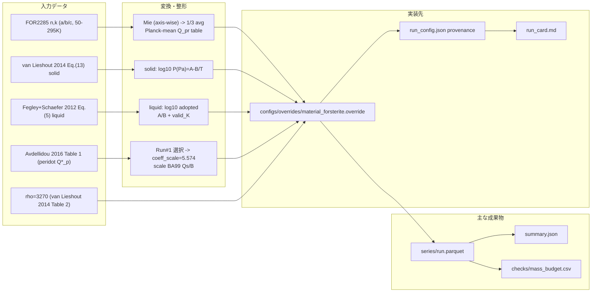

# フォルステライト統一モード作成プラン（Phase 1）

> **作成日**: 2026-01-02  
> **更新日**: 2026-01-10  
> **ステータス**: 更新（HKL: van Lieshout+2014 [solid] / Fegley+2012 [liquid] / α: van Lieshout Table 3 / n,k: FOR2285）  
> **対象**: 0D 標準設定（`configs/base.yml`）の相別物性設計（フォルステライト一本化）  

---

## 背景

現行の `configs/base.yml` は、密度・破壊強度・光学・蒸気圧（Hertz–Knudsen–Langmuir; HKL）などの物性が、別々の前提（材料・相・温度域）から来ている混在状態です。  
今回のシミュレーション時間制約とデータ取得性の観点から、**材料をフォルステライト（Mg2SiO4）に寄せ、固相・液相を同一材料で扱う**ことを Phase 1 の目標にします。

---

## 目的（Phase 1 で確定させること）

1. **光学（⟨Q_pr⟩）**  
   フォルステライトの光学定数（n,k）を 0.08–1000 µm で読み込み、粒径 a ごとに ⟨Q_pr⟩ を生成できる状態にする。

2. **質量フラックス（HKL）**  
   フォルステライトの **固相・液相**それぞれについて、全蒸気圧の温度依存式を HKL 計算に載せる。  
   固相は `log10 P(Pa)=A−B/T` 形式への変換係数まで確定済み。  
   液相は `log` の底が本文で未明示だが、**運用として log10 を採用**して A/B 変換を行う。

3. **相判定（固/液の切替）**  
   固相↔液相の切替温度を、文献の根拠つきで `run_config.json` に記録できる形にする。

---

## 依存データ・準備タスク（Phase 1）

- **n,k（FOR2285）**  
  Jena の FOR2285 データ（a/b/c 軸、295 K）を取得し、3列テキストとして読み込む。  
  等方化（異方性の扱い）は「軸ごとの光学計算を行い、1/3 平均する」方針で確定する（根拠は下記の検証済み一覧）。

- **HKL（全蒸気圧）**  
  `data/forsterite_material_data/forsterite_material_properties.json` の値を正として、  
  固相は van Lieshout et al. (2014) Eq.(13)、液相は Fegley & Schaefer (2012) Eq.(5) を採用する。  
  固相は `log10 P(Pa)=A−B/T` への変換係数（A_fit/B_fit）まで確定済み。  
  液相は `log` の底が本文で未明示だが、**運用として log10 を採用**し、  
  その判断を provenance に残す（Appendix B 参照）。
- **液相 Pvap（Eq.(5) 実装用）**  
  `data/forsterite_material_data/forsterite_liquid_pvap_eq5.json` / `.csv` に  
  Eq.(5) の `log10(P_bar)=A−B/T` とみなす運用を記録済み（bar→Pa 変換込み）。  
  本文で底が明示されていない点は provenance に明記する。
- **α（蒸発/凝縮係数）**  
  van Lieshout et al. (2014) Table 3 の α=0.1 を採用し、Phase 1 は **α=0.1 一定**で運用する（同表では Gail 2010 を参照）。
- **密度（ρ）**  
  `forsterite_material_properties.json` の `rho_kg_m3=3270` を採用する（van Lieshout et al. 2014, Table 2）。
- **Q_D* 候補（proxy）**  
  `data/forsterite_material_data/forsterite_qdstar_candidates_peridot_avdellidou2016_table1.json` / `.csv` に  
  peridot projectile の Q*_p 値（J/kg）を収録済み。**Phase 1 は Run#1 を baseline に採用**し、  
  `qstar` 既定係数をスケーリングして Q_D* を合わせる（詳細は「実装方針」参照）。

---

## 検証済み一覧（確定データの詳細）

### 1) FOR2285 forsterite optical constants（n,k）

|項目|内容|
|---|---|
|出典/URL|Jena FOR2285 “Forsterite – Optical Constants”（配布ページ）: https://www2.astro.uni-jena.de/FOR2285/en/forsterite_optical.php|
|ファイル名|`fors_a_295_nk.dat`, `fors_b_295_nk.dat`, `fors_c_295_nk.dat`（各 a/b/c 軸）|
|波長範囲|実データで **0.08–1000 µm**（a/b/c の各ファイル）|
|数表 or 図|**数表**（3列のASCIIデータ）|
|形式|3列（λ[µm], n, k）。ヘッダなし。|
|ローカル配置|`data/forsterite_material_data/nk_FOR2285/` に `fors_{a,b,c}_{50,75,100,150,200,295}_nk.dat` を保存済み（空白区切り3列）。統合表は `data/forsterite_material_data/FOR2285_forsterite_nk_long.csv`、マニフェストは `data/forsterite_material_data/FOR2285_forsterite_nk_manifest.json`。|
|等方化の根拠|異方性結晶の吸収断面積（または効率）を **a/b/c 軸で計算して 1/3 平均**する考え方が、Zeidler et al. (2015) の式（Eq.(7)）で明示されている。Phase 1 は「軸別に Mie を回して Q_pr を 1/3 平均」を採用する。|
|利用条件（明文化されている範囲）|FOR2285 配布ページ本文には明示ライセンス条文が見当たらない。Jena の OCDB 一般ページでは「please cite ...」の引用要請があるため、**配布ページURLと原典論文の引用**を provenance に残す（ライセンス条文は未確認）。|

補足（温度依存）: FOR2285 は 50–295 K の温度グリッド（50/75/100/150/200/295 K）を提供しているが、**溶融域（>295 K）の光学定数は直接与えない**。高温依存の光学定数（例: Zeidler et al. 2015）は存在するが、対象が「低Feオリビン/エンスタタイト」かつ 5–50 µm・10–928 K の範囲であり、Phase 1 の統一データ（0.08–1000 µm, forsterite）を直接置換はしない。

---

### 2) 固相：全蒸気圧（HKL用）

**原典**: van Lieshout et al. (2014) arXiv:1410.3494

|項目|内容|
|---|---|
|原式（本文）|Eq.(13): `pv = exp( −A/T + B )`（pv: dyn cm−2）|
|係数（固相）|A=65308, B=34.1（Table 3: crystalline forsterite）|
|valid_K（根拠）|1673–2133 K（Table 3 の係数決定範囲）|
|HKL用の式（質量フラックス）|Eq.(12): `J(T)=α pv(T) sqrt( μ m_u / (2π k_B T) )`|
|α（蒸発/凝縮係数）|α=0.1（Table 3; Gail 2010 を参照と注記）|
|μ（kg/mol）|μ=0.140694 kg/mol（Table 3; 分子量近似と本文注記）。実装は `R_GAS` と molar mass（kg/mol）を使う式形で統一。|
|実装用 A/B（log10 P(Pa)）|`log10 P(Pa)=13.809441833 − 28362.904024 / T`（dyn cm−2→Pa 変換を含む）|
|ローカル参照|`data/forsterite_material_data/forsterite_material_properties.json`|

---

### 3) 液相：全蒸気圧（HKL用）

**原典**: Fegley & Schaefer (2012) arXiv:1210.0270（Treatise on Geochemistry 章の可能性あり）

|項目|内容|
|---|---|
|原式（本文）|Eq.(5): `log Pvap(bar) = 6.08 − 22409/T`（molten forsterite, total pressure）|
|valid_K（根拠）|2163–3690 K（Eq.(5) の適用範囲）|
|log の底|本文で明示されていないが、**運用として log10 を採用**し provenance に記録する|
|実装用 A/B（log10 P(Pa)）|`log10 P(Pa)=11.08 − 22409 / T`（bar→Pa 変換を含む）|
|μ（kg/mol）|Phase 1 は固相と同じ μ=0.140694 kg/mol を採用（`R_GAS` と molar mass を使う式形）。|
|ローカル参照|`data/forsterite_material_data/forsterite_material_properties.json`, `data/forsterite_material_data/forsterite_liquid_pvap_eq5.json`|

---

### 4) 相判定温度（solid↔liquid）

**原典**: Fegley & Schaefer (2012) の molten forsterite の適用下限（2163 K）を採用

|項目|内容|
|---|---|
|根拠|Eq.(5) の適用温度下限が 2163 K（融点として使用）|
|運用値（Phase 1）|`T_switch = 2163 K`|
|補足|固相の係数決定範囲は 2133 K までで、液相の下限 2163 K との 30 K ギャップがある。**運用は「T<2163 K は固相式（2133–2163 K は小さな外挿）」とし、T≥2163 K で液相式に切替**。`T_condense_K=2162 K` / `T_vaporize_K=2163 K` として **最小限のヒステリシス**にする（スキーマ上 `T_vaporize_K > T_condense_K` が必要なため）。`gap_policy="use_solid_extrapolate"` を run_config に記録する。|

---

### 5) α（蒸発/凝縮係数）

**原典**: van Lieshout et al. (2014) arXiv:1410.3494（Table 3）

|項目|内容|
|---|---|
|記述|Table 3 に α=0.1（Gail 2010 を参照と注記）|
|運用値（Phase 1）|`α = 0.1`（一定）|
|注意|温度依存や相依存は Phase 2 以降で検討する|

---

### 6) Q_D*（破壊強度）候補（peridot proxy）

**原典**: Avdellidou et al. (2016) arXiv:1612.05060, Table 1

|項目|内容|
|---|---|
|定義|catastrophic disruption は `M_lf/M_im = 0.5`、`Q_im = 0.5 v^2`（v: m/s）|
|候補値（Q*_p, J/kg）|Run#1: `6.46e5`, Run#2: `2.40e5`, Run#3: `2.58e6`（peridot projectile）|
|Phase 1 採用|**Run#1（6.46e5 J/kg）**を baseline とし、Run#2/3 は感度テスト用に残す|
|注意|Table 1 は **peridot projectile** の Q*_p を示し、ターゲットは水氷/炭酸塩など。forsterite 直系の Q_D* ではないため **proxy として扱う**。|
|ローカル参照|`data/forsterite_material_data/forsterite_qdstar_candidates_peridot_avdellidou2016_table1.json`, `.csv`|

---

## 実装方針（run_config.json への反映）

### キー整合（run_config.json）

- 実際の出力キーは `run_config.json.radiation_provenance` と `run_config.json.sublimation_provenance` を正とする。  
  以下の例にある `optical_constants` / `sublimation (HKL)` は**概念スキーマ**であり、実装では次の対応で記録する。
- 対応の方針:
  - `optical_constants.*` → `run_config.json.radiation_provenance.nk.*`
  - `sublimation (HKL).pvap_solid` → `run_config.json.sublimation_provenance.solid_pvap.*`
  - `sublimation (HKL).pvap_liquid` → `run_config.json.sublimation_provenance.liquid_pvap.*`
  - `sublimation (HKL).alpha` / `mu_kg_mol` → `run_config.json.sublimation_provenance.alpha` / `mu_kg_mol`
- もし既存スキーマで上記のサブキーが未定義の場合は、`run_config.json` 側で追加し、**run_card にも同じ provenance を併記**して冗長化する。

---

### Q_D* 実装決定（proxy → qstar）

- **採用値**: Avdellidou 2016 Table 1 の Run#1（`Q*_p=6.46e5 J/kg`）を baseline とする。  
- **スケーリング方針**: `marsdisk.physics.qstar` の既定係数（BA99, ba99_cgs）を **係数スケール**で調整する。  
  参照条件は `s_ref=1e-6 m`, `v_ref=3 km/s`, `rho=3270 kg/m^3`。  
  既定の `Q_D*` は **1.1589589e5 J/kg** なので、  
  `coeff_scale = 6.46e5 / 1.1589589e5 = 5.574` を採用する。  
- **実装**: `qstar.override_coeffs=true` とし、  
  `qstar.coeff_table` は **既定テーブルを係数スケールで再計算**したものを使用する  
  （`Qs` と `B` のみ倍率適用、`a_s` と `b_g` は不変）。  
  参照条件（s_ref/v_ref/rho_ref/coeff_scale）は run_card に記録する。

---

## 役割分担とデータ受け渡し

- **Codex（本リポジトリ担当）**: 具体値は外部文献にアクセスせず、**ChatGPT が提供した値・式・表の根拠をそのまま実装**し、既存スキーマとの整合を担保する。  
- **ChatGPT（文献調査担当）**: 文献・公式ページから数値・式・適用範囲を確定し、**再現可能な形でデータを提供**する。推測は禁止。未確定は `UNKNOWN` と明記する。  

**受け渡しフォーマット（いずれかで提出）**
- **CSV（推奨）**: 実装に必要な値・単位・条件・根拠位置を1行で提供する。  
  ヘッダー: `item_id,parameter,value,value_min,value_max,value_uncertainty,units,conditions,phase,target_path,source_authors_year,doi_or_url,exact_location,evidence_quote,status,notes`
- **run_config.json 用ブロック**: `radiation_provenance.nk.*` / `sublimation_provenance.*` に対応する JSON 断片として提出する。  

**未確定の扱い**
- ChatGPT 側で確定できない場合は `status=unknown` として提出し、Codex 側で `UNKNOWN_REF_REQUESTS` に登録して運用する。  

### 推奨する run_config.json の provenance 記録項目（例）

- **optical_constants**
  - dataset: `"FOR2285"`
  - url: `"https://www2.astro.uni-jena.de/FOR2285/en/forsterite_optical.php"`
  - retrieved_utc: `"YYYY-MM-DD"`
  - files:
    - `"data/forsterite_material_data/nk_FOR2285/fors_a_295_nk.dat"`, `"data/forsterite_material_data/nk_FOR2285/fors_b_295_nk.dat"`, `"data/forsterite_material_data/nk_FOR2285/fors_c_295_nk.dat"`
  - file_manifest: `"data/forsterite_material_data/FOR2285_forsterite_nk_manifest.json"`
  - combined_table: `"data/forsterite_material_data/FOR2285_forsterite_nk_long.csv"`
  - columns: `["wavelength_um","n","k"]`
  - wavelength_um_min/max: `0.08 / 1000.0`
  - license_text: `"UNKNOWN"`
  - license_checked_urls:
    - `"https://www2.astro.uni-jena.de/FOR2285/en/forsterite_optical.php"`
  - license_checked_notes: `"No explicit license text on FOR2285 page; OCDB general page requests citation."`
  - anisotropy_handling:
    - method: `"axis-wise Mie then 1/3 average"`
    - evidence: `"Zeidler et al. (2015) Eq.(7), DOI:10.1088/0004-637X/798/2/125"`

- **sublimation (HKL)**
  - mu_unit: `"kg/mol"`
  - mass_flux_formula_variant: `"uses_R_and_molar_mass"`
  - gap_policy: `"use_solid_extrapolate"`
  - solid_valid_max_K: `2133`
  - liquid_valid_min_K: `2163`
  - pvap_solid:
    - equation_printed: `"van Lieshout+2014 Eq.(13): pv = exp( −A/T + B ) dyn cm−2"`
    - A: `65308`
    - B: `34.1`
    - A_log10_Pa: `13.809441833`
    - B_over_T: `28362.904024`
    - valid_K: `[1673,2133]`
    - unit: `"dyn cm−2"` (converted to Pa in code)
    - doi_or_url: `"arXiv:1410.3494"`
  - pvap_liquid:
    - equation_printed: `"Fegley+Schaefer 2012 Eq.(5): log Pvap(bar) = 6.08 − 22409/T"`
    - log_symbol: `"log"`
    - log_base_explicit_in_text: false
    - log_base: `"log10 (adopted)"`
    - A_log10_Pa: `11.08`
    - B_over_T: `22409`
    - valid_K: `[2163, 3690]`
    - doi_or_url: `"arXiv:1210.0270"`
    - source_files:
      - `"data/forsterite_material_data/forsterite_liquid_pvap_eq5.json"`
      - `"data/forsterite_material_data/forsterite_liquid_pvap_eq5_parameters.csv"`
    - note: `"log base not explicit in paper; simulation adopts log10 and records the choice"`
  - alpha:
    - value: `0.1`
    - evidence: `"van Lieshout+2014 Table 3 (note: Gail 2010)"`
  - mu_kg_mol:
    - value: `0.140694`
    - evidence: `"van Lieshout+2014 Table 3 (compound molecular weight approximation)"`

- **qstar (Q_D* proxy)**
  - candidates_file: `"data/forsterite_material_data/forsterite_qdstar_candidates_peridot_avdellidou2016_table1.csv"`
  - selected_run_id: `"Run#1"`
  - qdstar_value_J_per_kg: `6.46e5`
  - ref_s_m: `1e-6`
  - ref_v_kms: `3.0`
  - ref_rho_kg_m3: `3270`
  - coeff_scale: `5.574`
  - doi_or_url: `"arXiv:1612.05060"`
  - note: `"peridot projectile proxy; coefficients scaled from default BA99 table"`

---

## 実装タスク（チェックリスト）

- [x] `configs/base.yml` に対する overrides（例: `configs/overrides/material_forsterite.override`）を用意し、`forsterite_material_properties.json` の ρ・HKL・α・μ・相判定温度・Q_pr テーブルを差し替える  
- [x] FOR2285 の a/b/c 軸 n,k を読み込み、**軸別 Mie → 1/3 平均**で ⟨Q_pr⟩ テーブルを生成  
- [x] `run_config.json.radiation_provenance.nk` に、URL・ファイル名・波長範囲・等方化手順・採用温度を記録  
- [x] `forsterite_liquid_pvap_eq5_parameters.csv` の A/B/valid_K を採用し、`run_config.json.sublimation_provenance.liquid_pvap` に log10 採用を明記  
- [x] `run_config.json.sublimation_provenance` に、van Lieshout 2014（solid）/ Fegley 2012（liquid）の式・係数、α、μ、valid_K、log_base 採用を記録  
- [x] `forsterite_qdstar_candidates_peridot_avdellidou2016_table1.csv` の Run#1 を採用し、`coeff_scale=5.574` で既定係数を再計算した `qstar.coeff_table` を用意する  
- [x] Q_D* の参照条件（`s_ref=1e-6 m`, `v_ref=3 km/s`, `rho_ref=3270`）と Run#1 を run_card に記録する  
- [x] **Q_D\* テーブル化**：既定の BA99 テーブル（v_ref=1–7 km/s）に `coeff_scale=5.574` を適用した数表を overrides に埋める（`Qs/B`のみスケール、`a_s/b_g`は据え置き）  
- [x] **sublimation 設定の明示化**：`psat_model="clausius"`、`A/B`、`A_liq/B_liq`、`valid_K/valid_liquid_K`、`psat_liquid_switch_K=2163` を overrides で固定  
- [x] **Q_pr テーブルの参照先固定**：`data/qpr_planck_forsterite_mie.csv` を material overrides に設定し、生成条件（295 K, a/b/c 1/3 平均）を run_card に明記  
- [x] **provenance の実値記録**：log10 採用、Q_D\* Run#1 採用、`coeff_scale=5.574` などを run_card に残す  
- [x] 0D 実行を行い、`series/run.parquet` / `summary.json` / `checks/mass_budget.csv` を確認  

---

## 作成フロー図（データ→実装）

---

## 受入条件（Phase 1）

- `summary.json` の `mass_budget_max_error_percent` が 0.5% 以内  
- `series/run.parquet` に `a_blow`, `beta_at_smin_config`, `beta_at_smin_effective`, `M_out_dot`, `mass_lost_by_blowout`, `mass_lost_by_sinks` が出力される  
- `run_config.json.radiation_provenance.nk` に provenance（URL/ファイル名/波長範囲/等方化/採用温度）が記録される  
- `run_config.json.sublimation_provenance` に HKL の式/係数、α、μ、valid_K、log_base 採用の根拠が記録される  
- Q_D* の採用 Run#1 と係数スケール（5.574）、出典（Avdellidou 2016 Table 1）が run_card に明記される  
- `checks/mass_budget.csv` が生成され、`error_percent` が 0.5% 以内  

---

## 次に埋めるべき内容（実装前に明文化すべき項目）

### 文献参照が必要な項目（確定待ち）

- **FOR2285 利用条件**：明示ライセンス条項が見当たらないため、配布元/README の確認が必要  
- **forsterite 直系の Q_D***：peridot proxy ではなく forsterite 専用値を採用する場合は追加文献が必要  

### 文献参照なしで確定できる項目（今回確定）

- **overrides とキーの具体マッピング**：`configs/overrides/material_forsterite.override` を用意し、`configs/base.yml` を上書きする  
- **密度（ρ）**：`forsterite_material_properties.json` の `rho_kg_m3=3270` を採用する  
- **相判定の運用**：`phase.thresholds.T_condense_K=2162` / `T_vaporize_K=2163` とし、**最小限のヒステリシス**で運用する（スキーマ制約により同値不可）  
- **固相/液相のギャップ処理**：2133–2163 K は固相式を外挿で使用し、2163 K で液相へ切替する  
- **液相スイッチ**：`sinks.sub_params.psat_liquid_switch_K` は `phase.thresholds.T_vaporize_K` と同値に固定する  
- **Q_D*（qstar.*）の運用**：Run#1（peridot proxy）を baseline 採用し、`coeff_scale=5.574` で既定係数を調整する  
- **HKL パラメータの具体キー**：`sinks.sub_params.A/B/A_liq/B_liq/alpha_evap/mu/valid_K/valid_liquid_K/psat_liquid_switch_K` に割り当てる  
- **run_config provenance の実キー**：`radiation_provenance.nk.*` と `sublimation_provenance.*` に記録する（概念スキーマではなく実キーで運用）  
- **FOR2285 の運用処理**：ライセンスが未確認のため `UNKNOWN_REF_REQUESTS` へ登録し、run_card に「引用要請のみ確認」と明記する  

---

## リスクと注意点（Phase 1 の範囲）

1. **液相蒸気圧式の log 底（本文明示なし）**  
   Fegley & Schaefer (2012) Eq.(5) の `log` の底は本文で明示されていないため、  
   **運用として log10 を採用**し、その判断を run_config/run_card に記録する。

2. **固相/液相の valid_K ギャップ（2133–2163 K）**  
   固相の係数決定範囲は 2133 K、液相の下限は 2163 K で 30 K の空白がある。  
   Phase 1 は `T_switch=2163 K` を優先し、**2133–2163 K は固相式を外挿で適用**する。

3. **α の温度依存**  
   van Lieshout et al. (2014) の α=0.1 は定数採用であり、温度依存は未導入。Phase 2 で感度解析の対象にする。

4. **光学定数の温度依存・組成依存**  
   FOR2285 は 50–295 K の純 forsterite（a/b/c 軸）。高温・不純物（Fe含有）での光学定数は別途扱いが必要。

5. **Q_D* の proxy 依存**  
   Avdellidou et al. (2016) Table 1 の peridot projectile 値を使う場合、  
   ターゲット材（氷/炭酸塩）依存や組成差が残るため、forsterite 直系値より不確実性が大きい。  
   さらに `s_ref=1e-6 m` で係数スケールを決めるため、他サイズ域での不確実性が残る。

---

## 未確定（UNKNOWN）一覧（Phase 1 実装に残るギャップ）

|項目|状況|次に確認するもの|
|---|---|---|
|FOR2285 の明示ライセンス条文|配布ページ本文に明示条文は見当たらない。OCDB 一般ページの「please cite」要請のみ確認済み|Jena 側の利用条件ページ/README があるか、または配布元へ確認（現状は「引用要請のみ確認」を provenance に残す）|
|forsterite の Q_D*（破壊強度）|peridot proxy 候補は入手済みだが、forsterite 直系の値は未確定|forsterite 専用の Q_D*(R) 形式の文献があれば確認|

---

## Appendix B. A/B 変換メモ（van Lieshout 2014 / Fegley 2012 → run_config 用）

### B1. van Lieshout et al. (2014) 固相（exp 形式 → log10 Pa）

出発点（dyn cm−2）  
`pv = exp( −A/T + B )`

1 dyn cm−2 = 0.1 Pa より、

`log10 P(Pa) = (B/ln10 − 1) − (A/ln10)/T`

計算結果（Phase 1）:
- `A_fit = 13.8094418329`
- `B_fit = 28362.904024`

### B2. Fegley & Schaefer (2012) 液相（log 表記）

出発点（bar）  
`log Pvap(bar) = 6.08 − 22409/T`

log の底が本文で明示されていないが、**運用として log=log10 を採用**:

`log10 P(Pa) = 11.08 − 22409/T`（1 bar = 1e5 Pa）

log=ln の場合は別換算が必要だが、本計画では log10 採用を run_config に明記する。  
実装用係数は `data/forsterite_material_data/forsterite_liquid_pvap_eq5_parameters.csv` に集約済み。

---

## Appendix C. 参考（将来用・今回の統一に直接は使わない）

- Costa et al. (Icarus, Eq.(33)) は Fo95Fa5 について、融点以下での全蒸気圧近似式 `log P_T(bar)=6.9908−22519/T` を提示している。純 forsterite ではないため Phase 1 の主パラメータには採用しないが、同温度域でのオーダー確認に利用できる。
